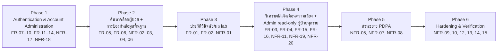

# Release Plan

แผนแบ่ง phase/release ของโปรเจกต์ track-ncds จัดกลุ่ม FR/NFR ทั้งหมดจาก [[backlog]] (FR-01–FR-16,
NFR-01–NFR-20) ให้เป็นลำดับการพัฒนาที่สอดคล้องกับ dependency เชิงธุรกิจ/เทคนิคที่ระบุใน
[[feature-list]] และ [[architecture]] (Component Diagram, ลำดับ journey) แผนนี้**ไม่ผูก tech stack**
— งานย่อยที่แตกต่อจากแผนนี้ (ดู `docs/01-requirements/03-task/`) เขียนด้วยภาษาเชิงพฤติกรรม/ผลลัพธ์
เท่านั้น

**สถานะ:** ยืนยันโดยผู้ใช้แล้วผ่าน AskUserQuestion ในเทรดหลัก (คำตอบ: "ยืนยันตามแผนนี้") เมื่อ
2026-09-24 — เป็นฉบับแรกของเอกสารนี้ (ก่อนหน้านี้ `02-plan/`/`03-task/` ยังว่างเปล่า)

**อัปเดต 2026-09-24 (รอบสอง):** เพิ่มรหัสใหม่จาก spec
[[20260924-01-admin-role-account-management]] (FR-11–FR-15, NFR-19, NFR-20) และ FR-16 (ยืนยัน/แก้ไข
ผลประเมินความเสี่ยง เพิ่มในเอกสาร spec ฉบับแรก) เข้าสู่แผนเดิม — ผู้ใช้ยืนยันแล้วผ่าน AskUserQuestion
ในเทรดหลัก (คำตอบ: "ยืนยันตามแผนนี้") ให้**คง 6 phase เดิมไว้ ไม่ renumber/ไม่ rename ไฟล์ task ใดๆ**
โดยขยายขอบเขตของ Phase 1 และ Phase 4 แทนการแทรก phase ใหม่ (เหตุผลละเอียดดูตาราง/หมายเหตุด้านล่าง)

## ภาพรวม

แบ่งเป็น **6 phase** เรียงตามลำดับ dependency เชิงเส้นตรง (Phase N ต้องเสร็จก่อน Phase N+1 จึงเริ่มงาน
หลักได้ แม้บาง task ของ Phase 6 จะเริ่มคู่ขนานกับ Phase 2-5 ได้ในทางปฏิบัติ แต่ปิดจบสมบูรณ์ได้ก็ต่อเมื่อ
feature ที่เกี่ยวข้องพร้อมแล้วเท่านั้น) — NFR-16 (Interoperability — future) เป็น **Won't have** ตามที่
ยืนยันไว้แล้วใน [[feature-list#5. รับประกันคุณภาพเชิงปฏิบัติการของระบบ (Performance, Availability, Clinical Safety, Session Security, Accessibility, Compatibility, Interoperability)|feature-list]]
จึงไม่รวมอยู่ใน phase ใดของแผนนี้

**หมายเหตุสำคัญเรื่องการจัดกลุ่ม:** แผนนี้จัดกลุ่ม FR/NFR แตกต่างจาก 6 ฟีเจอร์ใน [[feature-list]]
บางจุด (แม้ทุกรหัสยังครบถ้วนไม่มีตกหล่น) เพราะการวางแผน phase เน้น dependency ของการพัฒนาจริง ในขณะที่
feature-list จัดกลุ่มเพื่อความเข้าใจเชิงธุรกิจ/เอกสาร ทั้งสองมุมมองไม่จำเป็นต้องตรงกัน 1:1 — จุดที่ต่างมี
ดังนี้:

- ฟีเจอร์ที่ 4 (PDPA, NFR-03–NFR-08) ถูกแยกเป็น 2 phase: ส่วนพื้นฐาน (NFR-03/04/06 — ระดับสูง) อยู่
  Phase 2 ติดกับจุดแรกที่ข้อมูลผู้ป่วยเริ่มไหลเข้าสู่ระบบ ส่วนที่เหลือ (NFR-05/07/08 — ระดับกลาง) อยู่
  Phase 5
- NFR-11 (Clinical Safety Validation) ถูกย้ายจากกลุ่มฟีเจอร์ที่ 5 มาอยู่ Phase 4 ร่วมกับ FR-03/FR-04
  เพราะผูกกับ risk rule engine ของฟีเจอร์นั้นโดยตรง ไม่ใช่ข้อกำหนดคุณภาพทั่วไป
- NFR-01 (แหล่งข้อมูล/Integration) ซึ่งไม่ถูกจัดสรร phase ไว้ชัดเจนในรอบเสนอแผนแรก ถูกกำหนดไว้ที่
  Phase 3 ในฉบับนี้ เนื่องจากเป็นจุดแรกที่ประวัติวินิจฉัย/ผล lab (ข้อมูลจาก HOSxP หรือ mockup) เริ่มถูก
  อ่านเข้าสู่ระบบจริง
- **(อัปเดต 2026-09-24 รอบสอง)** FR-11, FR-12, FR-13, FR-14 (Admin: อนุมัติบัญชี/เปลี่ยน role/ระงับ-
  เปิดใช้งาน/มอบหมายผู้ป่วย — ทั้งหมดมาจาก [[feature-list#7. จัดการบัญชีผู้ใช้งาน สิทธิ์ และการมอบหมายผู้ป่วย (Admin)|feature-list ฟีเจอร์ที่ 7]])
  ถูกดึงเข้ามารวมใน **Phase 1** แทนที่จะแยกเป็น phase ใหม่ต่างหาก เพราะ (ก) FR-11 เข้ามาแทนที่กลไก
  ชั่วคราวที่ Phase 1 เคยใช้ (ผู้ดูแลระบบแก้ไขข้อมูลบัญชีโดยตรงนอกหน้าจอของระบบ) จึงเป็นส่วนขยายธรรมชาติของ
  account lifecycle เดิม ไม่ใช่ฟีเจอร์ใหม่ที่แยกอิสระ (ข) FR-14 (จัดการ PatientAssignment) เป็น
  **hard dependency ของ Operation 0 ใน Phase 2** ซึ่งปัจจุบันยังไม่มีวิธีสร้าง PatientAssignment ใดๆ
  ในระบบเลย ต้องเสร็จก่อน Phase 2 จึงจะใช้งานได้จริง (ค) FR-12/FR-13 เป็นงานจัดการบัญชี/สิทธิ์ล้วนๆ
  ไม่ต้องพึ่งข้อมูลผู้ป่วยหรือฟีเจอร์อื่นใด จึงไม่มีเหตุผลด้าน dependency ให้ต้องเลื่อนไปอยู่ phase หลัง
  Phase 1 ชื่อ phase จึงปรับเป็น "Authentication & Account Administration" (ไม่เปลี่ยนชื่อไฟล์ task)
- **(อัปเดต 2026-09-24 รอบสอง)** FR-15, NFR-19, NFR-20 (Admin ดูประวัติวินิจฉัย/ผล lab/ผลวิเคราะห์
  ความเสี่ยงของผู้ป่วย**ทุกราย**แบบอ่านอย่างเดียว + access-control exception + audit log fail-safe)
  ถูกดึงเข้ามารวมใน **Phase 4** เพราะ FR-15 ต้องมีข้อมูลทั้ง 3 ประเภทพร้อมกันจึงมีความหมาย — ประวัติ
  วินิจฉัย/ผล lab มาจาก Phase 3 และผลวิเคราะห์ความเสี่ยงมาจาก Phase 4 เอง จึงเป็นจุดแรกในลำดับ phase
  ที่ข้อมูลครบทั้งหมดให้ Admin ดูได้จริง อ่านเนื้อหา NFR-19/NFR-20 แล้วพบว่าทั้งสองผูกกับ "การเข้าถึง
  ข้อมูลผู้ป่วยของ Admin" (คือ FR-15) โดยตรง ไม่ใช่การจัดการบัญชี/สิทธิ์ทั่วไป จึงไม่รวมกับ FR-11–14 ใน
  Phase 1
- **(อัปเดต 2026-09-24 รอบสอง)** FR-16 (ยืนยัน/แก้ไขผลประเมินความเสี่ยง — แพทย์/พยาบาล ไม่ใช่ Admin)
  ถูกเพิ่มเข้า **Phase 4** เช่นกัน สอดคล้องกับ [[feature-list#2. วิเคราะห์ แจ้งเตือน และยืนยัน/แก้ไขผลประเมินความเสี่ยงโรคแทรกซ้อน|feature-list ฟีเจอร์ที่ 2]]
  ที่จัดกลุ่มไว้แล้ว เพราะต้องมี risk assessment model ของ Phase 4 อยู่ก่อนจึงจะยืนยัน/แก้ไขผลได้
- **(อัปเดต 2026-09-24 รอบสอง)** Phase 6 ไม่มีรหัสใหม่เพิ่ม แต่ขอบเขตการทดสอบของ NFR-14 (Security
  Rules Verification) ต้องครอบคลุมกฎใหม่ที่เกิดจาก FR-11–15/NFR-19/NFR-20 ด้วย (เช่น สิทธิ์ Admin
  เข้าถึงผู้ป่วยทุกรายโดยไม่มี PatientAssignment, กฎเขียน/อ่าน `patientAssignments` ผ่านการจัดการของ
  Admin) — ดูหมายเหตุเพิ่มเติมในไฟล์ [[phase-6-operational-quality-hardening-tasks]]

## ตารางสรุป Phase ↔ FR/NFR ↔ เหตุผลการจัดลำดับ

| Phase | ชื่อ | FR/NFR ที่ครอบคลุม | เหตุผลการจัดลำดับ |
| --- | --- | --- | --- |
| 1 | [[feature-list#6. สมัครบัญชี เข้าสู่ระบบ และจัดการรหัสผ่านด้วยอีเมล (Authentication)\|สมัครบัญชี/เข้าสู่ระบบ/จัดการรหัสผ่าน]] + [[feature-list#7. จัดการบัญชีผู้ใช้งาน สิทธิ์ และการมอบหมายผู้ป่วย (Admin)\|ส่วนจัดการบัญชี/role/มอบหมายผู้ป่วยของ Admin]] (Authentication & Account Administration) | FR-07, FR-08, FR-09, FR-10, FR-11, FR-12, FR-13, FR-14, NFR-17, NFR-18 | precondition ก่อนฟีเจอร์อื่นทั้งหมดตาม [[architecture]] ("ฟีเจอร์ที่ 6 เป็น precondition ก่อนฟีเจอร์ที่ 1-5 ทั้งหมด") ไม่มีข้อมูลผู้ป่วยเกี่ยวข้อง จึงเริ่มก่อนได้โดยไม่ต้องรอส่วนอื่น — เพิ่ม FR-11–14 (2026-09-24 รอบสอง): FR-11 แทนที่กลไกที่ผู้ดูแลระบบแก้ไขข้อมูลบัญชีโดยตรงนอกหน้าจอของระบบชั่วคราวของ Phase 1 เดิม, FR-14 เป็น hard dependency ของ Operation 0 ใน Phase 2 (ปัจจุบันยังไม่มีวิธีสร้าง PatientAssignment ในระบบ), FR-12/13 ไม่มี dependency ข้อมูลผู้ป่วยจึงทำคู่กันได้ |
| 2 | ค้นหา/เลือกผู้ป่วย + การป้องกันข้อมูลพื้นฐาน | FR-05, FR-06, NFR-02, NFR-03, NFR-04, NFR-06 | FR-05/FR-06 เป็นขั้นตอนแรกสุดของ journey ก่อนเห็นข้อมูลผู้ป่วยรายบุคคลใดๆ ([[feature-list#3. ค้นหา/เลือกผู้ป่วยในความดูแล]]) เป็นจุดแรกที่ข้อมูลระบุตัวตนผู้ป่วยเริ่มไหลเข้าสู่ระบบ จึงดึง NFR-02 (สิทธิ์เข้าถึงรายผู้ป่วย), NFR-03 (lawful basis), NFR-04 (เข้ารหัส), NFR-06 (audit log) ซึ่งเป็นระดับสูงทั้งหมดขึ้นมาก่อนแทนที่จะรอถึง phase PDPA ท้ายๆ |
| 3 | [[feature-list#1. ดูประวัติการวินิจฉัยและผลตรวจ lab ของผู้ป่วย NCD\|ดูประวัติวินิจฉัยและผลตรวจ lab]] | FR-01, FR-02, NFR-01 | ต้องมีการเลือกผู้ป่วยจาก Phase 2 ก่อนเสมอ (precondition ตรงตาม [[feature-list]]) NFR-01 (แหล่งข้อมูล HOSxP/mockup) ถูกจัดไว้ที่นี่เพราะเป็นจุดแรกที่ข้อมูลประวัติวินิจฉัย/ผล lab จริงเริ่มถูกอ่านเข้าระบบ |
| 4 | [[feature-list#2. วิเคราะห์ แจ้งเตือน และยืนยัน/แก้ไขผลประเมินความเสี่ยงโรคแทรกซ้อน\|วิเคราะห์/แจ้งเตือน/ยืนยันแก้ไขผลประเมินความเสี่ยง]] + [[feature-list#7. จัดการบัญชีผู้ใช้งาน สิทธิ์ และการมอบหมายผู้ป่วย (Admin)\|ส่วนดูข้อมูลผู้ป่วยทุกรายของ Admin]] | FR-03, FR-04, FR-15, FR-16, NFR-11, NFR-19, NFR-20 | ต้องมีข้อมูล lab จาก Phase 3 ก่อนจึงวิเคราะห์ความเสี่ยงได้ NFR-11 (Clinical Safety Validation) ย้ายมาจากกลุ่มฟีเจอร์ที่ 5 เพราะผูกกับ risk rule engine ของฟีเจอร์นี้โดยตรง — เพิ่ม FR-16 (2026-09-24 รอบสอง): ต้องมี risk assessment model ของ phase นี้อยู่ก่อนจึงยืนยัน/แก้ไขผลได้ ตรงกับที่ feature-list จัดกลุ่มไว้แล้ว — เพิ่ม FR-15/NFR-19/NFR-20 (Admin): ต้องมีทั้งข้อมูลวินิจฉัย/lab (Phase 3) และผลวิเคราะห์ความเสี่ยง (Phase 4 นี้เอง) ครบก่อน Admin จึงจะดูข้อมูลผู้ป่วยทุกรายแบบอ่านอย่างเดียวได้จริง เป็นจุดแรกในลำดับ phase ที่ข้อมูลครบทั้ง 3 ประเภท |
| 5 | ส่วนขยาย PDPA — สิทธิของเจ้าของข้อมูลและธรรมาภิบาลข้อมูล | NFR-05, NFR-07, NFR-08 | ส่วนที่เหลือของ [[feature-list#4. คุ้มครองข้อมูลส่วนบุคคลของผู้ป่วยตาม PDPA\|ฟีเจอร์ที่ 4]] ทั้งหมดเป็นระดับกลาง เป็นกระบวนการเชิงบริหารจัดการที่ต้องมีข้อมูลจริงไหลผ่านระบบแล้ว (จาก Phase 2-4) จึงมีความหมาย วางหลังฟีเจอร์แกนหลักได้โดยไม่บล็อกการใช้งานหลัก |
| 6 | [[feature-list#5. รับประกันคุณภาพเชิงปฏิบัติการของระบบ (Performance, Availability, Clinical Safety, Session Security, Accessibility, Compatibility, Interoperability)\|ตรวจสอบ/รับรองคุณภาพเชิงปฏิบัติการทั้งระบบ (Hardening & Verification)]] | NFR-09, NFR-10, NFR-12, NFR-13, NFR-14, NFR-15 | cross-cutting concern ที่ต้องทดสอบ/ยืนยันกับฟีเจอร์ที่สร้างเสร็จแล้วทั้งระบบ (performance testing, security rules automated test, accessibility audit, session timeout, browser compatibility) แม้รหัสส่วนใหญ่เป็นระดับสูง แต่เป็นงานตรวจสอบ/รับรองที่ทำได้แน่นอนก็ต่อเมื่อ feature ที่จะตรวจมีอยู่จริงแล้ว จึงเหมาะเป็น phase สุดท้ายก่อนพร้อมใช้งานจริง (ไม่ใช่เพราะความสำคัญต่ำ — NFR-16 ไม่รวมในแผนนี้เพราะเป็น Won't have) — **(อัปเดต 2026-09-24 รอบสอง)** ไม่มีรหัสใหม่เพิ่ม แต่ขอบเขตของ NFR-14 (Security Rules Verification) ต้องครอบคลุมกฎใหม่ของ Admin/PatientAssignment จาก Phase 1/Phase 4 ด้วย |

## ผังลำดับ Phase

## รายการ Task ต่อ Phase

การแตกงานย่อยระดับ implementation ของแต่ละ phase อยู่ที่ `docs/01-requirements/03-task/`:

- [[phase-1-authentication-tasks]]
- [[phase-2-patient-search-selection-data-protection-foundation-tasks]]
- [[phase-3-ncd-diagnosis-lab-history-tasks]]
- [[phase-4-complication-risk-analysis-alerting-tasks]]
- [[phase-5-pdpa-data-subject-rights-governance-tasks]]
- [[phase-6-operational-quality-hardening-tasks]]

## ข้อจำกัดของแผนนี้

- แผนนี้อ้างอิงจาก [[backlog]] และ [[feature-list]] ฉบับล่าสุด (2026-09-24 รอบสอง — รวม FR-11–FR-16,
  NFR-19, NFR-20) หาก spec/backlog มีการเปลี่ยนแปลงในอนาคต ต้องปรับปรุงเอกสารนี้เฉพาะส่วนที่เปลี่ยน
  ตามกฎ `/sync-phase-plan`
- Phase 1 ถูก implement เป็นโค้ดแล้วและ merge แล้ว (ก่อนรอบอัปเดตนี้) โดยผู้ดูแลระบบแก้ไขข้อมูลบัญชี
  โดยตรงนอกหน้าจอของระบบ (ชั่วคราว) แทน FR-11 ที่เพิ่งเพิ่มเข้ามา — FR-11–14 ที่เพิ่มใน Phase 1 รอบนี้
  จึงเป็นงานที่ต้อง implement เพิ่มเติมจากโค้ดเดิม ไม่ใช่การแก้ไขแผนที่ยังไม่เริ่มทำ นอกจากนี้ Phase 1
  ยังค้างการทดสอบอัตโนมัติครอบคลุมสิทธิ์การเข้าถึงข้อมูลตาม NFR-14 และการทดสอบแบบ end-to-end ใน
  สภาพแวดล้อมจำลองที่ยังไม่เสร็จสมบูรณ์
- Task ที่แตกในแต่ละไฟล์ `03-task/` เขียนด้วยภาษาเชิงพฤติกรรม/ผลลัพธ์เท่านั้น **ไม่ระบุเทคโนโลยีการ
  implement ใดๆ** เพราะ `technology-stack.md` แม้จะมีเนื้อหาแล้วในเอกสารเชิงเทคนิค แต่การแตก
  phase/task ระดับนี้ยังคงตั้งใจแยกชั้นออกจากรายละเอียดเทคนิคจริงซึ่งอยู่ที่ `detailed-design/` และ
  เอกสารโค้ดจริงเมื่อเริ่ม dev แทน
