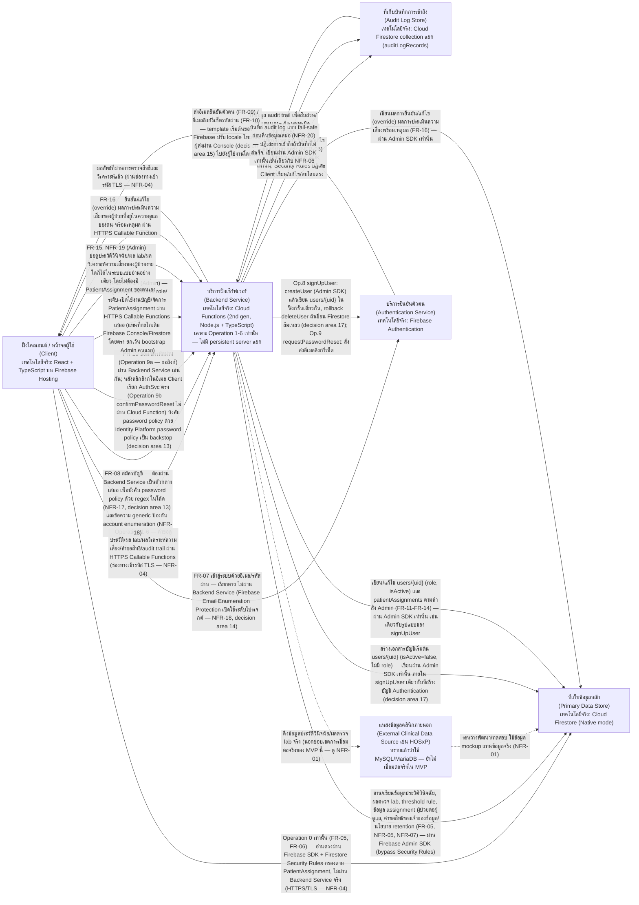
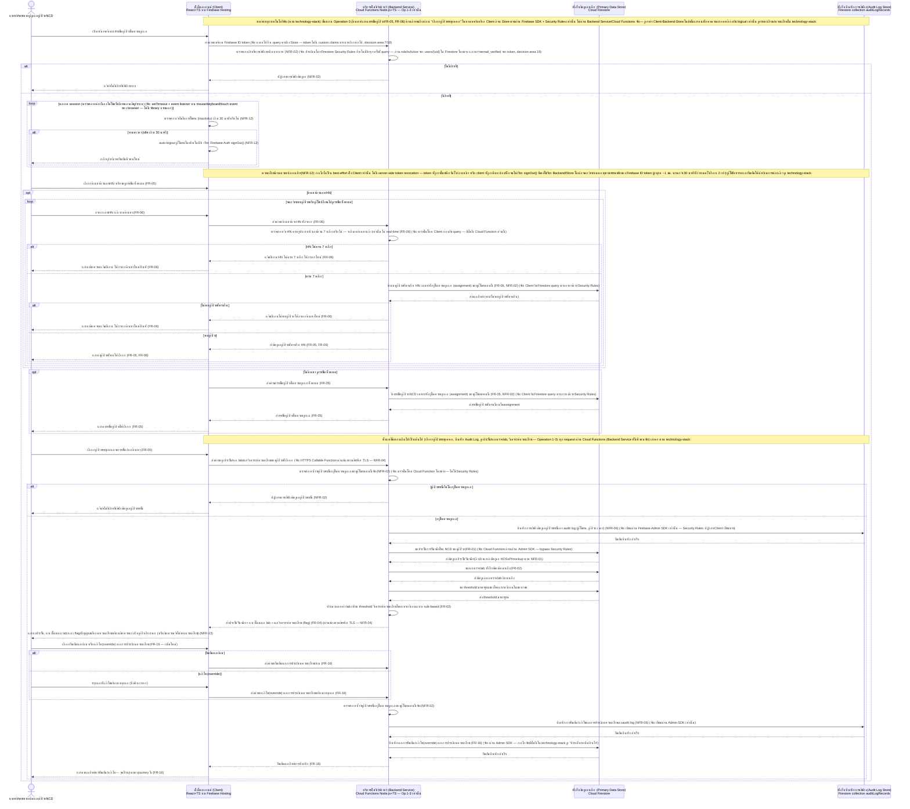
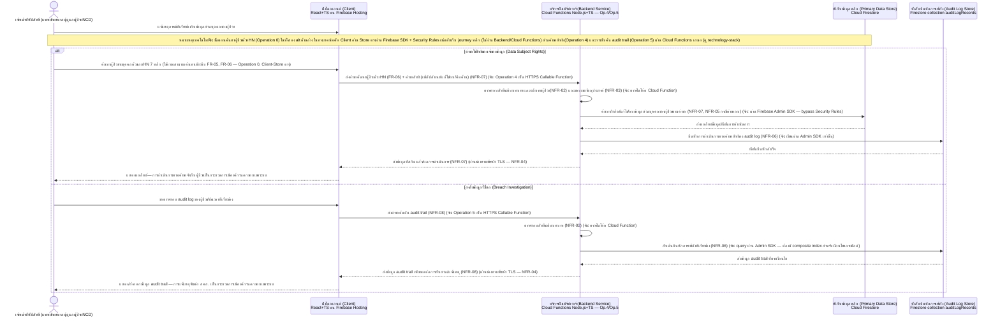
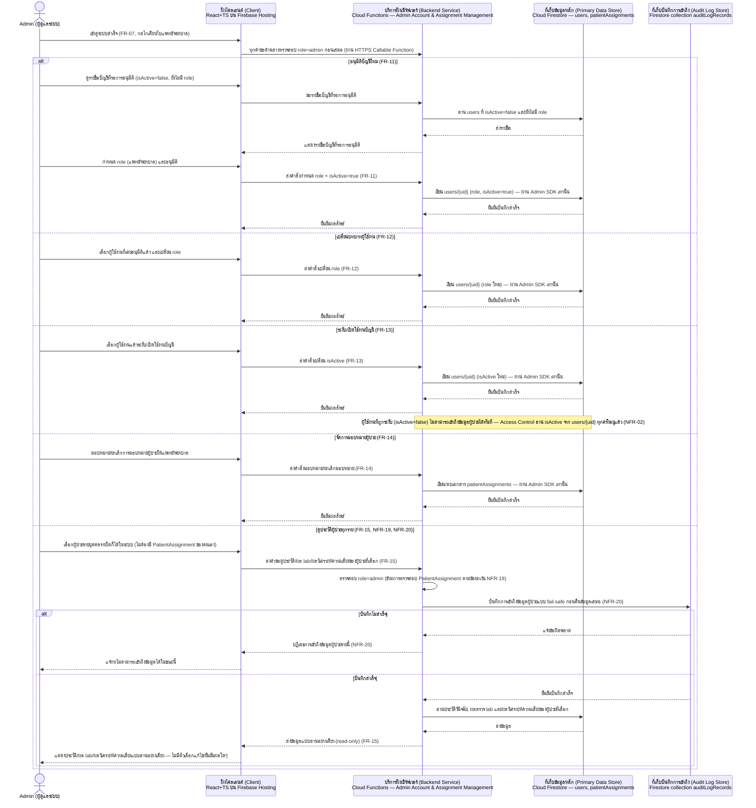

# Architecture (Logical/Conceptual)

เอกสารนี้อธิบายสถาปัตยกรรมระดับ hi-level (logical component + data flow) ของระบบที่รองรับฟีเจอร์ทั้ง
เจ็ดรายการใน [[feature-list]] และทั้งสี่ journey ใน [[user-journey]] อ้างอิงความต้องการต้นทางจาก
[[backlog]] และ spec
[[20260917-01-patient-ncd-history-lab-complication-risk]] (รวม FR-16 — ยืนยัน/แก้ไขผลการประเมิน
ความเสี่ยง เพิ่มเข้ามาในฟีเจอร์ที่ 2),
[[20260921-01-pdpa-data-protection-compliance]] (ฟีเจอร์ที่ 4 — คุ้มครองข้อมูลส่วนบุคคลตาม PDPA,
NFR-03–NFR-08),
[[20260922-01-operational-quality-nfr]] (ฟีเจอร์ที่ 5 — รับประกันคุณภาพเชิงปฏิบัติการของระบบ,
NFR-09–NFR-16),
[[20260923-01-user-authentication-email-password]] (ฟีเจอร์ที่ 6 — สมัครบัญชี เข้าสู่ระบบ และจัดการ
รหัสผ่านด้วยอีเมล, FR-07–FR-10, NFR-17–NFR-18) และ
[[20260924-01-admin-role-account-management]] (ฟีเจอร์ที่ 7 — จัดการบัญชีผู้ใช้งาน สิทธิ์ และการ
มอบหมายผู้ป่วยโดยบทบาท Admin ใหม่, FR-11–FR-15, NFR-19–NFR-20)

**หมายเหตุการอัปเดตล่าสุด (2026-09-24, รอบ sync ที่หก — เพิ่มฟีเจอร์ที่ 7 Admin และ FR-16):**
`[[feature-list]]`/`[[user-journey]]` เพิ่มฟีเจอร์ที่ 7 (จัดการบัญชีผู้ใช้งาน สิทธิ์ และการมอบหมาย
ผู้ป่วย — Admin: FR-11–FR-15, NFR-19, NFR-20 ตาม
[[20260924-01-admin-role-account-management]]) และเพิ่ม FR-16 (ยืนยัน/แก้ไขผลการประเมินความเสี่ยง
โรคแทรกซ้อนโดยแพทย์/พยาบาล) เข้าไปในฟีเจอร์ที่ 2 เดิม ฟีเจอร์ที่ 6 ยังถูกแก้ไขด้วย: **การอนุมัติบัญชี
(FR-11) เปลี่ยนจากการแก้ไข Firebase Console/Firestore โดยตรง เป็นหน้าจอ Admin ในระบบ** (บัญชี Admin
คนแรก/bootstrap ยังคงตั้งผ่าน Console อยู่นอกขอบเขต) เอกสารนี้จึงถูกปรับปรุงเพิ่ม:

- **บทบาทผู้ใช้ใหม่ Admin (ผู้ดูแลระบบ)** ในหัวข้อภาพรวม — ใช้ component เดิมทั้งหมด (Client, Backend
  Service, Primary Data Store, Audit Log Store, Authentication Service) ไม่ต้องการ component ใหม่
- Backend Service: กลุ่มงานใหม่ "การจัดการบัญชีผู้ใช้และสิทธิ์ (Admin — Account, Role & Patient
  Assignment Management)" ครอบคลุม FR-11–FR-14 และส่วนขยายของ Access Control/Audit Logging สำหรับ
  NFR-19 (ข้อยกเว้นสิทธิ์เข้าถึงผู้ป่วยทุกรายของ Admin โดยไม่ต้องมี PatientAssignment) และ NFR-20
  (audit log แบบ fail-safe เฉพาะการเข้าถึงข้อมูลผู้ป่วยของ Admin)
- Backend Service (Risk Rule Engine): เพิ่มความรับผิดชอบยืนยัน/แก้ไข (override) ผลการประเมินความเสี่ยง
  โดยแพทย์/พยาบาลผู้ดูแลผู้ป่วยรายนั้น พร้อม audit log (FR-16)
- Client: เพิ่มหน้าจอ Admin (อนุมัติบัญชี, เปลี่ยน role, ระงับ/เปิดใช้งานบัญชี, จัดการ
  PatientAssignment, ดูประวัติผู้ป่วยทุกรายแบบอ่านอย่างเดียว) และหน้าจอยืนยัน/แก้ไขผลประเมินความเสี่ยง
  สำหรับแพทย์/พยาบาล (FR-16)
- Component Diagram: เพิ่มเส้นทาง Client↔Backend↔Primary Data Store สำหรับ FR-11–FR-15/NFR-19/NFR-20
  และ FR-16
- Data Flow Diagram ใหม่ 1 ภาพสำหรับ journey ที่สี่ (Admin) และเพิ่มขั้นตอนยืนยัน/แก้ไขผลประเมินความ
  เสี่ยง (FR-16) ต่อท้าย sequence diagram ของ Journey หลัก
- ตาราง Mapping NFR: เพิ่มแถว NFR-19, NFR-20

**กลไกเทคโนโลยีจริงของฟีเจอร์ที่ 7/FR-16 ยังไม่มีใน `[[technology-stack]]`** (ตรวจแล้วว่าเอกสารนั้น
ยังไม่มี decision area ใดครอบคลุม Admin/FR-11–FR-20) จึงเขียนเฉพาะระดับ logical component/กลไกที่ต่อ
ยอดจากรูปแบบเดิมที่มีอยู่แล้วอย่างสมเหตุสมผล (เช่น เขียนผ่าน Cloud Functions ด้วย Admin SDK รูปแบบ
เดียวกับ `signUpUser`/Audit Logging เดิม) แต่**ไม่ระบุรายละเอียด implementation ใหม่ที่ยังไม่มีเหตุผล
รองรับจาก technology-stack** (เช่น จะแยกเป็น Cloud Function กี่ตัว) — บันทึกไว้เป็น "ประเด็นรอ
ตัดสินใจ" ท้ายเอกสาร แนะนำให้รัน `/build-tech-stack` เพื่อเติมรายละเอียด

**หมายเหตุการอัปเดตล่าสุด (2026-09-24, รอบ sync ที่ห้า):** `[[technology-stack]]` ปรับปรุงรอบสามเพิ่ม
decision area 13–19 (กลไกจริงของฟีเจอร์ที่ 6 — Authentication) และ **แก้ไข decision area 7**: **ไม่ใช้
Custom Claims เก็บ `role`/`isActive` อีกต่อไป** — Firestore `users/{uid}` เป็น source of truth เดียว
ที่ทั้ง Firestore Security Rules (Operation 0) และ Cloud Functions (Operation 1-6) อ่านตรงทุกครั้ง
เอกสารนี้จึงถูกแก้ไขทุกจุดที่เคยอ้างถึง "custom claims เก็บบทบาท/isActive" ให้สอดคล้องกับการตัดสินใจนี้
(ดูหัวข้อ Component Diagram, บริการยืนยันตัวตน, บริการฝั่งเซิร์ฟเวอร์ — การควบคุมการเข้าถึง, sequence
diagram Authentication/journey หลัก และตาราง Mapping NFR-02 ด้านล่าง) พร้อมเติมกลไกจริงที่เคยบันทึกไว้
ว่า "ยังไม่ตัดสินใจ" ให้ครบตาม decision area 13–19:

- **NFR-17 (Password Policy):** regex ในโค้ด Cloud Function `signUpUser` (Operation 8) + Google Cloud
  Identity Platform password policy เป็น backstop ฝั่งเซิร์ฟเวอร์สำหรับ Operation 9 (`confirmPasswordReset`
  ที่ Client เรียก Authentication Service ตรง ไม่ผ่าน Cloud Function)
- **NFR-18 (Account Enumeration Prevention):** เปิด Firebase "Email Enumeration Protection" ระดับ
  โปรเจกต์ (ปิด Operation 7 เท่านั้น) — **timing side-channel ยังไม่ปิด** ผู้ใช้รับทราบและยืนยันให้
  ดำเนินการต่อแล้ว (ดูหัวข้อความเสี่ยงใหม่ด้านล่าง)
- **เทมเพลตอีเมล (FR-09/FR-10):** template เริ่มต้นของ Firebase Authentication ปรับ locale ไทย +
  ชื่อผู้ส่งผ่าน Console เท่านั้น ไม่ custom domain
- **Auth Blocking Functions:** ตัดสินใจ**ไม่ใช้** (`beforeUserCreated`/`beforeUserSignedIn`) — Operation
  7 จึงยังไม่มีจุดตรวจ `emailVerified`/`isActive` ซ้ำระดับ token issuance (ความเสี่ยงที่รับทราบแล้ว)
- **การสร้าง `users/{uid}` (FR-08):** สร้างภายใน Cloud Function `signUpUser` เดียวกันกับที่สร้างบัญชี
  Authentication (Admin SDK) พร้อม **rollback ลบ Auth user ถ้าเขียน Firestore ล้มเหลว**
- **การ sync role/isActive กับ custom claims:** ตัดสินใจ**ไม่ sync เลย** (เหตุผลของการยกเลิก custom
  claims ทั้งหมดใน decision area 7/18)
- **การตรวจสอบ `emailVerified` ซ้ำฝั่ง backend:** เพิ่มการตรวจ `decodedToken.email_verified` ใน shared
  helper module ของ Cloud Functions (Operation 1-6) และเงื่อนไข `request.auth.token.email_verified ==
  true` ใน Firestore Security Rules ของ `patientAssignments` (Operation 0)

รายการทั้งหมดนี้จึงถูกย้ายออกจากหัวข้อ "ประเด็นรอตัดสินใจ" (ปิดแล้ว) เหลือเฉพาะความเสี่ยงที่ผู้ใช้รับทราบ
และยืนยันให้ดำเนินการต่อ (timing side-channel ของ NFR-18, ช่องว่าง `beforeSignIn` ของ Operation 7,
การติดตาม billing ของ Identity Platform, custom email service ในอนาคต — ดูหัวข้อท้ายเอกสาร)

**หมายเหตุการอัปเดตล่าสุด (2026-09-23, รอบ sync ที่สี่):** `[[feature-list]]`/`[[user-journey]]`
เพิ่มฟีเจอร์ที่ 6 (Authentication — FR-07–FR-10, NFR-17, NFR-18) เอกสารนี้จึงถูกปรับปรุงเพิ่ม
component "บริการยืนยันตัวตน (Authentication Service)", กลุ่มงานใหม่ใน Backend Service ("การจัดการ
บัญชีผู้ใช้และการยืนยันตัวตน — Account Onboarding"), Data Flow Diagram ของ journey ที่ 1
(Authentication) และแถว NFR-17/NFR-18 ในตาราง Mapping NFR — **การตัดสินใจเชิงสถาปัตยกรรม 2 จุดที่
spec/user-journey ไม่ได้ระบุชัดเจน ได้ถามผู้ใช้จริงแล้วผ่านสัญญาณ `NEEDS_USER_INPUT` และได้รับคำตอบ
ยืนยันแล้ว:**

1. **การสมัครบัญชี (FR-08) และการขอรีเซ็ตรหัสผ่าน (FR-10) ต้องผ่าน Backend Service เป็นตัวกลางเสมอ**
   (ไม่ให้ Client เรียก Authentication Service ตรงสำหรับสองปฏิบัติการนี้) เพื่อให้ Backend Service
   เป็นจุดเดียวที่บังคับ password policy (NFR-17) และคืนข้อความ generic เดียวกันเสมอไม่ว่าอีเมลจะมี
   บัญชีอยู่แล้วหรือไม่ (NFR-18) ได้อย่างแน่นอนทั้งระดับข้อความและระดับ error/response ไม่ใช่แค่การ
   mask ข้อความที่ชั้น UI — สอดคล้องกับเหตุผลเดียวกับที่เคยขยายขอบเขต Backend Service ให้ครอบคลุม
   Operation 1-6 ทั้งหมดเพื่อบังคับใช้ fail-safe ของ NFR-06
2. **ระเบียนบัญชีเริ่มต้น (`users/{uid}` ที่มี `isActive=false` และยังไม่มี role) ต้องถูกสร้างอัตโนมัติ
   โดย Backend Service ทันทีที่มีการสร้างบัญชี Authentication ใหม่สำเร็จ** (เขียนผ่าน Admin SDK
   เท่านั้น — Client ไม่มีสิทธิ์เขียนเอกสารนี้เลยไม่ว่ากรณีใด) เพื่อป้องกัน Client แก้ไข field
   `isActive`/role เองได้ สอดคล้องกับรูปแบบเดียวกับที่ใช้กับ `auditLogRecords`

รายละเอียดกลไกทางเทคนิคที่แน่นอน (เช่น วิธี suppress/แปลง error code ของ Firebase Auth ให้เป็น
generic เสมอ, วิธีส่งอีเมลยืนยันตัวตน/รีเซ็ตรหัสผ่าน, Identity Platform password policy) ยังไม่มีใน
`[[technology-stack]]` ณ ขณะนี้ (เอกสารนั้นตัดสินใจไปก่อนที่ spec Authentication จะถูกสร้าง) จึงบันทึก
ไว้เป็น "ประเด็นรอตัดสินใจ" ท้ายเอกสารนี้ แนะนำให้รัน `/build-tech-stack` เพื่อเติมรายละเอียดต่อ

**หมายเหตุการอัปเดตล่าสุด (2026-09-22, รอบ sync ที่สาม):** `[[technology-stack]]` ปรับปรุงรอบสองเพิ่ม
decision area 9-12 ระบุกลไกจริงสำหรับ **NFR-09 (Performance), NFR-12 (Session Timeout), NFR-13
(Accessibility), NFR-15 (Browser/Device Compatibility)** ที่เอกสารนี้เคยบันทึกไว้ว่า "ยังไม่มีการ
ตัดสินใจ" แล้ว จึงปรับปรุงเอกสารนี้ตามขั้นตอน 5.7 ให้ครบทั้ง 4 รหัส (ดูหัวข้อ "ขอบเขตความรับผิดชอบของแต่ละ
Component", [[#Cross-cutting: คุณภาพเชิงปฏิบัติการของระบบ (NFR-09–NFR-16)]], sequence diagram ของ
journey หลัก และตาราง Mapping NFR ด้านล่าง) สรุปกลไกที่เพิ่มเข้ามา: NFR-09 = Firestore composite index
เท่านั้น ไม่มี caching layer เพิ่มเติม (มี trade-off ที่บันทึกไว้ชัดเจน); NFR-13 = WCAG 2.1 AA +
Heroicons + Lighthouse Accessibility Audit; NFR-15 = browserslist `">0.5%, last 2 versions, Firefox
ESR, not dead"` — **NFR-12 สำคัญเป็นพิเศษ:** กลไกที่เลือกคือ Client custom inactivity timer เรียก
`signOut()` เท่านั้น **ไม่มี server-side token revocation** ซึ่งมีความเสี่ยงด้านความปลอดภัยที่กระทบภาพรวม
สถาปัตยกรรม (ไม่ใช่รายละเอียดปลีกย่อย) จึงถูกเน้นย้ำไว้หลายจุดในเอกสารนี้ (ดูหัวข้อ Client,
Backend Service — การควบคุมการเข้าถึง, Cross-cutting NFR-09–NFR-16 และตาราง Mapping NFR) รหัสที่ยังไม่
ถูกตัดสินใจใน `[[technology-stack]]` (NFR-10, NFR-11, NFR-14, NFR-16 ใช้กลไกที่มีอยู่แล้วจาก NFR-01–08
หรือเป็นกระบวนการนอกระบบ) คงเดิมไม่เปลี่ยนแปลง

**หมายเหตุสำคัญ (อัปเดต 2026-09-22):** `[[technology-stack]]` มีเนื้อหาแล้ว สรุปคือสถาปัตยกรรม
Firebase-native เต็มรูปแบบ: **React + TypeScript** บน **Firebase Hosting** (Client); ไม่มี Backend
Service แบบ persistent server แยกต่างหาก — แบ่งเป็น 2 เส้นทางจริง: **Operation 0** (ค้นหา/แสดงรายชื่อ
ผู้ป่วย — FR-05, FR-06) ให้ Client อ่าน **Cloud Firestore** ตรงผ่าน Firebase SDK + **Firestore
Security Rules** (ไม่ผ่าน Backend Service จริง) ส่วน **Operation 1-6** (เข้าถึงข้อมูลผู้ป่วยรายบุคคล/
audit trail/คำขอสิทธิทั้งหมด) ผ่าน **Cloud Functions (2nd gen, Node.js + TypeScript)** เป็นตัวกลางเสมอ;
Primary Data Store และ Audit Log Store ทั้งคู่เป็น **Cloud Firestore (Native mode)** คนละ collection;
**Firebase Authentication** สำหรับ authentication/authorization (ยืนยันบัญชีเท่านั้น — **ไม่เก็บ
role/isActive ใน Custom Claims อีกต่อไป** Firestore `users/{uid}` เป็น source of truth เดียว ตาม
decision area 7/18 ของรอบ 2026-09-24); **Google-managed
encryption keys** + HTTPS/TLS สำหรับการเข้ารหัส — เอกสารนี้จึงถูกปรับปรุงให้ระบุชื่อเทคโนโลยีจริงกำกับ
component/diagram ทุกจุดตามที่ `[[technology-stack]]` ตัดสินใจไว้ (ดูรายละเอียดเต็มใน
[[technology-stack]]) โดยยังคงคำอธิบายระดับ logical component เดิมไว้ครบทุกจุด เพื่อให้เอกสารอ่าน
เข้าใจได้แม้ไม่ทราบรายละเอียด stack ที่เลือก รายการที่ `[[technology-stack]]` ยังไม่ตัดสินใจ (หรือ
ตัดสินใจเฉพาะระดับพื้นฐานสำหรับ MVP แล้วรอทบทวนในอนาคต) สรุปไว้ในหัวข้อ "ประเด็นรอตัดสินใจ" ท้ายเอกสาร

## ภาพรวม

ระบบมี **2 บทบาทผู้ใช้** ตามที่ระบุใน [[user-journey]]: **แพทย์/พยาบาลผู้ดูแลผู้ป่วย NCD** และ
**Admin (ผู้ดูแลระบบ)** — บทบาทใหม่ตาม [[20260924-01-admin-role-account-management]] ที่ดูแลบัญชี
ผู้ใช้งาน สิทธิ์ และการมอบหมายผู้ป่วย (ดูหัวข้อ
[[feature-list#7. จัดการบัญชีผู้ใช้งาน สิทธิ์ และการมอบหมายผู้ป่วย (Admin)|ฟีเจอร์ที่ 7 ใน
feature-list]] และหัวข้อ [[#บริการฝั่งเซิร์ฟเวอร์ (Backend Service)|Backend Service]] ด้านล่างของ
เอกสารนี้) แพทย์/พยาบาลผู้ดูแลผู้ป่วย NCD ต้อง:

0. ค้นหาผู้ป่วยเฉพาะรายด้วยเลข HN รูปแบบตัวเลขล้วน 7 หลักเท่านั้น (ไม่รองรับการค้นหาด้วยชื่ออีกต่อไป —
   FR-06) และ/หรือเรียกดูรายชื่อผู้ป่วย NCD ที่อยู่ในความดูแลของตนเองทั้งหมด (FR-05) เพื่อเลือกผู้ป่วย
   รายบุคคลก่อนเข้าถึงข้อมูลใดๆ ด้านล่าง — เป็นขั้นตอนแรกสุดของ journey เสมอ การตรวจสอบว่ากรอก HN ไม่
   ครบ 7 หลัก หรือค้นหาแล้วไม่พบผู้ป่วยที่ตรงกัน เกิดขึ้น**หลังผู้ใช้กดค้นหาแล้วเท่านั้น** (ไม่ใช่แบบ
   real-time ระหว่างพิมพ์) โดยต้องแจ้งเตือนและให้กรอกค้นหาใหม่ได้ทันที โดยไม่บล็อกการเรียกดูรายชื่อ
   ทั้งหมด (FR-06)
1. ดูประวัติการวินิจฉัยโรค NCD และผลตรวจ lab ย้อนหลังของผู้ป่วยรายบุคคล (FR-01, FR-02)
2. รับผลการวิเคราะห์ความเสี่ยงโรคแทรกซ้อนแบบ rule-based พร้อม flag/สัญญาณเตือนบนหน้าจอ (FR-03,
   FR-04) และยืนยัน/แก้ไข (override) ผลการประเมินความเสี่ยงนั้นได้เฉพาะผู้ป่วยที่อยู่ในความดูแลของตน
   (FR-16 — เพิ่มใหม่ตาม [[20260924-01-admin-role-account-management]] ที่แก้ไขเอกสาร spec ฉบับแรก
   ไม่ใช่สิทธิ์ของ Admin)

ทั้งสามความสามารถต้องอยู่ภายใต้การควบคุมการเข้าถึงเฉพาะบทบาทที่มีสิทธิ์ (NFR-02) และข้อมูลประวัติ/
ผลตรวจ lab ที่ใช้ต้องอ้างอิงแหล่งข้อมูล HOSxP หรือข้อมูล mockup ระหว่างพัฒนา (NFR-01) นอกจากนี้
NFR-02 ยังกำหนดว่าการเข้าถึงต้องถูกจำกัดเพิ่มเติมในระดับรายผู้ป่วยตาม assignment "อยู่ในความดูแล"
ของผู้ใช้งานคนนั้น (ไม่ใช่การมองเห็นตามแผนก/หน่วยงานที่สังกัด) ซึ่งผูกโดยตรงกับ FR-05

นอกจากนี้ ฟีเจอร์ที่ 4 "คุ้มครองข้อมูลส่วนบุคคลของผู้ป่วยตาม PDPA" (NFR-03–NFR-08 ดู
[[feature-list#4. คุ้มครองข้อมูลส่วนบุคคลของผู้ป่วยตาม PDPA|feature-list]]) เป็นข้อกำหนดเชิง
compliance ที่ครอบคลุม**ทั้งระบบ** ไม่ผูกกับฟีเจอร์ใดฟีเจอร์หนึ่งโดยเฉพาะ จึงถูกออกแบบเป็น
cross-cutting concern ที่กระทบทุก component (ดูหัวข้อ
[[#Cross-cutting: การคุ้มครองข้อมูลส่วนบุคคล (PDPA)]] ด้านล่าง) แทนที่จะผูกกับ journey ใด journey
หนึ่งเพียงอย่างเดียว: ระบบต้องจำกัดการ
ประมวลผลข้อมูลเฉพาะเท่าที่จำเป็นตามวัตถุประสงค์การดูแลรักษา (NFR-03), เข้ารหัสข้อมูลทั้งขณะจัดเก็บ
และส่งผ่านเครือข่าย (NFR-04), จำกัดระยะเวลาเก็บรักษาและรองรับการลบข้อมูล (NFR-05), บันทึกร่องรอย
การเข้าถึงข้อมูล (NFR-06), รองรับคำขอใช้สิทธิของเจ้าของข้อมูล (NFR-07) และสนับสนุนข้อมูลสำหรับ
กระบวนการแจ้งเหตุละเมิดข้อมูลส่วนบุคคล (NFR-08)

นอกจากนี้ ฟีเจอร์ที่ 5 "รับประกันคุณภาพเชิงปฏิบัติการของระบบ" (NFR-09–NFR-16 ดู
[[feature-list#5. รับประกันคุณภาพเชิงปฏิบัติการของระบบ (Performance, Availability, Clinical Safety, Session Security, Accessibility, Compatibility, Interoperability)|feature-list]])
เป็นข้อกำหนดเชิงคุณภาพที่ครอบคลุม**ทั้งระบบ**เช่นเดียวกับฟีเจอร์ที่ 4 ไม่ผูกกับฟีเจอร์ใดฟีเจอร์หนึ่ง
โดยเฉพาะ จึงถูกออกแบบเป็น cross-cutting concern อีกกลุ่มหนึ่งที่กระทบทุก component เช่นกัน (ดูหัวข้อ
[[#Cross-cutting: คุณภาพเชิงปฏิบัติการของระบบ (NFR-09–NFR-16)]] ด้านล่าง) ได้แก่: หน้าจอหลักต้อง
ตอบสนองภายในน้อยกว่า 2 วินาที (NFR-09), อ้างอิง SLA มาตรฐานของ Firebase/Google Cloud เป็นเป้าหมาย
uptime (NFR-10), การจับคู่โรค/threshold ที่ใช้ใน Risk Rule Engine ต้องผ่านการยืนยันจากแพทย์ผู้เชี่ยวชาญ
ก่อน deploy ทุกครั้งเป็นข้อกำหนดถาวร (NFR-11), ต้อง auto-logout เมื่อไม่มีการใช้งานเกิน 30 นาที
(NFR-12), ห้ามใช้สีเป็นสัญญาณเดียวในการสื่อความหมาย (NFR-13), Security Rules ต้องมี automated test
ครอบคลุมทุกกรณีสิทธิ์ก่อนใช้งานจริงเสมอ (NFR-14), รองรับ browser หลักเวอร์ชันล่าสุดบน desktop/tablet
(NFR-15) และพิจารณา HL7/FHIR ในอนาคตเมื่อเชื่อมต่อ HOSxP จริง (NFR-16 — Won't have ในเฟสนี้ ยืนยันโดย
ผู้ใช้แล้ว)

นอกจากนี้ ฟีเจอร์ที่ 6 "สมัครบัญชี เข้าสู่ระบบ และจัดการรหัสผ่านด้วยอีเมล (Authentication)" (FR-07–
FR-10, NFR-17, NFR-18 ดู
[[feature-list#6. สมัครบัญชี เข้าสู่ระบบ และจัดการรหัสผ่านด้วยอีเมล (Authentication)|feature-list]])
เป็น **precondition ก่อนฟีเจอร์ที่ 1-5 ทั้งหมด** — ผู้ใช้งานต้องสมัครบัญชี ยืนยันอีเมล และรอ **Admin**
อนุมัติผ่าน**หน้าจอในระบบ** (กำหนด role และ `isActive=true` — FR-11 **แก้ไข 2026-09-24: แทนที่กลไก
เดิมที่เคยเป็นการแก้ไข Firebase Console/Firestore โดยตรง** ดูฟีเจอร์ที่ 7 ด้านล่าง; การสร้างบัญชี
Admin คนแรก/bootstrap ยังคงดำเนินการผ่าน Firebase Console/Firestore โดยตรง อยู่นอกขอบเขต) ก่อนจึงจะ
เข้าสู่ระบบและเริ่ม journey ค้นหา/ดูข้อมูลผู้ป่วยได้ (NFR-02 ยังคงควบคุม สิทธิ์เข้าถึงข้อมูลผู้ป่วยแยก
ต่างหากหลังเข้าสู่ระบบสำเร็จแล้วเหมือนเดิม) ฟีเจอร์นี้ต้องการ component ใหม่หนึ่งตัวคือ **บริการยืนยัน
ตัวตน (Authentication Service)** ที่แยกออกมาจากที่เคยเป็นเพียง cross-cutting note ใต้ Component
Diagram (ดูหัวข้อ [[#บริการยืนยันตัวตน (Authentication Service)]] ด้านล่าง) เนื่องจากตอนนี้มี flow
ที่ผู้ใช้โต้ตอบกับ component นี้โดยตรงเป็นฟีเจอร์หลักแล้ว (ไม่ใช่แค่การแนบ token ไปกับคำขออื่น)

นอกจากนี้ ฟีเจอร์ที่ 7 "จัดการบัญชีผู้ใช้งาน สิทธิ์ และการมอบหมายผู้ป่วย (Admin)" (FR-11–FR-15,
NFR-19, NFR-20 ดู
[[feature-list#7. จัดการบัญชีผู้ใช้งาน สิทธิ์ และการมอบหมายผู้ป่วย (Admin)|feature-list]]) เป็น
บทบาทผู้ใช้ใหม่ที่**ใช้ component เดิมทั้งหมด** (Client, Backend Service, Primary Data Store,
Authentication Service) **ไม่ต้องการ component ใหม่เพิ่มเติม** — Admin เข้าสู่ระบบด้วยกลไกเดียวกับ
แพทย์/พยาบาล (FR-07) แล้วดำเนินการอนุมัติบัญชี/เปลี่ยน role/ระงับ-เปิดใช้งานบัญชี/จัดการ
PatientAssignment ผ่าน Backend Service (เขียน `users/{uid}`/`patientAssignments` ผ่าน Admin SDK
เท่านั้น เช่นเดียวกับรูปแบบที่ใช้กับ Account Onboarding เดิม) และดูประวัติผู้ป่วยทุกรายแบบอ่านอย่าง
เดียวโดยไม่ต้องมี PatientAssignment เป็นของตนเอง (NFR-19 — ข้อยกเว้น Access Control) ทุกครั้งที่เข้าถึง
ข้อมูลผู้ป่วยต้องบันทึก audit log แบบ fail-safe ก่อนเสมอเช่นเดียวกับ NFR-06 (NFR-20) ดูรายละเอียดที่
หัวข้อ Backend Service ด้านล่าง

สถาปัตยกรรมจึงยังคงแบ่งเป็น 6 logical component หลักเท่าเดิม ได้แก่ Client, Backend Service, Primary
Data Store, ที่เก็บบันทึกการเข้าถึง (Audit Log Store), บริการยืนยันตัวตน (Authentication Service)
และ External Clinical Data Source (ระบบภายนอกที่ไม่ได้พัฒนาในโปรเจกต์นี้) — ทั้งฟีเจอร์ที่ 5 และ
ฟีเจอร์ที่ 7 (Admin) ไม่ต้องการ component ใหม่เพิ่มเติม เพราะ NFR-09–NFR-16 และ FR-11–FR-15/NFR-19–
NFR-20 ทุกรหัสอธิบายได้ด้วย component เดิม (ดูรายละเอียดในหัวข้อขอบเขตความรับผิดชอบของแต่ละ
component และตาราง Mapping NFR ด้านล่าง)

## Component Diagram



หมายเหตุ: ทุกเส้นทางการสื่อสารระหว่าง component ข้างต้นที่มีข้อมูลส่วนบุคคล/ข้อมูลสุขภาพของผู้ป่วยไหล
ผ่าน ต้องเข้ารหัสขณะส่งผ่านเครือข่าย (in transit) และ Primary Data Store กับ Audit Log Store ต้อง
เข้ารหัสข้อมูลขณะจัดเก็บ (at rest) ตาม NFR-04 — เป็น cross-cutting concern ที่ไม่ได้วาดเป็น component
แยกเพราะไม่ใช่หน่วยประมวลผล/จัดเก็บข้อมูลในตัวเอง (ดูรายละเอียดในหัวข้อ Cross-cutting ด้านล่าง)

**หมายเหตุเทคโนโลยีจริง (Client -> Primary Data Store โดยตรง):** เส้นทาง `Client -->|Operation 0|
DataStore` ด้านบนเป็นส่วนเพิ่มเติมจากไดอะแกรมระดับ logical เดิม (ซึ่งเดิมวาดให้ทุกคำขอผ่าน Backend
Service เพียงเส้นทางเดียว) เพิ่มเข้ามาเพื่อสะท้อนการตัดสินใจใน
[[technology-stack#3. สถาปัตยกรรม Backend Service — Firebase-native (ไม่มี Backend Service แยกแบบดั้งเดิม)|decision area 3 ของ technology-stack]]
ที่ให้ Operation 0 (ค้นหา/แสดงรายชื่อผู้ป่วย — ยังไม่มีการระบุผู้ป่วยรายบุคคล ไม่ trigger audit log)
อ่าน Firestore ตรงผ่าน Security Rules แทนที่จะผ่าน Cloud Functions เพื่อความเรียบง่าย ส่วน Operation
1-6 ทั้งหมดยังคงผ่าน Backend Service (Cloud Functions) ตามไดอะแกรมเดิมทุกประการ — การเพิ่มเส้นทางนี้
เป็นการ**เสริมความถูกต้องเชิงเทคนิค ไม่ใช่การเปลี่ยนขอบเขตความรับผิดชอบเชิง logical** ของ component
ใดๆ (Backend Service ยังคงเป็นเจ้าของ logic การควบคุมการเข้าถึง/วิเคราะห์ความเสี่ยง/บันทึก audit log
ทั้งหมดเหมือนเดิม เพียงแต่ Operation 0 ถูกกำหนดไว้ตั้งแต่ต้นใน [[architecture]] แล้วว่าไม่ต้องบันทึก
audit log และมี logic ตรวจสอบไม่ซับซ้อน — ดูความเสี่ยงของแนวทางนี้ต่อ NFR-02 ใน
[[technology-stack#ความเสี่ยงที่ต้องพิจารณาเพิ่มเติม (สำคัญ — ผู้ใช้รับทราบและยืนยันให้ดำเนินการต่อแล้ว)|
หัวข้อความเสี่ยงของ technology-stack]])

**หมายเหตุเทคโนโลยีจริง (Authentication):** ตั้งแต่รอบ sync ที่สี่ (2026-09-23) **บริการยืนยันตัวตน
(Authentication Service)** ถูกวาดเป็น node แยกในไดอะแกรมข้างต้นแล้ว (ก่อนหน้านี้ไม่ได้วาดแยกเพราะเป็น
เพียง cross-cutting concern ที่ทุก component เรียกใช้ร่วมกัน) เนื่องจากฟีเจอร์ที่ 6 (Authentication)
ทำให้ Client โต้ตอบกับ component นี้เป็น flow หลักโดยตรง: **การเข้าสู่ระบบ (FR-07)** ยังคงเป็น Client
เรียก Authentication Service ตรง (ไม่ผ่าน Backend Service) แล้วแนบ Firebase ID token ไปกับทุกคำขอไปยัง
Backend Service และ Primary Data Store เหมือนเดิม — **ตั้งแต่รอบ 2026-09-24 token นี้ไม่มี custom claims
เก็บบทบาท/isActive อีกต่อไป** (decision area 7/18) ทั้ง Backend Service และ Firestore Security Rules
อ่าน `role`/`isActive` จากเอกสาร Firestore `users/{uid}` โดยตรงทุกครั้งแทน แต่ยังคงใช้ค่า
`email_verified` จากตัว token เอง (ไม่ต้องเพิ่ม Firestore read — decision area 19) แต่ **การสมัครบัญชี
(FR-08) และการขอลิงก์รีเซ็ตรหัสผ่าน (FR-10) ต้องผ่าน Backend Service เป็นตัวกลางเสมอ** (ผู้ใช้ยืนยันแล้ว
ผ่าน `NEEDS_USER_INPUT` — ดูหมายเหตุการอัปเดตต้นเอกสาร) เพื่อให้ Backend Service เป็นจุดเดียวที่บังคับ
password policy ด้วย regex ในโค้ด (NFR-17, decision area 13) และคืนข้อความ generic ป้องกัน account
enumeration (NFR-18, decision area 14) ได้แน่นอน ก่อนเรียก Authentication Service ผ่าน Firebase Admin
SDK ต่อ — ส่วนการ**ตั้งรหัสผ่านใหม่จริง**หลังคลิกลิงก์ (`confirmPasswordReset`) เรียก Authentication
Service ตรงโดยไม่ผ่าน Cloud Function จึงต้องพึ่ง **Google Cloud Identity Platform password policy**
เป็น backstop ฝั่งเซิร์ฟเวอร์แทน (ดู
[[technology-stack#13. กลไก Validate Password Policy ฝั่งเซิร์ฟเวอร์ (NFR-17, ฟีเจอร์ที่ 6) — Regex ใน Cloud Function + Identity Platform เป็น Backstop|
decision area 13]],
[[technology-stack#14. กลไกป้องกัน Account Enumeration (NFR-18, ฟีเจอร์ที่ 6) — Firebase Email Enumeration Protection|
decision area 14]] ใน technology-stack)

**หมายเหตุเทคโนโลยีจริง (Admin — ฟีเจอร์ที่ 7 / FR-16):** เส้นทาง Client↔Backend↔Primary Data Store/
Audit Log Store ที่เพิ่มเข้ามาด้านบนสำหรับ FR-11–FR-15/NFR-19/NFR-20 และ FR-16 **ยังไม่มี decision
area ใดใน `[[technology-stack]]` รองรับโดยตรง** (ตรวจสอบแล้วว่าเอกสารนั้นยังไม่มีเนื้อหาเกี่ยวกับ
Admin/FR-11–FR-20) แนวทางที่ระบุไว้ (เขียนผ่าน Cloud Functions ด้วย Admin SDK, บันทึก audit log แบบ
fail-safe ก่อนคืนข้อมูลเสมอ) เป็นการต่อยอดจากรูปแบบเดียวกับ Account Onboarding (decision area 3/17)
และ Audit Logging (decision area 5) ที่มีอยู่แล้วอย่างสมเหตุสมผลในระดับ logical เท่านั้น — จำนวน/การ
แบ่ง Cloud Function ที่แน่นอนสำหรับแต่ละปฏิบัติการของ Admin (เช่น จะรวมเป็น callable function เดียว
`manageUserAccount` หรือแยกเป็นหลายฟังก์ชันตาม FR-11/FR-12/FR-13/FR-14) ยังไม่ตัดสินใจ — บันทึกไว้เป็น
"ประเด็นรอตัดสินใจ" ท้ายเอกสาร แนะนำให้รัน `/build-tech-stack`

## ขอบเขตความรับผิดชอบของแต่ละ Component

### ฝั่งไคลเอนต์ / หน้าจอผู้ใช้ (Client) — เทคโนโลยีจริง: [[technology-stack#1. ภาษา/Framework ฝั่ง Client — React + TypeScript|React + TypeScript]] บน Firebase Hosting

- แสดงหน้าจอค้นหา/รายชื่อผู้ป่วย NCD ที่อยู่ในความดูแลของผู้ใช้งาน มีช่องกรอกเฉพาะเลข HN (ไม่รองรับ
  คำค้นอิสระ/ชื่อผู้ป่วยอีกต่อไป) และส่งคำขอค้นหาไปยัง Backend Service ก็ต่อเมื่อผู้ใช้กดค้นหาเท่านั้น
  (ไม่ตรวจสอบความยาว/รูปแบบเองแบบ real-time ระหว่างพิมพ์ — การตรวจสอบเป็นหน้าที่ของ Backend Service
  หลังกดค้นหา) หรือแสดงรายชื่อทั้งหมดเมื่อไม่ค้นหา แล้วให้แพทย์/พยาบาลเลือกผู้ป่วยรายบุคคลจากรายชื่อ
  ก่อนเข้าดูข้อมูลใดๆ ด้านล่าง เป็นขั้นตอนแรกสุดของ journey เสมอ (FR-05, FR-06)
- แสดงข้อความแจ้งเตือนที่ได้รับจาก Backend Service เมื่อกรอก HN ไม่ครบ 7 หลัก หรือค้นหาด้วย HN ที่ครบ
  7 หลักแล้วแต่ไม่พบผู้ป่วยที่ตรงกัน แล้วให้ผู้ใช้กรอกค้นหาใหม่ได้ทันที โดยไม่บล็อกการเรียกดูรายชื่อ
  ทั้งหมด (FR-06)
- แสดงประวัติการวินิจฉัยโรค NCD เรียงตามช่วงเวลา (FR-01)
- แสดงแนวโน้มผลตรวจ lab ย้อนหลัง (FR-02)
- แสดง flag/สัญญาณเตือนความเสี่ยงโรคแทรกซ้อนที่มองเห็นได้ชัดเจน หรือข้อความเมื่อไม่พบความเสี่ยง
  (FR-04)
- แสดงข้อความปฏิเสธการเข้าถึงเมื่อ Backend Service แจ้งว่าผู้ใช้ไม่มีสิทธิ์ (NFR-02)
- ไม่ทำการประมวลผลความเสี่ยงเอง (logic การประเมินความเสี่ยงเป็นหน้าที่ของ Backend Service เท่านั้น)
- ส่ง/รับข้อมูลผู้ป่วยทุกครั้งผ่านช่องทางที่เข้ารหัสขณะส่งผ่านเครือข่าย (in transit) และไม่เก็บ/cache
  ข้อมูลผู้ป่วยที่ละเอียดอ่อนไว้เกินความจำเป็นบนฝั่งผู้ใช้ (NFR-04)
- แสดงผลหน้าจอค้นหา/ประวัติวินิจฉัย/ผลตรวจ lab/ผลวิเคราะห์ความเสี่ยงภายในเวลาที่ผู้ใช้รับรู้ได้ว่า
  "เร็ว" สอดคล้องกับเป้าหมายการตอบสนองรวมน้อยกว่า 2 วินาทีของทั้งระบบ (NFR-09 — Backend Service/Primary
  Data Store เป็นผู้รับผิดชอบหลักด้านเวลาประมวลผล แต่ Client ต้องไม่เพิ่ม latency ที่ไม่จำเป็น เช่น
  render ที่หนักเกินไป)
  - **กลไกจริง:** [[technology-stack#9. กลไกรองรับ Performance < 2 วินาที (NFR-09) — Firestore Composite Index เท่านั้น (ไม่มี caching layer เพิ่มเติม)|
    Firestore composite index เท่านั้น]] — ไม่มี in-memory caching หรือ managed caching layer (Redis/
    Memorystore) เพิ่มเติมในรอบนี้ **Trade-off:** ทุก request ยังอ่าน Cloud Firestore ทุกครั้งแม้เป็น
    ข้อมูลอ้างอิงคงที่ (เช่น threshold) — คาดว่ายังทำ < 2 วินาทีได้ที่สเกล ~20 concurrent users ปัจจุบัน
    ถ้าพบปัญหาจริงจากการทดสอบ ขั้นตอนถัดไปคือ in-memory caching ใน Cloud Functions (ดู "ประเด็นรอ
    ตัดสินใจ")
- ติดตามช่วงเวลาที่ผู้ใช้ไม่มีการโต้ตอบกับหน้าจอ (inactivity) ต่อเนื่องตลอด session และเมื่อเกิน
  30 นาที ต้อง auto-logout ผู้ใช้งานโดยอัตโนมัติ กลับไปหน้าจอยืนยันตัวตนใหม่ (NFR-12)
  - **กลไกจริง:** [[technology-stack#10. กลไก Session Timeout (NFR-12) — Client Custom Inactivity Timer เท่านั้น (ไม่มี Server-side Token Revocation)|
    Client custom inactivity timer]] เขียนเองด้วย `setTimeout` + event listener บน mouse/keyboard/
    touch event มาตรฐานของ browser เมื่อ idle ครบ 30 นาทีเรียก Firebase Authentication `signOut()`
    ทันที — **ไม่มี library ภายนอก (เช่น `react-idle-timer`) และไม่มีกลไกฝั่งเซิร์ฟเวอร์เพิกถอน token**
  - **ความเสี่ยงด้านความปลอดภัยที่ต้องรับทราบ (สำคัญ — กระทบภาพรวมสถาปัตยกรรมด้าน security ไม่ใช่แค่
    รายละเอียดปลีกย่อย):** กลไกนี้เป็น **best-effort ฝั่ง Client เท่านั้น** — ล็อกเอาต์ระดับ UI/session
    เท่านั้น **ไม่ได้ทำให้ Firebase ID token เป็นโมฆะจริงฝั่งเซิร์ฟเวอร์** ถ้า token ถูกขโมย/ดักจับไว้
    ก่อนหน้า (อุปกรณ์สูญหายพร้อม token ที่ intercept ไว้แล้ว) หรือ client ถูกดัดแปลง/บั๊กจนไม่เรียก
    `signOut()` เมื่อ idle จริง **token นั้นยังใช้เรียก Backend Service/Primary Data Store ได้ต่อจนกว่า
    จะหมดอายุตามธรรมชาติของ Firebase ID token (สูงสุดประมาณ 1 ชั่วโมง) — นานกว่า 30 นาทีที่ NFR-12
    กำหนดไว้เกือบ 2 เท่า** ช่องว่างนี้ไม่ถูกปิดโดยกลไกตรวจสอบสิทธิ์อื่นที่มีอยู่แล้ว เพราะ Backend
    Service ตรวจสอบเพียงว่า token ยังไม่หมดอายุ/ถูกต้องเท่านั้น ไม่มีข้อมูล inactivity ของ Client (ดู
    รายละเอียดที่หัวข้อ Backend Service — การควบคุมการเข้าถึง ด้านล่าง และ
    [[technology-stack#ความเสี่ยงเพิ่มเติม: NFR-12 Session Timeout เป็น Best-effort ฝั่ง Client เท่านั้น (ไม่มี Server-side Token Revocation)|
    หัวข้อความเสี่ยงเต็มใน technology-stack]]) ผู้ใช้รับทราบและยืนยันให้ดำเนินการต่อด้วยแนวทางนี้ในรอบ
    MVP นี้แล้ว โดยมีข้อแนะนำให้ลด TTL ของ token และเพิ่ม server-side token revocation ก่อนใช้งานกับ
    ข้อมูลผู้ป่วยจริง
- แสดง flag/สัญญาณเตือนความเสี่ยงและองค์ประกอบ UI ที่สื่อความหมายด้วยสีทุกจุด (โดยเฉพาะ FR-04) ต้องมี
  ข้อความกำกับคู่กับสีเสมอ ห้ามใช้สีเป็นสัญญาณเดียวในการสื่อความหมาย (NFR-13)
  - **กลไกจริง:** [[technology-stack#11. Design Token/Icon Library สำหรับ Accessibility (NFR-13) — WCAG 2.1 Level AA + Heroicons + Lighthouse|
    มาตรฐาน WCAG 2.1 Level AA]] (contrast ratio ≥ 4.5:1 ข้อความปกติ, ≥ 3:1 ข้อความขนาดใหญ่/UI
    component) กำกับ design token สีใน [[DESIGN]] ทุกจุด, ใช้ **Heroicons** (open-source, MIT) เป็นชุด
    ไอคอนมาตรฐานกำกับคู่กับสีทุกจุดที่สื่อความหมาย (โดยเฉพาะ flag ความเสี่ยงจาก FR-04) และตรวจสอบด้วย
    **Lighthouse Accessibility Audit** ก่อน deploy ทุกครั้ง — รายละเอียด mapping สี/ไอคอนเฉพาะจุดเป็น
    หน้าที่ของ [[DESIGN]]/`detailed-design/` ต่อไป
- ต้องแสดงผลได้ถูกต้องบน browser หลักเวอร์ชันล่าสุด (Chrome/Edge/Firefox) บนอุปกรณ์ desktop/tablet
  (NFR-15)
  - **กลไกจริง:** [[technology-stack#12. Browserslist/Matrix การทดสอบสำหรับ Browser Compatibility (NFR-15)|
    browserslist config]] `">0.5%, last 2 versions, Firefox ESR, not dead"` ในไฟล์ build config ของ
    React SPA + ทดสอบ manual บน Chrome/Edge/Firefox desktop เวอร์ชันล่าสุดจริง และจำลอง tablet ผ่าน
    Chrome DevTools device emulation (ไม่ใช้บริการ cross-browser testing เสียเงิน)
- **เทคโนโลยีจริง:** ตาม [[technology-stack#1. ภาษา/Framework ฝั่ง Client — React + TypeScript|decision area 1]]
  ใช้ React + TypeScript build เป็น static SPA deploy บน Firebase Hosting (free tier/Spark plan
  เพียงพอสำหรับขนาดผู้ใช้งาน ~20 concurrent users) — สำหรับ Operation 0 (ค้นหา/แสดงรายชื่อผู้ป่วย)
  Client เรียก Firestore SDK อ่านข้อมูลตรง (ไม่ผ่าน Backend Service); สำหรับ Operation 1-6 Client
  เรียกผ่าน HTTPS Callable Functions ไปยัง Cloud Functions เสมอ (ดูหัวข้อ "บริการฝั่งเซิร์ฟเวอร์"
  ด้านล่าง)

**ความรับผิดชอบเพิ่มเติมสำหรับฟีเจอร์ที่ 6 (Authentication — FR-07–FR-10, NFR-17, NFR-18):**

- แสดงหน้าจอเข้าสู่ระบบ (อีเมล/รหัสผ่าน) และเรียก Authentication Service **ตรง** เพื่อยืนยันตัวตน
  (FR-07) — ไม่ผ่าน Backend Service สำหรับขั้นตอนนี้
- แสดงหน้าจอสมัครบัญชีใหม่ (อีเมล/รหัสผ่าน) พร้อมตรวจสอบรูปแบบรหัสผ่านเบื้องต้นที่ชั้น UI เพื่อ UX
  ที่รวดเร็ว (ความยาวขั้นต่ำ 8 ตัวอักษร มีทั้งตัวอักษรและตัวเลข) แต่**ส่งคำขอสมัครไปยัง Backend
  Service เสมอ** ไม่เรียก Authentication Service ตรง เพื่อให้ Backend Service เป็นผู้บังคับ password
  policy จริงด้วย regex ในโค้ด Cloud Function `signUpUser` และสร้างบัญชี (FR-08, NFR-17 —
  [[technology-stack#13. กลไก Validate Password Policy ฝั่งเซิร์ฟเวอร์ (NFR-17, ฟีเจอร์ที่ 6) — Regex ใน Cloud Function + Identity Platform เป็น Backstop|
  decision area 13]])
- แสดงข้อความแจ้งเตือนแบบ generic เดียวกันเสมอที่ได้รับจาก Backend Service เมื่อสมัครบัญชี/ขอรีเซ็ต
  รหัสผ่าน โดยไม่แสดงข้อความที่บ่งชี้ว่าอีเมลมีบัญชีอยู่แล้วหรือไม่ไม่ว่ากรณีใด (FR-08, FR-10,
  NFR-18)
- แสดงหน้าจอ "ลืมรหัสผ่าน" ให้กรอกอีเมล แล้วส่งคำขอ**ขอลิงก์**รีเซ็ตไปยัง Backend Service เสมอ (ไม่เรียก
  Authentication Service ตรงสำหรับขั้นตอนนี้) (FR-10) — เมื่อผู้ใช้คลิกลิงก์ในอีเมลแล้วมาตั้งรหัสผ่านใหม่
  จริง Client เรียก Authentication Service (`confirmPasswordReset`) **ตรง** โดยไม่ผ่าน Backend Service
  (บังคับ password policy ด้วย Google Cloud Identity Platform password policy เป็น backstop แทน regex
  ในโค้ด — decision area 13)
- ตรวจสอบสถานะยืนยันอีเมล (`emailVerified`) หลังเข้าสู่ระบบสำเร็จ และบล็อกการเข้าถึงฟีเจอร์อื่นของ
  ระบบพร้อมแจ้งให้ยืนยันอีเมลก่อน หากยังไม่ยืนยัน (FR-09) — เป็นการตรวจสอบชั้น UX เท่านั้น การบังคับใช้
  จริงเกิดที่ Cloud Functions/Security Rules ซ้ำอีกชั้น (ดูหัวข้อ Backend Service — การควบคุมการเข้าถึง)
- แสดงข้อความแจ้งเตือนเมื่อเข้าสู่ระบบผิดพลาด (อีเมล/รหัสผ่านไม่ถูกต้อง) แบบข้อความรวมเดียวกันเสมอ
  โดยไม่เปิดเผยว่าอีเมลที่กรอกมีบัญชีอยู่ในระบบหรือไม่ (FR-07, NFR-18) — **กลไกจริง:** Firebase "Email
  Enumeration Protection" เปิดใช้ระดับโปรเจกต์ (decision area 14) ปิดเฉพาะความแตกต่างของ error
  code/ข้อความเท่านั้น **ยังไม่ปิด timing side-channel** (ดูหัวข้อความเสี่ยงท้ายเอกสาร)

**ความรับผิดชอบเพิ่มเติมสำหรับฟีเจอร์ที่ 2 (FR-16 — ยืนยัน/แก้ไขผลการประเมินความเสี่ยง):**

- แสดงตัวเลือกให้แพทย์/พยาบาลผู้ดูแลผู้ป่วยรายนั้น (เฉพาะผู้ป่วยในความดูแลของตนตาม NFR-02) ยืนยันผล
  เดิมหรือแก้ไข (override) ผลการประเมินความเสี่ยงที่ระบบประมวลผลอัตโนมัติ ต่อจากหน้าจอแสดง flag/
  สัญญาณเตือนความเสี่ยง (FR-04) เสมอ
- เมื่อเลือกแก้ไข (override) ต้องบังคับให้ระบุเหตุผลก่อนส่งคำขอไปยัง Backend Service
- ไม่อนุญาตให้แก้ไขประวัติวินิจฉัย (FR-01) หรือผลตรวจ lab (FR-02) จากหน้าจอนี้หรือหน้าจอใดๆ — ยังคง
  เป็นข้อมูลอ่านอย่างเดียวเสมอ

**ความรับผิดชอบเพิ่มเติมสำหรับฟีเจอร์ที่ 7 (Admin — FR-11–FR-15, NFR-19, NFR-20):**

- แสดงหน้าจอเข้าสู่ระบบเดียวกับแพทย์/พยาบาล (FR-07) — Admin ไม่มีหน้าจอเข้าสู่ระบบแยกต่างหาก
- แสดงรายชื่อบัญชีที่สมัครเองแล้วรอการอนุมัติ (`isActive = false`, ยังไม่มี role) และหน้าจอกำหนด role
  (แพทย์/พยาบาล) พร้อมเปลี่ยน `isActive = true` (FR-11) — แทนที่กลไกเดิมที่เคยดำเนินการผ่าน Firebase
  Console/Firestore โดยตรง
- แสดงหน้าจอเปลี่ยน role ของผู้ใช้งานที่เคยอนุมัติแล้ว (FR-12)
- แสดงหน้าจอระงับ (`isActive = false`)/เปิดใช้งาน (`isActive = true`) บัญชีผู้ใช้งาน (FR-13)
- แสดงหน้าจอมอบหมาย/ยกเลิกการมอบหมายผู้ป่วยรายบุคคลให้แพทย์/พยาบาล (จัดการ `patientAssignments`)
  (FR-14)
- แสดงหน้าจอเลือกผู้ป่วยรายบุคคลรายใดก็ได้ในระบบ (ไม่จำกัดเฉพาะที่อยู่ใน PatientAssignment ของตนเอง —
  NFR-19) แล้วแสดงประวัติการวินิจฉัย ผลตรวจ lab และผลวิเคราะห์ความเสี่ยงแบบอ่านอย่างเดียว (read-only)
  โดยไม่มีปุ่ม/ตัวเลือกใดให้แก้ไขข้อมูลทางคลินิกหรือยืนยัน/แก้ไขผลประเมินความเสี่ยง (สิทธิ์นั้นยังคง
  เป็นของแพทย์/พยาบาลตาม FR-16 เท่านั้น) (FR-15)
- แสดงข้อความปฏิเสธการเข้าถึงเมื่อ Backend Service แจ้งว่าบันทึก audit log ไม่สำเร็จ (NFR-20)

### บริการฝั่งเซิร์ฟเวอร์ (Backend Service) — เทคโนโลยีจริง: [[technology-stack#2. ภาษา/Framework ฝั่ง Backend Logic — Node.js + TypeScript บน Cloud Functions|Cloud Functions (2nd gen), Node.js + TypeScript]]

**หมายเหตุเทคโนโลยีจริงสำคัญ:** ตาม
[[technology-stack#3. สถาปัตยกรรม Backend Service — Firebase-native (ไม่มี Backend Service แยกแบบดั้งเดิม)|
decision area 3 ของ technology-stack]] Backend Service ในความเป็นจริง**ไม่มี persistent server
แยกต่างหาก** — Backend Service ที่อธิบายด้านล่างนี้มีตัวตนจริงเฉพาะสำหรับ **Operation 1-6** เท่านั้น
(implement เป็น Cloud Functions) ส่วน **Operation 0** (ค้นหา/แสดงรายชื่อผู้ป่วย — FR-05, FR-06) ถูก
implement เป็น Client อ่าน Primary Data Store ตรงผ่าน Firestore Security Rules แทน (ดูรายละเอียดที่
หมายเหตุใต้ Component Diagram ด้านบน) — ขอบเขตความรับผิดชอบเชิง logical ของกลุ่มงาน "การควบคุมการ
เข้าถึง" และ "การรวบรวมข้อมูล" ด้านล่างจึงยังคงถูกต้องเสมอในระดับหลักการ แต่ **กลไกจริงที่บังคับใช้
ส่วนที่เกี่ยวกับ Operation 0 คือ Firestore Security Rules ไม่ใช่โค้ดของ Cloud Functions**

แบ่งความรับผิดชอบภายในเป็น 6 กลุ่มงานเชิงตรรกะ (ไม่ใช่ deployment unit แยกกันจริงทั้งหมด — ทุกกลุ่มงาน
ยกเว้นส่วนที่กล่าวถึงข้างต้น implement เป็น Cloud Functions (2nd gen) แยกฟังก์ชันตามกลุ่มงาน (callable
functions สำหรับ Operation 1-5, scheduled function ผ่าน Cloud Scheduler สำหรับ Operation 6) ภายใน
Firebase project เดียวกัน ตาม [[technology-stack#6. Hosting/Deployment Environment|decision area 6
ใน technology-stack]]):

- **การควบคุมการเข้าถึง (Access Control):** ตรวจสอบตัวตนและสิทธิ์ของผู้ใช้ทุกคำขอ อนุญาตเฉพาะ
  บทบาทแพทย์/พยาบาลผู้ดูแลผู้ป่วย NCD เท่านั้นก่อนให้เข้าถึงข้อมูลประวัติ/ผลตรวจ lab/ผลวิเคราะห์
  ความเสี่ยงของผู้ป่วยรายใด ๆ (NFR-02) รวมถึงตรวจสอบเพิ่มเติมในระดับรายผู้ป่วยว่าผู้ป่วยที่ถูกร้องขอ
  ข้อมูล (ทั้งตอนค้นหา/แสดงรายชื่อ และตอนเข้าดูข้อมูลรายบุคคล) อยู่ในความดูแล (assignment) ของ
  ผู้ใช้งานคนนั้นจริง ไม่ใช่ตามแผนก/หน่วยงานที่สังกัด (FR-05, NFR-02) และบังคับหลัก purpose
  limitation — จำกัดขอบเขตข้อมูล/การประมวลผลที่ส่งต่อให้ทุกกลุ่มงานด้านล่างเฉพาะเท่าที่จำเป็นต่อ
  วัตถุประสงค์การดูแลรักษาผู้ป่วยตามขอบเขตของ FR-01–FR-04 เท่านั้น ไม่อนุญาตให้นำข้อมูลไปใช้นอก
  วัตถุประสงค์โดยไม่มีฐานทางกฎหมายรองรับ (NFR-03)
  - **กลไกจริง (แก้ไข 2026-09-24 — decision area 7/18/19 ของ technology-stack):** **Firebase
    Authentication** ทำหน้าที่ยืนยันตัวตนบัญชีเท่านั้น **ไม่เก็บ role/isActive ใน custom claims อีก
    ต่อไป** — ตรวจสอบระดับบทบาท/isActive โดยอ่าน **Firestore `users/{uid}` โดยตรงทุกครั้ง** ทั้งใน
    **Firestore Security Rules** (Operation 0) และในโค้ด **Cloud Functions** ผ่าน shared helper module
    (Operation 1-6); การตรวจสอบระดับรายผู้ป่วย (PatientAssignment) ยังคงแยกต่างหากเช่นเดิม
    (query/exists check กับ Firestore) นอกจากนี้ทั้งสองจุดยังเพิ่มการตรวจสอบ **`email_verified`** จาก
    Firebase ID token ที่ verify อยู่แล้ว (`decodedToken.email_verified` ใน Cloud Functions,
    `request.auth.token.email_verified == true` ใน Security Rules ของ `patientAssignments`) เพื่อปิด
    ช่องว่างที่ Client ถูกดัดแปลง/บั๊กข้ามการตรวจสอบ `emailVerified` เอง (ดู
    [[technology-stack#19. การตรวจสอบ `emailVerified` ซ้ำฝั่ง Backend (FR-09, ฟีเจอร์ที่ 6) — ตรวจทั้ง Cloud Functions และ Security Rules|
    decision area 19]]) — **ข้อควรระวัง:** [[technology-stack]] บันทึกไว้ว่าการเขียน logic ตรวจสอบสิทธิ์
    หลายเงื่อนไข (role/isActive/email_verified + patient-level) ใน Firestore Security Rules (สำหรับ
    Operation 0) มีความเสี่ยงตั้งค่าผิดพลาดสูงกว่าการตรวจสอบในโค้ด Cloud Functions ต้องมี automated
    test ด้วย Firebase Emulator Suite ก่อนใช้งานจริง (ดู
    [[technology-stack#ความเสี่ยงที่ต้องพิจารณาเพิ่มเติม (สำคัญ — ผู้ใช้รับทราบและยืนยันให้ดำเนินการต่อแล้ว)|
    หัวข้อความเสี่ยงใน technology-stack]]) — ข้อกำหนดนี้เป็นเนื้อหาเดียวกับ **NFR-14 (Security Rules
    Verification)** ของฟีเจอร์ที่ 5 โดยตรง: ทุกกรณีสิทธิ์ (ผู้ใช้ไม่มี assignment, ผู้ใช้มี assignment
    บางส่วน, บัญชีถูกระงับ (`isActive=false`), บัญชียังไม่ยืนยันอีเมล (`emailVerified=false`)) ต้องมี
    automated test ผ่าน Firebase Emulator Suite ครอบคลุมก่อน deploy ใช้งานกับข้อมูลผู้ป่วยจริงเสมอ
  - **ความสัมพันธ์กับ NFR-12 (Session Timeout) — รวมความเสี่ยงด้านความปลอดภัยที่ต้องรับทราบ:** การ
    ตรวจสอบสิทธิ์ระดับบทบาท/รายผู้ป่วยข้างต้นเกิดขึ้นทุกครั้งที่มีคำขอใหม่จาก Client อยู่แล้ว โดยตรวจสอบ
    เพียงว่า token ที่แนบมา**ถูกต้องและยังไม่หมดอายุ**เท่านั้น กลไกตรวจจับ "ไม่มีการใช้งานเกิน 30 นาที"
    เอง เป็นหน้าที่หลักของ Client (ดูหัวข้อ Client ด้านบน — `setTimeout` + event listener เรียก
    `signOut()`) เนื่องจากต้องอาศัยการติดตามการโต้ตอบของผู้ใช้บนหน้าจอ ซึ่ง Backend Service ไม่สามารถ
    สังเกตเห็นได้โดยตรง **`[[technology-stack]]` ตัดสินใจแล้วว่าจะไม่มีกลไกฝั่งเซิร์ฟเวอร์เพื่อบังคับใช้
    ซ้ำ (ไม่มี server-side token revocation)** — Access Control ของ Backend Service จึง**ไม่สามารถ
    ปฏิเสธ token ที่ "ยังไม่หมดอายุตามธรรมชาติ แต่ควรถูกเพิกถอนแล้วเพราะผู้ใช้ idle เกิน 30 นาที" ได้จริง**
    เกิดช่องว่างที่ token ยังใช้เรียก Cloud Functions/Firestore ได้ต่อจนกว่าจะหมดอายุตามธรรมชาติ
    (สูงสุดประมาณ 1 ชั่วโมง) ซึ่งนานกว่าที่ NFR-12 กำหนดไว้เกือบ 2 เท่า — เป็นความเสี่ยงที่เชื่อมโยงกับ
    NFR-02 โดยตรง (ผู้ใช้รับทราบและยืนยันให้ดำเนินการต่อด้วยแนวทาง client-only แล้ว ดูรายละเอียดเต็มใน
    [[technology-stack#ความเสี่ยงเพิ่มเติม: NFR-12 Session Timeout เป็น Best-effort ฝั่ง Client เท่านั้น (ไม่มี Server-side Token Revocation)|
    หัวข้อความเสี่ยงใน technology-stack]] และหัวข้อ Client ด้านบน) — มาตรการป้องกันที่ควรพิจารณาก่อน
    ใช้งานจริงกับข้อมูลผู้ป่วยจริง (ลด TTL ของ token, เพิ่ม server-side revocation) บันทึกไว้ใน "ประเด็น
    รอตัดสินใจ" ท้ายเอกสาร
  - **ข้อยกเว้นสำหรับบทบาท Admin (NFR-19 — เพิ่มใหม่ 2026-09-24):** เมื่อผู้ใช้ที่ตรวจสอบแล้วมีบทบาท
    `role = admin` ใน `users/{uid}` ให้**ข้าม**การตรวจสอบระดับรายผู้ป่วย (PatientAssignment) สำหรับ
    การอ่านข้อมูลประวัติวินิจฉัย/ผลตรวจ lab/ผลวิเคราะห์ความเสี่ยงเท่านั้น (FR-15) — ยังคงตรวจสอบระดับ
    บทบาท/isActive/emailVerified ตามปกติทุกเงื่อนไข เพียงแต่ไม่บังคับเงื่อนไข "อยู่ในความดูแล" อีก
    เงื่อนไขหนึ่ง Admin **ไม่มี**สิทธิ์แก้ไขข้อมูลทางคลินิกใดๆ (ประวัติวินิจฉัย, ผล lab, ผลวิเคราะห์
    ความเสี่ยง) และไม่มีสิทธิ์ยืนยัน/แก้ไขผลประเมินความเสี่ยง (FR-16 ยังคงเป็นสิทธิ์ของแพทย์/พยาบาล
    เท่านั้น) — ข้อยกเว้นนี้ต้องเพิ่มเป็นกรณีทดสอบใหม่ในชุด automated test ของ NFR-14 (Admin ที่มี
    role ถูกต้องแต่ไม่มี PatientAssignment ต้องเข้าถึงได้สำหรับการอ่านเท่านั้น ไม่ใช่การแก้ไข)
  - **Audit log แบบ fail-safe เฉพาะการเข้าถึงของ Admin (NFR-20 — เพิ่มใหม่ 2026-09-24):** ทุกครั้งที่
    Admin เข้าถึงข้อมูลผู้ป่วยรายบุคคลผ่านข้อยกเว้นข้างต้น ต้องบันทึก audit log ก่อนคืนข้อมูลเสมอ (รูป
    แบบ fail-safe เดียวกับ NFR-06 — ถ้าบันทึกไม่สำเร็จต้องปฏิเสธการเข้าถึงทันที) ดูรายละเอียดที่กลุ่มงาน
    "การบันทึกและตรวจสอบร่องรอยการเข้าถึง" ด้านล่าง
- **การรวบรวมข้อมูล (Data Aggregation):** รับคำขอค้นหาผู้ป่วยด้วยเลข HN จาก Client หลังผู้ใช้กดค้นหา
  แล้วเท่านั้น (ไม่ real-time) แล้วตรวจสอบก่อนว่ากรอกครบรูปแบบตัวเลขล้วน 7 หลักหรือไม่ — ถ้าไม่ครบ
  ส่งข้อความแจ้งเตือนกลับให้ Client ทันทีโดยไม่ค้นหาต่อ; ถ้าครบจึงค้นหาในข้อมูล assignment ของผู้ใช้งาน
  คนนั้นใน Primary Data Store ต่อ และถ้าค้นหาแล้วไม่พบผู้ป่วยที่ตรงกัน ส่งข้อความแจ้งเตือน "ไม่พบผู้ป่วย"
  กลับให้ Client เช่นกัน โดยทั้งสองกรณีต้องให้ผู้ใช้กรอกค้นหาใหม่ได้ทันทีโดยไม่บล็อกการเรียกดูรายชื่อ
  ทั้งหมด (FR-06); นอกจากนี้ยังค้นหา/ดึงรายชื่อผู้ป่วย NCD ที่อยู่ในความดูแลของผู้ใช้งานปัจจุบันจาก
  Primary Data Store ทั้งหมดเมื่อไม่มีคำค้น แล้วส่งต่อให้ Client เป็นขั้นตอนแรกสุดก่อนเข้าถึงข้อมูลผู้ป่วย
  รายบุคคลใดๆ (FR-05); และดึงประวัติการวินิจฉัยและผลตรวจ lab ย้อนหลังของผู้ป่วยที่เลือกแล้วจาก Primary
  Data Store (ซึ่งสะท้อนข้อมูลจาก External Clinical Data Source หรือ mockup) แล้วจัดรูปแบบส่งต่อให้
  Client (FR-01, FR-02, NFR-01)
  - **กลไกจริง:** ส่วนค้นหา/แสดงรายชื่อ (Operation 0 — FR-05, FR-06) implement เป็น Client อ่าน
    Cloud Firestore ตรงผ่าน Security Rules (Client-side เท่านั้น ไม่มีโค้ด Cloud Functions ส่วนนี้);
    ส่วนดึงประวัติวินิจฉัย/ผลตรวจ lab (Operation 1, 2 — FR-01, FR-02) implement เป็น Cloud Functions
    (callable) ตาม [[technology-stack#ตารางสรุป Component → เทคโนโลยีที่เลือก|ตารางสรุปเทคโนโลยีใน
    technology-stack]]
- **การวิเคราะห์ความเสี่ยง (Risk Rule Engine):** ประมวลผลค่า lab ของผู้ป่วยเทียบกับ threshold
  มาตรฐานของโรคแทรกซ้อนในขอบเขต (ไตวายเรื้อรัง, โรคหัวใจ, โรคหลอดเลือดสมอง) แบบ rule-based
  (ไม่ใช้ AI/ML ใน MVP ตามขอบเขตของ spec) แล้วส่งผลลัพธ์ระดับความเสี่ยงให้ Client แสดงผล (FR-03,
  FR-04)
  - **กลไกจริง:** Cloud Functions (2nd gen, Node.js + TypeScript) — Operation 3 (callable) — เขียน
    logic เปรียบเทียบ threshold เป็นโค้ดโดยตรง (ตาม
    [[technology-stack#2. ภาษา/Framework ฝั่ง Backend Logic — Node.js + TypeScript บน Cloud Functions|เหตุผลใน technology-stack]]
    ที่ระบุว่าชัดเจน/unit test ได้ง่ายกว่าการเขียนเป็น Security Rules)
  - **ข้อกำหนดกระบวนการ (NFR-11 — Clinical Safety Validation):** การจับคู่โรคหลัก→โรคแทรกซ้อนและค่า
    threshold ผลตรวจ lab ที่เขียนเป็น logic ในกลุ่มงานนี้ ทุกครั้งที่มีการเพิ่ม/แก้ไข rule ต้องผ่านการ
    ยืนยันจากแพทย์ผู้เชี่ยวชาญก่อน deploy ใช้งานจริงเสมอ เป็นข้อกำหนดถาวรไม่มีวันสิ้นสุด — **นี่คือ
    กระบวนการเชิงองค์กร (governance/deployment gate) ที่เกิดขึ้น "นอกระบบ" ก่อนที่โค้ดของ Risk Rule
    Engine จะถูก deploy** ไม่ใช่ behavior ที่ระบบต้อง implement เป็นโค้ด/UI ใดๆ ขณะรันจริง จึงไม่มี
    "กลไกจริง" ทางเทคนิคให้ระบุจาก `[[technology-stack]]` (และไม่ควรมี เพราะเป็นกระบวนการของมนุษย์)
    ทีมพัฒนา/ทีม IT ที่ดูแล deployment pipeline ในอนาคตควรเพิ่มขั้นตอนนี้เป็น manual approval gate
    ก่อน deploy Cloud Function ของ Risk Rule Engine ทุกครั้ง — ดูรายละเอียดที่เกี่ยวข้องเรื่องค่า
    threshold ที่ยังไม่ถูกกำหนดจริงใน spec ต้นทางที่หัวข้อ "ประเด็นรอตัดสินใจอื่น" ด้านล่างด้วย (เป็น
    ประเด็นที่เชื่อมโยงกัน)
  - **การยืนยัน/แก้ไขผลการประเมินความเสี่ยง (FR-16 — เพิ่มใหม่ 2026-09-24):** รับคำขอจากแพทย์/พยาบาล
    ผู้ดูแลผู้ป่วยรายนั้น (เฉพาะผู้ป่วยที่อยู่ในความดูแลของตนตาม NFR-02 — ตรวจสอบซ้ำก่อนทุกครั้ง) เพื่อ
    ยืนยันผลเดิม หรือแก้ไข (override) ผลการประเมินความเสี่ยงที่ประมวลผลอัตโนมัติไว้ พร้อมเหตุผลที่ระบุ
    (บังคับกรอกกรณี override) แล้วบันทึกผลลัพธ์ที่ Primary Data Store พร้อม audit log เสมอ (NFR-06)
    สิทธิ์นี้ครอบคลุมเฉพาะผลการวิเคราะห์ความเสี่ยงเท่านั้น ไม่ครอบคลุมการแก้ไขประวัติวินิจฉัย (FR-01)
    หรือผลตรวจ lab (FR-02) ซึ่งยังคงเป็นข้อมูลอ่านอย่างเดียว และไม่ใช่สิทธิ์ของ Admin (ดูกลุ่มงาน "การ
    จัดการบัญชีผู้ใช้และสิทธิ์" ด้านล่าง)
    - **กลไกจริง:** ยังไม่มี decision area ใน `[[technology-stack]]` ระบุไว้โดยตรง — คาดว่า implement
      เป็น Cloud Functions (callable) เพิ่มเติมในกลุ่มงานเดียวกับ Operation 3 (Risk Rule Engine) ตาม
      รูปแบบที่มีอยู่แล้ว (ดู "ประเด็นรอตัดสินใจ")
- **การบันทึกและตรวจสอบร่องรอยการเข้าถึง (Audit Logging & Accountability):** บันทึกทุกเหตุการณ์
  ที่มีการเข้าถึง/ดู/แก้ไขข้อมูลส่วนบุคคลหรือข้อมูลสุขภาพของผู้ป่วยลง Audit Log Store โดยระบุอย่างน้อย
  ว่าผู้ใช้งานคนใดเข้าถึงข้อมูลของผู้ป่วยรายใด เมื่อใด และผ่านการดำเนินการใด (ค้นหา/ดู/แก้ไข/สกัด
  ข้อมูลตามคำขอสิทธิ) เพื่อรองรับการตรวจสอบย้อนหลังตามหลัก Accountability (NFR-06) และให้บริการค้น
  คืนข้อมูล audit trail แก่เจ้าหน้าที่ที่มีสิทธิ์เพื่อสนับสนุนการสืบสวน/แจ้งเหตุละเมิดข้อมูลส่วนบุคคล
  ภายในกรอบเวลาที่กฎหมายกำหนด (NFR-08)
  - **กลไกจริง:** Cloud Functions เขียนลง Cloud Firestore collection `auditLogRecords` ผ่าน
    **Firebase Admin SDK เท่านั้น** (bypass Security Rules) — Security Rules กำหนด
    `allow read, write: if false;` สำหรับ Client ทั้งหมดในcollection นี้ เพื่อบังคับคุณสมบัติ
    append-only/immutable และบังคับให้ทุกการเข้าถึงข้อมูลผู้ป่วยรายบุคคลต้องผ่าน Cloud Functions
    เสมอ (ดู [[technology-stack#5. Audit Log Store — Cloud Firestore collection แยก เขียนผ่าน Cloud Functions เท่านั้น|
    decision area 5 ใน technology-stack]]); Operation 5 (สืบค้น audit trail) เป็น callable function
    เช่นกัน
  - **ส่วนขยายสำหรับ Admin (NFR-20 — เพิ่มใหม่ 2026-09-24):** ทุกครั้งที่ Admin เข้าถึงข้อมูลผู้ป่วย
    รายบุคคลผ่านข้อยกเว้น NFR-19 ต้องบันทึก audit log ก่อนคืนข้อมูลเสมอ (fail-safe รูปแบบเดียวกับ
    NFR-06 — ถ้าบันทึกไม่สำเร็จต้องปฏิเสธการเข้าถึงข้อมูลผู้ป่วยรายนั้นทันที ไม่ใช่คืนข้อมูลไปก่อนแล้ว
    ค่อยบันทึกทีหลัง) ระเบียนควรระบุว่าเป็นการเข้าถึงโดย Admin แยกจากการเข้าถึงโดยแพทย์/พยาบาลปกติ
    เพื่อรองรับการสืบสวน/ตรวจสอบย้อนหลังตามหลัก Accountability ได้ชัดเจนยิ่งขึ้น
- **การจัดการบัญชีผู้ใช้และการยืนยันตัวตน (Account Onboarding & Authentication Gateway) — ใหม่จาก
  ฟีเจอร์ที่ 6:** รับคำขอสมัครบัญชี (FR-08) และคำขอรีเซ็ตรหัสผ่าน (FR-10) จาก Client เสมอ (ไม่ให้
  Client เรียก Authentication Service ตรงสำหรับสองปฏิบัติการนี้ — ยืนยันโดยผู้ใช้แล้ว) ตรวจสอบว่า
  รหัสผ่านที่กรอกเป็นไปตามนโยบายขั้นต่ำหรือไม่ก่อนเสมอ (ความยาว ≥ 8 ตัวอักษร มีทั้งตัวอักษรและตัวเลข
  — NFR-17) แล้วจึงสร้างบัญชีใหม่ที่ Authentication Service (ผ่าน Admin SDK) พร้อมสร้างเอกสารบัญชี
  เริ่มต้น `users/{uid}` (`isActive=false`, ยังไม่มี role) ใน Primary Data Store โดยอัตโนมัติทันที
  ในขั้นตอนเดียวกัน (Client ไม่มีสิทธิ์เขียนเอกสารนี้เอง — ยืนยันโดยผู้ใช้แล้ว) จากนั้นสั่งส่งอีเมล
  ยืนยันตัวตนผ่าน Authentication Service (FR-09) — ไม่ว่าอีเมลที่กรอกจะซ้ำกับบัญชีเดิมหรือไม่ก็ตาม
  ต้องคืนข้อความ generic เดียวกันเสมอให้ Client (FR-08, NFR-18); สำหรับคำขอรีเซ็ตรหัสผ่าน ตรวจสอบว่า
  มีบัญชีอยู่จริงหรือไม่ภายในกลุ่มงานนี้เท่านั้น แล้วสั่ง Authentication Service ส่งอีเมลลิงก์รีเซ็ต
  เฉพาะเมื่อพบบัญชีจริง แต่คืนข้อความ generic เดียวกันให้ Client เสมอไม่ว่าผลลัพธ์จะเป็นอย่างไร
  (FR-10, NFR-18); เมื่อผู้ใช้ตั้งรหัสผ่านใหม่ ตรวจสอบ password policy ซ้ำเช่นเดียวกับตอนสมัคร
  (NFR-17)
  - **กลไกจริง (เติมครบตาม decision area 13-17 ของ technology-stack รอบ 2026-09-24):** Cloud Function
    `signUpUser` (callable) เรียก Firebase Admin SDK `createUser` แล้วเขียนเอกสาร `users/{uid}` ต่อใน
    **ฟังก์ชันเดียวกัน** (sequential) — ถ้าเขียน Firestore ล้มเหลว **rollback ด้วย Admin SDK
    `deleteUser`** ทันทีเพื่อไม่ให้เกิดบัญชี Authentication ที่ไม่มีเอกสาร Firestore คู่กัน (orphaned
    account, ดู
    [[technology-stack#17. กลไกสร้าง `users/{uid}` อัตโนมัติ (FR-08, ฟีเจอร์ที่ 6) — ภายใน Cloud Function `signUpUser` เดียวกัน|
    decision area 17]]); ตรวจสอบ **password policy ด้วย regex ในโค้ดเดียวกัน** (NFR-17, ความยาว ≥ 8
    ตัวอักษร มีตัวอักษร+ตัวเลข) ก่อนสร้างบัญชี ส่วน Operation 9 (ตั้งรหัสผ่านใหม่จริงหลังคลิกลิงก์) ไม่มี
    Cloud Function คั่นกลาง จึงพึ่ง **Google Cloud Identity Platform password policy** เป็น backstop
    แทน (decision area 13); คืนข้อความ generic เดียวกันเสมอทั้งกรณีอีเมลซ้ำ/ไม่ซ้ำ โดยอาศัย **Firebase
    Email Enumeration Protection** ปิด error code ที่แยกแยะได้ของ Operation 7 (decision area 14) —
    Operation 8/9 คืนข้อความ generic จากโค้ด Cloud Function เองอยู่แล้วไม่ต้องพึ่ง setting นี้; ส่งอีเมล
    ยืนยันตัวตน/รีเซ็ตรหัสผ่านด้วย **template เริ่มต้นของ Firebase** ปรับ locale ไทย + ชื่อผู้ส่งผ่าน
    Console เท่านั้น (decision area 15); **ไม่ใช้ Auth Blocking Functions** (`beforeUserCreated`/
    `beforeUserSignedIn`) เพื่อความง่าย (decision area 16) — ผลคือ Operation 7 (เข้าสู่ระบบ) ยังไม่มี
    จุดตรวจ `emailVerified`/`isActive` ซ้ำระดับ token issuance (ความเสี่ยงที่รับทราบแล้ว ดูหัวข้อ
    ความเสี่ยงท้ายเอกสาร)
- **การจัดการบัญชีผู้ใช้และสิทธิ์ (Admin — Account, Role & Patient Assignment Management) — ใหม่จาก
  ฟีเจอร์ที่ 7:** รับคำขอจาก Admin เท่านั้น (ตรวจสอบ `role = admin` ก่อนเสมอ) เพื่อดำเนินการ: (1)
  อนุมัติบัญชีผู้ใช้งานใหม่ที่สมัครเอง — กำหนด role (แพทย์/พยาบาล) และเปลี่ยน `isActive = true` ให้
  บัญชีที่มี `isActive = false` และยังไม่มี role (FR-11 — แทนที่กลไกเดิมที่เคยดำเนินการผ่าน Firebase
  Console/Firestore โดยตรง); (2) เปลี่ยน role ของผู้ใช้งานที่เคยอนุมัติแล้ว (FR-12); (3) ระงับ
  (`isActive = false`) หรือเปิดใช้งาน (`isActive = true`) บัญชีภายหลัง — ผู้ใช้งานที่ถูกระงับต้องไม่
  สามารถเข้าถึงข้อมูลผู้ป่วยใดๆ ได้ทันที (บังคับใช้ที่ Access Control ซึ่งอ่าน `isActive` จาก
  `users/{uid}` ทุกครั้งอยู่แล้ว ไม่ต้องมีกลไกเพิ่มเติม) (FR-13); (4) มอบหมาย/ยกเลิกการมอบหมายผู้ป่วย
  ให้แพทย์/พยาบาล โดยเขียน/ลบเอกสารใน `patientAssignments` ซึ่งเป็นเงื่อนไข "อยู่ในความดูแล" ที่ควบคุม
  การมองเห็นผู้ป่วยของแพทย์/พยาบาลตามฟีเจอร์ที่ 3 (FR-05, NFR-02) โดยตรง (FR-14) ทุกการดำเนินการต้อง
  บันทึก audit log เช่นเดียวกับกลุ่มงาน Audit Logging & Accountability ด้านบน (การเปลี่ยนแปลงสิทธิ์/
  บัญชีผู้ใช้งานเป็นเหตุการณ์ที่ควรตรวจสอบย้อนหลังได้เช่นกัน แม้ NFR-06/NFR-20 จะเน้นการเข้าถึงข้อมูล
  ผู้ป่วยเป็นหลัก) Admin ไม่มีสิทธิ์แก้ไขข้อมูลทางคลินิกใดๆ ผ่านกลุ่มงานนี้ (ประวัติวินิจฉัย, ผล lab,
  ผลวิเคราะห์ความเสี่ยง — สิทธิ์แก้ไข/ยืนยันผลวิเคราะห์ความเสี่ยงยังคงเป็นของแพทย์/พยาบาลตาม FR-16
  เท่านั้น)
  - **กลไกจริง:** ยังไม่มี decision area ใน `[[technology-stack]]` ระบุไว้โดยตรง — คาดว่า implement
    เป็น Cloud Functions (callable) เขียนผ่าน Firebase Admin SDK เท่านั้น (Client รวมถึง Admin ไม่มี
    สิทธิ์เขียน `users/{uid}`/`patientAssignments` โดยตรง — Security Rules ปฏิเสธ client write
    ทั้งหมด สอดคล้องกับรูปแบบเดียวกับ Account Onboarding/Audit Log Store) จำนวน/การแบ่ง Cloud
    Function ที่แน่นอนสำหรับ FR-11/FR-12/FR-13/FR-14 ยังไม่ตัดสินใจ (ดู "ประเด็นรอตัดสินใจ")
- **การจัดการคำขอสิทธิของเจ้าของข้อมูลและนโยบายการเก็บรักษา (Data Subject Rights & Retention
  Management):** รับคำขอจากเจ้าหน้าที่ที่มีสิทธิ์ (แทนผู้ป่วยที่ยื่นคำขอผ่านกระบวนการของหน่วยงาน) เพื่อ
  ค้นหา/สกัด/แก้ไข/ลบข้อมูลส่วนบุคคลของผู้ป่วยรายบุคคลตามสิทธิที่ PDPA กำหนด (เข้าถึง/สำเนา/แก้ไข/ลบ/
  คัดค้าน) โดยตรวจสอบสิทธิ์ผ่าน Access Control ก่อนเสมอ แล้วส่งต่อ Audit Logging เพื่อบันทึกการ
  ดำเนินการ (NFR-07); และบังคับใช้นโยบายจำกัดระยะเวลาเก็บรักษาข้อมูลกับ Primary Data Store พร้อม
  รองรับการลบ/ทำลายข้อมูลเมื่อพ้นระยะเวลาหรือไม่มีความจำเป็นแล้ว (NFR-05) — ระยะเวลาที่แน่นอนยังไม่
  ถูกกำหนด (ดู "ประเด็นรอตัดสินใจ")
  - **กลไกจริง:** Cloud Functions — Operation 4 (คำขอสิทธิ) เป็น callable function เรียกจาก Client
    โดยตรง; Operation 6 (บังคับใช้ retention) เป็น **scheduled function ผ่าน Cloud Scheduler**
    ไม่ใช่ operation ที่ Client เรียก (ตาม
    [[technology-stack#ตารางสรุป Component → เทคโนโลยีที่เลือก|ตารางสรุปเทคโนโลยีใน
    technology-stack]]) — ค่าระยะเวลา schedule ที่แน่นอนยังรอค่า RetentionPolicy จริง
    (ดู "ประเด็นรอตัดสินใจ")

### บริการยืนยันตัวตน (Authentication Service) — เทคโนโลยีจริง: [[technology-stack#7. Authentication/Authorization — Firebase Authentication (ไม่ใช้ Custom Claims เก็บบทบาท — แก้ไขในรอบสาม 2026-09-24)|Firebase Authentication]] (บางส่วนอัปเกรดเป็น Google Cloud Identity Platform สำหรับ password policy — decision area 13)

component ใหม่จากฟีเจอร์ที่ 6 — ก่อนหน้านี้เป็นเพียง cross-cutting note (ทุก component เรียกใช้
ร่วมกันเพื่อยืนยัน token) แต่ตอนนี้มี flow ที่ผู้ใช้โต้ตอบโดยตรงเป็นฟีเจอร์หลักแล้ว:

- จัดเก็บบัญชีผู้ใช้ (อีเมล/รหัสผ่านที่ hash แล้ว) และสถานะการยืนยันอีเมล (`emailVerified`)
- ตรวจสอบอีเมล/รหัสผ่านที่ผู้ใช้กรอกตอนเข้าสู่ระบบ (FR-07) โดยรับคำขอจาก Client **ตรง** (ไม่ผ่าน
  Backend Service) แล้วออก Firebase ID token กลับให้ Client — **ตั้งแต่รอบ 2026-09-24 token นี้ไม่มี
  custom claims เก็บบทบาท/isActive อีกต่อไป** (decision area 7/18); เปิดใช้ **Email Enumeration
  Protection** ระดับโปรเจกต์เพื่อคืน error code เดียวกันเสมอไม่ว่าอีเมลจะมีบัญชีอยู่จริงหรือไม่
  (NFR-18, decision area 14)
- สร้างบัญชีใหม่ (FR-08) **เมื่อได้รับคำสั่งจาก Backend Service เท่านั้น** (ผ่าน Admin SDK ภายใน Cloud
  Function `signUpUser` เดียวกับที่เขียน `users/{uid}` — decision area 17) ไม่รับคำขอสร้างบัญชีจาก
  Client โดยตรง; รับคำขอ**ขอ**ลิงก์รีเซ็ตรหัสผ่าน (FR-10) จาก Backend Service เช่นกัน แต่รับการ
  **ตั้งรหัสผ่านใหม่จริง** (`confirmPasswordReset`) จาก Client **โดยตรง** หลังคลิกลิงก์ (ไม่ผ่าน Cloud
  Function) — บังคับ password policy ที่จุดนี้ด้วย **Google Cloud Identity Platform password policy**
  ที่เปิดใช้เป็น backstop (decision area 13) ไม่ใช่ regex ในโค้ด
- ส่งอีเมลยืนยันตัวตน (FR-09) และอีเมลลิงก์รีเซ็ตรหัสผ่าน (FR-10) ด้วย **template เริ่มต้นของ Firebase
  Authentication** (ปรับ locale ไทย + ชื่อผู้ส่งผ่าน Console เท่านั้น ไม่ custom domain — decision
  area 15) ไปยังผู้ใช้งานโดยตรง (ไม่ผ่าน Client/Backend Service เป็นตัวกลางในการส่งอีเมลเอง)
- **ไม่ใช้ Auth Blocking Functions** (`beforeUserCreated`/`beforeUserSignedIn` — decision area 16) —
  จึงไม่มีจุดตรวจ `emailVerified`/`isActive` ที่ระดับการออก token เอง (ตรวจซ้ำที่ Backend
  Service/Security Rules แทน ดูหัวข้อ Backend Service — การควบคุมการเข้าถึง)
- ให้บริการตรวจสอบ Firebase ID token แก่ Backend Service และ Firestore Security Rules สำหรับทุก
  คำขอที่เข้าถึงข้อมูลผู้ป่วย (NFR-02) — **ไม่มีข้อมูลบทบาท/isActive ในตัว token ให้ตรวจสอบอีกต่อไป**
  ทั้ง Backend Service และ Security Rules ต้อง query Firestore `users/{uid}` เพิ่มเองเสมอ (มีเฉพาะค่า
  `email_verified` ที่ยังอ่านจาก token ได้ตรง — decision area 19)
- **หมายเหตุ:** field `isActive`/role เก็บอยู่ใน Primary Data Store collection `users` เท่านั้น (ตาม
  [[db-spec]]) — **ไม่มีการเก็บซ้ำหรือ sync ไปยัง custom claims ของ Authentication Service เลย**
  (ตัดสินใจแล้วใน decision area 18 เพื่อไม่ให้ข้อมูลไม่ตรงกันระหว่าง Firestore กับ token ที่ refresh
  ไม่บ่อย)
- **กลไกจริง:** [[technology-stack#7. Authentication/Authorization — Firebase Authentication (ไม่ใช้ Custom Claims เก็บบทบาท — แก้ไขในรอบสาม 2026-09-24)|
  Firebase Authentication]] + [[technology-stack#13. กลไก Validate Password Policy ฝั่งเซิร์ฟเวอร์ (NFR-17, ฟีเจอร์ที่ 6) — Regex ใน Cloud Function + Identity Platform เป็น Backstop|
  Google Cloud Identity Platform password policy (backstop)]] + [[technology-stack#14. กลไกป้องกัน Account Enumeration (NFR-18, ฟีเจอร์ที่ 6) — Firebase Email Enumeration Protection|
  Email Enumeration Protection]] — decision area 13–19 ของ technology-stack ปิดช่องว่างกลไกจริงของ
  FR-07–FR-10/NFR-17/NFR-18 ที่เคยบันทึกไว้ว่า "ยังไม่ตัดสินใจ" ครบแล้ว (ดูหัวข้อความเสี่ยงที่ยังคง
  เหลืออยู่ท้ายเอกสาร)

### ที่เก็บข้อมูลหลัก (Primary Data Store) — เทคโนโลยีจริง: [[technology-stack#4. Database Engine ของ Primary Data Store — Cloud Firestore (Native mode)|Cloud Firestore (Native mode)]]

- เก็บข้อมูลประวัติการวินิจฉัยโรค NCD และผลตรวจ lab ย้อนหลังของผู้ป่วยแต่ละราย ในรูปแบบที่ Backend
  Service เรียกใช้ได้โดยไม่ผูกกับรูปแบบข้อมูลต้นทางใดต้นทางหนึ่งโดยเฉพาะ (canonical/logical data
  model)
- เก็บ threshold มาตรฐานที่ใช้ในการประเมินความเสี่ยงโรคแทรกซ้อน (ใช้โดย Risk Rule Engine)
- เก็บข้อมูล assignment ระดับรายผู้ป่วยระหว่างแพทย์/พยาบาลผู้ดูแลกับผู้ป่วยแต่ละราย เพื่อใช้ค้นหา/
  แสดงรายชื่อผู้ป่วยในความดูแล (FR-05) และใช้เป็นเงื่อนไขตรวจสอบสิทธิ์ระดับรายผู้ป่วยโดย Access
  Control (NFR-02)
- **ใหม่จากฟีเจอร์ที่ 6:** เก็บเอกสารบัญชีผู้ใช้ (`users/{uid}`) ที่มี field `isActive` และ role —
  สร้างโดย Backend Service (Cloud Function `signUpUser`) อัตโนมัติทันทีที่สมัคร
  บัญชีสำเร็จด้วย `isActive=false` และยังไม่มี role กำหนด (พร้อม rollback ลบบัญชี Authentication ถ้า
  เขียนเอกสารนี้ล้มเหลว — decision area 17) แล้วรอ **Admin แก้ไขผ่านหน้าจอในระบบ (FR-11 — เขียนผ่าน
  Backend Service ด้วย Admin SDK เท่านั้น แก้ไข 2026-09-24 แทนที่กลไกเดิมที่เคยเป็นการแก้ไข Firebase
  Console/Firestore โดยตรง — ยกเว้นบัญชี Admin คนแรก/bootstrap ที่ยังคงตั้งผ่าน Console)** ให้เป็น
  `isActive=true` พร้อมกำหนด role — Client (รวมถึง Admin) ไม่มีสิทธิ์เขียนเอกสารนี้เองโดยตรงไม่ว่า
  กรณีใด (Security Rules ปฏิเสธ client write ทั้งหมด สอดคล้องกับรูปแบบเดียวกับ
  `auditLogRecords`) (FR-08, FR-11, NFR-02) — **ตั้งแต่รอบ 2026-09-24 เอกสารนี้เป็น source of truth
  เดียว** ของ `role`/`isActive` (ไม่มีการเก็บซ้ำ/sync ไปยัง Custom Claims — decision area 7/18) ทั้ง
  Firestore Security Rules (Operation 0) และ Cloud Functions (Operation 1-6) ต้อง query/อ่านเอกสารนี้
  โดยตรงทุกครั้งที่ตรวจสิทธิ์ — **ใหม่จากฟีเจอร์ที่ 7:** field `role` เพิ่มค่าที่เป็นไปได้ `admin`
  (นอกเหนือจากแพทย์/พยาบาล) ที่ Access Control ใช้ตรวจสอบข้อยกเว้น NFR-19; และ Admin เปลี่ยน role/
  isActive ของบัญชีอื่นได้ผ่าน Backend Service เช่นกัน (FR-12, FR-13); เก็บเอกสาร `patientAssignments`
  ที่ Admin จัดการโดยตรง (มอบหมาย/ยกเลิกการมอบหมายผู้ป่วย — FR-14) เป็นเงื่อนไข "อยู่ในความดูแล" ของ
  แพทย์/พยาบาลตามฟีเจอร์ที่ 3 เช่นเดิม
- ระหว่างพัฒนา/ทดสอบ ทำหน้าที่เป็นแหล่งข้อมูล mockup แทนข้อมูลจริงจาก HOSxP (NFR-01)
- ต้องเข้ารหัสข้อมูลส่วนบุคคล/ข้อมูลสุขภาพของผู้ป่วยที่จัดเก็บไว้ขณะพัก (at rest) เสมอ (NFR-04)
- ต้องรองรับนโยบายจำกัดระยะเวลาเก็บรักษาและการลบ/ทำลายข้อมูลเมื่อพ้นระยะเวลาที่กำหนด หรือเมื่อ
  Backend Service (Data Subject Rights & Retention Management) ร้องขอการลบตามคำขอใช้สิทธิของ
  เจ้าของข้อมูล (NFR-05, NFR-07)
- **หมายเหตุเทคโนโลยีจริง:** [[db-spec]] ออกแบบ ER model เป็น relational เต็มรูปแบบ (foreign key,
  ความสัมพันธ์ N:M) แต่ Cloud Firestore เป็น NoSQL document store ไม่มี join/foreign key constraint
  แบบ native จึงต้อง **denormalize** เมื่อ implement จริง (เช่น PatientAssignment เป็น
  subcollection/composite document ID, RiskFinding เก็บแบบ snapshot ค่า threshold) — แนวทางเบื้องต้น
  และ composite index ที่ต้องออกแบบ ดู
  [[technology-stack#4. Database Engine ของ Primary Data Store — Cloud Firestore (Native mode)|
  decision area 4 ใน technology-stack]] รายละเอียด schema สุดท้ายกำหนดในรอบ `sync-api-db` ถัดไป
  (ดู "ประเด็นรอตัดสินใจ")
- **กลไกเข้ารหัสจริง (NFR-04):** Google-managed encryption keys (ค่าเริ่มต้นของ Firestore) — ดู
  [[technology-stack#8. กลไกเข้ารหัสข้อมูล (NFR-04) และการบริหารกุญแจเข้ารหัส|decision area 8 ใน
  technology-stack]]
- **Security Rules Verification (NFR-14):** Firestore Security Rules ที่ควบคุมสิทธิ์การเข้าถึง
  collection `patients`, `patientAssignments` และ collection อื่นในที่เก็บนี้ (ใช้จริงสำหรับ
  Operation 0 ตาม [[technology-stack]]) ต้องผ่าน automated test ด้วย Firebase Emulator Suite
  ครอบคลุมทุกกรณีสิทธิ์ก่อน deploy ใช้งานกับข้อมูลผู้ป่วยจริงเสมอ (ดูรายละเอียดกรณีทดสอบที่ต้องครอบคลุม
  ในหัวข้อ Backend Service — การควบคุมการเข้าถึง ด้านบน)

### ที่เก็บบันทึกการเข้าถึง (Audit Log Store) — เทคโนโลยีจริง: [[technology-stack#5. Audit Log Store — Cloud Firestore collection แยก เขียนผ่าน Cloud Functions เท่านั้น|Cloud Firestore collection แยก (`auditLogRecords`)]]

- เก็บบันทึกร่องรอยการเข้าถึง/ดู/แก้ไขข้อมูลส่วนบุคคลและข้อมูลสุขภาพของผู้ป่วยทุกครั้งที่ Backend
  Service (Audit Logging & Accountability) บันทึกเข้ามา (ผู้ใช้งานคนใด เข้าถึงข้อมูลของผู้ป่วยรายใด
  เมื่อใด ผ่านการดำเนินการใด) (NFR-06)
- แยกออกจาก Primary Data Store โดยเจตนาในระดับ logical เนื่องจากมีคุณสมบัติที่ต้องการต่างกัน —
  บันทึกต้องคงสภาพเดิมไม่ถูกแก้ไข/ลบระหว่างช่วงเวลาที่ต้องเก็บรักษาไว้เพื่อการตรวจสอบ (append-only/
  immutable ในเชิงหลักการ) และอาจมีนโยบาย retention ที่ต่างจากข้อมูลทางคลินิกหลัก
- ต้องเข้ารหัสข้อมูลขณะพัก (at rest) เช่นเดียวกับ Primary Data Store เพราะบันทึกอาจมีข้อมูลระบุตัวตน
  ผู้ป่วยปะปนอยู่ (NFR-04)
- ให้บริการสืบค้นข้อมูล audit trail แก่ Backend Service เพื่อสนับสนุนการตรวจสอบย้อนหลังและการสืบสวน/
  แจ้งเหตุละเมิดข้อมูลส่วนบุคคล (NFR-08)
- **หมายเหตุเทคโนโลยีจริง:** ใช้ engine เดียวกับ Primary Data Store (Cloud Firestore) แต่แยก
  collection (`auditLogRecords`) — **เฉพาะ Cloud Functions (ผ่าน Firebase Admin SDK) เท่านั้นที่
  เขียนได้** Security Rules กำหนด `allow read, write: if false;` สำหรับ Client ทั้งหมด เพื่อบังคับ
  ทั้งคุณสมบัติ immutable และบังคับให้ทุกการเข้าถึงต้องผ่าน Cloud Functions เสมอ (ดู
  [[technology-stack#5. Audit Log Store — Cloud Firestore collection แยก เขียนผ่าน Cloud Functions เท่านั้น|
  decision area 5 ใน technology-stack]]) — การสืบค้นแบบหลายเงื่อนไขพร้อมกัน (ผู้ป่วย/ผู้ใช้/ช่วงเวลา
  ตาม Operation 5) ต้องออกแบบ composite index ใน `firestore.indexes.json` ล่วงหน้า
- **Security Rules Verification (NFR-14):** rule `allow read, write: if false;` ของ collection
  `auditLogRecords` เอง ก็ต้องอยู่ในชุด automated test ผ่าน Firebase Emulator Suite ด้วยเช่นกัน (ยืนยัน
  ว่า Client ไม่สามารถอ่าน/เขียน/แก้ไข/ลบระเบียนใน collection นี้ได้โดยตรงไม่ว่ากรณีใด) ก่อนใช้งานจริง

### แหล่งข้อมูลคลินิกภายนอก (External Clinical Data Source เช่น HOSxP)

- เป็นระบบภายนอกที่ไม่ได้พัฒนาในโปรเจกต์นี้ ถือเป็นแหล่งความจริงของประวัติวินิจฉัยและผลตรวจ lab ใน
  การใช้งานจริง (production)
- รายละเอียดการเชื่อมต่อจริง (protocol, field mapping) อยู่นอกขอบเขตของ spec ฉบับนี้ตามที่ระบุใน
  [[20260917-01-patient-ncd-history-lab-complication-risk#ขอบเขต|หัวข้อขอบเขต]]
- **ทราบแล้วจาก [[technology-stack]]:** HOSxP ใช้ **MySQL/MariaDB** (relational engine) ซึ่งต่างจาก
  Cloud Firestore (NoSQL) ที่เลือกไว้สำหรับ Primary Data Store — เมื่อถึงเวลาเชื่อมต่อจริงคาดว่าต้องมี
  ETL/sync job แปลงข้อมูล ยังไม่ได้ตัดสินใจ protocol/ความถี่ (ดู "ประเด็นรอตัดสินใจ")

## Cross-cutting: การคุ้มครองข้อมูลส่วนบุคคล (PDPA)

ฟีเจอร์ที่ 4 (NFR-03–NFR-08 ดู [[feature-list#4. คุ้มครองข้อมูลส่วนบุคคลของผู้ป่วยตาม PDPA]]) ไม่ได้
ผูกกับ component ใด component หนึ่งเพียงตัวเดียว แต่กระทบการออกแบบของแทบทุก component ในสถาปัตยกรรม
นี้พร้อมกัน สรุปความรับผิดชอบร่วมดังนี้ (รายละเอียดเต็มอยู่ในหัวข้อขอบเขตความรับผิดชอบของแต่ละ
component ด้านบน และตาราง Mapping NFR ด้านล่าง):

- **Lawful basis / Purpose limitation (NFR-03):** บังคับใช้ที่ Access Control ใน Backend Service —
  เป็นจุดเดียวที่ทุกคำขอเข้าถึงข้อมูลผู้ป่วยต้องผ่าน ก่อนส่งต่อไปยังกลุ่มงานอื่น (กลไกจริง: ตรวจสอบใน
  โค้ด Cloud Functions สำหรับ Operation 1-6; Operation 0 มีขอบเขตข้อมูลจำกัด — ดูรายชื่อ/HN เท่านั้น
  ไม่มีข้อมูลสุขภาพละเอียดอ่อน)
- **Encryption at rest / in transit (NFR-04):** เป็นคุณสมบัติที่ต้องมีในทุกช่องทางสื่อสารระหว่าง
  component (Client↔Backend, Client↔Primary Data Store สำหรับ Operation 0, Backend↔Primary Data
  Store, Backend↔Audit Log Store, Backend↔External Clinical Data Source) และในทุกที่จัดเก็บข้อมูล
  (Primary Data Store, Audit Log Store) จึงไม่วาดเป็น component แยก แต่เป็นคุณสมบัติ (property) ที่
  ระบุกำกับไว้ในทุกเส้นทาง/ที่เก็บข้อมูลที่เกี่ยวข้อง (**กลไกจริง:** Google-managed encryption keys
  สำหรับ at rest + HTTPS/TLS บังคับโดย Firebase Hosting/Cloud Functions สำหรับ in transit ตาม
  [[technology-stack#8. กลไกเข้ารหัสข้อมูล (NFR-04) และการบริหารกุญแจเข้ารหัส|decision area 8 ใน
  technology-stack]] — ยังไม่มี CMEK/field-level encryption เพิ่มเติม ดู "ประเด็นรอตัดสินใจ")
- **Retention & Deletion (NFR-05):** บังคับใช้นโยบายที่ Data Subject Rights & Retention Management
  ใน Backend Service ซึ่งสั่งการลบ/ทำลายข้อมูลที่ Primary Data Store (และ Audit Log Store ตามนโยบาย
  ที่อาจต่างกัน) (**กลไกจริง:** Cloud Functions scheduled function ผ่าน Cloud Scheduler — Operation 6)
- **Audit log & Accountability (NFR-06):** เป็นความรับผิดชอบใหม่ของ Audit Logging & Accountability
  ใน Backend Service ร่วมกับ component ใหม่ Audit Log Store — ถูก trigger ทุกครั้งที่มีการเข้าถึง/ดู/
  แก้ไขข้อมูลผู้ป่วยใน journey หลัก (ดู Data Flow Diagram — Journey หลัก ด้านล่าง) (**กลไกจริง:**
  Cloud Functions เขียนผ่าน Admin SDK เท่านั้น ลง Firestore collection `auditLogRecords`)
- **Data Subject Rights (NFR-07):** เป็นความรับผิดชอบของ Data Subject Rights & Retention Management
  ใน Backend Service ซึ่งนำความสามารถค้นหา/เลือกผู้ป่วยที่มีอยู่แล้ว (FR-05) มาใช้ซ้ำ แล้วต่อยอดด้วย
  การสกัด/แก้ไข/ลบข้อมูลตามคำขอ (**กลไกจริง:** Cloud Functions callable function — Operation 4)
- **Breach Notification Support (NFR-08):** พึ่งพาข้อมูลจาก Audit Log Store ทั้งหมด ผ่านความสามารถ
  ค้นคืน audit trail ของ Audit Logging & Accountability ใน Backend Service (**กลไกจริง:** Cloud
  Functions callable function — Operation 5)

## Cross-cutting: คุณภาพเชิงปฏิบัติการของระบบ (NFR-09–NFR-16)

ฟีเจอร์ที่ 5 (NFR-09–NFR-16 ดู
[[feature-list#5. รับประกันคุณภาพเชิงปฏิบัติการของระบบ (Performance, Availability, Clinical Safety, Session Security, Accessibility, Compatibility, Interoperability)|feature-list]])
เช่นเดียวกับฟีเจอร์ที่ 4 ไม่ได้ผูกกับ component ใด component หนึ่งเพียงตัวเดียว แต่กระทบการออกแบบของ
แทบทุก component พร้อมกัน สรุปความรับผิดชอบร่วมดังนี้ (รายละเอียดเต็มอยู่ในหัวข้อขอบเขตความรับผิดชอบ
ของแต่ละ component ด้านบน และตาราง Mapping NFR ด้านล่าง):

- **Performance (NFR-09):** หน้าจอค้นหา/ประวัติวินิจฉัย/ผลตรวจ lab/ผลวิเคราะห์ความเสี่ยงต้องตอบสนอง
  ภายในน้อยกว่า 2 วินาที เป็นความรับผิดชอบร่วมของทุก component ที่อยู่ในเส้นทางคำขอ: Client (ไม่เพิ่ม
  latency ที่ไม่จำเป็น), Backend Service (ประมวลผล query/logic วิเคราะห์ความเสี่ยงให้เร็วพอ) และ
  Primary Data Store (โครงสร้าง/index ของข้อมูลต้องรองรับการ query ที่รวดเร็ว) — ไม่วาดเป็น component
  แยกเพราะเป็นคุณสมบัติ (quality attribute) ของทุกเส้นทาง ไม่ใช่หน่วยประมวลผลของตัวเอง (**กลไกจริง:**
  [[technology-stack#9. กลไกรองรับ Performance < 2 วินาที (NFR-09) — Firestore Composite Index เท่านั้น (ไม่มี caching layer เพิ่มเติม)|
  Firestore composite index เท่านั้น]] ออกแบบตาม query pattern จริงของแต่ละ operation — **ไม่มี
  caching layer เพิ่มเติม** (ไม่มี in-memory caching ใน Cloud Functions, ไม่มี Redis/Memorystore)
  ผู้ใช้เลือกเพื่อความง่ายสูงสุดสำหรับ MVP ~20 concurrent users **Trade-off ที่ต้องบันทึกไว้:** ทุก
  request ยังอ่าน Cloud Firestore ทุกครั้งแม้เป็นข้อมูลอ้างอิงคงที่ เช่น `ComplicationRiskThreshold`
  ที่ Risk Rule Engine ต้องอ่านทุกครั้งที่ประมวลผล — คาดว่ายังทำ < 2 วินาทีได้ที่สเกลปัจจุบัน ถ้าพบปัญหา
  จริงจากการทดสอบ (ดู [[test-plan]]) ขั้นตอนถัดไปคือ in-memory caching ใน Cloud Functions ก่อนพิจารณา
  managed caching layer แยก — ดู "ประเด็นรอตัดสินใจ")
- **Availability (NFR-10):** อ้างอิง SLA มาตรฐานของ Firebase/Google Cloud เป็นเป้าหมาย uptime ของทั้ง
  ระบบ เนื่องจากทุก component (Client บน Firebase Hosting, Backend Service บน Cloud Functions,
  Primary Data Store/Audit Log Store บน Cloud Firestore, Authentication บน Firebase Authentication)
  ล้วนรันบน Firebase/Google Cloud project เดียวกันตามที่ `[[technology-stack]]` ตัดสินใจไว้ จึงเป็น
  คุณสมบัติที่ได้มาโดยอัตโนมัติจากการเลือก hosting platform นี้ ไม่ใช่สิ่งที่ต้องออกแบบ component
  เพิ่มเติม (**กลไกจริง:** SLA ของ Firebase/Google Cloud ตามแต่ละบริการ — ไม่มีการตั้งค่า
  redundancy/failover เพิ่มเติมนอกเหนือจากที่ Firebase มีให้โดยดีฟอลต์)
- **Clinical Safety Validation (NFR-11):** ผูกกับ Backend Service (Risk Rule Engine) โดยตรง แต่เป็น
  **กระบวนการเชิงองค์กรที่อยู่นอกระบบ** (การยืนยัน rule การจับคู่โรค/threshold โดยแพทย์ผู้เชี่ยวชาญ
  ก่อน deploy ทุกครั้ง) ไม่ใช่ behavior ของ component ใดขณะรันจริง (ดูรายละเอียดที่หัวข้อ Backend
  Service — Risk Rule Engine ด้านบน)
- **Session Timeout (NFR-12) — รวมความเสี่ยงด้านความปลอดภัยที่ต้องเน้นย้ำ:** ผูกกับ Client (ตรวจจับ
  inactivity) และ Authentication/Backend Service (ปฏิเสธคำขอเมื่อไม่มี token ที่ถูกต้องหลัง
  auto-logout) ร่วมกัน (**กลไกจริง:** Client custom inactivity timer — `setTimeout` + event listener
  — เรียก Firebase Authentication `signOut()` เมื่อ idle เกิน 30 นาที ตาม
  [[technology-stack#10. กลไก Session Timeout (NFR-12) — Client Custom Inactivity Timer เท่านั้น (ไม่มี Server-side Token Revocation)|
  decision area 10]]) **ไม่มี server-side token revocation** — เป็น **best-effort ฝั่ง Client
  เท่านั้น** token ที่ถูกขโมย/ดักจับไว้ก่อนหน้า หรือ client ที่ถูกดัดแปลง/บั๊กจนไม่เรียก `signOut()`
  ยังใช้เรียก Backend Service/Primary Data Store ได้ต่อจนกว่าจะหมดอายุตามธรรมชาติของ Firebase ID
  token (สูงสุดประมาณ 1 ชั่วโมง — นานกว่า 30 นาทีที่ NFR-12 กำหนดไว้เกือบ 2 เท่า) กระทบ **NFR-02
  (Access Control)** โดยตรงเพราะไม่มีจุดใดฝั่งเซิร์ฟเวอร์ปฏิเสธ token ที่ "ยังไม่หมดอายุแต่ควรถูก
  เพิกถอนแล้ว" ได้จริง — ผู้ใช้รับทราบและยืนยันให้ดำเนินการต่อในรอบ MVP นี้แล้ว (ดูรายละเอียดเต็มที่
  หัวข้อ Client และ Backend Service — การควบคุมการเข้าถึง ด้านบน และ
  [[technology-stack#ความเสี่ยงเพิ่มเติม: NFR-12 Session Timeout เป็น Best-effort ฝั่ง Client เท่านั้น (ไม่มี Server-side Token Revocation)|
  หัวข้อความเสี่ยงใน technology-stack]])
- **Accessibility (NFR-13):** ผูกกับ Client โดยตรง — ทุกจุดที่สื่อความหมายด้วยสี (โดยเฉพาะ flag ความ
  เสี่ยงจาก FR-04) ต้องมีข้อความกำกับคู่กับสีเสมอ ห้ามใช้สีเป็นสัญญาณเดียว (**กลไกจริง:** มาตรฐาน WCAG
  2.1 Level AA + Heroicons (ไอคอนกำกับคู่กับสี) + Lighthouse Accessibility Audit ก่อน deploy ตาม
  [[technology-stack#11. Design Token/Icon Library สำหรับ Accessibility (NFR-13) — WCAG 2.1 Level AA + Heroicons + Lighthouse|
  decision area 11]])
- **Security Rules Verification (NFR-14):** ผูกกับ Primary Data Store และ Audit Log Store (ที่เก็บ
  ข้อมูลที่ Firestore Security Rules ควบคุมสิทธิ์อยู่) รวมถึง Backend Service (Access Control) ในฐานะ
  เจ้าของ requirement ที่ต้องมี automated test ครอบคลุมทุกกรณีสิทธิ์ผ่าน Firebase Emulator Suite ก่อน
  deploy ใช้งานจริงเสมอ
- **Browser/Device Compatibility (NFR-15):** ผูกกับ Client โดยตรง — ต้องรองรับ Chrome/Edge/Firefox
  เวอร์ชันล่าสุดบน desktop/tablet (**กลไกจริง:** browserslist `">0.5%, last 2 versions, Firefox ESR,
  not dead"` + ทดสอบ manual บน Chrome/Edge/Firefox desktop จริง และจำลอง tablet ผ่าน Chrome DevTools
  device emulation ตาม
  [[technology-stack#12. Browserslist/Matrix การทดสอบสำหรับ Browser Compatibility (NFR-15)|
  decision area 12]])
- **Interoperability — future (NFR-16, Won't have เฟสนี้):** เกี่ยวข้องกับ Backend Service (Data
  Aggregation) และ External Clinical Data Source ในอนาคตเมื่อเชื่อมต่อ HOSxP จริง — ปัจจุบันไม่มีผล
  ต่อการออกแบบ component ใดๆ ในเฟสนี้ (ดู "ประเด็นรอตัดสินใจ")

## Data Flow Diagram — Journey Authentication (สมัครบัญชี เข้าสู่ระบบ และจัดการรหัสผ่านด้วยอีเมล)

journey นี้ใน
[[user-journey#Journey ผู้ใช้งานสมัครบัญชี เข้าสู่ระบบ และจัดการรหัสผ่านด้วยอีเมล (Authentication)]]
ครอบคลุมฟีเจอร์ที่ 6 (FR-07–FR-10, NFR-17, NFR-18) และเป็น **precondition ก่อน journey หลักด้านล่าง
ทั้งหมด** แสดงเฉพาะ flow "สมัครบัญชี" และ "เข้าสู่ระบบ" (flow "ขอลิงก์รีเซ็ตรหัสผ่าน" มีรูปแบบ Backend
Service เป็นตัวกลางเหมือนกับ flow สมัครบัญชีในส่วน "ส่งคำขอ → ตรวจสอบ → คืนข้อความ generic" ทุกประการ
ต่างกันเพียงไม่สร้างเอกสารบัญชีใหม่ จึงไม่วาดซ้ำ — แต่ขั้นตอน**ตั้งรหัสผ่านใหม่จริง**หลังคลิกลิงก์ในอีเมล
(`confirmPasswordReset`) เป็น Client เรียก Authentication Service **ตรง** ไม่ผ่าน Backend Service
บังคับ password policy ด้วย Google Cloud Identity Platform password policy เป็น backstop แทน regex
ในโค้ด — decision area 13 ของ [[technology-stack]]):

```mermaid
sequenceDiagram
    actor User as ผู้ใช้งาน (แพทย์/พยาบาลผู้สมัครบัญชี/เข้าสู่ระบบ)
    participant Client as ฝั่งไคลเอนต์ (Client)<br/>React+TS บน Firebase Hosting
    participant Backend as บริการฝั่งเซิร์ฟเวอร์ (Backend Service)<br/>Cloud Functions — Account Onboarding
    participant Auth as บริการยืนยันตัวตน (Authentication Service)<br/>Firebase Authentication
    participant Store as ที่เก็บข้อมูลหลัก (Primary Data Store)<br/>Cloud Firestore — users/{uid}

    User->>Client: กรอกอีเมล/รหัสผ่านเพื่อสมัครบัญชีใหม่ (FR-08)
    Client->>Client: ตรวจสอบรูปแบบรหัสผ่านเบื้องต้น (UX เร็ว — ไม่ใช่การบังคับใช้จริง)
    Client->>Backend: ส่งคำขอสมัครบัญชี (จริง: HTTPS Callable Function — ไม่เรียก Auth ตรง ตามที่ยืนยันแล้ว)
    Backend->>Backend: ตรวจสอบ password policy ≥ 8 ตัวอักษร มีตัวอักษร+ตัวเลข (NFR-17)
    alt รหัสผ่านไม่ผ่านนโยบาย
        Backend-->>Client: แจ้งเตือนให้แก้ไขรหัสผ่าน (NFR-17)
        Client-->>User: แสดงข้อความแจ้งเตือน
    else ผ่านนโยบาย
        Backend->>Auth: สร้างบัญชี Authentication ใหม่ (จริง: Admin SDK createUser ภายใน Cloud Function signUpUser) (FR-08)
        Auth-->>Backend: ยืนยันผลลัพธ์ (สำเร็จ หรืออีเมลซ้ำ)
        Backend->>Store: สร้างเอกสาร users/{uid} ทันที (isActive=false, ไม่มี role) — ในฟังก์ชันเดียวกัน (จริง: Admin SDK เท่านั้น, decision area 17)
        alt เขียน Firestore ล้มเหลว
            Store-->>Backend: แจ้งข้อผิดพลาด
            Backend->>Auth: rollback — ลบบัญชี Authentication ที่เพิ่งสร้าง (Admin SDK deleteUser, decision area 17)
            Backend-->>Client: แจ้งข้อผิดพลาด (ไม่ใช่ generic message เพราะไม่ใช่กรณี account enumeration)
        else บันทึกสำเร็จ
        Store-->>Backend: ยืนยันบันทึกสำเร็จ
        Backend->>Auth: สั่งส่งอีเมลยืนยันตัวตนไปยังอีเมลที่สมัคร (template เริ่มต้นของ Firebase, locale ไทย — decision area 15) (FR-09)
        Auth-->>User: ส่งอีเมลยืนยันตัวตน (ลิงก์)
        Backend-->>Client: คืนข้อความ generic เดียวกันเสมอ ไม่ว่าอีเมลจะซ้ำหรือไม่ก็ตาม (FR-08, NFR-18)
        Client-->>User: แสดงข้อความ "หากสมัครสำเร็จจะได้รับอีเมลยืนยันตัวตน"
        User->>Auth: เปิดลิงก์ยืนยันอีเมลจากอีเมลที่ได้รับ (FR-09)
        Auth-->>User: ยืนยันอีเมลสำเร็จ (emailVerified=true)
        Note over Backend,Store: บัญชีรอ Admin กำหนด role และ isActive=true ผ่านหน้าจอในระบบ (FR-11 — แก้ไข 2026-09-24 แทนที่กลไกเดิม Firebase Console/Firestore โดยตรง ยกเว้น bootstrap Admin คนแรก; ดู journey ที่สี่/Data Flow Diagram — Journey Admin ด้านล่าง) — ไม่มีการ sync ไปยัง custom claims (decision area 18)
        end
    end
    User->>Client: กรอกอีเมล/รหัสผ่านเพื่อเข้าสู่ระบบ (FR-07)
    Client->>Auth: ส่งคำขอเข้าสู่ระบบ (จริง: เรียก Authentication Service ตรง ไม่ผ่าน Backend Service)
    alt อีเมล/รหัสผ่านไม่ถูกต้อง
        Auth-->>Client: ปฏิเสธ (error code เดียวกันเสมอ — Firebase Email Enumeration Protection เปิดใช้, decision area 14)
        Client-->>User: แจ้ง "อีเมลหรือรหัสผ่านไม่ถูกต้อง" — ข้อความรวมเดียวกันเสมอไม่เปิดเผยว่าอีเมลมีอยู่หรือไม่ (NFR-18, ยังมี timing side-channel ที่ยังไม่ปิด — ดูหัวข้อความเสี่ยงท้ายเอกสาร)
    else ถูกต้อง
        Auth-->>Client: ออก Firebase ID token (ไม่มี custom claims บทบาท/isActive อีกต่อไป — decision area 7/18)
        Client->>Client: ตรวจสอบ emailVerified จาก token/Auth (FR-09) — การบังคับใช้จริงเกิดซ้ำที่ Cloud Functions/Security Rules เมื่อเรียก journey หลัก (decision area 19)
        alt ยังไม่ยืนยันอีเมล
            Client-->>User: บล็อกการเข้าถึงฟีเจอร์อื่น แจ้งให้ยืนยันอีเมลก่อน (FR-09)
        else ยืนยันแล้ว
            Client-->>User: เข้าสู่ระบบสำเร็จ — เชื่อมต่อ journey หลัก (ตรวจสอบ role/isActive/patient assignment ต่อตาม NFR-02)
        end
    end
```

**เหตุผลการตัดสินใจ:** flow "สมัครบัญชี"/"ขอรีเซ็ตรหัสผ่าน" ผ่าน Backend Service เสมอ และการสร้าง
เอกสาร `users/{uid}` อัตโนมัติโดย Backend Service เป็นผลจากคำถาม `NEEDS_USER_INPUT` ที่ถามผู้ใช้จริง
ระหว่างการ sync รอบนี้ (spec/user-journey ไม่ได้ระบุรายละเอียดสถาปัตยกรรมระดับนี้ไว้ชัดเจน) ผู้ใช้
ยืนยันให้เลือกแนวทางที่ปิดช่องโหว่ NFR-17/NFR-18 ได้แน่นอนที่สุด แม้จะเพิ่มขอบเขตความรับผิดชอบของ
Backend Service เกินกว่าที่ `[[technology-stack]]` decision area 3 เคยกำหนดไว้เดิม (ดูหมายเหตุการ
อัปเดตล่าสุดต้นเอกสาร) ส่วน "เข้าสู่ระบบ (FR-07)" ยังคงเป็น Client เรียก Authentication Service ตรง
เช่นเดิม เพราะไม่มีข้อกำหนด NFR-17/NFR-18 ใดบังคับให้ต้องผ่าน Backend Service สำหรับปฏิบัติการนี้
(ไม่มีการสร้าง/แก้ไขข้อมูลที่ต้อง fail-safe เหมือนสมัคร/รีเซ็ต)

## Data Flow Diagram — Journey หลัก

journey แรกใน [[user-journey#Journey แพทย์/พยาบาลผู้ดูแลผู้ป่วย NCD ค้นหาผู้ป่วย ดูประวัติ และรับการ
แจ้งเตือนความเสี่ยงโรคแทรกซ้อน]] ครอบคลุมทั้งสามฟีเจอร์แรกต่อเนื่องกัน (ค้นหา/เลือกผู้ป่วย แล้วดู
ประวัติ/ผล lab แล้วต่อด้วยผลวิเคราะห์ความเสี่ยงและการยืนยัน/แก้ไข (override) ผลนั้น — FR-16 เพิ่มใหม่
2026-09-24) พร้อมการบันทึก audit log ตามฟีเจอร์ที่ 4 จึงแสดงเป็น
sequence diagram เดียวดังนี้ — FR-05/FR-06 เป็นขั้นตอนแรกสุดที่ตรวจสิทธิ์ระดับบทบาทก่อน (NFR-02) จาก
นั้นผู้ใช้เลือกค้นหาด้วยเลข HN 7 หลักหรือเรียกดูรายชื่อทั้งหมด — กรณีค้นหาด้วย HN การตรวจสอบความครบ
ของรูปแบบ 7 หลักและผลการค้นหา (พบ/ไม่พบ) เกิดขึ้น**หลังกดค้นหาแล้วเท่านั้น** ไม่ใช่แบบ real-time
ระหว่างพิมพ์ และถ้าไม่ครบ/ไม่พบ ต้องแจ้งเตือนและให้กรอกค้นหาใหม่ได้ทันที (FR-06) จากนั้นตรวจสิทธิ์
ระดับรายผู้ป่วยอีกครั้งก่อนเข้าถึงข้อมูลของผู้ป่วยที่เลือก ตามที่ NFR-02 กำหนด และเมื่อเลือกผู้ป่วยแล้ว
ระบบต้องบันทึกการเข้าถึงลง Audit Log Store ก่อนดึงข้อมูลจริงเสมอ ตามที่ NFR-06 กำหนด นอกจากนี้ตาม
[[user-journey]] ที่อัปเดตแล้ว หลังตรวจสิทธิ์ระดับบทบาทต้องตรวจสอบต่อเนื่องว่าผู้ใช้ไม่มีการใช้งาน
(inactivity) เกิน 30 นาทีหรือไม่ตลอด session — ถ้าเกินต้อง auto-logout ทันที (NFR-12) และเมื่อแสดง
flag/สัญญาณเตือนความเสี่ยงต้องมีข้อความกำกับคู่กับสีเสมอ ไม่ใช้สีเป็นสัญญาณเดียว (NFR-13) ทั้ง diagram
นี้ยังอยู่ภายใต้เป้าหมายตอบสนอง < 2 วินาที (NFR-09), SLA มาตรฐานของ Firebase/Google Cloud (NFR-10),
automated test ของ Security Rules ผ่าน Firebase Emulator Suite (NFR-14) และรองรับ browser หลักบน
desktop/tablet (NFR-15) ตลอดทั้ง journey (ดู [[#Cross-cutting: คุณภาพเชิงปฏิบัติการของระบบ (NFR-09–NFR-16)]]):



**เหตุผลการตัดสินใจ (ทำไมไม่วาด diagram ใหม่ทั้งหมดให้ Client เชื่อม Store ตรงในช่วง Operation 0):**
ตามกฎของกระบวนการ sync-architecture (ขั้นตอน 5.7) การเสริมเทคโนโลยีจริงต้องทำในรูปแบบ label/note
กำกับ diagram เดิม ไม่ใช่ปรับโครงสร้าง diagram ใหม่ทั้งหมด เพื่อคง diagram นี้ให้ยังอ่านเป็น logical
data flow ที่สอดคล้องกับ diagram ของ journey อื่นและกับ [[api-spec]] ได้ต่อเนื่อง (ทุก operation ยัง
คงแสดงผ่าน "Backend" เป็นเจ้าของ logic เดียวกันเชิงหลักการ) จึงเลือกใช้ Note block กำกับอย่างเด่นชัด
2 จุด (ก่อนและหลัง "เลือกผู้ป่วยรายบุคคล") แทนการวาดลูกศร Client→Store ใหม่แทรกกลางเหมือนใน Component
Diagram — ผู้อ่านที่ต้องการรายละเอียด physical call path ที่แม่นยำ 100% ควรอ้างอิง
[[technology-stack#3. สถาปัตยกรรม Backend Service — Firebase-native (ไม่มี Backend Service แยกแบบดั้งเดิม)|
decision area 3 ใน technology-stack]] เป็นแหล่งความจริงหลักแทน diagram นี้

## Data Flow Diagram — Journey ที่สอง (สิทธิของเจ้าของข้อมูล / สนับสนุนการแจ้งเหตุละเมิด PDPA)

journey ที่สองใน
[[user-journey#Journey เจ้าหน้าที่ดำเนินการตามคำขอใช้สิทธิของเจ้าของข้อมูล และสนับสนุนการสืบสวนกรณีข้อมูลส่วนบุคคลรั่วไหล (PDPA)]]
ครอบคลุมส่วนที่เหลือของฟีเจอร์ที่ 4 (NFR-07, NFR-08) ซึ่งถูก trigger จากเหตุการณ์ภายนอกระบบ (คำขอใช้
สิทธิของผู้ป่วย หรือข้อสงสัยว่ามีเหตุข้อมูลรั่วไหล) ไม่ใช่ routine การดูแลผู้ป่วยแบบ journey แรก แต่ยัง
ต้องผ่านการตรวจสิทธิ์ระดับบทบาทเช่นเดียวกัน (NFR-02) และทุกการดำเนินการต้องถูกบันทึกลง Audit Log
Store ด้วย (NFR-06) แสดงเป็น sequence diagram โดยมี alt แยกสองกรณีตาม flowchart ใน [[user-journey]]:



## Data Flow Diagram — Journey ที่สี่ (Admin อนุมัติบัญชี จัดการสิทธิ์ และดูประวัติผู้ป่วยทุกรายแบบอ่านอย่างเดียว)

journey ใหม่ใน
[[user-journey#Journey Admin อนุมัติบัญชีผู้ใช้งาน จัดการสิทธิ์ และดูประวัติผู้ป่วยทุกรายแบบอ่านอย่างเดียว]]
ครอบคลุมฟีเจอร์ที่ 7 ทั้งหมด (FR-11–FR-15, NFR-19, NFR-20) เป็นชุดงานบริหารจัดการที่ Admin เลือกทำ
อย่างใดอย่างหนึ่งแล้ววนกลับมาเลือกงานอื่นต่อได้ ไม่ใช่ flow เชิงเส้น จึงแสดงเป็น `alt` แยกตามงานที่
เลือก — Admin เข้าสู่ระบบด้วยกลไกเดียวกับแพทย์/พยาบาล (FR-07) การอนุมัติบัญชี (FR-11) แทนที่กลไกเดิม
ที่เคยเป็นการแก้ไข Firebase Console/Firestore โดยตรง (ดู Data Flow Diagram — Journey Authentication
ด้านบน) และการดูประวัติผู้ป่วยทุกรายต้องบันทึก audit log แบบ fail-safe ก่อนคืนข้อมูลเสมอ (NFR-20)
**หมายเหตุเทคโนโลยีจริง:** ยังไม่มี decision area ใดใน `[[technology-stack]]` ระบุกลไกจริงของ
ฟีเจอร์นี้โดยตรง (ดูหมายเหตุใต้ Component Diagram ด้านบน) diagram นี้จึงระบุเฉพาะระดับ logical
component/ทิศทางข้อมูล ไม่ระบุรายละเอียด Cloud Function/implementation ที่ยังไม่มีเหตุผลรองรับ:



**เหตุผลการตัดสินใจ:** โครงสร้าง diagram นี้ (Cloud Functions เป็นตัวกลางเสมอ, เขียนผ่าน Admin SDK
เท่านั้น, audit log แบบ fail-safe ก่อนคืนข้อมูล) เป็นการต่อยอดจากรูปแบบที่มีอยู่แล้วในสถาปัตยกรรมนี้
(Account Onboarding, Audit Logging & Accountability) อย่างสมเหตุสมผลตามที่ spec/user-journey ระบุไว้
ชัดเจนแล้ว (FR-11–FR-15, NFR-19, NFR-20 ไม่มีความคลุมเครือเชิงสถาปัตยกรรมที่ต้องถามผู้ใช้เพิ่มเติมในรอบ
นี้) ส่วนรายละเอียดว่าจะ implement เป็น Cloud Function กี่ตัว/ชื่อ operation ใด ยังไม่ตัดสินใจและปล่อย
ให้เป็นขอบเขตของ `[[api-spec]]`/`[[technology-stack]]` ต่อไป (ดู "ประเด็นรอตัดสินใจ")

## ตาราง Mapping NFR ไปยัง Component

| รหัส NFR | คำอธิบายสั้น | Component ที่รับผิดชอบหลัก | แนวทางเชิงหลักการ | กลไกจริงที่ใช้ (จาก [[technology-stack]]) |
| --- | --- | --- | --- | --- |
| NFR-01 | แหล่งข้อมูล/Integration (HOSxP จริง หรือ mockup ระหว่างพัฒนา) | Backend Service (Data Aggregation) + Primary Data Store + External Clinical Data Source | ออกแบบชั้นการรวบรวมข้อมูลใน Backend Service ให้แยกออกจาก logic วิเคราะห์ความเสี่ยงอย่างชัดเจน โดยยึด canonical data model กลางที่ไม่ผูกกับรูปแบบข้อมูลต้นทางใดโดยเฉพาะ เพื่อให้สลับจากข้อมูล mockup ไปเป็นข้อมูลจริงจาก External Clinical Data Source ในอนาคตได้โดยกระทบ component อื่นน้อยที่สุด | Cloud Functions (Operation 1, 2) อ่านข้อมูล mockup จาก Cloud Firestore ปัจจุบัน; ทราบแล้วว่า HOSxP ใช้ MySQL/MariaDB (relational) ต่างตระกูลกับ Firestore — การเชื่อมต่อจริง/ETL ยังไม่ตัดสินใจ (ดูประเด็นรอตัดสินใจ) |
| NFR-02 | Security / Access Control (เฉพาะแพทย์/พยาบาลผู้ดูแลผู้ป่วย NCD และเฉพาะผู้ป่วยที่อยู่ในความดูแลของผู้ใช้งานคนนั้นตาม assignment รายผู้ป่วย — เชื่อมโยงกับ FR-05, FR-06) | Backend Service (Access Control + Data Aggregation) + Primary Data Store + Client | Backend Service ต้องตรวจสอบตัวตนและสิทธิ์ของผู้ใช้ทั้งระดับบทบาท (role) และระดับรายผู้ป่วย (patient-level assignment) ก่อนประมวลผลทุกคำขอที่เกี่ยวข้องกับข้อมูลผู้ป่วย ทั้งตอนค้นหาด้วย HN 7 หลัก (FR-06)/แสดงรายชื่อผู้ป่วยในความดูแล (FR-05) และตอนเข้าถึงข้อมูลรายบุคคล (ประวัติ/ผลตรวจ lab/ผลวิเคราะห์ความเสี่ยง) และปฏิเสธคำขอที่ไม่มีสิทธิ์ทันทีก่อนเข้าถึง Primary Data Store — ทั้งนี้การตรวจสอบรูปแบบ HN 7 หลัก/กรณีค้นหาไม่พบ (FR-06) เป็นคนละชั้นกับการตรวจสอบสิทธิ์: เกิดขึ้นในกลุ่มงาน Data Aggregation ก่อน แล้วจึงกรองผลลัพธ์ตาม assignment โดย Access Control อีกชั้นหนึ่งเสมอ; Primary Data Store ต้องเก็บข้อมูล assignment ผู้ป่วยต่อผู้ดูแลไว้เป็นเงื่อนไขกรองผลลัพธ์เสมอ ไม่ใช่กรองตามแผนก/หน่วยงานที่สังกัด; Client ต้องไม่แสดงหรือ cache ข้อมูลผู้ป่วยที่ละเอียดอ่อน (รวมถึงรายชื่อผู้ป่วยในความดูแล) ไว้เกินความจำเป็นบนฝั่งผู้ใช้ | Firebase Authentication (ยืนยันตัวตนเท่านั้น — **ไม่เก็บ role/isActive ใน Custom Claims อีกต่อไป**, decision area 7/18); ตรวจสอบระดับบทบาท/isActive โดยอ่าน **Firestore `users/{uid}` โดยตรง** ทั้งใน Firestore Security Rules (Operation 0) และในโค้ด Cloud Functions (Operation 1-6); ตรวจสอบระดับรายผู้ป่วย (PatientAssignment) แยกต่างหากเช่นเดิม (query/exists check กับ Firestore); เพิ่มการตรวจ `email_verified` จาก Firebase ID token ในทั้งสองจุด (decision area 19) — ข้อควรระวัง: Security Rules สำหรับ Operation 0 มีความเสี่ยงตั้งค่าผิดพลาดสูงกว่า ต้องมี automated test ด้วย Firebase Emulator Suite ก่อนใช้งานจริง (ดูหัวข้อความเสี่ยงใน technology-stack) |
| NFR-03 | PDPA / Lawful Basis & Purpose Limitation — จำกัดการประมวลผลข้อมูลเฉพาะเท่าที่จำเป็นตามวัตถุประสงค์การดูแลรักษา | Backend Service (Access Control) | ตรวจสอบและจำกัดขอบเขตข้อมูล/การประมวลผลที่ส่งต่อให้กลุ่มงานอื่นทุกครั้งให้อยู่ในขอบเขตวัตถุประสงค์การดูแลรักษาผู้ป่วยตาม FR-01–FR-04 เท่านั้น ไม่ส่งต่อ/เปิดเผยข้อมูลนอกวัตถุประสงค์โดยไม่มีฐานทางกฎหมายรองรับ การกำหนดฐานทางกฎหมายที่ชัดเจนต้องรอฝ่ายกฎหมาย/DPO ยืนยัน (ดูประเด็นรอตัดสินใจ) | บังคับใช้ในโค้ด Cloud Functions (Operation 1-6) ก่อนส่งต่อข้อมูล — ไม่มีกลไกทางเทคนิคเพิ่มเติมสำหรับฐานทางกฎหมาย เป็นการตีความเชิงกฎหมายที่รอ DPO ยืนยัน (ไม่เกี่ยวกับ technology stack) |
| NFR-04 | PDPA / Encryption at rest & in transit | Client + Backend Service + Primary Data Store + Audit Log Store (cross-cutting ทุก component) | ทุกช่องทางสื่อสารระหว่าง component ต้องเข้ารหัสขณะส่งผ่านเครือข่าย และทุกที่จัดเก็บข้อมูล (Primary Data Store, Audit Log Store) ต้องเข้ารหัสข้อมูลขณะพัก | Google-managed encryption keys (ค่าเริ่มต้นของ Firestore — encryption at rest) + HTTPS/TLS บังคับโดย Firebase Hosting และ Cloud Functions (encryption in transit) โดยอัตโนมัติ ไม่ต้องตั้งค่าเพิ่มเติม — ยังไม่มี CMEK หรือ field-level encryption เพิ่มเติมในขั้นนี้ (ควรทบทวนก่อนใช้ข้อมูลผู้ป่วยจริง ดูประเด็นรอตัดสินใจ) |
| NFR-05 | PDPA / Retention & Deletion — จำกัดระยะเวลาเก็บรักษาและรองรับการลบข้อมูล | Backend Service (Data Subject Rights & Retention Management) + Primary Data Store | Backend Service ต้องมีกลไกบังคับใช้นโยบายระยะเวลาเก็บรักษาและสั่งลบ/ทำลายข้อมูลเมื่อพ้นระยะเวลาหรือไม่มีความจำเป็นแล้ว โดย Primary Data Store ต้องรองรับการลบ/ทำลายข้อมูลตามคำสั่งนี้ได้ ระยะเวลาที่แน่นอนยังไม่ถูกกำหนด รอหน่วยงาน/ฝ่ายกฎหมายยืนยัน (ดูประเด็นรอตัดสินใจ) | Cloud Functions scheduled function (ผ่าน Cloud Scheduler) — Operation 6 บังคับใช้กับ Cloud Firestore ทั้ง Primary Data Store และ Audit Log Store (คนละ RetentionPolicy) — ค่าระยะเวลาจริงยังรอยืนยัน (ดูประเด็นรอตัดสินใจ) |
| NFR-06 | PDPA / Audit Log & Accountability — บันทึกร่องรอยการเข้าถึงข้อมูล | Backend Service (Audit Logging & Accountability) + Audit Log Store | ทุกการเข้าถึง/ดู/แก้ไขข้อมูลส่วนบุคคลของผู้ป่วยต้องถูกบันทึกลง Audit Log Store ทันที (ผู้ใช้งานคนใด เข้าถึงข้อมูลของผู้ป่วยรายใด เมื่อใด ผ่านการดำเนินการใด) ก่อนที่ Backend Service จะดึง/แก้ไขข้อมูลจริงจาก Primary Data Store บันทึกต้องคงสภาพเดิมตลอดระยะเวลาที่ต้องเก็บรักษาไว้เพื่อการตรวจสอบ | Cloud Functions เขียนลง Firestore collection `auditLogRecords` ผ่าน Firebase Admin SDK เท่านั้น (bypass Security Rules); Security Rules กำหนด `allow read, write: if false;` สำหรับ Client ทั้งหมด เพื่อบังคับ append-only/immutable และบังคับให้ทุกการเข้าถึงข้อมูลผู้ป่วยรายบุคคลต้องผ่าน Cloud Functions เสมอ |
| NFR-07 | PDPA / Data Subject Rights — รองรับคำขอเข้าถึง/สำเนา/แก้ไข/ลบ/คัดค้านการประมวลผลข้อมูล | Backend Service (Data Subject Rights & Retention Management) + Primary Data Store | เจ้าหน้าที่ที่มีสิทธิ์ต้องสามารถค้นหาผู้ป่วยรายบุคคล (ใช้ความสามารถเดียวกับ FR-05) แล้วสกัด/แก้ไข/ลบข้อมูลส่วนบุคคลตามคำขอผ่าน Backend Service ซึ่งต้องผ่าน Access Control ก่อนเสมอ ยังไม่รองรับช่องทาง self-service ให้ผู้ป่วยยื่นคำขอโดยตรงในขอบเขต MVP | Cloud Functions (Operation 4, callable) — เรียกจาก Client โดยตรงหลังค้นหาผู้ป่วยด้วย Operation 0 |
| NFR-08 | PDPA / Breach Notification Support — สนับสนุนข้อมูลสำหรับการแจ้งเหตุละเมิดข้อมูลส่วนบุคคล | Backend Service (Audit Logging & Accountability) + Audit Log Store | ต้องให้บริการค้นคืนข้อมูล audit trail จาก Audit Log Store ได้เพียงพอและทันเวลาต่อการสืบสวน/แจ้งเหตุละเมิดภายในกรอบเวลาที่กฎหมายกำหนด กระบวนการแจ้งเหตุจริงต่อสำนักงานคณะกรรมการคุ้มครองข้อมูลส่วนบุคคลเป็นกระบวนการเชิงองค์กรนอกขอบเขตระบบ | Cloud Functions (Operation 5, callable) สืบค้น Firestore collection `auditLogRecords` — ต้องออกแบบ composite index สำหรับ query หลายเงื่อนไข (ผู้ป่วย/ผู้ใช้/ช่วงเวลา) ใน `firestore.indexes.json` |

| NFR-09 | Performance — หน้าจอค้นหา/ประวัติวินิจฉัย/ผลตรวจ lab/ผลวิเคราะห์ความเสี่ยงตอบสนอง < 2 วินาที | Client + Backend Service + Primary Data Store (cross-cutting เส้นทางคำขอทั้งหมด) | ทุก component ในเส้นทางคำขอต้องร่วมกันควบคุมเวลาตอบสนองรวมให้ต่ำกว่า 2 วินาที: Client ไม่เพิ่ม latency ที่ไม่จำเป็น, Backend Service ประมวลผล query/logic ให้เร็วพอ, Primary Data Store ออกแบบโครงสร้าง/index ให้ query ได้รวดเร็ว | Firestore composite index เท่านั้น ออกแบบตาม query pattern จริงของแต่ละ operation (ดู decision area 9 ใน [[technology-stack]]) — **ไม่มี caching layer เพิ่มเติม** (ไม่มี in-memory caching/Redis/Memorystore) Trade-off: ทุก request อ่าน Firestore ทุกครั้งแม้ข้อมูลอ้างอิงคงที่ ขั้นตอนถัดไปถ้าไม่พอคือ in-memory caching (ดูประเด็นรอตัดสินใจ) |
| NFR-10 | Availability — อ้างอิง SLA มาตรฐานของ Firebase/Google Cloud เป็นเป้าหมาย uptime | ทุก component (cross-cutting ระดับ infrastructure) | ไม่ต้องออกแบบ redundancy/failover เพิ่มเติมเอง เนื่องจากทุก component รันบน Firebase/Google Cloud project เดียวกัน uptime จึงผูกกับ SLA ของแต่ละบริการ Firebase โดยตรง | SLA มาตรฐานของ Firebase Hosting/Cloud Functions/Cloud Firestore/Firebase Authentication ตามที่ `[[technology-stack]]` เลือกใช้ทั้งหมด — ไม่มีการตั้งค่าเพิ่มเติม |
| NFR-11 | Clinical Safety Validation — การจับคู่โรค/threshold ใน Risk Rule Engine ต้องผ่านการยืนยันจากแพทย์ผู้เชี่ยวชาญก่อน deploy ทุกครั้ง (ข้อกำหนดถาวร) | Backend Service (Risk Rule Engine) — กระบวนการนอกระบบ | เป็น manual approval gate ในกระบวนการ deployment ไม่ใช่ behavior ที่ระบบต้อง implement เป็นโค้ด/UI ขณะรันจริง ทีมดูแล deployment pipeline ต้องเพิ่มขั้นตอนนี้ก่อน deploy Cloud Function ของ Risk Rule Engine ทุกครั้ง | ไม่มีกลไกทางเทคนิคที่เกี่ยวข้อง (เป็นกระบวนการของมนุษย์ล้วน) — เชื่อมโยงกับค่า threshold ที่ยังไม่ถูกกำหนดจริงใน spec (ดูประเด็นรอตัดสินใจอื่น) |
| NFR-12 | Session Timeout — auto-logout เมื่อไม่มีการใช้งานเกิน 30 นาที | Client + Authentication/Backend Service (Access Control) | Client ต้องติดตาม inactivity ต่อเนื่องตลอด session แล้ว auto-logout เมื่อเกิน 30 นาที; Backend Service ปฏิเสธคำขอที่ไม่มี token ที่ถูกต้องแนบมาหลัง logout เสมออยู่แล้วจากกลไก Access Control เดิม **ความเสี่ยงด้านความปลอดภัยสำคัญ:** กลไกที่เลือกเป็น best-effort ฝั่ง Client เท่านั้น ไม่มี server-side token revocation — token ที่ถูกขโมย/ดักจับไว้ก่อนหน้า หรือ client ที่ถูกดัดแปลง/บั๊กจนไม่เรียก signOut() ยังใช้เรียก Backend Service/Primary Data Store ได้ต่อจนกว่าจะหมดอายุตามธรรมชาติ (สูงสุด ~1 ชม. นานกว่า 30 นาทีที่กำหนดไว้เกือบ 2 เท่า) กระทบ NFR-02 โดยตรง ผู้ใช้รับทราบและยืนยันให้ดำเนินการต่อแล้ว | Client custom inactivity timer (`setTimeout` + event listener บน mouse/keyboard/touch event) เรียก Firebase Authentication `signOut()` เมื่อ idle เกิน 30 นาที — ไม่มี library ภายนอก (เช่น `react-idle-timer`) และ**ไม่มี server-side token revocation** (ดู decision area 10 และหัวข้อความเสี่ยงใน [[technology-stack]]) มาตรการป้องกันก่อนใช้ข้อมูลจริง: ลด TTL ของ token + เพิ่ม server-side revocation (ดูประเด็นรอตัดสินใจ) |
| NFR-13 | Accessibility — ห้ามใช้สีเป็นสัญญาณเดียว ต้องมีข้อความกำกับคู่กับสีเสมอ | Client | ทุกจุดที่สื่อความหมายด้วยสี (โดยเฉพาะ flag ความเสี่ยงจาก FR-04) ต้องออกแบบให้มีข้อความ/ไอคอน/label กำกับคู่กับสีเสมอ ไม่พึ่งพาสีเพียงอย่างเดียวในการสื่อสาร | WCAG 2.1 Level AA (contrast ratio ≥ 4.5:1/≥ 3:1) กำกับ design token สีใน [[DESIGN]] + Heroicons (open-source) เป็นชุดไอคอนกำกับคู่กับสี + Lighthouse Accessibility Audit ก่อน deploy ทุกครั้ง (ดู decision area 11 ใน [[technology-stack]]) — รายละเอียด mapping สี/ไอคอนเฉพาะจุดเป็นหน้าที่ของ [[DESIGN]]/detailed-design ต่อไป |
| NFR-14 | Security Rules Verification — automated test ผ่าน Firebase Emulator Suite ครอบคลุมทุกกรณีสิทธิ์ | Backend Service (Access Control) + Primary Data Store + Audit Log Store | Firestore Security Rules ที่ควบคุมสิทธิ์การเข้าถึง collection ทั้งหมด (`patients`, `patientAssignments`, `auditLogRecords` ฯลฯ) ต้องมี automated test ครอบคลุมอย่างน้อย: ผู้ใช้ไม่มี assignment ใดเลย, ผู้ใช้มี assignment บางส่วน, บัญชีถูกระงับ (`isActive=false`), บัญชียังไม่ยืนยันอีเมล (`emailVerified=false`) ก่อน deploy ใช้งานจริงเสมอ | Firebase Emulator Suite (`@firebase/rules-unit-testing`) ตามที่ `[[technology-stack]]` ระบุไว้แล้วในหัวข้อความเสี่ยง — ควรรันเป็นส่วนหนึ่งของ CI/CD pipeline ก่อน deploy ทุกครั้ง |
| NFR-15 | Browser/Device Compatibility — รองรับ Chrome/Edge/Firefox เวอร์ชันล่าสุดบน desktop/tablet | Client | ออกแบบ/ทดสอบ UI ให้ทำงานถูกต้องบน browser หลักที่ระบุ บนอุปกรณ์ desktop/tablet | browserslist `">0.5%, last 2 versions, Firefox ESR, not dead"` ในไฟล์ build config ของ React SPA + ทดสอบ manual บน Chrome/Edge/Firefox desktop จริง และจำลอง tablet ผ่าน Chrome DevTools device emulation (ดู decision area 12 ใน [[technology-stack]]) |
| NFR-16 | Interoperability (future, Won't have เฟสนี้) — พิจารณา HL7/FHIR เมื่อเชื่อมต่อ HOSxP จริง | Backend Service (Data Aggregation) + External Clinical Data Source (ในอนาคต) | ไม่มีผลต่อการออกแบบ component ในเฟสนี้ — บันทึกไว้เป็นทิศทางสำหรับตอนเชื่อมต่อ HOSxP จริงเท่านั้น | ยังไม่ตัดสินใจ (out of scope MVP ตามที่ `[[technology-stack]]` และ spec ต้นทางระบุไว้แล้ว) |
| NFR-17 | Security / Password Policy — รหัสผ่านขั้นต่ำ 8 ตัวอักษร มีทั้งตัวอักษรและตัวเลข | Client (ตรวจสอบเบื้องต้นเพื่อ UX) + Backend Service (Account Onboarding & Authentication Gateway — บังคับใช้จริง) | Client ตรวจสอบรูปแบบรหัสผ่านเบื้องต้นเพื่อ feedback ที่รวดเร็ว แต่ Backend Service ต้องตรวจสอบซ้ำและเป็นผู้บังคับใช้จริงก่อนสร้างบัญชี/อัปเดตรหัสผ่านทุกครั้ง (ทั้งตอนสมัครบัญชีและตอนตั้งรหัสผ่านใหม่จากการรีเซ็ต) เพื่อไม่ให้พึ่งพา Client-side validation เพียงอย่างเดียว | regex ในโค้ด Cloud Function `signUpUser` (Operation 8, ความยาว ≥ 8 ตัวอักษร มีตัวอักษร+ตัวเลข) เป็นกลไกหลัก + **Google Cloud Identity Platform password policy** เป็น backstop ฝั่งเซิร์ฟเวอร์สำหรับ Operation 9 (`confirmPasswordReset` ที่ไม่ผ่าน Cloud Function) — ดู decision area 13 ใน [[technology-stack]] (การเปิด Identity Platform เป็นการอัปเกรดโปรเจกต์ Firebase ที่ทีม IT ต้องรับทราบ — ดูประเด็นรอตัดสินใจเรื่อง billing/quota) |
| NFR-18 | Security / Account Enumeration Prevention — ไม่เปิดเผยว่าอีเมลมีบัญชีในระบบหรือไม่ (สมัครบัญชี, เข้าสู่ระบบผิดพลาด, ขอรีเซ็ตรหัสผ่าน) | Backend Service (Account Onboarding & Authentication Gateway) + Authentication Service + Client | Backend Service ต้องคืนข้อความ generic เดียวกันเสมอสำหรับผลลัพธ์การสมัครบัญชี/ขอรีเซ็ตรหัสผ่าน ไม่ว่าอีเมลที่กรอกจะมีบัญชีอยู่แล้วหรือไม่ก็ตาม (ทั้งเนื้อหาข้อความและพฤติกรรมที่สังเกตได้จากภายนอก เช่น เวลาตอบสนอง); Client ต้องแสดงข้อความรวมเดียวกันเสมอเมื่อเข้าสู่ระบบผิดพลาด ไม่แยกแยะว่าอีเมลผิดหรือรหัสผ่านผิด | **Firebase "Email Enumeration Protection"** เปิดใช้ระดับโปรเจกต์ (ปิดเฉพาะ Operation 7 ที่ Client เรียก Firebase Auth ตรง — Operation 8/9 คืนข้อความ generic จากโค้ด Cloud Function เองอยู่แล้ว) ดู decision area 14 ใน [[technology-stack]] — **ไม่เพิ่ม fixed minimum delay** ปิด**เฉพาะ**ความแตกต่างของ error code/ข้อความ **timing side-channel ยังไม่ปิด** (ผู้ใช้รับทราบและยืนยันให้ดำเนินการต่อแล้ว ดูหัวข้อความเสี่ยงท้ายเอกสาร) |
| NFR-19 | Security / Access Control ข้อยกเว้นสำหรับบทบาท Admin — เข้าถึงประวัติ/ผล lab/ผลวิเคราะห์ความเสี่ยงของผู้ป่วยทุกรายได้โดยไม่ต้องมี PatientAssignment เป็นของตนเอง (เฉพาะการอ่าน) | Backend Service (Access Control + การจัดการบัญชีผู้ใช้และสิทธิ์) + Primary Data Store | Access Control ต้องตรวจสอบ `role = admin` จาก `users/{uid}` ก่อน แล้ว**ข้าม**เงื่อนไขตรวจสอบระดับรายผู้ป่วย (PatientAssignment) เฉพาะกรณีนี้เท่านั้น — ยังคงตรวจสอบ role/isActive/emailVerified ตามปกติทุกเงื่อนไข และ Admin ต้องไม่มีสิทธิ์แก้ไขข้อมูลทางคลินิกหรือยืนยัน/แก้ไขผลประเมินความเสี่ยง (FR-16 ยังเป็นสิทธิ์ของแพทย์/พยาบาลเท่านั้น) ต้องเพิ่มเป็นกรณีทดสอบใหม่ในชุด automated test ของ NFR-14 | ยังไม่มี decision area ใน `[[technology-stack]]` ระบุไว้โดยตรง — คาดว่า implement เป็นเงื่อนไข `role == 'admin'` เพิ่มเติมในโค้ด Cloud Functions (Operation 1-3 เดิม) รูปแบบเดียวกับการตรวจสอบ role/isActive ที่มีอยู่แล้ว (ดู "ประเด็นรอตัดสินใจ") |
| NFR-20 | PDPA / Audit Log & Accountability แบบ fail-safe เฉพาะการเข้าถึงข้อมูลผู้ป่วยของ Admin | Backend Service (Audit Logging & Accountability + การจัดการบัญชีผู้ใช้และสิทธิ์) + Audit Log Store | ทุกครั้งที่ Admin เข้าถึงข้อมูลผู้ป่วยผ่านข้อยกเว้น NFR-19 ต้องบันทึก audit log ก่อนคืนข้อมูลเสมอ (fail-safe รูปแบบเดียวกับ NFR-06 — ถ้าบันทึกไม่สำเร็จต้องปฏิเสธการเข้าถึงข้อมูลผู้ป่วยรายนั้นทันที ไม่คืนข้อมูลไปก่อน) ควรระบุแยกว่าเป็นการเข้าถึงโดย Admin เพื่อรองรับการตรวจสอบย้อนหลัง | ยังไม่มี decision area ใน `[[technology-stack]]` ระบุไว้โดยตรง — คาดว่าใช้กลไกเดียวกับ NFR-06 (Cloud Functions เขียนผ่าน Firebase Admin SDK เท่านั้น ลง `auditLogRecords`) เพิ่ม field ระบุว่าเป็นการเข้าถึงโดย Admin (ดู "ประเด็นรอตัดสินใจ") |

หมายเหตุ: ตารางนี้ map เฉพาะรหัส **NFR** ไปยัง component ตามชื่อหัวข้อ (ยึดรูปแบบเดิมของเอกสาร) FR-06
(ค้นหาด้วย HN 7 หลัก พร้อม validation) จึงไม่มีแถวแยกของตัวเอง แต่ถูกครอบคลุมแล้วใน (1) แถว NFR-02
ด้านบน ในส่วนที่เกี่ยวกับการตรวจสอบสิทธิ์ระดับรายผู้ป่วยของผลการค้นหา และ (2) หัวข้อ "ขอบเขตความ
รับผิดชอบของแต่ละ Component" ของ Client และ Backend Service (Data Aggregation) ด้านบน ซึ่งอธิบาย
รายละเอียด validation logic ของ FR-06 ไว้ครบแล้ว เช่นเดียวกัน FR-07–FR-10 (Authentication) ไม่มีแถว
แยกของตัวเอง แต่ถูกครอบคลุมแล้วในแถว NFR-17/NFR-18 ด้านบน และในหัวข้อ "บริการยืนยันตัวตน
(Authentication Service)" กับ "ขอบเขตความรับผิดชอบของแต่ละ Component" ของ Client/Backend Service
(Account Onboarding & Authentication Gateway) ด้านบน เช่นเดียวกัน FR-11–FR-15 (Admin) ไม่มีแถวแยก
ของตัวเอง แต่ถูกครอบคลุมแล้วในแถว NFR-19/NFR-20 ด้านบน และในหัวข้อ "การจัดการบัญชีผู้ใช้และสิทธิ์
(Admin — Account, Role & Patient Assignment Management)" ของ Backend Service ด้านบน ส่วน FR-16
(ยืนยัน/แก้ไขผลการประเมินความเสี่ยง) ไม่มีแถวแยกของตัวเองเช่นกัน แต่ถูกครอบคลุมแล้วในแถว NFR-06/
NFR-02 (การตรวจสอบสิทธิ์ระดับรายผู้ป่วยก่อนแก้ไข) และในหัวข้อ "การวิเคราะห์ความเสี่ยง (Risk Rule
Engine)" ของ Backend Service ด้านบน

## ประเด็นรอตัดสินใจ

**ฟีเจอร์ที่ 7 (Admin) และ FR-16 — ใหม่ 2026-09-24, ยังไม่มีกลไกจริงใน `[[technology-stack]]`:**
ตรวจสอบแล้วว่า `[[technology-stack]]` (อัปเดตล่าสุด 2026-09-24 รอบสาม) ยังไม่มี decision area ใด
ครอบคลุม Admin/FR-11–FR-15/NFR-19/NFR-20 หรือ FR-16 โดยตรง เอกสารนี้จึงเขียนเฉพาะระดับ logical
component/data flow และระบุแนวทางที่ต่อยอดจากกลไกเดิมที่มีอยู่แล้วอย่างสมเหตุสมผล (ดูหัวข้อ "การจัดการ
บัญชีผู้ใช้และสิทธิ์ (Admin)" และ "การยืนยัน/แก้ไขผลการประเมินความเสี่ยง (FR-16)" ของ Backend Service
ด้านบน) รายการที่ยังต้องตัดสินใจจริงในรอบ `/build-tech-stack` ถัดไป:

- **จำนวน/การแบ่ง Cloud Function สำหรับ FR-11/FR-12/FR-13/FR-14** — จะรวมเป็น callable function เดียว
  (เช่น `manageUserAccount`) หรือแยกเป็นฟังก์ชันตาม FR แต่ละข้อ ยังไม่ตัดสินใจ
- **กลไกจริงของ FR-15/NFR-19** (การเขียนเงื่อนไข `role == 'admin'` เพื่อข้ามการตรวจสอบ
  PatientAssignment) — ยังไม่ระบุว่าจะเขียนเป็น shared helper module เดียวกับที่ตรวจสอบ role/isActive
  อยู่แล้ว (ตาม decision area 7 ของ technology-stack) หรือเป็น logic แยกต่างหาก
- **กลไกจริงของ NFR-20** (audit log แบบ fail-safe เฉพาะ Admin) — ยังไม่ระบุว่าจะใช้ collection
  `auditLogRecords` เดียวกับ NFR-06 พร้อม field แยกประเภทผู้เข้าถึง หรือแยก collection ใหม่
- **กลไกจริงของ FR-16** (ยืนยัน/แก้ไขผลการประเมินความเสี่ยง) — ยังไม่ระบุว่าจะบันทึกเป็นการแก้ไข field
  ในเอกสาร `complicationRiskAssessments`/`riskFindings` เดิม หรือสร้างเอกสารประวัติการยืนยัน/แก้ไข
  แยกต่างหาก (มีผลต่อ `[[db-spec]]`/`[[api-spec]]` โดยตรงมากกว่าเอกสารนี้)
- **NFR-14 (Security Rules Verification)** ต้องเพิ่มกรณีทดสอบใหม่ครอบคลุมข้อยกเว้นของ Admin (NFR-19)
  แต่ยังไม่มี decision area ระบุรายละเอียด test case ที่แน่นอน

**ฟีเจอร์ที่ 6 (Authentication) — ปิดแล้วในรอบ 2026-09-24:** `[[technology-stack]]` เพิ่ม decision
area 13–19 ปิดกลไกทางเทคนิคที่เคยค้างไว้ในหัวข้อนี้ครบทุกข้อแล้ว (regex + Identity Platform backstop
สำหรับ NFR-17, Email Enumeration Protection สำหรับ NFR-18, template อีเมลเริ่มต้นของ Firebase, ไม่ใช้
Auth Blocking Functions, สร้าง `users/{uid}` ภายใน `signUpUser` พร้อม rollback, ไม่ sync
role/isActive ไป custom claims, ตรวจ `email_verified` ซ้ำทั้ง Cloud Functions และ Security Rules) —
รายละเอียดดูที่หัวข้อ "ขอบเขตความรับผิดชอบของแต่ละ Component" และตาราง Mapping NFR-17/NFR-18 ด้านบน
รายการที่**ยังคงเหลือเป็นความเสี่ยง/ประเด็นรอทบทวนจริง** จากการตัดสินใจเหล่านี้มีดังนี้ (ผู้ใช้รับทราบ
และยืนยันให้ดำเนินการต่อด้วยกลไกพื้นฐานในรอบ MVP นี้แล้วทุกข้อ):

- **Timing side-channel ของ NFR-18 ยังไม่ปิด** — Email Enumeration Protection (decision area 14) ปิด
  เฉพาะความแตกต่างของ error code/ข้อความเท่านั้น ไม่ได้ทำให้เวลาตอบสนองของ Operation 7/8/9 เท่ากันเสมอ
  ระหว่างกรณีอีเมลมี/ไม่มีบัญชีอยู่จริง — ควรเพิ่ม fixed minimum delay (เช่น ~300ms) ก่อนเข้าสู่
  production จริงกับข้อมูลผู้ป่วยจริง (ดู
  [[technology-stack#ความเสี่ยงเพิ่มเติม: NFR-18 Account Enumeration — Timing Side-channel ยังไม่ปิด (ผู้ใช้รับทราบและยืนยันให้ดำเนินการต่อแล้ว)|
  หัวข้อความเสี่ยงใน technology-stack]])
- **Operation 7 (เข้าสู่ระบบ) ยังไม่มีจุดตรวจ `emailVerified`/`isActive` ซ้ำระดับ token issuance** —
  decision area 16 เลือกไม่ใช้ Auth Blocking Functions (`beforeSignIn`) เพื่อความง่าย token จึงยัง
  ถูกออกให้แม้ `emailVerified=false`/`isActive=false` (การบังคับใช้จริงเกิดที่ Cloud
  Functions/Security Rules ตอนเข้าถึงข้อมูลผู้ป่วยแทน ตาม decision area 19) — ควรพิจารณาเปิด
  `beforeSignIn` เมื่อเข้าสู่ production จริง โดยเฉพาะเมื่อโปรเจกต์อัปเกรดเป็น Identity Platform
  เต็มรูปแบบอยู่แล้วบางส่วน (ดู decision area 13)
- **การติดตาม billing/quota ของ Google Cloud Identity Platform** — decision area 13 อัปเกรดโปรเจกต์
  เป็น Identity Platform บางส่วน (เฉพาะ password policy backstop ของ Operation 9) ทีม IT ที่รับช่วง
  ดูแลต่อควรติดตาม pricing tier แยกจาก Firebase Authentication เปล่าเมื่อจำนวนผู้ใช้เพิ่มขึ้น
- **Custom email service แทน template เริ่มต้นของ Firebase** — decision area 15 เลือก template
  เริ่มต้นสำหรับ MVP (locale ไทย, ไม่ custom domain) ควรทบทวนเป็นบริการอีเมลภายนอก/custom domain เมื่อ
  เข้าสู่ production จริงเพื่อความน่าเชื่อถือของอีเมลที่ส่งถึงแพทย์/พยาบาล

`[[technology-stack]]` มีเนื้อหาแล้วและตัดสินใจ decision area ส่วนใหญ่ที่เคยค้างไว้ในหัวข้อนี้ไปแล้ว
(เทคโนโลยี/framework ของ Client และ Backend Service, database engine ของ Primary Data Store,
hosting/deployment environment ทุก component, กลไกจัดเก็บจริงของ Audit Log Store, กลไก
authentication/authorization พื้นฐาน, กลไกเข้ารหัสพื้นฐาน, automation การบังคับใช้ retention) และ
รอบสอง (2026-09-22) ตัดสินใจกลไกจริงสำหรับ **NFR-09 (Performance — Firestore composite index เท่านั้น
ไม่มี caching layer), NFR-12 (Session Timeout — client custom inactivity timer เท่านั้น ไม่มี
server-side token revocation), NFR-13 (Accessibility — WCAG 2.1 AA + Heroicons + Lighthouse), NFR-15
(Browser Compatibility — browserslist)** เพิ่มเติม — รายการเหล่านี้ถูกนำไประบุไว้ในเอกสารนี้แล้วตาม
ขั้นตอน 5.7 (ดูหัวข้อ "ขอบเขตความรับผิดชอบของแต่ละ Component", diagram ทั้งสอง และตาราง Mapping NFR
ด้านบน) รายการที่ **ยังไม่ตัดสินใจจริง** หรือตัดสินใจเฉพาะระดับพื้นฐานสำหรับ MVP แล้วรอทบทวนเพิ่มเติม
ในอนาคต (รวมถึงขั้นตอนถัดไปที่ `[[technology-stack]]` ระบุไว้สำหรับ NFR-09/NFR-12 หากพบว่ากลไกพื้นฐาน
ไม่เพียงพอ) มีดังนี้:

- **วิธีการเชื่อมต่อจริงกับ HOSxP** (protocol, field mapping, ความถี่ในการซิงค์ข้อมูล) — ยังอยู่นอก
  ขอบเขต MVP ตาม
  [[20260917-01-patient-ncd-history-lab-complication-risk#ขอบเขต|หัวข้อขอบเขตของ spec]] เช่นเดิม แต่
  `[[technology-stack]]` บันทึกข้อมูลเพิ่มเติมว่า HOSxP ใช้ MySQL/MariaDB (relational) ต่างตระกูลกับ
  Cloud Firestore (NoSQL) ที่เลือกไว้ จึงคาดว่าต้องมี ETL/sync job แปลงข้อมูลในอนาคต (ดู
  [[technology-stack#ประเด็นรอตัดสินใจ|ประเด็นรอตัดสินใจใน technology-stack]]) — เกี่ยวข้องโดยตรงกับ
  **NFR-16 (Interoperability — future, Won't have เฟสนี้)** ซึ่งระบุให้พิจารณามาตรฐาน HL7/FHIR
  ประกอบการออกแบบเมื่อถึงเวลาเชื่อมต่อจริง (ดู
  [[feature-list#5. รับประกันคุณภาพเชิงปฏิบัติการของระบบ (Performance, Availability, Clinical Safety, Session Security, Accessibility, Compatibility, Interoperability)|feature-list]])
  ยังไม่ใช่ข้อกำหนดบังคับของเฟสนี้
- **ขั้นตอนถัดไปสำหรับ Performance (NFR-09) หากยังไม่พอ — In-memory caching / Managed caching
  layer** — decision area 9 ใน `[[technology-stack]]` ตัดสินใจใช้ Firestore composite index เท่านั้น
  โดยเจตนาสำหรับรอบนี้ (ไม่ใช่ยังไม่ตัดสินใจ) แต่บันทึกไว้ชัดเจนว่าถ้าการทดสอบ performance จริง (ดู
  [[test-plan]]) พบว่าไม่สามารถทำ < 2 วินาทีได้อย่างสม่ำเสมอ ขั้นตอนถัดไปที่ควรพิจารณาคือ in-memory
  caching ใน Cloud Functions สำหรับข้อมูลอ้างอิงคงที่ (เช่น `ComplicationRiskThreshold`) ก่อนพิจารณา
  managed caching layer แยก (Memorystore/Redis) ซึ่งมีค่าใช้จ่าย/ความซับซ้อนสูงกว่า
- **ขั้นตอนถัดไปสำหรับ Session Timeout (NFR-12) ก่อนใช้ข้อมูลผู้ป่วยจริง — Server-side Token
  Revocation** — decision area 10 ใน `[[technology-stack]]` ตัดสินใจใช้ client custom inactivity
  timer เท่านั้นโดยเจตนาสำหรับ MVP นี้ (ไม่ใช่ยังไม่ตัดสินใจ) แต่มีความเสี่ยงด้านความปลอดภัยที่บันทึก
  ไว้อย่างเด่นชัด (ดูหัวข้อ Client, Backend Service — การควบคุมการเข้าถึง และ Cross-cutting ด้านบน) —
  **ควรยกระดับเป็น mitigation ที่ต้องทำจริงก่อนเปลี่ยนจากข้อมูลจำลองเป็นข้อมูลผู้ป่วยจริง**: (1) ลด TTL
  เริ่มต้นของ Firebase ID token ให้สั้นลงเท่าที่ Firebase อนุญาต และ (2) เพิ่ม server-side token
  revocation (ทางเลือกที่บันทึกไว้แล้ว: `react-idle-timer` open-source + Cloud Function เรียก Admin
  SDK `revokeRefreshTokens()`) — ดู
  [[technology-stack#ความเสี่ยงเพิ่มเติม: NFR-12 Session Timeout เป็น Best-effort ฝั่ง Client เท่านั้น (ไม่มี Server-side Token Revocation)|
  หัวข้อความเสี่ยงเต็มใน technology-stack]]
- **SSO / การเชื่อมต่อระบบยืนยันตัวตนของโรงพยาบาล** — กลไกพื้นฐาน (Firebase Authentication, ไม่เก็บ
  role/isActive ใน Custom Claims — Firestore `users/{uid}` เป็น source of truth เดียว) ถูกตัดสินใจ
  แล้วสำหรับ MVP แต่การอัปเกรดเป็น Google Cloud Identity Platform **เต็มรูปแบบ** (รองรับ SAML/OIDC)
  เพื่อเชื่อมกับระบบยืนยันตัวตนของโรงพยาบาลจริง ยังไม่ตัดสินใจ — ปัจจุบันอัปเกรดเป็น Identity Platform
  แล้วเพียงบางส่วน (เฉพาะ password policy backstop ของ Operation 9 ตาม decision area 13) ไม่ใช่การ
  อัปเกรดเต็มรูปแบบเพื่อ SSO/SAML (ดู
  [[technology-stack#7. Authentication/Authorization — Firebase Authentication (ไม่ใช้ Custom Claims เก็บบทบาท — แก้ไขในรอบสาม 2026-09-24)|
  decision area 7 ใน technology-stack]])
- **Customer-Managed Encryption Keys (CMEK)** — กลไกพื้นฐาน (Google-managed keys + TLS) ถูกตัดสินใจ
  แล้วสำหรับ MVP ที่ใช้ข้อมูลจำลอง แต่ควรทบทวนเปลี่ยนเป็น CMEK เมื่อเปลี่ยนไปใช้ข้อมูลผู้ป่วยจริง (ดู
  [[technology-stack#8. กลไกเข้ารหัสข้อมูล (NFR-04) และการบริหารกุญแจเข้ารหัส|decision area 8 ใน
  technology-stack]])
- **รายละเอียด Firestore data model/denormalization** (schema เอกสารจริง, composite index ที่ต้อง
  สร้าง) — แนวทางเบื้องต้นระบุไว้ใน
  [[technology-stack#4. Database Engine ของ Primary Data Store — Cloud Firestore (Native mode)|
  decision area 4 ใน technology-stack]] แล้ว แต่รายละเอียดสุดท้ายควรกำหนดในรอบ `sync-api-db` ถัดไป
- **ค่าระยะเวลาเก็บรักษาจริง (RetentionPolicy) ของ NFR-05** — กลไก automation (Cloud Functions
  scheduled function ผ่าน Cloud Scheduler) ถูกตัดสินใจแล้ว แต่ค่าระยะเวลาจริงยังรอการยืนยันจาก
  หน่วยงาน/ฝ่ายกฎหมาย ตามที่ [[db-spec#ประเด็นรอตัดสินใจ|db-spec]] ระบุไว้แล้ว — ไม่เกี่ยวกับ
  technology stack โดยตรง
- **ความขัดแย้งเชิงนโยบาย open-source vs Firebase** — `[[technology-stack]]` บันทึกไว้ว่า
  Firebase/Firestore/Cloud Functions/Firebase Authentication เป็น proprietary managed service ของ
  Google ไม่ใช่ open-source แม้ผู้ใช้จะระบุทั้งสองความต้องการ (Firebase เป็น hosting หลัก + ต้องการ
  open-source ทั้งหมด) ที่ขัดแย้งกันบางส่วน ควรให้ผู้มีอำนาจตัดสินใจ/ฝ่ายนโยบายของหน่วยงานยืนยันอีกครั้ง
  ก่อนเข้าสู่ production จริง (ดู
  [[technology-stack#ความขัดแย้งเชิงนโยบาย — Open-source vs Firebase|หัวข้อความขัดแย้งเชิงนโยบายใน
  technology-stack]])
- **ความเสี่ยงของ Firestore Security Rules สำหรับ Operation 0** — `[[technology-stack]]` บันทึกไว้ว่า
  การเขียน logic ตรวจสอบสิทธิ์ 2 ระดับ (role-level + patient-level) ใน Security Rules มีความเสี่ยง
  ตั้งค่าผิดพลาดสูงกว่าการตรวจสอบในโค้ด Cloud Functions ต้องมี code review เข้มงวด + automated test
  ด้วย Firebase Emulator Suite ก่อนใช้งานจริงกับข้อมูลผู้ป่วยจริง (ดู
  [[technology-stack#ความเสี่ยงที่ต้องพิจารณาเพิ่มเติม (สำคัญ — ผู้ใช้รับทราบและยืนยันให้ดำเนินการต่อแล้ว)|
  หัวข้อความเสี่ยงใน technology-stack]]) — ผู้ใช้รับทราบและยืนยันให้ดำเนินการต่อแล้ว ไม่ใช่ประเด็น
  ที่ต้องตัดสินใจใหม่ แต่เป็น mitigation ที่ต้องปฏิบัติตามก่อน production

### ประเด็นรอตัดสินใจอื่น (ไม่เกี่ยวกับ technology stack)

- ค่า threshold ตัวเลขจริงของผลตรวจ lab แต่ละรายการที่ใช้ในการประเมินความเสี่ยง (FR-03) ยังไม่ถูก
  ระบุใน spec ต้นทาง และการจับคู่ "โรคหลัก → โรคแทรกซ้อน" ยังเป็นสมมติฐานที่ต้องให้แพทย์ผู้เชี่ยวชาญ
  ยืนยันก่อน (ดู
  [[20260917-01-patient-ncd-history-lab-complication-risk#สมมติฐาน (Assumptions) — โปรดตรวจทานอีกครั้ง|หัวข้อสมมติฐานของ spec]])
  — เรื่องนี้เป็นรายละเอียดของ Risk Rule Engine ที่ควรกำหนดต่อในชั้น `detailed-design/` ไม่กระทบ
  โครงสร้าง component ระดับนี้ — เชื่อมโยงโดยตรงกับ **NFR-11 (Clinical Safety Validation)** ซึ่งกำหนด
  ให้การจับคู่โรค/threshold เหล่านี้ต้องผ่านการยืนยันจากแพทย์ผู้เชี่ยวชาญก่อน deploy ทุกครั้งเป็น
  ข้อกำหนดถาวร (ดูหัวข้อ Backend Service — Risk Rule Engine ด้านบน) กระบวนการยืนยันจริง (ใครเป็น
  ผู้อนุมัติ, ขั้นตอน/เอกสารประกอบ) ยังไม่ถูกกำหนดรายละเอียดในเอกสารใดของโปรเจกต์นี้ ควรกำหนดเป็นส่วน
  หนึ่งของ deployment/release process ต่อไป
- นิยาม "อยู่ในความดูแล" (assignment ระดับรายผู้ป่วย) เป็นการตีความของผู้จัดทำเอกสาร spec ที่ต้องให้
  ผู้ใช้ยืนยันอีกครั้ง (เกณฑ์การค้นหาผู้ป่วยเองถูกกำหนดชัดเจนแล้วว่าเป็น HN รูปแบบตัวเลขล้วน 7 หลักตาม
  FR-06 จึงไม่ใช่ประเด็นค้างอีกต่อไป) (ดู
  [[20260917-01-patient-ncd-history-lab-complication-risk#สมมติฐาน (Assumptions) — โปรดตรวจทานอีกครั้ง|หัวข้อสมมติฐานของ spec]])
  รวมถึงยังไม่ระบุว่าใคร/กระบวนการใดเป็นผู้กำหนด assignment ผู้ป่วยต่อผู้ดูแล (เช่น มาจากระบบ HOSxP
  โดยตรง หรือมีขั้นตอนมอบหมายแยกต่างหาก) — เรื่องนี้กระทบการออกแบบ schema ของ assignment ใน
  `db-spec.md` และ operation ที่เกี่ยวข้องใน `api-spec.md` ต่อไป ไม่กระทบโครงสร้าง component ระดับนี้
- **ฐานทางกฎหมาย (lawful basis) ที่ชัดเจนของ NFR-03** (เข้าข้อยกเว้นมาตรา 26(5) ด้านการแพทย์/
  สาธารณสุข หรือจำเป็นต้องขอความยินยอมเพิ่มเติม) เป็นการตีความเชิงกฎหมายที่ยังไม่ถูกยืนยัน ต้องให้
  ฝ่ายกฎหมาย/เจ้าหน้าที่คุ้มครองข้อมูลส่วนบุคคล (DPO) ของหน่วยงานยืนยันก่อน (ดู
  [[20260921-01-pdpa-data-protection-compliance#นอกขอบเขต (Out of scope) ของเอกสารนี้|หัวข้อนอกขอบเขตของ spec PDPA]])
  ไม่กระทบโครงสร้าง component ระดับนี้ (Access Control บังคับใช้ purpose limitation อยู่แล้วไม่ว่าฐาน
  ทางกฎหมายที่แน่ชัดจะเป็นแบบใด)
- **ระยะเวลาเก็บรักษาข้อมูลที่แน่นอน (retention period) ของ NFR-05** ต้องอ้างอิงระเบียบเวชระเบียนของ
  หน่วยงาน/กระทรวงสาธารณสุข ยังไม่ถูกกำหนดในเอกสารต้นทาง กระทบการออกแบบ schema/นโยบายใน `db-spec.md`
  ต่อไป ไม่กระทบโครงสร้าง component ระดับนี้
- **กระบวนการยืนยันตัวตนผู้ยื่นคำขอสิทธิของเจ้าของข้อมูล (NFR-07)** เนื่องจากระบบเป็นระบบภายในที่
  เจ้าหน้าที่ดำเนินการแทนผู้ป่วย (ไม่มีช่องทาง self-service) ยังไม่ระบุว่าเจ้าหน้าที่ต้องตรวจสอบตัวตน/
  ความถูกต้องของคำขอจากผู้ป่วยอย่างไรก่อนดำเนินการในระบบ — เป็นกระบวนการเชิงองค์กรที่อาจอยู่นอกขอบเขต
  ของระบบ แต่ควรยืนยันกับผู้ใช้อีกครั้ง
- หมายเหตุจาก [[feature-list]]: การจัดกลุ่ม NFR-03–NFR-08 เป็นฟีเจอร์ที่ 4 เดียว (แทนการกระจายเข้าไป
  ในฟีเจอร์ที่ 1-3) ยังรอการยืนยันจากผู้ใช้ (ดู
  [[feature-list#4. คุ้มครองข้อมูลส่วนบุคคลของผู้ป่วยตาม PDPA|หมายเหตุการจัดกลุ่มท้ายฟีเจอร์ที่ 4]])
  — ไม่กระทบโครงสร้าง component/data flow ในเอกสารนี้ไม่ว่าผลการยืนยันจะเป็นแบบใด เพราะ NFR-03–NFR-08
  ถูกออกแบบเป็น cross-cutting concern อยู่แล้ว

## เอกสารที่เกี่ยวข้อง

- [[feature-list]]
- [[user-journey]]
- [[backlog]]
- [[technology-stack]]
- [[api-spec]]
- [[db-spec]]
- [[20260917-01-patient-ncd-history-lab-complication-risk]]
- [[20260921-01-pdpa-data-protection-compliance]]
- [[20260922-01-operational-quality-nfr]]
- [[20260923-01-user-authentication-email-password]]
- [[20260924-01-admin-role-account-management]]
