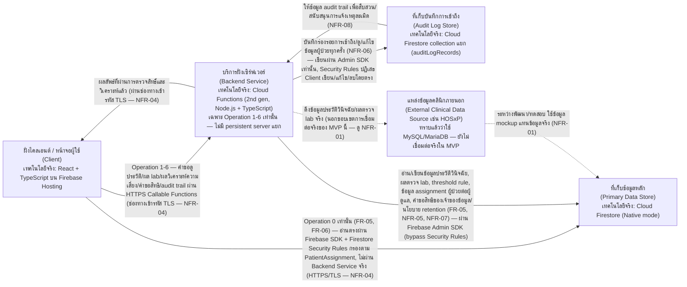
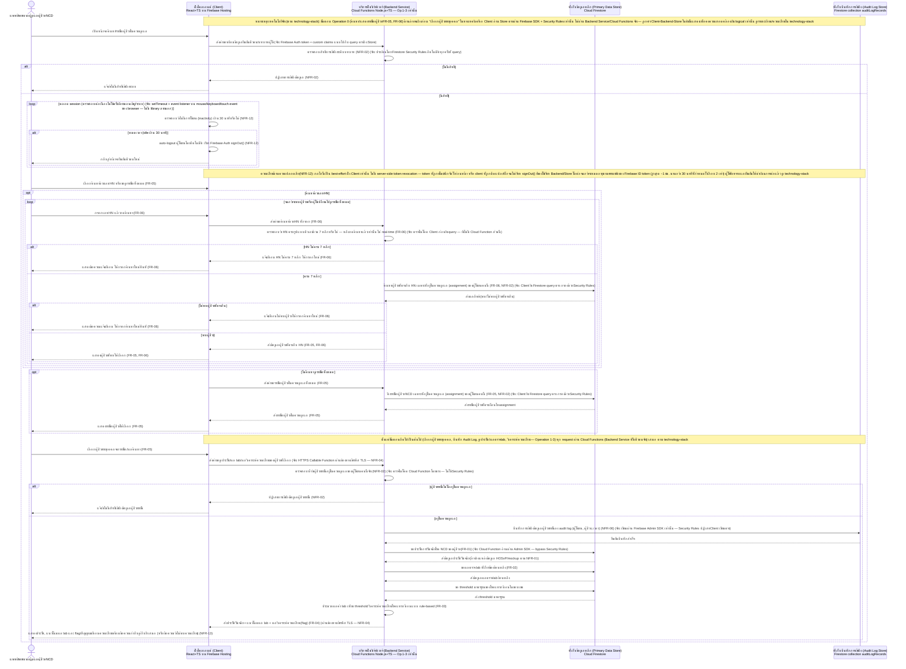
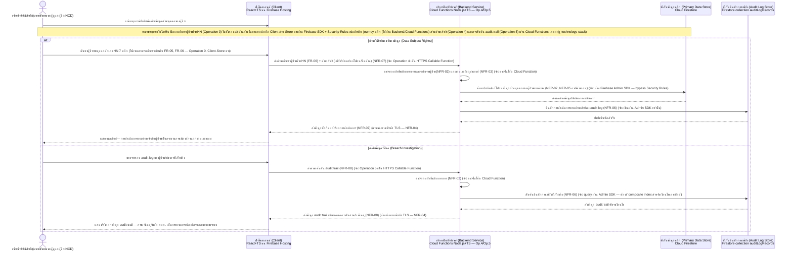

# Architecture (Logical/Conceptual)

เอกสารนี้อธิบายสถาปัตยกรรมระดับ hi-level (logical component + data flow) ของระบบที่รองรับฟีเจอร์ทั้ง
ห้ารายการใน [[feature-list]] และทั้งสอง journey ใน [[user-journey]] อ้างอิงความต้องการต้นทางจาก
[[backlog]] และ spec
[[20260917-01-patient-ncd-history-lab-complication-risk]],
[[20260921-01-pdpa-data-protection-compliance]] (ฟีเจอร์ที่ 4 — คุ้มครองข้อมูลส่วนบุคคลตาม PDPA,
NFR-03–NFR-08) และ
[[20260922-01-operational-quality-nfr]] (ฟีเจอร์ที่ 5 — รับประกันคุณภาพเชิงปฏิบัติการของระบบ,
NFR-09–NFR-16)

**หมายเหตุการอัปเดตล่าสุด (2026-09-22, รอบ sync ที่สาม):** `[[technology-stack]]` ปรับปรุงรอบสองเพิ่ม
decision area 9-12 ระบุกลไกจริงสำหรับ **NFR-09 (Performance), NFR-12 (Session Timeout), NFR-13
(Accessibility), NFR-15 (Browser/Device Compatibility)** ที่เอกสารนี้เคยบันทึกไว้ว่า "ยังไม่มีการ
ตัดสินใจ" แล้ว จึงปรับปรุงเอกสารนี้ตามขั้นตอน 5.7 ให้ครบทั้ง 4 รหัส (ดูหัวข้อ "ขอบเขตความรับผิดชอบของแต่ละ
Component", [[#Cross-cutting: คุณภาพเชิงปฏิบัติการของระบบ (NFR-09–NFR-16)]], sequence diagram ของ
journey หลัก และตาราง Mapping NFR ด้านล่าง) สรุปกลไกที่เพิ่มเข้ามา: NFR-09 = Firestore composite index
เท่านั้น ไม่มี caching layer เพิ่มเติม (มี trade-off ที่บันทึกไว้ชัดเจน); NFR-13 = WCAG 2.1 AA +
Heroicons + Lighthouse Accessibility Audit; NFR-15 = browserslist `">0.5%, last 2 versions, Firefox
ESR, not dead"` — **NFR-12 สำคัญเป็นพิเศษ:** กลไกที่เลือกคือ Client custom inactivity timer เรียก
`signOut()` เท่านั้น **ไม่มี server-side token revocation** ซึ่งมีความเสี่ยงด้านความปลอดภัยที่กระทบภาพรวม
สถาปัตยกรรม (ไม่ใช่รายละเอียดปลีกย่อย) จึงถูกเน้นย้ำไว้หลายจุดในเอกสารนี้ (ดูหัวข้อ Client,
Backend Service — การควบคุมการเข้าถึง, Cross-cutting NFR-09–NFR-16 และตาราง Mapping NFR) รหัสที่ยังไม่
ถูกตัดสินใจใน `[[technology-stack]]` (NFR-10, NFR-11, NFR-14, NFR-16 ใช้กลไกที่มีอยู่แล้วจาก NFR-01–08
หรือเป็นกระบวนการนอกระบบ) คงเดิมไม่เปลี่ยนแปลง

**หมายเหตุสำคัญ (อัปเดต 2026-09-22):** `[[technology-stack]]` มีเนื้อหาแล้ว สรุปคือสถาปัตยกรรม
Firebase-native เต็มรูปแบบ: **React + TypeScript** บน **Firebase Hosting** (Client); ไม่มี Backend
Service แบบ persistent server แยกต่างหาก — แบ่งเป็น 2 เส้นทางจริง: **Operation 0** (ค้นหา/แสดงรายชื่อ
ผู้ป่วย — FR-05, FR-06) ให้ Client อ่าน **Cloud Firestore** ตรงผ่าน Firebase SDK + **Firestore
Security Rules** (ไม่ผ่าน Backend Service จริง) ส่วน **Operation 1-6** (เข้าถึงข้อมูลผู้ป่วยรายบุคคล/
audit trail/คำขอสิทธิทั้งหมด) ผ่าน **Cloud Functions (2nd gen, Node.js + TypeScript)** เป็นตัวกลางเสมอ;
Primary Data Store และ Audit Log Store ทั้งคู่เป็น **Cloud Firestore (Native mode)** คนละ collection;
**Firebase Authentication + Custom Claims** สำหรับ authentication/authorization; **Google-managed
encryption keys** + HTTPS/TLS สำหรับการเข้ารหัส — เอกสารนี้จึงถูกปรับปรุงให้ระบุชื่อเทคโนโลยีจริงกำกับ
component/diagram ทุกจุดตามที่ `[[technology-stack]]` ตัดสินใจไว้ (ดูรายละเอียดเต็มใน
[[technology-stack]]) โดยยังคงคำอธิบายระดับ logical component เดิมไว้ครบทุกจุด เพื่อให้เอกสารอ่าน
เข้าใจได้แม้ไม่ทราบรายละเอียด stack ที่เลือก รายการที่ `[[technology-stack]]` ยังไม่ตัดสินใจ (หรือ
ตัดสินใจเฉพาะระดับพื้นฐานสำหรับ MVP แล้วรอทบทวนในอนาคต) สรุปไว้ในหัวข้อ "ประเด็นรอตัดสินใจ" ท้ายเอกสาร

## ภาพรวม

ระบบมีผู้ใช้บทบาทเดียวคือแพทย์/พยาบาลผู้ดูแลผู้ป่วย NCD (ตามที่ระบุใน [[user-journey]]) ซึ่งต้อง:

0. ค้นหาผู้ป่วยเฉพาะรายด้วยเลข HN รูปแบบตัวเลขล้วน 7 หลักเท่านั้น (ไม่รองรับการค้นหาด้วยชื่ออีกต่อไป —
   FR-06) และ/หรือเรียกดูรายชื่อผู้ป่วย NCD ที่อยู่ในความดูแลของตนเองทั้งหมด (FR-05) เพื่อเลือกผู้ป่วย
   รายบุคคลก่อนเข้าถึงข้อมูลใดๆ ด้านล่าง — เป็นขั้นตอนแรกสุดของ journey เสมอ การตรวจสอบว่ากรอก HN ไม่
   ครบ 7 หลัก หรือค้นหาแล้วไม่พบผู้ป่วยที่ตรงกัน เกิดขึ้น**หลังผู้ใช้กดค้นหาแล้วเท่านั้น** (ไม่ใช่แบบ
   real-time ระหว่างพิมพ์) โดยต้องแจ้งเตือนและให้กรอกค้นหาใหม่ได้ทันที โดยไม่บล็อกการเรียกดูรายชื่อ
   ทั้งหมด (FR-06)
1. ดูประวัติการวินิจฉัยโรค NCD และผลตรวจ lab ย้อนหลังของผู้ป่วยรายบุคคล (FR-01, FR-02)
2. รับผลการวิเคราะห์ความเสี่ยงโรคแทรกซ้อนแบบ rule-based พร้อม flag/สัญญาณเตือนบนหน้าจอ (FR-03,
   FR-04)

ทั้งสามความสามารถต้องอยู่ภายใต้การควบคุมการเข้าถึงเฉพาะบทบาทที่มีสิทธิ์ (NFR-02) และข้อมูลประวัติ/
ผลตรวจ lab ที่ใช้ต้องอ้างอิงแหล่งข้อมูล HOSxP หรือข้อมูล mockup ระหว่างพัฒนา (NFR-01) นอกจากนี้
NFR-02 ยังกำหนดว่าการเข้าถึงต้องถูกจำกัดเพิ่มเติมในระดับรายผู้ป่วยตาม assignment "อยู่ในความดูแล"
ของผู้ใช้งานคนนั้น (ไม่ใช่การมองเห็นตามแผนก/หน่วยงานที่สังกัด) ซึ่งผูกโดยตรงกับ FR-05

นอกจากนี้ ฟีเจอร์ที่ 4 "คุ้มครองข้อมูลส่วนบุคคลของผู้ป่วยตาม PDPA" (NFR-03–NFR-08 ดู
[[feature-list#4. คุ้มครองข้อมูลส่วนบุคคลของผู้ป่วยตาม PDPA|feature-list]]) เป็นข้อกำหนดเชิง
compliance ที่ครอบคลุม**ทั้งระบบ** ไม่ผูกกับฟีเจอร์ใดฟีเจอร์หนึ่งโดยเฉพาะ จึงถูกออกแบบเป็น
cross-cutting concern ที่กระทบทุก component (ดูหัวข้อ
[[#Cross-cutting: การคุ้มครองข้อมูลส่วนบุคคล (PDPA)]] ด้านล่าง) แทนที่จะผูกกับ journey ใด journey
หนึ่งเพียงอย่างเดียว: ระบบต้องจำกัดการ
ประมวลผลข้อมูลเฉพาะเท่าที่จำเป็นตามวัตถุประสงค์การดูแลรักษา (NFR-03), เข้ารหัสข้อมูลทั้งขณะจัดเก็บ
และส่งผ่านเครือข่าย (NFR-04), จำกัดระยะเวลาเก็บรักษาและรองรับการลบข้อมูล (NFR-05), บันทึกร่องรอย
การเข้าถึงข้อมูล (NFR-06), รองรับคำขอใช้สิทธิของเจ้าของข้อมูล (NFR-07) และสนับสนุนข้อมูลสำหรับ
กระบวนการแจ้งเหตุละเมิดข้อมูลส่วนบุคคล (NFR-08)

นอกจากนี้ ฟีเจอร์ที่ 5 "รับประกันคุณภาพเชิงปฏิบัติการของระบบ" (NFR-09–NFR-16 ดู
[[feature-list#5. รับประกันคุณภาพเชิงปฏิบัติการของระบบ (Performance, Availability, Clinical Safety, Session Security, Accessibility, Compatibility, Interoperability)|feature-list]])
เป็นข้อกำหนดเชิงคุณภาพที่ครอบคลุม**ทั้งระบบ**เช่นเดียวกับฟีเจอร์ที่ 4 ไม่ผูกกับฟีเจอร์ใดฟีเจอร์หนึ่ง
โดยเฉพาะ จึงถูกออกแบบเป็น cross-cutting concern อีกกลุ่มหนึ่งที่กระทบทุก component เช่นกัน (ดูหัวข้อ
[[#Cross-cutting: คุณภาพเชิงปฏิบัติการของระบบ (NFR-09–NFR-16)]] ด้านล่าง) ได้แก่: หน้าจอหลักต้อง
ตอบสนองภายในน้อยกว่า 2 วินาที (NFR-09), อ้างอิง SLA มาตรฐานของ Firebase/Google Cloud เป็นเป้าหมาย
uptime (NFR-10), การจับคู่โรค/threshold ที่ใช้ใน Risk Rule Engine ต้องผ่านการยืนยันจากแพทย์ผู้เชี่ยวชาญ
ก่อน deploy ทุกครั้งเป็นข้อกำหนดถาวร (NFR-11), ต้อง auto-logout เมื่อไม่มีการใช้งานเกิน 30 นาที
(NFR-12), ห้ามใช้สีเป็นสัญญาณเดียวในการสื่อความหมาย (NFR-13), Security Rules ต้องมี automated test
ครอบคลุมทุกกรณีสิทธิ์ก่อนใช้งานจริงเสมอ (NFR-14), รองรับ browser หลักเวอร์ชันล่าสุดบน desktop/tablet
(NFR-15) และพิจารณา HL7/FHIR ในอนาคตเมื่อเชื่อมต่อ HOSxP จริง (NFR-16 — Won't have ในเฟสนี้ ยืนยันโดย
ผู้ใช้แล้ว)

สถาปัตยกรรมจึงถูกแบ่งเป็น 5 logical component หลัก ได้แก่ Client, Backend Service, Primary Data
Store, ที่เก็บบันทึกการเข้าถึง (Audit Log Store) และ External Clinical Data Source (ระบบภายนอกที่
ไม่ได้พัฒนาในโปรเจกต์นี้) — ฟีเจอร์ที่ 5 ไม่ต้องการ component ใหม่เพิ่มเติม เพราะ NFR-09–NFR-16
ทุกรหัสอธิบายได้ด้วย component เดิมทั้ง 5 ตัวนี้ (ดูรายละเอียดในหัวข้อขอบเขตความรับผิดชอบของแต่ละ
component และตาราง Mapping NFR ด้านล่าง)

## Component Diagram

หมายเหตุ: ทุกเส้นทางการสื่อสารระหว่าง component ข้างต้นที่มีข้อมูลส่วนบุคคล/ข้อมูลสุขภาพของผู้ป่วยไหล
ผ่าน ต้องเข้ารหัสขณะส่งผ่านเครือข่าย (in transit) และ Primary Data Store กับ Audit Log Store ต้อง
เข้ารหัสข้อมูลขณะจัดเก็บ (at rest) ตาม NFR-04 — เป็น cross-cutting concern ที่ไม่ได้วาดเป็น component
แยกเพราะไม่ใช่หน่วยประมวลผล/จัดเก็บข้อมูลในตัวเอง (ดูรายละเอียดในหัวข้อ Cross-cutting ด้านล่าง)

**หมายเหตุเทคโนโลยีจริง (Client -> Primary Data Store โดยตรง):** เส้นทาง `Client -->|Operation 0|
DataStore` ด้านบนเป็นส่วนเพิ่มเติมจากไดอะแกรมระดับ logical เดิม (ซึ่งเดิมวาดให้ทุกคำขอผ่าน Backend
Service เพียงเส้นทางเดียว) เพิ่มเข้ามาเพื่อสะท้อนการตัดสินใจใน
[[technology-stack#3. สถาปัตยกรรม Backend Service — Firebase-native (ไม่มี Backend Service แยกแบบดั้งเดิม)|decision area 3 ของ technology-stack]]
ที่ให้ Operation 0 (ค้นหา/แสดงรายชื่อผู้ป่วย — ยังไม่มีการระบุผู้ป่วยรายบุคคล ไม่ trigger audit log)
อ่าน Firestore ตรงผ่าน Security Rules แทนที่จะผ่าน Cloud Functions เพื่อความเรียบง่าย ส่วน Operation
1-6 ทั้งหมดยังคงผ่าน Backend Service (Cloud Functions) ตามไดอะแกรมเดิมทุกประการ — การเพิ่มเส้นทางนี้
เป็นการ**เสริมความถูกต้องเชิงเทคนิค ไม่ใช่การเปลี่ยนขอบเขตความรับผิดชอบเชิง logical** ของ component
ใดๆ (Backend Service ยังคงเป็นเจ้าของ logic การควบคุมการเข้าถึง/วิเคราะห์ความเสี่ยง/บันทึก audit log
ทั้งหมดเหมือนเดิม เพียงแต่ Operation 0 ถูกกำหนดไว้ตั้งแต่ต้นใน [[architecture]] แล้วว่าไม่ต้องบันทึก
audit log และมี logic ตรวจสอบไม่ซับซ้อน — ดูความเสี่ยงของแนวทางนี้ต่อ NFR-02 ใน
[[technology-stack#ความเสี่ยงที่ต้องพิจารณาเพิ่มเติม (สำคัญ — ผู้ใช้รับทราบและยืนยันให้ดำเนินการต่อแล้ว)|
หัวข้อความเสี่ยงของ technology-stack]])

**หมายเหตุเทคโนโลยีจริง (Authentication):** การยืนยันตัวตนผู้ใช้ (sign-in) ใช้ **Firebase
Authentication** โดยตรงระหว่าง Client กับบริการของ Firebase (ไม่ผ่าน Backend Service หรือ Primary
Data Store) แล้วแนบ token พร้อม custom claims (บทบาทผู้ใช้) ไปกับทุกคำขอไปยัง Backend Service และ
Primary Data Store ด้านบนเสมอ — ไม่ได้วาดเป็น node แยกในไดอะแกรมนี้เพราะเป็นบริการที่ทุก component
เรียกใช้ร่วมกัน (คล้าย cross-cutting concern) ไม่ใช่หน่วยประมวลผล/จัดเก็บข้อมูลของระบบเอง (ดู
[[technology-stack#7. Authentication/Authorization — Firebase Authentication + Custom Claims|
decision area 7 ใน technology-stack]])

## ขอบเขตความรับผิดชอบของแต่ละ Component

### ฝั่งไคลเอนต์ / หน้าจอผู้ใช้ (Client) — เทคโนโลยีจริง: [[technology-stack#1. ภาษา/Framework ฝั่ง Client — React + TypeScript|React + TypeScript]] บน Firebase Hosting

- แสดงหน้าจอค้นหา/รายชื่อผู้ป่วย NCD ที่อยู่ในความดูแลของผู้ใช้งาน มีช่องกรอกเฉพาะเลข HN (ไม่รองรับ
  คำค้นอิสระ/ชื่อผู้ป่วยอีกต่อไป) และส่งคำขอค้นหาไปยัง Backend Service ก็ต่อเมื่อผู้ใช้กดค้นหาเท่านั้น
  (ไม่ตรวจสอบความยาว/รูปแบบเองแบบ real-time ระหว่างพิมพ์ — การตรวจสอบเป็นหน้าที่ของ Backend Service
  หลังกดค้นหา) หรือแสดงรายชื่อทั้งหมดเมื่อไม่ค้นหา แล้วให้แพทย์/พยาบาลเลือกผู้ป่วยรายบุคคลจากรายชื่อ
  ก่อนเข้าดูข้อมูลใดๆ ด้านล่าง เป็นขั้นตอนแรกสุดของ journey เสมอ (FR-05, FR-06)
- แสดงข้อความแจ้งเตือนที่ได้รับจาก Backend Service เมื่อกรอก HN ไม่ครบ 7 หลัก หรือค้นหาด้วย HN ที่ครบ
  7 หลักแล้วแต่ไม่พบผู้ป่วยที่ตรงกัน แล้วให้ผู้ใช้กรอกค้นหาใหม่ได้ทันที โดยไม่บล็อกการเรียกดูรายชื่อ
  ทั้งหมด (FR-06)
- แสดงประวัติการวินิจฉัยโรค NCD เรียงตามช่วงเวลา (FR-01)
- แสดงแนวโน้มผลตรวจ lab ย้อนหลัง (FR-02)
- แสดง flag/สัญญาณเตือนความเสี่ยงโรคแทรกซ้อนที่มองเห็นได้ชัดเจน หรือข้อความเมื่อไม่พบความเสี่ยง
  (FR-04)
- แสดงข้อความปฏิเสธการเข้าถึงเมื่อ Backend Service แจ้งว่าผู้ใช้ไม่มีสิทธิ์ (NFR-02)
- ไม่ทำการประมวลผลความเสี่ยงเอง (logic การประเมินความเสี่ยงเป็นหน้าที่ของ Backend Service เท่านั้น)
- ส่ง/รับข้อมูลผู้ป่วยทุกครั้งผ่านช่องทางที่เข้ารหัสขณะส่งผ่านเครือข่าย (in transit) และไม่เก็บ/cache
  ข้อมูลผู้ป่วยที่ละเอียดอ่อนไว้เกินความจำเป็นบนฝั่งผู้ใช้ (NFR-04)
- แสดงผลหน้าจอค้นหา/ประวัติวินิจฉัย/ผลตรวจ lab/ผลวิเคราะห์ความเสี่ยงภายในเวลาที่ผู้ใช้รับรู้ได้ว่า
  "เร็ว" สอดคล้องกับเป้าหมายการตอบสนองรวมน้อยกว่า 2 วินาทีของทั้งระบบ (NFR-09 — Backend Service/Primary
  Data Store เป็นผู้รับผิดชอบหลักด้านเวลาประมวลผล แต่ Client ต้องไม่เพิ่ม latency ที่ไม่จำเป็น เช่น
  render ที่หนักเกินไป)
  - **กลไกจริง:** [[technology-stack#9. กลไกรองรับ Performance < 2 วินาที (NFR-09) — Firestore Composite Index เท่านั้น (ไม่มี caching layer เพิ่มเติม)|
    Firestore composite index เท่านั้น]] — ไม่มี in-memory caching หรือ managed caching layer (Redis/
    Memorystore) เพิ่มเติมในรอบนี้ **Trade-off:** ทุก request ยังอ่าน Cloud Firestore ทุกครั้งแม้เป็น
    ข้อมูลอ้างอิงคงที่ (เช่น threshold) — คาดว่ายังทำ < 2 วินาทีได้ที่สเกล ~20 concurrent users ปัจจุบัน
    ถ้าพบปัญหาจริงจากการทดสอบ ขั้นตอนถัดไปคือ in-memory caching ใน Cloud Functions (ดู "ประเด็นรอ
    ตัดสินใจ")
- ติดตามช่วงเวลาที่ผู้ใช้ไม่มีการโต้ตอบกับหน้าจอ (inactivity) ต่อเนื่องตลอด session และเมื่อเกิน
  30 นาที ต้อง auto-logout ผู้ใช้งานโดยอัตโนมัติ กลับไปหน้าจอยืนยันตัวตนใหม่ (NFR-12)
  - **กลไกจริง:** [[technology-stack#10. กลไก Session Timeout (NFR-12) — Client Custom Inactivity Timer เท่านั้น (ไม่มี Server-side Token Revocation)|
    Client custom inactivity timer]] เขียนเองด้วย `setTimeout` + event listener บน mouse/keyboard/
    touch event มาตรฐานของ browser เมื่อ idle ครบ 30 นาทีเรียก Firebase Authentication `signOut()`
    ทันที — **ไม่มี library ภายนอก (เช่น `react-idle-timer`) และไม่มีกลไกฝั่งเซิร์ฟเวอร์เพิกถอน token**
  - **ความเสี่ยงด้านความปลอดภัยที่ต้องรับทราบ (สำคัญ — กระทบภาพรวมสถาปัตยกรรมด้าน security ไม่ใช่แค่
    รายละเอียดปลีกย่อย):** กลไกนี้เป็น **best-effort ฝั่ง Client เท่านั้น** — ล็อกเอาต์ระดับ UI/session
    เท่านั้น **ไม่ได้ทำให้ Firebase ID token เป็นโมฆะจริงฝั่งเซิร์ฟเวอร์** ถ้า token ถูกขโมย/ดักจับไว้
    ก่อนหน้า (อุปกรณ์สูญหายพร้อม token ที่ intercept ไว้แล้ว) หรือ client ถูกดัดแปลง/บั๊กจนไม่เรียก
    `signOut()` เมื่อ idle จริง **token นั้นยังใช้เรียก Backend Service/Primary Data Store ได้ต่อจนกว่า
    จะหมดอายุตามธรรมชาติของ Firebase ID token (สูงสุดประมาณ 1 ชั่วโมง) — นานกว่า 30 นาทีที่ NFR-12
    กำหนดไว้เกือบ 2 เท่า** ช่องว่างนี้ไม่ถูกปิดโดยกลไกตรวจสอบสิทธิ์อื่นที่มีอยู่แล้ว เพราะ Backend
    Service ตรวจสอบเพียงว่า token ยังไม่หมดอายุ/ถูกต้องเท่านั้น ไม่มีข้อมูล inactivity ของ Client (ดู
    รายละเอียดที่หัวข้อ Backend Service — การควบคุมการเข้าถึง ด้านล่าง และ
    [[technology-stack#ความเสี่ยงเพิ่มเติม: NFR-12 Session Timeout เป็น Best-effort ฝั่ง Client เท่านั้น (ไม่มี Server-side Token Revocation)|
    หัวข้อความเสี่ยงเต็มใน technology-stack]]) ผู้ใช้รับทราบและยืนยันให้ดำเนินการต่อด้วยแนวทางนี้ในรอบ
    MVP นี้แล้ว โดยมีข้อแนะนำให้ลด TTL ของ token และเพิ่ม server-side token revocation ก่อนใช้งานกับ
    ข้อมูลผู้ป่วยจริง
- แสดง flag/สัญญาณเตือนความเสี่ยงและองค์ประกอบ UI ที่สื่อความหมายด้วยสีทุกจุด (โดยเฉพาะ FR-04) ต้องมี
  ข้อความกำกับคู่กับสีเสมอ ห้ามใช้สีเป็นสัญญาณเดียวในการสื่อความหมาย (NFR-13)
  - **กลไกจริง:** [[technology-stack#11. Design Token/Icon Library สำหรับ Accessibility (NFR-13) — WCAG 2.1 Level AA + Heroicons + Lighthouse|
    มาตรฐาน WCAG 2.1 Level AA]] (contrast ratio ≥ 4.5:1 ข้อความปกติ, ≥ 3:1 ข้อความขนาดใหญ่/UI
    component) กำกับ design token สีใน [[DESIGN]] ทุกจุด, ใช้ **Heroicons** (open-source, MIT) เป็นชุด
    ไอคอนมาตรฐานกำกับคู่กับสีทุกจุดที่สื่อความหมาย (โดยเฉพาะ flag ความเสี่ยงจาก FR-04) และตรวจสอบด้วย
    **Lighthouse Accessibility Audit** ก่อน deploy ทุกครั้ง — รายละเอียด mapping สี/ไอคอนเฉพาะจุดเป็น
    หน้าที่ของ [[DESIGN]]/`detailed-design/` ต่อไป
- ต้องแสดงผลได้ถูกต้องบน browser หลักเวอร์ชันล่าสุด (Chrome/Edge/Firefox) บนอุปกรณ์ desktop/tablet
  (NFR-15)
  - **กลไกจริง:** [[technology-stack#12. Browserslist/Matrix การทดสอบสำหรับ Browser Compatibility (NFR-15)|
    browserslist config]] `">0.5%, last 2 versions, Firefox ESR, not dead"` ในไฟล์ build config ของ
    React SPA + ทดสอบ manual บน Chrome/Edge/Firefox desktop เวอร์ชันล่าสุดจริง และจำลอง tablet ผ่าน
    Chrome DevTools device emulation (ไม่ใช้บริการ cross-browser testing เสียเงิน)
- **เทคโนโลยีจริง:** ตาม [[technology-stack#1. ภาษา/Framework ฝั่ง Client — React + TypeScript|decision area 1]]
  ใช้ React + TypeScript build เป็น static SPA deploy บน Firebase Hosting (free tier/Spark plan
  เพียงพอสำหรับขนาดผู้ใช้งาน ~20 concurrent users) — สำหรับ Operation 0 (ค้นหา/แสดงรายชื่อผู้ป่วย)
  Client เรียก Firestore SDK อ่านข้อมูลตรง (ไม่ผ่าน Backend Service); สำหรับ Operation 1-6 Client
  เรียกผ่าน HTTPS Callable Functions ไปยัง Cloud Functions เสมอ (ดูหัวข้อ "บริการฝั่งเซิร์ฟเวอร์"
  ด้านล่าง)

### บริการฝั่งเซิร์ฟเวอร์ (Backend Service) — เทคโนโลยีจริง: [[technology-stack#2. ภาษา/Framework ฝั่ง Backend Logic — Node.js + TypeScript บน Cloud Functions|Cloud Functions (2nd gen), Node.js + TypeScript]]

**หมายเหตุเทคโนโลยีจริงสำคัญ:** ตาม
[[technology-stack#3. สถาปัตยกรรม Backend Service — Firebase-native (ไม่มี Backend Service แยกแบบดั้งเดิม)|
decision area 3 ของ technology-stack]] Backend Service ในความเป็นจริง**ไม่มี persistent server
แยกต่างหาก** — Backend Service ที่อธิบายด้านล่างนี้มีตัวตนจริงเฉพาะสำหรับ **Operation 1-6** เท่านั้น
(implement เป็น Cloud Functions) ส่วน **Operation 0** (ค้นหา/แสดงรายชื่อผู้ป่วย — FR-05, FR-06) ถูก
implement เป็น Client อ่าน Primary Data Store ตรงผ่าน Firestore Security Rules แทน (ดูรายละเอียดที่
หมายเหตุใต้ Component Diagram ด้านบน) — ขอบเขตความรับผิดชอบเชิง logical ของกลุ่มงาน "การควบคุมการ
เข้าถึง" และ "การรวบรวมข้อมูล" ด้านล่างจึงยังคงถูกต้องเสมอในระดับหลักการ แต่ **กลไกจริงที่บังคับใช้
ส่วนที่เกี่ยวกับ Operation 0 คือ Firestore Security Rules ไม่ใช่โค้ดของ Cloud Functions**

แบ่งความรับผิดชอบภายในเป็น 5 กลุ่มงานเชิงตรรกะ (ไม่ใช่ deployment unit แยกกันจริงทั้งหมด — ทุกกลุ่มงาน
ยกเว้นส่วนที่กล่าวถึงข้างต้น implement เป็น Cloud Functions (2nd gen) แยกฟังก์ชันตามกลุ่มงาน (callable
functions สำหรับ Operation 1-5, scheduled function ผ่าน Cloud Scheduler สำหรับ Operation 6) ภายใน
Firebase project เดียวกัน ตาม [[technology-stack#6. Hosting/Deployment Environment|decision area 6
ใน technology-stack]]):

- **การควบคุมการเข้าถึง (Access Control):** ตรวจสอบตัวตนและสิทธิ์ของผู้ใช้ทุกคำขอ อนุญาตเฉพาะ
  บทบาทแพทย์/พยาบาลผู้ดูแลผู้ป่วย NCD เท่านั้นก่อนให้เข้าถึงข้อมูลประวัติ/ผลตรวจ lab/ผลวิเคราะห์
  ความเสี่ยงของผู้ป่วยรายใด ๆ (NFR-02) รวมถึงตรวจสอบเพิ่มเติมในระดับรายผู้ป่วยว่าผู้ป่วยที่ถูกร้องขอ
  ข้อมูล (ทั้งตอนค้นหา/แสดงรายชื่อ และตอนเข้าดูข้อมูลรายบุคคล) อยู่ในความดูแล (assignment) ของ
  ผู้ใช้งานคนนั้นจริง ไม่ใช่ตามแผนก/หน่วยงานที่สังกัด (FR-05, NFR-02) และบังคับหลัก purpose
  limitation — จำกัดขอบเขตข้อมูล/การประมวลผลที่ส่งต่อให้ทุกกลุ่มงานด้านล่างเฉพาะเท่าที่จำเป็นต่อ
  วัตถุประสงค์การดูแลรักษาผู้ป่วยตามขอบเขตของ FR-01–FR-04 เท่านั้น ไม่อนุญาตให้นำข้อมูลไปใช้นอก
  วัตถุประสงค์โดยไม่มีฐานทางกฎหมายรองรับ (NFR-03)
  - **กลไกจริง:** [[technology-stack#7. Authentication/Authorization — Firebase Authentication + Custom Claims|Firebase Authentication + Custom Claims]]
    เก็บบทบาทผู้ใช้ไว้ใน token — ตรวจสอบระดับบทบาทใน **Firestore Security Rules** (Operation 0)
    และในโค้ด **Cloud Functions** (Operation 1-6); การตรวจสอบระดับรายผู้ป่วย (PatientAssignment)
    แยกจาก custom claims เสมอ (query/exists check กับ Firestore เพราะเปลี่ยนแปลงได้บ่อยกว่า) ทั้งสอง
    ที่ — **ข้อควรระวัง:** [[technology-stack]] บันทึกไว้ว่าการเขียน logic ตรวจสอบสิทธิ์ 2 ระดับใน
    Firestore Security Rules (สำหรับ Operation 0) มีความเสี่ยงตั้งค่าผิดพลาดสูงกว่าการตรวจสอบในโค้ด
    Cloud Functions ต้องมี automated test ด้วย Firebase Emulator Suite ก่อนใช้งานจริง (ดู
    [[technology-stack#ความเสี่ยงที่ต้องพิจารณาเพิ่มเติม (สำคัญ — ผู้ใช้รับทราบและยืนยันให้ดำเนินการต่อแล้ว)|
    หัวข้อความเสี่ยงใน technology-stack]]) — ข้อกำหนดนี้เป็นเนื้อหาเดียวกับ **NFR-14 (Security Rules
    Verification)** ของฟีเจอร์ที่ 5 โดยตรง: ทุกกรณีสิทธิ์ (ผู้ใช้ไม่มี assignment, ผู้ใช้มี assignment
    บางส่วน, บัญชีถูกระงับ, ไม่มี custom claims ที่ถูกต้อง) ต้องมี automated test ผ่าน Firebase Emulator
    Suite ครอบคลุมก่อน deploy ใช้งานกับข้อมูลผู้ป่วยจริงเสมอ
  - **ความสัมพันธ์กับ NFR-12 (Session Timeout) — รวมความเสี่ยงด้านความปลอดภัยที่ต้องรับทราบ:** การ
    ตรวจสอบสิทธิ์ระดับบทบาท/รายผู้ป่วยข้างต้นเกิดขึ้นทุกครั้งที่มีคำขอใหม่จาก Client อยู่แล้ว โดยตรวจสอบ
    เพียงว่า token ที่แนบมา**ถูกต้องและยังไม่หมดอายุ**เท่านั้น กลไกตรวจจับ "ไม่มีการใช้งานเกิน 30 นาที"
    เอง เป็นหน้าที่หลักของ Client (ดูหัวข้อ Client ด้านบน — `setTimeout` + event listener เรียก
    `signOut()`) เนื่องจากต้องอาศัยการติดตามการโต้ตอบของผู้ใช้บนหน้าจอ ซึ่ง Backend Service ไม่สามารถ
    สังเกตเห็นได้โดยตรง **`[[technology-stack]]` ตัดสินใจแล้วว่าจะไม่มีกลไกฝั่งเซิร์ฟเวอร์เพื่อบังคับใช้
    ซ้ำ (ไม่มี server-side token revocation)** — Access Control ของ Backend Service จึง**ไม่สามารถ
    ปฏิเสธ token ที่ "ยังไม่หมดอายุตามธรรมชาติ แต่ควรถูกเพิกถอนแล้วเพราะผู้ใช้ idle เกิน 30 นาที" ได้จริง**
    เกิดช่องว่างที่ token ยังใช้เรียก Cloud Functions/Firestore ได้ต่อจนกว่าจะหมดอายุตามธรรมชาติ
    (สูงสุดประมาณ 1 ชั่วโมง) ซึ่งนานกว่าที่ NFR-12 กำหนดไว้เกือบ 2 เท่า — เป็นความเสี่ยงที่เชื่อมโยงกับ
    NFR-02 โดยตรง (ผู้ใช้รับทราบและยืนยันให้ดำเนินการต่อด้วยแนวทาง client-only แล้ว ดูรายละเอียดเต็มใน
    [[technology-stack#ความเสี่ยงเพิ่มเติม: NFR-12 Session Timeout เป็น Best-effort ฝั่ง Client เท่านั้น (ไม่มี Server-side Token Revocation)|
    หัวข้อความเสี่ยงใน technology-stack]] และหัวข้อ Client ด้านบน) — มาตรการป้องกันที่ควรพิจารณาก่อน
    ใช้งานจริงกับข้อมูลผู้ป่วยจริง (ลด TTL ของ token, เพิ่ม server-side revocation) บันทึกไว้ใน "ประเด็น
    รอตัดสินใจ" ท้ายเอกสาร
- **การรวบรวมข้อมูล (Data Aggregation):** รับคำขอค้นหาผู้ป่วยด้วยเลข HN จาก Client หลังผู้ใช้กดค้นหา
  แล้วเท่านั้น (ไม่ real-time) แล้วตรวจสอบก่อนว่ากรอกครบรูปแบบตัวเลขล้วน 7 หลักหรือไม่ — ถ้าไม่ครบ
  ส่งข้อความแจ้งเตือนกลับให้ Client ทันทีโดยไม่ค้นหาต่อ; ถ้าครบจึงค้นหาในข้อมูล assignment ของผู้ใช้งาน
  คนนั้นใน Primary Data Store ต่อ และถ้าค้นหาแล้วไม่พบผู้ป่วยที่ตรงกัน ส่งข้อความแจ้งเตือน "ไม่พบผู้ป่วย"
  กลับให้ Client เช่นกัน โดยทั้งสองกรณีต้องให้ผู้ใช้กรอกค้นหาใหม่ได้ทันทีโดยไม่บล็อกการเรียกดูรายชื่อ
  ทั้งหมด (FR-06); นอกจากนี้ยังค้นหา/ดึงรายชื่อผู้ป่วย NCD ที่อยู่ในความดูแลของผู้ใช้งานปัจจุบันจาก
  Primary Data Store ทั้งหมดเมื่อไม่มีคำค้น แล้วส่งต่อให้ Client เป็นขั้นตอนแรกสุดก่อนเข้าถึงข้อมูลผู้ป่วย
  รายบุคคลใดๆ (FR-05); และดึงประวัติการวินิจฉัยและผลตรวจ lab ย้อนหลังของผู้ป่วยที่เลือกแล้วจาก Primary
  Data Store (ซึ่งสะท้อนข้อมูลจาก External Clinical Data Source หรือ mockup) แล้วจัดรูปแบบส่งต่อให้
  Client (FR-01, FR-02, NFR-01)
  - **กลไกจริง:** ส่วนค้นหา/แสดงรายชื่อ (Operation 0 — FR-05, FR-06) implement เป็น Client อ่าน
    Cloud Firestore ตรงผ่าน Security Rules (Client-side เท่านั้น ไม่มีโค้ด Cloud Functions ส่วนนี้);
    ส่วนดึงประวัติวินิจฉัย/ผลตรวจ lab (Operation 1, 2 — FR-01, FR-02) implement เป็น Cloud Functions
    (callable) ตาม [[technology-stack#ตารางสรุป Component → เทคโนโลยีที่เลือก|ตารางสรุปเทคโนโลยีใน
    technology-stack]]
- **การวิเคราะห์ความเสี่ยง (Risk Rule Engine):** ประมวลผลค่า lab ของผู้ป่วยเทียบกับ threshold
  มาตรฐานของโรคแทรกซ้อนในขอบเขต (ไตวายเรื้อรัง, โรคหัวใจ, โรคหลอดเลือดสมอง) แบบ rule-based
  (ไม่ใช้ AI/ML ใน MVP ตามขอบเขตของ spec) แล้วส่งผลลัพธ์ระดับความเสี่ยงให้ Client แสดงผล (FR-03,
  FR-04)
  - **กลไกจริง:** Cloud Functions (2nd gen, Node.js + TypeScript) — Operation 3 (callable) — เขียน
    logic เปรียบเทียบ threshold เป็นโค้ดโดยตรง (ตาม
    [[technology-stack#2. ภาษา/Framework ฝั่ง Backend Logic — Node.js + TypeScript บน Cloud Functions|เหตุผลใน technology-stack]]
    ที่ระบุว่าชัดเจน/unit test ได้ง่ายกว่าการเขียนเป็น Security Rules)
  - **ข้อกำหนดกระบวนการ (NFR-11 — Clinical Safety Validation):** การจับคู่โรคหลัก→โรคแทรกซ้อนและค่า
    threshold ผลตรวจ lab ที่เขียนเป็น logic ในกลุ่มงานนี้ ทุกครั้งที่มีการเพิ่ม/แก้ไข rule ต้องผ่านการ
    ยืนยันจากแพทย์ผู้เชี่ยวชาญก่อน deploy ใช้งานจริงเสมอ เป็นข้อกำหนดถาวรไม่มีวันสิ้นสุด — **นี่คือ
    กระบวนการเชิงองค์กร (governance/deployment gate) ที่เกิดขึ้น "นอกระบบ" ก่อนที่โค้ดของ Risk Rule
    Engine จะถูก deploy** ไม่ใช่ behavior ที่ระบบต้อง implement เป็นโค้ด/UI ใดๆ ขณะรันจริง จึงไม่มี
    "กลไกจริง" ทางเทคนิคให้ระบุจาก `[[technology-stack]]` (และไม่ควรมี เพราะเป็นกระบวนการของมนุษย์)
    ทีมพัฒนา/ทีม IT ที่ดูแล deployment pipeline ในอนาคตควรเพิ่มขั้นตอนนี้เป็น manual approval gate
    ก่อน deploy Cloud Function ของ Risk Rule Engine ทุกครั้ง — ดูรายละเอียดที่เกี่ยวข้องเรื่องค่า
    threshold ที่ยังไม่ถูกกำหนดจริงใน spec ต้นทางที่หัวข้อ "ประเด็นรอตัดสินใจอื่น" ด้านล่างด้วย (เป็น
    ประเด็นที่เชื่อมโยงกัน)
- **การบันทึกและตรวจสอบร่องรอยการเข้าถึง (Audit Logging & Accountability):** บันทึกทุกเหตุการณ์
  ที่มีการเข้าถึง/ดู/แก้ไขข้อมูลส่วนบุคคลหรือข้อมูลสุขภาพของผู้ป่วยลง Audit Log Store โดยระบุอย่างน้อย
  ว่าผู้ใช้งานคนใดเข้าถึงข้อมูลของผู้ป่วยรายใด เมื่อใด และผ่านการดำเนินการใด (ค้นหา/ดู/แก้ไข/สกัด
  ข้อมูลตามคำขอสิทธิ) เพื่อรองรับการตรวจสอบย้อนหลังตามหลัก Accountability (NFR-06) และให้บริการค้น
  คืนข้อมูล audit trail แก่เจ้าหน้าที่ที่มีสิทธิ์เพื่อสนับสนุนการสืบสวน/แจ้งเหตุละเมิดข้อมูลส่วนบุคคล
  ภายในกรอบเวลาที่กฎหมายกำหนด (NFR-08)
  - **กลไกจริง:** Cloud Functions เขียนลง Cloud Firestore collection `auditLogRecords` ผ่าน
    **Firebase Admin SDK เท่านั้น** (bypass Security Rules) — Security Rules กำหนด
    `allow read, write: if false;` สำหรับ Client ทั้งหมดในcollection นี้ เพื่อบังคับคุณสมบัติ
    append-only/immutable และบังคับให้ทุกการเข้าถึงข้อมูลผู้ป่วยรายบุคคลต้องผ่าน Cloud Functions
    เสมอ (ดู [[technology-stack#5. Audit Log Store — Cloud Firestore collection แยก เขียนผ่าน Cloud Functions เท่านั้น|
    decision area 5 ใน technology-stack]]); Operation 5 (สืบค้น audit trail) เป็น callable function
    เช่นกัน
- **การจัดการคำขอสิทธิของเจ้าของข้อมูลและนโยบายการเก็บรักษา (Data Subject Rights & Retention
  Management):** รับคำขอจากเจ้าหน้าที่ที่มีสิทธิ์ (แทนผู้ป่วยที่ยื่นคำขอผ่านกระบวนการของหน่วยงาน) เพื่อ
  ค้นหา/สกัด/แก้ไข/ลบข้อมูลส่วนบุคคลของผู้ป่วยรายบุคคลตามสิทธิที่ PDPA กำหนด (เข้าถึง/สำเนา/แก้ไข/ลบ/
  คัดค้าน) โดยตรวจสอบสิทธิ์ผ่าน Access Control ก่อนเสมอ แล้วส่งต่อ Audit Logging เพื่อบันทึกการ
  ดำเนินการ (NFR-07); และบังคับใช้นโยบายจำกัดระยะเวลาเก็บรักษาข้อมูลกับ Primary Data Store พร้อม
  รองรับการลบ/ทำลายข้อมูลเมื่อพ้นระยะเวลาหรือไม่มีความจำเป็นแล้ว (NFR-05) — ระยะเวลาที่แน่นอนยังไม่
  ถูกกำหนด (ดู "ประเด็นรอตัดสินใจ")
  - **กลไกจริง:** Cloud Functions — Operation 4 (คำขอสิทธิ) เป็น callable function เรียกจาก Client
    โดยตรง; Operation 6 (บังคับใช้ retention) เป็น **scheduled function ผ่าน Cloud Scheduler**
    ไม่ใช่ operation ที่ Client เรียก (ตาม
    [[technology-stack#ตารางสรุป Component → เทคโนโลยีที่เลือก|ตารางสรุปเทคโนโลยีใน
    technology-stack]]) — ค่าระยะเวลา schedule ที่แน่นอนยังรอค่า RetentionPolicy จริง
    (ดู "ประเด็นรอตัดสินใจ")

### ที่เก็บข้อมูลหลัก (Primary Data Store) — เทคโนโลยีจริง: [[technology-stack#4. Database Engine ของ Primary Data Store — Cloud Firestore (Native mode)|Cloud Firestore (Native mode)]]

- เก็บข้อมูลประวัติการวินิจฉัยโรค NCD และผลตรวจ lab ย้อนหลังของผู้ป่วยแต่ละราย ในรูปแบบที่ Backend
  Service เรียกใช้ได้โดยไม่ผูกกับรูปแบบข้อมูลต้นทางใดต้นทางหนึ่งโดยเฉพาะ (canonical/logical data
  model)
- เก็บ threshold มาตรฐานที่ใช้ในการประเมินความเสี่ยงโรคแทรกซ้อน (ใช้โดย Risk Rule Engine)
- เก็บข้อมูล assignment ระดับรายผู้ป่วยระหว่างแพทย์/พยาบาลผู้ดูแลกับผู้ป่วยแต่ละราย เพื่อใช้ค้นหา/
  แสดงรายชื่อผู้ป่วยในความดูแล (FR-05) และใช้เป็นเงื่อนไขตรวจสอบสิทธิ์ระดับรายผู้ป่วยโดย Access
  Control (NFR-02)
- ระหว่างพัฒนา/ทดสอบ ทำหน้าที่เป็นแหล่งข้อมูล mockup แทนข้อมูลจริงจาก HOSxP (NFR-01)
- ต้องเข้ารหัสข้อมูลส่วนบุคคล/ข้อมูลสุขภาพของผู้ป่วยที่จัดเก็บไว้ขณะพัก (at rest) เสมอ (NFR-04)
- ต้องรองรับนโยบายจำกัดระยะเวลาเก็บรักษาและการลบ/ทำลายข้อมูลเมื่อพ้นระยะเวลาที่กำหนด หรือเมื่อ
  Backend Service (Data Subject Rights & Retention Management) ร้องขอการลบตามคำขอใช้สิทธิของ
  เจ้าของข้อมูล (NFR-05, NFR-07)
- **หมายเหตุเทคโนโลยีจริง:** [[db-spec]] ออกแบบ ER model เป็น relational เต็มรูปแบบ (foreign key,
  ความสัมพันธ์ N:M) แต่ Cloud Firestore เป็น NoSQL document store ไม่มี join/foreign key constraint
  แบบ native จึงต้อง **denormalize** เมื่อ implement จริง (เช่น PatientAssignment เป็น
  subcollection/composite document ID, RiskFinding เก็บแบบ snapshot ค่า threshold) — แนวทางเบื้องต้น
  และ composite index ที่ต้องออกแบบ ดู
  [[technology-stack#4. Database Engine ของ Primary Data Store — Cloud Firestore (Native mode)|
  decision area 4 ใน technology-stack]] รายละเอียด schema สุดท้ายกำหนดในรอบ `sync-api-db` ถัดไป
  (ดู "ประเด็นรอตัดสินใจ")
- **กลไกเข้ารหัสจริง (NFR-04):** Google-managed encryption keys (ค่าเริ่มต้นของ Firestore) — ดู
  [[technology-stack#8. กลไกเข้ารหัสข้อมูล (NFR-04) และการบริหารกุญแจเข้ารหัส|decision area 8 ใน
  technology-stack]]
- **Security Rules Verification (NFR-14):** Firestore Security Rules ที่ควบคุมสิทธิ์การเข้าถึง
  collection `patients`, `patientAssignments` และ collection อื่นในที่เก็บนี้ (ใช้จริงสำหรับ
  Operation 0 ตาม [[technology-stack]]) ต้องผ่าน automated test ด้วย Firebase Emulator Suite
  ครอบคลุมทุกกรณีสิทธิ์ก่อน deploy ใช้งานกับข้อมูลผู้ป่วยจริงเสมอ (ดูรายละเอียดกรณีทดสอบที่ต้องครอบคลุม
  ในหัวข้อ Backend Service — การควบคุมการเข้าถึง ด้านบน)

### ที่เก็บบันทึกการเข้าถึง (Audit Log Store) — เทคโนโลยีจริง: [[technology-stack#5. Audit Log Store — Cloud Firestore collection แยก เขียนผ่าน Cloud Functions เท่านั้น|Cloud Firestore collection แยก (`auditLogRecords`)]]

- เก็บบันทึกร่องรอยการเข้าถึง/ดู/แก้ไขข้อมูลส่วนบุคคลและข้อมูลสุขภาพของผู้ป่วยทุกครั้งที่ Backend
  Service (Audit Logging & Accountability) บันทึกเข้ามา (ผู้ใช้งานคนใด เข้าถึงข้อมูลของผู้ป่วยรายใด
  เมื่อใด ผ่านการดำเนินการใด) (NFR-06)
- แยกออกจาก Primary Data Store โดยเจตนาในระดับ logical เนื่องจากมีคุณสมบัติที่ต้องการต่างกัน —
  บันทึกต้องคงสภาพเดิมไม่ถูกแก้ไข/ลบระหว่างช่วงเวลาที่ต้องเก็บรักษาไว้เพื่อการตรวจสอบ (append-only/
  immutable ในเชิงหลักการ) และอาจมีนโยบาย retention ที่ต่างจากข้อมูลทางคลินิกหลัก
- ต้องเข้ารหัสข้อมูลขณะพัก (at rest) เช่นเดียวกับ Primary Data Store เพราะบันทึกอาจมีข้อมูลระบุตัวตน
  ผู้ป่วยปะปนอยู่ (NFR-04)
- ให้บริการสืบค้นข้อมูล audit trail แก่ Backend Service เพื่อสนับสนุนการตรวจสอบย้อนหลังและการสืบสวน/
  แจ้งเหตุละเมิดข้อมูลส่วนบุคคล (NFR-08)
- **หมายเหตุเทคโนโลยีจริง:** ใช้ engine เดียวกับ Primary Data Store (Cloud Firestore) แต่แยก
  collection (`auditLogRecords`) — **เฉพาะ Cloud Functions (ผ่าน Firebase Admin SDK) เท่านั้นที่
  เขียนได้** Security Rules กำหนด `allow read, write: if false;` สำหรับ Client ทั้งหมด เพื่อบังคับ
  ทั้งคุณสมบัติ immutable และบังคับให้ทุกการเข้าถึงต้องผ่าน Cloud Functions เสมอ (ดู
  [[technology-stack#5. Audit Log Store — Cloud Firestore collection แยก เขียนผ่าน Cloud Functions เท่านั้น|
  decision area 5 ใน technology-stack]]) — การสืบค้นแบบหลายเงื่อนไขพร้อมกัน (ผู้ป่วย/ผู้ใช้/ช่วงเวลา
  ตาม Operation 5) ต้องออกแบบ composite index ใน `firestore.indexes.json` ล่วงหน้า
- **Security Rules Verification (NFR-14):** rule `allow read, write: if false;` ของ collection
  `auditLogRecords` เอง ก็ต้องอยู่ในชุด automated test ผ่าน Firebase Emulator Suite ด้วยเช่นกัน (ยืนยัน
  ว่า Client ไม่สามารถอ่าน/เขียน/แก้ไข/ลบระเบียนใน collection นี้ได้โดยตรงไม่ว่ากรณีใด) ก่อนใช้งานจริง

### แหล่งข้อมูลคลินิกภายนอก (External Clinical Data Source เช่น HOSxP)

- เป็นระบบภายนอกที่ไม่ได้พัฒนาในโปรเจกต์นี้ ถือเป็นแหล่งความจริงของประวัติวินิจฉัยและผลตรวจ lab ใน
  การใช้งานจริง (production)
- รายละเอียดการเชื่อมต่อจริง (protocol, field mapping) อยู่นอกขอบเขตของ spec ฉบับนี้ตามที่ระบุใน
  [[20260917-01-patient-ncd-history-lab-complication-risk#ขอบเขต|หัวข้อขอบเขต]]
- **ทราบแล้วจาก [[technology-stack]]:** HOSxP ใช้ **MySQL/MariaDB** (relational engine) ซึ่งต่างจาก
  Cloud Firestore (NoSQL) ที่เลือกไว้สำหรับ Primary Data Store — เมื่อถึงเวลาเชื่อมต่อจริงคาดว่าต้องมี
  ETL/sync job แปลงข้อมูล ยังไม่ได้ตัดสินใจ protocol/ความถี่ (ดู "ประเด็นรอตัดสินใจ")

## Cross-cutting: การคุ้มครองข้อมูลส่วนบุคคล (PDPA)

ฟีเจอร์ที่ 4 (NFR-03–NFR-08 ดู [[feature-list#4. คุ้มครองข้อมูลส่วนบุคคลของผู้ป่วยตาม PDPA]]) ไม่ได้
ผูกกับ component ใด component หนึ่งเพียงตัวเดียว แต่กระทบการออกแบบของแทบทุก component ในสถาปัตยกรรม
นี้พร้อมกัน สรุปความรับผิดชอบร่วมดังนี้ (รายละเอียดเต็มอยู่ในหัวข้อขอบเขตความรับผิดชอบของแต่ละ
component ด้านบน และตาราง Mapping NFR ด้านล่าง):

- **Lawful basis / Purpose limitation (NFR-03):** บังคับใช้ที่ Access Control ใน Backend Service —
  เป็นจุดเดียวที่ทุกคำขอเข้าถึงข้อมูลผู้ป่วยต้องผ่าน ก่อนส่งต่อไปยังกลุ่มงานอื่น (กลไกจริง: ตรวจสอบใน
  โค้ด Cloud Functions สำหรับ Operation 1-6; Operation 0 มีขอบเขตข้อมูลจำกัด — ดูรายชื่อ/HN เท่านั้น
  ไม่มีข้อมูลสุขภาพละเอียดอ่อน)
- **Encryption at rest / in transit (NFR-04):** เป็นคุณสมบัติที่ต้องมีในทุกช่องทางสื่อสารระหว่าง
  component (Client↔Backend, Client↔Primary Data Store สำหรับ Operation 0, Backend↔Primary Data
  Store, Backend↔Audit Log Store, Backend↔External Clinical Data Source) และในทุกที่จัดเก็บข้อมูล
  (Primary Data Store, Audit Log Store) จึงไม่วาดเป็น component แยก แต่เป็นคุณสมบัติ (property) ที่
  ระบุกำกับไว้ในทุกเส้นทาง/ที่เก็บข้อมูลที่เกี่ยวข้อง (**กลไกจริง:** Google-managed encryption keys
  สำหรับ at rest + HTTPS/TLS บังคับโดย Firebase Hosting/Cloud Functions สำหรับ in transit ตาม
  [[technology-stack#8. กลไกเข้ารหัสข้อมูล (NFR-04) และการบริหารกุญแจเข้ารหัส|decision area 8 ใน
  technology-stack]] — ยังไม่มี CMEK/field-level encryption เพิ่มเติม ดู "ประเด็นรอตัดสินใจ")
- **Retention & Deletion (NFR-05):** บังคับใช้นโยบายที่ Data Subject Rights & Retention Management
  ใน Backend Service ซึ่งสั่งการลบ/ทำลายข้อมูลที่ Primary Data Store (และ Audit Log Store ตามนโยบาย
  ที่อาจต่างกัน) (**กลไกจริง:** Cloud Functions scheduled function ผ่าน Cloud Scheduler — Operation 6)
- **Audit log & Accountability (NFR-06):** เป็นความรับผิดชอบใหม่ของ Audit Logging & Accountability
  ใน Backend Service ร่วมกับ component ใหม่ Audit Log Store — ถูก trigger ทุกครั้งที่มีการเข้าถึง/ดู/
  แก้ไขข้อมูลผู้ป่วยใน journey หลัก (ดู Data Flow Diagram — Journey หลัก ด้านล่าง) (**กลไกจริง:**
  Cloud Functions เขียนผ่าน Admin SDK เท่านั้น ลง Firestore collection `auditLogRecords`)
- **Data Subject Rights (NFR-07):** เป็นความรับผิดชอบของ Data Subject Rights & Retention Management
  ใน Backend Service ซึ่งนำความสามารถค้นหา/เลือกผู้ป่วยที่มีอยู่แล้ว (FR-05) มาใช้ซ้ำ แล้วต่อยอดด้วย
  การสกัด/แก้ไข/ลบข้อมูลตามคำขอ (**กลไกจริง:** Cloud Functions callable function — Operation 4)
- **Breach Notification Support (NFR-08):** พึ่งพาข้อมูลจาก Audit Log Store ทั้งหมด ผ่านความสามารถ
  ค้นคืน audit trail ของ Audit Logging & Accountability ใน Backend Service (**กลไกจริง:** Cloud
  Functions callable function — Operation 5)

## Cross-cutting: คุณภาพเชิงปฏิบัติการของระบบ (NFR-09–NFR-16)

ฟีเจอร์ที่ 5 (NFR-09–NFR-16 ดู
[[feature-list#5. รับประกันคุณภาพเชิงปฏิบัติการของระบบ (Performance, Availability, Clinical Safety, Session Security, Accessibility, Compatibility, Interoperability)|feature-list]])
เช่นเดียวกับฟีเจอร์ที่ 4 ไม่ได้ผูกกับ component ใด component หนึ่งเพียงตัวเดียว แต่กระทบการออกแบบของ
แทบทุก component พร้อมกัน สรุปความรับผิดชอบร่วมดังนี้ (รายละเอียดเต็มอยู่ในหัวข้อขอบเขตความรับผิดชอบ
ของแต่ละ component ด้านบน และตาราง Mapping NFR ด้านล่าง):

- **Performance (NFR-09):** หน้าจอค้นหา/ประวัติวินิจฉัย/ผลตรวจ lab/ผลวิเคราะห์ความเสี่ยงต้องตอบสนอง
  ภายในน้อยกว่า 2 วินาที เป็นความรับผิดชอบร่วมของทุก component ที่อยู่ในเส้นทางคำขอ: Client (ไม่เพิ่ม
  latency ที่ไม่จำเป็น), Backend Service (ประมวลผล query/logic วิเคราะห์ความเสี่ยงให้เร็วพอ) และ
  Primary Data Store (โครงสร้าง/index ของข้อมูลต้องรองรับการ query ที่รวดเร็ว) — ไม่วาดเป็น component
  แยกเพราะเป็นคุณสมบัติ (quality attribute) ของทุกเส้นทาง ไม่ใช่หน่วยประมวลผลของตัวเอง (**กลไกจริง:**
  [[technology-stack#9. กลไกรองรับ Performance < 2 วินาที (NFR-09) — Firestore Composite Index เท่านั้น (ไม่มี caching layer เพิ่มเติม)|
  Firestore composite index เท่านั้น]] ออกแบบตาม query pattern จริงของแต่ละ operation — **ไม่มี
  caching layer เพิ่มเติม** (ไม่มี in-memory caching ใน Cloud Functions, ไม่มี Redis/Memorystore)
  ผู้ใช้เลือกเพื่อความง่ายสูงสุดสำหรับ MVP ~20 concurrent users **Trade-off ที่ต้องบันทึกไว้:** ทุก
  request ยังอ่าน Cloud Firestore ทุกครั้งแม้เป็นข้อมูลอ้างอิงคงที่ เช่น `ComplicationRiskThreshold`
  ที่ Risk Rule Engine ต้องอ่านทุกครั้งที่ประมวลผล — คาดว่ายังทำ < 2 วินาทีได้ที่สเกลปัจจุบัน ถ้าพบปัญหา
  จริงจากการทดสอบ (ดู [[test-plan]]) ขั้นตอนถัดไปคือ in-memory caching ใน Cloud Functions ก่อนพิจารณา
  managed caching layer แยก — ดู "ประเด็นรอตัดสินใจ")
- **Availability (NFR-10):** อ้างอิง SLA มาตรฐานของ Firebase/Google Cloud เป็นเป้าหมาย uptime ของทั้ง
  ระบบ เนื่องจากทุก component (Client บน Firebase Hosting, Backend Service บน Cloud Functions,
  Primary Data Store/Audit Log Store บน Cloud Firestore, Authentication บน Firebase Authentication)
  ล้วนรันบน Firebase/Google Cloud project เดียวกันตามที่ `[[technology-stack]]` ตัดสินใจไว้ จึงเป็น
  คุณสมบัติที่ได้มาโดยอัตโนมัติจากการเลือก hosting platform นี้ ไม่ใช่สิ่งที่ต้องออกแบบ component
  เพิ่มเติม (**กลไกจริง:** SLA ของ Firebase/Google Cloud ตามแต่ละบริการ — ไม่มีการตั้งค่า
  redundancy/failover เพิ่มเติมนอกเหนือจากที่ Firebase มีให้โดยดีฟอลต์)
- **Clinical Safety Validation (NFR-11):** ผูกกับ Backend Service (Risk Rule Engine) โดยตรง แต่เป็น
  **กระบวนการเชิงองค์กรที่อยู่นอกระบบ** (การยืนยัน rule การจับคู่โรค/threshold โดยแพทย์ผู้เชี่ยวชาญ
  ก่อน deploy ทุกครั้ง) ไม่ใช่ behavior ของ component ใดขณะรันจริง (ดูรายละเอียดที่หัวข้อ Backend
  Service — Risk Rule Engine ด้านบน)
- **Session Timeout (NFR-12) — รวมความเสี่ยงด้านความปลอดภัยที่ต้องเน้นย้ำ:** ผูกกับ Client (ตรวจจับ
  inactivity) และ Authentication/Backend Service (ปฏิเสธคำขอเมื่อไม่มี token ที่ถูกต้องหลัง
  auto-logout) ร่วมกัน (**กลไกจริง:** Client custom inactivity timer — `setTimeout` + event listener
  — เรียก Firebase Authentication `signOut()` เมื่อ idle เกิน 30 นาที ตาม
  [[technology-stack#10. กลไก Session Timeout (NFR-12) — Client Custom Inactivity Timer เท่านั้น (ไม่มี Server-side Token Revocation)|
  decision area 10]]) **ไม่มี server-side token revocation** — เป็น **best-effort ฝั่ง Client
  เท่านั้น** token ที่ถูกขโมย/ดักจับไว้ก่อนหน้า หรือ client ที่ถูกดัดแปลง/บั๊กจนไม่เรียก `signOut()`
  ยังใช้เรียก Backend Service/Primary Data Store ได้ต่อจนกว่าจะหมดอายุตามธรรมชาติของ Firebase ID
  token (สูงสุดประมาณ 1 ชั่วโมง — นานกว่า 30 นาทีที่ NFR-12 กำหนดไว้เกือบ 2 เท่า) กระทบ **NFR-02
  (Access Control)** โดยตรงเพราะไม่มีจุดใดฝั่งเซิร์ฟเวอร์ปฏิเสธ token ที่ "ยังไม่หมดอายุแต่ควรถูก
  เพิกถอนแล้ว" ได้จริง — ผู้ใช้รับทราบและยืนยันให้ดำเนินการต่อในรอบ MVP นี้แล้ว (ดูรายละเอียดเต็มที่
  หัวข้อ Client และ Backend Service — การควบคุมการเข้าถึง ด้านบน และ
  [[technology-stack#ความเสี่ยงเพิ่มเติม: NFR-12 Session Timeout เป็น Best-effort ฝั่ง Client เท่านั้น (ไม่มี Server-side Token Revocation)|
  หัวข้อความเสี่ยงใน technology-stack]])
- **Accessibility (NFR-13):** ผูกกับ Client โดยตรง — ทุกจุดที่สื่อความหมายด้วยสี (โดยเฉพาะ flag ความ
  เสี่ยงจาก FR-04) ต้องมีข้อความกำกับคู่กับสีเสมอ ห้ามใช้สีเป็นสัญญาณเดียว (**กลไกจริง:** มาตรฐาน WCAG
  2.1 Level AA + Heroicons (ไอคอนกำกับคู่กับสี) + Lighthouse Accessibility Audit ก่อน deploy ตาม
  [[technology-stack#11. Design Token/Icon Library สำหรับ Accessibility (NFR-13) — WCAG 2.1 Level AA + Heroicons + Lighthouse|
  decision area 11]])
- **Security Rules Verification (NFR-14):** ผูกกับ Primary Data Store และ Audit Log Store (ที่เก็บ
  ข้อมูลที่ Firestore Security Rules ควบคุมสิทธิ์อยู่) รวมถึง Backend Service (Access Control) ในฐานะ
  เจ้าของ requirement ที่ต้องมี automated test ครอบคลุมทุกกรณีสิทธิ์ผ่าน Firebase Emulator Suite ก่อน
  deploy ใช้งานจริงเสมอ
- **Browser/Device Compatibility (NFR-15):** ผูกกับ Client โดยตรง — ต้องรองรับ Chrome/Edge/Firefox
  เวอร์ชันล่าสุดบน desktop/tablet (**กลไกจริง:** browserslist `">0.5%, last 2 versions, Firefox ESR,
  not dead"` + ทดสอบ manual บน Chrome/Edge/Firefox desktop จริง และจำลอง tablet ผ่าน Chrome DevTools
  device emulation ตาม
  [[technology-stack#12. Browserslist/Matrix การทดสอบสำหรับ Browser Compatibility (NFR-15)|
  decision area 12]])
- **Interoperability — future (NFR-16, Won't have เฟสนี้):** เกี่ยวข้องกับ Backend Service (Data
  Aggregation) และ External Clinical Data Source ในอนาคตเมื่อเชื่อมต่อ HOSxP จริง — ปัจจุบันไม่มีผล
  ต่อการออกแบบ component ใดๆ ในเฟสนี้ (ดู "ประเด็นรอตัดสินใจ")

## Data Flow Diagram — Journey หลัก

journey แรกใน [[user-journey#Journey แพทย์/พยาบาลผู้ดูแลผู้ป่วย NCD ค้นหาผู้ป่วย ดูประวัติ และรับการ
แจ้งเตือนความเสี่ยงโรคแทรกซ้อน]] ครอบคลุมทั้งสามฟีเจอร์แรกต่อเนื่องกัน (ค้นหา/เลือกผู้ป่วย แล้วดู
ประวัติ/ผล lab แล้วต่อด้วยผลวิเคราะห์ความเสี่ยง) พร้อมการบันทึก audit log ตามฟีเจอร์ที่ 4 จึงแสดงเป็น
sequence diagram เดียวดังนี้ — FR-05/FR-06 เป็นขั้นตอนแรกสุดที่ตรวจสิทธิ์ระดับบทบาทก่อน (NFR-02) จาก
นั้นผู้ใช้เลือกค้นหาด้วยเลข HN 7 หลักหรือเรียกดูรายชื่อทั้งหมด — กรณีค้นหาด้วย HN การตรวจสอบความครบ
ของรูปแบบ 7 หลักและผลการค้นหา (พบ/ไม่พบ) เกิดขึ้น**หลังกดค้นหาแล้วเท่านั้น** ไม่ใช่แบบ real-time
ระหว่างพิมพ์ และถ้าไม่ครบ/ไม่พบ ต้องแจ้งเตือนและให้กรอกค้นหาใหม่ได้ทันที (FR-06) จากนั้นตรวจสิทธิ์
ระดับรายผู้ป่วยอีกครั้งก่อนเข้าถึงข้อมูลของผู้ป่วยที่เลือก ตามที่ NFR-02 กำหนด และเมื่อเลือกผู้ป่วยแล้ว
ระบบต้องบันทึกการเข้าถึงลง Audit Log Store ก่อนดึงข้อมูลจริงเสมอ ตามที่ NFR-06 กำหนด นอกจากนี้ตาม
[[user-journey]] ที่อัปเดตแล้ว หลังตรวจสิทธิ์ระดับบทบาทต้องตรวจสอบต่อเนื่องว่าผู้ใช้ไม่มีการใช้งาน
(inactivity) เกิน 30 นาทีหรือไม่ตลอด session — ถ้าเกินต้อง auto-logout ทันที (NFR-12) และเมื่อแสดง
flag/สัญญาณเตือนความเสี่ยงต้องมีข้อความกำกับคู่กับสีเสมอ ไม่ใช้สีเป็นสัญญาณเดียว (NFR-13) ทั้ง diagram
นี้ยังอยู่ภายใต้เป้าหมายตอบสนอง < 2 วินาที (NFR-09), SLA มาตรฐานของ Firebase/Google Cloud (NFR-10),
automated test ของ Security Rules ผ่าน Firebase Emulator Suite (NFR-14) และรองรับ browser หลักบน
desktop/tablet (NFR-15) ตลอดทั้ง journey (ดู [[#Cross-cutting: คุณภาพเชิงปฏิบัติการของระบบ (NFR-09–NFR-16)]]):

**เหตุผลการตัดสินใจ (ทำไมไม่วาด diagram ใหม่ทั้งหมดให้ Client เชื่อม Store ตรงในช่วง Operation 0):**
ตามกฎของกระบวนการ sync-architecture (ขั้นตอน 5.7) การเสริมเทคโนโลยีจริงต้องทำในรูปแบบ label/note
กำกับ diagram เดิม ไม่ใช่ปรับโครงสร้าง diagram ใหม่ทั้งหมด เพื่อคง diagram นี้ให้ยังอ่านเป็น logical
data flow ที่สอดคล้องกับ diagram ของ journey อื่นและกับ [[api-spec]] ได้ต่อเนื่อง (ทุก operation ยัง
คงแสดงผ่าน "Backend" เป็นเจ้าของ logic เดียวกันเชิงหลักการ) จึงเลือกใช้ Note block กำกับอย่างเด่นชัด
2 จุด (ก่อนและหลัง "เลือกผู้ป่วยรายบุคคล") แทนการวาดลูกศร Client→Store ใหม่แทรกกลางเหมือนใน Component
Diagram — ผู้อ่านที่ต้องการรายละเอียด physical call path ที่แม่นยำ 100% ควรอ้างอิง
[[technology-stack#3. สถาปัตยกรรม Backend Service — Firebase-native (ไม่มี Backend Service แยกแบบดั้งเดิม)|
decision area 3 ใน technology-stack]] เป็นแหล่งความจริงหลักแทน diagram นี้

## Data Flow Diagram — Journey ที่สอง (สิทธิของเจ้าของข้อมูล / สนับสนุนการแจ้งเหตุละเมิด PDPA)

journey ที่สองใน
[[user-journey#Journey เจ้าหน้าที่ดำเนินการตามคำขอใช้สิทธิของเจ้าของข้อมูล และสนับสนุนการสืบสวนกรณีข้อมูลส่วนบุคคลรั่วไหล (PDPA)]]
ครอบคลุมส่วนที่เหลือของฟีเจอร์ที่ 4 (NFR-07, NFR-08) ซึ่งถูก trigger จากเหตุการณ์ภายนอกระบบ (คำขอใช้
สิทธิของผู้ป่วย หรือข้อสงสัยว่ามีเหตุข้อมูลรั่วไหล) ไม่ใช่ routine การดูแลผู้ป่วยแบบ journey แรก แต่ยัง
ต้องผ่านการตรวจสิทธิ์ระดับบทบาทเช่นเดียวกัน (NFR-02) และทุกการดำเนินการต้องถูกบันทึกลง Audit Log
Store ด้วย (NFR-06) แสดงเป็น sequence diagram โดยมี alt แยกสองกรณีตาม flowchart ใน [[user-journey]]:

## ตาราง Mapping NFR ไปยัง Component

| รหัส NFR | คำอธิบายสั้น | Component ที่รับผิดชอบหลัก | แนวทางเชิงหลักการ | กลไกจริงที่ใช้ (จาก [[technology-stack]]) |
| --- | --- | --- | --- | --- |
| NFR-01 | แหล่งข้อมูล/Integration (HOSxP จริง หรือ mockup ระหว่างพัฒนา) | Backend Service (Data Aggregation) + Primary Data Store + External Clinical Data Source | ออกแบบชั้นการรวบรวมข้อมูลใน Backend Service ให้แยกออกจาก logic วิเคราะห์ความเสี่ยงอย่างชัดเจน โดยยึด canonical data model กลางที่ไม่ผูกกับรูปแบบข้อมูลต้นทางใดโดยเฉพาะ เพื่อให้สลับจากข้อมูล mockup ไปเป็นข้อมูลจริงจาก External Clinical Data Source ในอนาคตได้โดยกระทบ component อื่นน้อยที่สุด | Cloud Functions (Operation 1, 2) อ่านข้อมูล mockup จาก Cloud Firestore ปัจจุบัน; ทราบแล้วว่า HOSxP ใช้ MySQL/MariaDB (relational) ต่างตระกูลกับ Firestore — การเชื่อมต่อจริง/ETL ยังไม่ตัดสินใจ (ดูประเด็นรอตัดสินใจ) |
| NFR-02 | Security / Access Control (เฉพาะแพทย์/พยาบาลผู้ดูแลผู้ป่วย NCD และเฉพาะผู้ป่วยที่อยู่ในความดูแลของผู้ใช้งานคนนั้นตาม assignment รายผู้ป่วย — เชื่อมโยงกับ FR-05, FR-06) | Backend Service (Access Control + Data Aggregation) + Primary Data Store + Client | Backend Service ต้องตรวจสอบตัวตนและสิทธิ์ของผู้ใช้ทั้งระดับบทบาท (role) และระดับรายผู้ป่วย (patient-level assignment) ก่อนประมวลผลทุกคำขอที่เกี่ยวข้องกับข้อมูลผู้ป่วย ทั้งตอนค้นหาด้วย HN 7 หลัก (FR-06)/แสดงรายชื่อผู้ป่วยในความดูแล (FR-05) และตอนเข้าถึงข้อมูลรายบุคคล (ประวัติ/ผลตรวจ lab/ผลวิเคราะห์ความเสี่ยง) และปฏิเสธคำขอที่ไม่มีสิทธิ์ทันทีก่อนเข้าถึง Primary Data Store — ทั้งนี้การตรวจสอบรูปแบบ HN 7 หลัก/กรณีค้นหาไม่พบ (FR-06) เป็นคนละชั้นกับการตรวจสอบสิทธิ์: เกิดขึ้นในกลุ่มงาน Data Aggregation ก่อน แล้วจึงกรองผลลัพธ์ตาม assignment โดย Access Control อีกชั้นหนึ่งเสมอ; Primary Data Store ต้องเก็บข้อมูล assignment ผู้ป่วยต่อผู้ดูแลไว้เป็นเงื่อนไขกรองผลลัพธ์เสมอ ไม่ใช่กรองตามแผนก/หน่วยงานที่สังกัด; Client ต้องไม่แสดงหรือ cache ข้อมูลผู้ป่วยที่ละเอียดอ่อน (รวมถึงรายชื่อผู้ป่วยในความดูแล) ไว้เกินความจำเป็นบนฝั่งผู้ใช้ | Firebase Authentication + Custom Claims (บทบาทผู้ใช้); ตรวจสอบระดับบทบาทใน Firestore Security Rules (Operation 0) และในโค้ด Cloud Functions (Operation 1-6); ตรวจสอบระดับรายผู้ป่วย (PatientAssignment) แยกจาก custom claims เสมอ (query/exists check กับ Firestore) — ข้อควรระวัง: Security Rules สำหรับ Operation 0 มีความเสี่ยงตั้งค่าผิดพลาดสูงกว่า ต้องมี automated test ด้วย Firebase Emulator Suite ก่อนใช้งานจริง (ดูหัวข้อความเสี่ยงใน technology-stack) |
| NFR-03 | PDPA / Lawful Basis & Purpose Limitation — จำกัดการประมวลผลข้อมูลเฉพาะเท่าที่จำเป็นตามวัตถุประสงค์การดูแลรักษา | Backend Service (Access Control) | ตรวจสอบและจำกัดขอบเขตข้อมูล/การประมวลผลที่ส่งต่อให้กลุ่มงานอื่นทุกครั้งให้อยู่ในขอบเขตวัตถุประสงค์การดูแลรักษาผู้ป่วยตาม FR-01–FR-04 เท่านั้น ไม่ส่งต่อ/เปิดเผยข้อมูลนอกวัตถุประสงค์โดยไม่มีฐานทางกฎหมายรองรับ การกำหนดฐานทางกฎหมายที่ชัดเจนต้องรอฝ่ายกฎหมาย/DPO ยืนยัน (ดูประเด็นรอตัดสินใจ) | บังคับใช้ในโค้ด Cloud Functions (Operation 1-6) ก่อนส่งต่อข้อมูล — ไม่มีกลไกทางเทคนิคเพิ่มเติมสำหรับฐานทางกฎหมาย เป็นการตีความเชิงกฎหมายที่รอ DPO ยืนยัน (ไม่เกี่ยวกับ technology stack) |
| NFR-04 | PDPA / Encryption at rest & in transit | Client + Backend Service + Primary Data Store + Audit Log Store (cross-cutting ทุก component) | ทุกช่องทางสื่อสารระหว่าง component ต้องเข้ารหัสขณะส่งผ่านเครือข่าย และทุกที่จัดเก็บข้อมูล (Primary Data Store, Audit Log Store) ต้องเข้ารหัสข้อมูลขณะพัก | Google-managed encryption keys (ค่าเริ่มต้นของ Firestore — encryption at rest) + HTTPS/TLS บังคับโดย Firebase Hosting และ Cloud Functions (encryption in transit) โดยอัตโนมัติ ไม่ต้องตั้งค่าเพิ่มเติม — ยังไม่มี CMEK หรือ field-level encryption เพิ่มเติมในขั้นนี้ (ควรทบทวนก่อนใช้ข้อมูลผู้ป่วยจริง ดูประเด็นรอตัดสินใจ) |
| NFR-05 | PDPA / Retention & Deletion — จำกัดระยะเวลาเก็บรักษาและรองรับการลบข้อมูล | Backend Service (Data Subject Rights & Retention Management) + Primary Data Store | Backend Service ต้องมีกลไกบังคับใช้นโยบายระยะเวลาเก็บรักษาและสั่งลบ/ทำลายข้อมูลเมื่อพ้นระยะเวลาหรือไม่มีความจำเป็นแล้ว โดย Primary Data Store ต้องรองรับการลบ/ทำลายข้อมูลตามคำสั่งนี้ได้ ระยะเวลาที่แน่นอนยังไม่ถูกกำหนด รอหน่วยงาน/ฝ่ายกฎหมายยืนยัน (ดูประเด็นรอตัดสินใจ) | Cloud Functions scheduled function (ผ่าน Cloud Scheduler) — Operation 6 บังคับใช้กับ Cloud Firestore ทั้ง Primary Data Store และ Audit Log Store (คนละ RetentionPolicy) — ค่าระยะเวลาจริงยังรอยืนยัน (ดูประเด็นรอตัดสินใจ) |
| NFR-06 | PDPA / Audit Log & Accountability — บันทึกร่องรอยการเข้าถึงข้อมูล | Backend Service (Audit Logging & Accountability) + Audit Log Store | ทุกการเข้าถึง/ดู/แก้ไขข้อมูลส่วนบุคคลของผู้ป่วยต้องถูกบันทึกลง Audit Log Store ทันที (ผู้ใช้งานคนใด เข้าถึงข้อมูลของผู้ป่วยรายใด เมื่อใด ผ่านการดำเนินการใด) ก่อนที่ Backend Service จะดึง/แก้ไขข้อมูลจริงจาก Primary Data Store บันทึกต้องคงสภาพเดิมตลอดระยะเวลาที่ต้องเก็บรักษาไว้เพื่อการตรวจสอบ | Cloud Functions เขียนลง Firestore collection `auditLogRecords` ผ่าน Firebase Admin SDK เท่านั้น (bypass Security Rules); Security Rules กำหนด `allow read, write: if false;` สำหรับ Client ทั้งหมด เพื่อบังคับ append-only/immutable และบังคับให้ทุกการเข้าถึงข้อมูลผู้ป่วยรายบุคคลต้องผ่าน Cloud Functions เสมอ |
| NFR-07 | PDPA / Data Subject Rights — รองรับคำขอเข้าถึง/สำเนา/แก้ไข/ลบ/คัดค้านการประมวลผลข้อมูล | Backend Service (Data Subject Rights & Retention Management) + Primary Data Store | เจ้าหน้าที่ที่มีสิทธิ์ต้องสามารถค้นหาผู้ป่วยรายบุคคล (ใช้ความสามารถเดียวกับ FR-05) แล้วสกัด/แก้ไข/ลบข้อมูลส่วนบุคคลตามคำขอผ่าน Backend Service ซึ่งต้องผ่าน Access Control ก่อนเสมอ ยังไม่รองรับช่องทาง self-service ให้ผู้ป่วยยื่นคำขอโดยตรงในขอบเขต MVP | Cloud Functions (Operation 4, callable) — เรียกจาก Client โดยตรงหลังค้นหาผู้ป่วยด้วย Operation 0 |
| NFR-08 | PDPA / Breach Notification Support — สนับสนุนข้อมูลสำหรับการแจ้งเหตุละเมิดข้อมูลส่วนบุคคล | Backend Service (Audit Logging & Accountability) + Audit Log Store | ต้องให้บริการค้นคืนข้อมูล audit trail จาก Audit Log Store ได้เพียงพอและทันเวลาต่อการสืบสวน/แจ้งเหตุละเมิดภายในกรอบเวลาที่กฎหมายกำหนด กระบวนการแจ้งเหตุจริงต่อสำนักงานคณะกรรมการคุ้มครองข้อมูลส่วนบุคคลเป็นกระบวนการเชิงองค์กรนอกขอบเขตระบบ | Cloud Functions (Operation 5, callable) สืบค้น Firestore collection `auditLogRecords` — ต้องออกแบบ composite index สำหรับ query หลายเงื่อนไข (ผู้ป่วย/ผู้ใช้/ช่วงเวลา) ใน `firestore.indexes.json` |

| NFR-09 | Performance — หน้าจอค้นหา/ประวัติวินิจฉัย/ผลตรวจ lab/ผลวิเคราะห์ความเสี่ยงตอบสนอง < 2 วินาที | Client + Backend Service + Primary Data Store (cross-cutting เส้นทางคำขอทั้งหมด) | ทุก component ในเส้นทางคำขอต้องร่วมกันควบคุมเวลาตอบสนองรวมให้ต่ำกว่า 2 วินาที: Client ไม่เพิ่ม latency ที่ไม่จำเป็น, Backend Service ประมวลผล query/logic ให้เร็วพอ, Primary Data Store ออกแบบโครงสร้าง/index ให้ query ได้รวดเร็ว | Firestore composite index เท่านั้น ออกแบบตาม query pattern จริงของแต่ละ operation (ดู decision area 9 ใน [[technology-stack]]) — **ไม่มี caching layer เพิ่มเติม** (ไม่มี in-memory caching/Redis/Memorystore) Trade-off: ทุก request อ่าน Firestore ทุกครั้งแม้ข้อมูลอ้างอิงคงที่ ขั้นตอนถัดไปถ้าไม่พอคือ in-memory caching (ดูประเด็นรอตัดสินใจ) |
| NFR-10 | Availability — อ้างอิง SLA มาตรฐานของ Firebase/Google Cloud เป็นเป้าหมาย uptime | ทุก component (cross-cutting ระดับ infrastructure) | ไม่ต้องออกแบบ redundancy/failover เพิ่มเติมเอง เนื่องจากทุก component รันบน Firebase/Google Cloud project เดียวกัน uptime จึงผูกกับ SLA ของแต่ละบริการ Firebase โดยตรง | SLA มาตรฐานของ Firebase Hosting/Cloud Functions/Cloud Firestore/Firebase Authentication ตามที่ `[[technology-stack]]` เลือกใช้ทั้งหมด — ไม่มีการตั้งค่าเพิ่มเติม |
| NFR-11 | Clinical Safety Validation — การจับคู่โรค/threshold ใน Risk Rule Engine ต้องผ่านการยืนยันจากแพทย์ผู้เชี่ยวชาญก่อน deploy ทุกครั้ง (ข้อกำหนดถาวร) | Backend Service (Risk Rule Engine) — กระบวนการนอกระบบ | เป็น manual approval gate ในกระบวนการ deployment ไม่ใช่ behavior ที่ระบบต้อง implement เป็นโค้ด/UI ขณะรันจริง ทีมดูแล deployment pipeline ต้องเพิ่มขั้นตอนนี้ก่อน deploy Cloud Function ของ Risk Rule Engine ทุกครั้ง | ไม่มีกลไกทางเทคนิคที่เกี่ยวข้อง (เป็นกระบวนการของมนุษย์ล้วน) — เชื่อมโยงกับค่า threshold ที่ยังไม่ถูกกำหนดจริงใน spec (ดูประเด็นรอตัดสินใจอื่น) |
| NFR-12 | Session Timeout — auto-logout เมื่อไม่มีการใช้งานเกิน 30 นาที | Client + Authentication/Backend Service (Access Control) | Client ต้องติดตาม inactivity ต่อเนื่องตลอด session แล้ว auto-logout เมื่อเกิน 30 นาที; Backend Service ปฏิเสธคำขอที่ไม่มี token ที่ถูกต้องแนบมาหลัง logout เสมออยู่แล้วจากกลไก Access Control เดิม **ความเสี่ยงด้านความปลอดภัยสำคัญ:** กลไกที่เลือกเป็น best-effort ฝั่ง Client เท่านั้น ไม่มี server-side token revocation — token ที่ถูกขโมย/ดักจับไว้ก่อนหน้า หรือ client ที่ถูกดัดแปลง/บั๊กจนไม่เรียก signOut() ยังใช้เรียก Backend Service/Primary Data Store ได้ต่อจนกว่าจะหมดอายุตามธรรมชาติ (สูงสุด ~1 ชม. นานกว่า 30 นาทีที่กำหนดไว้เกือบ 2 เท่า) กระทบ NFR-02 โดยตรง ผู้ใช้รับทราบและยืนยันให้ดำเนินการต่อแล้ว | Client custom inactivity timer (`setTimeout` + event listener บน mouse/keyboard/touch event) เรียก Firebase Authentication `signOut()` เมื่อ idle เกิน 30 นาที — ไม่มี library ภายนอก (เช่น `react-idle-timer`) และ**ไม่มี server-side token revocation** (ดู decision area 10 และหัวข้อความเสี่ยงใน [[technology-stack]]) มาตรการป้องกันก่อนใช้ข้อมูลจริง: ลด TTL ของ token + เพิ่ม server-side revocation (ดูประเด็นรอตัดสินใจ) |
| NFR-13 | Accessibility — ห้ามใช้สีเป็นสัญญาณเดียว ต้องมีข้อความกำกับคู่กับสีเสมอ | Client | ทุกจุดที่สื่อความหมายด้วยสี (โดยเฉพาะ flag ความเสี่ยงจาก FR-04) ต้องออกแบบให้มีข้อความ/ไอคอน/label กำกับคู่กับสีเสมอ ไม่พึ่งพาสีเพียงอย่างเดียวในการสื่อสาร | WCAG 2.1 Level AA (contrast ratio ≥ 4.5:1/≥ 3:1) กำกับ design token สีใน [[DESIGN]] + Heroicons (open-source) เป็นชุดไอคอนกำกับคู่กับสี + Lighthouse Accessibility Audit ก่อน deploy ทุกครั้ง (ดู decision area 11 ใน [[technology-stack]]) — รายละเอียด mapping สี/ไอคอนเฉพาะจุดเป็นหน้าที่ของ [[DESIGN]]/detailed-design ต่อไป |
| NFR-14 | Security Rules Verification — automated test ผ่าน Firebase Emulator Suite ครอบคลุมทุกกรณีสิทธิ์ | Backend Service (Access Control) + Primary Data Store + Audit Log Store | Firestore Security Rules ที่ควบคุมสิทธิ์การเข้าถึง collection ทั้งหมด (`patients`, `patientAssignments`, `auditLogRecords` ฯลฯ) ต้องมี automated test ครอบคลุมอย่างน้อย: ผู้ใช้ไม่มี assignment ใดเลย, ผู้ใช้มี assignment บางส่วน, บัญชีถูกระงับ, ไม่มี custom claims ที่ถูกต้อง ก่อน deploy ใช้งานจริงเสมอ | Firebase Emulator Suite (`@firebase/rules-unit-testing`) ตามที่ `[[technology-stack]]` ระบุไว้แล้วในหัวข้อความเสี่ยง — ควรรันเป็นส่วนหนึ่งของ CI/CD pipeline ก่อน deploy ทุกครั้ง |
| NFR-15 | Browser/Device Compatibility — รองรับ Chrome/Edge/Firefox เวอร์ชันล่าสุดบน desktop/tablet | Client | ออกแบบ/ทดสอบ UI ให้ทำงานถูกต้องบน browser หลักที่ระบุ บนอุปกรณ์ desktop/tablet | browserslist `">0.5%, last 2 versions, Firefox ESR, not dead"` ในไฟล์ build config ของ React SPA + ทดสอบ manual บน Chrome/Edge/Firefox desktop จริง และจำลอง tablet ผ่าน Chrome DevTools device emulation (ดู decision area 12 ใน [[technology-stack]]) |
| NFR-16 | Interoperability (future, Won't have เฟสนี้) — พิจารณา HL7/FHIR เมื่อเชื่อมต่อ HOSxP จริง | Backend Service (Data Aggregation) + External Clinical Data Source (ในอนาคต) | ไม่มีผลต่อการออกแบบ component ในเฟสนี้ — บันทึกไว้เป็นทิศทางสำหรับตอนเชื่อมต่อ HOSxP จริงเท่านั้น | ยังไม่ตัดสินใจ (out of scope MVP ตามที่ `[[technology-stack]]` และ spec ต้นทางระบุไว้แล้ว) |

หมายเหตุ: ตารางนี้ map เฉพาะรหัส **NFR** ไปยัง component ตามชื่อหัวข้อ (ยึดรูปแบบเดิมของเอกสาร) FR-06
(ค้นหาด้วย HN 7 หลัก พร้อม validation) จึงไม่มีแถวแยกของตัวเอง แต่ถูกครอบคลุมแล้วใน (1) แถว NFR-02
ด้านบน ในส่วนที่เกี่ยวกับการตรวจสอบสิทธิ์ระดับรายผู้ป่วยของผลการค้นหา และ (2) หัวข้อ "ขอบเขตความ
รับผิดชอบของแต่ละ Component" ของ Client และ Backend Service (Data Aggregation) ด้านบน ซึ่งอธิบาย
รายละเอียด validation logic ของ FR-06 ไว้ครบแล้ว

## ประเด็นรอตัดสินใจ

`[[technology-stack]]` มีเนื้อหาแล้วและตัดสินใจ decision area ส่วนใหญ่ที่เคยค้างไว้ในหัวข้อนี้ไปแล้ว
(เทคโนโลยี/framework ของ Client และ Backend Service, database engine ของ Primary Data Store,
hosting/deployment environment ทุก component, กลไกจัดเก็บจริงของ Audit Log Store, กลไก
authentication/authorization พื้นฐาน, กลไกเข้ารหัสพื้นฐาน, automation การบังคับใช้ retention) และ
รอบสอง (2026-09-22) ตัดสินใจกลไกจริงสำหรับ **NFR-09 (Performance — Firestore composite index เท่านั้น
ไม่มี caching layer), NFR-12 (Session Timeout — client custom inactivity timer เท่านั้น ไม่มี
server-side token revocation), NFR-13 (Accessibility — WCAG 2.1 AA + Heroicons + Lighthouse), NFR-15
(Browser Compatibility — browserslist)** เพิ่มเติม — รายการเหล่านี้ถูกนำไประบุไว้ในเอกสารนี้แล้วตาม
ขั้นตอน 5.7 (ดูหัวข้อ "ขอบเขตความรับผิดชอบของแต่ละ Component", diagram ทั้งสอง และตาราง Mapping NFR
ด้านบน) รายการที่ **ยังไม่ตัดสินใจจริง** หรือตัดสินใจเฉพาะระดับพื้นฐานสำหรับ MVP แล้วรอทบทวนเพิ่มเติม
ในอนาคต (รวมถึงขั้นตอนถัดไปที่ `[[technology-stack]]` ระบุไว้สำหรับ NFR-09/NFR-12 หากพบว่ากลไกพื้นฐาน
ไม่เพียงพอ) มีดังนี้:

- **วิธีการเชื่อมต่อจริงกับ HOSxP** (protocol, field mapping, ความถี่ในการซิงค์ข้อมูล) — ยังอยู่นอก
  ขอบเขต MVP ตาม
  [[20260917-01-patient-ncd-history-lab-complication-risk#ขอบเขต|หัวข้อขอบเขตของ spec]] เช่นเดิม แต่
  `[[technology-stack]]` บันทึกข้อมูลเพิ่มเติมว่า HOSxP ใช้ MySQL/MariaDB (relational) ต่างตระกูลกับ
  Cloud Firestore (NoSQL) ที่เลือกไว้ จึงคาดว่าต้องมี ETL/sync job แปลงข้อมูลในอนาคต (ดู
  [[technology-stack#ประเด็นรอตัดสินใจ|ประเด็นรอตัดสินใจใน technology-stack]]) — เกี่ยวข้องโดยตรงกับ
  **NFR-16 (Interoperability — future, Won't have เฟสนี้)** ซึ่งระบุให้พิจารณามาตรฐาน HL7/FHIR
  ประกอบการออกแบบเมื่อถึงเวลาเชื่อมต่อจริง (ดู
  [[feature-list#5. รับประกันคุณภาพเชิงปฏิบัติการของระบบ (Performance, Availability, Clinical Safety, Session Security, Accessibility, Compatibility, Interoperability)|feature-list]])
  ยังไม่ใช่ข้อกำหนดบังคับของเฟสนี้
- **ขั้นตอนถัดไปสำหรับ Performance (NFR-09) หากยังไม่พอ — In-memory caching / Managed caching
  layer** — decision area 9 ใน `[[technology-stack]]` ตัดสินใจใช้ Firestore composite index เท่านั้น
  โดยเจตนาสำหรับรอบนี้ (ไม่ใช่ยังไม่ตัดสินใจ) แต่บันทึกไว้ชัดเจนว่าถ้าการทดสอบ performance จริง (ดู
  [[test-plan]]) พบว่าไม่สามารถทำ < 2 วินาทีได้อย่างสม่ำเสมอ ขั้นตอนถัดไปที่ควรพิจารณาคือ in-memory
  caching ใน Cloud Functions สำหรับข้อมูลอ้างอิงคงที่ (เช่น `ComplicationRiskThreshold`) ก่อนพิจารณา
  managed caching layer แยก (Memorystore/Redis) ซึ่งมีค่าใช้จ่าย/ความซับซ้อนสูงกว่า
- **ขั้นตอนถัดไปสำหรับ Session Timeout (NFR-12) ก่อนใช้ข้อมูลผู้ป่วยจริง — Server-side Token
  Revocation** — decision area 10 ใน `[[technology-stack]]` ตัดสินใจใช้ client custom inactivity
  timer เท่านั้นโดยเจตนาสำหรับ MVP นี้ (ไม่ใช่ยังไม่ตัดสินใจ) แต่มีความเสี่ยงด้านความปลอดภัยที่บันทึก
  ไว้อย่างเด่นชัด (ดูหัวข้อ Client, Backend Service — การควบคุมการเข้าถึง และ Cross-cutting ด้านบน) —
  **ควรยกระดับเป็น mitigation ที่ต้องทำจริงก่อนเปลี่ยนจากข้อมูลจำลองเป็นข้อมูลผู้ป่วยจริง**: (1) ลด TTL
  เริ่มต้นของ Firebase ID token ให้สั้นลงเท่าที่ Firebase อนุญาต และ (2) เพิ่ม server-side token
  revocation (ทางเลือกที่บันทึกไว้แล้ว: `react-idle-timer` open-source + Cloud Function เรียก Admin
  SDK `revokeRefreshTokens()`) — ดู
  [[technology-stack#ความเสี่ยงเพิ่มเติม: NFR-12 Session Timeout เป็น Best-effort ฝั่ง Client เท่านั้น (ไม่มี Server-side Token Revocation)|
  หัวข้อความเสี่ยงเต็มใน technology-stack]]
- **SSO / การเชื่อมต่อระบบยืนยันตัวตนของโรงพยาบาล** — กลไกพื้นฐาน (Firebase Authentication + Custom
  Claims) ถูกตัดสินใจแล้วสำหรับ MVP แต่การอัปเกรดเป็น Google Cloud Identity Platform (รองรับ
  SAML/OIDC) เพื่อเชื่อมกับระบบยืนยันตัวตนของโรงพยาบาลจริง ยังไม่ตัดสินใจ (ดู
  [[technology-stack#7. Authentication/Authorization — Firebase Authentication + Custom Claims|
  decision area 7 ใน technology-stack]])
- **Customer-Managed Encryption Keys (CMEK)** — กลไกพื้นฐาน (Google-managed keys + TLS) ถูกตัดสินใจ
  แล้วสำหรับ MVP ที่ใช้ข้อมูลจำลอง แต่ควรทบทวนเปลี่ยนเป็น CMEK เมื่อเปลี่ยนไปใช้ข้อมูลผู้ป่วยจริง (ดู
  [[technology-stack#8. กลไกเข้ารหัสข้อมูล (NFR-04) และการบริหารกุญแจเข้ารหัส|decision area 8 ใน
  technology-stack]])
- **รายละเอียด Firestore data model/denormalization** (schema เอกสารจริง, composite index ที่ต้อง
  สร้าง) — แนวทางเบื้องต้นระบุไว้ใน
  [[technology-stack#4. Database Engine ของ Primary Data Store — Cloud Firestore (Native mode)|
  decision area 4 ใน technology-stack]] แล้ว แต่รายละเอียดสุดท้ายควรกำหนดในรอบ `sync-api-db` ถัดไป
- **ค่าระยะเวลาเก็บรักษาจริง (RetentionPolicy) ของ NFR-05** — กลไก automation (Cloud Functions
  scheduled function ผ่าน Cloud Scheduler) ถูกตัดสินใจแล้ว แต่ค่าระยะเวลาจริงยังรอการยืนยันจาก
  หน่วยงาน/ฝ่ายกฎหมาย ตามที่ [[db-spec#ประเด็นรอตัดสินใจ|db-spec]] ระบุไว้แล้ว — ไม่เกี่ยวกับ
  technology stack โดยตรง
- **ความขัดแย้งเชิงนโยบาย open-source vs Firebase** — `[[technology-stack]]` บันทึกไว้ว่า
  Firebase/Firestore/Cloud Functions/Firebase Authentication เป็น proprietary managed service ของ
  Google ไม่ใช่ open-source แม้ผู้ใช้จะระบุทั้งสองความต้องการ (Firebase เป็น hosting หลัก + ต้องการ
  open-source ทั้งหมด) ที่ขัดแย้งกันบางส่วน ควรให้ผู้มีอำนาจตัดสินใจ/ฝ่ายนโยบายของหน่วยงานยืนยันอีกครั้ง
  ก่อนเข้าสู่ production จริง (ดู
  [[technology-stack#ความขัดแย้งเชิงนโยบาย — Open-source vs Firebase|หัวข้อความขัดแย้งเชิงนโยบายใน
  technology-stack]])
- **ความเสี่ยงของ Firestore Security Rules สำหรับ Operation 0** — `[[technology-stack]]` บันทึกไว้ว่า
  การเขียน logic ตรวจสอบสิทธิ์ 2 ระดับ (role-level + patient-level) ใน Security Rules มีความเสี่ยง
  ตั้งค่าผิดพลาดสูงกว่าการตรวจสอบในโค้ด Cloud Functions ต้องมี code review เข้มงวด + automated test
  ด้วย Firebase Emulator Suite ก่อนใช้งานจริงกับข้อมูลผู้ป่วยจริง (ดู
  [[technology-stack#ความเสี่ยงที่ต้องพิจารณาเพิ่มเติม (สำคัญ — ผู้ใช้รับทราบและยืนยันให้ดำเนินการต่อแล้ว)|
  หัวข้อความเสี่ยงใน technology-stack]]) — ผู้ใช้รับทราบและยืนยันให้ดำเนินการต่อแล้ว ไม่ใช่ประเด็น
  ที่ต้องตัดสินใจใหม่ แต่เป็น mitigation ที่ต้องปฏิบัติตามก่อน production

### ประเด็นรอตัดสินใจอื่น (ไม่เกี่ยวกับ technology stack)

- ค่า threshold ตัวเลขจริงของผลตรวจ lab แต่ละรายการที่ใช้ในการประเมินความเสี่ยง (FR-03) ยังไม่ถูก
  ระบุใน spec ต้นทาง และการจับคู่ "โรคหลัก → โรคแทรกซ้อน" ยังเป็นสมมติฐานที่ต้องให้แพทย์ผู้เชี่ยวชาญ
  ยืนยันก่อน (ดู
  [[20260917-01-patient-ncd-history-lab-complication-risk#สมมติฐาน (Assumptions) — โปรดตรวจทานอีกครั้ง|หัวข้อสมมติฐานของ spec]])
  — เรื่องนี้เป็นรายละเอียดของ Risk Rule Engine ที่ควรกำหนดต่อในชั้น `detailed-design/` ไม่กระทบ
  โครงสร้าง component ระดับนี้ — เชื่อมโยงโดยตรงกับ **NFR-11 (Clinical Safety Validation)** ซึ่งกำหนด
  ให้การจับคู่โรค/threshold เหล่านี้ต้องผ่านการยืนยันจากแพทย์ผู้เชี่ยวชาญก่อน deploy ทุกครั้งเป็น
  ข้อกำหนดถาวร (ดูหัวข้อ Backend Service — Risk Rule Engine ด้านบน) กระบวนการยืนยันจริง (ใครเป็น
  ผู้อนุมัติ, ขั้นตอน/เอกสารประกอบ) ยังไม่ถูกกำหนดรายละเอียดในเอกสารใดของโปรเจกต์นี้ ควรกำหนดเป็นส่วน
  หนึ่งของ deployment/release process ต่อไป
- นิยาม "อยู่ในความดูแล" (assignment ระดับรายผู้ป่วย) เป็นการตีความของผู้จัดทำเอกสาร spec ที่ต้องให้
  ผู้ใช้ยืนยันอีกครั้ง (เกณฑ์การค้นหาผู้ป่วยเองถูกกำหนดชัดเจนแล้วว่าเป็น HN รูปแบบตัวเลขล้วน 7 หลักตาม
  FR-06 จึงไม่ใช่ประเด็นค้างอีกต่อไป) (ดู
  [[20260917-01-patient-ncd-history-lab-complication-risk#สมมติฐาน (Assumptions) — โปรดตรวจทานอีกครั้ง|หัวข้อสมมติฐานของ spec]])
  รวมถึงยังไม่ระบุว่าใคร/กระบวนการใดเป็นผู้กำหนด assignment ผู้ป่วยต่อผู้ดูแล (เช่น มาจากระบบ HOSxP
  โดยตรง หรือมีขั้นตอนมอบหมายแยกต่างหาก) — เรื่องนี้กระทบการออกแบบ schema ของ assignment ใน
  `db-spec.md` และ operation ที่เกี่ยวข้องใน `api-spec.md` ต่อไป ไม่กระทบโครงสร้าง component ระดับนี้
- **ฐานทางกฎหมาย (lawful basis) ที่ชัดเจนของ NFR-03** (เข้าข้อยกเว้นมาตรา 26(5) ด้านการแพทย์/
  สาธารณสุข หรือจำเป็นต้องขอความยินยอมเพิ่มเติม) เป็นการตีความเชิงกฎหมายที่ยังไม่ถูกยืนยัน ต้องให้
  ฝ่ายกฎหมาย/เจ้าหน้าที่คุ้มครองข้อมูลส่วนบุคคล (DPO) ของหน่วยงานยืนยันก่อน (ดู
  [[20260921-01-pdpa-data-protection-compliance#นอกขอบเขต (Out of scope) ของเอกสารนี้|หัวข้อนอกขอบเขตของ spec PDPA]])
  ไม่กระทบโครงสร้าง component ระดับนี้ (Access Control บังคับใช้ purpose limitation อยู่แล้วไม่ว่าฐาน
  ทางกฎหมายที่แน่ชัดจะเป็นแบบใด)
- **ระยะเวลาเก็บรักษาข้อมูลที่แน่นอน (retention period) ของ NFR-05** ต้องอ้างอิงระเบียบเวชระเบียนของ
  หน่วยงาน/กระทรวงสาธารณสุข ยังไม่ถูกกำหนดในเอกสารต้นทาง กระทบการออกแบบ schema/นโยบายใน `db-spec.md`
  ต่อไป ไม่กระทบโครงสร้าง component ระดับนี้
- **กระบวนการยืนยันตัวตนผู้ยื่นคำขอสิทธิของเจ้าของข้อมูล (NFR-07)** เนื่องจากระบบเป็นระบบภายในที่
  เจ้าหน้าที่ดำเนินการแทนผู้ป่วย (ไม่มีช่องทาง self-service) ยังไม่ระบุว่าเจ้าหน้าที่ต้องตรวจสอบตัวตน/
  ความถูกต้องของคำขอจากผู้ป่วยอย่างไรก่อนดำเนินการในระบบ — เป็นกระบวนการเชิงองค์กรที่อาจอยู่นอกขอบเขต
  ของระบบ แต่ควรยืนยันกับผู้ใช้อีกครั้ง
- หมายเหตุจาก [[feature-list]]: การจัดกลุ่ม NFR-03–NFR-08 เป็นฟีเจอร์ที่ 4 เดียว (แทนการกระจายเข้าไป
  ในฟีเจอร์ที่ 1-3) ยังรอการยืนยันจากผู้ใช้ (ดู
  [[feature-list#4. คุ้มครองข้อมูลส่วนบุคคลของผู้ป่วยตาม PDPA|หมายเหตุการจัดกลุ่มท้ายฟีเจอร์ที่ 4]])
  — ไม่กระทบโครงสร้าง component/data flow ในเอกสารนี้ไม่ว่าผลการยืนยันจะเป็นแบบใด เพราะ NFR-03–NFR-08
  ถูกออกแบบเป็น cross-cutting concern อยู่แล้ว

## เอกสารที่เกี่ยวข้อง

- [[feature-list]]
- [[user-journey]]
- [[backlog]]
- [[technology-stack]]
- [[api-spec]]
- [[db-spec]]
- [[20260917-01-patient-ncd-history-lab-complication-risk]]
- [[20260921-01-pdpa-data-protection-compliance]]
- [[20260922-01-operational-quality-nfr]]
