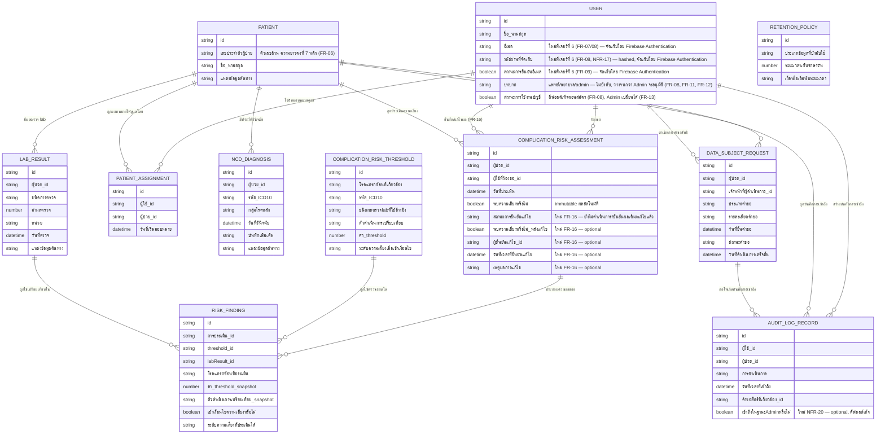

# DB Spec (Logical Entity-Attribute-Relationship Model)

เอกสารนี้อธิบายโมเดลข้อมูลเชิง logical (entity/attribute/ความสัมพันธ์) ที่ [[architecture#ที่เก็บข้อมูลหลัก (Primary Data Store)|Primary Data Store]]
และ [[architecture#ที่เก็บบันทึกการเข้าถึง (Audit Log Store)|Audit Log Store]] ใน [[architecture]] ต้องรองรับ
เพื่อให้ [[architecture#บริการฝั่งเซิร์ฟเวอร์ (Backend Service)|Backend Service]]
ใช้งานได้ตามฟีเจอร์ทั้งเจ็ดใน [[feature-list]] และทั้งสี่ journey ใน [[user-journey]] อ้างอิงความ
ต้องการต้นทางจาก [[backlog]],
[[20260917-01-patient-ncd-history-lab-complication-risk]] (รวม FR-16),
[[20260921-01-pdpa-data-protection-compliance]] (ฟีเจอร์ที่ 4 — คุ้มครองข้อมูลส่วนบุคคลตาม PDPA,
NFR-03–NFR-08),
[[20260922-01-operational-quality-nfr]] (ฟีเจอร์ที่ 5 — รับประกันคุณภาพเชิงปฏิบัติการของระบบ,
NFR-09–NFR-16),
[[20260923-01-user-authentication-email-password]] (ฟีเจอร์ที่ 6 — สมัครบัญชี เข้าสู่ระบบ และจัดการ
รหัสผ่านด้วยอีเมล, FR-07–FR-10, NFR-17–NFR-18) และ
[[20260924-01-admin-role-account-management]] (ฟีเจอร์ที่ 7 — Admin, FR-11–FR-15, NFR-19–NFR-20)

**อัปเดต 2026-09-24 (รอบ sync ที่หก) — เพิ่มฟีเจอร์ที่ 7 (Admin, FR-11–FR-15, NFR-19, NFR-20) และ
FR-16 (ยืนยัน/แก้ไขผลการประเมินความเสี่ยง):** สอดคล้องกับ [[architecture]] ที่อัปเดตวันนี้ (รอบ sync ที่หก)
สามจุดที่ spec/architecture ไม่ได้ระบุรายละเอียดเชิงโครงสร้างชัดเจน ได้ถามผู้ใช้จริงผ่าน
`NEEDS_USER_INPUT` และได้รับคำตอบยืนยันแล้ว:

1. **โครงสร้างข้อมูลสำหรับ FR-16 (ยืนยัน/แก้ไขผลการประเมินความเสี่ยง) — ยืนยันแล้ว: "แก้ไข field ใน
   เอกสารเดิมโดยตรง (mutate in place)"** — เพิ่ม attribute ใหม่ลงใน
   [[#ผลการประเมินความเสี่ยงโรคแทรกซ้อน (ComplicationRiskAssessment)|ComplicationRiskAssessment]]
   โดยตรง (ไม่สร้าง entity ใหม่แยกต่างหาก) ผู้ใช้รับทราบข้อเสียเรื่องค่าประเมินอัตโนมัติดั้งเดิมอาจถูก
   บดบังแล้ว จึง**คงค่าที่ระบบประเมินอัตโนมัติไว้ใน attribute เดิม (`พบความเสี่ยงหรือไม่`) แบบไม่แก้ไข
   (immutable) เสมอ** และเพิ่ม attribute ใหม่แยกต่างหากสำหรับผลหลังยืนยัน/แก้ไข (ดูหัวข้อ
   ComplicationRiskAssessment ด้านล่าง) เพื่อคง traceability ตาม NFR-06 ไว้ครบตามที่ผู้ใช้ระบุเงื่อนไข
   ไว้ — บันทึกเป็นการตัดสินใจเชิงออกแบบของผู้จัดทำเอกสาร (agent) ภายใต้กรอบที่ผู้ใช้ยืนยัน ไม่ใช่การ
   เปลี่ยนคำตอบของผู้ใช้
2. **โครงสร้าง audit log สำหรับ NFR-20 — ยืนยันแล้ว: "ใช้ `AuditLogRecord` เดียวกัน เพิ่ม attribute
   ใหม่"** (`เข้าถึงในฐานะ Admin หรือไม่` — จริง/เท็จ, ไม่บังคับ) แทนการแยก collection ใหม่ — ดูหัวข้อ
   AuditLogRecord ด้านล่าง
3. **การป้องกัน Admin ระงับ/ลด role ตัวเองจนไม่มี Admin เหลือ — ยืนยันแล้ว: "ห้าม Admin แก้ไข
   role/isActive ของตัวเองโดยเด็ดขาด"** ผ่าน operation ใน [[api-spec]] (ไม่ใช่ constraint ระดับข้อมูล/
   attribute จึงไม่มี attribute ใหม่ใน entity ใด — เป็น business rule ที่ตรวจสอบใน Cloud Function ดู
   [[api-spec#Operation 12 — เปลี่ยนบทบาท (Role) ของผู้ใช้งานที่มีอยู่|Operation 12]] และ
   [[api-spec#Operation 13 — ระงับ/เปิดใช้งานบัญชีผู้ใช้งาน|Operation 13]])

รายละเอียดเพิ่มเติม: `บทบาท` ของ [[#ผู้ใช้ (User)|User]] เพิ่มค่าที่เป็นไปได้ `"admin"` (นอกเหนือจาก
"แพทย์"/"พยาบาล") ตาม NFR-19; ไม่มี entity ใหม่ถูกเพิ่มสำหรับฟีเจอร์ที่ 7 ทั้งหมด (FR-11–FR-14 ใช้
entity `User`/`PatientAssignment` เดิม, FR-15 ใช้ entity `Patient`/`NcdDiagnosis`/`LabResult`/
`ComplicationRiskAssessment`/`RiskFinding` เดิมทั้งหมดผ่านข้อยกเว้น NFR-19)

**อัปเดต 2026-09-24 (รอบ sync ที่ห้า) — สอดคล้องกับ `[[technology-stack]]` รอบสาม (decision area
7 แก้ไข + 13-19 ใหม่):** แก้ไขทุกจุดในหัวข้อ [[#ผู้ใช้ (User)|User]] ที่เคยอ้างอิง "เก็บ role/isActive
ซ้ำใน Firestore แม้มี Custom Claims" ให้ตรงกับการตัดสินใจใหม่ว่า **ไม่ sync ไปยัง Custom Claims เลย**
(decision area 18) — Firestore `users/{uid}` เป็น source of truth เดียว, เพิ่มเงื่อนไข
`request.auth.token.email_verified == true` ใน Firestore Security Rules ของ `patientAssignments`
(decision area 19) และปรับตาราง Security Rules Verification (NFR-14) ให้มีเคส
`email_verified=false` เพิ่มเติม ปิดรายการ "ประเด็นรอตัดสินใจ" ของฟีเจอร์ที่ 6 ที่ตัดสินใจแล้ว
(sync custom claims, Auth Blocking Functions)

**อัปเดต 2026-09-23 (รอบ sync ที่สี่) — ตรวจสอบความสอดคล้องกับฟีเจอร์ที่ 6 (Authentication):**
[[architecture]] เพิ่มฟีเจอร์ที่ 6 (FR-07–FR-10, NFR-17, NFR-18) ซึ่งมีผลกับ entity
[[#ผู้ใช้ (User)|User]] โดยตรง — ตามที่ผู้ใช้ยืนยันแล้วผ่าน `NEEDS_USER_INPUT` ระหว่างรอบ sync
architecture: (1) `บทบาท` ต้องเปลี่ยนจาก "จำเป็น" เป็น "ไม่บังคับ" เพราะบัญชีที่เพิ่งสมัคร (FR-08)
ยังไม่มี role กำหนดจนกว่าผู้ดูแลระบบจะอนุมัติผ่าน Firebase Console/Firestore โดยตรง (2) เพิ่ม
attribute เชิง logical `อีเมล`, `รหัสผ่านที่จัดเก็บ` (hashed), `สถานะการยืนยันอีเมล` เข้าไปใน User
เพราะเป็นส่วนหนึ่งของแนวคิดทางธุรกิจของ "บัญชีผู้ใช้" แม้ทางเทคนิคจะไม่ได้จัดเก็บใน Firestore
document `users/{uid}` เอง (จัดเก็บโดย Firebase Authentication ตามที่ `[[technology-stack]]`
decision area 7 ตัดสินใจไว้) — ไม่มี entity ใหม่ถูกเพิ่ม เพราะฟีเจอร์ที่ 6 ทั้งหมดผูกกับ entity User
ที่มีอยู่แล้วเท่านั้น ดูรายละเอียดที่หัวข้อ [[#ผู้ใช้ (User)|User]] ด้านล่าง

**อัปเดต 2026-09-22 (รอบ sync ที่สอง) — ตรวจสอบความสอดคล้องกับฟีเจอร์ที่ 5 (NFR-09–NFR-16):** เช่นเดียว
กับ [[api-spec]] พบว่าฟีเจอร์ที่ 5 **ไม่ต้องเพิ่ม entity ใหม่** ในเอกสารนี้ เพราะ composite index ที่
ระบุไว้แล้วในแต่ละ entity ตอบโจทย์ NFR-09 อยู่แล้ว, Security Rules ที่ระบุไว้แล้วต้องผ่าน automated
test ตาม NFR-14 (ดูหัวข้อใหม่ท้าย ER Diagram), NFR-11 (Clinical Safety Validation) เป็นกระบวนการนอก
ระบบที่ไม่ต้องเพิ่ม attribute ใหม่ตามที่ [[architecture]] ระบุไว้ชัดเจนแล้ว และ NFR-13 (Accessibility)
มี field ข้อความรองรับอยู่แล้วใน RiskFinding — ดูหมายเหตุที่แทรกไว้ในแต่ละ entity ที่เกี่ยวข้องด้านล่าง

**หมายเหตุสำคัญ:** เอกสารนี้อธิบายระดับ logical data model เป็นหลัก ชนิดข้อมูลที่ระบุ (เช่น
"ข้อความ", "ตัวเลข", "วันที่-เวลา", "จริง/เท็จ", "อ้างอิงถึง Entity อื่น") เป็นชนิดข้อมูลเชิงตรรกะ
ไม่ผูกกับ database engine ใดโดยเฉพาะในตัวมันเอง ทุก operation ที่ใช้ field ต่างๆ ในเอกสารนี้ ดู
รายละเอียดคู่กันได้ที่ [[api-spec]]

**อัปเดต 2026-09-22 — เสริมรายละเอียด Firestore จริง (ตาม `[[technology-stack]]` decision area 4):**
`[[technology-stack]]` ตัดสินใจแล้วว่า Primary Data Store และ Audit Log Store คือ **Cloud Firestore
(Native mode)** ซึ่งเป็น NoSQL document store ไม่มี join/foreign key constraint แบบ native — ทุก
entity ด้านล่างนี้จึงมีหัวข้อย่อย **"Firestore Technical Binding"** ต่อท้ายตาราง attribute เพื่อระบุ
(1) collection/document path จริง (2) Firestore field type จริง (string, number, timestamp,
boolean, reference, map, array) กำกับคู่กับชนิดข้อมูลเชิงตรรกะเดิม (ไม่ลบของเดิม) และ (3) composite
index ที่ต้องสร้างไว้ล่วงหน้าใน `firestore.indexes.json` **โครงสร้างเชิง logical (entity/attribute/
ความสัมพันธ์ตาราง ER Diagram) ยังคงอยู่ครบทุกจุดเป็นแหล่งความจริงเชิงตรรกะ** — ส่วน "Firestore
Technical Binding" เป็นการ**แปลงโครงสร้างเป็นแบบ document-oriented จริง (denormalize/embed/
subcollection ตามความเหมาะสม)** ไม่ใช่แค่แปะ Firestore type ลงบน relational schema เดิมโดยไม่ปรับ
โครงสร้าง โดยเฉพาะสองจุดที่ `[[technology-stack]]` เตือนไว้ชัดเจน: PatientAssignment (เดิมเป็น N:M
ผ่านตารางกลาง) และ RiskFinding (เดิมอ้างอิง 3 entity พร้อมกัน) — ดูรายละเอียดที่หัวข้อของแต่ละ entity
และหัวข้อใหม่ [[#โครงสร้างเอกสารจริงใน Cloud Firestore (Firestore Document Structure)|โครงสร้างเอกสาร
จริงใน Cloud Firestore]] ท้าย ER Diagram

## ภาพรวม Entity

| Entity | คำอธิบายสั้น | รหัส FR/NFR ที่เกี่ยวข้อง |
| --- | --- | --- |
| ผู้ใช้ (User) | แพทย์/พยาบาลผู้ดูแลผู้ป่วย NCD หรือ Admin ที่เข้าใช้งานระบบ (รวมบัญชีที่สมัครแล้วแต่ยังรออนุมัติ) | [[backlog#สูง (MVP)\|FR-05]], [[backlog#สูง (MVP)\|FR-07]], [[backlog#สูง (MVP)\|FR-08]], [[backlog#สูง (MVP)\|FR-09]], [[backlog#สูง (MVP)\|FR-10]], [[backlog#สูง (MVP)\|FR-11]], [[backlog#สูง (MVP)\|FR-12]], [[backlog#สูง (MVP)\|FR-13]], [[backlog#Non-Functional Requirements\|NFR-02]], [[backlog#Non-Functional Requirements\|NFR-17]], [[backlog#Non-Functional Requirements\|NFR-18]], [[backlog#Non-Functional Requirements\|NFR-19]] |
| ผู้ป่วย (Patient) | ผู้ป่วย NCD รายบุคคลที่ถูกดูประวัติ/ผลตรวจ/ผลวิเคราะห์ความเสี่ยง (แพทย์/พยาบาลเฉพาะที่อยู่ในความดูแล, Admin ดูได้ทุกราย) | [[backlog#สูง (MVP)\|FR-01]], [[backlog#สูง (MVP)\|FR-02]], [[backlog#สูง (MVP)\|FR-03]], [[backlog#สูง (MVP)\|FR-05]], [[backlog#สูง (MVP)\|FR-06]], [[backlog#สูง (MVP)\|FR-15]] |
| การมอบหมายผู้ป่วยในความดูแล (PatientAssignment) | ความสัมพันธ์ระดับรายผู้ป่วยระหว่างแพทย์/พยาบาลผู้ดูแลกับผู้ป่วยแต่ละราย ใช้กรองรายชื่อและตรวจสิทธิ์ระดับรายผู้ป่วย จัดการโดย Admin (FR-14) | [[backlog#สูง (MVP)\|FR-05]], [[backlog#สูง (MVP)\|FR-14]], [[backlog#Non-Functional Requirements\|NFR-02]] |
| ประวัติการวินิจฉัยโรค NCD (NcdDiagnosis) | บันทึกการวินิจฉัยโรค NCD แต่ละครั้งของผู้ป่วย | [[backlog#สูง (MVP)\|FR-01]] |
| ผลตรวจ lab (LabResult) | ผลตรวจ lab มาตรฐานแต่ละครั้งของผู้ป่วย | [[backlog#สูง (MVP)\|FR-02]] |
| threshold มาตรฐานของโรคแทรกซ้อน (ComplicationRiskThreshold) | เกณฑ์ค่า lab มาตรฐานที่ใช้ตัดสินความเสี่ยงโรคแทรกซ้อนแต่ละชนิด | [[backlog#สูง (MVP)\|FR-03]], [[backlog#Non-Functional Requirements\|NFR-11]] |
| ผลการประเมินความเสี่ยงโรคแทรกซ้อน (ComplicationRiskAssessment) | ผลรวมของการประเมินความเสี่ยงหนึ่งครั้งของผู้ป่วยรายหนึ่ง รวมถึงผลการยืนยัน/แก้ไข (override) โดยแพทย์/พยาบาล | [[backlog#สูง (MVP)\|FR-03]], [[backlog#สูง (MVP)\|FR-04]], [[backlog#สูง (MVP)\|FR-16]] |
| รายละเอียดผลการประเมินต่อโรคแทรกซ้อน (RiskFinding) | ผลลัพธ์ของการประเมินหนึ่งรายการ (หนึ่งโรคแทรกซ้อน) ภายใต้การประเมินหนึ่งครั้ง | [[backlog#สูง (MVP)\|FR-03]], [[backlog#สูง (MVP)\|FR-04]], [[backlog#Non-Functional Requirements\|NFR-13]] |
| บันทึกการเข้าถึงข้อมูล (AuditLogRecord) | ร่องรอยการเข้าถึง/ดู/แก้ไขข้อมูลส่วนบุคคลหรือข้อมูลสุขภาพของผู้ป่วยแต่ละครั้ง เก็บใน [[architecture#ที่เก็บบันทึกการเข้าถึง (Audit Log Store)\|Audit Log Store]] | [[backlog#Non-Functional Requirements\|NFR-06]], [[backlog#Non-Functional Requirements\|NFR-08]] |
| คำขอใช้สิทธิของเจ้าของข้อมูล (DataSubjectRequest) | คำขอใช้สิทธิของผู้ป่วย (เข้าถึง/สำเนา/แก้ไข/ลบ/คัดค้าน) ที่เจ้าหน้าที่ดำเนินการแทน | [[backlog#Non-Functional Requirements\|NFR-07]] |
| นโยบายเก็บรักษาและลบข้อมูล (RetentionPolicy) | นโยบายจำกัดระยะเวลาเก็บรักษาข้อมูลแต่ละหมวดและเงื่อนไขการลบ/ทำลายเมื่อพ้นระยะเวลา | [[backlog#Non-Functional Requirements\|NFR-05]] |

## รายละเอียด Entity และ Attribute

### ผู้ใช้ (User)

รองรับ [[architecture#บริการฝั่งเซิร์ฟเวอร์ (Backend Service)|Access Control]] ตาม
[[backlog#Non-Functional Requirements|NFR-02]], ตั้งแต่รอบ sync ที่สี่ (2026-09-23) ยังรองรับ
ฟีเจอร์ที่ 6 (Authentication) — [[backlog#สูง (MVP)|FR-07]]–[[backlog#สูง (MVP)|FR-10]],
[[backlog#Non-Functional Requirements|NFR-17]], [[backlog#Non-Functional Requirements|NFR-18]] และ
ตั้งแต่รอบ sync ที่หก (2026-09-24) ยังรองรับฟีเจอร์ที่ 7 (Admin) —
[[backlog#สูง (MVP)|FR-11]]–[[backlog#สูง (MVP)|FR-13]], [[backlog#Non-Functional Requirements|NFR-19]]
— ระเบียนหนึ่งใบครอบคลุมทั้งบัญชีที่อนุมัติแล้ว บัญชีที่เพิ่งสมัครแต่ยังรออนุมัติ และบัญชี Admin
(ไม่มี entity แยกสำหรับสถานะ "รออนุมัติ" หรือสำหรับบทบาท Admin)

| Attribute | ชนิดข้อมูลเชิงตรรกะ | จำเป็นต้องมีค่า | คำอธิบาย |
| --- | --- | --- | --- |
| id | ข้อความ (ตัวระบุเฉพาะ) | จำเป็น | ตัวระบุผู้ใช้ (เท่ากับ Firebase Authentication UID) |
| ชื่อ-นามสกุล | ข้อความ | จำเป็น | ใช้แสดงผล/ตรวจสอบตัวตน |
| อีเมล | ข้อความ (รูปแบบอีเมล, ไม่ซ้ำกันทั้งระบบ) | จำเป็น | ใช้เข้าสู่ระบบ (FR-07), สมัครบัญชี (FR-08) และรับอีเมลยืนยันตัวตน/รีเซ็ตรหัสผ่าน (FR-09, FR-10) — **ใหม่จากฟีเจอร์ที่ 6** |
| รหัสผ่านที่จัดเก็บ | ข้อความ (hashed) | จำเป็น | ต้องเป็นไปตามนโยบายรหัสผ่านขั้นต่ำก่อนจัดเก็บเสมอ (ความยาว ≥ 8 ตัวอักษร มีทั้งตัวอักษรและตัวเลข — NFR-17) — **ใหม่จากฟีเจอร์ที่ 6** |
| สถานะการยืนยันอีเมล | จริง/เท็จ | จำเป็น | จริง = ยืนยันความเป็นเจ้าของอีเมลแล้ว (FR-09) — ค่าเริ่มต้นเป็นเท็จทันทีที่สมัครบัญชี (FR-08) จนกว่าจะเปิดลิงก์ยืนยันจากอีเมล ต้องเป็นจริงก่อนจึงจะใช้งานฟีเจอร์อื่นได้ (แม้ `สถานะการใช้งานบัญชี` และ `บทบาท` จะถูกอนุมัติแล้วก็ตาม) — **ใหม่จากฟีเจอร์ที่ 6** |
| บทบาท | ข้อความ (ค่าที่กำหนดไว้ล่วงหน้า: "แพทย์", "พยาบาล", "admin" — **เพิ่ม `"admin"` ในรอบ sync ที่หก ตามฟีเจอร์ที่ 7**) | **ไม่บังคับ** (เปลี่ยนจาก "จำเป็น" ในรอบ sync ที่สี่) | ใช้ตัดสินสิทธิ์การเข้าถึงตาม NFR-02 — สามบทบาทนี้เท่านั้นที่มีความหมายในระบบ (`"แพทย์"`/`"พยาบาล"` เข้าถึงข้อมูลผู้ป่วยเฉพาะที่อยู่ในความดูแลตาม PatientAssignment, `"admin"` เข้าถึงข้อมูลผู้ป่วยทุกรายแบบอ่านอย่างเดียวได้โดยไม่ต้องมี PatientAssignment ตามข้อยกเว้น [[backlog#Non-Functional Requirements\|NFR-19]] แต่ไม่มีสิทธิ์ยืนยัน/แก้ไขผลประเมินความเสี่ยงตาม FR-16 และไม่มีสิทธิ์แก้ไขข้อมูลทางคลินิกใดๆ) **ไม่มีค่าโดยดีฟอลต์ทันทีที่สมัครบัญชีสำเร็จ (FR-08)** จนกว่า **Admin จะอนุมัติผ่านหน้าจอในระบบ (FR-11 — แก้ไขในรอบ sync ที่หก แทนที่กลไกเดิมที่เคยเป็นการแก้ไข Firebase Console/Firestore โดยตรง)** โดย Operation อนุมัติ (FR-11) กำหนดได้เฉพาะค่า `"แพทย์"`/`"พยาบาล"` เท่านั้น (ไม่ใช่ `"admin"` — บัญชี Admin คนแรก/bootstrap ยังคงตั้งผ่าน Firebase Console/Firestore โดยตรง อยู่นอกขอบเขต) ส่วนการเปลี่ยน role ภายหลัง (FR-12) กำหนดเป็นค่าใดในสามค่านี้ก็ได้ ยกเว้นห้าม Admin เปลี่ยน role ของ**ตนเอง**โดยเด็ดขาด (ดู [[api-spec#Operation 12 — เปลี่ยนบทบาท (Role) ของผู้ใช้งานที่มีอยู่\|Operation 12 ใน api-spec]]) — บัญชีที่ยังไม่มีบทบาทนี้จะไม่ผ่านการตรวจสอบระดับบทบาทของ [[api-spec#Operation ร่วม — ตรวจสอบสิทธิ์การเข้าถึงข้อมูลผู้ป่วย (Access Control)\|Operation ร่วม ตรวจสอบสิทธิ์การเข้าถึงข้อมูลผู้ป่วย]] โดยอัตโนมัติ (ค่าว่าง/ไม่มีค่า ไม่ใช่ค่าที่กำหนดไว้ล่วงหน้าทั้งสาม) |
| สถานะการใช้งานบัญชี | จริง/เท็จ | จำเป็น | จริง = ใช้งานได้, เท็จ = ถูกระงับสิทธิ์ (NFR-02) — **ค่าเริ่มต้นเป็นเท็จโดยอัตโนมัติทันทีที่สมัครบัญชีสำเร็จ (FR-08)** จนกว่าผู้ดูแลระบบจะเปลี่ยนเป็นจริงพร้อมกำหนด `บทบาท` ผ่าน Firebase Console/Firestore (ยืนยันโดยผู้ใช้แล้ว) |

**Firestore Technical Binding (ตาม [[technology-stack#7. Authentication/Authorization — Firebase Authentication (ไม่ใช้ Custom Claims เก็บบทบาท — แก้ไขในรอบสาม 2026-09-24)|decision area 7 ใน technology-stack]] และ [[technology-stack#18. การ Sync role/isActive ระหว่าง Firestore กับ Custom Claims (ฟีเจอร์ที่ 6) — ไม่ Sync, Firestore เป็น Source of Truth เดียว|decision area 18]] — แก้ไข 2026-09-24: ไม่ใช้ Custom Claims เก็บบทบาท/isActive อีกต่อไป):**

- **Collection/Document path:** `users/{userId}` — **document ID = Firebase Authentication UID
  โดยตรง** (ไม่ใช่ id แยกต่างหาก) เพื่อให้ Security Rules อ้างอิง `request.auth.uid` ตรงกับ document
  ID ได้ทันทีโดยไม่ต้อง query
- **Field mapping:** `ชื่อ-นามสกุล` → `displayName` (string), `บทบาท` → `role` (string, ค่าที่
  กำหนดไว้ล่วงหน้า `"แพทย์"` \| `"พยาบาล"` \| `"admin"` — **เพิ่ม `"admin"` ในรอบ sync ที่หก**, **ไม่มี
  field นี้เลย/เป็น `null` เมื่อบัญชียังไม่ถูกอนุมัติ**), `สถานะการใช้งานบัญชี` → `isActive` (boolean,
  ดีฟอลต์ `false` ตอนสร้างเอกสาร)
- **`อีเมล`/`รหัสผ่านที่จัดเก็บ`/`สถานะการยืนยันอีเมล` — ไม่มี field ตรงกันใน Firestore document นี้
  (สำคัญ — ใหม่จากฟีเจอร์ที่ 6):** ทั้งสาม attribute ข้างต้นเป็นแนวคิดเชิง logical ของ "บัญชีผู้ใช้"
  แต่จัดเก็บจริงโดย **Firebase Authentication** (ไม่ใช่ Cloud Firestore) ตามที่
  [[technology-stack#7. Authentication/Authorization — Firebase Authentication (ไม่ใช้ Custom Claims เก็บบทบาท — แก้ไขในรอบสาม 2026-09-24)|decision area 7 ใน technology-stack]]
  ตัดสินใจไว้ — `อีเมล` = `user.email`, `รหัสผ่านที่จัดเก็บ` = ค่า hash ภายในของ Firebase
  Authentication เอง (ระบบไม่มีสิทธิ์เข้าถึงค่านี้โดยตรงไม่ว่ากรณีใด), `สถานะการยืนยันอีเมล` =
  `user.emailVerified`/`decodedToken.email_verified` อ่านได้จาก Firebase ID token หลังเข้าสู่ระบบ
  (FR-07, FR-09) — Cloud Functions (Account Onboarding & Authentication Gateway) เรียก Firebase
  Admin SDK เพื่ออ่าน/เขียนค่าเหล่านี้เมื่อจำเป็น (เช่น ตรวจสอบว่าอีเมลมีบัญชีอยู่แล้วหรือไม่ตอนสมัคร/
  รีเซ็ตรหัสผ่าน) ไม่มี Firestore document field ใดๆ สำหรับสามค่านี้เลย — ค่า `email_verified` นี้ยัง
  ถูกใช้เป็นเงื่อนไขตรวจสอบซ้ำที่ Operation ร่วม Access Control ด้วย (ดูหมายเหตุถัดไป)
- **เหตุผลที่ `role`/`isActive` เก็บเฉพาะใน Firestore เป็น source of truth เดียว — ไม่ sync ไปยัง
  Custom Claims เลย (แก้ไข 2026-09-24 ตาม [[technology-stack#18. การ Sync role/isActive ระหว่าง Firestore กับ Custom Claims (ฟีเจอร์ที่ 6) — ไม่ Sync, Firestore เป็น Source of Truth เดียว|decision area 18 ใน technology-stack]]):**
  รอบก่อนหน้าเอกสารนี้เคยอธิบายว่าต้องเก็บ `role`/`isActive` ซ้ำใน Firestore เพราะ Custom Claims ถูก
  cache ไว้ใน token จนกว่าจะ refresh (ไม่ real-time) จึงไม่เพียงพอสำหรับตรวจสอบบัญชีที่เพิ่งถูกระงับ —
  ผู้ใช้ตัดสินใจในรอบ 2026-09-24 ว่า**ไม่ sync ไปยัง Custom Claims เลยตั้งแต่ต้น** (ไม่ใช่แค่ไม่พึ่งพา
  เพียงอย่างเดียว) เพราะไม่มี operation ใดเคยอ่านค่าจาก Custom Claims จริงในทางปฏิบัติอยู่แล้ว ทั้ง
  Firestore Security Rules (Operation 0, ผ่าน
  `get(/databases/$(database)/documents/users/$(request.auth.uid))`) และ Cloud Functions
  (Operation 1-6, shared helper module) ต้องอ่าน field `isActive`/`role` จาก Firestore
  `users/{uid}` โดยตรงทุกครั้งเป็น**แหล่งความจริงเดียว** — automated test case ที่บังคับตาม NFR-14
  ยังคงต้องครอบคลุมกรณี "(ค) ผู้ใช้ที่บัญชีถูกระงับ (สถานะการใช้งานบัญชี = เท็จ)" เช่นเดิม พร้อมเพิ่ม
  กรณีใหม่ "(ง) ผู้ใช้ที่บัญชียังไม่ยืนยันอีเมล (`email_verified=false`)" ตาม
  [[technology-stack#19. การตรวจสอบ `emailVerified` ซ้ำฝั่ง Backend (FR-09, ฟีเจอร์ที่ 6) — ตรวจทั้ง Cloud Functions และ Security Rules|decision area 19]]
  (ดูตารางอัปเดตในหัวข้อ Security Rules Verification ท้ายเอกสาร)
- **Composite index:** ไม่จำเป็น (query ด้วย document ID โดยตรงเสมอ ไม่มีการ query แบบ filter/sort
  หลายเงื่อนไขบน collection นี้)
- **หมายเหตุ NFR-12 (Session Timeout) — เหตุใด entity นี้จึงไม่มี attribute `lastActivityAt`:** ตาม
  [[technology-stack#10. กลไก Session Timeout (NFR-12) — Client Custom Inactivity Timer เท่านั้น (ไม่มี Server-side Token Revocation)|
  decision area 10 ใน technology-stack]] มีการพิจารณาทางเลือก "ตรวจสอบ `lastActivityAt` ทุก Cloud
  Function call (เก็บใน Firestore)" แล้วโดยเฉพาะ **แต่ตัดสินใจไม่เลือก** เพราะ (1) เพิ่ม Firestore
  read ทุก request กระทบ [[backlog#Non-Functional Requirements|NFR-09]] (Performance < 2 วินาที)
  โดยตรง และ (2) ซับซ้อนที่สุดในการ implement/ทดสอบเมื่อเทียบกับทางเลือกอื่น — กลไกที่เลือกจริง (client
  custom inactivity timer ด้วย `setTimeout` + event listener เรียก Firebase Authentication
  `signOut()`) เป็น**สถานะฝั่ง Client ล้วนๆ จึงไม่ต้องมี field ติดตามเวลากิจกรรมล่าสุดของผู้ใช้ในฝั่ง
  เซิร์ฟเวอร์/Firestore เลย** — นี่คือการตัดสินใจที่ชัดเจนแล้ว (ไม่ใช่ช่องว่างที่ยังไม่ได้พิจารณา) แม้จะ
  มีความเสี่ยงด้านความปลอดภัยที่บันทึกไว้อย่างเด่นชัด (token ยังใช้ได้ต่อจนกว่าจะหมดอายุตามธรรมชาติ
  ~1 ชม. — ดู [[architecture#ขอบเขตความรับผิดชอบของแต่ละ Component|หัวข้อ Client ใน architecture]] และ
  [[api-spec#Operation ร่วม — ตรวจสอบสิทธิ์การเข้าถึงข้อมูลผู้ป่วย (Access Control)|Operation ร่วม
  ตรวจสอบสิทธิ์การเข้าถึงข้อมูลผู้ป่วย ใน api-spec]]) ก็ตาม

### ผู้ป่วย (Patient)

รองรับ [[backlog#สูง (MVP)|FR-01]], [[backlog#สูง (MVP)|FR-02]], [[backlog#สูง (MVP)|FR-03]],
[[backlog#สูง (MVP)|FR-05]], [[backlog#สูง (MVP)|FR-06]] — ข้อมูลอ้างอิงจากแหล่งข้อมูลภายนอกตาม
[[backlog#Non-Functional Requirements|NFR-01]]

| Attribute | ชนิดข้อมูลเชิงตรรกะ | จำเป็นต้องมีค่า | คำอธิบาย |
| --- | --- | --- | --- |
| id | ข้อความ (ตัวระบุเฉพาะ) | จำเป็น | ตัวระบุผู้ป่วยที่ระบบใช้อ้างอิงภายใน อ้างอิงจากแหล่งข้อมูล HOSxP หรือข้อมูลจำลองระหว่างพัฒนา (NFR-01) |
| เลขประจำตัวผู้ป่วย | ข้อความ (ตัวเลขล้วนเท่านั้น ความยาวคงที่ 7 หลัก — ไม่มีตัวอักษรหรือความยาวอื่น) | จำเป็น | เลขประจำตัวผู้ป่วยเชิงคลินิก (HN) ที่แพทย์/พยาบาลใช้ค้นหาผู้ป่วยเฉพาะราย — เป็นช่องทางค้นหาเฉพาะรายเดียวที่ใช้งานได้ในระบบ (FR-06, ยืนยันแล้ว 2026-09-21) ระบบตรวจสอบรูปแบบ/ความยาวนี้**หลังผู้ใช้กดค้นหาแล้วเท่านั้น** ไม่ใช่แบบ real-time ระหว่างพิมพ์ (ดู [[api-spec#Operation 0 — ค้นหา/แสดงรายชื่อผู้ป่วยในความดูแล (ค้นหาเฉพาะรายด้วยเลข HN)\|Operation 0 ใน api-spec]]) เป็นคนละ field กับ id ที่ใช้อ้างอิงภายในระบบ |
| ชื่อ-นามสกุล | ข้อความ | จำเป็น | ใช้แสดงผลบนหน้าจอ Client เท่านั้น **ไม่ใช้เป็นเงื่อนไขค้นหาอีกต่อไป** (FR-06 ยกเลิกช่องทางค้นหาด้วยชื่อที่เคยรองรับใน FR-05 เดิม) |
| แหล่งข้อมูลต้นทาง | ข้อความ (ค่าที่กำหนดไว้ล่วงหน้า: "HOSxP", "ข้อมูลจำลอง") | จำเป็น | ระบุว่าข้อมูลผู้ป่วยรายนี้มาจากระบบจริงหรือ mockup (NFR-01) |

**Firestore Technical Binding:**

- **Collection/Document path:** `patients/{patientId}` (top-level collection ตามที่
  `[[technology-stack#Deployment Diagram|Deployment Diagram ใน technology-stack]]` ระบุชื่อ collection
  ไว้แล้ว) — `patientId` เป็น auto-generated document ID ของ Firestore (ไม่ใช่เลข HN โดยตรง เพราะ HN
  อาจต้องแก้ไขได้ในอนาคตตามคำขอสิทธิ NFR-07 ส่วน document ID เปลี่ยนไม่ได้)
- **Field mapping:** `เลขประจำตัวผู้ป่วย` → `hn` (string, exact 7 ตัวเลข), `ชื่อ-นามสกุล` →
  `fullName` (string), `แหล่งข้อมูลต้นทาง` → `dataSource` (string, ค่าที่กำหนดไว้ล่วงหน้า)
- **Composite index:** ไม่ต้องมี index บน `patients` โดยตรงสำหรับ Operation 0 อีกต่อไป เพราะ
  Operation 0 (ทั้งค้นหาด้วย HN และแสดงรายชื่อทั้งหมด) ถูกออกแบบใหม่ให้ query จาก collection
  `patientAssignments` แทน (ดูหัวข้อถัดไป) — `patients` ยังคงเป็น**แหล่งความจริงหลัก (source of
  truth)** ของ `hn`/`fullName`/`dataSource` ที่ Cloud Functions (Operation 1-3) อ่านโดยตรงผ่าน
  Admin SDK เสมอเมื่อรู้ `patientId` แล้ว — field `hn`/`fullName` ที่ปรากฏซ้ำใน `patientAssignments`
  เป็นสำเนา denormalized สำหรับการแสดงรายชื่อเท่านั้น (ดูเหตุผลและกฎ sync ที่หัวข้อ PatientAssignment)
  — **ใหม่ในรอบ sync ที่หก:** ต้องมี single-field index `(hn ASC)` (Firestore สร้างอัตโนมัติ) เพื่อ
  รองรับ [[api-spec#Operation 15 — ค้นหา/แสดงรายชื่อผู้ป่วยทั้งหมดในระบบ (สำหรับ Admin)|Operation 15]]
  ที่ Admin ค้นหาผู้ป่วยด้วย HN โดยตรงบน `patients` (ไม่ผ่าน `patientAssignments` เพราะ Admin ไม่มี
  ระเบียนในนั้น)

### การมอบหมายผู้ป่วยในความดูแล (PatientAssignment)

รองรับ [[backlog#สูง (MVP)|FR-05]] และ [[backlog#Non-Functional Requirements|NFR-02]] ฉบับขยายความ
— บันทึกความสัมพันธ์ระดับรายผู้ป่วยระหว่างแพทย์/พยาบาลผู้ดูแลกับผู้ป่วยแต่ละราย ("อยู่ในความดูแล"
ตามที่ตีความไว้ใน
[[20260917-01-patient-ncd-history-lab-complication-risk#สมมติฐาน (Assumptions) — โปรดตรวจทานอีกครั้ง|หัวข้อสมมติฐานของ spec]])
ใช้เป็นเงื่อนไขกรองรายชื่อผู้ป่วยใน operation ค้นหา/แสดงรายชื่อ (FR-05) และเป็นเงื่อนไขตรวจสอบสิทธิ์
ระดับรายผู้ป่วยก่อนเข้าถึงข้อมูลรายบุคคลใดๆ (NFR-02)

| Attribute | ชนิดข้อมูลเชิงตรรกะ | จำเป็นต้องมีค่า | คำอธิบาย |
| --- | --- | --- | --- |
| id | ข้อความ (ตัวระบุเฉพาะ) | จำเป็น | ตัวระบุระเบียนการมอบหมาย |
| ผู้ใช้ | อ้างอิงถึง Entity ผู้ใช้ (User) | จำเป็น | แพทย์/พยาบาลที่ได้รับมอบหมายให้ดูแลผู้ป่วยรายนี้ |
| ผู้ป่วย | อ้างอิงถึง Entity ผู้ป่วย (Patient) | จำเป็น | ผู้ป่วยที่ถูกมอบหมาย — ผู้ป่วยหนึ่งรายมอบหมายให้ผู้ใช้มากกว่าหนึ่งคนได้ (ดูหัวข้อความสัมพันธ์) |
| วันที่เริ่มมอบหมาย | วันที่-เวลา | ไม่บังคับ | บันทึกไว้เพื่อ traceability เท่านั้น ยังไม่มีกฎทางธุรกิจที่ใช้ค่านี้ในการกรอง/ตัดสินสิทธิ์โดยตรงในชั้นนี้ |

**Firestore Technical Binding (สำคัญ — จุดที่ปรับโครงสร้างจาก N:M relational เป็น document-oriented ตาม [[technology-stack#4. Database Engine ของ Primary Data Store — Cloud Firestore (Native mode)|decision area 4 ใน technology-stack]]):**

- **Collection/Document path:** top-level collection `patientAssignments` — **document ID เป็น
  composite key รูปแบบ `{userId}_{patientId}`** (ไม่ใช่ auto-generated id) ตามแนวทางที่
  `[[technology-stack]]` แนะนำไว้ เพื่อให้ทั้ง Security Rules และ Cloud Functions ตรวจสอบสิทธิ์ระดับ
  รายผู้ป่วยได้ด้วย `exists(/databases/$(database)/documents/patientAssignments/$(request.auth.uid + '_' + patientId))`
  แบบ O(1) โดยไม่ต้อง query แบบ collection scan/collection group เลย
- **Field mapping:** `ผู้ใช้` → `userId` (string, เท่ากับ Firebase Auth UID = document ID ของ
  `users/{userId}`), `ผู้ป่วย` → `patientId` (string, เท่ากับ document ID ของ `patients/{patientId}`),
  `วันที่เริ่มมอบหมาย` → `assignedAt` (timestamp)
- **Field เพิ่มเติมที่ denormalize จาก Patient (ไม่มีใน logical model ด้านบน เพราะเป็นการปรับเชิง
  เทคนิคล้วนๆ ไม่ใช่ business attribute ใหม่):** `patientHn` (string, คัดลอกจาก `Patient.hn`),
  `patientFullName` (string, คัดลอกจาก `Patient.fullName`)
  - **เหตุผล:** `[[technology-stack#3. สถาปัตยกรรม Backend Service — Firebase-native (ไม่มี Backend Service แยกแบบดั้งเดิม)|decision area 3]]`
    กำหนดให้ Operation 0 เป็น Client อ่าน Firestore ตรงผ่าน Security Rules **โดยไม่ผ่าน Cloud
    Functions** — ถ้า `patientAssignments` เก็บเฉพาะ `userId`/`patientId` (ตาม logical model เดิม)
    Client จะต้อง query `patientAssignments` ก่อนแล้วค่อย query/`get()` เอกสาร `patients` แต่ละใบ
    ตามรายการ `patientId` ที่ได้ ซึ่ง (1) เพิ่มจำนวน round-trip และ read cost โดยไม่จำเป็นสำหรับ
    การแสดงผลแค่ HN+ชื่อ และ (2) ทำให้ Security Rules ของ `patients` ต้องเปิดให้ query แบบ list ได้
    กว้างขึ้นเพื่อรองรับ Client อ่านหลายเอกสารพร้อมกัน เพิ่มพื้นที่เสี่ยงด้าน NFR-02 โดยไม่จำเป็น —
    การ denormalize `patientHn`/`patientFullName` ลงในเอกสาร `patientAssignments` โดยตรงทำให้
    Operation 0 (ทั้งกรณีค้นหาด้วย HN และแสดงรายชื่อทั้งหมด) เป็น**query เดียวจบ**บน collection เดียว
    สอดคล้องกับหลัก document-oriented design ของ Firestore
  - **Trade-off ที่ต้องยอมรับ (data consistency):** เมื่อ `Patient.hn` หรือ `Patient.fullName`
    เปลี่ยนแปลง (เช่น แก้ไขตามคำขอสิทธิ Operation 4 กรณี "ขอแก้ไข") **ต้องอัปเดตสำเนาใน
    `patientAssignments` ทุกระเบียนที่เชื่อมโยงกับผู้ป่วยรายนั้นพร้อมกันเสมอ** (Cloud Functions ใช้
    Firestore batch write หรือ transaction ครอบคลุมทั้ง `patients/{patientId}` และทุกเอกสารใน
    `patientAssignments` ที่มี `patientId` นี้ — ต้อง query หาเอกสารเหล่านั้นก่อนด้วย composite index
    บน `patientId`) นี่คือหน้าที่ของ operation ที่แก้ไขข้อมูลผู้ป่วย (Operation 4 กรณี "ขอแก้ไข")
    ต้องเพิ่มขั้นตอนนี้เข้าไปด้วยเสมอ — ดูหมายเหตุเพิ่มเติมใน [[api-spec#Operation 4 — ยื่นและดำเนินการคำขอใช้สิทธิของเจ้าของข้อมูล (Data Subject Rights Request)|Operation 4 ใน api-spec]]
- **Composite index ที่ต้องสร้างล่วงหน้าใน `firestore.indexes.json`:**
  1. `(userId ASC, patientHn ASC)` — รองรับ Operation 0 กรณีค้นหาด้วย HN: `where('userId','==',uid).where('patientHn','==',enteredHn)`
  2. `(userId ASC, patientFullName ASC)` — รองรับ Operation 0 กรณีแสดงรายชื่อทั้งหมดเรียงตามชื่อ:
     `where('userId','==',uid).orderBy('patientFullName')`
  3. `(patientId ASC)` — เป็น single-field index (Firestore สร้างอัตโนมัติ) ใช้ตอน Cloud Functions
     ต้องหาทุกระเบียน assignment ของผู้ป่วยรายหนึ่งเพื่ออัปเดต denormalized field ตอนแก้ไขข้อมูล
     ผู้ป่วย (ดู trade-off ด้านบน)
- **Firestore Security Rules (Operation 0 — ตาม [[technology-stack#3. สถาปัตยกรรม Backend Service — Firebase-native (ไม่มี Backend Service แยกแบบดั้งเดิม)|decision area 3]] และ [[technology-stack#19. การตรวจสอบ `emailVerified` ซ้ำฝั่ง Backend (FR-09, ฟีเจอร์ที่ 6) — ตรวจทั้ง Cloud Functions และ Security Rules|decision area 19 — เพิ่มเงื่อนไข `email_verified` ในรอบ 2026-09-24]]):**
  `allow list, get: if request.auth != null && request.auth.token.email_verified == true && resource.data.userId == request.auth.uid && get(/databases/$(database)/documents/users/$(request.auth.uid)).data.role in ['แพทย์','พยาบาล'] && get(/databases/$(database)/documents/users/$(request.auth.uid)).data.isActive == true;`
  `allow create, update, delete: if false;` (Client — รวมถึง Admin — ไม่มีสิทธิ์เขียน
  `patientAssignments` โดยตรงเลยไม่ว่ากรณีใด) — เงื่อนไข `request.auth.token.email_verified == true`
  เป็นการเพิ่มใหม่ในรอบ 2026-09-24 เพื่อปิดช่องว่างที่ Client ถูกดัดแปลง/บั๊กข้ามการตรวจสอบ
  `emailVerified` เองแล้วเรียก Operation 0 ตรง (อ่านค่าจาก Firebase ID token ที่ verify อยู่แล้ว ไม่ต้อง
  เพิ่ม Firestore read)
- **การสร้าง/ลบระเบียนจริง (แก้ไข 2026-09-24 — ปิดประเด็นรอตัดสินใจเดิม):** เดิมเอกสารนี้ระบุว่า "ยังไม่มี
  operation สำหรับสร้าง/แก้ไข/ยกเลิก PatientAssignment เพราะกลไก/ผู้กำหนดการมอบหมายยังไม่ถูกยืนยัน" —
  ตาม [[20260924-01-admin-role-account-management#ความต้องการเชิงฟังก์ชัน (Functional Requirements)|FR-14]]
  ปิดประเด็นนี้แล้ว: **Admin เป็นผู้กำหนดการมอบหมาย/ยกเลิกการมอบหมายผู้ป่วยให้แพทย์/พยาบาลโดยตรงผ่าน
  หน้าจอในระบบ** เขียน (create)/ลบ (delete) เอกสาร `patientAssignments/{userId}_{patientId}` ผ่าน
  **Firebase Admin SDK เท่านั้น** (bypass Security Rules ข้างต้น) ดู
  [[api-spec#Operation 14 — จัดการการมอบหมายผู้ป่วย (Patient Assignment)|Operation 14 ใน api-spec]] —
  รูปแบบยังคงเป็น **existence-based** เหมือนเดิม (มีระเบียน = อยู่ในความดูแล, ไม่มีระเบียน = ไม่อยู่ใน
  ความดูแล ไม่มีสถานะ active/inactive แยกต่างหาก) "ยกเลิกการมอบหมาย" ตาม FR-14 หมายถึงการ**ลบ**เอกสารนี้
  ทิ้งโดยตรง ไม่ใช่การเปลี่ยนสถานะ

**หมายเหตุ:** การมีระเบียน PatientAssignment เชื่อมโยงผู้ใช้กับผู้ป่วยรายใด เท่ากับผู้ป่วยรายนั้น
"อยู่ในความดูแล" ของผู้ใช้คนนั้น (แบบ existence-based) — กลไก/ผู้กำหนดการมอบหมายถูกยืนยันแล้วว่าคือ Admin
ผ่าน FR-14 (ดูด้านบน) จึงปิดประเด็นรอตัดสินใจเดิมส่วนนี้แล้ว

### ประวัติการวินิจฉัยโรค NCD (NcdDiagnosis)

รองรับ [[backlog#สูง (MVP)|FR-01]]

| Attribute | ชนิดข้อมูลเชิงตรรกะ | จำเป็นต้องมีค่า | คำอธิบาย |
| --- | --- | --- | --- |
| id | ข้อความ (ตัวระบุเฉพาะ) | จำเป็น | ตัวระบุระเบียนการวินิจฉัย |
| ผู้ป่วย | อ้างอิงถึง Entity ผู้ป่วย (Patient) | จำเป็น | เจ้าของประวัติการวินิจฉัยนี้ |
| รหัส ICD-10 | ข้อความ | จำเป็น | ต้องอยู่ในขอบเขต E10–E14, I10–I14 หรือ J44 ตาม [[20260917-01-patient-ncd-history-lab-complication-risk#ขอบเขต|ขอบเขตของ spec]] |
| กลุ่มโรคหลัก | ข้อความ (ค่าที่กำหนดไว้ล่วงหน้า: "เบาหวาน", "ความดันโลหิตสูง", "ถุงลมโป่งพอง") | จำเป็น | จัดกลุ่มรหัส ICD-10 ให้อ่านง่ายบนหน้าจอ |
| วันที่วินิจฉัย | วันที่-เวลา | จำเป็น | ใช้เรียงลำดับประวัติตามช่วงเวลา (FR-01) |
| บันทึกเพิ่มเติมจากแพทย์ | ข้อความ | ไม่บังคับ | รายละเอียดเสริม ถ้ามี |
| แหล่งข้อมูลต้นทาง | ข้อความ (ค่าที่กำหนดไว้ล่วงหน้า: "HOSxP", "ข้อมูลจำลอง") | จำเป็น | NFR-01 |

**Firestore Technical Binding:**

- **Collection/Document path:** top-level collection `ncdDiagnoses` (ชื่อตาม
  `[[technology-stack#Deployment Diagram|Deployment Diagram ใน technology-stack]]`) — document ID
  เป็น auto-generated id
- **Field mapping:** `ผู้ป่วย` → `patientId` (string, reference), `รหัส ICD-10` → `icd10Code`
  (string), `กลุ่มโรคหลัก` → `diseaseGroup` (string), `วันที่วินิจฉัย` → `diagnosedAt` (timestamp),
  `บันทึกเพิ่มเติมจากแพทย์` → `note` (string, optional), `แหล่งข้อมูลต้นทาง` → `dataSource` (string)
- **การเข้าถึง:** อ่านเฉพาะผ่าน Cloud Functions (Operation 1) ด้วย Admin SDK เท่านั้น — Security
  Rules: `allow read, write: if false;` สำหรับ Client ทั้งหมด (ไม่ใช่ Operation 0 จึงไม่ต้องเปิดให้
  Client อ่านตรง)
- **Composite index:** `(patientId ASC, diagnosedAt DESC)` — รองรับ Operation 1 ที่ query ตาม
  `patientId` แล้วเรียงตามวันที่วินิจฉัย

### ผลตรวจ lab (LabResult)

รองรับ [[backlog#สูง (MVP)|FR-02]] และเป็น input ให้ [[backlog#สูง (MVP)|FR-03]]

| Attribute | ชนิดข้อมูลเชิงตรรกะ | จำเป็นต้องมีค่า | คำอธิบาย |
| --- | --- | --- | --- |
| id | ข้อความ (ตัวระบุเฉพาะ) | จำเป็น | ตัวระบุระเบียนผลตรวจ |
| ผู้ป่วย | อ้างอิงถึง Entity ผู้ป่วย (Patient) | จำเป็น | เจ้าของผลตรวจนี้ |
| ชนิดการตรวจ | ข้อความ (ค่าที่กำหนดไว้ล่วงหน้า เช่น "HbA1c", "eGFR", "LDL", "ความดันโลหิตซิสโตลิก", "ความดันโลหิตไดแอสโตลิก") | จำเป็น | ต้องตรงกับ "ชนิดผลตรวจ lab ที่ใช้อ้างอิง" ใน threshold มาตรฐาน เพื่อให้ Risk Rule Engine จับคู่ได้ |
| ค่าผลตรวจ | ตัวเลข | จำเป็น | ค่าที่วัดได้จริง |
| หน่วยของค่าผลตรวจ | ข้อความ | จำเป็น | เช่น "%", "mg/dL", "mmHg" |
| วันที่ตรวจ | วันที่-เวลา | จำเป็น | ใช้เรียงแนวโน้มย้อนหลัง (FR-02) |
| แหล่งข้อมูลต้นทาง | ข้อความ (ค่าที่กำหนดไว้ล่วงหน้า: "HOSxP", "ข้อมูลจำลอง") | จำเป็น | NFR-01 |

**Firestore Technical Binding:**

- **Collection/Document path:** top-level collection `labResults` — document ID เป็น
  auto-generated id
- **Field mapping:** `ผู้ป่วย` → `patientId` (string, reference), `ชนิดการตรวจ` → `testType`
  (string), `ค่าผลตรวจ` → `value` (number), `หน่วยของค่าผลตรวจ` → `unit` (string), `วันที่ตรวจ` →
  `testedAt` (timestamp), `แหล่งข้อมูลต้นทาง` → `dataSource` (string)
- **การเข้าถึง:** อ่านเฉพาะผ่าน Cloud Functions (Operation 2, และ Operation 3 สำหรับดึงค่าล่าสุดไป
  ประเมินความเสี่ยง) ด้วย Admin SDK เท่านั้น — Security Rules: `allow read, write: if false;` สำหรับ
  Client ทั้งหมด
- **Composite index:**
  1. `(patientId ASC, testedAt DESC)` — รองรับ Operation 2 (แนวโน้มย้อนหลังเรียงตามวันที่ตรวจ) และ
     Operation 2 กรณีระบุช่วงเวลา (เพิ่ม range filter บน `testedAt`)
  2. `(patientId ASC, testType ASC, testedAt DESC)` — รองรับ Operation 3 (Risk Rule Engine) ที่ต้อง
     ดึง "ค่าผลตรวจ lab ล่าสุด" **แยกตามชนิดการตรวจ** ของผู้ป่วยรายหนึ่งก่อนเทียบกับ threshold แต่ละ rule

### threshold มาตรฐานของโรคแทรกซ้อน (ComplicationRiskThreshold)

รองรับ [[backlog#สูง (MVP)|FR-03]] — ค่าตัวเลข threshold จริงยังไม่ถูกกำหนดในชั้นนี้ (ดูหัวข้อ
"ประเด็นรอตัดสินใจอื่น" ใน [[architecture#ประเด็นรอตัดสินใจอื่น (ไม่เกี่ยวกับ technology stack)|architecture]])

**หมายเหตุ (NFR-11 — Clinical Safety Validation):** ทุกระเบียนใน entity นี้ (การจับคู่โรค→โรคแทรกซ้อน
และค่า threshold) ต้องผ่านการยืนยันจากแพทย์ผู้เชี่ยวชาญก่อน deploy ใช้งานจริงเสมอ เป็นข้อกำหนดถาวรตาม
[[backlog#Non-Functional Requirements|NFR-11]] อย่างไรก็ตาม ตามที่
[[architecture#บริการฝั่งเซิร์ฟเวอร์ (Backend Service)|หัวข้อ Risk Rule Engine ใน architecture]] ระบุไว้
ชัดเจนแล้วว่านี่คือ**กระบวนการเชิงองค์กร (deployment approval gate) ที่เกิดขึ้นนอกระบบก่อนโค้ดถูก
deploy ไม่ใช่ behavior ที่ระบบต้อง implement เป็นข้อมูล/โค้ด/UI ขณะรันจริง** จึง**ไม่เพิ่ม attribute
ใหม่** (เช่น "ผู้ยืนยัน"/"วันที่ยืนยัน") ลงใน entity นี้ตามการตัดสินใจที่ระบุไว้แล้วใน architecture —
หากในอนาคตต้องการบันทึกหลักฐานการยืนยันไว้ในระบบเป็นข้อมูล (เช่น เพื่อ audit ภายหลัง) ควรพิจารณาเป็น
entity/attribute ใหม่ในรอบ `sync-api-db` ถัดไปหลังผู้ใช้ยืนยันความต้องการนี้ชัดเจน (ยังไม่มีสัญญาณจาก
spec ต้นทางว่าต้องการ)

| Attribute | ชนิดข้อมูลเชิงตรรกะ | จำเป็นต้องมีค่า | คำอธิบาย |
| --- | --- | --- | --- |
| id | ข้อความ (ตัวระบุเฉพาะ) | จำเป็น | ตัวระบุ rule |
| โรคแทรกซ้อนที่เกี่ยวข้อง | ข้อความ (ค่าที่กำหนดไว้ล่วงหน้า: "ไตวายเรื้อรัง", "โรคหัวใจ", "โรคหลอดเลือดสมอง") | จำเป็น | ตามขอบเขต [[20260917-01-patient-ncd-history-lab-complication-risk#ขอบเขต|ขอบเขตของ spec]] |
| รหัส ICD-10 ของโรคแทรกซ้อน | ข้อความ | จำเป็น | N18.3–N18.9, I20–I25 หรือ I60–I69 |
| ชนิดผลตรวจ lab ที่ใช้อ้างอิง | ข้อความ | จำเป็น | ต้องตรงกับ "ชนิดการตรวจ" ใน LabResult |
| ตัวดำเนินการเปรียบเทียบ | ข้อความ (ค่าที่กำหนดไว้ล่วงหน้า: "มากกว่า", "มากกว่าหรือเท่ากับ", "น้อยกว่า", "น้อยกว่าหรือเท่ากับ") | จำเป็น | ใช้เทียบค่าผลตรวจ lab กับค่า threshold |
| ค่า threshold | ตัวเลข | จำเป็น | ค่าตัวเลขจริงยังไม่ถูกกำหนด — รอยืนยันจากแพทย์ผู้เชี่ยวชาญและกำหนดในชั้น `detailed-design/` |
| ระดับความเสี่ยงเมื่อเข้าเงื่อนไข | ข้อความ (ค่าที่กำหนดไว้ล่วงหน้า: "ต่ำ", "กลาง", "สูง") | จำเป็น | ผลลัพธ์เมื่อค่าผลตรวจเข้าเงื่อนไข rule นี้ |

**Firestore Technical Binding:**

- **Collection/Document path:** top-level collection `complicationRiskThresholds` — document ID
  เป็น auto-generated id (ข้อมูล reference/configuration ไม่ใช่ transactional data ของผู้ป่วยรายใด)
- **Field mapping:** `โรคแทรกซ้อนที่เกี่ยวข้อง` → `complicationType` (string), `รหัส ICD-10 ของโรคแทรกซ้อน`
  → `icd10Code` (string), `ชนิดผลตรวจ lab ที่ใช้อ้างอิง` → `labTestType` (string), `ตัวดำเนินการ
  เปรียบเทียบ` → `comparator` (string), `ค่า threshold` → `thresholdValue` (number),
  `ระดับความเสี่ยงเมื่อเข้าเงื่อนไข` → `riskLevel` (string)
- **การเข้าถึง:** อ่านเฉพาะผ่าน Cloud Functions (Operation 3) ด้วย Admin SDK เท่านั้น (ไม่ใช่ข้อมูล
  ส่วนบุคคล/ข้อมูลสุขภาพผู้ป่วย แต่เป็น business logic configuration จึงยังไม่เปิดให้ Client อ่านตรง
  ในขอบเขต MVP)
- **Composite index:** `(labTestType ASC)` — รองรับ Cloud Functions ที่ query threshold ทั้งหมดที่
  ตรงกับชนิดผลตรวจ lab แต่ละชนิดของผู้ป่วยเพื่อนำไปเปรียบเทียบ (single-field, Firestore สร้างอัตโนมัติ)

### ผลการประเมินความเสี่ยงโรคแทรกซ้อน (ComplicationRiskAssessment)

รองรับ [[backlog#สูง (MVP)|FR-03]], [[backlog#สูง (MVP)|FR-04]] และตั้งแต่รอบ sync ที่หก (2026-09-24)
ยังรองรับ [[backlog#สูง (MVP)|FR-16]] (ยืนยัน/แก้ไขผลการประเมินความเสี่ยงโดยแพทย์/พยาบาล — ดู
attribute ใหม่ด้านล่าง)

| Attribute | ชนิดข้อมูลเชิงตรรกะ | จำเป็นต้องมีค่า | คำอธิบาย |
| --- | --- | --- | --- |
| id | ข้อความ (ตัวระบุเฉพาะ) | จำเป็น | ตัวระบุการประเมินหนึ่งครั้ง |
| ผู้ป่วย | อ้างอิงถึง Entity ผู้ป่วย (Patient) | จำเป็น | ผู้ป่วยที่ถูกประเมิน |
| ผู้ใช้ที่ร้องขอการประเมิน | อ้างอิงถึง Entity ผู้ใช้ (User) | จำเป็น | ผู้ใช้ที่ผ่านการตรวจสิทธิ์ (NFR-02) และเป็นผู้เรียกดูผลนี้ |
| วันที่-เวลาในการประเมิน | วันที่-เวลา | จำเป็น | เวลาที่ Risk Rule Engine ประมวลผล (FR-03) |
| พบความเสี่ยงหรือไม่ | จริง/เท็จ | จำเป็น | **ผลลัพธ์ที่ระบบประเมินอัตโนมัติ (immutable)** — จริง = พบความเสี่ยงอย่างน้อยหนึ่งโรคแทรกซ้อน (แสดง flag ตาม FR-04), เท็จ = ไม่พบความเสี่ยงเพิ่มเติม — **ค่านี้ต้องไม่ถูกเขียนทับเมื่อมีการยืนยัน/แก้ไข (FR-16) เพื่อคง traceability ของผลอัตโนมัติดั้งเดิมไว้เสมอ (ตาม NFR-06) — ดู attribute ใหม่ด้านล่างสำหรับผลหลังยืนยัน/แก้ไข** |
| สถานะการยืนยัน/แก้ไข | ข้อความ (ค่าที่กำหนดไว้ล่วงหน้า: "ยังไม่ดำเนินการ", "ยืนยันผลเดิม", "แก้ไขแล้ว") | จำเป็น (ดีฟอลต์ "ยังไม่ดำเนินการ") | **ใหม่ในรอบ sync ที่หก (FR-16)** — ระบุว่าแพทย์/พยาบาลผู้ดูแลผู้ป่วยรายนี้ได้ยืนยัน/แก้ไขผลการประเมินนี้แล้วหรือไม่ (ยืนยันโดยผู้ใช้ให้ mutate in place ลงใน entity นี้โดยตรง แทนการสร้าง entity ประวัติแยก) |
| พบความเสี่ยงหรือไม่ (หลังยืนยัน/แก้ไข) | จริง/เท็จ | ไม่บังคับ (มีค่าเมื่อ `สถานะการยืนยัน/แก้ไข` ไม่ใช่ "ยังไม่ดำเนินการ") | **ใหม่ในรอบ sync ที่หก (FR-16)** — ค่าที่ Client แสดงเป็นผลลัพธ์ล่าสุดหลังแพทย์/พยาบาลยืนยัน/แก้ไข (เมื่อ "ยืนยันผลเดิม" ค่านี้เท่ากับ `พบความเสี่ยงหรือไม่` ที่ระบบประเมินอัตโนมัติเสมอ; เมื่อ "แก้ไขแล้ว" ค่านี้คือผลที่แพทย์/พยาบาลกำหนดใหม่ ซึ่งอาจต่างจากผลอัตโนมัติ) |
| ผู้ยืนยัน/แก้ไขผลการประเมิน | อ้างอิงถึง Entity ผู้ใช้ (User) | ไม่บังคับ (มีค่าเมื่อ `สถานะการยืนยัน/แก้ไข` ไม่ใช่ "ยังไม่ดำเนินการ") | **ใหม่ในรอบ sync ที่หก (FR-16)** — แพทย์/พยาบาลผู้ดูแลผู้ป่วยรายนี้ที่ดำเนินการยืนยัน/แก้ไข (ต้องเป็นผู้ใช้ที่มี PatientAssignment เชื่อมโยงกับผู้ป่วยรายนี้ตาม NFR-02 — ไม่ใช่ Admin เพราะ FR-16 ไม่ใช่สิทธิ์ของ Admin) |
| วันที่-เวลาที่ยืนยัน/แก้ไข | วันที่-เวลา | ไม่บังคับ (มีค่าเมื่อ `สถานะการยืนยัน/แก้ไข` ไม่ใช่ "ยังไม่ดำเนินการ") | **ใหม่ในรอบ sync ที่หก (FR-16)** |
| เหตุผลการแก้ไข | ข้อความ | ไม่บังคับ (**บังคับกรอกเมื่อ `สถานะการยืนยัน/แก้ไข` = "แก้ไขแล้ว"** — เป็น business rule ที่ตรวจสอบใน [[api-spec]] ไม่ใช่ attribute-level constraint) | **ใหม่ในรอบ sync ที่หก (FR-16)** — ไม่บังคับกรอกกรณี "ยืนยันผลเดิม" |

**Firestore Technical Binding:**

- **Collection/Document path:** top-level collection `complicationRiskAssessments` (ชื่อตาม
  `[[technology-stack#Deployment Diagram|Deployment Diagram ใน technology-stack]]`) — document ID
  เป็น auto-generated id — **RiskFinding เก็บเป็น subcollection ของเอกสารนี้** (ดูหัวข้อ RiskFinding
  ด้านล่าง) ตาม
  [[technology-stack#4. Database Engine ของ Primary Data Store — Cloud Firestore (Native mode)|decision area 4 ใน technology-stack]]
- **Field mapping:** `ผู้ป่วย` → `patientId` (string, reference), `ผู้ใช้ที่ร้องขอการประเมิน` →
  `requestedByUserId` (string, reference), `วันที่-เวลาในการประเมิน` → `assessedAt` (timestamp),
  `พบความเสี่ยงหรือไม่` → `hasRisk` (boolean, immutable หลังสร้าง), `สถานะการยืนยัน/แก้ไข` →
  `overrideStatus` (string, ค่าที่กำหนดไว้ล่วงหน้า, ดีฟอลต์ `"ยังไม่ดำเนินการ"` ตอนสร้างเอกสาร —
  **ใหม่ FR-16**), `พบความเสี่ยงหรือไม่ (หลังยืนยัน/แก้ไข)` → `overriddenHasRisk` (boolean, optional —
  **ใหม่ FR-16**), `ผู้ยืนยัน/แก้ไขผลการประเมิน` → `overriddenByUserId` (string, reference, optional —
  **ใหม่ FR-16**), `วันที่-เวลาที่ยืนยัน/แก้ไข` → `overriddenAt` (timestamp, optional — **ใหม่ FR-16**),
  `เหตุผลการแก้ไข` → `overrideReason` (string, optional — **ใหม่ FR-16**)
- **การเข้าถึง:** สร้าง/อ่านเฉพาะผ่าน Cloud Functions (Operation 3) ด้วย Admin SDK เท่านั้น — **แก้ไข
  field `overrideStatus`/`overriddenHasRisk`/`overriddenByUserId`/`overriddenAt`/`overrideReason`
  เฉพาะผ่าน Cloud Functions (Operation 16 — FR-16) ด้วย Admin SDK เท่านั้นเช่นกัน** — Security Rules:
  `allow read, write: if false;` สำหรับ Client ทั้งหมด (ไม่เปลี่ยนแปลง แม้เพิ่ม attribute ใหม่)
- **Composite index:** `(patientId ASC, assessedAt DESC)` — รองรับกรณีต้องดึงผลการประเมินล่าสุดของ
  ผู้ป่วยรายหนึ่ง (Operation 3 อาจสร้างระเบียนใหม่ทุกครั้งที่เรียกดู หรือ cache ผลล่าสุด — รายละเอียด
  นี้กำหนดต่อใน `detailed-design/`) — ไม่ต้องเพิ่ม composite index ใหม่สำหรับ FR-16 เพราะ Operation 16
  อ่าน/แก้ไขด้วย `assessmentId` (document ID) โดยตรงเสมอ

### รายละเอียดผลการประเมินต่อโรคแทรกซ้อน (RiskFinding)

รองรับ [[backlog#สูง (MVP)|FR-03]], [[backlog#สูง (MVP)|FR-04]] — เป็นรายการย่อยของ
ComplicationRiskAssessment หนึ่งรายการต่อโรคแทรกซ้อนหนึ่งชนิดที่ถูกประเมิน (รวมทั้งกรณีไม่เข้าเงื่อนไข
เพื่อให้ตรวจสอบย้อนหลังได้ว่าเคยประเมินโรคแทรกซ้อนใดบ้าง)

| Attribute | ชนิดข้อมูลเชิงตรรกะ | จำเป็นต้องมีค่า | คำอธิบาย |
| --- | --- | --- | --- |
| id | ข้อความ (ตัวระบุเฉพาะ) | จำเป็น | ตัวระบุผลการประเมินย่อย |
| การประเมินความเสี่ยง | อ้างอิงถึง Entity ผลการประเมินความเสี่ยงโรคแทรกซ้อน (ComplicationRiskAssessment) | จำเป็น | การประเมินหลักที่ผลย่อยนี้สังกัด |
| threshold ที่ใช้ตรวจสอบ | อ้างอิงถึง Entity threshold มาตรฐานของโรคแทรกซ้อน (ComplicationRiskThreshold) | จำเป็น | ใช้ตรวจสอบย้อนกลับว่า rule ใดถูกใช้ |
| ผลตรวจ lab ที่ใช้เปรียบเทียบ | อ้างอิงถึง Entity ผลตรวจ lab (LabResult) | จำเป็น | ค่า lab ที่นำมาเทียบกับ threshold นี้ |
| โรคแทรกซ้อนที่ประเมิน | ข้อความ (ค่าที่กำหนดไว้ล่วงหน้า: "ไตวายเรื้อรัง", "โรคหัวใจ", "โรคหลอดเลือดสมอง") | จำเป็น | คัดลอกจาก threshold ณ เวลาประเมิน |
| ค่า threshold ที่ใช้ ณ เวลาประเมิน (snapshot) | ตัวเลข | จำเป็น | **บันทึกแยกจากค่า threshold ปัจจุบันใน ComplicationRiskThreshold เสมอ ไม่ใช่ reference ไปอ่านค่าปัจจุบัน** เพื่อไม่ให้ประวัติผลการประเมินเก่าเปลี่ยนไปเมื่อมีการปรับ threshold ใหม่ในภายหลัง (รูปแบบเดียวกับหลัก price snapshot) |
| ตัวดำเนินการเปรียบเทียบที่ใช้ ณ เวลาประเมิน (snapshot) | ข้อความ (ค่าที่กำหนดไว้ล่วงหน้าเดียวกับ threshold) | จำเป็น | เหตุผลเดียวกับข้างต้น |
| เข้าเงื่อนไขความเสี่ยงหรือไม่ | จริง/เท็จ | จำเป็น | จริง = ค่าผลตรวจ lab เข้าเงื่อนไข rule นี้ |
| ระดับความเสี่ยงที่ประเมินได้ | ข้อความ (ค่าที่กำหนดไว้ล่วงหน้า: "ต่ำ", "กลาง", "สูง", หรือว่าง/ไม่มีถ้าไม่เข้าเงื่อนไข) | ไม่บังคับ | มีค่าเฉพาะเมื่อ "เข้าเงื่อนไขความเสี่ยงหรือไม่" เป็นจริง — **เป็นค่าข้อความที่กำหนดไว้ล่วงหน้าโดยเจตนา (ไม่ใช่รหัสสี/ตัวเลข)** เพื่อให้ Client แสดงคู่กับสี/ไอคอนบนหน้าจอได้ตามที่ [[backlog#Non-Functional Requirements\|NFR-13]] กำหนด (ห้ามใช้สีเป็นสัญญาณเดียวในการสื่อความหมาย) — ไม่ต้องเพิ่ม attribute ใหม่สำหรับ NFR-13 เพราะ field นี้ตอบโจทย์อยู่แล้ว |

**Firestore Technical Binding (สำคัญ — จุดที่ปรับโครงสร้างจากการอ้างอิง 3 entity พร้อมกัน ตาม [[technology-stack#4. Database Engine ของ Primary Data Store — Cloud Firestore (Native mode)|decision area 4 ใน technology-stack]]):**

- **Collection/Document path:** **subcollection ของ ComplicationRiskAssessment** —
  `complicationRiskAssessments/{assessmentId}/riskFindings/{riskFindingId}` — document ID เป็น
  auto-generated id
  - **เหตุผลที่เลือก subcollection แทน top-level collection:** RiskFinding ทุกรายการถูกอ่าน/เขียน
    เป็นชุดเดียวกับ ComplicationRiskAssessment แม่เสมอ (ไม่มี operation ใดใน [[api-spec]] ที่ query
    RiskFinding ข้าม assessment) การเป็น subcollection ทำให้ Cloud Functions อ่าน/เขียนทั้งชุดด้วย
    transaction/batch เดียวได้ตรงไปตรงมา และลบทิ้งพร้อมกันได้ง่ายเมื่อ assessment ถูกลบตามนโยบาย
    retention (Operation 6) — **หมายเหตุ:** `[[technology-stack#Deployment Diagram|Deployment
    Diagram ใน technology-stack]]` ระบุชื่อ `riskFindings` แยกไว้ในลิสต์ collection แต่เป็นการ
    enumerate หมวดข้อมูลเชิง logical เท่านั้น ไม่ใช่ literal path — decision area 4 (ซึ่งมีรายละเอียด
    เชิงเทคนิคมากกว่า) ระบุชัดเจนว่าเป็น subcollection จึงยึดตามนั้น
  - `การประเมินความเสี่ยง` (reference ไป ComplicationRiskAssessment) **ไม่ต้องมี field แยกอีกต่อไป**
    เพราะ parent document ID ในเส้นทาง subcollection (`{assessmentId}`) ทำหน้าที่นี้อยู่แล้วโดย
    ธรรมชาติของ Firestore subcollection
- **Field mapping:** `threshold ที่ใช้ตรวจสอบ` → `thresholdId` (string, reference ไปยัง
  `complicationRiskThresholds/{thresholdId}` — เก็บไว้เพื่อ traceability เท่านั้น ไม่ query ย้อนกลับ),
  `ผลตรวจ lab ที่ใช้เปรียบเทียบ` → `labResultId` (string, reference ไปยัง `labResults/{labResultId}`
  — เก็บไว้เพื่อ traceability เท่านั้นเช่นกัน), `โรคแทรกซ้อนที่ประเมิน` → `complicationType` (string,
  **คัดลอกจาก threshold ณ เวลาประเมิน — denormalize ตามที่ logical model ระบุไว้แล้ว**), `ค่า
  threshold ที่ใช้ ณ เวลาประเมิน (snapshot)` → `thresholdValueSnapshot` (number), `ตัวดำเนินการ
  เปรียบเทียบที่ใช้ ณ เวลาประเมิน (snapshot)` → `comparatorSnapshot` (string), `เข้าเงื่อนไขความเสี่ยง
  หรือไม่` → `isRiskMet` (boolean), `ระดับความเสี่ยงที่ประเมินได้` → `riskLevel` (string, optional)
  - **หมายเหตุสำคัญ:** `thresholdId`/`labResultId` เป็น reference field ธรรมดา (ไม่ต้อง denormalize
    เพิ่มเติมเหมือน PatientAssignment) เพราะไม่มี operation ใดต้อง query RiskFinding โดยเริ่มจาก
    threshold/labResult — ใช้แค่เพื่อ**ตรวจสอบย้อนกลับ**เท่านั้น (ตามที่ logical model ระบุไว้แล้ว)
    การ snapshot ค่า threshold/comparator ที่ logical model กำหนดไว้แล้ว (บังคับตาม business rule
    price-snapshot pattern) จึง**สอดคล้องกับข้อจำกัดของ Firestore โดยบังเอิญ** ไม่ต้องปรับเพิ่ม
- **การเข้าถึง:** สร้าง/อ่านเฉพาะผ่าน Cloud Functions (Operation 3) ด้วย Admin SDK เท่านั้น —
  Security Rules: `allow read, write: if false;` สำหรับ Client ทั้งหมดทั้ง parent และ subcollection
- **Composite index:** ไม่จำเป็นต้องมี composite index เพิ่มเติม (อ่านทั้ง subcollection ของ
  `assessmentId` เดียวเสมอ ไม่มีการ filter/sort ข้าม assessment)

### บันทึกการเข้าถึงข้อมูล (AuditLogRecord)

รองรับ [[architecture#บริการฝั่งเซิร์ฟเวอร์ (Backend Service)|Audit Logging \& Accountability]] ใน
architecture ตาม [[backlog#Non-Functional Requirements|NFR-06]], ให้ข้อมูลสนับสนุนการสืบสวน/แจ้งเหตุ
ละเมิดตาม [[backlog#Non-Functional Requirements|NFR-08]] และตั้งแต่รอบ sync ที่หก (2026-09-24) ยัง
รองรับ [[backlog#Non-Functional Requirements|NFR-20]] (audit log แบบ fail-safe สำหรับการเข้าถึงข้อมูล
ผู้ป่วยของ Admin) — เก็บใน
[[architecture#ที่เก็บบันทึกการเข้าถึง (Audit Log Store)|Audit Log Store]] ซึ่งเป็น component แยกจาก
Primary Data Store ในระดับ logical

| Attribute | ชนิดข้อมูลเชิงตรรกะ | จำเป็นต้องมีค่า | คำอธิบาย |
| --- | --- | --- | --- |
| id | ข้อความ (ตัวระบุเฉพาะ) | จำเป็น | ตัวระบุระเบียนบันทึกการเข้าถึง |
| ผู้ใช้ | อ้างอิงถึง Entity ผู้ใช้ (User) | จำเป็น | ผู้ใช้งานที่เข้าถึงข้อมูล (NFR-06) |
| ผู้ป่วย | อ้างอิงถึง Entity ผู้ป่วย (Patient) | จำเป็น | ผู้ป่วยที่ข้อมูลถูกเข้าถึง (NFR-06) |
| การดำเนินการ | ข้อความ (ค่าที่กำหนดไว้ล่วงหน้า: "ค้นหา", "ดูข้อมูลผู้ป่วย", "แก้ไขข้อมูลตามคำขอสิทธิ", "ลบข้อมูลตามคำขอสิทธิ", "สกัดข้อมูลตามคำขอสิทธิ", "คัดค้านการประมวลผลตามคำขอสิทธิ") | จำเป็น | ระบุว่าผ่านการดำเนินการใด ตามที่ NFR-06 กำหนด — สอดคล้องกับหมวดที่ระบุใน [[architecture#บริการฝั่งเซิร์ฟเวอร์ (Backend Service)\|architecture]] ("ค้นหา/ดู/แก้ไข/สกัดข้อมูลตามคำขอสิทธิ") ขยายเพิ่ม "ลบ" และ "คัดค้านการประมวลผล" ให้ครบตามสิทธิ 5 ประเภทใน NFR-07 ("ดูข้อมูลผู้ป่วย" ครอบคลุมทั้งประวัติวินิจฉัย/ผลตรวจ lab/ผลวิเคราะห์ความเสี่ยงในการเข้าถึงหนึ่งครั้ง เพราะระบบบันทึก audit log ครั้งเดียวต่อการเลือกผู้ป่วยหนึ่งราย ตาม [[architecture#Data Flow Diagram — Journey หลัก\|sequence diagram ของ architecture]]) |
| วันที่-เวลาที่เข้าถึง | วันที่-เวลา | จำเป็น | ใช้สืบค้น audit trail (NFR-08) |
| คำขอสิทธิที่เกี่ยวข้อง | อ้างอิงถึง Entity คำขอใช้สิทธิของเจ้าของข้อมูล (DataSubjectRequest) | ไม่บังคับ | มีค่าเฉพาะเมื่อการดำเนินการเกิดจากคำขอสิทธิของเจ้าของข้อมูล (NFR-07) ไม่ใช่การเข้าถึงข้อมูลปกติตามฟีเจอร์ที่ 1-3 |
| เข้าถึงในฐานะ Admin หรือไม่ | จริง/เท็จ | ไม่บังคับ (ดีฟอลต์เท็จ) | **ใหม่ในรอบ sync ที่หก (NFR-20)** — ยืนยันแล้วโดยผู้ใช้ให้ใช้ `AuditLogRecord` เดียวกับ NFR-06 เพิ่ม attribute นี้แทนการแยก collection ใหม่ — จริง = ระเบียนนี้เกิดจากการที่ Admin เข้าถึงข้อมูลผู้ป่วยผ่านข้อยกเว้น NFR-19 (ไม่มี PatientAssignment เป็นของตนเอง — FR-15), เท็จ/ไม่มีค่า = การเข้าถึงปกติของแพทย์/พยาบาลตาม NFR-06 เดิม |

**หมายเหตุ:** ระเบียนใน entity นี้ต้องคงสภาพเดิมตลอดระยะเวลาที่ต้องเก็บรักษาไว้เพื่อการตรวจสอบ
(append-only/immutable ในเชิงหลักการ — ไม่มี operation ใดในเอกสารนี้/[[api-spec]] ที่แก้ไขหรือลบ
ระเบียนที่มีอยู่แล้ว) ตามที่ [[architecture#ที่เก็บบันทึกการเข้าถึง (Audit Log Store)|Audit Log Store ใน architecture]]
กำหนดไว้

**Firestore Technical Binding (ตาม [[technology-stack#5. Audit Log Store — Cloud Firestore collection แยก เขียนผ่าน Cloud Functions เท่านั้น|decision area 5 ใน technology-stack]]):**

- **Collection/Document path:** top-level collection `auditLogRecords` (แยกจาก Primary Data Store
  โดยเจตนา แม้ใช้ engine เดียวกัน) — document ID เป็น auto-generated id
- **Field mapping:** `ผู้ใช้` → `userId` (string, reference), `ผู้ป่วย` → `patientId` (string,
  reference), `การดำเนินการ` → `action` (string, ค่าที่กำหนดไว้ล่วงหน้าตามตารางในเอกสารนี้),
  `วันที่-เวลาที่เข้าถึง` → `accessedAt` (timestamp), `คำขอสิทธิที่เกี่ยวข้อง` → `dataSubjectRequestId`
  (string, reference, optional), `เข้าถึงในฐานะ Admin หรือไม่` → `isAdminAccess` (boolean, optional,
  ดีฟอลต์ `false` — **ใหม่ NFR-20**; เขียนเป็น `true` เฉพาะเมื่อ Operation 1/2/3 ถูกเรียกผ่านข้อยกเว้น
  NFR-19 โดยผู้ใช้ที่มี `role = "admin"`)
- **กลไกบังคับ append-only/immutable จริง:** เขียนได้เฉพาะผ่าน **Firebase Admin SDK ภายใน Cloud
  Functions เท่านั้น** (bypass Security Rules) — Security Rules:
  `allow read, write: if false;` สำหรับ Client ทั้งหมดในทุก operation (create/update/delete/read)
  บังคับทั้งคุณสมบัติ immutable และบังคับให้ทุกการเข้าถึงข้อมูลผู้ป่วยรายบุคคลต้องผ่าน Cloud Functions
  เสมอ (ไม่มีแม้แต่ `allow create` ให้ Client เพื่อป้องกันการข้ามขั้นตอน fail-safe ตาม
  [[technology-stack#3. สถาปัตยกรรม Backend Service — Firebase-native (ไม่มี Backend Service แยกแบบดั้งเดิม)|decision area 3]])
- **Composite index ที่ต้องสร้างล่วงหน้าใน `firestore.indexes.json`** (รองรับ Operation 5 ที่สืบค้น
  ได้หลายเงื่อนไขพร้อมกัน — ผู้ป่วย/ผู้ใช้/ช่วงเวลา แบบผสมกันได้):
  1. `(patientId ASC, accessedAt DESC)` — ระบุเฉพาะผู้ป่วย
  2. `(userId ASC, accessedAt DESC)` — ระบุเฉพาะผู้ใช้
  3. `(patientId ASC, userId ASC, accessedAt DESC)` — ระบุทั้งผู้ป่วยและผู้ใช้พร้อมกัน
  4. `(accessedAt DESC)` — ไม่ระบุทั้งสอง เฉพาะช่วงเวลา (single-field, Firestore สร้างอัตโนมัติ)

### คำขอใช้สิทธิของเจ้าของข้อมูล (DataSubjectRequest)

รองรับ [[architecture#บริการฝั่งเซิร์ฟเวอร์ (Backend Service)|Data Subject Rights \& Retention Management]]
ใน architecture ตาม [[backlog#Non-Functional Requirements|NFR-07]] — บันทึกคำขอใช้สิทธิของผู้ป่วยที่
เจ้าหน้าที่ที่มีสิทธิ์ดำเนินการแทน (ระบบภายในไม่มีช่องทาง self-service ตาม
[[20260921-01-pdpa-data-protection-compliance#นอกขอบเขต (Out of scope) ของเอกสารนี้|หัวข้อนอกขอบเขตของ spec PDPA]])

| Attribute | ชนิดข้อมูลเชิงตรรกะ | จำเป็นต้องมีค่า | คำอธิบาย |
| --- | --- | --- | --- |
| id | ข้อความ (ตัวระบุเฉพาะ) | จำเป็น | ตัวระบุคำขอ |
| ผู้ป่วย | อ้างอิงถึง Entity ผู้ป่วย (Patient) | จำเป็น | เจ้าของข้อมูลที่ยื่นคำขอ (ผ่านกระบวนการของหน่วยงาน) |
| เจ้าหน้าที่ผู้ดำเนินการ | อ้างอิงถึง Entity ผู้ใช้ (User) | จำเป็น | เจ้าหน้าที่ที่มีสิทธิ์ซึ่งดำเนินการแทนผู้ป่วยในระบบ (NFR-07) |
| ประเภทคำขอ | ข้อความ (ค่าที่กำหนดไว้ล่วงหน้า: "ขอเข้าถึง", "ขอสำเนา", "ขอแก้ไข", "ขอลบ", "คัดค้านการประมวลผล") | จำเป็น | ตามสิทธิที่ PDPA กำหนด (NFR-07) |
| รายละเอียดคำขอ | ข้อความ | ไม่บังคับ | เช่น ข้อมูลที่ต้องการแก้ไข หรือเหตุผลการคัดค้าน |
| วันที่ยื่นคำขอ | วันที่-เวลา | จำเป็น | บันทึกเพื่อ traceability และกรอบเวลาที่กฎหมายกำหนด (NFR-08) |
| สถานะคำขอ | ข้อความ (ค่าที่กำหนดไว้ล่วงหน้า: "รอดำเนินการ", "ดำเนินการสำเร็จ", "ปฏิเสธคำขอ") | จำเป็น | ใช้ติดตามความคืบหน้าของคำขอ |
| วันที่ดำเนินการเสร็จสิ้น | วันที่-เวลา | ไม่บังคับ | มีค่าเมื่อสถานะคำขอไม่ใช่ "รอดำเนินการ" |

**หมายเหตุ:** กระบวนการยืนยันตัวตน/ความถูกต้องของคำขอจากผู้ป่วยก่อนที่เจ้าหน้าที่จะบันทึกคำขอนี้ในระบบ
เป็นกระบวนการเชิงองค์กรที่ยังไม่ถูกยืนยันขอบเขต (ดูหัวข้อ "ประเด็นรอตัดสินใจ" ท้ายเอกสาร)

**Firestore Technical Binding:**

- **Collection/Document path:** top-level collection `dataSubjectRequests` — document ID เป็น
  auto-generated id
- **Field mapping:** `ผู้ป่วย` → `patientId` (string, reference), `เจ้าหน้าที่ผู้ดำเนินการ` →
  `handledByUserId` (string, reference), `ประเภทคำขอ` → `requestType` (string, ค่าที่กำหนดไว้
  ล่วงหน้า), `รายละเอียดคำขอ` → `detail` (string, optional), `วันที่ยื่นคำขอ` → `requestedAt`
  (timestamp), `สถานะคำขอ` → `status` (string, ค่าที่กำหนดไว้ล่วงหน้า), `วันที่ดำเนินการเสร็จสิ้น` →
  `resolvedAt` (timestamp, optional)
- **การเข้าถึง:** สร้าง/อ่าน/แก้ไขเฉพาะผ่าน Cloud Functions (Operation 4) ด้วย Admin SDK เท่านั้น —
  Security Rules: `allow read, write: if false;` สำหรับ Client ทั้งหมด
- **Composite index:** `(patientId ASC, requestedAt DESC)` — รองรับกรณีต้องตรวจสอบประวัติคำขอสิทธิ
  ของผู้ป่วยรายหนึ่ง

### นโยบายเก็บรักษาและลบข้อมูล (RetentionPolicy)

รองรับ [[architecture#บริการฝั่งเซิร์ฟเวอร์ (Backend Service)|Data Subject Rights \& Retention Management]]
ใน architecture ตาม [[backlog#Non-Functional Requirements|NFR-05]] — ค่าระยะเวลาจริงยังไม่ถูกกำหนด
(ดูหัวข้อ "ประเด็นรอตัดสินใจ" ท้ายเอกสาร) entity นี้ระบุเฉพาะโครงสร้างเชิงตรรกะที่ใช้บังคับนโยบาย

| Attribute | ชนิดข้อมูลเชิงตรรกะ | จำเป็นต้องมีค่า | คำอธิบาย |
| --- | --- | --- | --- |
| id | ข้อความ (ตัวระบุเฉพาะ) | จำเป็น | ตัวระบุนโยบาย |
| ประเภทข้อมูลที่บังคับใช้ | ข้อความ (ค่าที่กำหนดไว้ล่วงหน้า: "ข้อมูลประวัติวินิจฉัยและผลตรวจ lab (Primary Data Store)", "บันทึกการเข้าถึงข้อมูล (Audit Log Store)") | จำเป็น | Primary Data Store และ Audit Log Store อาจมีนโยบาย retention ต่างกันตาม [[architecture#ที่เก็บบันทึกการเข้าถึง (Audit Log Store)\|architecture]] |
| ระยะเวลาเก็บรักษา (จำนวนวัน) | ตัวเลข | ไม่บังคับ | ค่าจริงยังไม่ถูกกำหนด รอยืนยันจากหน่วยงาน/ฝ่ายกฎหมายตามระเบียบเวชระเบียน (NFR-05) |
| เงื่อนไขเริ่มนับระยะเวลา | ข้อความ | ไม่บังคับ | อ้างอิง field วันที่ของ entity ที่ถูกบังคับใช้ เช่น "นับจาก NcdDiagnosis.วันที่วินิจฉัย", "นับจาก LabResult.วันที่ตรวจ", "นับจาก AuditLogRecord.วันที่-เวลาที่เข้าถึง" — ยังไม่ถูกยืนยัน |

**หมายเหตุ:** entity นี้ไม่มีความสัมพันธ์ทาง foreign key โดยตรงกับ entity ข้อมูลอื่น (เป็นนโยบายระดับ
หมวดข้อมูล ไม่ใช่ระดับระเบียน)

**Firestore Technical Binding (ตาม [[technology-stack#6. Hosting/Deployment Environment|decision area 6 ใน technology-stack]]):**

- **Collection/Document path:** top-level collection `retentionPolicies` — document ID เป็น
  auto-generated id
- **Field mapping:** `ประเภทข้อมูลที่บังคับใช้` → `dataCategory` (string, ค่าที่กำหนดไว้ล่วงหน้า),
  `ระยะเวลาเก็บรักษา (จำนวนวัน)` → `retentionDays` (number, optional — ค่ายังไม่ถูกกำหนด),
  `เงื่อนไขเริ่มนับระยะเวลา` → `startCondition` (string, optional)
- **กลไก automation จริง:** **Cloud Functions scheduled function ผ่าน Cloud Scheduler** (Operation 6)
  อ่าน collection นี้ผ่าน Admin SDK เพื่อกำหนดว่าจะลบระเบียนใดใน `ncdDiagnoses`/`labResults`/
  `auditLogRecords` — ความถี่ schedule ที่แน่นอนยังรอค่า `retentionDays` จริงก่อน (ดู "ประเด็นรอ
  ตัดสินใจ")
- **การเข้าถึง:** Client ไม่มีสิทธิ์อ่าน/เขียนโดยตรง — Security Rules: `allow read, write: if false;`
- **Composite index:** ไม่จำเป็น (จำนวนระเบียนน้อยมาก อ่านทั้งหมดทุกครั้งที่ scheduled function รัน)

## ความสัมพันธ์ (Relationships)

| จาก Entity | ไป Entity | Cardinality | คำอธิบาย |
| --- | --- | --- | --- |
| ผู้ใช้ (User) | การมอบหมายผู้ป่วยในความดูแล (PatientAssignment) | 1:N | ผู้ใช้หนึ่งคนดูแลผู้ป่วยได้หลายราย (FR-05) |
| ผู้ป่วย (Patient) | การมอบหมายผู้ป่วยในความดูแล (PatientAssignment) | 1:N | ผู้ป่วยหนึ่งรายอาจถูกมอบหมายให้ผู้ดูแลได้มากกว่าหนึ่งคน (FR-05) — ทั้งสองแถวนี้รวมกันแทน ความสัมพันธ์ N:M ระหว่างผู้ใช้กับผู้ป่วยผ่าน PatientAssignment |
| ผู้ป่วย (Patient) | ประวัติการวินิจฉัยโรค NCD (NcdDiagnosis) | 1:N | ผู้ป่วยหนึ่งรายมีประวัติวินิจฉัยได้หลายครั้ง (FR-01) |
| ผู้ป่วย (Patient) | ผลตรวจ lab (LabResult) | 1:N | ผู้ป่วยหนึ่งรายมีผลตรวจ lab ย้อนหลังได้หลายครั้ง (FR-02) |
| ผู้ป่วย (Patient) | ผลการประเมินความเสี่ยงโรคแทรกซ้อน (ComplicationRiskAssessment) | 1:N | ผู้ป่วยหนึ่งรายถูกประเมินความเสี่ยงได้หลายครั้ง (FR-03) |
| ผู้ใช้ (User) | ผลการประเมินความเสี่ยงโรคแทรกซ้อน (ComplicationRiskAssessment) | 1:N | ผู้ใช้หนึ่งคนร้องขอการประเมินได้หลายครั้ง (NFR-02 traceability) |
| ผู้ใช้ (User) | ผลการประเมินความเสี่ยงโรคแทรกซ้อน (ComplicationRiskAssessment) | 1:N (optional) | **ใหม่ในรอบ sync ที่หก** — ผู้ใช้หนึ่งคน (แพทย์/พยาบาล) ยืนยัน/แก้ไข (override) ผลการประเมินได้หลายครั้ง ผ่าน field `ผู้ยืนยัน/แก้ไขผลการประเมิน` (FR-16) — เป็นความสัมพันธ์คนละบทบาทกับแถวข้างบน (ร้องขอ vs ยืนยัน/แก้ไข) |
| ผลการประเมินความเสี่ยงโรคแทรกซ้อน (ComplicationRiskAssessment) | รายละเอียดผลการประเมินต่อโรคแทรกซ้อน (RiskFinding) | 1:N | การประเมินหนึ่งครั้งมีผลย่อยต่อโรคแทรกซ้อนได้หลายรายการ (สูงสุดเท่าจำนวนโรคแทรกซ้อนในขอบเขต) |
| threshold มาตรฐานของโรคแทรกซ้อน (ComplicationRiskThreshold) | รายละเอียดผลการประเมินต่อโรคแทรกซ้อน (RiskFinding) | 1:N | threshold หนึ่งรายการถูกใช้ประเมินได้หลายครั้ง (ในหลายการประเมิน) |
| ผลตรวจ lab (LabResult) | รายละเอียดผลการประเมินต่อโรคแทรกซ้อน (RiskFinding) | 1:N | ผลตรวจ lab หนึ่งค่าอาจถูกใช้เปรียบเทียบกับ threshold หลายรายการ |
| ผู้ใช้ (User) | บันทึกการเข้าถึงข้อมูล (AuditLogRecord) | 1:N | ผู้ใช้หนึ่งคนสร้างบันทึกการเข้าถึงได้หลายรายการ (NFR-06) |
| ผู้ป่วย (Patient) | บันทึกการเข้าถึงข้อมูล (AuditLogRecord) | 1:N | ผู้ป่วยหนึ่งรายถูกเข้าถึงข้อมูลและมีบันทึกได้หลายครั้ง (NFR-06) |
| ผู้ป่วย (Patient) | คำขอใช้สิทธิของเจ้าของข้อมูล (DataSubjectRequest) | 1:N | ผู้ป่วยหนึ่งรายยื่นคำขอสิทธิได้หลายครั้ง (NFR-07) |
| ผู้ใช้ (User) | คำขอใช้สิทธิของเจ้าของข้อมูล (DataSubjectRequest) | 1:N | เจ้าหน้าที่หนึ่งคนดำเนินการคำขอสิทธิได้หลายรายการ (NFR-07) |
| คำขอใช้สิทธิของเจ้าของข้อมูล (DataSubjectRequest) | บันทึกการเข้าถึงข้อมูล (AuditLogRecord) | 1:N | คำขอสิทธิหนึ่งรายการอาจก่อให้เกิดบันทึกการเข้าถึง/ดำเนินการหลายรายการ (เช่น ค้นหา แล้วสกัดข้อมูล) (NFR-06, NFR-07) |

## ER Diagram



**หมายเหตุสำคัญ:** ER Diagram ข้างต้นคือแหล่งความจริงของ**โครงสร้างเชิง logical** (ความสัมพันธ์/
cardinality) เท่านั้น — ยังคงแสดง PatientAssignment เป็นตาราง N:M กลาง และ RiskFinding อ้างอิง 3
entity แบบ relational ตามเจตนาดั้งเดิม ส่วนโครงสร้างจริงที่ implement บน Cloud Firestore (ซึ่ง
denormalize บางจุดตามที่อธิบายไว้ในแต่ละ entity ด้านบน) ดูหัวข้อถัดไป

## โครงสร้างเอกสารจริงใน Cloud Firestore (Firestore Document Structure)

สรุปโครงสร้าง collection/document path จริงทั้งหมด (รายละเอียดเหตุผลอยู่ในหัวข้อ "Firestore Technical
Binding" ของแต่ละ entity ด้านบน) ตาม
[[technology-stack#4. Database Engine ของ Primary Data Store — Cloud Firestore (Native mode)|decision area 4 ใน technology-stack]]:

```
users/{userId}                                              ← User (document ID = Firebase Auth UID)
patients/{patientId}                                        ← Patient
patientAssignments/{userId}_{patientId}                     ← PatientAssignment (composite ID,
                                                                denormalize patientHn/patientFullName)
ncdDiagnoses/{diagnosisId}                                  ← NcdDiagnosis (field patientId)
labResults/{labResultId}                                    ← LabResult (field patientId)
complicationRiskThresholds/{thresholdId}                    ← ComplicationRiskThreshold
complicationRiskAssessments/{assessmentId}                  ← ComplicationRiskAssessment
complicationRiskAssessments/{assessmentId}/riskFindings/{riskFindingId}  ← RiskFinding (subcollection)
auditLogRecords/{auditLogRecordId}                          ← AuditLogRecord (แยก store, เขียนผ่าน
                                                                Cloud Functions/Admin SDK เท่านั้น)
dataSubjectRequests/{requestId}                              ← DataSubjectRequest
retentionPolicies/{policyId}                                 ← RetentionPolicy
```

**สรุปจุดที่ปรับโครงสร้างจาก relational ER model เดิม (ไม่ใช่แค่แปะ Firestore type):**

1. **PatientAssignment (เดิม N:M ผ่านตารางกลาง)** → top-level collection พร้อม composite document
   ID `{userId}_{patientId}` และ denormalize `patientHn`/`patientFullName` เข้าไปในเอกสารโดยตรง
   เพื่อให้ Operation 0 เป็น query เดียวจบจาก Client ผ่าน Security Rules ได้ (ไม่ต้อง join กับ
   `patients`) แลกกับภาระ sync ข้อมูลซ้ำเมื่อ Patient.hn/fullName เปลี่ยน (ดูรายละเอียดที่หัวข้อ
   PatientAssignment ด้านบน)
2. **RiskFinding (เดิมอ้างอิง 3 entity: ComplicationRiskAssessment, ComplicationRiskThreshold,
   LabResult)** → เปลี่ยนเป็น subcollection ของ ComplicationRiskAssessment (ความสัมพันธ์หลักที่ใช้
   query จริง) ส่วนอีกสอง reference (threshold/labResult) คงเป็น field อ้างอิงธรรมดาเพราะใช้เพื่อ
   traceability เท่านั้น ไม่มี operation ใด query ย้อนกลับจากทั้งสอง entity นั้น
3. **NcdDiagnosis/LabResult/ComplicationRiskAssessment (เดิม 1:N ธรรมดาจาก Patient)** → คงเป็น
   top-level collection พร้อม field `patientId` (ไม่ใช่ subcollection ของ patients) ตามชื่อ
   collection ที่ `[[technology-stack#Deployment Diagram|Deployment Diagram ใน technology-stack]]`
   ระบุไว้แล้ว เพราะเป็น 1:N ตรงไปตรงมาที่ไม่มีปัญหา join/denormalization แบบ PatientAssignment/
   RiskFinding — ใช้ composite index (`patientId` + field เรียงลำดับ) แทน foreign key constraint

## คุณสมบัติร่วม (Cross-cutting Property) — การเข้ารหัสข้อมูล (NFR-04)

ตามที่ [[architecture#Cross-cutting: การคุ้มครองข้อมูลส่วนบุคคล (PDPA)|architecture]] กำหนดไว้ว่า
encryption at rest/in transit เป็นคุณสมบัติ (property) ไม่ใช่ field/component แยก เอกสารนี้จึงไม่เพิ่ม
attribute "เข้ารหัสหรือไม่" ในแต่ละ entity แต่ระบุเป็นข้อกำหนดร่วมแทน: ทุก entity ในเอกสารนี้ที่มีข้อมูล
ส่วนบุคคล/ข้อมูลสุขภาพของผู้ป่วย — ผู้ป่วย (Patient), การมอบหมายผู้ป่วยในความดูแล (PatientAssignment),
ประวัติการวินิจฉัยโรค NCD (NcdDiagnosis), ผลตรวจ lab (LabResult), ผลการประเมินความเสี่ยงโรคแทรกซ้อน
(ComplicationRiskAssessment), รายละเอียดผลการประเมินต่อโรคแทรกซ้อน (RiskFinding), บันทึกการเข้าถึง
ข้อมูล (AuditLogRecord) และคำขอใช้สิทธิของเจ้าของข้อมูล (DataSubjectRequest) — ต้องถูกเข้ารหัสขณะจัดเก็บ
(at rest) ที่ Primary Data Store/Audit Log Store เสมอ ตาม [[backlog#Non-Functional Requirements|NFR-04]]
กลไก/อัลกอริทึมการเข้ารหัสจริงรอการตัดสินใจใน `[[technology-stack]]` (threshold มาตรฐานของโรคแทรกซ้อน
(ComplicationRiskThreshold) และนโยบายเก็บรักษาและลบข้อมูล (RetentionPolicy) ไม่ใช่ข้อมูลส่วนบุคคล จึง
ไม่อยู่ในขอบเขตข้อกำหนดนี้โดยตรง)

## คุณสมบัติร่วม (Cross-cutting Property) — Performance/Index Design (NFR-09)

รองรับ [[backlog#Non-Functional Requirements|NFR-09]] (หน้าจอค้นหา/ประวัติวินิจฉัย/ผลตรวจ lab/ผล
วิเคราะห์ความเสี่ยงต้องตอบสนองภายในน้อยกว่า 2 วินาที) — composite index ที่ระบุไว้แล้วในหัวข้อ
"Firestore Technical Binding" ของแต่ละ entity ด้านบนคือกลไกหลักระดับข้อมูลที่รองรับข้อกำหนดนี้ สรุป
รวมทุก entity ที่มี composite index เพื่อการ query ที่รวดเร็ว:

- [[#การมอบหมายผู้ป่วยในความดูแล (PatientAssignment)|PatientAssignment]] — `(userId ASC, patientHn ASC)`,
  `(userId ASC, patientFullName ASC)`, `(patientId ASC)` (รองรับ Operation 0)
- [[#ผู้ป่วย (Patient)|Patient]] — `(hn ASC)` (**ใหม่ในรอบ sync ที่หก** — รองรับ Operation 15 ที่ Admin
  ค้นหาผู้ป่วยด้วย HN โดยตรงบน `patients`)
- [[#ประวัติการวินิจฉัยโรค NCD (NcdDiagnosis)|NcdDiagnosis]] — `(patientId ASC, diagnosedAt DESC)`
  (รองรับ Operation 1)
- [[#ผลตรวจ lab (LabResult)|LabResult]] — `(patientId ASC, testedAt DESC)`,
  `(patientId ASC, testType ASC, testedAt DESC)` (รองรับ Operation 2, 3)
- [[#threshold มาตรฐานของโรคแทรกซ้อน (ComplicationRiskThreshold)|ComplicationRiskThreshold]] —
  `(labTestType ASC)` (รองรับ Operation 3)
- [[#ผลการประเมินความเสี่ยงโรคแทรกซ้อน (ComplicationRiskAssessment)|ComplicationRiskAssessment]] —
  `(patientId ASC, assessedAt DESC)` (รองรับ Operation 3)
- [[#บันทึกการเข้าถึงข้อมูล (AuditLogRecord)|AuditLogRecord]] — 4 composite index (รองรับ Operation 5)
- [[#คำขอใช้สิทธิของเจ้าของข้อมูล (DataSubjectRequest)|DataSubjectRequest]] — `(patientId ASC, requestedAt DESC)`

ตาม [[technology-stack#9. กลไกรองรับ Performance < 2 วินาที (NFR-09) — Firestore Composite Index เท่านั้น (ไม่มี caching layer เพิ่มเติม)|decision area 9 ใน technology-stack]]
**ตัดสินใจแล้วว่าใช้ composite index ข้างต้นเป็นกลไกเดียวสำหรับ MVP นี้โดยเจตนา ไม่มี caching layer
เพิ่มเติม (ไม่ใช่ยังไม่ตัดสินใจ)** — trade-off: ทุก request ยังอ่าน Cloud Firestore ทุกครั้งแม้เป็น
ข้อมูลอ้างอิงคงที่ (เช่น `ComplicationRiskThreshold` ที่ Risk Rule Engine อ่านทุกครั้งที่ประมวลผล) ถ้า
ผลทดสอบ performance จริงพบว่าไม่พอ ขั้นตอนถัดไปคือ in-memory caching ใน Cloud Functions ก่อนพิจารณา
managed caching layer แยก (ดู "ประเด็นรอตัดสินใจ" ท้ายเอกสารนี้ และ
[[architecture#ประเด็นรอตัดสินใจ|ประเด็นรอตัดสินใจใน architecture]])

## คุณสมบัติร่วม (Cross-cutting Property) — Security Rules Verification (NFR-14)

รองรับ [[backlog#Non-Functional Requirements|NFR-14]] — Firestore Security Rules ที่ควบคุมสิทธิ์การ
เข้าถึงทุก collection ในเอกสารนี้ต้องมี automated test (ผ่าน Firebase Emulator Suite ตาม
[[technology-stack#7. Authentication/Authorization — Firebase Authentication (ไม่ใช้ Custom Claims เก็บบทบาท — แก้ไขในรอบสาม 2026-09-24)|decision area 7 ใน technology-stack]])
ครอบคลุมอย่างน้อย: (ก) ผู้ใช้ไม่มี assignment ใดเลย, (ข) ผู้ใช้มี assignment บางส่วน, (ค) บัญชีถูกระงับ
(`isActive=false`), (ง) บัญชียังไม่ยืนยันอีเมล (`email_verified=false` — เพิ่มใหม่ 2026-09-24 ตาม
[[technology-stack#19. การตรวจสอบ `emailVerified` ซ้ำฝั่ง Backend (FR-09, ฟีเจอร์ที่ 6) — ตรวจทั้ง Cloud Functions และ Security Rules|decision area 19]]) — ก่อน deploy ใช้งานกับข้อมูลผู้ป่วยจริงเสมอ
สรุป Security Rules ที่ต้องอยู่ในชุดทดสอบนี้ (อ้างอิงจากหัวข้อ "Firestore Technical Binding" ของแต่ละ
entity ด้านบน):

| Collection | กฎที่ต้องทดสอบ | รองรับ |
| --- | --- | --- |
| `users` | อ่านได้เฉพาะเอกสารของตนเอง (ใช้เป็นแหล่งตรวจ role/isActive); ต้องมี test case เพิ่มเติมสำหรับฟีเจอร์ที่ 6: บัญชีที่เพิ่งสมัคร (ไม่มี `role`, `isActive=false`) ต้องไม่ผ่านการตรวจสอบระดับบทบาทของ Operation ร่วม Access Control; **เพิ่มใหม่ในรอบ sync ที่หก (ฟีเจอร์ที่ 7):** บัญชีที่ `role="admin"` ต้องอ่านเอกสารตนเองได้ตามปกติเช่นเดียวกับ `"แพทย์"`/`"พยาบาล"` (ไม่มีสิทธิ์พิเศษเพิ่มเติมในระดับ Security Rules ของ collection นี้เอง — สิทธิ์พิเศษของ Admin ควบคุมที่ Cloud Functions (Operation 10-16) ไม่ใช่ Security Rules) — Client (รวม Admin) ยังคง**ไม่มีสิทธิ์เขียน** `users` โดยตรงไม่ว่ากรณีใด | [[#ผู้ใช้ (User)\|User]] |
| `patientAssignments` | `allow list, get` เฉพาะเมื่อ `resource.data.userId == request.auth.uid`, `request.auth.token.email_verified == true` และ role/isActive ถูกต้อง (**เฉพาะ `role` เป็น `"แพทย์"`/`"พยาบาล"` เท่านั้น — `"admin"` ไม่เข้าเงื่อนไขนี้ เพราะ Admin ไม่ใช้ Operation 0 ในการดูรายชื่อผู้ป่วย ดู Operation 15 แทน**); `allow create, update, delete: if false` (**รวมถึง Admin — การมอบหมาย/ยกเลิกมอบหมายผู้ป่วยของ Admin ตาม FR-14 เขียนผ่าน Cloud Function ด้วย Admin SDK เท่านั้น ไม่ผ่าน Security Rules**); ต้องมี test case เพิ่มเติม: บัญชีที่ `isActive=true`/role ถูกต้องครบแต่ `email_verified=false` ต้องถูกปฏิเสธเช่นกัน (เพิ่มใหม่ 2026-09-24 ตาม decision area 19); **เพิ่มใหม่ในรอบ sync ที่หก:** บัญชีที่ `role="admin"` ต้องไม่สามารถ `list`/`get` เอกสารของผู้อื่นใน collection นี้ได้เช่นกัน (เงื่อนไข `resource.data.userId == request.auth.uid` ปฏิเสธอยู่แล้วโดยไม่ต้องเพิ่มเงื่อนไขพิเศษ เพราะ Admin ไม่มีระเบียนของตนเองใน `patientAssignments`) | [[#การมอบหมายผู้ป่วยในความดูแล (PatientAssignment)\|PatientAssignment]] |
| `patients`, `ncdDiagnoses`, `labResults`, `complicationRiskThresholds`, `complicationRiskAssessments` (+ subcollection `riskFindings`), `dataSubjectRequests`, `retentionPolicies` | `allow read, write: if false;` สำหรับ Client ทั้งหมด (เข้าถึงได้เฉพาะผ่าน Cloud Functions/Admin SDK) — **ไม่ต้องแก้ไข rule สำหรับฟีเจอร์ที่ 7: ข้อยกเว้น NFR-19 ของ Admin ถูกบังคับใช้ในโค้ด Cloud Functions (Operation 1-3, 15, 16) ไม่ใช่ Security Rules เพราะ collection เหล่านี้ปฏิเสธ Client ทั้งหมดอยู่แล้วไม่ว่า role ใด** | แต่ละ entity ที่เกี่ยวข้องด้านบน |
| `auditLogRecords` | `allow read, write: if false;` สำหรับ Client ทั้งหมด (บังคับ append-only/immutable) — ไม่เปลี่ยนแปลงแม้เพิ่ม attribute `isAdminAccess` (NFR-20) เพราะเขียนผ่าน Admin SDK เท่านั้นเหมือนเดิม | [[#บันทึกการเข้าถึงข้อมูล (AuditLogRecord)\|AuditLogRecord]] |

**เพิ่มใหม่ในรอบ sync ที่หก — test case ระดับโค้ด Cloud Functions (ไม่ใช่ Security Rules แต่ยังอยู่ในขอบเขต
NFR-14 เพราะเป็นการบังคับสิทธิ์เข้าถึงข้อมูลผู้ป่วยเช่นกัน):**

- Admin (`role="admin"`, `isActive=true`, `email_verified=true`) ที่**ไม่มี** PatientAssignment ใดๆ
  เลย ต้องเรียก Operation 1/2/3/15/16 (อ่านข้อมูลผู้ป่วยรายใดก็ได้) **สำเร็จ** — ต่างจากแพทย์/พยาบาลที่
  ต้องถูกปฏิเสธในกรณีเดียวกัน (NFR-19)
- Admin ต้องถูก**ปฏิเสธ**เมื่อพยายามเรียก Operation 16 (FR-16 — ยืนยัน/แก้ไขผลประเมินความเสี่ยง) หรือ
  operation ใดๆ ที่แก้ไขข้อมูลทางคลินิก (ไม่ใช่สิทธิ์ของ Admin)
- Admin ต้องถูก**ปฏิเสธ**เมื่อ Operation 1/2/3/15/16 ไม่สามารถบันทึก audit log (`isAdminAccess=true`)
  ได้สำเร็จก่อนคืนข้อมูล (fail-safe ตาม NFR-20)
- Admin ต้องถูก**ปฏิเสธ**เมื่อเรียก Operation 12/13 (เปลี่ยน role/isActive) โดยระบุ target userId เป็น
  ของตนเอง (ป้องกัน lockout — ยืนยันโดยผู้ใช้)

ควรรันชุดทดสอบนี้เป็นส่วนหนึ่งของ CI/CD pipeline ก่อน deploy ทุกครั้งตามที่
[[architecture#ตาราง Mapping NFR ไปยัง Component|ตาราง Mapping NFR ใน architecture]] ระบุไว้

## ประเด็นรอตัดสินใจ

**ฟีเจอร์ที่ 7 (Admin) และ FR-16 — ปิดแล้วในรอบ sync ที่หก (2026-09-24):** สามจุดที่เคยเป็นประเด็น
รอตัดสินใจ (โครงสร้างข้อมูล FR-16, โครงสร้าง audit log NFR-20, กลไก/ผู้กำหนดการมอบหมายผู้ป่วย
PatientAssignment) ได้รับคำตอบยืนยันจากผู้ใช้แล้วผ่าน `NEEDS_USER_INPUT` และถูกนำไปปรับปรุงในเอกสารนี้
ครบแล้ว (ดูหัวข้อ [[#ผลการประเมินความเสี่ยงโรคแทรกซ้อน (ComplicationRiskAssessment)|ComplicationRiskAssessment]],
[[#บันทึกการเข้าถึงข้อมูล (AuditLogRecord)|AuditLogRecord]] และ
[[#การมอบหมายผู้ป่วยในความดูแล (PatientAssignment)|PatientAssignment]] ด้านบน) — รายการที่**ยังคงเหลือ
เป็นความเสี่ยง/ข้อควรทราบต่อ** (ไม่ใช่ "ยังไม่ตัดสินใจ"):

- **ค่าประเมินอัตโนมัติดั้งเดิมของ ComplicationRiskAssessment (`พบความเสี่ยงหรือไม่`) ต้องไม่ถูกเขียนทับ
  เด็ดขาด** — เป็นวินัยของโค้ด Cloud Function (Operation 16) ไม่มีกลไกทางเทคนิคระดับ Firestore ที่บังคับ
  ความ immutable นี้โดยอัตโนมัติ (Firestore ไม่มี field-level immutability) ควรพิจารณาเพิ่ม unit test
  เฉพาะสำหรับพฤติกรรมนี้ในรอบ `sync-test-plan` ถัดไป
- **จำนวน/การแบ่ง Cloud Function สำหรับ Operation 10-16** (Admin + FR-16) — ยังไม่ตัดสินใจว่าจะรวมเป็น
  callable function เดียวหรือแยกฟังก์ชันตาม operation (ดู "ประเด็นรอตัดสินใจ" ใน [[api-spec]])

- ค่าตัวเลขจริงของ threshold แต่ละรายการใน ComplicationRiskThreshold และการจับคู่โรคหลัก →
  โรคแทรกซ้อน ยังไม่ถูกยืนยันจากแพทย์ผู้เชี่ยวชาญ (ดู
  [[20260917-01-patient-ncd-history-lab-complication-risk#สมมติฐาน (Assumptions) — โปรดตรวจทานอีกครั้ง|หัวข้อสมมติฐานของ spec]]
  และ [[architecture#ประเด็นรอตัดสินใจอื่น (ไม่เกี่ยวกับ technology stack)|ประเด็นรอตัดสินใจอื่นใน architecture]]) —
  ควรกำหนดใน `detailed-design/` ต่อไป ไม่กระทบโครงสร้าง entity ระดับนี้
- field mapping จริงจาก [[architecture#แหล่งข้อมูลคลินิกภายนอก (External Clinical Data Source เช่น HOSxP)|External Clinical Data Source (HOSxP)]]
  ไปยัง entity ในเอกสารนี้ (เช่น รหัส ICD-10, ชนิดผลตรวจ lab) ยังไม่ถูกกำหนด อยู่นอกขอบเขตตาม
  [[20260917-01-patient-ncd-history-lab-complication-risk#ขอบเขต|หัวข้อขอบเขตของ spec]]
- ค่าตัวเลข "ระยะเวลาเก็บรักษา (จำนวนวัน)" จริงใน RetentionPolicy และ "เงื่อนไขเริ่มนับระยะเวลา" ที่แน่ชัด
  ยังไม่ถูกกำหนด ต้องรอหน่วยงาน/ฝ่ายกฎหมายยืนยันตามระเบียบเวชระเบียน (NFR-05) ตามที่ระบุใน
  [[architecture#ประเด็นรอตัดสินใจอื่น (ไม่เกี่ยวกับ technology stack)|ประเด็นรอตัดสินใจอื่นใน architecture]]
- **ค่าจริง (retentionDays/startCondition) ของ RetentionPolicy และ schedule ความถี่ของ Cloud
  Functions scheduled function (Operation 6)** — กลไก automation ตัดสินใจแล้วว่าใช้ Cloud Scheduler
  ตาม `[[technology-stack]]` แต่ค่าตัวเลขจริงยังไม่ถูกกำหนด รอหน่วยงาน/ฝ่ายกฎหมายยืนยัน
- กระบวนการยืนยันตัวตนผู้ยื่นคำขอสิทธิของเจ้าของข้อมูล (NFR-07) ก่อนที่เจ้าหน้าที่จะบันทึก
  DataSubjectRequest ในระบบ ยังไม่ถูกยืนยันจากผู้ใช้ ตามที่ระบุใน
  [[architecture#ประเด็นรอตัดสินใจอื่น (ไม่เกี่ยวกับ technology stack)|ประเด็นรอตัดสินใจอื่นใน architecture]]
- บทบาทที่ควรเรียก Operation 5 (สืบค้นบันทึกการเข้าถึงข้อมูล/audit trail) ใน [[api-spec]] ได้ — ปัจจุบัน
  ออกแบบให้ใช้บทบาทเดียวกับที่เข้าถึงข้อมูลผู้ป่วยได้ (แพทย์/พยาบาล) ตามที่ spec ต้นทางไม่ได้แยกบทบาทใหม่
  (ดู [[20260921-01-pdpa-data-protection-compliance#บทบาทที่เกี่ยวข้อง|หัวข้อบทบาทที่เกี่ยวข้องของ spec PDPA]])
  แต่ควรให้ผู้ใช้ยืนยันว่าจำเป็นต้องจำกัดเฉพาะบทบาทเพิ่มเติม (เช่น ผู้ดูแลระบบ/DPO) หรือไม่
- **การบันทึกหลักฐานการยืนยัน Clinical Safety Validation (NFR-11) ไว้ในระบบเป็นข้อมูล** — ปัจจุบัน
  entity [[#threshold มาตรฐานของโรคแทรกซ้อน (ComplicationRiskThreshold)|ComplicationRiskThreshold]]
  ไม่มี attribute สำหรับบันทึกว่าใครยืนยัน/เมื่อไหร่ เพราะ [[architecture]] ระบุไว้ชัดเจนว่าเป็น
  กระบวนการเชิงองค์กรนอกระบบ (ดูหมายเหตุในหัวข้อ ComplicationRiskThreshold ด้านบน) — หากในอนาคตต้องการ
  เก็บหลักฐานนี้ไว้ในระบบเพื่อ audit ควรยืนยันความต้องการกับผู้ใช้ก่อนเพิ่ม entity/attribute ใหม่
- **ขั้นตอนถัดไปสำหรับ Performance (NFR-09) หากพบว่ายังไม่พอ — In-memory caching / Managed caching
  layer** — [[technology-stack#9. กลไกรองรับ Performance < 2 วินาที (NFR-09) — Firestore Composite Index เท่านั้น (ไม่มี caching layer เพิ่มเติม)|decision area 9 ใน technology-stack]]
  ตัดสินใจใช้ composite index ที่ระบุไว้แล้วข้างต้นเป็นกลไกเดียวโดยเจตนาสำหรับรอบนี้ (ไม่ใช่ยังไม่
  ตัดสินใจ) — ถ้าผลทดสอบ performance จริงพบว่าไม่พอ ขั้นตอนถัดไปคือ in-memory caching ใน Cloud
  Functions สำหรับข้อมูลอ้างอิงคงที่ ก่อนพิจารณา managed caching layer แยก
- **ฟีเจอร์ที่ 6 (Authentication) — ปิดแล้วในรอบ 2026-09-24 (เดิมเป็นประเด็นรอตัดสินใจ):**
  `[[technology-stack]]` รอบสาม (2026-09-24) ตัดสินใจกลไกทางเทคนิคที่เคยค้างไว้ครบแล้ว: (1) **ไม่ sync**
  `role`/`isActive` ไปยัง Custom Claims เลย (ยกเลิกแนวคิด Custom Claims ทั้งหมดสำหรับสองค่านี้ — ดู
  [[technology-stack#18. การ Sync role/isActive ระหว่าง Firestore กับ Custom Claims (ฟีเจอร์ที่ 6) — ไม่ Sync, Firestore เป็น Source of Truth เดียว|decision area 18]])
  ไม่กระทบโครงสร้าง entity User ในเอกสารนี้ เพราะไม่เคยมี Firestore field สำหรับ Custom Claims อยู่แล้ว
  (2) **ไม่ใช้** Auth Blocking Functions (`beforeSignIn`/`beforeUserCreated`) ในรอบนี้ (ดู
  [[technology-stack#16. Auth Blocking Functions (ฟีเจอร์ที่ 6) — ไม่ใช้|decision area 16]]) — ผลคือ
  Operation 7 ยังไม่มีจุดตรวจ `emailVerified`/`isActive` ซ้ำระดับ token issuance (ความเสี่ยงที่ผู้ใช้
  รับทราบแล้ว บันทึกไว้ใน [[architecture#ความเสี่ยงที่ต้องพิจารณาเพิ่มเติม (สำคัญ — ผู้ใช้รับทราบและยืนยันให้ดำเนินการต่อแล้ว)|architecture]])
  แทนที่ด้วยการตรวจสอบ `email_verified` ซ้ำที่ Operation ร่วม Access Control (Cloud Functions +
  Firestore Security Rules ของ `patientAssignments`) ตาม
  [[technology-stack#19. การตรวจสอบ `emailVerified` ซ้ำฝั่ง Backend (FR-09, ฟีเจอร์ที่ 6) — ตรวจทั้ง Cloud Functions และ Security Rules|decision area 19]]
  ซึ่งได้ปรับ Firestore Security Rules ของ `patientAssignments` และตาราง Security Rules Verification
  ในเอกสารนี้แล้ว (ดูหัวข้อที่เกี่ยวข้องด้านบน)

## เอกสารที่เกี่ยวข้อง

- [[api-spec]]
- [[architecture]]
- [[technology-stack]]
- [[feature-list]]
- [[user-journey]]
- [[backlog]]
- [[20260917-01-patient-ncd-history-lab-complication-risk]]
- [[20260921-01-pdpa-data-protection-compliance]]
- [[20260922-01-operational-quality-nfr]]
- [[20260923-01-user-authentication-email-password]]
- [[20260924-01-admin-role-account-management]]
