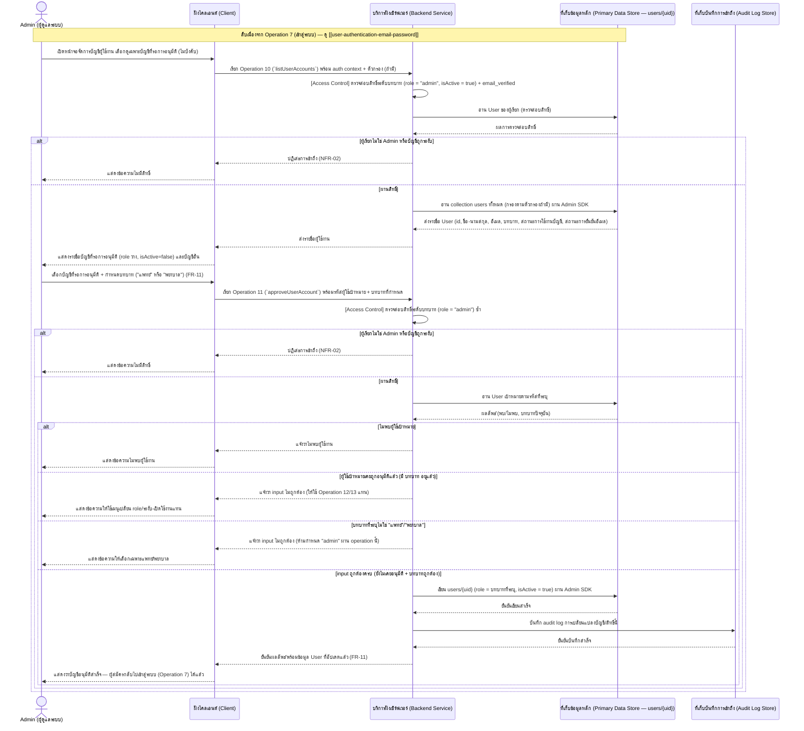
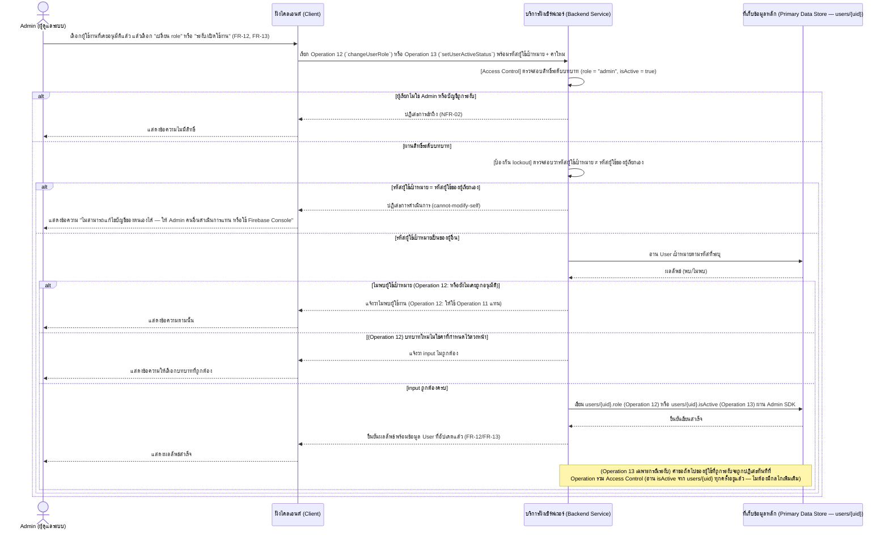
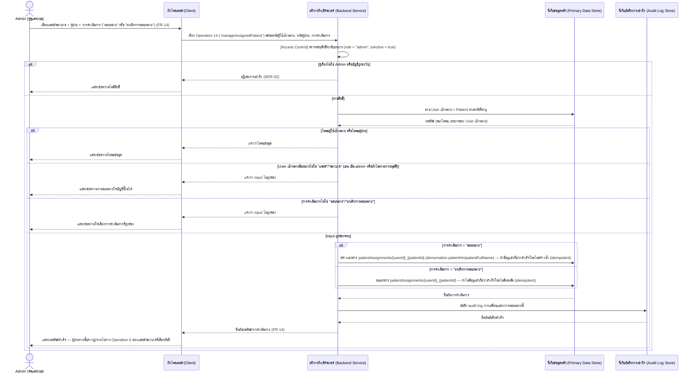
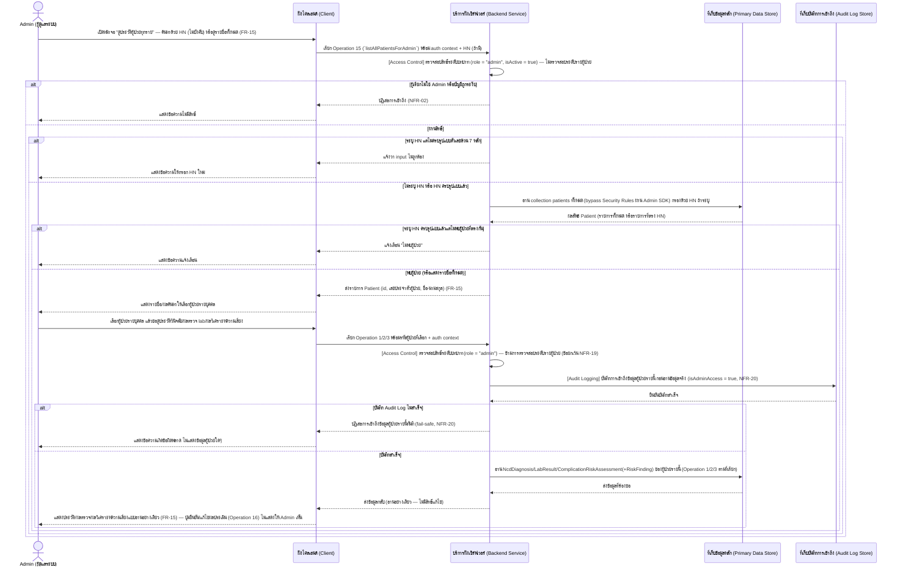
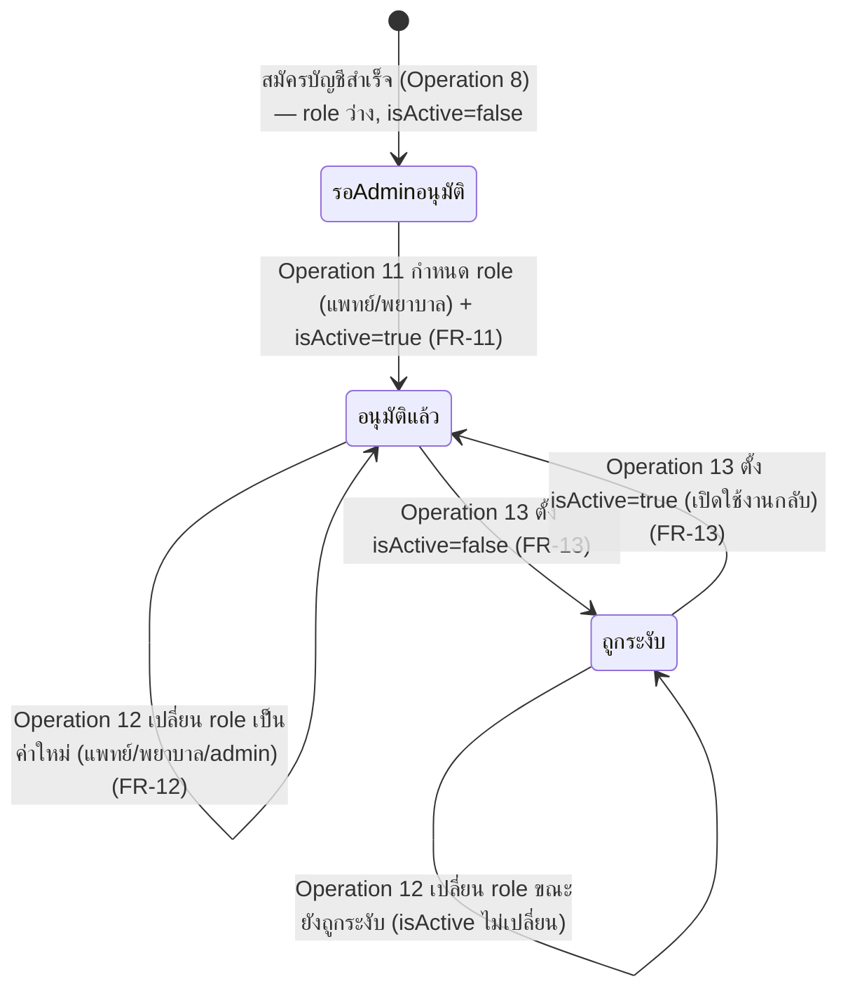

# Detailed Design — จัดการบัญชีผู้ใช้งาน สิทธิ์ และการมอบหมายผู้ป่วย (Admin)

เอกสารนี้อธิบายการออกแบบระดับ component (sequence flow, state transition, edge case) ของฟีเจอร์
[[feature-list#7. จัดการบัญชีผู้ใช้งาน สิทธิ์ และการมอบหมายผู้ป่วย (Admin)|7. จัดการบัญชีผู้ใช้งาน สิทธิ์ และการมอบหมายผู้ป่วย (Admin)]]
(FR-11–FR-15, NFR-19, NFR-20) ตาม journey ใน
[[user-journey#Journey: Admin อนุมัติบัญชีผู้ใช้งาน จัดการสิทธิ์ และดูประวัติผู้ป่วยทุกรายแบบอ่านอย่างเดียว|Journey: Admin อนุมัติบัญชีผู้ใช้งาน จัดการสิทธิ์ และดูประวัติผู้ป่วยทุกรายแบบอ่านอย่างเดียว]]
อ้างอิงสัญญาการทำงานจาก
[[api-spec#Operation 10 — ดูรายชื่อผู้ใช้งานในระบบ (สำหรับ Admin จัดการบัญชี)|Operation 10]],
[[api-spec#Operation 11 — อนุมัติบัญชีผู้ใช้งานใหม่ผ่านหน้าจอในระบบ|Operation 11]],
[[api-spec#Operation 12 — เปลี่ยนบทบาท (Role) ของผู้ใช้งานที่มีอยู่|Operation 12]],
[[api-spec#Operation 13 — ระงับ/เปิดใช้งานบัญชีผู้ใช้งาน|Operation 13]],
[[api-spec#Operation 14 — จัดการการมอบหมายผู้ป่วย (Patient Assignment)|Operation 14]],
[[api-spec#Operation 15 — ค้นหา/แสดงรายชื่อผู้ป่วยทั้งหมดในระบบ (สำหรับ Admin)|Operation 15]],
[[api-spec#Operation ร่วม — ตรวจสอบสิทธิ์การเข้าถึงข้อมูลผู้ป่วย (Access Control)|Operation ร่วม — Access Control]]
(ข้อยกเว้น NFR-19) และ
[[api-spec#Operation ร่วม — บันทึกร่องรอยการเข้าถึงข้อมูลผู้ป่วย (Audit Logging)|Operation ร่วม — Audit Logging]]
(ข้อกำหนดใหม่ NFR-20) และโมเดลข้อมูลจาก [[db-spec#ผู้ใช้ (User)|User]],
[[db-spec#การมอบหมายผู้ป่วยในความดูแล (PatientAssignment)|PatientAssignment]],
[[db-spec#ผู้ป่วย (Patient)|Patient]] และ
[[db-spec#บันทึกการเข้าถึงข้อมูล (AuditLogRecord)|AuditLogRecord]] ใน [[db-spec]]

**ขอบเขตของเอกสารนี้:** ครอบคลุมเฉพาะงานบริหารจัดการที่เป็นสิทธิ์ของ **Admin** เท่านั้น (Operation
10-15) — Admin เข้าสู่ระบบด้วยกลไกเดียวกับแพทย์/พยาบาลผ่าน Operation 7 (ดู
[[user-authentication-email-password]], ไม่ซ้ำรายละเอียดที่นี่) การดูข้อมูลผู้ป่วยแบบอ่านอย่างเดียว
ของ Admin (FR-15) เรียก Operation 1/2/3 เดิมซ้ำผ่านข้อยกเว้น NFR-19 — sequence diagram ของ Operation
1/2/3 เองอยู่ที่ [[patient-ncd-diagnosis-lab-history]]/[[complication-risk-analysis-alert]] อยู่แล้ว
เอกสารนี้แสดงเฉพาะส่วนที่ต่างจาก journey ของแพทย์/พยาบาล (การข้าม patient-level check + การเลือกผู้ป่วย
ผ่าน Operation 15 แทน Operation 0) Admin **ไม่มีสิทธิ์**เรียก Operation 4/5 (PDPA), Operation 8/9
(สมัคร/รีเซ็ตรหัสผ่าน) หรือ Operation 16 (FR-16 — ยืนยัน/แก้ไขผลประเมินความเสี่ยง) — บัญชี Admin คนแรก
(bootstrap) ยังคงตั้งผ่าน Firebase Console/Firestore โดยตรง อยู่นอกขอบเขตของเอกสารนี้

## Sequence Diagram 1 — Admin ดูรายชื่อและอนุมัติบัญชีที่รอการอนุมัติ (Operation 10 + Operation 11)

ตามที่ [[api-spec#Operation 10 — ดูรายชื่อผู้ใช้งานในระบบ (สำหรับ Admin จัดการบัญชี)|Operation 10]] และ
[[api-spec#Operation 11 — อนุมัติบัญชีผู้ใช้งานใหม่ผ่านหน้าจอในระบบ|Operation 11 ใน api-spec]] กำหนด —
แทนที่กลไกเดิมที่เคยระบุไว้ใน [[20260923-01-user-authentication-email-password]] ว่าดำเนินการผ่าน
Firebase Console/Firestore โดยตรง (ดู [[user-journey]] ขั้นตอนที่ 7 ที่เชื่อมมาจาก journey แรก):

## Sequence Diagram 2 — Admin เปลี่ยนบทบาท หรือระงับ/เปิดใช้งานบัญชี (Operation 12/13)

ทั้งสอง operation มีกฎ **ป้องกัน lockout** เหมือนกัน (ห้าม Admin แก้ไข role/isActive ของตนเอง) ตามที่
[[api-spec#Operation 12 — เปลี่ยนบทบาท (Role) ของผู้ใช้งานที่มีอยู่|Operation 12]] และ
[[api-spec#Operation 13 — ระงับ/เปิดใช้งานบัญชีผู้ใช้งาน|Operation 13 ใน api-spec]] กำหนด:

## Sequence Diagram 3 — Admin จัดการการมอบหมายผู้ป่วย (Operation 14)

ตามที่ [[api-spec#Operation 14 — จัดการการมอบหมายผู้ป่วย (Patient Assignment)|Operation 14 ใน api-spec]]
กำหนด — ปิดประเด็นรอตัดสินใจเดิมของ
[[db-spec#การมอบหมายผู้ป่วยในความดูแล (PatientAssignment)|PatientAssignment ใน db-spec]] เรื่องกลไก/
ผู้กำหนดการมอบหมาย ทั้ง "มอบหมาย" และ "ยกเลิกการมอบหมาย" เป็น **idempotent**:

## Sequence Diagram 4 — Admin ดูข้อมูลผู้ป่วยทุกรายแบบอ่านอย่างเดียว (Operation 15 + Operation 1/2/3 ผ่านข้อยกเว้น NFR-19)

ตามที่ [[api-spec#Operation 15 — ค้นหา/แสดงรายชื่อผู้ป่วยทั้งหมดในระบบ (สำหรับ Admin)|Operation 15]] และ
ข้อยกเว้น NFR-19 ใน
[[api-spec#Operation ร่วม — ตรวจสอบสิทธิ์การเข้าถึงข้อมูลผู้ป่วย (Access Control)|Operation ร่วม Access Control ใน api-spec]]
กำหนด — ต่างจาก [[patient-search-selection#Sequence Diagram|Operation 0 ของแพทย์/พยาบาล]] ตรงที่
**ไม่กรองด้วย PatientAssignment** และต้องผ่าน Cloud Function เสมอ (ไม่ใช่ Client อ่าน Firestore ตรง):

## ตาราง Operation ↔ Entity ที่กระทบ

| ลำดับ | Operation | Entity ที่กระทบ | การกระทำ | หมายเหตุ |
| --- | --- | --- | --- | --- |
| 1 | [[api-spec#Operation ร่วม — ตรวจสอบสิทธิ์การเข้าถึงข้อมูลผู้ป่วย (Access Control)\|Operation ร่วม (role-level เท่านั้น)]] | [[db-spec#ผู้ใช้ (User)\|User]] | อ่าน | precondition ของ Operation 10-15 ทั้งหมด — ไม่มีการตรวจสอบระดับรายผู้ป่วยสำหรับ Operation 10/11/12/13/14 (ไม่เกี่ยวข้องกับข้อมูลผู้ป่วยโดยตรง) |
| 2 | [[api-spec#Operation 10 — ดูรายชื่อผู้ใช้งานในระบบ (สำหรับ Admin จัดการบัญชี)\|Operation 10]] | [[db-spec#ผู้ใช้ (User)\|User]] | อ่าน | precondition ของ Operation 11/12/13 (Admin ต้องเห็นรายชื่อ/สถานะก่อนเลือกดำเนินการ) |
| 3 | [[api-spec#Operation 11 — อนุมัติบัญชีผู้ใช้งานใหม่ผ่านหน้าจอในระบบ\|Operation 11]] | [[db-spec#ผู้ใช้ (User)\|User]] | แก้ไข | กำหนด `บทบาท` ("แพทย์"/"พยาบาล" เท่านั้น) + `สถานะการใช้งานบัญชี = จริง` พร้อมกัน — เฉพาะบัญชีที่ยังไม่เคยอนุมัติ (FR-11) |
| 4 | [[api-spec#Operation 12 — เปลี่ยนบทบาท (Role) ของผู้ใช้งานที่มีอยู่\|Operation 12]] | [[db-spec#ผู้ใช้ (User)\|User]] | แก้ไข | เปลี่ยน `บทบาท` ของบัญชีที่เคยอนุมัติแล้ว — ห้ามแก้ไข role ของตนเอง (ป้องกัน lockout) |
| 5 | [[api-spec#Operation 13 — ระงับ/เปิดใช้งานบัญชีผู้ใช้งาน\|Operation 13]] | [[db-spec#ผู้ใช้ (User)\|User]] | แก้ไข | เปลี่ยน `สถานะการใช้งานบัญชี` — ห้ามแก้ไข isActive ของตนเอง (ป้องกัน lockout) |
| 6 | [[api-spec#Operation 14 — จัดการการมอบหมายผู้ป่วย (Patient Assignment)\|Operation 14]] | [[db-spec#ผู้ใช้ (User)\|User]], [[db-spec#ผู้ป่วย (Patient)\|Patient]] | อ่าน | ตรวจสอบว่า User เป้าหมายมีบทบาท "แพทย์"/"พยาบาล" และ Patient มีอยู่จริง ก่อนสร้าง/ลบ PatientAssignment |
| 7 | [[api-spec#Operation 14 — จัดการการมอบหมายผู้ป่วย (Patient Assignment)\|Operation 14]] | [[db-spec#การมอบหมายผู้ป่วยในความดูแล (PatientAssignment)\|PatientAssignment]] | สร้าง/ลบ (idempotent) | "มอบหมาย" = สร้าง (denormalize `patientHn`/`patientFullName`), "ยกเลิกการมอบหมาย" = ลบ — กระทบ Operation 0 ของแพทย์/พยาบาลที่เลือกทันที |
| 8 | [[api-spec#Operation ร่วม — ตรวจสอบสิทธิ์การเข้าถึงข้อมูลผู้ป่วย (Access Control)\|Operation ร่วม (role-level เท่านั้น)]] | [[db-spec#ผู้ใช้ (User)\|User]] | อ่าน | precondition ของ Operation 15 — **ไม่ตรวจสอบระดับรายผู้ป่วย** เพราะ Admin เห็นผู้ป่วยทุกรายตาม NFR-19 |
| 9 | [[api-spec#Operation 15 — ค้นหา/แสดงรายชื่อผู้ป่วยทั้งหมดในระบบ (สำหรับ Admin)\|Operation 15]] | [[db-spec#ผู้ป่วย (Patient)\|Patient]] | อ่าน | อ่านทั้งหมด (ไม่กรองด้วย PatientAssignment) — ผ่าน Cloud Function เสมอ ต่างจาก Operation 0 |
| 10 | [[api-spec#Operation ร่วม — ตรวจสอบสิทธิ์การเข้าถึงข้อมูลผู้ป่วย (Access Control)\|Operation ร่วม (role-level, ข้ามระดับรายผู้ป่วยตามข้อยกเว้น NFR-19)]] | [[db-spec#ผู้ใช้ (User)\|User]] | อ่าน | precondition ของ Operation 1/2/3 เมื่อผู้เรียกเป็น Admin — ข้าม `exists()` check บน PatientAssignment |
| 11 | [[api-spec#Operation ร่วม — บันทึกร่องรอยการเข้าถึงข้อมูลผู้ป่วย (Audit Logging)\|Operation ร่วม — Audit Logging]] | [[db-spec#บันทึกการเข้าถึงข้อมูล (AuditLogRecord)\|AuditLogRecord]] | สร้าง | ตั้ง `เข้าถึงในฐานะ Admin หรือไม่ = จริง` (NFR-20) — ต้องสำเร็จก่อนอ่าน NcdDiagnosis/LabResult/ComplicationRiskAssessment ใดๆ เสมอ (fail-safe) |
| 12 | [[api-spec#Operation 1 — ดึงประวัติการวินิจฉัยโรค NCD ของผู้ป่วย\|Operation 1]], [[api-spec#Operation 2 — ดึงผลตรวจ lab ย้อนหลังของผู้ป่วย\|Operation 2]], [[api-spec#Operation 3 — วิเคราะห์และแสดงผลความเสี่ยงโรคแทรกซ้อนของผู้ป่วย\|Operation 3]] | [[db-spec#ประวัติการวินิจฉัยโรค NCD (NcdDiagnosis)\|NcdDiagnosis]], [[db-spec#ผลตรวจ lab (LabResult)\|LabResult]], [[db-spec#ผลการประเมินความเสี่ยงโรคแทรกซ้อน (ComplicationRiskAssessment)\|ComplicationRiskAssessment]]+[[db-spec#รายละเอียดผลการประเมินต่อโรคแทรกซ้อน (RiskFinding)\|RiskFinding]] | อ่าน | **อ่านอย่างเดียว** — sequence diagram เต็มของแต่ละ operation อยู่ที่ [[patient-ncd-diagnosis-lab-history]]/[[complication-risk-analysis-alert]] (ไม่ต่างจากเมื่อแพทย์/พยาบาลเรียก ยกเว้นการข้าม patient-level check) — Admin **ไม่มีสิทธิ์**เรียก Operation 16 ต่อ |

## State Diagram — สถานะบัญชีผู้ใช้ (User) ตลอดวงจร Admin จัดการ (FR-11–FR-13)

ต่อยอดจาก
[[user-authentication-email-password#State Diagram — สถานะบัญชีผู้ใช้ (User) จนถึงเข้าถึงข้อมูลผู้ป่วยได้|State Diagram ของ user-authentication-email-password]]
ที่แสดงถึงจุด "สมัครบัญชีสำเร็จ" — เอกสารนี้แสดงต่อจากจุดที่ Admin อนุมัติแล้ว รวม transition ที่ยังไม่เคย
แสดงมาก่อน (เปลี่ยน role, ระงับ/เปิดใช้งาน):

หมายเหตุ:
- ทุก transition ในไดอะแกรมนี้ (ยกเว้น "สมัครบัญชีสำเร็จ") ปฏิเสธเสมอถ้ารหัสผู้ใช้เป้าหมาย = รหัสผู้ใช้
  ของ Admin ผู้เรียกเอง (ป้องกัน lockout — ดู Sequence Diagram 2 ด้านบน) ไม่แสดงเป็น transition แยกใน
  ไดอะแกรมนี้เพราะเป็นการปฏิเสธ ไม่ใช่ transition ที่เกิดขึ้นจริง
- state "ถูกระงับ" ยังคงมีค่า `role` เดิมอยู่ (Operation 13 แก้ไขเฉพาะ `isActive` ไม่กระทบ `role`) —
  ผู้ใช้ที่ `isActive=false` ถูกปฏิเสธที่ Operation ร่วม Access Control ทันทีไม่ว่า `role` จะเป็นอะไร
- การกำหนด `role = "admin"` ทำได้เฉพาะผ่าน Operation 12 เท่านั้น (ไม่ใช่ Operation 11) และเฉพาะบัญชีที่
  เคยผ่าน Operation 11 มาก่อนแล้ว (ไม่มี state ใดใน diagram นี้ที่ข้าม "อนุมัติแล้ว" ไปเป็น admin โดยตรง)
  — บัญชี Admin คนแรก/bootstrap ตั้งผ่าน Firebase Console/Firestore โดยตรง อยู่นอกไดอะแกรมนี้

**หมายเหตุเทคโนโลยีจริง (Firestore field mapping):** ทุก state สะท้อนค่า field `role` (string, nullable)
และ `isActive` (boolean) บนเอกสาร `users/{uid}` ตรงตัวตาม
[[db-spec#ผู้ใช้ (User)|Firestore Technical Binding ของ User ใน db-spec]] — ไม่มี field สถานะแบบ enum
รวมแยกต่างหาก (state ในไดอะแกรมนี้คือการตีความ logical จากสองฟิลด์นี้ร่วมกันเท่านั้น)

## Edge Case และวิธีจัดการ

| Edge Case | วิธีจัดการ | อ้างอิง |
| --- | --- | --- |
| ผู้เรียก Operation 10-15 ไม่ใช่ Admin หรือบัญชีถูกระงับ | ปฏิเสธการเข้าถึงทุก operation ในเอกสารนี้ (NFR-02) | [[backlog#สูง (MVP)\|FR-11]]–[[backlog#สูง (MVP)\|FR-15]] |
| Admin พยายามอนุมัติบัญชีที่เคยถูกอนุมัติแล้ว (Operation 11) | แจ้งว่า input ไม่ถูกต้อง — แนะนำให้ใช้ Operation 12/13 แทน | [[backlog#สูง (MVP)\|FR-11]] |
| Admin พยายามกำหนด role = "admin" ผ่าน Operation 11 | ปฏิเสธเป็น input ไม่ถูกต้อง — Operation 11 กำหนดได้เฉพาะ "แพทย์"/"พยาบาล" เท่านั้น (การเป็น admin ทำได้ผ่าน Operation 12 เท่านั้น) | [[backlog#สูง (MVP)\|FR-11]] |
| Admin พยายามเปลี่ยน role/ระงับ-เปิดใช้งานบัญชีของตนเอง (Operation 12/13) | ปฏิเสธเสมอ (`cannot-modify-self`) — ป้องกันไม่ให้ไม่มี Admin ที่ใช้งานได้เหลือในระบบ ต้องให้ Admin คนอื่นดำเนินการแทน หรือใช้ Firebase Console/Firestore โดยตรง | [[backlog#สูง (MVP)\|FR-12]], [[backlog#สูง (MVP)\|FR-13]] |
| Admin มอบหมายผู้ป่วยให้บัญชีที่ยังไม่ผ่านการอนุมัติ หรือบัญชี admin (Operation 14) | ปฏิเสธเป็น input ไม่ถูกต้อง — มอบหมายได้เฉพาะบัญชีที่มี `บทบาท` เป็น "แพทย์"/"พยาบาล" เท่านั้น | [[backlog#สูง (MVP)\|FR-14]] |
| Admin มอบหมาย/ยกเลิกการมอบหมายผู้ป่วย-ผู้ใช้คู่เดิมซ้ำ (Operation 14) | สำเร็จโดยไม่มีผลเพิ่ม (idempotent) — ไม่ถือเป็น error | [[backlog#สูง (MVP)\|FR-14]] |
| Admin ค้นหาผู้ป่วยด้วย HN ที่ไม่ครบรูปแบบตัวเลขล้วน 7 หลัก (Operation 15) | แจ้งว่า input ไม่ถูกต้อง เช่นเดียวกับหลักการของ Operation 0/FR-06 | [[backlog#สูง (MVP)\|FR-15]], [[backlog#สูง (MVP)\|FR-06]] |
| Admin เรียก Operation 1/2/3 ของผู้ป่วยที่ตนไม่มี PatientAssignment | อนุญาต — ข้ามการตรวจสอบระดับรายผู้ป่วยตามข้อยกเว้น NFR-19 แต่ยังคงต้องผ่านการตรวจสอบระดับบทบาท + `email_verified` ตามปกติ | [[backlog#Non-Functional Requirements\|NFR-19]] |
| บันทึก Audit Log ไม่สำเร็จ ก่อน Admin เข้าถึงข้อมูลผู้ป่วยรายบุคคล (Operation 1/2/3 ผ่านข้อยกเว้น NFR-19) | ปฏิเสธการเข้าถึงข้อมูลผู้ป่วยรายนั้นทันที (fail-safe) — ไม่คืนข้อมูลแม้ Access Control จะผ่านแล้วก็ตาม | [[backlog#Non-Functional Requirements\|NFR-20]] |
| Admin พยายามเรียก Operation 16 (ยืนยัน/แก้ไขผลประเมินความเสี่ยง) หรือ operation ที่แก้ไขข้อมูลทางคลินิกใดๆ | ปฏิเสธเสมอ — ไม่ใช่สิทธิ์ของ Admin แม้จะผ่านข้อยกเว้น NFR-19 สำหรับการอ่านก็ตาม (ดูรายละเอียดที่ [[complication-risk-analysis-alert]]) | [[backlog#สูง (MVP)\|FR-16]], [[backlog#Non-Functional Requirements\|NFR-19]] |
| Admin พยายามเรียก Operation 4 (คำขอสิทธิของเจ้าของข้อมูล), Operation 5 (audit trail), Operation 8/9 (สมัคร/รีเซ็ตรหัสผ่าน) | ปฏิเสธเสมอ — ไม่ใช่สิทธิ์ของ Admin ตาม [[api-spec#บทบาทผู้เรียกใช้ (Roles)\|บทบาทผู้เรียกใช้ใน api-spec]] | [[20260924-01-admin-role-account-management]] |
| ไม่พบผู้ใช้เป้าหมาย/ผู้ป่วยตามรหัสที่ระบุ (Operation 11/12/13/14) | แจ้งว่าไม่พบข้อมูล ไม่ดำเนินการใดๆ | [[db-spec#ผู้ใช้ (User)\|User]], [[db-spec#ผู้ป่วย (Patient)\|Patient]] |

## หมายเหตุการ Implement (จาก technology-stack)

รายละเอียดกลไกจริงต่อไปนี้อ้างอิงเฉพาะสิ่งที่ `[[technology-stack]]` ตัดสินใจไว้แล้วเท่านั้น (สถาปัตยกรรม
Firebase-native เดียวกับ Operation 1-6 — ไม่มี decision area ใหม่เฉพาะฟีเจอร์ที่ 7 เพิ่มเติมใน
`[[technology-stack]]` นอกจากกลไกเดิม decision area 3/4/5/7/18):

- **Operation 10:** HTTPS Callable Function ชื่อ **`listUserAccounts`** (กลุ่มงาน Admin — Account,
  Role & Patient Assignment Management ตาม [[architecture]]) — อ่าน collection `users` ผ่าน Firebase
  Admin SDK ตาม
  [[api-spec#Operation 10 — ดูรายชื่อผู้ใช้งานในระบบ (สำหรับ Admin จัดการบัญชี)|Technical Binding ของ Operation 10 ใน api-spec]]
- **Operation 11:** HTTPS Callable Function ชื่อ **`approveUserAccount`** — เขียน `users/{uid}`
  (`role`, `isActive = true`) ผ่าน Admin SDK เท่านั้น
- **Operation 12:** HTTPS Callable Function ชื่อ **`changeUserRole`** — ตรวจสอบ
  `request.auth.uid !== targetUserId` ก่อนเสมอ (ป้องกัน lockout) แล้วเขียน `users/{uid}.role`
- **Operation 13:** HTTPS Callable Function ชื่อ **`setUserActiveStatus`** — ตรวจสอบ
  `request.auth.uid !== targetUserId` ก่อนเสมอ แล้วเขียน `users/{uid}.isActive`
- **Operation 14:** HTTPS Callable Function ชื่อ **`manageAssignedPatient`** — สร้าง/ลบเอกสาร
  `patientAssignments/{userId}_{patientId}` ผ่าน Admin SDK (denormalize `patientHn`/`patientFullName`
  จาก `patients/{patientId}` ตอนสร้าง ตาม
  [[db-spec#การมอบหมายผู้ป่วยในความดูแล (PatientAssignment)|Firestore Technical Binding ของ PatientAssignment ใน db-spec]])
- **Operation 15:** HTTPS Callable Function ชื่อ **`listAllPatientsForAdmin`** — อ่าน collection
  `patients` โดยตรงผ่าน Admin SDK (bypass Security Rules) ใช้ composite index `(hn ASC)` เมื่อค้นหา
  ด้วย HN ตาม [[db-spec#ผู้ป่วย (Patient)|Firestore Technical Binding ของ Patient ใน db-spec]]
- **ข้อยกเว้น NFR-19 สำหรับ Operation 1/2/3:** shared helper module เดียวกับที่ Operation 1-6 ใช้ (ดู
  [[patient-ncd-diagnosis-lab-history#หมายเหตุการ Implement (จาก technology-stack)|patient-ncd-diagnosis-lab-history]]) —
  ข้าม `exists()` check บน `patientAssignments/{uid}_{patientId}` เมื่อ `role === 'admin'` เท่านั้น
- **Audit Logging (NFR-20):** เขียน `auditLogRecords` ผ่าน Admin SDK เท่านั้น ตั้ง
  `isAdminAccess = true` เฉพาะเมื่อเรียกจาก Operation 1/2/3/15 โดยผู้ใช้ `role === 'admin'` ตาม
  [[db-spec#บันทึกการเข้าถึงข้อมูล (AuditLogRecord)|Firestore Technical Binding ของ AuditLogRecord ใน db-spec]]
  — แนวทาง fail-safe เดียวกับ NFR-06 (ถ้าเขียนไม่สำเร็จ ปฏิเสธการเข้าถึงทันที ไม่ทำ logic ที่เหลือ)
- **Error code จริงต่อ operation:**
  - Operation 10: ปฏิเสธการเข้าถึง → `permission-denied`; ไม่มี auth token → `unauthenticated`
  - Operation 11: ปฏิเสธการเข้าถึง → `permission-denied`; ไม่พบผู้ใช้เป้าหมาย → `not-found`; เคยอนุมัติ
    แล้ว/บทบาทไม่ถูกต้อง → `invalid-argument`
  - Operation 12: ปฏิเสธการเข้าถึง → `permission-denied`; พยายามเปลี่ยนบทบาทตนเอง →
    `functions.https.HttpsError('permission-denied', 'cannot-modify-self')`; ไม่พบผู้ใช้เป้าหมาย/ยังไม่
    เคยอนุมัติ → `not-found`; บทบาทไม่ถูกต้อง → `invalid-argument`
  - Operation 13: ปฏิเสธการเข้าถึง → `permission-denied`; พยายามระงับ/เปิดใช้งานตนเอง →
    `functions.https.HttpsError('permission-denied', 'cannot-modify-self')`; ไม่พบผู้ใช้เป้าหมาย →
    `not-found`
  - Operation 14: ปฏิเสธการเข้าถึง → `permission-denied`; ไม่พบผู้ใช้/ผู้ป่วยเป้าหมาย → `not-found`;
    บทบาทผู้ใช้เป้าหมายไม่ถูกต้อง/การดำเนินการไม่ถูกต้อง → `invalid-argument`
  - Operation 15: ปฏิเสธการเข้าถึง → `permission-denied`; HN ไม่ถูกต้อง → `invalid-argument`; ไม่พบ
    ผู้ป่วย → `not-found`
- **ประเด็นรอตัดสินใจ (สืบทอดจาก api-spec — ไม่ใช่การตัดสินใจใหม่ของเอกสารนี้):** จำนวน/การแบ่ง Cloud
  Function สำหรับ Operation 10-16 (ปัจจุบันออกแบบเป็น 7 function แยกตาม operation — ยังไม่มี decision
  area ใน `[[technology-stack]]` ยืนยันจำนวนที่แน่นอน), การรองรับยืนยัน/แก้ไขผลประเมินความเสี่ยงซ้ำ
  หลายครั้ง (FR-16, ดู [[complication-risk-analysis-alert]]), บทบาทที่ควรเรียก Operation 5 ได้ (ควรเพิ่ม
  Admin หรือไม่) — ดู [[api-spec#ประเด็นรอตัดสินใจ|ประเด็นรอตัดสินใจใน api-spec]] สำหรับรายละเอียดเต็ม

## เอกสารที่เกี่ยวข้อง

- [[api-spec]]
- [[db-spec]]
- [[architecture]]
- [[technology-stack]]
- [[feature-list]]
- [[user-journey]]
- [[backlog]]
- [[20260924-01-admin-role-account-management]]
- [[user-authentication-email-password]]
- [[patient-search-selection]]
- [[patient-ncd-diagnosis-lab-history]]
- [[complication-risk-analysis-alert]]
- [[pdpa-data-protection-compliance]]
