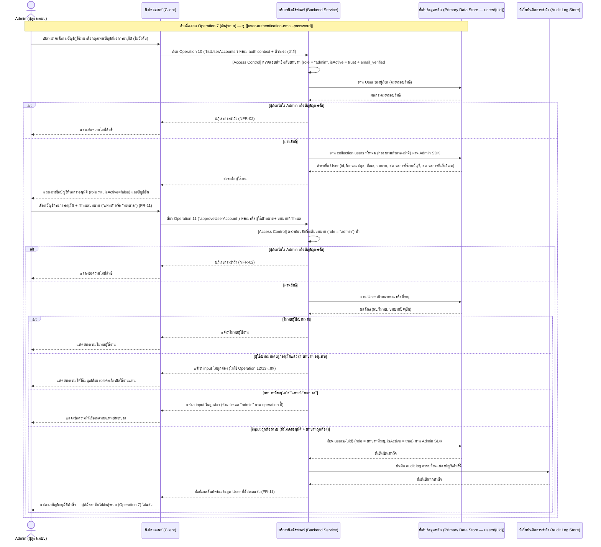
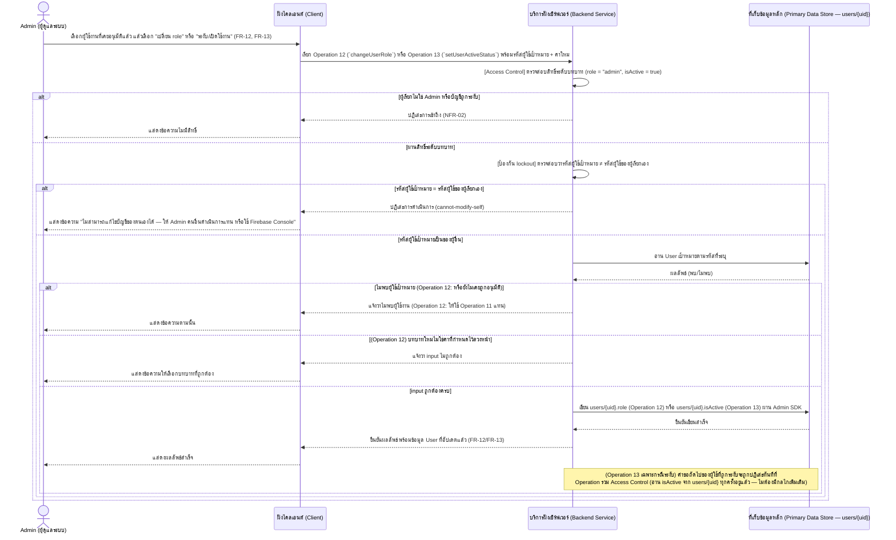
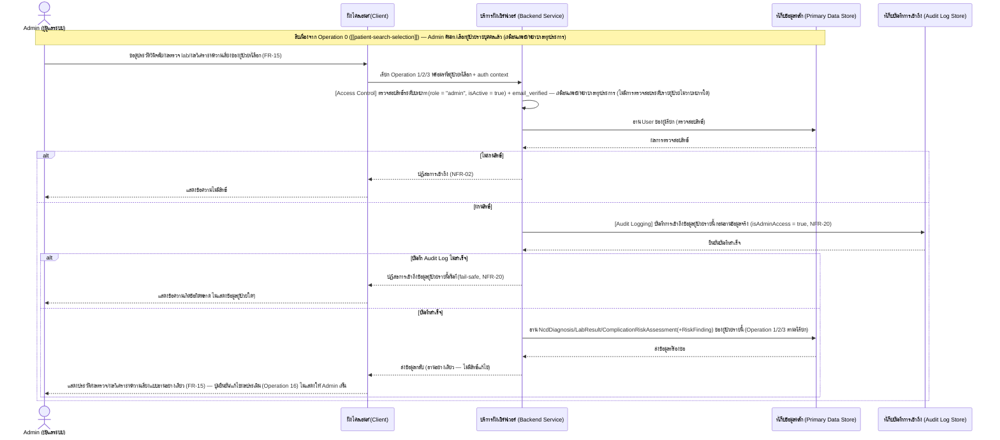
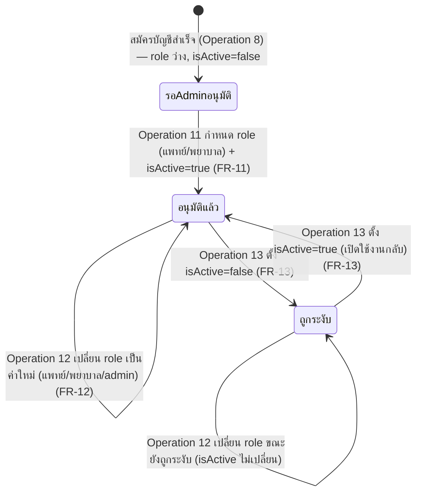

# Detailed Design — จัดการบัญชีผู้ใช้งานและสิทธิ์ (Admin)

เอกสารนี้อธิบายการออกแบบระดับ component (sequence flow, state transition, edge case) ของฟีเจอร์
[[feature-list#7. จัดการบัญชีผู้ใช้งานและสิทธิ์ (Admin)|7. จัดการบัญชีผู้ใช้งานและสิทธิ์ (Admin)]]
(FR-11–FR-13, FR-15, NFR-19, NFR-20) ตาม journey ใน
[[user-journey#Journey: Admin อนุมัติบัญชีผู้ใช้งาน จัดการสิทธิ์ และดูประวัติผู้ป่วยทุกรายแบบอ่านอย่างเดียว|Journey: Admin อนุมัติบัญชีผู้ใช้งาน จัดการสิทธิ์ และดูประวัติผู้ป่วยทุกรายแบบอ่านอย่างเดียว]]
อ้างอิงสัญญาการทำงานจาก
[[api-spec#Operation 10 — ดูรายชื่อผู้ใช้งานในระบบ (สำหรับ Admin จัดการบัญชี)|Operation 10]],
[[api-spec#Operation 11 — อนุมัติบัญชีผู้ใช้งานใหม่ผ่านหน้าจอในระบบ|Operation 11]],
[[api-spec#Operation 12 — เปลี่ยนบทบาท (Role) ของผู้ใช้งานที่มีอยู่|Operation 12]],
[[api-spec#Operation 13 — ระงับ/เปิดใช้งานบัญชีผู้ใช้งาน|Operation 13]],
[[api-spec#Operation 0 — ค้นหา/แสดงรายชื่อผู้ป่วยทั้งหมดในระบบ (ค้นหาเฉพาะรายด้วยเลข HN)|Operation 0]],
[[api-spec#Operation ร่วม — ตรวจสอบสิทธิ์การเข้าถึงข้อมูลผู้ป่วย (Access Control)|Operation ร่วม — Access Control]]
และ
[[api-spec#Operation ร่วม — บันทึกร่องรอยการเข้าถึงข้อมูลผู้ป่วย (Audit Logging)|Operation ร่วม — Audit Logging]]
(NFR-20) และโมเดลข้อมูลจาก [[db-spec#ผู้ใช้ (User)|User]], [[db-spec#ผู้ป่วย (Patient)|Patient]] และ
[[db-spec#บันทึกการเข้าถึงข้อมูล (AuditLogRecord)|AuditLogRecord]] ใน [[db-spec]]

**แก้ไข 2026-09-25 (รอบ audit-pipeline) — ยกเลิกกลไก PatientAssignment ทั้งหมด, ลบ FR-14/Operation 14,
รวม Operation 15 เข้า Operation 0:** เอกสารฉบับก่อนหน้านี้ (ชื่อไฟล์เดิม "จัดการบัญชีผู้ใช้งาน สิทธิ์
และการมอบหมายผู้ป่วย (Admin)") มี Sequence Diagram 3 อธิบาย Operation 14 (จัดการการมอบหมายผู้ป่วย) และ
Sequence Diagram 4 อธิบาย Operation 15 (ค้นหา/แสดงรายชื่อผู้ป่วยสำหรับ Admin แยกต่างหาก) — ทั้งสองจุด
**ล้าสมัยแล้ว** ตาม [[architecture]]/[[api-spec]]/[[db-spec]] ที่ sync วันที่ 2026-09-25: FR-14 และ
entity `PatientAssignment` ถูกยกเลิกทั้งหมด (Sequence Diagram 3 เดิมจึงถูก**ลบออกทั้งหมด**ไม่มีสิ่งใด
มาแทนที่ — Admin ไม่มีสิทธิ์นี้อีกต่อไป) ส่วน Operation 15 ถูกรวมเข้ากับ **Operation 0** กลายเป็น
operation เดียวที่ทุกบทบาท (แพทย์/พยาบาล/Admin) เรียกใช้เหมือนกันทุกประการ (Client อ่าน Firestore ตรง
ผ่าน Security Rules — ไม่ผ่าน Cloud Function อีกต่อไป) เอกสารนี้เขียนใหม่ทั้งฉบับให้ตรงกับสถานะปัจจุบัน

**ขอบเขตของเอกสารนี้:** ครอบคลุมเฉพาะงานบริหารจัดการที่เป็นสิทธิ์ของ **Admin** เท่านั้น (Operation
10-13) — Admin เข้าสู่ระบบด้วยกลไกเดียวกับแพทย์/พยาบาลผ่าน Operation 7 (ดู
[[user-authentication-email-password]], ไม่ซ้ำรายละเอียดที่นี่) การดูข้อมูลผู้ป่วยแบบอ่านอย่างเดียว
ของ Admin (FR-15) เรียก Operation 0 ([[patient-search-selection]]) เพื่อค้นหา/เลือกผู้ป่วย แล้วเรียก
Operation 1/2/3 เดิมซ้ำ (เหมือนแพทย์/พยาบาลทุกประการ ต่างกันเพียงสิทธิ์อ่านอย่างเดียว) — sequence
diagram ของ Operation 0/1/2/3 เองอยู่ที่ [[patient-search-selection]]/[[patient-ncd-diagnosis-lab-history]]/
[[complication-risk-analysis-alert]] อยู่แล้ว เอกสารนี้แสดงเฉพาะส่วนที่ต่างจาก journey ของแพทย์/พยาบาล
(flag `isAdminAccess = true` ใน Audit Log และสิทธิ์อ่านอย่างเดียว) Admin **ไม่มีสิทธิ์**เรียก
Operation 4/5 (PDPA), Operation 8/9 (สมัคร/รีเซ็ตรหัสผ่าน) หรือ Operation 16 (FR-16 — ยืนยัน/แก้ไขผล
ประเมินความเสี่ยง) — บัญชี Admin คนแรก (bootstrap) ยังคงตั้งผ่าน Firebase Console/Firestore โดยตรง
อยู่นอกขอบเขตของเอกสารนี้

## Sequence Diagram 1 — Admin ดูรายชื่อและอนุมัติบัญชีที่รอการอนุมัติ (Operation 10 + Operation 11)

ตามที่ [[api-spec#Operation 10 — ดูรายชื่อผู้ใช้งานในระบบ (สำหรับ Admin จัดการบัญชี)|Operation 10]] และ
[[api-spec#Operation 11 — อนุมัติบัญชีผู้ใช้งานใหม่ผ่านหน้าจอในระบบ|Operation 11 ใน api-spec]] กำหนด —
แทนที่กลไกเดิมที่เคยระบุไว้ใน [[20260923-01-user-authentication-email-password]] ว่าดำเนินการผ่าน
Firebase Console/Firestore โดยตรง (ดู [[user-journey]] ขั้นตอนที่ 7 ที่เชื่อมมาจาก journey แรก):

```mermaid
sequenceDiagram
    actor Admin as Admin (ผู้ดูแลระบบ)
    participant Client as ฝั่งไคลเอนต์ (Client)
    participant Backend as บริการฝั่งเซิร์ฟเวอร์ (Backend Service)
    participant Store as ที่เก็บข้อมูลหลัก (Primary Data Store — users/{uid})
    participant AuditStore as ที่เก็บบันทึกการเข้าถึง (Audit Log Store)

    Note over Admin,Store: สืบเนื่องจาก Operation 7 (เข้าสู่ระบบ) — ดู [[user-authentication-email-password]]

    Admin->>Client: เปิดหน้าจอจัดการบัญชีผู้ใช้งาน เลือกดูเฉพาะบัญชีที่รอการอนุมัติ (ไม่บังคับ)
    Client->>Backend: เรียก Operation 10 (`listUserAccounts`) พร้อม auth context + ตัวกรอง (ถ้ามี)
    Backend->>Backend: [Access Control] ตรวจสอบสิทธิ์ระดับบทบาท (role = "admin", isActive = true) + email_verified
    Backend->>Store: อ่าน User ของผู้เรียก (ตรวจสอบสิทธิ์)
    Store-->>Backend: ผลการตรวจสอบสิทธิ์
    alt ผู้เรียกไม่ใช่ Admin หรือบัญชีถูกระงับ
        Backend-->>Client: ปฏิเสธการเข้าถึง (NFR-02)
        Client-->>Admin: แสดงข้อความไม่มีสิทธิ์
    else ผ่านสิทธิ์
        Backend->>Store: อ่าน collection users ทั้งหมด (กรองตามตัวกรองถ้ามี) ผ่าน Admin SDK
        Store-->>Backend: ส่งรายชื่อ User (id, ชื่อ-นามสกุล, อีเมล, บทบาท, สถานะการใช้งานบัญชี, สถานะการยืนยันอีเมล)
        Backend-->>Client: ส่งรายชื่อผู้ใช้งาน
        Client-->>Admin: แสดงรายชื่อบัญชีที่รอการอนุมัติ (role ว่าง, isActive=false) และบัญชีอื่น
        Admin->>Client: เลือกบัญชีที่รอการอนุมัติ + กำหนดบทบาท ("แพทย์" หรือ "พยาบาล") (FR-11)
        Client->>Backend: เรียก Operation 11 (`approveUserAccount`) พร้อมรหัสผู้ใช้เป้าหมาย + บทบาทที่กำหนด
        Backend->>Backend: [Access Control] ตรวจสอบสิทธิ์ระดับบทบาท (role = "admin") ซ้ำ
        alt ผู้เรียกไม่ใช่ Admin หรือบัญชีถูกระงับ
            Backend-->>Client: ปฏิเสธการเข้าถึง (NFR-02)
            Client-->>Admin: แสดงข้อความไม่มีสิทธิ์
        else ผ่านสิทธิ์
            Backend->>Store: อ่าน User เป้าหมายตามรหัสที่ระบุ
            Store-->>Backend: ผลลัพธ์ (พบ/ไม่พบ, บทบาทปัจจุบัน)
            alt ไม่พบผู้ใช้เป้าหมาย
                Backend-->>Client: แจ้งว่าไม่พบผู้ใช้งาน
                Client-->>Admin: แสดงข้อความไม่พบผู้ใช้งาน
            else ผู้ใช้เป้าหมายเคยถูกอนุมัติแล้ว (มี บทบาท อยู่แล้ว)
                Backend-->>Client: แจ้งว่า input ไม่ถูกต้อง (ให้ใช้ Operation 12/13 แทน)
                Client-->>Admin: แสดงข้อความให้ใช้เมนูเปลี่ยน role/ระงับ-เปิดใช้งานแทน
            else บทบาทที่ระบุไม่ใช่ "แพทย์"/"พยาบาล"
                Backend-->>Client: แจ้งว่า input ไม่ถูกต้อง (ห้ามกำหนด "admin" ผ่าน operation นี้)
                Client-->>Admin: แสดงข้อความให้เลือกเฉพาะแพทย์/พยาบาล
            else input ถูกต้องครบ (ยังไม่เคยอนุมัติ + บทบาทถูกต้อง)
                Backend->>Store: เขียน users/{uid} (role = บทบาทที่ระบุ, isActive = true) ผ่าน Admin SDK
                Store-->>Backend: ยืนยันเขียนสำเร็จ
                Backend->>AuditStore: บันทึก audit log การเปลี่ยนแปลงบัญชี/สิทธิ์นี้
                AuditStore-->>Backend: ยืนยันบันทึกสำเร็จ
                Backend-->>Client: ยืนยันผลลัพธ์ พร้อมข้อมูล User ที่อัปเดตแล้ว (FR-11)
                Client-->>Admin: แสดงว่าบัญชีอนุมัติสำเร็จ — ผู้สมัครกลับไปเข้าสู่ระบบ (Operation 7) ได้แล้ว
            end
        end
    end
```

## Sequence Diagram 2 — Admin เปลี่ยนบทบาท หรือระงับ/เปิดใช้งานบัญชี (Operation 12/13)

ทั้งสอง operation มีกฎ **ป้องกัน lockout** เหมือนกัน (ห้าม Admin แก้ไข role/isActive ของตนเอง) ตามที่
[[api-spec#Operation 12 — เปลี่ยนบทบาท (Role) ของผู้ใช้งานที่มีอยู่|Operation 12]] และ
[[api-spec#Operation 13 — ระงับ/เปิดใช้งานบัญชีผู้ใช้งาน|Operation 13 ใน api-spec]] กำหนด:

```mermaid
sequenceDiagram
    actor Admin as Admin (ผู้ดูแลระบบ)
    participant Client as ฝั่งไคลเอนต์ (Client)
    participant Backend as บริการฝั่งเซิร์ฟเวอร์ (Backend Service)
    participant Store as ที่เก็บข้อมูลหลัก (Primary Data Store — users/{uid})

    Admin->>Client: เลือกผู้ใช้งานที่เคยอนุมัติแล้ว แล้วเลือก "เปลี่ยน role" หรือ "ระงับ/เปิดใช้งาน" (FR-12, FR-13)
    Client->>Backend: เรียก Operation 12 (`changeUserRole`) หรือ Operation 13 (`setUserActiveStatus`) พร้อมรหัสผู้ใช้เป้าหมาย + ค่าใหม่
    Backend->>Backend: [Access Control] ตรวจสอบสิทธิ์ระดับบทบาท (role = "admin", isActive = true)
    alt ผู้เรียกไม่ใช่ Admin หรือบัญชีถูกระงับ
        Backend-->>Client: ปฏิเสธการเข้าถึง (NFR-02)
        Client-->>Admin: แสดงข้อความไม่มีสิทธิ์
    else ผ่านสิทธิ์ระดับบทบาท
        Backend->>Backend: [ป้องกัน lockout] ตรวจสอบว่ารหัสผู้ใช้เป้าหมาย ≠ รหัสผู้ใช้ของผู้เรียกเอง
        alt รหัสผู้ใช้เป้าหมาย = รหัสผู้ใช้ของผู้เรียกเอง
            Backend-->>Client: ปฏิเสธการดำเนินการ (cannot-modify-self)
            Client-->>Admin: แสดงข้อความ "ไม่สามารถแก้ไขบัญชีของตนเองได้ — ให้ Admin คนอื่นดำเนินการแทน หรือใช้ Firebase Console"
        else รหัสผู้ใช้เป้าหมายเป็นของผู้อื่น
            Backend->>Store: อ่าน User เป้าหมายตามรหัสที่ระบุ
            Store-->>Backend: ผลลัพธ์ (พบ/ไม่พบ)
            alt ไม่พบผู้ใช้เป้าหมาย (Operation 12: หรือยังไม่เคยถูกอนุมัติ)
                Backend-->>Client: แจ้งว่าไม่พบผู้ใช้งาน (Operation 12: ให้ใช้ Operation 11 แทน)
                Client-->>Admin: แสดงข้อความตามนั้น
            else (Operation 12) บทบาทใหม่ไม่ใช่ค่าที่กำหนดไว้ล่วงหน้า
                Backend-->>Client: แจ้งว่า input ไม่ถูกต้อง
                Client-->>Admin: แสดงข้อความให้เลือกบทบาทที่ถูกต้อง
            else input ถูกต้องครบ
                Backend->>Store: เขียน users/{uid}.role (Operation 12) หรือ users/{uid}.isActive (Operation 13) ผ่าน Admin SDK
                Store-->>Backend: ยืนยันเขียนสำเร็จ
                Backend-->>Client: ยืนยันผลลัพธ์ พร้อมข้อมูล User ที่อัปเดตแล้ว (FR-12/FR-13)
                Client-->>Admin: แสดงผลลัพธ์สำเร็จ
                Note over Backend,Store: (Operation 13 เฉพาะกรณีระงับ) คำขอถัดไปของผู้ใช้ที่ถูกระงับจะถูกปฏิเสธทันทีที่<br/>Operation ร่วม Access Control (อ่าน isActive จาก users/{uid} ทุกครั้งอยู่แล้ว — ไม่ต้องมีกลไกเพิ่มเติม)
            end
        end
    end
```

## Sequence Diagram 3 — Admin ดูข้อมูลผู้ป่วยทุกรายแบบอ่านอย่างเดียว (Operation 0 + Operation 1/2/3)

**แก้ไข 2026-09-25 (เดิมชื่อ "Sequence Diagram 4" อ้าง Operation 15 — ถูกรวมเข้ากับ Operation 0 แล้ว):**
ตามที่ [[api-spec#Operation 0 — ค้นหา/แสดงรายชื่อผู้ป่วยทั้งหมดในระบบ (ค้นหาเฉพาะรายด้วยเลข HN)|Operation 0]]
กำหนด — **ไม่มี operation แยกสำหรับ Admin อีกต่อไป** Admin เรียก Operation 0 เดียวกันทุกประการกับแพทย์/
พยาบาล (Client อ่าน Firestore ตรงผ่าน Security Rules เดียวกัน — sequence diagram เต็มของ Operation 0
อยู่ที่ [[patient-search-selection#Sequence Diagram 1 — ตรวจสอบสิทธิ์ + Operation 0 (ค้นหาด้วย HN และดูรายชื่อทั้งหมด)|patient-search-selection]]
ไม่ซ้ำที่นี่) เอกสารนี้แสดงเฉพาะขั้นตอนที่ตามมาหลังเลือกผู้ป่วยแล้ว ซึ่งเป็นจุดเดียวที่ Admin ต่างจาก
แพทย์/พยาบาล (flag `isAdminAccess = true` + สิทธิ์อ่านอย่างเดียว):

```mermaid
sequenceDiagram
    actor Admin as Admin (ผู้ดูแลระบบ)
    participant Client as ฝั่งไคลเอนต์ (Client)
    participant Backend as บริการฝั่งเซิร์ฟเวอร์ (Backend Service)
    participant Store as ที่เก็บข้อมูลหลัก (Primary Data Store)
    participant AuditStore as ที่เก็บบันทึกการเข้าถึง (Audit Log Store)

    Note over Admin,Store: สืบเนื่องจาก Operation 0 ([[patient-search-selection]]) — Admin ค้นหา/เลือกผู้ป่วยรายบุคคลแล้ว (เหมือนแพทย์/พยาบาลทุกประการ)

    Admin->>Client: ขอดูประวัติวินิจฉัย/ผลตรวจ lab/ผลวิเคราะห์ความเสี่ยงของผู้ป่วยที่เลือก (FR-15)
    Client->>Backend: เรียก Operation 1/2/3 พร้อมรหัสผู้ป่วยที่เลือก + auth context
    Backend->>Backend: [Access Control] ตรวจสอบสิทธิ์ระดับบทบาท (role = "admin", isActive = true) + email_verified — เหมือนแพทย์/พยาบาลทุกประการ (ไม่มีการตรวจสอบระดับรายผู้ป่วยไม่ว่าบทบาทใด)
    Backend->>Store: อ่าน User ของผู้เรียก (ตรวจสอบสิทธิ์)
    Store-->>Backend: ผลการตรวจสอบสิทธิ์
    alt ไม่ผ่านสิทธิ์
        Backend-->>Client: ปฏิเสธการเข้าถึง (NFR-02)
        Client-->>Admin: แสดงข้อความไม่มีสิทธิ์
    else ผ่านสิทธิ์
        Backend->>AuditStore: [Audit Logging] บันทึกการเข้าถึงข้อมูลผู้ป่วยรายนี้ ก่อนอ่านข้อมูลจริง (isAdminAccess = true, NFR-20)
        AuditStore-->>Backend: ยืนยันบันทึกสำเร็จ
        alt บันทึก Audit Log ไม่สำเร็จ
            Backend-->>Client: ปฏิเสธการเข้าถึงข้อมูลผู้ป่วยรายนี้ทันที (fail-safe, NFR-20)
            Client-->>Admin: แสดงข้อความเกิดข้อผิดพลาด ไม่แสดงข้อมูลผู้ป่วยใดๆ
        else บันทึกสำเร็จ
            Backend->>Store: อ่าน NcdDiagnosis/LabResult/ComplicationRiskAssessment(+RiskFinding) ของผู้ป่วยรายนี้ (Operation 1/2/3 ตามที่เรียก)
            Store-->>Backend: ส่งข้อมูลที่ร้องขอ
            Backend-->>Client: ส่งข้อมูลกลับ (อ่านอย่างเดียว — ไม่มีสิทธิ์แก้ไข)
            Client-->>Admin: แสดงประวัติ/ผลตรวจ/ผลวิเคราะห์ความเสี่ยงแบบอ่านอย่างเดียว (FR-15) — ปุ่มยืนยัน/แก้ไขผลประเมิน (Operation 16) ไม่แสดงให้ Admin เห็น
        end
    end
```

## ตาราง Operation ↔ Entity ที่กระทบ

| ลำดับ | Operation | Entity ที่กระทบ | การกระทำ | หมายเหตุ |
| --- | --- | --- | --- | --- |
| 1 | [[api-spec#Operation ร่วม — ตรวจสอบสิทธิ์การเข้าถึงข้อมูลผู้ป่วย (Access Control)\|Operation ร่วม (role-level)]] | [[db-spec#ผู้ใช้ (User)\|User]] | อ่าน | precondition ของ Operation 10-13 ทั้งหมด — ไม่มีการตรวจสอบระดับรายผู้ป่วยไม่ว่าบทบาทใด (ยกเลิก PatientAssignment 2026-09-25) |
| 2 | [[api-spec#Operation 10 — ดูรายชื่อผู้ใช้งานในระบบ (สำหรับ Admin จัดการบัญชี)\|Operation 10]] | [[db-spec#ผู้ใช้ (User)\|User]] | อ่าน | precondition ของ Operation 11/12/13 (Admin ต้องเห็นรายชื่อ/สถานะก่อนเลือกดำเนินการ) |
| 3 | [[api-spec#Operation 11 — อนุมัติบัญชีผู้ใช้งานใหม่ผ่านหน้าจอในระบบ\|Operation 11]] | [[db-spec#ผู้ใช้ (User)\|User]] | แก้ไข | กำหนด `บทบาท` ("แพทย์"/"พยาบาล" เท่านั้น) + `สถานะการใช้งานบัญชี = จริง` พร้อมกัน — เฉพาะบัญชีที่ยังไม่เคยอนุมัติ (FR-11) |
| 4 | [[api-spec#Operation 12 — เปลี่ยนบทบาท (Role) ของผู้ใช้งานที่มีอยู่\|Operation 12]] | [[db-spec#ผู้ใช้ (User)\|User]] | แก้ไข | เปลี่ยน `บทบาท` ของบัญชีที่เคยอนุมัติแล้ว — ห้ามแก้ไข role ของตนเอง (ป้องกัน lockout) |
| 5 | [[api-spec#Operation 13 — ระงับ/เปิดใช้งานบัญชีผู้ใช้งาน\|Operation 13]] | [[db-spec#ผู้ใช้ (User)\|User]] | แก้ไข | เปลี่ยน `สถานะการใช้งานบัญชี` — ห้ามแก้ไข isActive ของตนเอง (ป้องกัน lockout) |
| 6 | [[api-spec#Operation ร่วม — ตรวจสอบสิทธิ์การเข้าถึงข้อมูลผู้ป่วย (Access Control)\|Operation ร่วม (role-level — เหมือนแพทย์/พยาบาลทุกประการ)]] | [[db-spec#ผู้ใช้ (User)\|User]] | อ่าน | precondition ของ Operation 0 และ Operation 1/2/3 เมื่อผู้เรียกเป็น Admin — **ไม่มีข้อยกเว้นใดๆ** เหมือนที่แพทย์/พยาบาลผ่าน |
| 7 | [[api-spec#Operation 0 — ค้นหา/แสดงรายชื่อผู้ป่วยทั้งหมดในระบบ (ค้นหาเฉพาะรายด้วยเลข HN)\|Operation 0]] | [[db-spec#ผู้ป่วย (Patient)\|Patient]] | อ่าน | อ่านผู้ป่วยทุกรายในระบบเหมือนแพทย์/พยาบาลทุกประการ — Client อ่าน Firestore ตรงผ่าน Security Rules (ไม่ผ่าน Cloud Function) ดู [[patient-search-selection]] |
| 8 | [[api-spec#Operation ร่วม — บันทึกร่องรอยการเข้าถึงข้อมูลผู้ป่วย (Audit Logging)\|Operation ร่วม — Audit Logging]] | [[db-spec#บันทึกการเข้าถึงข้อมูล (AuditLogRecord)\|AuditLogRecord]] | สร้าง | ตั้ง `เข้าถึงในฐานะ Admin หรือไม่ = จริง` (NFR-20) — ต้องสำเร็จก่อนอ่าน NcdDiagnosis/LabResult/ComplicationRiskAssessment ใดๆ เสมอ (fail-safe) |
| 9 | [[api-spec#Operation 1 — ดึงประวัติการวินิจฉัยโรค NCD ของผู้ป่วย\|Operation 1]], [[api-spec#Operation 2 — ดึงผลตรวจ lab ย้อนหลังของผู้ป่วย\|Operation 2]], [[api-spec#Operation 3 — วิเคราะห์และแสดงผลความเสี่ยงโรคแทรกซ้อนของผู้ป่วย\|Operation 3]] | [[db-spec#ประวัติการวินิจฉัยโรค NCD (NcdDiagnosis)\|NcdDiagnosis]], [[db-spec#ผลตรวจ lab (LabResult)\|LabResult]], [[db-spec#ผลการประเมินความเสี่ยงโรคแทรกซ้อน (ComplicationRiskAssessment)\|ComplicationRiskAssessment]]+[[db-spec#รายละเอียดผลการประเมินต่อโรคแทรกซ้อน (RiskFinding)\|RiskFinding]] | อ่าน | **อ่านอย่างเดียว** — sequence diagram เต็มของแต่ละ operation อยู่ที่ [[patient-ncd-diagnosis-lab-history]]/[[complication-risk-analysis-alert]] (ไม่ต่างจากเมื่อแพทย์/พยาบาลเรียก) — Admin **ไม่มีสิทธิ์**เรียก Operation 16 ต่อ |

## State Diagram — สถานะบัญชีผู้ใช้ (User) ตลอดวงจร Admin จัดการ (FR-11–FR-13)

ต่อยอดจาก
[[user-authentication-email-password#State Diagram — สถานะบัญชีผู้ใช้ (User) จนถึงเข้าถึงข้อมูลผู้ป่วยได้|State Diagram ของ user-authentication-email-password]]
ที่แสดงถึงจุด "สมัครบัญชีสำเร็จ" — เอกสารนี้แสดงต่อจากจุดที่ Admin อนุมัติแล้ว รวม transition ที่ยังไม่เคย
แสดงมาก่อน (เปลี่ยน role, ระงับ/เปิดใช้งาน):

```mermaid
stateDiagram-v2
    [*] --> รอAdminอนุมัติ: สมัครบัญชีสำเร็จ (Operation 8) — role ว่าง, isActive=false
    รอAdminอนุมัติ --> อนุมัติแล้ว: Operation 11 กำหนด role (แพทย์/พยาบาล) + isActive=true (FR-11)
    อนุมัติแล้ว --> อนุมัติแล้ว: Operation 12 เปลี่ยน role เป็นค่าใหม่ (แพทย์/พยาบาล/admin) (FR-12)
    อนุมัติแล้ว --> ถูกระงับ: Operation 13 ตั้ง isActive=false (FR-13)
    ถูกระงับ --> อนุมัติแล้ว: Operation 13 ตั้ง isActive=true (เปิดใช้งานกลับ) (FR-13)
    ถูกระงับ --> ถูกระงับ: Operation 12 เปลี่ยน role ขณะยังถูกระงับ (isActive ไม่เปลี่ยน)
```

หมายเหตุ:
- ทุก transition ในไดอะแกรมนี้ (ยกเว้น "สมัครบัญชีสำเร็จ") ปฏิเสธเสมอถ้ารหัสผู้ใช้เป้าหมาย = รหัสผู้ใช้
  ของ Admin ผู้เรียกเอง (ป้องกัน lockout — ดู Sequence Diagram 2 ด้านบน) ไม่แสดงเป็น transition แยกใน
  ไดอะแกรมนี้เพราะเป็นการปฏิเสธ ไม่ใช่ transition ที่เกิดขึ้นจริง
- state "ถูกระงับ" ยังคงมีค่า `role` เดิมอยู่ (Operation 13 แก้ไขเฉพาะ `isActive` ไม่กระทบ `role`) —
  ผู้ใช้ที่ `isActive=false` ถูกปฏิเสธที่ Operation ร่วม Access Control ทันทีไม่ว่า `role` จะเป็นอะไร
- การกำหนด `role = "admin"` ทำได้เฉพาะผ่าน Operation 12 เท่านั้น (ไม่ใช่ Operation 11) และเฉพาะบัญชีที่
  เคยผ่าน Operation 11 มาก่อนแล้ว (ไม่มี state ใดใน diagram นี้ที่ข้าม "อนุมัติแล้ว" ไปเป็น admin โดยตรง)
  — บัญชี Admin คนแรก/bootstrap ตั้งผ่าน Firebase Console/Firestore โดยตรง อยู่นอกไดอะแกรมนี้

**หมายเหตุเทคโนโลยีจริง (Firestore field mapping):** ทุก state สะท้อนค่า field `role` (string, nullable)
และ `isActive` (boolean) บนเอกสาร `users/{uid}` ตรงตัวตาม
[[db-spec#ผู้ใช้ (User)|Firestore Technical Binding ของ User ใน db-spec]] — ไม่มี field สถานะแบบ enum
รวมแยกต่างหาก (state ในไดอะแกรมนี้คือการตีความ logical จากสองฟิลด์นี้ร่วมกันเท่านั้น)

## Edge Case และวิธีจัดการ

| Edge Case | วิธีจัดการ | อ้างอิง |
| --- | --- | --- |
| ผู้เรียก Operation 10-13 ไม่ใช่ Admin หรือบัญชีถูกระงับ | ปฏิเสธการเข้าถึงทุก operation ในเอกสารนี้ (NFR-02) | [[backlog#สูง (MVP)\|FR-11]]–[[backlog#สูง (MVP)\|FR-13]] |
| Admin พยายามอนุมัติบัญชีที่เคยถูกอนุมัติแล้ว (Operation 11) | แจ้งว่า input ไม่ถูกต้อง — แนะนำให้ใช้ Operation 12/13 แทน | [[backlog#สูง (MVP)\|FR-11]] |
| Admin พยายามกำหนด role = "admin" ผ่าน Operation 11 | ปฏิเสธเป็น input ไม่ถูกต้อง — Operation 11 กำหนดได้เฉพาะ "แพทย์"/"พยาบาล" เท่านั้น (การเป็น admin ทำได้ผ่าน Operation 12 เท่านั้น) | [[backlog#สูง (MVP)\|FR-11]] |
| Admin พยายามเปลี่ยน role/ระงับ-เปิดใช้งานบัญชีของตนเอง (Operation 12/13) | ปฏิเสธเสมอ (`cannot-modify-self`) — ป้องกันไม่ให้ไม่มี Admin ที่ใช้งานได้เหลือในระบบ ต้องให้ Admin คนอื่นดำเนินการแทน หรือใช้ Firebase Console/Firestore โดยตรง | [[backlog#สูง (MVP)\|FR-12]], [[backlog#สูง (MVP)\|FR-13]] |
| Admin เรียก Operation 0/1/2/3 ของผู้ป่วยรายใดก็ได้ในระบบ | อนุญาต (FR-15, NFR-19) — เหมือนแพทย์/พยาบาลทุกประการ (ไม่มีการตรวจสอบระดับรายผู้ป่วยไม่ว่าบทบาทใดตั้งแต่ 2026-09-25) แต่ยังคงต้องผ่านการตรวจสอบระดับบทบาท + `email_verified` ตามปกติ และมีสิทธิ์อ่านอย่างเดียวเท่านั้น | [[backlog#Non-Functional Requirements\|NFR-19]] |
| บันทึก Audit Log ไม่สำเร็จ ก่อน Admin เข้าถึงข้อมูลผู้ป่วยรายบุคคล (Operation 1/2/3) | ปฏิเสธการเข้าถึงข้อมูลผู้ป่วยรายนั้นทันที (fail-safe) — ไม่คืนข้อมูลแม้ Access Control จะผ่านแล้วก็ตาม | [[backlog#Non-Functional Requirements\|NFR-20]] |
| Admin พยายามเรียก Operation 16 (ยืนยัน/แก้ไขผลประเมินความเสี่ยง) หรือ operation ที่แก้ไขข้อมูลทางคลินิกใดๆ | ปฏิเสธเสมอ — ไม่ใช่สิทธิ์ของ Admin (ดูรายละเอียดที่ [[complication-risk-analysis-alert]]) | [[backlog#สูง (MVP)\|FR-16]], [[backlog#Non-Functional Requirements\|NFR-19]] |
| Admin พยายามเรียก Operation 4 (คำขอสิทธิของเจ้าของข้อมูล), Operation 5 (audit trail), Operation 8/9 (สมัคร/รีเซ็ตรหัสผ่าน) | ปฏิเสธเสมอ — ไม่ใช่สิทธิ์ของ Admin ตาม [[api-spec#บทบาทผู้เรียกใช้ (Roles)\|บทบาทผู้เรียกใช้ใน api-spec]] | [[20260924-01-admin-role-account-management]] |
| ไม่พบผู้ใช้เป้าหมายตามรหัสที่ระบุ (Operation 11/12/13) | แจ้งว่าไม่พบข้อมูล ไม่ดำเนินการใดๆ | [[db-spec#ผู้ใช้ (User)\|User]] |

## หมายเหตุการ Implement (จาก technology-stack)

รายละเอียดกลไกจริงต่อไปนี้อ้างอิงเฉพาะสิ่งที่ `[[technology-stack]]` ตัดสินใจไว้แล้วเท่านั้น (สถาปัตยกรรม
Firebase-native เดียวกับ Operation 1-6 — ไม่มี decision area ใหม่เฉพาะฟีเจอร์ที่ 7 เพิ่มเติมใน
`[[technology-stack]]` นอกจากกลไกเดิม decision area 3/4/5/7/18):

- **Operation 10:** HTTPS Callable Function ชื่อ **`listUserAccounts`** (กลุ่มงาน Admin — Account &
  Role Management ตาม [[architecture]]) — อ่าน collection `users` ผ่าน Firebase Admin SDK ตาม
  [[api-spec#Operation 10 — ดูรายชื่อผู้ใช้งานในระบบ (สำหรับ Admin จัดการบัญชี)|Technical Binding ของ Operation 10 ใน api-spec]]
- **Operation 11:** HTTPS Callable Function ชื่อ **`approveUserAccount`** — เขียน `users/{uid}`
  (`role`, `isActive = true`) ผ่าน Admin SDK เท่านั้น
- **Operation 12:** HTTPS Callable Function ชื่อ **`changeUserRole`** — ตรวจสอบ
  `request.auth.uid !== targetUserId` ก่อนเสมอ (ป้องกัน lockout) แล้วเขียน `users/{uid}.role`
- **Operation 13:** HTTPS Callable Function ชื่อ **`setUserActiveStatus`** — ตรวจสอบ
  `request.auth.uid !== targetUserId` ก่อนเสมอ แล้วเขียน `users/{uid}.isActive`
- **Operation 0 (Admin เรียกเหมือนแพทย์/พยาบาลทุกประการ — แก้ไข 2026-09-25):** Client อ่าน collection
  `patients` โดยตรงผ่าน Firestore SDK + Security Rules (ไม่ผ่าน Cloud Function อีกต่อไป — เดิม Operation
  15 เคยเป็น HTTPS Callable Function ชื่อ `listAllPatientsForAdmin` ที่ bypass Security Rules ผ่าน Admin
  SDK แต่ถูกลบไปแล้วพร้อมการรวม operation) ดู
  [[patient-search-selection#หมายเหตุการ Implement (จาก technology-stack)|patient-search-selection]]
  สำหรับรายละเอียดกลไกจริงเต็ม
- **การตรวจสอบสิทธิ์สำหรับ Operation 1/2/3 เมื่อผู้เรียกเป็น Admin:** shared helper module เดียวกับที่
  Operation 1-6 ใช้ (ดู
  [[patient-ncd-diagnosis-lab-history#หมายเหตุการ Implement (จาก technology-stack)|patient-ncd-diagnosis-lab-history]])
  — ตรวจสอบ role-level เดียวกันทุกประการกับแพทย์/พยาบาล (ไม่มีการตรวจสอบ patient-level ให้ต้องข้ามอีก
  ต่อไป เพราะไม่มีกลไกนี้เหลืออยู่แล้ว)
- **Audit Logging (NFR-20):** เขียน `auditLogRecords` ผ่าน Admin SDK เท่านั้น ตั้ง
  `isAdminAccess = true` เฉพาะเมื่อเรียกจาก Operation 1/2/3 โดยผู้ใช้ `role === 'admin'` ตาม
  [[db-spec#บันทึกการเข้าถึงข้อมูล (AuditLogRecord)|Firestore Technical Binding ของ AuditLogRecord ใน db-spec]]
  — แนวทาง fail-safe เดียวกับ NFR-06 (ถ้าเขียนไม่สำเร็จ ปฏิเสธการเข้าถึงทันที ไม่ทำ logic ที่เหลือ)
- **Error code จริงต่อ operation:**
  - Operation 10: ปฏิเสธการเข้าถึง → `permission-denied`; ไม่มี auth token → `unauthenticated`
  - Operation 11: ปฏิเสธการเข้าถึง → `permission-denied`; ไม่พบผู้ใช้เป้าหมาย → `not-found`; เคยอนุมัติ
    แล้ว/บทบาทไม่ถูกต้อง → `invalid-argument`
  - Operation 12: ปฏิเสธการเข้าถึง → `permission-denied`; พยายามเปลี่ยนบทบาทตนเอง →
    `functions.https.HttpsError('permission-denied', 'cannot-modify-self')`; ไม่พบผู้ใช้เป้าหมาย/ยังไม่
    เคยอนุมัติ → `not-found`; บทบาทไม่ถูกต้อง → `invalid-argument`
  - Operation 13: ปฏิเสธการเข้าถึง → `permission-denied`; พยายามระงับ/เปิดใช้งานตนเอง →
    `functions.https.HttpsError('permission-denied', 'cannot-modify-self')`; ไม่พบผู้ใช้เป้าหมาย →
    `not-found`
- **ประเด็นรอตัดสินใจ (สืบทอดจาก api-spec — ไม่ใช่การตัดสินใจใหม่ของเอกสารนี้):** จำนวน/การแบ่ง Cloud
  Function สำหรับ Operation 10-13 และ 16 (ปัจจุบันออกแบบแยกตาม operation — ยังไม่มี decision area ใน
  `[[technology-stack]]` ยืนยันจำนวนที่แน่นอน), การรองรับยืนยัน/แก้ไขผลประเมินความเสี่ยงซ้ำหลายครั้ง
  (FR-16, ดู [[complication-risk-analysis-alert]]), บทบาทที่ควรเรียก Operation 5 ได้ (ควรเพิ่ม Admin
  หรือไม่) — ดู [[api-spec#ประเด็นรอตัดสินใจ|ประเด็นรอตัดสินใจใน api-spec]] สำหรับรายละเอียดเต็ม

## เอกสารที่เกี่ยวข้อง

- [[api-spec]]
- [[db-spec]]
- [[architecture]]
- [[technology-stack]]
- [[feature-list]]
- [[user-journey]]
- [[backlog]]
- [[20260924-01-admin-role-account-management]]
- [[user-authentication-email-password]]
- [[patient-search-selection]]
- [[patient-ncd-diagnosis-lab-history]]
- [[complication-risk-analysis-alert]]
- [[pdpa-data-protection-compliance]]
