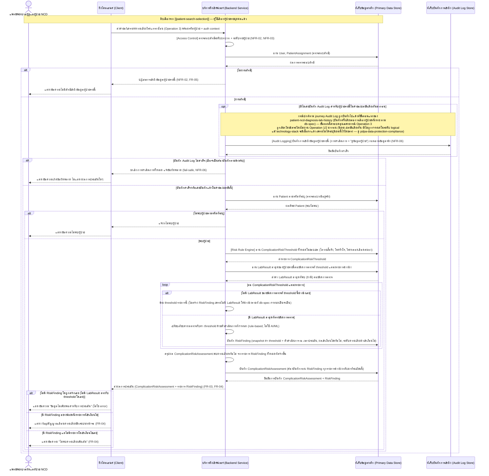
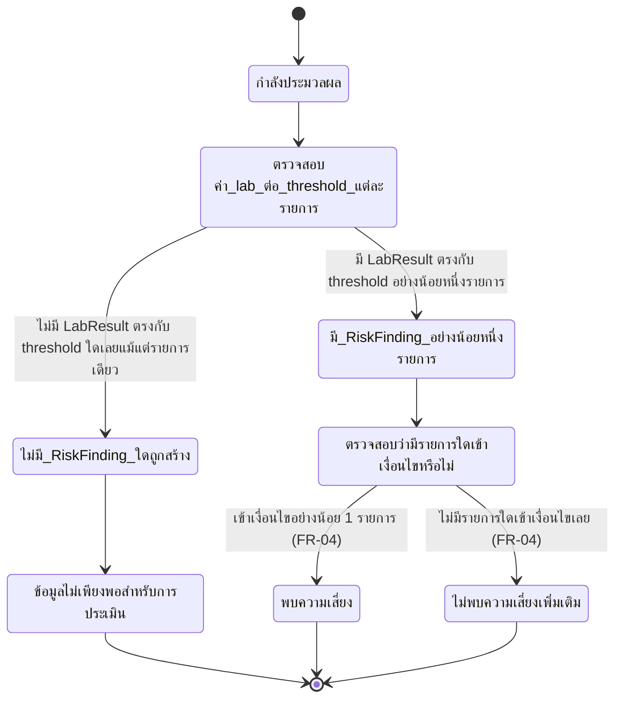

# Detailed Design — วิเคราะห์และแจ้งเตือนความเสี่ยงโรคแทรกซ้อน

เอกสารนี้อธิบายการออกแบบระดับ component (sequence flow, state transition, edge case) ของฟีเจอร์
[[feature-list#2. วิเคราะห์และแจ้งเตือนความเสี่ยงโรคแทรกซ้อน|2. วิเคราะห์และแจ้งเตือนความเสี่ยงโรคแทรกซ้อน]]
(FR-03, FR-04, NFR-01, NFR-02) ตาม journey ใน [[user-journey]] ขั้นตอนที่ 7–8 อ้างอิงสัญญาการทำงาน
จาก [[api-spec#Operation 3 — วิเคราะห์และแสดงผลความเสี่ยงโรคแทรกซ้อนของผู้ป่วย|Operation 3]] และ
[[api-spec#Operation ร่วม — บันทึกร่องรอยการเข้าถึงข้อมูลผู้ป่วย (Audit Logging)|Operation ร่วม — Audit Logging]]
(NFR-06 — รายละเอียดฟีเจอร์คุ้มครองข้อมูลส่วนบุคคลตาม PDPA โดยรวมอยู่ที่
[[pdpa-data-protection-compliance]]) และโมเดล
ข้อมูลจาก [[db-spec#ผลตรวจ lab (LabResult)|LabResult]],
[[db-spec#threshold มาตรฐานของโรคแทรกซ้อน (ComplicationRiskThreshold)|ComplicationRiskThreshold]],
[[db-spec#ผลการประเมินความเสี่ยงโรคแทรกซ้อน (ComplicationRiskAssessment)|ComplicationRiskAssessment]],
[[db-spec#รายละเอียดผลการประเมินต่อโรคแทรกซ้อน (RiskFinding)|RiskFinding]] และ
[[db-spec#บันทึกการเข้าถึงข้อมูล (AuditLogRecord)|AuditLogRecord]] ใน [[db-spec]]

**Precondition:** ฟีเจอร์นี้เริ่มทำงานได้ก็ต่อเมื่อผ่านฟีเจอร์
[[feature-list#3. ค้นหา/เลือกผู้ป่วยในความดูแล|3. ค้นหา/เลือกผู้ป่วยในความดูแล]] (เลือกผู้ป่วยแล้ว)
มาก่อนเสมอ และโดยทั่วไปเกิดต่อเนื่องจากการดูข้อมูลใน
[[feature-list#1. ดูประวัติการวินิจฉัยและผลตรวจ lab ของผู้ป่วย NCD|1. ดูประวัติการวินิจฉัยและผลตรวจ lab ของผู้ป่วย NCD]]
ตามลำดับใน [[user-journey]] (ไม่ใช่ precondition ทางเทคนิคที่ Operation 3 บังคับ แต่เป็นลำดับ UX ตาม
journey) — ดูรายละเอียดการตรวจสอบสิทธิ์ที่ [[patient-search-selection]]

**อัปเดต 2026-09-22 — เสริมรายละเอียดการ implement จริง:** `[[technology-stack]]` มีเนื้อหาแล้ว
Sequence Diagram ด้านล่างยังคงโครงสร้างเชิง logical เดิมไว้ครบทุกจุดและยังคงถูกต้องตามความเป็นจริง
เชิงเทคนิค (Operation 3 ผ่าน Cloud Functions จริงเสมอ ไม่มีเส้นทาง Client อ่าน Firestore ตรงแบบ
Operation 0) — ดูหัวข้อ "หมายเหตุการ Implement (จาก technology-stack)" ท้ายเอกสารสำหรับรายละเอียด
กลไกจริง ค่าตัวเลข threshold จริงยังไม่ถูกกำหนด (ดู
[[db-spec#ประเด็นรอตัดสินใจ|ประเด็นรอตัดสินใจใน db-spec]]) เอกสารนี้จึงอธิบายเฉพาะลำดับการประมวลผล
เชิง logical เท่านั้น ไม่ระบุค่าตัวเลขจริง

**อัปเดต 2026-09-22 (รอบสอง) — ตรวจสอบความสอดคล้องกับฟีเจอร์ที่ 5 (NFR-09–NFR-16):** ฟีเจอร์นี้เป็น
ไฟล์ที่ [[feature-list#5. รับประกันคุณภาพเชิงปฏิบัติการของระบบ (Performance, Availability, Clinical Safety, Session Security, Accessibility, Compatibility, Interoperability)|ฟีเจอร์ที่ 5]]
กระทบมากเป็นอันดับสองรองจาก [[patient-search-selection]] เพราะ Operation 3 คือจุดเดียวที่ NFR-11
(Clinical Safety Validation) และ NFR-13 (Accessibility — ห้ามใช้สีเป็นสัญญาณเดียว) ผูกอยู่โดยตรง — ดู
หัวข้อใหม่ [[#Cross-cutting: คุณภาพเชิงปฏิบัติการของระบบ (NFR-09–NFR-16)|Cross-cutting: คุณภาพเชิงปฏิบัติการของระบบ]]
ก่อนหัวข้อ Edge Case ด้านล่าง

**อัปเดต 2026-09-22 (รอบสาม) — ตรวจสอบความสอดคล้องกับ `[[technology-stack]]` ฉบับล่าสุด (decision area
11 — NFR-13 Accessibility):** ฉบับก่อนหน้าของหัวข้อ Cross-cutting NFR-13 และ "หมายเหตุการ Implement"
เคยเขียนว่า `[[technology-stack]]` "ไม่ได้ระบุ library/component เฉพาะเจาะจง" สำหรับการแสดงผล flag/
สัญญาณเตือน ซึ่งล้าสมัยแล้ว — ปรับปรุงให้อ้างอิงกลไกจริงที่ตัดสินใจแล้ว: มาตรฐาน **WCAG 2.1 Level AA** +
ไอคอน **Heroicons** (open-source, MIT) กำกับคู่กับสีทุกจุด + ตรวจสอบด้วย **Lighthouse Accessibility
Audit** ก่อน deploy ทุกครั้ง

## Sequence Diagram

## ตาราง Operation ↔ Entity ที่กระทบ

| ลำดับ | Operation | Entity ที่กระทบ | การกระทำ | หมายเหตุ |
| --- | --- | --- | --- | --- |
| 1 | [[api-spec#Operation ร่วม — ตรวจสอบสิทธิ์การเข้าถึงข้อมูลผู้ป่วย (Access Control)\|Operation ร่วม (role-level + patient-level)]] | [[db-spec#ผู้ใช้ (User)\|User]], [[db-spec#การมอบหมายผู้ป่วยในความดูแล (PatientAssignment)\|PatientAssignment]] | อ่าน | precondition ของ Operation 3 เสมอ |
| 2 | [[api-spec#Operation ร่วม — บันทึกร่องรอยการเข้าถึงข้อมูลผู้ป่วย (Audit Logging)\|Operation ร่วม — Audit Logging]] | [[db-spec#บันทึกการเข้าถึงข้อมูล (AuditLogRecord)\|AuditLogRecord]] | สร้าง (ถ้ายังไม่เคยบันทึกในคำขอ/เซสชันนี้) | ปกติบันทึกไปแล้วในขั้นตอนแรกของ [[patient-ncd-diagnosis-lab-history]] (ครั้งเดียวต่อการเลือกผู้ป่วยหนึ่งราย); ต้องสำเร็จก่อนอ่าน Patient/LabResult/ComplicationRiskThreshold เสมอถ้ายังไม่เคยบันทึก (fail-safe, NFR-06) — ดู [[pdpa-data-protection-compliance]] |
| 3 | [[api-spec#Operation 3 — วิเคราะห์และแสดงผลความเสี่ยงโรคแทรกซ้อนของผู้ป่วย\|Operation 3]] | [[db-spec#ผู้ป่วย (Patient)\|Patient]] | อ่าน | ตรวจสอบว่าผู้ป่วยตามรหัสมีอยู่จริง |
| 4 | [[api-spec#Operation 3 — วิเคราะห์และแสดงผลความเสี่ยงโรคแทรกซ้อนของผู้ป่วย\|Operation 3]] | [[db-spec#threshold มาตรฐานของโรคแทรกซ้อน (ComplicationRiskThreshold)\|ComplicationRiskThreshold]] | อ่าน | อ่านทั้งหมดในขอบเขต ก่อนไปอ่าน LabResult เพื่อทราบว่าต้องอ่านผลตรวจชนิดใดบ้าง |
| 5 | [[api-spec#Operation 3 — วิเคราะห์และแสดงผลความเสี่ยงโรคแทรกซ้อนของผู้ป่วย\|Operation 3]] | [[db-spec#ผลตรวจ lab (LabResult)\|LabResult]] | อ่าน | อ่านค่าล่าสุดต่อชนิดการตรวจที่ threshold แต่ละรายการอ้างอิง |
| 6 | [[api-spec#Operation 3 — วิเคราะห์และแสดงผลความเสี่ยงโรคแทรกซ้อนของผู้ป่วย\|Operation 3]] | [[db-spec#ผลการประเมินความเสี่ยงโรคแทรกซ้อน (ComplicationRiskAssessment)\|ComplicationRiskAssessment]] | สร้าง | **ต้องบันทึกก่อน** RiskFinding เสมอ (ลำดับ 7) เพราะ RiskFinding อ้างอิงกลับมาที่ระเบียนนี้เป็น field จำเป็น |
| 7 | [[api-spec#Operation 3 — วิเคราะห์และแสดงผลความเสี่ยงโรคแทรกซ้อนของผู้ป่วย\|Operation 3]] | [[db-spec#รายละเอียดผลการประเมินต่อโรคแทรกซ้อน (RiskFinding)\|RiskFinding]] | สร้าง | หนึ่งรายการต่อ threshold ที่มี LabResult ให้เปรียบเทียบได้จริงเท่านั้น (ดูหัวข้อ "การจัดประเภทผลลัพธ์" ด้านล่าง); แต่ละรายการ snapshot ค่า threshold + ตัวดำเนินการ ณ เวลาประเมิน แยกจากค่าปัจจุบันเสมอ |

## การจัดประเภทผลลัพธ์ 3 แบบของ Operation 3 (ออกแบบภายในโครงสร้างข้อมูลปัจจุบัน)

[[api-spec#Operation 3 — วิเคราะห์และแสดงผลความเสี่ยงโรคแทรกซ้อนของผู้ป่วย|Operation 3 ใน api-spec]]
ระบุผลลัพธ์ที่เป็นไปได้ 3 แบบ (พบความเสี่ยง / ไม่พบความเสี่ยงเพิ่มเติม / ข้อมูลไม่เพียงพอสำหรับการ
ประเมิน) แต่ [[db-spec#ผลการประเมินความเสี่ยงโรคแทรกซ้อน (ComplicationRiskAssessment)|ComplicationRiskAssessment]]
มี attribute บอกสถานะเพียงตัวเดียวคือ "พบความเสี่ยงหรือไม่" (จริง/เท็จ) ไม่มี field แยกสำหรับ
"ข้อมูลไม่เพียงพอ" โดยตรง เอกสารนี้จึงกำหนดกฎการจัดประเภทผลลัพธ์ที่ใช้โครงสร้างข้อมูลเดิมที่มีอยู่แล้ว
ใน [[db-spec]] ได้ครบ โดยไม่ต้องเพิ่ม entity/attribute ใหม่ (ไม่ใช่ gap ของ db-spec):

| ผลลัพธ์ | เงื่อนไขจากข้อมูลที่มีอยู่จริง |
| --- | --- |
| **ข้อมูลไม่เพียงพอสำหรับการประเมิน** | จำนวน RiskFinding ที่สร้างขึ้นทั้งหมดในการประเมินครั้งนี้ = 0 (ไม่มี LabResult ใดตรงกับ threshold ใดเลย จึงไม่มี RiskFinding รายการใดถูกสร้าง) — ComplicationRiskAssessment.พบความเสี่ยงหรือไม่ ยังคงบันทึกเป็น เท็จ (ค่า default เมื่อไม่มี RiskFinding ใดเข้าเงื่อนไข) |
| **ไม่พบความเสี่ยงเพิ่มเติม** | มี RiskFinding อย่างน้อย 1 รายการ (มีข้อมูลเพียงพอสำหรับประเมินอย่างน้อย 1 threshold) แต่ทุกรายการมี "เข้าเงื่อนไขความเสี่ยงหรือไม่" = เท็จ ทั้งหมด |
| **พบความเสี่ยง** | มี RiskFinding อย่างน้อย 1 รายการที่ "เข้าเงื่อนไขความเสี่ยงหรือไม่" = จริง — ComplicationRiskAssessment.พบความเสี่ยงหรือไม่ = จริง |

Client เป็นผู้แยกแยะ 3 กรณีนี้จากจำนวน/เนื้อหาของ RiskFinding ที่ได้รับกลับมาพร้อม
ComplicationRiskAssessment ในคำตอบเดียวกัน (Operation 3 คืนทั้งสองอย่างพร้อมกันเสมอตาม
[[api-spec#Operation 3 — วิเคราะห์และแสดงผลความเสี่ยงโรคแทรกซ้อนของผู้ป่วย|Operation 3]])

## State Diagram — สถานะผลลัพธ์ของการประเมินความเสี่ยงหนึ่งครั้ง

หมายเหตุ: state diagram นี้แสดงสถานะผลลัพธ์เชิงตรรกะของ**คำขอประเมินหนึ่งครั้ง** ไม่ใช่ status
attribute ที่บันทึกไว้ถาวรใน [[db-spec#ผลการประเมินความเสี่ยงโรคแทรกซ้อน (ComplicationRiskAssessment)|ComplicationRiskAssessment]]
โดยตรง (entity นี้ไม่มี attribute สถานะแบบ enum หลายค่า มีเพียง "พบความเสี่ยงหรือไม่" แบบจริง/เท็จ) —
การแยกแยะ "ข้อมูลไม่เพียงพอ" ออกจาก "ไม่พบความเสี่ยงเพิ่มเติม" ทำได้จากจำนวน RiskFinding ที่ผูกอยู่กับ
ComplicationRiskAssessment รายการนั้น ตามหัวข้อ "การจัดประเภทผลลัพธ์" ด้านบน

**หมายเหตุเทคโนโลยีจริง (Firestore field mapping):** "พบความเสี่ยงหรือไม่" ตรงกับ Firestore field
`hasRisk` (boolean) บนเอกสาร `complicationRiskAssessments/{assessmentId}` — state "พบความเสี่ยง" คือ
`hasRisk == true`; ทั้ง "ข้อมูลไม่เพียงพอสำหรับการประเมิน" และ "ไม่พบความเสี่ยงเพิ่มเติม" ต่างมีค่า
`hasRisk == false` เหมือนกัน **field เดียวไม่พอแยกสองกรณีนี้ได้** — Client ต้องตรวจสอบเพิ่มเติมว่า
subcollection `riskFindings` ของเอกสารนั้นมีจำนวนเอกสารเป็น 0 หรือไม่ (ว่าง = "ข้อมูลไม่เพียงพอ",
มีอย่างน้อย 1 รายการแต่ `isRiskMet` เป็น false ทั้งหมด = "ไม่พบความเสี่ยงเพิ่มเติม") ซึ่ง Operation 3
คืนค่า RiskFinding ทั้งหมดมาพร้อมกับ ComplicationRiskAssessment ในคำตอบเดียวกันอยู่แล้วตามที่
[[api-spec#Operation 3 — วิเคราะห์และแสดงผลความเสี่ยงโรคแทรกซ้อนของผู้ป่วย|Operation 3 ใน api-spec]]
ระบุไว้ ไม่ต้อง query เพิ่มเติมฝั่ง Client

## ข้อกำหนด: การจำกัด/ล้างข้อมูลผู้ป่วยที่ละเอียดอ่อนฝั่ง Client (NFR-02)

ตามหลักการที่กำหนดไว้ใน
[[patient-search-selection#ข้อกำหนด: การจำกัด/ล้างข้อมูลผู้ป่วยที่ละเอียดอ่อนฝั่ง Client (NFR-02)|patient-search-selection]]
และ [[architecture#ตาราง Mapping NFR ไปยัง Component|architecture — ตาราง Mapping NFR (แถว NFR-02)]] —
ผลการประเมินความเสี่ยงโรคแทรกซ้อน (ComplicationRiskAssessment + RiskFinding) ที่ Operation 3 ส่งให้
Client แสดงเป็นข้อมูลสุขภาพที่ละเอียดอ่อนของผู้ป่วยรายที่เลือกไว้เท่านั้น Client ต้องไม่แสดง/cache ผล
การประเมิน/flag เตือนความเสี่ยงไว้เกินความจำเป็น: เมื่อผู้ใช้ออกจากหน้าจอนี้กลับไปเลือกผู้ป่วยรายอื่น
ผ่าน [[patient-search-selection]] หรือออกจากระบบ Client ต้องล้าง flag/สัญญาณเตือนและผลการประเมินของ
ผู้ป่วยรายเดิมที่เคยแสดงไว้ทันที ก่อนแสดงผลของผู้ป่วยรายใหม่ (ถ้ามี) หรือกลับสู่หน้าจอเข้าสู่ระบบ

## Cross-cutting: คุณภาพเชิงปฏิบัติการของระบบ (NFR-09–NFR-16)

เช่นเดียวกับที่ [[patient-search-selection#Cross-cutting: คุณภาพเชิงปฏิบัติการของระบบ (NFR-09–NFR-16)|patient-search-selection]]
อธิบายไว้ [[feature-list#5. รับประกันคุณภาพเชิงปฏิบัติการของระบบ (Performance, Availability, Clinical Safety, Session Security, Accessibility, Compatibility, Interoperability)|ฟีเจอร์ที่ 5]]
ไม่ต้องการ operation/component ใหม่ ฟีเจอร์นี้จึงไม่มี sequence/state diagram แยกสำหรับฟีเจอร์ที่ 5 —
บันทึกเฉพาะผลกระทบต่อ sequence/state diagram ที่มีอยู่แล้วด้านบน:

- **Clinical Safety Validation (NFR-11):** [[db-spec#threshold มาตรฐานของโรคแทรกซ้อน (ComplicationRiskThreshold)|ComplicationRiskThreshold]]
  ที่ Operation 3 อ่านมาเปรียบเทียบ (ลำดับ 4 ในตารางด้านบน) ต้องผ่านการยืนยันจากแพทย์ผู้เชี่ยวชาญ
  ก่อน deploy ใช้งานจริงเสมอตาม
  [[architecture#บริการฝั่งเซิร์ฟเวอร์ (Backend Service)|หัวข้อ Risk Rule Engine ใน architecture]] —
  เป็น**กระบวนการเชิงองค์กร (deployment approval gate) ที่เกิดขึ้นนอกระบบก่อน deploy โค้ด** ไม่ใช่
  behavior ที่ sequence diagram ด้านบนต้องแสดงเป็น step ใดๆ (ไม่มี input/output/กฎทางธุรกิจใหม่ใน
  Operation 3 สำหรับข้อนี้ — สอดคล้องกับที่ [[api-spec]] ระบุไว้แล้ว)
- **Accessibility (NFR-13) — กลไกจริงตัดสินใจแล้ว:** field
  [[db-spec#รายละเอียดผลการประเมินต่อโรคแทรกซ้อน (RiskFinding)|RiskFinding.ระดับความเสี่ยงที่ประเมินได้]]
  ที่ Operation 3 คืนกลับมาพร้อม ComplicationRiskAssessment (ดู sequence diagram ขั้นตอน
  `Backend-->>Client: ส่งผลการประเมิน`) เป็นค่าข้อความที่กำหนดไว้ล่วงหน้าอยู่แล้ว (ไม่ใช่สี/รหัสตัวเลข)
  จึงมีข้อความกำกับพร้อมใช้งานให้ Client แสดงคู่กับสี/ไอคอนของ flag/สัญญาณเตือนได้ทันที (ขั้นตอน
  `Client-->>User: แสดง flag/สัญญาณเตือนความเสี่ยงชัดเจนบนหน้าจอ` ในเอกสารนี้) โดยไม่ต้องเพิ่ม field
  ใหม่ — **ห้ามใช้สีเป็นสัญญาณเดียวในการสื่อความหมาย** ตาม
  [[technology-stack#11. Design Token/Icon Library สำหรับ Accessibility (NFR-13) — WCAG 2.1 Level AA + Heroicons + Lighthouse|
  decision area 11 ใน technology-stack]] มาตรฐาน **WCAG 2.1 Level AA** (contrast ratio ≥ 4.5:1
  ข้อความปกติ, ≥ 3:1 ข้อความขนาดใหญ่/UI component) กำกับ design token สีของแต่ละระดับความเสี่ยงใน
  [[DESIGN]] และใช้ **Heroicons** (open-source, MIT license) เป็นชุดไอคอนมาตรฐานที่ต้องแสดงคู่กับสีของ
  flag/สัญญาณเตือนทุกจุดในเอกสารนี้เสมอ ตรวจสอบด้วย **Lighthouse Accessibility Audit** ก่อน deploy ทุก
  ครั้ง — รายละเอียด mapping สี/ไอคอนเฉพาะระดับความเสี่ยง (เช่น ไอคอนใดคู่กับระดับใด) ยังเป็นหน้าที่ของ
  [[DESIGN]] ที่การออกแบบ prototype ต้องยึดตาม ไม่ใช่ของเอกสารนี้ (เอกสารนี้ยืนยันเพียงว่ามีข้อความ/field
  พร้อมใช้งานให้ [[DESIGN]] นำไปจับคู่กับ Heroicons ได้ครบทุกระดับความเสี่ยง)
- **Performance < 2 วินาที (NFR-09):** Operation 3 ต้องตอบสนองภายในเวลานี้ — composite index
  `(labTestType ASC)` และ `(patientId ASC, testType ASC, testedAt DESC)` ที่ระบุไว้แล้วในหัวข้อ
  "หมายเหตุการ Implement" ด้านล่างคือกลไกหลักที่รองรับข้อกำหนดนี้ (ดู
  [[db-spec#คุณสมบัติร่วม (Cross-cutting Property) — Performance/Index Design (NFR-09)|db-spec]])
- **Session Timeout (NFR-12):** การตรวจสอบสิทธิ์ระดับบทบาท + ระดับรายผู้ป่วย (ลำดับ 1 ในตารางด้านบน)
  เป็นจุดเดียวกันที่ปฏิเสธคำขอ Operation 3 ได้ทันทีหากผู้ใช้ถูก auto-logout ไปแล้ว เช่นเดียวกับที่
  [[patient-search-selection]] และ [[patient-ncd-diagnosis-lab-history]] อธิบายไว้ (ไม่มี step ใหม่
  ในเอกสารนี้)
- **Security Rules Verification (NFR-14):** Firestore Security Rules ของ `complicationRiskThresholds`
  และ `complicationRiskAssessments` (+ subcollection `riskFindings`) (`allow read, write: if false;`
  สำหรับ Client ทั้งหมด) ต้องอยู่ในชุด automated test ผ่าน Firebase Emulator Suite เช่นกัน (ดู
  [[db-spec#คุณสมบัติร่วม (Cross-cutting Property) — Security Rules Verification (NFR-14)|db-spec]])
- **Browser/Device Compatibility (NFR-15):** หน้าจอแสดง flag/สัญญาณเตือนความเสี่ยงต้องแสดงผลถูกต้อง
  (รวมถึงสี/ไอคอน/ข้อความกำกับตาม NFR-13) บน browser หลักเวอร์ชันล่าสุด (Chrome/Edge/Firefox) บน
  desktop/tablet เช่นเดียวกับทุกหน้าจอในระบบ
- **Availability (NFR-10), Interoperability (NFR-16):** ไม่กระทบฟีเจอร์นี้โดยตรง — เป็นคุณสมบัติระดับ
  infrastructure/อนาคตที่ไม่ผูกกับ operation ใด (ดู
  [[architecture#Cross-cutting: คุณภาพเชิงปฏิบัติการของระบบ (NFR-09–NFR-16)|architecture]])

## Edge Case และวิธีจัดการ

| Edge Case | วิธีจัดการ | อ้างอิง |
| --- | --- | --- |
| ไม่มีสิทธิ์เข้าถึง (บทบาทไม่ถูกต้อง หรือผู้ป่วยรายนี้ไม่ได้อยู่ในความดูแลของผู้ใช้ตาม PatientAssignment) | ปฏิเสธการเข้าถึงข้อมูลผู้ป่วยรายนี้ ก่อนอ่าน LabResult/ComplicationRiskThreshold ใดๆ | [[backlog#Non-Functional Requirements\|NFR-02]], [[backlog#สูง (MVP)\|FR-05]] |
| ผู้ใช้ถูก auto-logout เนื่องจากไม่มีการใช้งาน (inactivity) เกิน 30 นาที (NFR-12) แล้วส่งคำขอ Operation 3 โดยไม่มี auth context ที่ถูกต้องแนบมา | ปฏิเสธการเข้าถึงที่ step ตรวจสอบสิทธิ์เช่นเดียวกับกรณีไม่มีสิทธิ์เข้าถึงข้างต้น — Client นำผู้ใช้กลับไปหน้าจอเข้าสู่ระบบใหม่ | [[backlog#Non-Functional Requirements\|NFR-12]] |
| threshold/rule ที่ใช้ในการประเมินยังไม่ผ่านการยืนยันจากแพทย์ผู้เชี่ยวชาญก่อน deploy (NFR-11) | ไม่ deploy โค้ด Risk Rule Engine ที่มี rule ใหม่/แก้ไข จนกว่าจะผ่านการยืนยัน — เป็นกระบวนการเชิงองค์กร (approval gate) นอกขอบเขตของ sequence diagram/edge case ที่ระบบต้อง implement เป็น behavior ขณะรันจริง | [[backlog#Non-Functional Requirements\|NFR-11]] |
| flag/สัญญาณเตือนความเสี่ยงแสดงด้วยสีเพียงอย่างเดียวโดยไม่มีข้อความกำกับ (ความเสี่ยงด้าน Accessibility) | ต้องไม่เกิดขึ้น — Client ต้องแสดงข้อความระดับความเสี่ยง (จาก RiskFinding.ระดับความเสี่ยงที่ประเมินได้) คู่กับสี + ไอคอน **Heroicons** เสมอตาม WCAG 2.1 AA (NFR-13) ตรวจสอบด้วย **Lighthouse Accessibility Audit** ก่อน deploy ทุกครั้ง (เป็นส่วนหนึ่งของการรีวิว UI ตาม [[DESIGN]]) | [[backlog#Non-Functional Requirements\|NFR-13]], [[technology-stack#11. Design Token/Icon Library สำหรับ Accessibility (NFR-13) — WCAG 2.1 Level AA + Heroicons + Lighthouse\|technology-stack decision area 11]] |
| บันทึก Audit Log ไม่สำเร็จ (เฉพาะกรณียังไม่เคยบันทึกในคำขอ/เซสชันนี้) | ยกเลิกการดำเนินการทั้งหมด (ไม่อ่าน Patient/LabResult/ComplicationRiskThreshold) แจ้งข้อผิดพลาดแก่ผู้ใช้ (fail-safe) | [[backlog#Non-Functional Requirements\|NFR-06]], [[api-spec#Operation ร่วม — บันทึกร่องรอยการเข้าถึงข้อมูลผู้ป่วย (Audit Logging)\|Operation ร่วม — Audit Logging]] |
| ไม่พบผู้ป่วยตามรหัสที่ระบุ | แจ้งว่าไม่พบผู้ป่วย หยุดก่อนเริ่มประมวลผล Risk Rule Engine | [[db-spec#ผู้ป่วย (Patient)\|Patient]] |
| ไม่พบผลตรวจ lab ที่เพียงพอสำหรับประเมิน rule ใดๆ เลย | ไม่สร้าง RiskFinding ใดๆ, บันทึก ComplicationRiskAssessment.พบความเสี่ยงหรือไม่ = เท็จ, Client แสดงข้อความ "ข้อมูลไม่เพียงพอสำหรับการประเมิน" (ไม่ใช่ error) ตามการจัดประเภทผลลัพธ์ด้านบน | [[api-spec#Operation 3 — วิเคราะห์และแสดงผลความเสี่ยงโรคแทรกซ้อนของผู้ป่วย\|Operation 3]] |
| ไม่พบความเสี่ยงเลยแม้มีข้อมูลเพียงพอ | บันทึก RiskFinding ทุกรายการที่ประเมินได้ (เข้าเงื่อนไขหรือไม่ = เท็จทั้งหมด), ComplicationRiskAssessment.พบความเสี่ยงหรือไม่ = เท็จ, Client แสดงข้อความ "ไม่พบความเสี่ยงเพิ่มเติม" อย่างชัดเจน ไม่ใช่ error | [[user-journey]], [[api-spec#Operation 3 — วิเคราะห์และแสดงผลความเสี่ยงโรคแทรกซ้อนของผู้ป่วย\|Operation 3]] |
| มี LabResult มากกว่า 1 ค่าสำหรับชนิดการตรวจเดียวกัน (หลายวันที่ตรวจ) | ใช้ค่า LabResult ที่มี "วันที่ตรวจ" ล่าสุดเท่านั้นในการเปรียบเทียบกับ threshold แต่ละรายการ ตามกฎ "ประมวลผลค่าผลตรวจ lab ล่าสุด" | [[api-spec#Operation 3 — วิเคราะห์และแสดงผลความเสี่ยงโรคแทรกซ้อนของผู้ป่วย\|Operation 3]] |
| ผู้ใช้ออกจากหน้าจอนี้เพื่อเลือกผู้ป่วยรายอื่น หรือออกจากระบบ (logout)/session สิ้นสุด | Client ล้าง flag/สัญญาณเตือนและผลการประเมินความเสี่ยงของผู้ป่วยรายเดิมที่เคยแสดงไว้ทันที ไม่เก็บ/cache ไว้เกินความจำเป็น (NFR-02) | [[architecture#ตาราง Mapping NFR ไปยัง Component\|architecture — ตาราง Mapping NFR แถว NFR-02]] |

## หมายเหตุการ Implement (จาก technology-stack)

- **Cloud Function จริง:** HTTPS Callable Function ชื่อ **`assessComplicationRisk`** (Cloud
  Functions 2nd gen, Node.js + TypeScript) ตาม
  [[api-spec#Operation 3 — วิเคราะห์และแสดงผลความเสี่ยงโรคแทรกซ้อนของผู้ป่วย|Technical Binding ของ Operation 3 ใน api-spec]]
- **การอ่านข้อมูล (ลำดับ 4-5 ในตารางด้านบน):** อ่าน `complicationRiskThresholds` ด้วย composite
  index `(labTestType ASC)` แล้วอ่าน `labResults` ด้วย composite index `(patientId ASC, testType
  ASC, testedAt DESC)` เพื่อดึงค่าล่าสุดต่อชนิดการตรวจ ทั้งคู่ผ่าน Firebase Admin SDK
- **การเขียนผลลัพธ์ (ลำดับ 6-7):** เขียน `complicationRiskAssessments/{assessmentId}` ก่อนเสมอ
  แล้วเขียน subcollection `complicationRiskAssessments/{assessmentId}/riskFindings/{riskFindingId}`
  ตาม [[db-spec#รายละเอียดผลการประเมินต่อโรคแทรกซ้อน (RiskFinding)|Firestore Technical Binding ของ
  RiskFinding ใน db-spec]] — `RiskFinding` ไม่ต้องมี field อ้างอิงกลับไป ComplicationRiskAssessment
  แยกต่างหาก เพราะ parent document ID ในเส้นทาง subcollection ทำหน้าที่นี้อยู่แล้ว; logic
  เปรียบเทียบ threshold เขียนเป็นโค้ด TypeScript โดยตรง ไม่ใช้ Firestore Security Rules สำหรับส่วนนี้
  (ชัดเจน/unit test ได้ง่ายกว่า)
- **การตรวจสอบสิทธิ์ + Audit Logging (ลำดับ 1-2):** กลไกเดียวกับที่อธิบายไว้ใน
  [[patient-ncd-diagnosis-lab-history#หมายเหตุการ Implement (จาก technology-stack)|patient-ncd-diagnosis-lab-history]]
  (shared helper module ใน Cloud Functions + เขียน `auditLogRecords` ผ่าน Admin SDK)
- **Error code จริง:** ปฏิเสธการเข้าถึง → `permission-denied`; ไม่พบผู้ป่วย → `not-found`; บันทึก
  Audit Log ไม่สำเร็จ → `internal`
- **Clinical Safety Validation (NFR-11):** `[[technology-stack]]` ระบุชัดเจนว่าเป็นกระบวนการเชิง
  องค์กร (manual approval gate ก่อน deploy Cloud Function ของ Risk Rule Engine) ไม่ใช่กลไกทางเทคนิค
  ที่มีชื่อเทคโนโลยีให้ระบุ — ไม่มีรายละเอียด implement เพิ่มเติมสำหรับข้อนี้
- **Accessibility (NFR-13) — กลไกจริงตัดสินใจแล้ว:**
  [[technology-stack#11. Design Token/Icon Library สำหรับ Accessibility (NFR-13) — WCAG 2.1 Level AA + Heroicons + Lighthouse|
  decision area 11 ใน technology-stack]] ระบุกลไกจริงไว้ชัดเจนแล้ว (ไม่ใช่ "ไม่ได้ระบุ library เฉพาะ
  เจาะจง" ตามฉบับก่อนหน้าของหัวข้อนี้อีกต่อไป): มาตรฐาน **WCAG 2.1 Level AA** เป็นเป้าหมายของทุก design
  token สีที่ใช้แสดงระดับความเสี่ยงใน [[DESIGN]], ใช้ **Heroicons** (open-source, MIT license, พัฒนา
  โดยทีม Tailwind CSS) เป็นชุดไอคอนมาตรฐานที่ต้องกำกับคู่กับสีทุกจุดที่แสดง flag/สัญญาณเตือนความเสี่ยง
  (FR-04) ในหน้าจอที่พัฒนาต่อไปด้วย React + TypeScript และตรวจสอบด้วย **Lighthouse Accessibility
  Audit** (built-in Chrome DevTools) ก่อน deploy ทุกครั้ง — รายละเอียด mapping ไอคอนเฉพาะระดับความเสี่ยง
  (เช่น ไอคอนใดคู่กับระดับใด) เป็นหน้าที่ของ [[DESIGN]] ต่อไป ไม่ใช่ของเอกสารนี้

## เอกสารที่เกี่ยวข้อง

- [[api-spec]]
- [[db-spec]]
- [[architecture]]
- [[technology-stack]]
- [[feature-list]]
- [[user-journey]]
- [[patient-search-selection]]
- [[patient-ncd-diagnosis-lab-history]]
- [[pdpa-data-protection-compliance]]
- [[20260922-01-operational-quality-nfr]]
