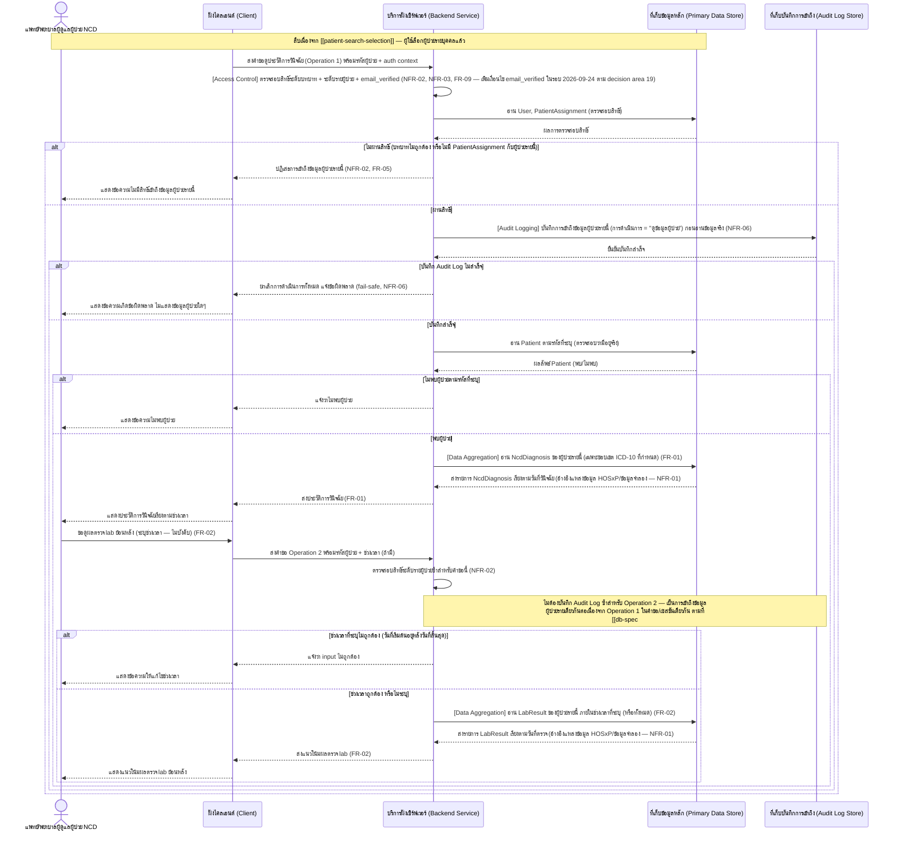

# Detailed Design — ดูประวัติการวินิจฉัยและผลตรวจ lab ของผู้ป่วย NCD

เอกสารนี้อธิบายการออกแบบระดับ component (sequence flow, edge case) ของฟีเจอร์
[[feature-list#1. ดูประวัติการวินิจฉัยและผลตรวจ lab ของผู้ป่วย NCD|1. ดูประวัติการวินิจฉัยและผลตรวจ lab ของผู้ป่วย NCD]]
(FR-01, FR-02, NFR-01, NFR-02) ตาม journey ใน [[user-journey]] ขั้นตอนที่ 5–6 อ้างอิงสัญญาการทำงาน
จาก [[api-spec#Operation 1 — ดึงประวัติการวินิจฉัยโรค NCD ของผู้ป่วย|Operation 1]],
[[api-spec#Operation 2 — ดึงผลตรวจ lab ย้อนหลังของผู้ป่วย|Operation 2]] และ
[[api-spec#Operation ร่วม — บันทึกร่องรอยการเข้าถึงข้อมูลผู้ป่วย (Audit Logging)|Operation ร่วม — Audit Logging]]
(NFR-06 — รายละเอียดฟีเจอร์คุ้มครองข้อมูลส่วนบุคคลตาม PDPA โดยรวมอยู่ที่
[[pdpa-data-protection-compliance]]) และโมเดลข้อมูลจาก
[[db-spec#ประวัติการวินิจฉัยโรค NCD (NcdDiagnosis)|NcdDiagnosis]],
[[db-spec#ผลตรวจ lab (LabResult)|LabResult]] และ
[[db-spec#บันทึกการเข้าถึงข้อมูล (AuditLogRecord)|AuditLogRecord]] ใน [[db-spec]]

**Precondition:** ฟีเจอร์นี้เริ่มทำงานได้ก็ต่อเมื่อผ่านฟีเจอร์
[[feature-list#3. ค้นหา/เลือกผู้ป่วยในความดูแล|3. ค้นหา/เลือกผู้ป่วยในความดูแล]] มาก่อนเสมอ (เลือก
ผู้ป่วยรายบุคคลแล้ว) — ดูรายละเอียดการตรวจสอบสิทธิ์ระดับบทบาทและการเลือกผู้ป่วยที่
[[patient-search-selection]] เอกสารนี้กล่าวถึงเฉพาะขั้นตอนการตรวจสอบสิทธิ์ระดับรายผู้ป่วย
(patient-level) ที่ต้องทำซ้ำก่อนเข้าถึงข้อมูลรายบุคคลของ Operation 1/2 เท่านั้น

**อัปเดต 2026-09-22 — เสริมรายละเอียดการ implement จริง:** `[[technology-stack]]` มีเนื้อหาแล้ว
Sequence Diagram ด้านล่างยังคงโครงสร้างเชิง logical เดิมไว้ครบทุกจุดและ**ยังคงถูกต้องตามความเป็นจริง
เชิงเทคนิค** (ต่างจาก Operation 0 ใน [[patient-search-selection]]) เพราะ Operation 1 และ Operation 2
ทั้งคู่ผ่าน Cloud Functions จริง ("Backend Service" ในไดอะแกรมนี้มีตัวตนจริงเป็น Cloud Functions
เสมอ) ตาม [[technology-stack#3. สถาปัตยกรรม Backend Service — Firebase-native (ไม่มี Backend Service แยกแบบดั้งเดิม)|decision area 3 ใน technology-stack]]
— ดูหัวข้อ "หมายเหตุการ Implement (จาก technology-stack)" ท้ายเอกสารสำหรับรายละเอียดกลไกจริง

**อัปเดต 2026-09-23 — ตรวจสอบความสอดคล้องกับฟีเจอร์ที่ 6 (Authentication):** ตรวจสอบแล้วว่า
**ไม่กระทบเอกสารนี้** — การเปลี่ยน `บทบาท` เป็นไม่บังคับใน [[db-spec#ผู้ใช้ (User)|User]] ไม่ทำให้
"ตรวจสอบสิทธิ์ระดับบทบาท + ระดับรายผู้ป่วย" ในลำดับ 1 ของตารางด้านล่างต้องเพิ่มเงื่อนไขใหม่ (บัญชีที่
ยังไม่มี `role` ไม่ผ่านการตรวจสอบนี้อยู่แล้วโดยอัตโนมัติ) ดูรายละเอียดที่
[[user-authentication-email-password]] ซึ่งเป็น precondition ก่อนฟีเจอร์นี้ทั้งหมด

**อัปเดต 2026-09-22 (รอบสอง) — ตรวจสอบความสอดคล้องกับฟีเจอร์ที่ 5 (NFR-09–NFR-16):** ดูหัวข้อใหม่
[[#Cross-cutting: คุณภาพเชิงปฏิบัติการของระบบ (NFR-09–NFR-16)|Cross-cutting: คุณภาพเชิงปฏิบัติการของระบบ]]
ก่อนหัวข้อ Edge Case ด้านล่าง สำหรับผลกระทบของ
[[feature-list#5. รับประกันคุณภาพเชิงปฏิบัติการของระบบ (Performance, Availability, Clinical Safety, Session Security, Accessibility, Compatibility, Interoperability)|ฟีเจอร์ที่ 5]]
ต่อฟีเจอร์นี้ (ไม่มี operation/entity ใหม่ เช่นเดียวกับที่ [[api-spec]]/[[db-spec]]/[[architecture]] ระบุไว้)

## Sequence Diagram

Operation 1 และ Operation 2 เป็น operation อ่านข้อมูลอิสระจากกัน (ไม่มีลำดับก่อน-หลังบังคับระหว่างกัน)
แต่ทั้งคู่ต้องผ่านการตรวจสอบสิทธิ์ระดับรายผู้ป่วยก่อนเสมอ ไดอะแกรมด้านล่างแสดงทั้งสอง operation
ตามลำดับที่ปรากฏใน [[user-journey]] (ดูประวัติวินิจฉัยก่อน แล้วจึงดูผล lab):

## ตาราง Operation ↔ Entity ที่กระทบ

| ลำดับ | Operation | Entity ที่กระทบ | การกระทำ | หมายเหตุ |
| --- | --- | --- | --- | --- |
| 1 | [[api-spec#Operation ร่วม — ตรวจสอบสิทธิ์การเข้าถึงข้อมูลผู้ป่วย (Access Control)\|Operation ร่วม (role-level + patient-level)]] | [[db-spec#ผู้ใช้ (User)\|User]], [[db-spec#การมอบหมายผู้ป่วยในความดูแล (PatientAssignment)\|PatientAssignment]] | อ่าน | precondition ของทั้ง Operation 1 และ Operation 2 เสมอ — ต้องทำก่อนเข้าถึง Patient/NcdDiagnosis/LabResult ทุกครั้ง |
| 2 | [[api-spec#Operation ร่วม — บันทึกร่องรอยการเข้าถึงข้อมูลผู้ป่วย (Audit Logging)\|Operation ร่วม — Audit Logging]] | [[db-spec#บันทึกการเข้าถึงข้อมูล (AuditLogRecord)\|AuditLogRecord]] | สร้าง | ต้องสำเร็จก่อนอ่าน Patient/NcdDiagnosis/LabResult ใดๆ เสมอ (fail-safe, NFR-06); บันทึกครั้งเดียวครอบคลุมทั้ง Operation 1 และ Operation 2 ในคำขอ/เซสชันเดียวกัน (ดู [[pdpa-data-protection-compliance]]) |
| 3 | [[api-spec#Operation 1 — ดึงประวัติการวินิจฉัยโรค NCD ของผู้ป่วย\|Operation 1]] | [[db-spec#ผู้ป่วย (Patient)\|Patient]] | อ่าน | ตรวจสอบว่าผู้ป่วยตามรหัสมีอยู่จริง ก่อนอ่าน NcdDiagnosis |
| 4 | [[api-spec#Operation 1 — ดึงประวัติการวินิจฉัยโรค NCD ของผู้ป่วย\|Operation 1]] | [[db-spec#ประวัติการวินิจฉัยโรค NCD (NcdDiagnosis)\|NcdDiagnosis]] | อ่าน | เฉพาะรหัส ICD-10 ในขอบเขต (E10–E14, I10–I14, J44) เรียงตามวันที่วินิจฉัย |
| 5 | [[api-spec#Operation 2 — ดึงผลตรวจ lab ย้อนหลังของผู้ป่วย\|Operation 2]] | [[db-spec#ผู้ป่วย (Patient)\|Patient]] | อ่าน | ตรวจสอบว่าผู้ป่วยตามรหัสมีอยู่จริง ก่อนอ่าน LabResult |
| 6 | [[api-spec#Operation 2 — ดึงผลตรวจ lab ย้อนหลังของผู้ป่วย\|Operation 2]] | [[db-spec#ผลตรวจ lab (LabResult)\|LabResult]] | อ่าน | กรองตามช่วงเวลาถ้าระบุ เรียงตามวันที่ตรวจเพื่อเห็นแนวโน้ม |

## ข้อกำหนด: การจำกัด/ล้างข้อมูลผู้ป่วยที่ละเอียดอ่อนฝั่ง Client (NFR-02)

ตามหลักการที่กำหนดไว้ใน
[[patient-search-selection#ข้อกำหนด: การจำกัด/ล้างข้อมูลผู้ป่วยที่ละเอียดอ่อนฝั่ง Client (NFR-02)|patient-search-selection]]
และ [[architecture#ตาราง Mapping NFR ไปยัง Component|architecture — ตาราง Mapping NFR (แถว NFR-02)]] —
ประวัติการวินิจฉัย (FR-01) และแนวโน้มผลตรวจ lab (FR-02) ที่ Operation 1/2 ส่งให้ Client แสดงเป็นข้อมูล
สุขภาพที่ละเอียดอ่อนของผู้ป่วยรายที่เลือกไว้เท่านั้น Client ต้องไม่แสดง/cache ข้อมูลเหล่านี้ไว้เกินความ
จำเป็น: เมื่อผู้ใช้ออกจากหน้าจอนี้กลับไปเลือกผู้ป่วยรายอื่นผ่าน [[patient-search-selection]] หรือออกจาก
ระบบ Client ต้องล้างประวัติวินิจฉัย/ผล lab ของผู้ป่วยรายเดิมที่เคยแสดงไว้ทันที ก่อนแสดงข้อมูลของผู้ป่วย
รายใหม่ (ถ้ามี) หรือกลับสู่หน้าจอเข้าสู่ระบบ

## State Transition

ฟีเจอร์นี้**ไม่มีการสร้าง/แก้ไข/ลบ entity ใดๆ** (Operation 1 และ Operation 2 เป็น read-only ทั้งคู่
ตาม [[api-spec]]) จึงไม่มีสถานะของข้อมูลที่เปลี่ยนแปลงให้ต้องออกแบบ State Diagram ในฟีเจอร์นี้
— ข้อมูล NcdDiagnosis/LabResult ที่แสดงผลไหลเข้ามาจากแหล่งข้อมูลภายนอก (HOSxP หรือข้อมูลจำลอง) ตาม
[[backlog#Non-Functional Requirements|NFR-01]] ไม่ใช่ข้อมูลที่ระบบนี้สร้าง/แก้ไขเอง

## Cross-cutting: คุณภาพเชิงปฏิบัติการของระบบ (NFR-09–NFR-16)

เช่นเดียวกับที่ [[patient-search-selection#Cross-cutting: คุณภาพเชิงปฏิบัติการของระบบ (NFR-09–NFR-16)|patient-search-selection]]
อธิบายไว้ [[feature-list#5. รับประกันคุณภาพเชิงปฏิบัติการของระบบ (Performance, Availability, Clinical Safety, Session Security, Accessibility, Compatibility, Interoperability)|ฟีเจอร์ที่ 5]]
ไม่ต้องการ operation/component ใหม่ ฟีเจอร์นี้จึงไม่มี sequence/state diagram แยกสำหรับฟีเจอร์ที่ 5 —
บันทึกเฉพาะผลกระทบต่อ sequence diagram ที่มีอยู่แล้วด้านบน:

- **Session Timeout (NFR-12):** การตรวจสอบสิทธิ์ระดับบทบาท + ระดับรายผู้ป่วย (ลำดับ 1 ในตารางด้านบน)
  เป็นจุดเดียวกันที่ปฏิเสธคำขอ Operation 1/2 ได้ทันทีหากผู้ใช้ถูก auto-logout ไปแล้วจากการ idle เกิน
  30 นาทีตามที่ [[patient-search-selection]] อธิบายไว้ (ไม่มี step ใหม่ในเอกสารนี้ — กลไกเดียวกับที่
  Operation ร่วม Access Control บังคับใช้อยู่แล้ว)
- **Performance < 2 วินาที (NFR-09):** Operation 1 และ Operation 2 ต้องตอบสนองภายในเวลานี้ —
  composite index `(patientId ASC, diagnosedAt DESC)` (Operation 1) และ `(patientId ASC, testedAt
  DESC)` (Operation 2) ที่ระบุไว้แล้วในหัวข้อ "หมายเหตุการ Implement" ด้านล่างคือกลไกหลักที่รองรับ
  ข้อกำหนดนี้ (ดู [[db-spec#คุณสมบัติร่วม (Cross-cutting Property) — Performance/Index Design (NFR-09)|db-spec]])
- **Security Rules Verification (NFR-14):** แม้ Operation 1/2 ทั้งคู่ผ่าน Cloud Functions (ไม่ใช่
  Client อ่าน Firestore ตรงแบบ Operation 0) แต่ Firestore Security Rules ของ collection
  `ncdDiagnoses`/`labResults` (`allow read, write: if false;` สำหรับ Client ทั้งหมด) ก็ยังต้องอยู่ใน
  ชุด automated test ผ่าน Firebase Emulator Suite ด้วยเช่นกัน เพื่อยืนยันว่า Client ไม่สามารถข้าม
  Cloud Functions (และการบันทึก Audit Log แบบ fail-safe) ไปอ่านข้อมูลตรงได้ (ดู
  [[db-spec#คุณสมบัติร่วม (Cross-cutting Property) — Security Rules Verification (NFR-14)|db-spec]])
- **Browser/Device Compatibility (NFR-15):** หน้าจอประวัติวินิจฉัย/ผลตรวจ lab ต้องแสดงผลถูกต้องบน
  browser หลักเวอร์ชันล่าสุด (Chrome/Edge/Firefox) บน desktop/tablet เช่นเดียวกับทุกหน้าจอในระบบ
- **Availability (NFR-10), Clinical Safety Validation (NFR-11), Accessibility (NFR-13),
  Interoperability (NFR-16):** ไม่กระทบฟีเจอร์นี้โดยตรง — NFR-11/NFR-13 กระทบเฉพาะ Operation 3 (ดู
  [[complication-risk-analysis-alert]]), NFR-10/NFR-16 เป็นคุณสมบัติระดับ infrastructure/อนาคตที่ไม่
  ผูกกับ operation ใด

## Edge Case และวิธีจัดการ

| Edge Case | วิธีจัดการ | อ้างอิง |
| --- | --- | --- |
| ไม่มีสิทธิ์เข้าถึง (บทบาทไม่ถูกต้อง หรือผู้ป่วยรายนี้ไม่ได้อยู่ในความดูแลของผู้ใช้ตาม PatientAssignment หรือ `email_verified` เป็นเท็จ) | ปฏิเสธการเข้าถึงข้อมูลผู้ป่วยรายนี้ทั้ง Operation 1 และ Operation 2 ก่อนอ่าน Patient/NcdDiagnosis/LabResult ใดๆ — เงื่อนไข `email_verified` เพิ่มใหม่ 2026-09-24 ตาม decision area 19 (ตรวจใน shared helper module เดียวกันกับ role/isActive) | [[backlog#Non-Functional Requirements\|NFR-02]], [[backlog#สูง (MVP)\|FR-05]], [[backlog#สูง (MVP)\|FR-09]] |
| ผู้ใช้ถูก auto-logout เนื่องจากไม่มีการใช้งาน (inactivity) เกิน 30 นาที (NFR-12) แล้วส่งคำขอ Operation 1/2 โดยไม่มี auth context ที่ถูกต้องแนบมา | ปฏิเสธการเข้าถึงที่ step ตรวจสอบสิทธิ์เช่นเดียวกับกรณีไม่มีสิทธิ์เข้าถึงข้างต้น — Client นำผู้ใช้กลับไปหน้าจอเข้าสู่ระบบใหม่ | [[backlog#Non-Functional Requirements\|NFR-12]] |
| บันทึก Audit Log ไม่สำเร็จ | ยกเลิกการดำเนินการทั้งหมด (ไม่อ่าน Patient/NcdDiagnosis/LabResult) แจ้งข้อผิดพลาดแก่ผู้ใช้ (fail-safe) | [[backlog#Non-Functional Requirements\|NFR-06]], [[api-spec#Operation ร่วม — บันทึกร่องรอยการเข้าถึงข้อมูลผู้ป่วย (Audit Logging)\|Operation ร่วม — Audit Logging]] |
| ไม่พบผู้ป่วยตามรหัสที่ระบุ | แจ้งว่าไม่พบผู้ป่วย ทั้งสอง operation หยุดก่อนอ่าน NcdDiagnosis/LabResult | [[db-spec#ผู้ป่วย (Patient)\|Patient]] |
| ไม่พบประวัติการวินิจฉัยของผู้ป่วยรายนี้เลย | คืนรายการว่าง ไม่ถือเป็น error — Client แสดงข้อความว่าไม่มีประวัติการวินิจฉัย | [[api-spec#Operation 1 — ดึงประวัติการวินิจฉัยโรค NCD ของผู้ป่วย\|Operation 1]] |
| ช่วงเวลาที่ระบุไม่ถูกต้อง (วันที่เริ่มต้นอยู่หลังวันที่สิ้นสุด) | แจ้งว่า input ไม่ถูกต้อง — ไม่เรียก Store จนกว่าจะแก้ไขช่วงเวลา | [[api-spec#Operation 2 — ดึงผลตรวจ lab ย้อนหลังของผู้ป่วย\|Operation 2]] |
| ไม่พบผลตรวจ lab ในช่วงเวลาที่ระบุ | คืนรายการว่าง ไม่ถือเป็น error — Client แสดงข้อความว่าไม่มีผลตรวจในช่วงเวลานี้ | [[api-spec#Operation 2 — ดึงผลตรวจ lab ย้อนหลังของผู้ป่วย\|Operation 2]] |
| ผู้ใช้ออกจากหน้าจอนี้เพื่อเลือกผู้ป่วยรายอื่น หรือออกจากระบบ (logout)/session สิ้นสุด | Client ล้างประวัติวินิจฉัย/ผล lab ของผู้ป่วยรายเดิมที่เคยแสดงไว้ทันที ไม่เก็บ/cache ไว้เกินความจำเป็น (NFR-02) | [[architecture#ตาราง Mapping NFR ไปยัง Component\|architecture — ตาราง Mapping NFR แถว NFR-02]] |

## หมายเหตุการ Implement (จาก technology-stack)

- **Operation 1:** Cloud Functions (2nd gen, Node.js + TypeScript) — **HTTPS Callable Function ชื่อ
  `getNcdDiagnoses`** — อ่าน collection `ncdDiagnoses` ผ่าน Firebase Admin SDK ด้วย composite index
  `(patientId ASC, diagnosedAt DESC)` ตาม
  [[api-spec#Operation 1 — ดึงประวัติการวินิจฉัยโรค NCD ของผู้ป่วย|Technical Binding ของ Operation 1 ใน api-spec]]
- **Operation 2:** HTTPS Callable Function ชื่อ **`getLabResults`** — อ่าน collection `labResults`
  ด้วย composite index `(patientId ASC, testedAt DESC)` และเพิ่ม range filter บน `testedAt` เมื่อ
  ระบุช่วงเวลา ตาม
  [[api-spec#Operation 2 — ดึงผลตรวจ lab ย้อนหลังของผู้ป่วย|Technical Binding ของ Operation 2 ใน api-spec]]
- **การตรวจสอบสิทธิ์ (ลำดับ 1 ในตารางด้านบน):** implement เป็น shared helper module ภายในโค้ด Cloud
  Functions เรียกจากทั้งสอง callable function ก่อนดำเนินการเสมอ — ตรวจบทบาท/สถานะบัญชีจาก
  `users/{uid}` (ไม่มี custom claims บทบาท/isActive ให้อ่านจาก token อีกต่อไป — decision area 18)
  และตรวจ patient-level ผ่าน `exists()` บน `patientAssignments/{uid}_{patientId}`
  ด้วย Admin SDK (ไม่ใช่ Firestore Security Rules — ต่างจาก Operation 0) — **เพิ่มการตรวจสอบ
  `decodedToken.email_verified` ในโมดูลเดียวกันตั้งแต่ 2026-09-24 (decision area 19, FR-09)**
- **Audit Logging (ลำดับ 2):** เขียนลง `auditLogRecords` ผ่าน Admin SDK เท่านั้นภายใน callable
  function เดียวกัน ก่อนอ่าน `ncdDiagnoses`/`labResults` เสมอ (fail-safe) ตาม
  [[api-spec#Operation ร่วม — บันทึกร่องรอยการเข้าถึงข้อมูลผู้ป่วย (Audit Logging)|Technical Binding ของ Operation ร่วม Audit Logging]]
- **Error code จริง:** ปฏิเสธการเข้าถึง → `permission-denied` (หรือ `unauthenticated` ถ้าไม่มี auth
  token); ไม่พบผู้ป่วย → `not-found`; ช่วงเวลาไม่ถูกต้อง (Operation 2) → `invalid-argument`; บันทึก
  Audit Log ไม่สำเร็จ → `internal` (`audit-log-write-failed`)
- Client (React + TypeScript) เรียกทั้งสอง callable function ผ่าน Firebase SDK ตามที่
  [[technology-stack#1. ภาษา/Framework ฝั่ง Client — React + TypeScript|decision area 1]] กำหนด

## เอกสารที่เกี่ยวข้อง

- [[api-spec]]
- [[db-spec]]
- [[architecture]]
- [[technology-stack]]
- [[feature-list]]
- [[user-journey]]
- [[patient-search-selection]]
- [[complication-risk-analysis-alert]]
- [[pdpa-data-protection-compliance]]
- [[20260922-01-operational-quality-nfr]]
- [[user-authentication-email-password]]
