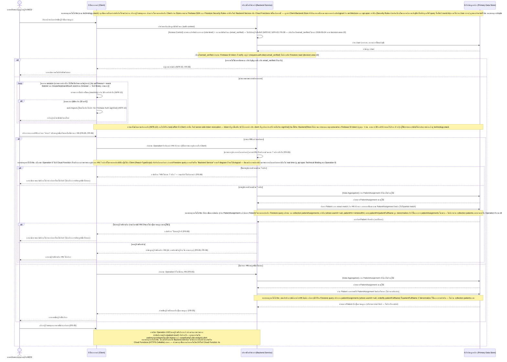
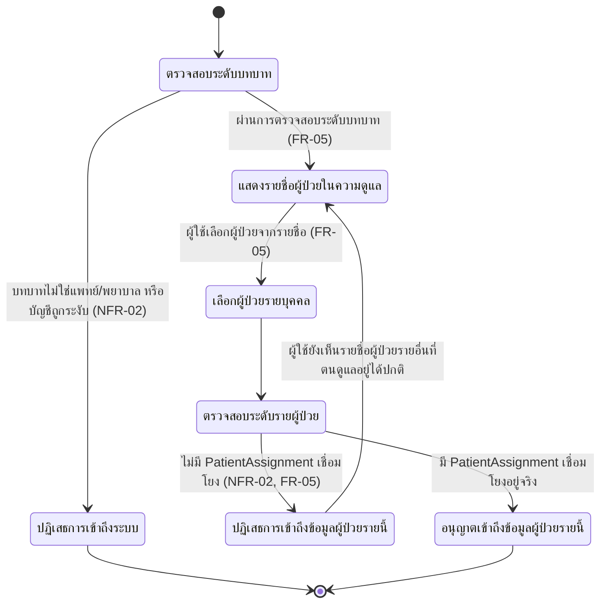
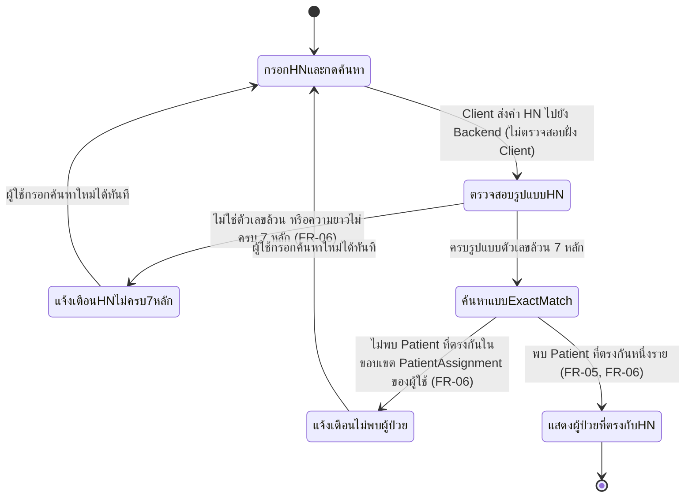

# Detailed Design — ค้นหา/เลือกผู้ป่วยในความดูแล

เอกสารนี้อธิบายการออกแบบระดับ component (sequence flow, state transition, edge case) ของฟีเจอร์
[[feature-list#3. ค้นหา/เลือกผู้ป่วยในความดูแล|3. ค้นหา/เลือกผู้ป่วยในความดูแล]] (FR-05, FR-06, NFR-02)
ตาม journey ใน [[user-journey]] ขั้นตอนที่ 1–8 อ้างอิงสัญญาการทำงานจาก
[[api-spec#Operation ร่วม — ตรวจสอบสิทธิ์การเข้าถึงข้อมูลผู้ป่วย (Access Control)|Operation ร่วม — ตรวจสอบสิทธิ์การเข้าถึงข้อมูลผู้ป่วย]]
และ [[api-spec#Operation 0 — ค้นหา/แสดงรายชื่อผู้ป่วยในความดูแล (ค้นหาเฉพาะรายด้วยเลข HN)|Operation 0]]
และโมเดลข้อมูลจาก [[db-spec#ผู้ใช้ (User)|User]], [[db-spec#ผู้ป่วย (Patient)|Patient]],
[[db-spec#การมอบหมายผู้ป่วยในความดูแล (PatientAssignment)|PatientAssignment]] ใน [[db-spec]]

**การค้นหาเฉพาะรายรองรับเฉพาะเลข HN เท่านั้น (FR-06, ยืนยันแล้ว 2026-09-21)** — ไม่รองรับการค้นหาด้วย
ชื่อ-นามสกุลหรือคำค้นอิสระอีกต่อไป (แทนที่สมมติฐานเดิมของฉบับก่อนหน้าเอกสารนี้ที่เคยรองรับคำค้นอิสระ/
partial match) เลข HN ต้องเป็นตัวเลขล้วนความยาวคงที่ 7 หลักเท่านั้น การตรวจสอบรูปแบบนี้เกิดขึ้น**หลังผู้ใช้
กด "ค้นหา" แล้วเท่านั้น ไม่ใช่แบบ real-time ระหว่างพิมพ์** และเมื่อผ่านรูปแบบแล้วจึงค้นหาแบบ**ตรงกันทั้งหมด
(exact match)** ไม่ใช่ partial match — ทั้งการตรวจสอบรูปแบบและ exact match เกิดขึ้นเฉพาะภายในกลุ่มผู้ป่วย
ที่มี [[db-spec#การมอบหมายผู้ป่วยในความดูแล (PatientAssignment)|PatientAssignment]] เชื่อมโยงกับผู้ใช้ที่
ร้องขอเท่านั้น การค้นหาด้วย HN ไม่ใช่ precondition บังคับของการเรียกดูรายชื่อทั้งหมด (FR-05) — ทั้งสอง
เส้นทางไม่บล็อกกันเอง

ฟีเจอร์นี้เป็น **precondition แรกสุด** ของทั้งฟีเจอร์
[[feature-list#1. ดูประวัติการวินิจฉัยและผลตรวจ lab ของผู้ป่วย NCD|1. ดูประวัติการวินิจฉัยและผลตรวจ lab ของผู้ป่วย NCD]]
และ [[feature-list#2. วิเคราะห์และแจ้งเตือนความเสี่ยงโรคแทรกซ้อน|2. วิเคราะห์และแจ้งเตือนความเสี่ยงโรคแทรกซ้อน]]
— ดูรายละเอียดการออกแบบต่อของแต่ละฟีเจอร์ที่ [[patient-ncd-diagnosis-lab-history]] และ
[[complication-risk-analysis-alert]] Operation 0 นี้ยังถูกใช้ซ้ำเป็นขั้นตอนค้นหา/เลือกผู้ป่วยของ
[[api-spec#Operation 4 — ยื่นและดำเนินการคำขอใช้สิทธิของเจ้าของข้อมูล (Data Subject Rights Request)|Operation 4]]
ในฟีเจอร์ [[feature-list#4. คุ้มครองข้อมูลส่วนบุคคลของผู้ป่วยตาม PDPA|4. คุ้มครองข้อมูลส่วนบุคคลของผู้ป่วยตาม PDPA]]
ด้วยเช่นกัน ตาม NFR-07 — ดูรายละเอียดที่ [[pdpa-data-protection-compliance]]

**อัปเดต 2026-09-22 — เสริมรายละเอียดการ implement จริง:** `[[technology-stack]]` มีเนื้อหาแล้ว
(สถาปัตยกรรม Firebase-native) Sequence Diagram ด้านล่างยังคงโครงสร้างเชิง logical เดิมไว้ทั้งหมด
(Client, Backend Service, Primary Data Store ตาม [[architecture]]) เพื่อให้อ่านลำดับความรับผิดชอบได้
ต่อเนื่องเหมือนเดิม แต่ **ในทางเทคนิคจริง ทั้งขั้นตอนตรวจสอบสิทธิ์ระดับบทบาทและ Operation 0 ทั้งหมด
(ตั้งแต่เปิดหน้าจอจนถึงก่อน "เลือกผู้ป่วยรายบุคคล") ไม่ผ่าน Backend Service/Cloud Functions เลย —
เป็น Client อ่าน Cloud Firestore ตรงผ่าน Firebase SDK + Firestore Security Rules ทั้งหมด** ตาม
[[technology-stack#3. สถาปัตยกรรม Backend Service — Firebase-native (ไม่มี Backend Service แยกแบบดั้งเดิม)|decision area 3 ใน technology-stack]]
และ [[api-spec#Operation 0 — ค้นหา/แสดงรายชื่อผู้ป่วยในความดูแล (ค้นหาเฉพาะรายด้วยเลข HN)|Technical Binding ของ Operation 0 ใน api-spec]]
— ดูหัวข้อ "หมายเหตุการ Implement (จาก technology-stack)" ท้ายเอกสารนี้สำหรับรายละเอียดกลไกจริงทั้งหมด
(แนวทางเดียวกับที่ [[architecture]] ใช้ Note block กำกับ diagram เดิมแทนการวาดโครงสร้างใหม่ทั้งหมด)

**อัปเดต 2026-09-22 (รอบสอง) — ตรวจสอบความสอดคล้องกับฟีเจอร์ที่ 5 (NFR-09–NFR-16):** ฟีเจอร์นี้เป็น
จุดเริ่มต้นของ [[user-journey#Journey: แพทย์/พยาบาลผู้ดูแลผู้ป่วย NCD ค้นหาผู้ป่วย ดูประวัติ และรับการแจ้งเตือนความเสี่ยงโรคแทรกซ้อน|journey หลัก]]
จึงเป็นไฟล์ที่ [[feature-list#5. รับประกันคุณภาพเชิงปฏิบัติการของระบบ (Performance, Availability, Clinical Safety, Session Security, Accessibility, Compatibility, Interoperability)|ฟีเจอร์ที่ 5]]
กระทบมากที่สุด (โดยเฉพาะ NFR-12 — Session Timeout ที่ [[user-journey]] เพิ่มเป็นขั้นตอนที่ 3 ก่อนขั้นตอน
ค้นหา/แสดงรายชื่อทั้งหมด) — ดูหัวข้อใหม่
[[#Cross-cutting: คุณภาพเชิงปฏิบัติการของระบบ (NFR-09–NFR-16)|Cross-cutting: คุณภาพเชิงปฏิบัติการของระบบ]]
ก่อนหัวข้อ Edge Case ด้านล่าง

**อัปเดต 2026-09-23 — ตรวจสอบความสอดคล้องกับฟีเจอร์ที่ 6 (Authentication):** `[[db-spec]]` ปรับ entity
[[db-spec#ผู้ใช้ (User)|User]] ให้ `บทบาท` เป็น**ไม่บังคับ**และเพิ่ม `อีเมล`/`รหัสผ่านที่จัดเก็บ`/
`สถานะการยืนยันอีเมล` (ฟีเจอร์ที่ 6 — ดู [[user-authentication-email-password]]) — ตรวจสอบแล้วว่า
**ไม่กระทบ sequence/state diagram ของเอกสารนี้** เพราะเงื่อนไข "ตรวจสอบระดับบทบาท" ที่ใช้อยู่แล้ว
(`role in ['แพทย์','พยาบาล']`) ปฏิเสธบัญชีที่ยังไม่มี `role` โดยอัตโนมัติอยู่แล้วโดยไม่ต้องเพิ่มเงื่อนไข
ใหม่ (ตามที่ [[api-spec#Operation ร่วม — ตรวจสอบสิทธิ์การเข้าถึงข้อมูลผู้ป่วย (Access Control)|Operation ร่วม Access Control ใน api-spec]]
ยืนยันไว้แล้ว) ฟีเจอร์ที่ 6 เป็น precondition ก่อนฟีเจอร์นี้ทั้งหมด (ผ่าน Operation 7 เข้าสู่ระบบ +
ยืนยันอีเมลก่อน) — ดูรายละเอียดขั้นตอนก่อนหน้าไฟล์นี้ที่ [[user-authentication-email-password]]

**อัปเดต 2026-09-22 (รอบสาม) — ตรวจสอบความสอดคล้องกับ `[[technology-stack]]`/`[[architecture]]` ฉบับ
ล่าสุด:** เพิ่ม `loop` block ตรวจสอบ inactivity/auto-logout (NFR-12) เข้าไปใน Sequence Diagram ด้านล่าง
ให้ตรงกับที่ [[architecture#Data Flow Diagram — Journey หลัก|architecture — Sequence Diagram ของ
journey หลัก]] ทำไปแล้ว (ฉบับก่อนหน้าอธิบายเป็น prose ในหัวข้อ Cross-cutting เท่านั้น ไม่มีใน diagram)
พร้อมปรับปรุงหัวข้อ Cross-cutting NFR-12 และ "หมายเหตุการ Implement" ที่เคยเขียนว่ากลไก client
inactivity timer "ไม่ได้ระบุกลไก/library เฉพาะเจาะจง" ให้ระบุกลไกจริงที่ตัดสินใจแล้ว (`setTimeout` +
event listener, ไม่มี library ภายนอก, เรียก `signOut()`) พร้อมความเสี่ยงด้านความปลอดภัย (best-effort,
ไม่มี server-side token revocation, token ยังใช้ได้จนหมดอายุตามธรรมชาติ ~1 ชม.) ให้ชัดเจนเท่ากับที่
[[architecture]] ระบุไว้แล้ว

## Sequence Diagram

ครอบคลุมทั้งสองเส้นทางของ Operation 0 (ค้นหาเฉพาะรายด้วยเลข HN และไม่ค้นหา/ดูรายการทั้งหมด) และการ
ตรวจสอบสิทธิ์ระดับบทบาทซึ่งเป็น precondition ก่อนเข้าสู่ operation นี้เสมอ การตรวจสอบรูปแบบ HN และการ
ค้นหาแบบ exact match ทั้งคู่เกิดขึ้นที่ Backend Service **หลัง** Client ส่งคำขอเข้ามาแล้วเท่านั้น (ไม่มี
การตรวจสอบฝั่ง Client แบบ real-time ระหว่างพิมพ์):

## ตาราง Operation ↔ Entity ที่กระทบ

| ลำดับ | Operation | Entity ที่กระทบ | การกระทำ | หมายเหตุ |
| --- | --- | --- | --- | --- |
| 1 | [[api-spec#Operation ร่วม — ตรวจสอบสิทธิ์การเข้าถึงข้อมูลผู้ป่วย (Access Control)\|Operation ร่วม (role-level)]] | [[db-spec#ผู้ใช้ (User)\|User]] | อ่าน | ตรวจสอบ บทบาท, สถานะการใช้งานบัญชี และตั้งแต่ 2026-09-24 ตรวจสอบ `email_verified` จาก Firebase ID token เพิ่มด้วย (FR-09, decision area 19) ก่อนเข้าสู่ Operation 0 เสมอ (ไม่มีรหัสผู้ป่วยในขั้นนี้ จึงไม่ตรวจสอบระดับรายผู้ป่วย) |
| 2 | [[api-spec#Operation 0 — ค้นหา/แสดงรายชื่อผู้ป่วยในความดูแล (ค้นหาเฉพาะรายด้วยเลข HN)\|Operation 0]] | — (ไม่กระทบ entity ใด) | ตรวจสอบรูปแบบ | เฉพาะเมื่อระบุ HN: ตรวจสอบว่าเป็นตัวเลขล้วนครบ 7 หลักหรือไม่ **หลัง** operation นี้ถูกเรียกแล้วเท่านั้น (ไม่ real-time ฝั่ง Client) — ถ้าไม่ครบรูปแบบ หยุดทันทีก่อนอ่าน PatientAssignment/Patient ใดๆ (FR-06) |
| 3 | [[api-spec#Operation 0 — ค้นหา/แสดงรายชื่อผู้ป่วยในความดูแล (ค้นหาเฉพาะรายด้วยเลข HN)\|Operation 0]] | [[db-spec#การมอบหมายผู้ป่วยในความดูแล (PatientAssignment)\|PatientAssignment]] | อ่าน | ต้องอ่าน**ก่อน**อ่าน Patient เสมอ ไม่ว่าจะระบุ HN หรือไม่ เพื่อกำหนดขอบเขตผู้ป่วยที่อนุญาตให้เห็น (ไม่ใช่กรองตามแผนก/หน่วยงาน) |
| 4 | [[api-spec#Operation 0 — ค้นหา/แสดงรายชื่อผู้ป่วยในความดูแล (ค้นหาเฉพาะรายด้วยเลข HN)\|Operation 0]] | [[db-spec#ผู้ป่วย (Patient)\|Patient]] (เชิง logical) | อ่าน | ถ้าระบุ HN ที่ผ่านรูปแบบแล้ว: อ่านแบบ exact match กับ Patient.เลขประจำตัวผู้ป่วย เฉพาะภายในขอบเขต PatientAssignment (ลำดับ 3) เท่านั้น (ไม่ใช่ partial match); ถ้าไม่ระบุ HN: อ่านทั้งหมดภายในขอบเขตเดียวกัน — **หมายเหตุเทคโนโลยีจริง:** ในทางเทคนิคไม่มีการอ่าน collection `patients` แยกต่างหากเลยใน Operation 0 (ดูหัวข้อ "หมายเหตุการ Implement" ท้ายเอกสาร) แถวนี้แสดงความรับผิดชอบเชิง logical ที่ยังถูกต้อง (ต้องได้ข้อมูล Patient.hn/fullName มาแสดง) แต่กลไกจริงคือฟิลด์ที่ denormalize ไว้ในลำดับ 3 เท่านั้น |

## ข้อกำหนด: การจำกัด/ล้างข้อมูลผู้ป่วยที่ละเอียดอ่อนฝั่ง Client (NFR-02)

ตามที่ [[architecture#ตาราง Mapping NFR ไปยัง Component|architecture — ตาราง Mapping NFR (แถว NFR-02)]]
และ [[architecture#ฝั่งไคลเอนต์ / หน้าจอผู้ใช้ (Client)|architecture — ขอบเขตความรับผิดชอบของ Client]]
กำหนดไว้ว่า "Client ต้องไม่แสดงหรือ cache ข้อมูลผู้ป่วยที่ละเอียดอ่อน (รวมถึงรายชื่อผู้ป่วยในความดูแล)
ไว้เกินความจำเป็นบนฝั่งผู้ใช้" ฟีเจอร์นี้เป็นจุดแรกสุดของ journey ที่ Client แสดงข้อมูลระบุตัวตนผู้ป่วย
(ชื่อ-นามสกุล, เลขประจำตัวผู้ป่วย/HN) ทั้งของรายชื่อผู้ป่วยในความดูแลทั้งหมด (FR-05) และผลค้นหาด้วย HN
(FR-06) จึงต้องยึดหลักการต่อไปนี้เป็นข้อกำหนดแรกสุดของทั้งระบบ (อธิบายเชิงพฤติกรรม — `[[technology-stack]]`
มีเนื้อหาแล้วแต่ไม่ได้ระบุกลไกจัดเก็บ/ล้างข้อมูลฝั่ง Client เฉพาะเจาะจง ดูหัวข้อ "หมายเหตุการ Implement"
ท้ายเอกสาร):

- Client แสดงรายชื่อ/ผลค้นหาผู้ป่วยเฉพาะเท่าที่จำเป็นต่อการให้ผู้ใช้เลือกผู้ป่วยรายบุคคลในหน้าจอปัจจุบัน
  เท่านั้น ไม่เก็บ/cache รายชื่อ/ผลค้นหาไว้ข้ามหน้าจออื่นที่ไม่เกี่ยวข้องกับการเลือกผู้ป่วย
- เมื่อผู้ใช้ออกจากหน้าจอค้นหา/รายชื่อผู้ป่วยนี้ไปยังหน้าจออื่นโดยไม่ได้เลือกผู้ป่วย, เมื่อผู้ใช้ค้นหา/
  เลือกผู้ป่วยรายใหม่แทนที่รายชื่อ/ผลค้นหาเดิม, หรือเมื่อผู้ใช้ออกจากระบบ (logout) — Client ต้องล้าง
  รายชื่อ/ผลค้นหาผู้ป่วยที่เคยแสดงไว้บนหน้าจอทันที ไม่คงค้างในสถานะที่ยังเข้าถึงได้ต่อเนื่องเกินความจำเป็น
- ข้อกำหนดนี้ครอบคลุมเฉพาะรายชื่อ/ผลค้นหาผู้ป่วยที่แสดงในฟีเจอร์นี้เท่านั้น ส่วนข้อมูลประวัติวินิจฉัย/
  ผล lab/ผลวิเคราะห์ความเสี่ยงของผู้ป่วยที่ถูกเลือกแล้ว ดูข้อกำหนดที่ต่อยอดจากหลักการนี้ที่
  [[patient-ncd-diagnosis-lab-history#ข้อกำหนด: การจำกัด/ล้างข้อมูลผู้ป่วยที่ละเอียดอ่อนฝั่ง Client (NFR-02)|patient-ncd-diagnosis-lab-history]],
  [[complication-risk-analysis-alert#ข้อกำหนด: การจำกัด/ล้างข้อมูลผู้ป่วยที่ละเอียดอ่อนฝั่ง Client (NFR-02)|complication-risk-analysis-alert]]
  และสำหรับผลลัพธ์ของคำขอใช้สิทธิของเจ้าของข้อมูล (Operation 4) ดู
  [[pdpa-data-protection-compliance#ข้อกำหนด: การจำกัด/ล้างข้อมูลผู้ป่วยที่ละเอียดอ่อนฝั่ง Client (NFR-02)|pdpa-data-protection-compliance]]
- รายละเอียดกลไกจริงที่ใช้จำกัด/ล้างข้อมูล (เช่น วิธีจัดการสถานะฝั่งผู้ใช้, ระยะเวลาที่ข้อมูลอาจคงค้าง
  ได้ก่อนถูกล้าง) ยังไม่ถูกกำหนดในระดับนี้ เพราะ `[[technology-stack]]` ไม่ได้ระบุกลไก state
  management เฉพาะเจาะจงสำหรับความสามารถนี้ — เอกสารนี้กำหนดเฉพาะหลักการเชิงพฤติกรรมที่การออกแบบ/
  พัฒนาต่อไปด้วย React + TypeScript ต้องรองรับเท่านั้น

## State Diagram — สถานะการตรวจสอบสิทธิ์และการเลือกผู้ป่วย

แสดงสถานะของคำขอหนึ่งครั้งของผู้ใช้ ตั้งแต่ตรวจสอบสิทธิ์ระดับบทบาทจนถึงตรวจสอบสิทธิ์ระดับรายผู้ป่วย
หลังเลือกผู้ป่วยแล้ว (ตาม NFR-02 ฉบับขยายความ 2 ระดับใน [[api-spec]]):

หมายเหตุ: "อนุญาตเข้าถึงข้อมูลผู้ป่วยรายนี้" เป็นจุดเริ่มต้นของ flow ในฟีเจอร์
[[patient-ncd-diagnosis-lab-history]] และ [[complication-risk-analysis-alert]] ต่อไป ไม่ใช่ state
ที่มีการบันทึกลง entity ใดใน [[db-spec]] โดยตรง (PatientAssignment เป็นแบบ existence-based ไม่มี
attribute สถานะ — ดู [[db-spec#การมอบหมายผู้ป่วยในความดูแล (PatientAssignment)|หมายเหตุใน db-spec]])
ตัวสถานะเหล่านี้จึง**ไม่ต้อง**ปรับให้สะท้อน Firestore field value ใดๆ (ไม่มี field สถานะให้สะท้อน) —
กลไกจริงที่บังคับ transition แต่ละจุดต่างกันตามช่วง: "ตรวจสอบระดับบทบาท" บังคับโดย Firestore Security
Rules (Operation 0); "ตรวจสอบระดับรายผู้ป่วย" หลังเลือกผู้ป่วยบังคับโดยโค้ด Cloud Functions (Operation
1-6) ตาม [[technology-stack#7. Authentication/Authorization — Firebase Authentication (ไม่ใช้ Custom Claims เก็บบทบาท — แก้ไขในรอบสาม 2026-09-24)|decision area 7 ใน technology-stack]] — ทั้งสองเส้นทางอ่าน `role`/`isActive` จาก Firestore `users/{uid}` โดยตรงเสมอ **ไม่มี custom claims ให้อ่านอีกต่อไป** (decision area 18)

## State Diagram — สถานะขั้นตอนค้นหาด้วยเลข HN (Operation 0, เส้นทางระบุ HN)

แยกออกมาให้เห็นชัดเจนว่าการตรวจสอบรูปแบบ HN และการค้นหาแบบ exact match เป็นคนละขั้นตอนที่เรียงลำดับ
กัน และทั้งสองกรณี error อนุญาตให้ผู้ใช้กรอกค้นหาใหม่ได้ทันทีโดยไม่ต้องออกจากหน้าจอ (ตาม
[[user-journey]] ขั้นตอนที่ 4–6 และ FR-06):

หมายเหตุ: state diagram นี้ไม่บล็อกเส้นทาง "ไม่ระบุ HN ดูรายชื่อทั้งหมด" (FR-05) ซึ่งเป็นอิสระจากกัน —
ผู้ใช้ล้างค่า HN แล้วสลับไปดูรายชื่อทั้งหมดได้ทุกเมื่อโดยไม่ต้องรอผลค้นหา HN

**หมายเหตุเทคโนโลยีจริง:** state "ตรวจสอบรูปแบบHN" ในทางเทคนิคคือโค้ด Client (React+TypeScript) ก่อน
ยิง query ไม่ใช่ state ฝั่ง server; state "ค้นหาแบบExactMatch" คือ Firestore query เดียวบน
`patientAssignments` (ไม่ใช่สอง state ย่อยที่อ่าน PatientAssignment แล้วอ่าน Patient แยกกันตามที่
sequence diagram ด้านบนวาดไว้เชิง logical) — ไม่มี state/field ใดถูกบันทึกถาวรลง Firestore จาก state
diagram นี้ (เป็น request-scoped process state ทั้งหมด ไม่ใช่ entity field)

## Cross-cutting: คุณภาพเชิงปฏิบัติการของระบบ (NFR-09–NFR-16)

เช่นเดียวกับที่ [[architecture#Cross-cutting: คุณภาพเชิงปฏิบัติการของระบบ (NFR-09–NFR-16)|architecture]]
และ [[api-spec#Cross-cutting: ข้อกำหนดคุณภาพเชิงปฏิบัติการที่ครอบคลุมทุก Operation (NFR-09–NFR-16)|api-spec]]
ระบุไว้แล้วว่า [[feature-list#5. รับประกันคุณภาพเชิงปฏิบัติการของระบบ (Performance, Availability, Clinical Safety, Session Security, Accessibility, Compatibility, Interoperability)|ฟีเจอร์ที่ 5]]
(NFR-09–NFR-16) ไม่ต้องการ operation/component ใหม่ ฟีเจอร์นี้จึง**ไม่มี sequence/state diagram แยก
สำหรับฟีเจอร์ที่ 5** (เช่นเดียวกับที่ NFR-04 ไม่มี sequence diagram แยกใน
[[pdpa-data-protection-compliance]]) — หัวข้อนี้บันทึกเฉพาะผลกระทบต่อ sequence/state diagram ที่มี
อยู่แล้วด้านบนเท่านั้น:

- **Session Timeout (NFR-12) — รวมความเสี่ยงด้านความปลอดภัยที่ต้องเน้นย้ำ:** [[user-journey]] เพิ่ม
  ขั้นตอนที่ 3 (ตรวจสอบ inactivity เกิน 30 นาที → auto-logout กลับไปขั้นตอนที่ 1) ไว้**ก่อน**ขั้นตอนที่ 4
  เสมอ — ตอนนี้แสดงเป็น `loop` block ใน Sequence Diagram ด้านบนแล้ว (ต่างจากฉบับก่อนหน้าที่มีเพียง
  คำอธิบายเชิง prose) **กลไกจริง (ตัดสินใจแล้ว):**
  [[technology-stack#10. กลไก Session Timeout (NFR-12) — Client Custom Inactivity Timer เท่านั้น (ไม่มี Server-side Token Revocation)|
  Client custom inactivity timer]] — `setTimeout` + event listener บน mouse/keyboard/touch event
  มาตรฐานของ browser (ไม่มี library ภายนอกเช่น `react-idle-timer`) เมื่อ idle ครบ 30 นาทีเรียก Firebase
  Authentication `signOut()` ทันที — เมื่อ auto-logout เกิดขึ้นแล้ว คำขอถัดไปใดๆ ที่ไม่มี auth context
  ที่ถูกต้องแนบมาจะถูกปฏิเสธที่ step "[Access Control] ตรวจสอบสิทธิ์ระดับบทบาท" ในเอกสารนี้เองอยู่แล้ว
  ผ่านเงื่อนไข "ไม่มีข้อมูลยืนยันตัวตน" (ดู edge case ด้านล่าง) ตามที่
  [[api-spec#Operation ร่วม — ตรวจสอบสิทธิ์การเข้าถึงข้อมูลผู้ป่วย (Access Control)|Operation ร่วม — ตรวจสอบสิทธิ์การเข้าถึงข้อมูลผู้ป่วย ใน api-spec]]
  ระบุไว้ (ข้อ 4) — **ความเสี่ยงด้านความปลอดภัยที่ต้องรับทราบ (สำคัญ — ไม่ใช่รายละเอียดปลีกย่อย):** กลไกนี้
  เป็น **best-effort ฝั่ง Client เท่านั้น** **ไม่มี server-side token revocation** — ถ้า token ถูกขโมย/
  ดักจับไว้ก่อนหน้า (อุปกรณ์สูญหายพร้อม token ที่ intercept ไว้แล้ว) หรือ client ถูกดัดแปลง/บั๊กจนไม่เรียก
  `signOut()` เมื่อ idle จริง **token นั้นยังใช้เรียก Backend Service/Primary Data Store ได้ต่อจนกว่าจะ
  หมดอายุตามธรรมชาติของ Firebase ID token (สูงสุดประมาณ 1 ชั่วโมง — นานกว่า 30 นาทีที่ NFR-12 กำหนดไว้
  เกือบ 2 เท่า)** กระทบ **NFR-02 (Access Control)** โดยตรง เพราะไม่มีจุดใดฝั่งเซิร์ฟเวอร์ปฏิเสธ token ที่
  "ยังไม่หมดอายุแต่ควรถูกเพิกถอนแล้ว" ได้จริง — ผู้ใช้รับทราบและยืนยันให้ดำเนินการต่อในรอบ MVP นี้แล้ว
  (ดูรายละเอียดเต็มที่
  [[technology-stack#ความเสี่ยงเพิ่มเติม: NFR-12 Session Timeout เป็น Best-effort ฝั่ง Client เท่านั้น (ไม่มี Server-side Token Revocation)|
  หัวข้อความเสี่ยงใน technology-stack]] และ
  [[architecture#ฝั่งไคลเอนต์ / หน้าจอผู้ใช้ (Client)|architecture — หัวข้อ Client]]) มาตรการป้องกันที่ควร
  พิจารณาก่อนใช้งานจริงกับข้อมูลผู้ป่วยจริง (ลด TTL ของ token, เพิ่ม server-side token revocation ผ่าน
  Cloud Function `revokeRefreshTokens()`) บันทึกไว้ใน [[technology-stack#ประเด็นรอตัดสินใจ|ประเด็นรอ
  ตัดสินใจใน technology-stack]] เท่านั้น (**เฉพาะกลไก server-side revocation ยังไม่ถูกตัดสินใจ** — กลไก
  client-only ข้างต้นตัดสินใจแล้วและนำมาใช้จริงในเอกสารนี้)
- **Performance < 2 วินาที (NFR-09):** Operation 0 (ทั้งสองเส้นทาง) ต้องตอบสนองภายในเวลานี้ —
  composite index `(userId ASC, patientHn ASC)` และ `(userId ASC, patientFullName ASC)` ที่ระบุไว้
  แล้วในหัวข้อ "หมายเหตุการ Implement" ด้านล่างคือกลไกหลักที่รองรับข้อกำหนดนี้ (ดู
  [[db-spec#คุณสมบัติร่วม (Cross-cutting Property) — Performance/Index Design (NFR-09)|db-spec]])
- **Security Rules Verification (NFR-14):** Firestore Security Rules ที่ Operation 0 พึ่งพาทั้งหมด
  (role-level ผ่าน `get()` บน `users/{uid}`, patient-level ผ่าน field `userId` บน
  `patientAssignments` และตั้งแต่ 2026-09-24 เงื่อนไข `email_verified` เพิ่มเติมตาม decision area 19)
  ต้องมี automated test ผ่าน Firebase Emulator Suite ครอบคลุมกรณีตามที่
  [[db-spec#คุณสมบัติร่วม (Cross-cutting Property) — Security Rules Verification (NFR-14)|db-spec]]
  (รวมกรณีใหม่ "(ง) ผู้ใช้ที่บัญชียังไม่ยืนยันอีเมล") และ
  [[technology-stack#ความเสี่ยงที่ต้องพิจารณาเพิ่มเติม (สำคัญ — ผู้ใช้รับทราบและยืนยันให้ดำเนินการต่อแล้ว)|technology-stack — หัวข้อความเสี่ยง]]
  ระบุไว้ ก่อน deploy ใช้งานจริงเสมอ — **สำคัญเป็นพิเศษสำหรับฟีเจอร์นี้** เพราะเป็น operation เดียวใน
  ระบบที่ Client อ่าน Firestore ตรงโดยไม่ผ่าน Cloud Functions
- **Browser/Device Compatibility (NFR-15):** หน้าจอค้นหา/รายชื่อผู้ป่วยในฟีเจอร์นี้ต้องแสดงผลถูกต้อง
  บน browser หลักเวอร์ชันล่าสุด (Chrome/Edge/Firefox) บน desktop/tablet เช่นเดียวกับทุกหน้าจอในระบบ
  (ไม่มีข้อกำหนดพิเศษเพิ่มเติมสำหรับฟีเจอร์นี้)
- **Availability (NFR-10), Clinical Safety Validation (NFR-11), Accessibility (NFR-13),
  Interoperability (NFR-16):** ไม่กระทบฟีเจอร์นี้โดยตรง — NFR-11/NFR-13 กระทบเฉพาะ Operation 3 (ดู
  [[complication-risk-analysis-alert]]), NFR-10/NFR-16 เป็นคุณสมบัติระดับ infrastructure/อนาคตที่ไม่
  ผูกกับ operation ใด (ดู [[architecture#Cross-cutting: คุณภาพเชิงปฏิบัติการของระบบ (NFR-09–NFR-16)|architecture]])

## Edge Case และวิธีจัดการ

| Edge Case | วิธีจัดการ | อ้างอิง |
| --- | --- | --- |
| ไม่มีข้อมูลยืนยันตัวตน หรือข้อมูลยืนยันตัวตนไม่ถูกต้อง | ปฏิเสธการเข้าถึงทันที ก่อนเรียก Operation 0 | [[api-spec#Operation ร่วม — ตรวจสอบสิทธิ์การเข้าถึงข้อมูลผู้ป่วย (Access Control)\|Operation ร่วม]] |
| ผู้ใช้ถูก auto-logout เนื่องจากไม่มีการใช้งาน (inactivity) เกิน 30 นาที (NFR-12) แล้วส่งคำขอถัดไปโดยไม่มี auth context ที่ถูกต้องแนบมา | ปฏิเสธการเข้าถึงที่ step ตรวจสอบสิทธิ์ระดับบทบาทเช่นเดียวกับกรณี "ไม่มีข้อมูลยืนยันตัวตน" ข้างต้น — Client นำผู้ใช้กลับไปหน้าจอเข้าสู่ระบบใหม่ (ขั้นตอนที่ 1 ใน [[user-journey]]) | [[backlog#Non-Functional Requirements\|NFR-12]] |
| บทบาทผู้ใช้ไม่ใช่แพทย์/พยาบาล หรือบัญชีถูกระงับ | ปฏิเสธการเข้าถึง — Client แสดงข้อความไม่มีสิทธิ์เข้าถึงระบบ | [[backlog#Non-Functional Requirements\|NFR-02]] |
| บทบาท/สถานะบัญชี/PatientAssignment ถูกต้องครบ แต่ `email_verified` เป็นเท็จ (รวมถึงกรณี Client ถูกดัดแปลง/บั๊กข้ามการตรวจสอบ `emailVerified` ที่ชั้น UX แล้วเรียก Operation 0 ตรง) | **ปิดช่องว่างแล้วตั้งแต่ 2026-09-24** — Firestore Security Rules ปฏิเสธ query/read โดยอัตโนมัติผ่านเงื่อนไข `request.auth.token.email_verified == true` (decision area 19) — ไม่ใช่ช่องว่างที่ยังไม่ถูกยืนยันอีกต่อไป | [[technology-stack#19. การตรวจสอบ `emailVerified` ซ้ำฝั่ง Backend (FR-09, ฟีเจอร์ที่ 6) — ตรวจทั้ง Cloud Functions และ Security Rules\|decision area 19 ใน technology-stack]], [[backlog#สูง (MVP)\|FR-09]] |
| ไม่มีผู้ป่วยรายใดอยู่ในความดูแลของผู้ใช้ (ไม่มีระเบียน PatientAssignment เลย) | คืนรายการว่าง ไม่ถือเป็น error — Client แสดงข้อความว่าไม่มีผู้ป่วยในความดูแล | [[api-spec#Operation 0 — ค้นหา/แสดงรายชื่อผู้ป่วยในความดูแล (ค้นหาเฉพาะรายด้วยเลข HN)\|Operation 0]] |
| กรอก HN แล้วกดค้นหา แต่ไม่ครบรูปแบบตัวเลขล้วน 7 หลัก | ตรวจสอบหลังกดค้นหาเท่านั้น (ไม่ real-time) — หยุดทันที ไม่ค้นหาต่อ แจ้งเตือน "HN ไม่ครบ 7 หลัก" ให้กรอกค้นหาใหม่ได้ทันที โดยไม่บล็อกการเรียกดูรายชื่อทั้งหมด | [[backlog#สูง (MVP)\|FR-06]], [[api-spec#Operation 0 — ค้นหา/แสดงรายชื่อผู้ป่วยในความดูแล (ค้นหาเฉพาะรายด้วยเลข HN)\|Operation 0]] |
| กรอก HN ครบ 7 หลักแล้วค้นหาแบบ exact match ไม่พบผู้ป่วยที่ตรงกัน (รวมถึงกรณีมี HN นี้จริงแต่ไม่อยู่ในความดูแลของผู้ใช้นี้) | แจ้งเตือน "ไม่พบผู้ป่วย" ให้กรอกค้นหาใหม่ได้ทันที โดยไม่บล็อกการเรียกดูรายชื่อทั้งหมด (ไม่เปิดเผยว่า HN นี้มีอยู่จริงแต่อยู่นอกความดูแลของผู้ใช้ — ข้อความเดียวกันทั้งสองกรณี) | [[backlog#สูง (MVP)\|FR-06]], [[api-spec#Operation 0 — ค้นหา/แสดงรายชื่อผู้ป่วยในความดูแล (ค้นหาเฉพาะรายด้วยเลข HN)\|Operation 0]] |
| เลือกผู้ป่วยที่ไม่ได้อยู่ในความดูแลของตน (เช่น ผ่านการปลอมแปลงรหัสผู้ป่วยฝั่ง Client) | ตรวจสอบระดับรายผู้ป่วยซ้ำที่ Backend Service ก่อนเข้าถึงข้อมูลรายบุคคลเสมอ (ไม่พึ่งพาการกรองฝั่ง Client เพียงอย่างเดียว) — ปฏิเสธการเข้าถึงข้อมูลผู้ป่วยรายนี้ แต่ผู้ใช้ยังเห็นรายชื่อผู้ป่วยรายอื่นที่ตนดูแลได้ปกติ | [[backlog#Non-Functional Requirements\|NFR-02]], [[backlog#สูง (MVP)\|FR-05]] |
| ผู้ใช้ออกจากหน้าจอค้นหา/รายชื่อผู้ป่วยนี้ไปยังหน้าจออื่นโดยไม่ได้เลือกผู้ป่วยรายใด | Client ล้างรายชื่อ/ผลค้นหาผู้ป่วยที่เคยแสดงไว้ทันที ไม่เก็บ/cache ไว้เกินความจำเป็น (NFR-02) | [[architecture#ตาราง Mapping NFR ไปยัง Component\|architecture — ตาราง Mapping NFR แถว NFR-02]] |
| ผู้ใช้ค้นหา/เลือกผู้ป่วยรายใหม่แทนที่รายชื่อ/ผลค้นหาเดิม (ค้นหาซ้ำ หรือกลับมาหน้านี้เพื่อเลือกผู้ป่วยรายอื่น) | Client ล้างรายชื่อ/ผลค้นหาชุดเดิมที่ไม่เกี่ยวข้องอีกต่อไปก่อนแสดงผลลัพธ์ชุดใหม่ ไม่คงค้างข้อมูลผู้ป่วยรายเดิมไว้ (NFR-02) | [[architecture#ตาราง Mapping NFR ไปยัง Component\|architecture — ตาราง Mapping NFR แถว NFR-02]] |
| ผู้ใช้ออกจากระบบ (logout) หรือ session สิ้นสุด | Client ล้างรายชื่อ/ผลค้นหาผู้ป่วยที่ละเอียดอ่อนทั้งหมดที่ยังแสดง/ค้างอยู่ทันที ก่อนกลับสู่หน้าจอเข้าสู่ระบบ (NFR-02) | [[architecture#ตาราง Mapping NFR ไปยัง Component\|architecture — ตาราง Mapping NFR แถว NFR-02]] |

## หมายเหตุการ Implement (จาก technology-stack)

รายละเอียดกลไกจริงต่อไปนี้อ้างอิงเฉพาะสิ่งที่ `[[technology-stack]]` ตัดสินใจไว้แล้วเท่านั้น (ดู
[[technology-stack#3. สถาปัตยกรรม Backend Service — Firebase-native (ไม่มี Backend Service แยกแบบดั้งเดิม)|decision area 3]],
[[technology-stack#7. Authentication/Authorization — Firebase Authentication (ไม่ใช้ Custom Claims เก็บบทบาท — แก้ไขในรอบสาม 2026-09-24)|decision area 7]],
[[technology-stack#18. การ Sync role/isActive ระหว่าง Firestore กับ Custom Claims (ฟีเจอร์ที่ 6) — ไม่ Sync, Firestore เป็น Source of Truth เดียว|decision area 18]],
[[technology-stack#19. การตรวจสอบ `emailVerified` ซ้ำฝั่ง Backend (FR-09, ฟีเจอร์ที่ 6) — ตรวจทั้ง Cloud Functions และ Security Rules|decision area 19]]):

- **ตรวจสอบสิทธิ์ระดับบทบาท (role-level):** บังคับใช้ผ่าน **Firestore Security Rules** เท่านั้น
  ประเมิน `get(/databases/$(database)/documents/users/$(request.auth.uid)).data.role in
  ['แพทย์','พยาบาล']` และ `...isActive == true` อัตโนมัติทุกครั้งที่ Client ยิง query บน
  `patientAssignments` — ไม่มีการเรียก Cloud Function แยกเพื่อตรวจสอบขั้นตอนนี้ — **ไม่มี custom claims
  บทบาท/isActive ให้อ่านอีกต่อไป (decision area 18)** Firestore `users/{uid}` เป็น source of truth
  เดียว — **เพิ่มเงื่อนไข `request.auth.token.email_verified == true` ในรอบ 2026-09-24 (decision area
  19, FR-09)** อ่านจาก Firebase ID token ที่ verify อยู่แล้ว ไม่ต้องเพิ่ม Firestore read
- **Operation 0 (ทั้งสองเส้นทาง — ค้นหาด้วย HN และดูรายชื่อทั้งหมด):** Client เรียก **Firestore SDK
  query ตรง** บน collection `patientAssignments` เพียง collection เดียว ใช้ field ที่ denormalize
  ไว้แล้ว (`patientHn`, `patientFullName`) ไม่อ่าน collection `patients` แยก:
  - ค้นหาด้วย HN: `where('userId','==',uid).where('patientHn','==',enteredHn)` — ใช้ composite
    index `(userId ASC, patientHn ASC)`
  - ดูรายชื่อทั้งหมด: `where('userId','==',uid).orderBy('patientFullName')` — ใช้ composite index
    `(userId ASC, patientFullName ASC)`
  - ทั้งสอง query ถูกกรองด้วย Firestore Security Rules เดียวกัน (`allow list, get: if ... &&
    resource.data.userId == request.auth.uid && ...`) — ดู
    [[db-spec#การมอบหมายผู้ป่วยในความดูแล (PatientAssignment)|Firestore Technical Binding ของ
    PatientAssignment ใน db-spec]] สำหรับ rule เต็ม
- **การตรวจสอบรูปแบบ HN 7 หลัก:** ย้ายไปอยู่ในโค้ด **Client (React + TypeScript)** ทันทีหลังกดปุ่ม
  ค้นหา ก่อนยิง Firestore query เสมอ (ไม่มี Cloud Function ให้ทำหน้าที่นี้แทนในเส้นทางนี้) — ยังคง
  หลักการเดิมว่าต้องตรวจสอบ**หลังกดค้นหาเท่านั้น ไม่ real-time ระหว่างพิมพ์** (FR-06)
- **Error/สถานะจริง:** ไม่มี `HttpsError` ใดๆ ในเส้นทางนี้เพราะไม่ใช่ Cloud Function — กรณีไม่มีสิทธิ์
  ระดับบทบาท Client ได้รับ `permission-denied` จาก Firestore SDK เอง (มาจาก Security Rules ปฏิเสธ);
  กรณี "HN ไม่ครบ 7 หลัก" และ "ไม่พบผู้ป่วย" ทั้งสองเป็น client-side logic ล้วน (ไม่ใช่ error จาก
  server) — ดู [[api-spec#กรณี Error ทั่วไปที่ใช้ร่วมกันทุก Operation|ตาราง Error ทั่วไปใน api-spec]]
- **การจำกัด/ล้างข้อมูลฝั่ง Client (หัวข้อด้านบน):** `[[technology-stack]]` ไม่ได้ระบุกลไก state
  management เฉพาะเจาะจง (เช่น library จัดการ state) สำหรับความสามารถนี้ — หลักการเชิงพฤติกรรมที่ระบุ
  ไว้ในหัวข้อ "ข้อกำหนด: การจำกัด/ล้างข้อมูลผู้ป่วยที่ละเอียดอ่อนฝั่ง Client" ด้านบนจึงยังคงเป็นข้อกำหนด
  ระดับพฤติกรรมที่การ implement จริงด้วย React + TypeScript ต้องรองรับ ไม่ผูกกลไกเฉพาะเจาะจงเพิ่มเติม
- **Session Timeout (NFR-12) — กลไกจริงตัดสินใจแล้ว:**
  [[technology-stack#10. กลไก Session Timeout (NFR-12) — Client Custom Inactivity Timer เท่านั้น (ไม่มี Server-side Token Revocation)|
  decision area 10 ใน technology-stack]] ระบุกลไกจริงไว้ชัดเจนแล้ว (ไม่ใช่ "ยังไม่มีการตัดสินใจ" ตาม
  ฉบับก่อนหน้าของหัวข้อนี้อีกต่อไป): เขียน inactivity timer เองฝั่ง Client ด้วย **`setTimeout` + event
  listener** บน mouse/keyboard/touch event มาตรฐานของ browser (**ไม่มี library ภายนอก** เช่น
  `react-idle-timer` — พิจารณาแล้วไม่เลือกเพื่อลด dependency) นับเวลาไม่มีการโต้ตอบต่อเนื่อง เมื่อครบ 30
  นาทีเรียก **Firebase Authentication `signOut()`** ทันที กลับไปหน้าจอยืนยันตัวตนใหม่ (ดู `loop` block
  ใน Sequence Diagram ด้านบน) — **ไม่มีกลไกฝั่งเซิร์ฟเวอร์เพื่อเพิกถอน (revoke) token ซ้ำ** เป็นความเสี่ยง
  ด้านความปลอดภัยที่บันทึกไว้แล้วในหัวข้อ Cross-cutting ด้านบนและ
  [[technology-stack#ความเสี่ยงเพิ่มเติม: NFR-12 Session Timeout เป็น Best-effort ฝั่ง Client เท่านั้น (ไม่มี Server-side Token Revocation)|
  technology-stack]] (ผู้ใช้รับทราบและยืนยันให้ดำเนินการต่อแล้ว)
- **Security Rules Verification (NFR-14):** automated test ด้วย **Firebase Emulator Suite**
  (`@firebase/rules-unit-testing`) ตาม
  [[technology-stack#ความเสี่ยงที่ต้องพิจารณาเพิ่มเติม (สำคัญ — ผู้ใช้รับทราบและยืนยันให้ดำเนินการต่อแล้ว)|technology-stack — หัวข้อความเสี่ยง]]
  — ต้องครอบคลุมอย่างน้อย 4 กรณีที่ระบุไว้แล้วสำหรับ collection `patientAssignments`/`users` (ดู
  [[db-spec#คุณสมบัติร่วม (Cross-cutting Property) — Security Rules Verification (NFR-14)|db-spec]])
  ก่อน deploy Security Rules ของฟีเจอร์นี้ใช้งานจริง

## เอกสารที่เกี่ยวข้อง

- [[api-spec]]
- [[db-spec]]
- [[architecture]]
- [[technology-stack]]
- [[feature-list]]
- [[user-journey]]
- [[patient-ncd-diagnosis-lab-history]]
- [[complication-risk-analysis-alert]]
- [[pdpa-data-protection-compliance]]
- [[20260922-01-operational-quality-nfr]]
- [[user-authentication-email-password]]
