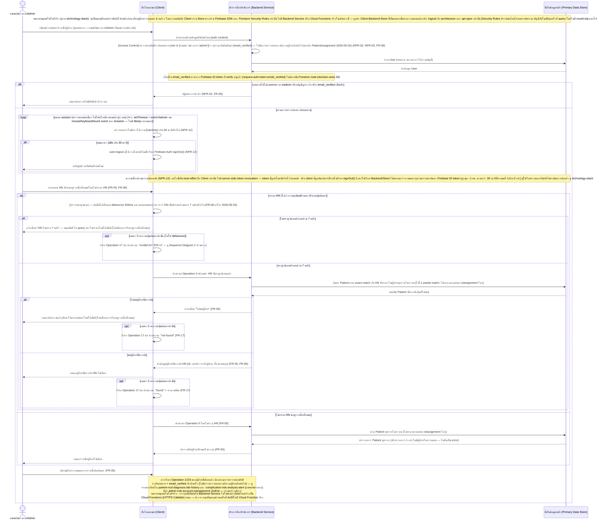
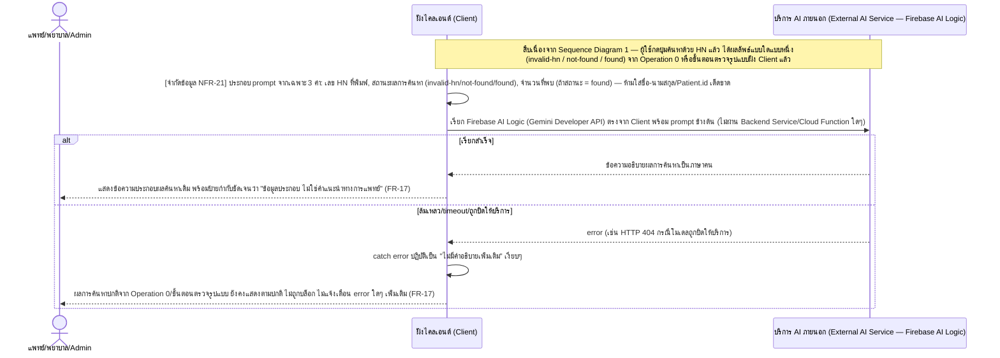
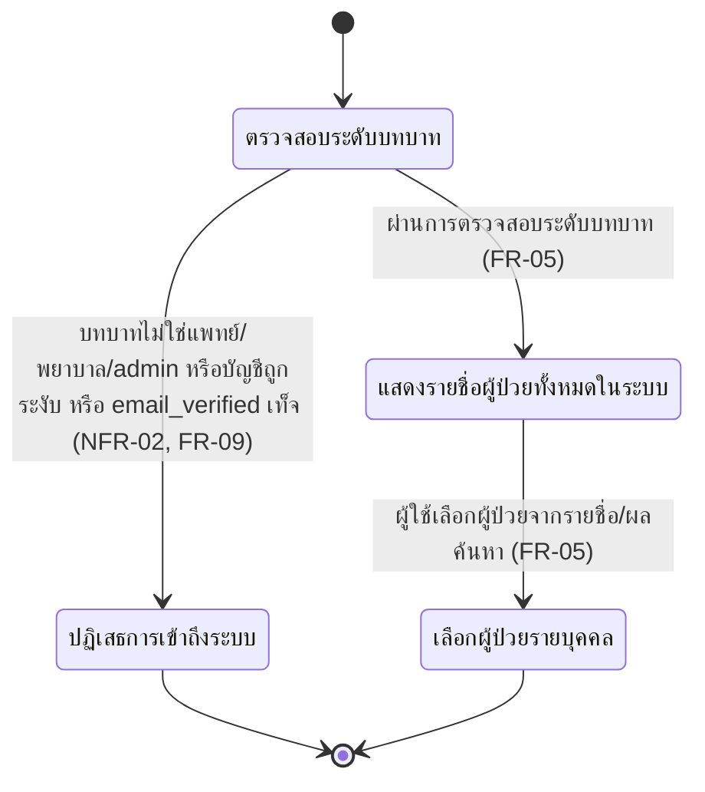
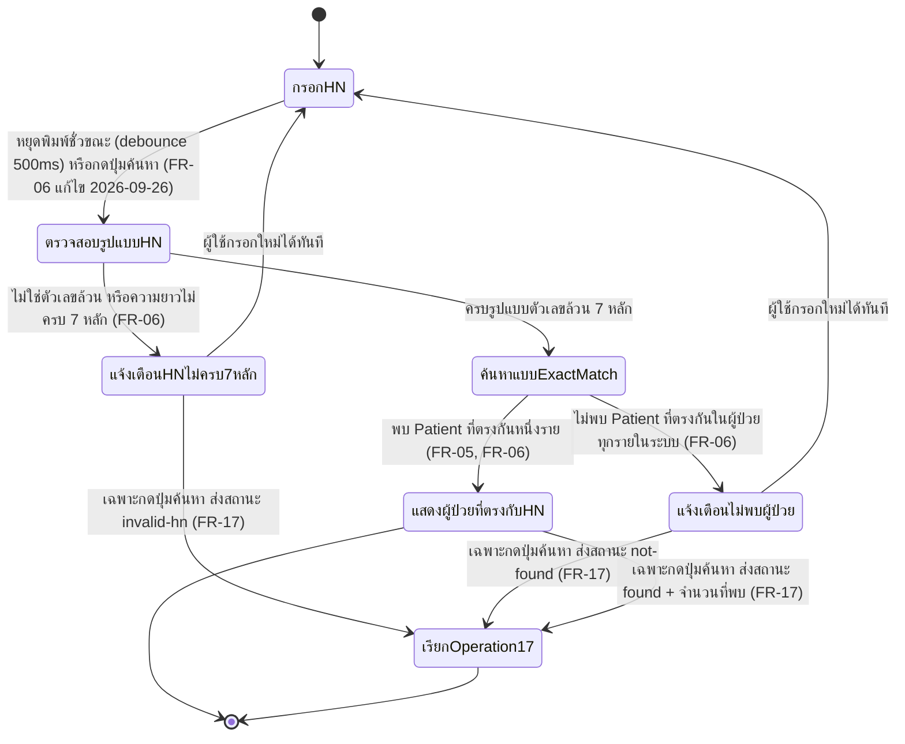

# Detailed Design — ค้นหา/เลือกผู้ป่วย

เอกสารนี้อธิบายการออกแบบระดับ component (sequence flow, state transition, edge case) ของฟีเจอร์
[[feature-list#3. ค้นหา/เลือกผู้ป่วย|3. ค้นหา/เลือกผู้ป่วย]] (FR-05, FR-06, FR-17, NFR-02) ตาม journey
ใน [[user-journey]] ขั้นตอนที่ 1–8 อ้างอิงสัญญาการทำงานจาก
[[api-spec#Operation ร่วม — ตรวจสอบสิทธิ์การเข้าถึงข้อมูลผู้ป่วย (Access Control)|Operation ร่วม — ตรวจสอบสิทธิ์การเข้าถึงข้อมูลผู้ป่วย]],
[[api-spec#Operation 0 — ค้นหา/แสดงรายชื่อผู้ป่วยทั้งหมดในระบบ (ค้นหาเฉพาะรายด้วยเลข HN)|Operation 0]]
และ [[api-spec#Operation 17 — อธิบายผลการค้นหาผู้ป่วยด้วย HN โดยบริการ AI ภายนอก (AI-assisted Search Result Explanation)|Operation 17]]
และโมเดลข้อมูลจาก [[db-spec#ผู้ใช้ (User)|User]] และ [[db-spec#ผู้ป่วย (Patient)|Patient]] ใน [[db-spec]]

**แก้ไข 2026-09-25 (รอบ audit-pipeline) — ยกเลิกกลไก PatientAssignment ทั้งหมด, รวม Operation 0/15
เข้าด้วยกัน:** เอกสารฉบับก่อนหน้านี้ (ชื่อไฟล์เดิม "ค้นหา/เลือกผู้ป่วยในความดูแล") อธิบายว่าแพทย์/พยาบาล
เห็นเฉพาะผู้ป่วยที่ตนมี `PatientAssignment` เชื่อมโยงอยู่ และ Admin ต้องเรียก Operation 15 แยกต่างหาก —
ทั้งหมดนี้**ล้าสมัยแล้ว** ตาม [[architecture]]/[[api-spec]]/[[db-spec]] ที่ sync วันที่ 2026-09-25:
ไม่มี entity `PatientAssignment`/collection `patientAssignments` อีกต่อไป, Operation 15 ถูกรวมเข้ากับ
**Operation 0** กลายเป็น operation เดียวที่ทุกบทบาท (แพทย์/พยาบาล/Admin) เรียกใช้เหมือนกันทุกประการ —
แพทย์/พยาบาล/Admin ทุกคนเห็นและค้นหาผู้ป่วย**ทุกราย**ในระบบเหมือนกันหลังผ่านการตรวจสอบระดับบทบาท
เอกสารนี้เขียนใหม่ทั้งฉบับให้ตรงกับสถานะปัจจุบัน (ไม่ใช่แก้ไขบางส่วน) เพราะมีจุดที่ต้องแก้ไขจำนวนมาก

**เพิ่ม 2026-09-26 (รอบ audit-pipeline) — FR-17/NFR-21 (AI ช่วยอธิบายผลการค้นหาด้วย HN) และปรับจังหวะ
validation ของ FR-06:** [[feature-list]] เพิ่ม FR-17 (กลาง) เข้าฟีเจอร์นี้โดยตรง (เป็นส่วนขยายของขั้นตอน
ค้นหาด้วย HN) และแก้ไข FR-06 ให้ตรวจสอบรูปแบบ HN/ค้นหาทำงานได้ทั้งตอนหยุดพิมพ์ (debounce 500ms) และตอน
กดปุ่มค้นหา (เดิมทำงานเฉพาะหลังกดค้นหาเท่านั้น) ตาม
[[api-spec#Operation 0 — ค้นหา/แสดงรายชื่อผู้ป่วยทั้งหมดในระบบ (ค้นหาเฉพาะรายด้วยเลข HN)|api-spec (แก้ไข 2026-09-26)]]
— เพิ่ม [[#Operation 17 — อธิบายผลการค้นหาผู้ป่วยด้วย HN โดยบริการ AI ภายนอก (FR-17)|Sequence Diagram 2]]
ใหม่ด้านล่าง และปรับปรุง Sequence Diagram หลัก/State Diagram ของเส้นทาง HN ให้ตรงกับสองจังหวะนี้

ฟีเจอร์นี้เป็น **precondition แรกสุด** ของทั้งฟีเจอร์
[[feature-list#1. ดูประวัติการวินิจฉัยและผลตรวจ lab ของผู้ป่วย NCD|1. ดูประวัติการวินิจฉัยและผลตรวจ lab ของผู้ป่วย NCD]]
และ [[feature-list#2. วิเคราะห์ แจ้งเตือน และยืนยัน/แก้ไขผลประเมินความเสี่ยงโรคแทรกซ้อน|2. วิเคราะห์ แจ้งเตือน และยืนยัน/แก้ไขผลประเมินความเสี่ยงโรคแทรกซ้อน]]
— ดูรายละเอียดการออกแบบต่อของแต่ละฟีเจอร์ที่ [[patient-ncd-diagnosis-lab-history]] และ
[[complication-risk-analysis-alert]] Operation 0 นี้ยังถูกใช้ซ้ำเป็นขั้นตอนค้นหา/เลือกผู้ป่วยของ
[[api-spec#Operation 4 — ยื่นและดำเนินการคำขอใช้สิทธิของเจ้าของข้อมูล (Data Subject Rights Request)|Operation 4]]
ในฟีเจอร์ [[feature-list#4. คุ้มครองข้อมูลส่วนบุคคลของผู้ป่วยตาม PDPA|4. คุ้มครองข้อมูลส่วนบุคคลของผู้ป่วยตาม PDPA]]
ด้วยเช่นกัน ตาม NFR-07 — ดูรายละเอียดที่ [[pdpa-data-protection-compliance]] และเป็นเส้นทางเดียวที่ Admin
ใช้ดูรายชื่อผู้ป่วยก่อนเข้าถึง Operation 1/2/3 แบบอ่านอย่างเดียว — ดูรายละเอียดที่
[[admin-role-account-management]]

**การค้นหาเฉพาะรายรองรับเฉพาะเลข HN เท่านั้น (FR-06, ยืนยันแล้ว 2026-09-21)** — ไม่รองรับการค้นหาด้วย
ชื่อ-นามสกุลหรือคำค้นอิสระ เลข HN ต้องเป็นตัวเลขล้วนความยาวคงที่ 7 หลักเท่านั้น **การตรวจสอบรูปแบบนี้
เกิดขึ้นทั้งตอนหยุดพิมพ์ชั่วขณะ (debounce 500ms) และตอนกดปุ่มค้นหา** (แก้ไข 2026-09-26 — ทั้งสองจังหวะ
ทำงานเหมือนกันทุกประการ: ตรวจรูปแบบ → query → พบ/ไม่พบ) และเมื่อผ่านรูปแบบแล้วจึงค้นหาแบบ**ตรงกันทั้งหมด
(exact match)** ไม่ใช่ partial match — ครอบคลุมผู้ป่วย**ทุกราย**ในระบบเสมอไม่ว่าจะระบุ HN หรือไม่ (แก้ไข
2026-09-25) การค้นหาด้วย HN ไม่ใช่ precondition บังคับของการเรียกดูรายชื่อทั้งหมด (FR-05) — ทั้งสอง
เส้นทางไม่บล็อกกันเอง

**อัปเดต 2026-09-22 — เสริมรายละเอียดการ implement จริง:** `[[technology-stack]]` มีเนื้อหาแล้ว
(สถาปัตยกรรม Firebase-native) Sequence Diagram ด้านล่างยังคงโครงสร้างเชิง logical เดิมไว้ทั้งหมด
(Client, Backend Service, Primary Data Store ตาม [[architecture]]) เพื่อให้อ่านลำดับความรับผิดชอบได้
ต่อเนื่องเหมือนเดิม แต่ **ในทางเทคนิคจริง ทั้งขั้นตอนตรวจสอบสิทธิ์ระดับบทบาทและ Operation 0 ทั้งหมด
(ตั้งแต่เปิดหน้าจอจนถึงก่อน "เลือกผู้ป่วยรายบุคคล") ไม่ผ่าน Backend Service/Cloud Functions เลย —
เป็น Client อ่าน Cloud Firestore ตรงผ่าน Firebase SDK + Firestore Security Rules ทั้งหมด** ตาม
[[technology-stack#3. สถาปัตยกรรม Backend Service — Firebase-native (ไม่มี Backend Service แยกแบบดั้งเดิม)|decision area 3 ใน technology-stack]]
และ [[api-spec#Operation 0 — ค้นหา/แสดงรายชื่อผู้ป่วยทั้งหมดในระบบ (ค้นหาเฉพาะรายด้วยเลข HN)|Technical Binding ของ Operation 0 ใน api-spec]]
— ดูหัวข้อ "หมายเหตุการ Implement (จาก technology-stack)" ท้ายเอกสารนี้สำหรับรายละเอียดกลไกจริงทั้งหมด
(แนวทางเดียวกับที่ [[architecture]] ใช้ Note block กำกับ diagram เดิมแทนการวาดโครงสร้างใหม่ทั้งหมด)

**อัปเดต 2026-09-22 (รอบสอง) — ตรวจสอบความสอดคล้องกับฟีเจอร์ที่ 5 (NFR-09–NFR-16):** ฟีเจอร์นี้เป็น
จุดเริ่มต้นของ [[user-journey#Journey: แพทย์/พยาบาลผู้ดูแลผู้ป่วย NCD ค้นหาผู้ป่วย ดูประวัติ และรับการแจ้งเตือนความเสี่ยงโรคแทรกซ้อน|journey หลัก]]
จึงเป็นไฟล์ที่ [[feature-list#5. รับประกันคุณภาพเชิงปฏิบัติการของระบบ (Performance, Availability, Clinical Safety, Session Security, Accessibility, Compatibility, Interoperability)|ฟีเจอร์ที่ 5]]
กระทบมากที่สุด (โดยเฉพาะ NFR-12 — Session Timeout ที่ [[user-journey]] เพิ่มเป็นขั้นตอนที่ 3 ก่อนขั้นตอน
ค้นหา/แสดงรายชื่อทั้งหมด) — ดูหัวข้อใหม่
[[#Cross-cutting: คุณภาพเชิงปฏิบัติการของระบบ (NFR-09–NFR-16)|Cross-cutting: คุณภาพเชิงปฏิบัติการของระบบ]]
ก่อนหัวข้อ Edge Case ด้านล่าง

**อัปเดต 2026-09-23 — ตรวจสอบความสอดคล้องกับฟีเจอร์ที่ 6 (Authentication):** `[[db-spec]]` ปรับ entity
[[db-spec#ผู้ใช้ (User)|User]] ให้ `บทบาท` เป็น**ไม่บังคับ**และเพิ่ม `อีเมล`/`รหัสผ่านที่จัดเก็บ`/
`สถานะการยืนยันอีเมล` (ฟีเจอร์ที่ 6 — ดู [[user-authentication-email-password]]) — ตรวจสอบแล้วว่า
**ไม่กระทบ sequence/state diagram ของเอกสารนี้** เพราะเงื่อนไข "ตรวจสอบระดับบทบาท" ที่ใช้อยู่แล้ว
(`role in ['แพทย์','พยาบาล','admin']`) ปฏิเสธบัญชีที่ยังไม่มี `role` โดยอัตโนมัติอยู่แล้วโดยไม่ต้องเพิ่ม
เงื่อนไขใหม่ (ตามที่ [[api-spec#Operation ร่วม — ตรวจสอบสิทธิ์การเข้าถึงข้อมูลผู้ป่วย (Access Control)|Operation ร่วม Access Control ใน api-spec]]
ยืนยันไว้แล้ว) ฟีเจอร์ที่ 6 เป็น precondition ก่อนฟีเจอร์นี้ทั้งหมด (ผ่าน Operation 7 เข้าสู่ระบบ +
ยืนยันอีเมลก่อน) — ดูรายละเอียดขั้นตอนก่อนหน้าไฟล์นี้ที่ [[user-authentication-email-password]]

**แก้ไข 2026-09-25 — ฟีเจอร์ที่ 7 (Admin, NFR-19): Admin เรียก Operation 0 เดียวกันกับแพทย์/พยาบาลแล้ว:**
เดิม (2026-09-24) เอกสารนี้เคยระบุว่า Admin **ไม่เรียก** Operation 0 แต่เรียก Operation 15 แยกต่างหาก —
ข้อความนี้**ล้าสมัยแล้ว** หลัง Operation 15 ถูกรวมเข้ากับ Operation 0 (2026-09-25) Admin เรียก Operation 0
เดียวกันทุกประการกับแพทย์/พยาบาล (Client อ่าน Firestore ตรงผ่าน Security Rules เดียวกัน ไม่ผ่าน Cloud
Function) — sequence diagram ด้านล่างจึงครอบคลุมทั้งสามบทบาท (แพทย์/พยาบาล/Admin) โดยไม่ต้องแยก diagram
ฝั่ง Admin อีกต่อไป (ต่างจากฉบับก่อนหน้าที่เคยชี้ไปยัง
[[admin-role-account-management#Sequence Diagram 3 — Admin ดูข้อมูลผู้ป่วยทุกรายแบบอ่านอย่างเดียว (Operation 0 + Operation 1/2/3)|admin-role-account-management]]
สำหรับขั้นตอนนี้) — ดูไฟล์นั้นสำหรับขั้นตอนต่อจาก Operation 0 ที่เป็นเฉพาะของ Admin (Operation 1/2/3
แบบอ่านอย่างเดียว)

**อัปเดต 2026-09-22 (รอบสาม) — ตรวจสอบความสอดคล้องกับ `[[technology-stack]]`/`[[architecture]]` ฉบับ
ล่าสุด:** เพิ่ม `loop` block ตรวจสอบ inactivity/auto-logout (NFR-12) เข้าไปใน Sequence Diagram ด้านล่าง
ให้ตรงกับที่ [[architecture#Data Flow Diagram — Journey หลัก|architecture — Sequence Diagram ของ
journey หลัก]] ทำไปแล้ว พร้อมปรับปรุงหัวข้อ Cross-cutting NFR-12 และ "หมายเหตุการ Implement" ให้ระบุ
กลไกจริงที่ตัดสินใจแล้ว (`setTimeout` + event listener, ไม่มี library ภายนอก, เรียก `signOut()`)
พร้อมความเสี่ยงด้านความปลอดภัย (best-effort, ไม่มี server-side token revocation, token ยังใช้ได้จน
หมดอายุตามธรรมชาติ ~1 ชม.)

## Sequence Diagram 1 — ตรวจสอบสิทธิ์ + Operation 0 (ค้นหาด้วย HN และดูรายชื่อทั้งหมด)

ครอบคลุมทั้งสามบทบาท (แพทย์/พยาบาล/Admin — ทุกคนเรียก operation เดียวกันทุกประการ) และทั้งสองเส้นทางของ
Operation 0 (ค้นหาเฉพาะรายด้วยเลข HN และไม่ค้นหา/ดูรายการทั้งหมด) การตรวจสอบรูปแบบ HN และการค้นหาแบบ
exact match ทั้งคู่เกิดขึ้นที่โค้ด Client **ทั้งตอนหยุดพิมพ์ชั่วขณะ (debounce 500ms) และตอนกดปุ่มค้นหา**
(แก้ไข 2026-09-26 — ดูหมายเหตุเทคโนโลยีจริงในไดอะแกรม):

```mermaid
sequenceDiagram
    actor User as แพทย์/พยาบาล/Admin
    participant Client as ฝั่งไคลเอนต์ (Client)
    participant Backend as บริการฝั่งเซิร์ฟเวอร์ (Backend Service)
    participant Store as ที่เก็บข้อมูลหลัก (Primary Data Store)

    Note over Client,Store: หมายเหตุเทคโนโลยีจริง (ตาม technology-stack): ทุกขั้นตอนตั้งแต่บรรทัดถัดไปจนถึงก่อน เลือกผู้ป่วยรายบุคคล ด้านล่าง ในทางเทคนิคคือ Client อ่าน Store ตรงผ่าน Firebase SDK และ Firestore Security Rules เท่านั้น ไม่มี Backend Service หรือ Cloud Functions จริงในเส้นทางนี้ — ลูกศร Client-Backend-Store ที่เห็นแสดงเพื่อคงความสอดคล้องเชิง logical กับ architecture และ api-spec เท่านั้น (Security Rules ประเมินเงื่อนไขบทบาท/สถานะบัญชีอัตโนมัติทุกครั้งที่ query โดยไม่มี round-trip แยกไปอ่าน User ก่อน) ดูรายละเอียดจริงที่หัวข้อ หมายเหตุการ Implement ท้ายเอกสาร
    User->>Client: เปิดหน้าจอค้นหา/รายชื่อผู้ป่วย (ทุกบทบาท — แพทย์/พยาบาล/Admin เห็นหน้าจอเดียวกัน)
    Client->>Backend: ส่งคำขอพร้อมข้อมูลยืนยันตัวตน (auth context)
    Backend->>Backend: [Access Control] ตรวจสอบสิทธิ์ระดับบทบาท (role in ['แพทย์','พยาบาล','admin']) + สถานะยืนยันอีเมล (email_verified) — ไม่มีการตรวจสอบระดับรายผู้ป่วยอีกต่อไป (ยกเลิก PatientAssignment 2026-09-25) (NFR-02, NFR-03, FR-09)
    Backend->>Store: อ่าน User (บทบาท, สถานะการใช้งานบัญชี)
    Store-->>Backend: ส่งข้อมูล User
    Note over Backend: เงื่อนไข email_verified อ่านจาก Firebase ID token ที่ verify อยู่แล้ว (request.auth.token.email_verified) ไม่ต้องเพิ่ม Firestore read (decision area 19)
    alt บทบาทไม่ใช่แพทย์/พยาบาล/admin หรือบัญชีถูกระงับ หรือ email_verified เป็นเท็จ
        Backend-->>Client: ปฏิเสธการเข้าถึง (NFR-02, FR-09)
        Client-->>User: แสดงข้อความไม่มีสิทธิ์เข้าถึงระบบ
    else ผ่านการตรวจสอบระดับบทบาท
        loop ตลอด session (ตรวจสอบต่อเนื่อง ไม่ใช่ครั้งเดียวตอนเข้าสู่ระบบ) (จริง: setTimeout + event listener บน mouse/keyboard/touch event ของ browser — ไม่มี library ภายนอก)
            Client->>Client: ตรวจสอบว่าไม่มีการใช้งาน (inactivity) เกิน 30 นาทีหรือไม่ (NFR-12)
            alt หมดเวลา (idle เกิน 30 นาที)
                Client->>Client: auto-logout ผู้ใช้งานโดยอัตโนมัติ เรียก Firebase Auth signOut() (NFR-12)
                Client-->>User: กลับสู่หน้าจอยืนยันตัวตนใหม่
            end
        end
        Note over Client,Store: ความเสี่ยงด้านความปลอดภัย (NFR-12): กลไกนี้เป็น best-effort ฝั่ง Client เท่านั้น ไม่มี server-side token revocation — token ที่ถูกขโมย/ดักจับไว้ก่อนหน้า หรือ client ที่ถูกดัดแปลง/บั๊กจนไม่เรียก signOut() ยังคงใช้เรียก Backend/Store ได้ต่อจนกว่าจะหมดอายุตามธรรมชาติของ Firebase ID token (สูงสุด ~1 ชม. นานกว่า 30 นาทีที่กำหนดไว้เกือบ 2 เท่า) ผู้ใช้รับทราบและยืนยันให้ดำเนินการต่อแล้ว ดู technology-stack
        User->>Client: กรอกเลข HN หรือขอดูรายชื่อทั้งหมดโดยไม่กรอก HN (FR-05, FR-06)
        alt กรอก HN (ไม่ว่าจะหยุดพิมพ์ชั่วขณะหรือกดปุ่มค้นหา)
            Client->>Client: [ตรวจสอบรูปแบบ — เกิดขึ้นได้ทั้งตอน debounce 500ms และตอนกดค้นหา] ตรวจว่า HN เป็นตัวเลขล้วนครบ 7 หลักหรือไม่ (FR-06 แก้ไข 2026-09-26)
            alt ไม่ครบรูปแบบตัวเลขล้วน 7 หลัก
                Client-->>User: แจ้งเตือน "HN ไม่ครบ 7 หลัก" — หยุดทันที ไม่ query ต่อ ให้กรอกใหม่ได้ทันที (ไม่บล็อกการเรียกดูรายชื่อทั้งหมด)
                opt เฉพาะจังหวะกดปุ่มค้นหาเท่านั้น (ไม่ใช่ debounce)
                    Client->>Client: เรียก Operation 17 ต่อ ส่งสถานะ "invalid-hn" (FR-17 — ดู Sequence Diagram 2 ด้านล่าง)
                end
            else ครบรูปแบบตัวเลขล้วน 7 หลัก
                Client->>Backend: ส่งคำขอ Operation 0 พร้อมค่า HN ที่ผ่านรูปแบบแล้ว
                Backend->>Store: ค้นหา Patient แบบ exact match กับ HN ที่กรอก ในผู้ป่วยทุกรายในระบบ (ไม่ใช่ partial match, ไม่กรองตามบทบาท/assignment ใดๆ)
                Store-->>Backend: ผลลัพธ์ Patient ที่ตรงกัน (พบ/ไม่พบ)
                alt ไม่พบผู้ป่วยที่ตรงกัน
                    Backend-->>Client: แจ้งเตือน "ไม่พบผู้ป่วย" (FR-06)
                    Client-->>User: แสดงข้อความแจ้งเตือน ให้กรอกค้นหาใหม่ได้ทันที (ไม่บล็อกการเรียกดูรายชื่อทั้งหมด)
                    opt เฉพาะจังหวะกดปุ่มค้นหาเท่านั้น
                        Client->>Client: เรียก Operation 17 ต่อ ส่งสถานะ "not-found" (FR-17)
                    end
                else พบผู้ป่วยที่ตรงกัน
                    Backend-->>Client: ส่งข้อมูลผู้ป่วยที่ตรงกับ HN (id, เลขประจำตัวผู้ป่วย, ชื่อ-นามสกุล) (FR-05, FR-06)
                    Client-->>User: แสดงผู้ป่วยที่ตรงกับ HN ให้เลือก
                    opt เฉพาะจังหวะกดปุ่มค้นหาเท่านั้น
                        Client->>Client: เรียก Operation 17 ต่อ ส่งสถานะ "found" + จำนวนที่พบ (FR-17)
                    end
                end
            end
        else ไม่กรอก HN ขอดูรายชื่อทั้งหมด
            Client->>Backend: ส่งคำขอ Operation 0 โดยไม่ระบุ HN (FR-05)
            Backend->>Store: อ่าน Patient ทุกรายในระบบ (ไม่กรองตามบทบาท/assignment ใดๆ)
            Store-->>Backend: ส่งรายการ Patient ทุกราย (หรือรายการว่างถ้าไม่มีผู้ป่วยในระบบเลย — ไม่ถือเป็น error)
            Backend-->>Client: ส่งรายชื่อผู้ป่วยทั้งหมดในระบบ (FR-05)
            Client-->>User: แสดงรายชื่อผู้ป่วยให้เลือก
        end
        User->>Client: เลือกผู้ป่วยรายบุคคลจากรายชื่อ/ผลค้นหา (FR-05)
        Note over Client,Backend: การเรียก Operation 1/2/3 ของผู้ป่วยที่เลือกแล้ว ต้องผ่านการตรวจสอบสิทธิ์<br/>ระดับบทบาท + email_verified ซ้ำอีกครั้ง (ไม่มีการตรวจสอบระดับรายผู้ป่วยอีกต่อไป) — ดู<br/>รายละเอียดใน patient-ncd-diagnosis-lab-history และ complication-risk-analysis-alert (แพทย์/พยาบาล)<br/>หรือ admin-role-account-management (Admin — อ่านอย่างเดียว)<br/>หมายเหตุเทคโนโลยีจริง: จากจุดนี้เป็นต้นไป Backend Service ในไฟล์เหล่านั้นมีตัวตนจริงเป็น<br/>Cloud Functions (HTTPS Callable) เสมอ — ต่างจากทุกขั้นตอนด้านบนในไฟล์นี้ที่ไม่มี Cloud Function จริง
    end
```

## Operation 17 — อธิบายผลการค้นหาผู้ป่วยด้วย HN โดยบริการ AI ภายนอก (FR-17)

**เพิ่ม 2026-09-26** สืบเนื่องจาก Sequence Diagram 1 ด้านบน (เฉพาะจังหวะกดปุ่มค้นหาเท่านั้น) ตามที่
[[api-spec#Operation 17 — อธิบายผลการค้นหาผู้ป่วยด้วย HN โดยบริการ AI ภายนอก (AI-assisted Search Result Explanation)|Operation 17 ใน api-spec]]
กำหนด — AI ทำหน้าที่อธิบายผลลัพธ์ที่แสดงอยู่แล้วเป็นภาษาคนเท่านั้น ไม่ใช่แชตตอบคำถามอิสระและไม่ใช่คำแนะนำ
ทางคลินิก (ไม่เกี่ยวข้องกับฟีเจอร์ที่ 2):

```mermaid
sequenceDiagram
    actor User as แพทย์/พยาบาล/Admin
    participant Client as ฝั่งไคลเอนต์ (Client)
    participant AI as บริการ AI ภายนอก (External AI Service — Firebase AI Logic)

    Note over Client,AI: สืบเนื่องจาก Sequence Diagram 1 — ผู้ใช้กดปุ่มค้นหาด้วย HN แล้ว ได้ผลลัพธ์แบบใดแบบหนึ่ง<br/>(invalid-hn / not-found / found) จาก Operation 0 หรือขั้นตอนตรวจรูปแบบฝั่ง Client แล้ว

    Client->>Client: [จำกัดข้อมูล NFR-21] ประกอบ prompt จากเฉพาะ 3 ค่า: เลข HN ที่พิมพ์, สถานะผลการค้นหา (invalid-hn/not-found/found), จำนวนที่พบ (ถ้าสถานะ = found) — ห้ามใส่ชื่อ-นามสกุล/Patient.id เด็ดขาด
    Client->>AI: เรียก Firebase AI Logic (Gemini Developer API) ตรงจาก Client พร้อม prompt ข้างต้น (ไม่ผ่าน Backend Service/Cloud Function ใดๆ)
    alt เรียกสำเร็จ
        AI-->>Client: ข้อความอธิบายผลการค้นหาเป็นภาษาคน
        Client-->>User: แสดงข้อความประกอบผลค้นหาเดิม พร้อมป้ายกำกับชัดเจนว่า "ข้อมูลประกอบ ไม่ใช่คำแนะนำทางการแพทย์" (FR-17)
    else ล้มเหลว/timeout/ถูกปิดให้บริการ
        AI-->>Client: error (เช่น HTTP 404 กรณีโมเดลถูกปิดให้บริการ)
        Client->>Client: catch error ปฏิบัติเป็น "ไม่มีคำอธิบายเพิ่มเติม" เงียบๆ
        Client-->>User: ผลการค้นหาปกติจาก Operation 0/ขั้นตอนตรวจรูปแบบ ยังคงแสดงตามปกติ ไม่ถูกบล็อก ไม่แจ้งเตือน error ใดๆ เพิ่มเติม (FR-17)
    end
```

## ตาราง Operation ↔ Entity ที่กระทบ

| ลำดับ | Operation | Entity ที่กระทบ | การกระทำ | หมายเหตุ |
| --- | --- | --- | --- | --- |
| 1 | [[api-spec#Operation ร่วม — ตรวจสอบสิทธิ์การเข้าถึงข้อมูลผู้ป่วย (Access Control)\|Operation ร่วม (role-level เท่านั้น)]] | [[db-spec#ผู้ใช้ (User)\|User]] | อ่าน | ตรวจสอบ บทบาท, สถานะการใช้งานบัญชี และ `email_verified` จาก Firebase ID token (FR-09, decision area 19) ก่อนเข้าสู่ Operation 0 เสมอ — ไม่มีรหัสผู้ป่วยในขั้นนี้ จึงไม่มีการตรวจสอบระดับรายผู้ป่วย (ไม่มีกลไกนี้ให้ตรวจสอบอีกต่อไปตั้งแต่ 2026-09-25) |
| 2 | [[api-spec#Operation 0 — ค้นหา/แสดงรายชื่อผู้ป่วยทั้งหมดในระบบ (ค้นหาเฉพาะรายด้วยเลข HN)\|Operation 0]] | — (ไม่กระทบ entity ใด) | ตรวจสอบรูปแบบ | เฉพาะเมื่อระบุ HN: ตรวจสอบว่าเป็นตัวเลขล้วนครบ 7 หลักหรือไม่ ที่โค้ด Client **ทั้งตอนหยุดพิมพ์ (debounce 500ms) และตอนกดค้นหา** (แก้ไข 2026-09-26) — ถ้าไม่ครบรูปแบบ หยุดทันทีก่อนอ่าน Patient ใดๆ (FR-06) |
| 3 | [[api-spec#Operation 0 — ค้นหา/แสดงรายชื่อผู้ป่วยทั้งหมดในระบบ (ค้นหาเฉพาะรายด้วยเลข HN)\|Operation 0]] | [[db-spec#ผู้ป่วย (Patient)\|Patient]] | อ่าน | ถ้าระบุ HN ที่ผ่านรูปแบบแล้ว: อ่านแบบ exact match กับ Patient.เลขประจำตัวผู้ป่วย ใน**ผู้ป่วยทุกรายในระบบ** (ไม่ใช่ partial match, ไม่กรองตามบทบาท/assignment — แก้ไข 2026-09-25); ถ้าไม่ระบุ HN: อ่านทั้ง collection |
| 4 | [[api-spec#Operation 17 — อธิบายผลการค้นหาผู้ป่วยด้วย HN โดยบริการ AI ภายนอก (AI-assisted Search Result Explanation)\|Operation 17]] | — (ไม่มี entity ใดถูกอ่าน/เขียน) | — | เฉพาะจังหวะกดปุ่มค้นหา — ส่งเฉพาะ HN ที่พิมพ์ + สถานะผลลัพธ์ + จำนวนที่พบ ให้บริการ AI ภายนอก ไม่เก็บผลลัพธ์ AI ไว้ที่ใดเลย (FR-17, NFR-21) |

## ข้อกำหนด: การจำกัด/ล้างข้อมูลผู้ป่วยที่ละเอียดอ่อนฝั่ง Client (NFR-02)

ตามที่ [[architecture#ตาราง Mapping NFR ไปยัง Component|architecture — ตาราง Mapping NFR (แถว NFR-02)]]
และ [[architecture#ฝั่งไคลเอนต์ / หน้าจอผู้ใช้ (Client)|architecture — ขอบเขตความรับผิดชอบของ Client]]
กำหนดไว้ว่า "Client ต้องไม่แสดงหรือ cache ข้อมูลผู้ป่วยที่ละเอียดอ่อน (รวมถึงรายชื่อผู้ป่วย) ไว้เกินความ
จำเป็นบนฝั่งผู้ใช้" ฟีเจอร์นี้เป็นจุดแรกสุดของ journey ที่ Client แสดงข้อมูลระบุตัวตนผู้ป่วย (ชื่อ-นามสกุล,
เลขประจำตัวผู้ป่วย/HN) ทั้งของรายชื่อผู้ป่วยทั้งหมดในระบบ (FR-05) และผลค้นหาด้วย HN (FR-06) จึงต้องยึด
หลักการต่อไปนี้เป็นข้อกำหนดแรกสุดของทั้งระบบ (อธิบายเชิงพฤติกรรม — `[[technology-stack]]` มีเนื้อหาแล้ว
แต่ไม่ได้ระบุกลไกจัดเก็บ/ล้างข้อมูลฝั่ง Client เฉพาะเจาะจง ดูหัวข้อ "หมายเหตุการ Implement" ท้ายเอกสาร):

- Client แสดงรายชื่อ/ผลค้นหาผู้ป่วยเฉพาะเท่าที่จำเป็นต่อการให้ผู้ใช้เลือกผู้ป่วยรายบุคคลในหน้าจอปัจจุบัน
  เท่านั้น ไม่เก็บ/cache รายชื่อ/ผลค้นหาไว้ข้ามหน้าจออื่นที่ไม่เกี่ยวข้องกับการเลือกผู้ป่วย
- เมื่อผู้ใช้ออกจากหน้าจอค้นหา/รายชื่อผู้ป่วยนี้ไปยังหน้าจออื่นโดยไม่ได้เลือกผู้ป่วย, เมื่อผู้ใช้ค้นหา/
  เลือกผู้ป่วยรายใหม่แทนที่รายชื่อ/ผลค้นหาเดิม, หรือเมื่อผู้ใช้ออกจากระบบ (logout) — Client ต้องล้าง
  รายชื่อ/ผลค้นหาผู้ป่วยที่เคยแสดงไว้ทันที ไม่คงค้างในสถานะที่ยังเข้าถึงได้ต่อเนื่องเกินความจำเป็น
- ข้อกำหนดนี้ครอบคลุมเฉพาะรายชื่อ/ผลค้นหาผู้ป่วยที่แสดงในฟีเจอร์นี้เท่านั้น ส่วนข้อมูลประวัติวินิจฉัย/
  ผล lab/ผลวิเคราะห์ความเสี่ยงของผู้ป่วยที่ถูกเลือกแล้ว ดูข้อกำหนดที่ต่อยอดจากหลักการนี้ที่
  [[patient-ncd-diagnosis-lab-history#ข้อกำหนด: การจำกัด/ล้างข้อมูลผู้ป่วยที่ละเอียดอ่อนฝั่ง Client (NFR-02)|patient-ncd-diagnosis-lab-history]],
  [[complication-risk-analysis-alert#ข้อกำหนด: การจำกัด/ล้างข้อมูลผู้ป่วยที่ละเอียดอ่อนฝั่ง Client (NFR-02)|complication-risk-analysis-alert]]
  และสำหรับผลลัพธ์ของคำขอใช้สิทธิของเจ้าของข้อมูล (Operation 4) ดู
  [[pdpa-data-protection-compliance#ข้อกำหนด: การจำกัด/ล้างข้อมูลผู้ป่วยที่ละเอียดอ่อนฝั่ง Client (NFR-02)|pdpa-data-protection-compliance]]
- รายละเอียดกลไกจริงที่ใช้จำกัด/ล้างข้อมูล (เช่น วิธีจัดการสถานะฝั่งผู้ใช้, ระยะเวลาที่ข้อมูลอาจคงค้าง
  ได้ก่อนถูกล้าง) ยังไม่ถูกกำหนดในระดับนี้ เพราะ `[[technology-stack]]` ไม่ได้ระบุกลไก state
  management เฉพาะเจาะจงสำหรับความสามารถนี้ — เอกสารนี้กำหนดเฉพาะหลักการเชิงพฤติกรรมที่การออกแบบ/
  พัฒนาต่อไปด้วย React + TypeScript ต้องรองรับเท่านั้น

## State Diagram — สถานะการตรวจสอบสิทธิ์และการเลือกผู้ป่วย

แสดงสถานะของคำขอหนึ่งครั้งของผู้ใช้ ตั้งแต่ตรวจสอบสิทธิ์ระดับบทบาทจนถึงเลือกผู้ป่วยรายบุคคล **แก้ไข
2026-09-25:** ไม่มี "ตรวจสอบระดับรายผู้ป่วย" อีกต่อไปหลังยกเลิกกลไก PatientAssignment ทั้งหมด — การเลือก
ผู้ป่วยรายบุคคลจึงสำเร็จทันทีเมื่อผ่านการตรวจสอบระดับบทบาทแล้ว (การตรวจสอบสิทธิ์ซ้ำใน Operation 1/2/3
ที่เรียกต่อจากนี้เป็นการตรวจสอบระดับบทบาทซ้ำ ไม่ใช่ระดับรายผู้ป่วย — ดู
[[patient-ncd-diagnosis-lab-history]]/[[complication-risk-analysis-alert]]):

```mermaid
stateDiagram-v2
    [*] --> ตรวจสอบระดับบทบาท
    ตรวจสอบระดับบทบาท --> ปฏิเสธการเข้าถึงระบบ: บทบาทไม่ใช่แพทย์/พยาบาล/admin หรือบัญชีถูกระงับ หรือ email_verified เท็จ (NFR-02, FR-09)
    ตรวจสอบระดับบทบาท --> แสดงรายชื่อผู้ป่วยทั้งหมดในระบบ: ผ่านการตรวจสอบระดับบทบาท (FR-05)
    แสดงรายชื่อผู้ป่วยทั้งหมดในระบบ --> เลือกผู้ป่วยรายบุคคล: ผู้ใช้เลือกผู้ป่วยจากรายชื่อ/ผลค้นหา (FR-05)
    ปฏิเสธการเข้าถึงระบบ --> [*]
    เลือกผู้ป่วยรายบุคคล --> [*]
```

หมายเหตุ: "เลือกผู้ป่วยรายบุคคล" เป็นจุดเริ่มต้นของ flow ในฟีเจอร์
[[patient-ncd-diagnosis-lab-history]] และ [[complication-risk-analysis-alert]] (แพทย์/พยาบาล) หรือ
[[admin-role-account-management]] (Admin — อ่านอย่างเดียว) ต่อไป — ไม่ใช่ state ที่มีการบันทึกลง entity
ใดใน [[db-spec]] โดยตรง กลไกจริงที่บังคับ transition "ตรวจสอบระดับบทบาท" คือ Firestore Security Rules
(Operation 0) ตาม
[[technology-stack#7. Authentication/Authorization — Firebase Authentication (ไม่ใช้ Custom Claims เก็บบทบาท — แก้ไขในรอบสาม 2026-09-24)|decision area 7 ใน technology-stack]]
อ่าน `role`/`isActive` จาก Firestore `users/{uid}` โดยตรงเสมอ **ไม่มี custom claims ให้อ่านอีกต่อไป**
(decision area 18)

## State Diagram — สถานะขั้นตอนค้นหาด้วยเลข HN (Operation 0, เส้นทางระบุ HN)

แยกออกมาให้เห็นชัดเจนว่าการตรวจสอบรูปแบบ HN และการค้นหาแบบ exact match เป็นคนละขั้นตอนที่เรียงลำดับ
กัน ทั้งสองกรณี error อนุญาตให้ผู้ใช้กรอกค้นหาใหม่ได้ทันทีโดยไม่ต้องออกจากหน้าจอ **แก้ไข 2026-09-26:**
diagram นี้ทำงานเหมือนกันทุกประการไม่ว่าจะถูก trigger จาก debounce (หยุดพิมพ์ 500ms) หรือกดปุ่มค้นหา
(ตาม [[user-journey]] ขั้นตอนที่ 4–6 และ FR-06) ต่างกันเฉพาะที่ปลายทาง "แสดงผู้ป่วยที่ตรงกับHN"/
"แจ้งเตือนHNไม่ครบ7หลัก"/"แจ้งเตือนไม่พบผู้ป่วย" ซึ่งเฉพาะกดปุ่มค้นหาเท่านั้นที่ต่อด้วยการเรียก
Operation 17 (FR-17):

```mermaid
stateDiagram-v2
    [*] --> กรอกHN
    กรอกHN --> ตรวจสอบรูปแบบHN: หยุดพิมพ์ชั่วขณะ (debounce 500ms) หรือกดปุ่มค้นหา (FR-06 แก้ไข 2026-09-26)
    ตรวจสอบรูปแบบHN --> แจ้งเตือนHNไม่ครบ7หลัก: ไม่ใช่ตัวเลขล้วน หรือความยาวไม่ครบ 7 หลัก (FR-06)
    แจ้งเตือนHNไม่ครบ7หลัก --> กรอกHN: ผู้ใช้กรอกใหม่ได้ทันที
    ตรวจสอบรูปแบบHN --> ค้นหาแบบExactMatch: ครบรูปแบบตัวเลขล้วน 7 หลัก
    ค้นหาแบบExactMatch --> แจ้งเตือนไม่พบผู้ป่วย: ไม่พบ Patient ที่ตรงกันในผู้ป่วยทุกรายในระบบ (FR-06)
    แจ้งเตือนไม่พบผู้ป่วย --> กรอกHN: ผู้ใช้กรอกใหม่ได้ทันที
    ค้นหาแบบExactMatch --> แสดงผู้ป่วยที่ตรงกับHN: พบ Patient ที่ตรงกันหนึ่งราย (FR-05, FR-06)
    แสดงผู้ป่วยที่ตรงกับHN --> [*]
    แจ้งเตือนHNไม่ครบ7หลัก --> เรียกOperation17: เฉพาะกดปุ่มค้นหา ส่งสถานะ invalid-hn (FR-17)
    แจ้งเตือนไม่พบผู้ป่วย --> เรียกOperation17: เฉพาะกดปุ่มค้นหา ส่งสถานะ not-found (FR-17)
    แสดงผู้ป่วยที่ตรงกับHN --> เรียกOperation17: เฉพาะกดปุ่มค้นหา ส่งสถานะ found + จำนวนที่พบ (FR-17)
    เรียกOperation17 --> [*]
```

หมายเหตุ: state diagram นี้ไม่บล็อกเส้นทาง "ไม่ระบุ HN ดูรายชื่อทั้งหมด" (FR-05) ซึ่งเป็นอิสระจากกัน —
ผู้ใช้ล้างค่า HN แล้วสลับไปดูรายชื่อทั้งหมดได้ทุกเมื่อโดยไม่ต้องรอผลค้นหา HN "เรียกOperation17" เป็น
process state ชั่วคราวที่ไม่บล็อก/ไม่กระทบผลลัพธ์การค้นหาเดิม (ดู Sequence Diagram 2 ด้านบน)

**หมายเหตุเทคโนโลยีจริง:** state "ตรวจสอบรูปแบบHN" และ "ค้นหาแบบExactMatch" ทั้งคู่ในทางเทคนิคคือโค้ด
Client (React+TypeScript) — "ตรวจสอบรูปแบบHN" ทำงานก่อนยิง Firestore query เสมอ (ไม่มี server-side
validation แยก), "ค้นหาแบบExactMatch" คือ Firestore query เดียวบน `patients` (`where('hn','==',enteredHn)`)
— ไม่มี state/field ใดถูกบันทึกถาวรลง Firestore จาก state diagram นี้ (เป็น request-scoped process
state ทั้งหมด ไม่ใช่ entity field) "เรียกOperation17" คือการเรียก Firebase AI Logic ตรงจาก Client
เช่นกัน ไม่มี state ถาวรใดๆ

## Cross-cutting: คุณภาพเชิงปฏิบัติการของระบบ (NFR-09–NFR-16)

เช่นเดียวกับที่ [[architecture#Cross-cutting: คุณภาพเชิงปฏิบัติการของระบบ (NFR-09–NFR-16)|architecture]]
และ [[api-spec#Cross-cutting: ข้อกำหนดคุณภาพเชิงปฏิบัติการที่ครอบคลุมทุก Operation (NFR-09–NFR-16)|api-spec]]
ระบุไว้แล้วว่า [[feature-list#5. รับประกันคุณภาพเชิงปฏิบัติการของระบบ (Performance, Availability, Clinical Safety, Session Security, Accessibility, Compatibility, Interoperability)|ฟีเจอร์ที่ 5]]
(NFR-09–NFR-16) ไม่ต้องการ operation/component ใหม่ ฟีเจอร์นี้จึง**ไม่มี sequence/state diagram แยก
สำหรับฟีเจอร์ที่ 5** — หัวข้อนี้บันทึกเฉพาะผลกระทบต่อ sequence/state diagram ที่มีอยู่แล้วด้านบนเท่านั้น:

- **Session Timeout (NFR-12) — รวมความเสี่ยงด้านความปลอดภัยที่ต้องเน้นย้ำ:** [[user-journey]] เพิ่ม
  ขั้นตอนที่ 3 (ตรวจสอบ inactivity เกิน 30 นาที → auto-logout กลับไปขั้นตอนที่ 1) ไว้**ก่อน**ขั้นตอนที่ 4
  เสมอ — แสดงเป็น `loop` block ใน Sequence Diagram 1 ด้านบนแล้ว **กลไกจริง (ตัดสินใจแล้ว):**
  [[technology-stack#10. กลไก Session Timeout (NFR-12) — Client Custom Inactivity Timer เท่านั้น (ไม่มี Server-side Token Revocation)|
  Client custom inactivity timer]] — `setTimeout` + event listener บน mouse/keyboard/touch event
  มาตรฐานของ browser (ไม่มี library ภายนอกเช่น `react-idle-timer`) เมื่อ idle ครบ 30 นาทีเรียก Firebase
  Authentication `signOut()` ทันที — **ความเสี่ยงด้านความปลอดภัยที่ต้องรับทราบ:** กลไกนี้เป็น
  **best-effort ฝั่ง Client เท่านั้น** **ไม่มี server-side token revocation** — token ยังใช้ได้ต่อจนกว่า
  จะหมดอายุตามธรรมชาติของ Firebase ID token (สูงสุดประมาณ 1 ชั่วโมง) กระทบ **NFR-02** โดยตรง — ผู้ใช้
  รับทราบและยืนยันให้ดำเนินการต่อในรอบ MVP นี้แล้ว (ดูรายละเอียดเต็มที่
  [[technology-stack#ความเสี่ยงเพิ่มเติม: NFR-12 Session Timeout เป็น Best-effort ฝั่ง Client เท่านั้น (ไม่มี Server-side Token Revocation)|
  หัวข้อความเสี่ยงใน technology-stack]])
- **Performance < 2 วินาที (NFR-09):** Operation 0 (ทั้งสองเส้นทาง) ต้องตอบสนองภายในเวลานี้ — equality
  query เดี่ยวบน `hn` (ค้นหาด้วย HN) ใช้ single-field index ที่ Firestore สร้างอัตโนมัติ ไม่ต้องมี
  composite index (ดู [[db-spec#คุณสมบัติร่วม (Cross-cutting Property) — Performance/Index Design (NFR-09)|db-spec]])
  — Operation 17 (เรียก AI ภายนอก) ไม่อยู่ในขอบเขต NFR-09 เพราะไม่ใช่ operation ที่ต้อง block ผลการ
  ค้นหาปกติ
- **Security Rules Verification (NFR-14):** Firestore Security Rules ที่ Operation 0 พึ่งพา (role-level
  ผ่าน `get()` บน `users/{uid}` บน collection `patients` และเงื่อนไข `email_verified`) ต้องมี automated
  test ผ่าน Firebase Emulator Suite ครอบคลุมกรณีตามที่
  [[db-spec#คุณสมบัติร่วม (Cross-cutting Property) — Security Rules Verification (NFR-14)|db-spec]]
  ระบุไว้ ก่อน deploy ใช้งานจริงเสมอ — **สำคัญเป็นพิเศษสำหรับฟีเจอร์นี้** เพราะเป็น operation เดียวใน
  ระบบที่ Client อ่าน Firestore ตรงโดยไม่ผ่าน Cloud Functions
- **Browser/Device Compatibility (NFR-15):** หน้าจอค้นหา/รายชื่อผู้ป่วยในฟีเจอร์นี้ต้องแสดงผลถูกต้อง
  บน browser หลักเวอร์ชันล่าสุด (Chrome/Edge/Firefox) บน desktop/tablet เช่นเดียวกับทุกหน้าจอในระบบ
- **Availability (NFR-10), Clinical Safety Validation (NFR-11), Accessibility (NFR-13),
  Interoperability (NFR-16):** ไม่กระทบฟีเจอร์นี้โดยตรง — NFR-11/NFR-13 กระทบเฉพาะ Operation 3 (ดู
  [[complication-risk-analysis-alert]]), NFR-10/NFR-16 เป็นคุณสมบัติระดับ infrastructure/อนาคตที่ไม่
  ผูกกับ operation ใด

## Edge Case และวิธีจัดการ

| Edge Case | วิธีจัดการ | อ้างอิง |
| --- | --- | --- |
| ไม่มีข้อมูลยืนยันตัวตน หรือข้อมูลยืนยันตัวตนไม่ถูกต้อง | ปฏิเสธการเข้าถึงทันที ก่อนเรียก Operation 0 | [[api-spec#Operation ร่วม — ตรวจสอบสิทธิ์การเข้าถึงข้อมูลผู้ป่วย (Access Control)\|Operation ร่วม]] |
| ผู้ใช้ถูก auto-logout เนื่องจากไม่มีการใช้งาน (inactivity) เกิน 30 นาที (NFR-12) แล้วส่งคำขอถัดไปโดยไม่มี auth context ที่ถูกต้องแนบมา | ปฏิเสธการเข้าถึงที่ step ตรวจสอบสิทธิ์ระดับบทบาทเช่นเดียวกับกรณี "ไม่มีข้อมูลยืนยันตัวตน" ข้างต้น — Client นำผู้ใช้กลับไปหน้าจอเข้าสู่ระบบใหม่ (ขั้นตอนที่ 1 ใน [[user-journey]]) | [[backlog#Non-Functional Requirements\|NFR-12]] |
| บทบาทผู้ใช้ไม่ใช่แพทย์/พยาบาล/admin หรือบัญชีถูกระงับ | ปฏิเสธการเข้าถึง — Client แสดงข้อความไม่มีสิทธิ์เข้าถึงระบบ | [[backlog#Non-Functional Requirements\|NFR-02]] |
| บทบาท/สถานะบัญชีถูกต้องครบ แต่ `email_verified` เป็นเท็จ (รวมถึงกรณี Client ถูกดัดแปลง/บั๊กข้ามการตรวจสอบ `emailVerified` ที่ชั้น UX แล้วเรียก Operation 0 ตรง) | Firestore Security Rules ปฏิเสธ query/read โดยอัตโนมัติผ่านเงื่อนไข `request.auth.token.email_verified == true` (decision area 19) | [[technology-stack#19. การตรวจสอบ `emailVerified` ซ้ำฝั่ง Backend (FR-09, ฟีเจอร์ที่ 6) — ตรวจทั้ง Cloud Functions และ Security Rules\|decision area 19 ใน technology-stack]], [[backlog#สูง (MVP)\|FR-09]] |
| ไม่มีผู้ป่วยรายใดในระบบเลย (กรณีไม่ระบุ HN) | คืนรายการว่าง ไม่ถือเป็น error — Client แสดงข้อความว่าไม่มีผู้ป่วยในระบบ | [[api-spec#Operation 0 — ค้นหา/แสดงรายชื่อผู้ป่วยทั้งหมดในระบบ (ค้นหาเฉพาะรายด้วยเลข HN)\|Operation 0]] |
| กรอก HN แล้วไม่ครบรูปแบบตัวเลขล้วน 7 หลัก (ทั้งตอน debounce และตอนกดค้นหา) | ตรวจสอบทั้งสองจังหวะ (แก้ไข 2026-09-26) — หยุดทันที ไม่ query ต่อ แจ้งเตือน "HN ไม่ครบ 7 หลัก" ให้กรอกใหม่ได้ทันที โดยไม่บล็อกการเรียกดูรายชื่อทั้งหมด | [[backlog#สูง (MVP)\|FR-06]], [[api-spec#Operation 0 — ค้นหา/แสดงรายชื่อผู้ป่วยทั้งหมดในระบบ (ค้นหาเฉพาะรายด้วยเลข HN)\|Operation 0]] |
| กรอก HN ครบ 7 หลักแล้วค้นหาแบบ exact match ไม่พบผู้ป่วยที่ตรงกันในระบบ (ทั้งตอน debounce และตอนกดค้นหา) | แจ้งเตือน "ไม่พบผู้ป่วย" ให้กรอกค้นหาใหม่ได้ทันที โดยไม่บล็อกการเรียกดูรายชื่อทั้งหมด | [[backlog#สูง (MVP)\|FR-06]], [[api-spec#Operation 0 — ค้นหา/แสดงรายชื่อผู้ป่วยทั้งหมดในระบบ (ค้นหาเฉพาะรายด้วยเลข HN)\|Operation 0]] |
| บริการ AI ภายนอก (Operation 17) ใช้งานไม่ได้/ล้มเหลว/timeout (เฉพาะจังหวะกดปุ่มค้นหา) | ไม่แสดงคำอธิบายเพิ่มเติม — ผลการค้นหาปกติจาก Operation 0/ขั้นตอนตรวจรูปแบบยังคงแสดงตามปกติ ไม่ถูกบล็อก ไม่แจ้งเตือน error เพิ่มเติม (FR-17) | [[backlog#กลาง\|FR-17]], [[api-spec#Operation 17 — อธิบายผลการค้นหาผู้ป่วยด้วย HN โดยบริการ AI ภายนอก (AI-assisted Search Result Explanation)\|Operation 17]] |
| ข้อมูลที่ส่งให้บริการ AI ภายนอก (Operation 17) มีชื่อ-นามสกุลหรือ Patient.id ปะปนอยู่ (ความเสี่ยงด้าน NFR-21) | ต้องไม่เกิดขึ้น — จำกัดเฉพาะ HN ที่พิมพ์ + สถานะผลลัพธ์ + จำนวนที่พบ ที่ชั้น prompt construction ในโค้ด Client เท่านั้น (ไม่มีชั้นตรวจสอบซ้ำฝั่งเซิร์ฟเวอร์ — ความเสี่ยงที่ผู้ใช้รับทราบแล้ว) | [[backlog#สูง (MVP)\|NFR-21]], [[db-spec#คุณสมบัติร่วม (Cross-cutting Property) — จำกัดข้อมูลที่ส่งให้บริการ AI ภายนอก (NFR-21, เพิ่ม 2026-09-26)\|db-spec]] |
| ผู้ใช้ออกจากหน้าจอค้นหา/รายชื่อผู้ป่วยนี้ไปยังหน้าจออื่นโดยไม่ได้เลือกผู้ป่วยรายใด | Client ล้างรายชื่อ/ผลค้นหาผู้ป่วยที่เคยแสดงไว้ทันที ไม่เก็บ/cache ไว้เกินความจำเป็น (NFR-02) | [[architecture#ตาราง Mapping NFR ไปยัง Component\|architecture — ตาราง Mapping NFR แถว NFR-02]] |
| ผู้ใช้ค้นหา/เลือกผู้ป่วยรายใหม่แทนที่รายชื่อ/ผลค้นหาเดิม (ค้นหาซ้ำ หรือกลับมาหน้านี้เพื่อเลือกผู้ป่วยรายอื่น) | Client ล้างรายชื่อ/ผลค้นหาชุดเดิมที่ไม่เกี่ยวข้องอีกต่อไปก่อนแสดงผลลัพธ์ชุดใหม่ ไม่คงค้างข้อมูลผู้ป่วยรายเดิมไว้ (NFR-02) | [[architecture#ตาราง Mapping NFR ไปยัง Component\|architecture — ตาราง Mapping NFR แถว NFR-02]] |
| ผู้ใช้ออกจากระบบ (logout) หรือ session สิ้นสุด | Client ล้างรายชื่อ/ผลค้นหาผู้ป่วยที่ละเอียดอ่อนทั้งหมดที่ยังแสดง/ค้างอยู่ทันที ก่อนกลับสู่หน้าจอเข้าสู่ระบบ (NFR-02) | [[architecture#ตาราง Mapping NFR ไปยัง Component\|architecture — ตาราง Mapping NFR แถว NFR-02]] |

## หมายเหตุการ Implement (จาก technology-stack)

รายละเอียดกลไกจริงต่อไปนี้อ้างอิงเฉพาะสิ่งที่ `[[technology-stack]]` ตัดสินใจไว้แล้วเท่านั้น (ดู
[[technology-stack#3. สถาปัตยกรรม Backend Service — Firebase-native (ไม่มี Backend Service แยกแบบดั้งเดิม)|decision area 3]],
[[technology-stack#7. Authentication/Authorization — Firebase Authentication (ไม่ใช้ Custom Claims เก็บบทบาท — แก้ไขในรอบสาม 2026-09-24)|decision area 7]],
[[technology-stack#18. การ Sync role/isActive ระหว่าง Firestore กับ Custom Claims (ฟีเจอร์ที่ 6) — ไม่ Sync, Firestore เป็น Source of Truth เดียว|decision area 18]],
[[technology-stack#19. การตรวจสอบ `emailVerified` ซ้ำฝั่ง Backend (FR-09, ฟีเจอร์ที่ 6) — ตรวจทั้ง Cloud Functions และ Security Rules|decision area 19]],
[[technology-stack#20. AI ช่วยอธิบายผลการค้นหาผู้ป่วยด้วย HN (FR-17, NFR-21) — Firebase AI Logic (Gemini Developer API) เรียกตรงจาก Client|decision area 20]],
[[technology-stack#21. App Check สำหรับ Firebase AI Logic — reCAPTCHA v3 (production) + Debug Provider (local dev)|decision area 21]],
[[technology-stack#22. จุดกำหนดชื่อโมเดล AI — Constant เดียวใน `web/src/ai/config.ts`|decision area 22]]):

- **ตรวจสอบสิทธิ์ระดับบทบาท (role-level):** บังคับใช้ผ่าน **Firestore Security Rules** เท่านั้น
  ประเมิน `get(/databases/$(database)/documents/users/$(request.auth.uid)).data.role in
  ['แพทย์','พยาบาล','admin']` และ `...isActive == true` อัตโนมัติทุกครั้งที่ Client ยิง query บน
  `patients` — ไม่มีการเรียก Cloud Function แยกเพื่อตรวจสอบขั้นตอนนี้ — **ไม่มี custom claims บทบาท/
  isActive ให้อ่านอีกต่อไป (decision area 18)** — เพิ่มเงื่อนไข `request.auth.token.email_verified ==
  true` (decision area 19) อ่านจาก Firebase ID token ที่ verify อยู่แล้ว ไม่ต้องเพิ่ม Firestore read
- **Operation 0 (ทั้งสองเส้นทาง — ค้นหาด้วย HN และดูรายชื่อทั้งหมด):** Client เรียก **Firestore SDK
  query ตรง** บน collection `patients` (แก้ไข 2026-09-25 — เดิม query ผ่าน `patientAssignments` ที่
  ถูกลบแล้ว):
  - ค้นหาด้วย HN: `query(collection(db,'patients'), where('hn','==',enteredHn))` — equality query
    เดี่ยว ใช้ single-field index ที่ Firestore สร้างอัตโนมัติ ไม่ต้องประกาศ composite index
  - ดูรายชื่อทั้งหมด: `query(collection(db,'patients'))` — อ่านทั้ง collection (อาจเพิ่ม
    `orderBy('fullName')` ในอนาคตซึ่งเป็น single-field index อัตโนมัติเช่นกัน)
  - ทั้งสอง query ถูกกรองด้วย Firestore Security Rules เดียวกัน (`allow list, get: if ...`) — ดู
    [[db-spec#ผู้ป่วย (Patient)|Firestore Technical Binding ของ Patient ใน db-spec]] สำหรับ rule เต็ม
- **การตรวจสอบรูปแบบ HN 7 หลัก:** อยู่ในโค้ด **Client (React + TypeScript)** ทั้งตอนหยุดพิมพ์
  (debounce timer 500ms) และทันทีหลังผู้ใช้กดปุ่มค้นหา (ก่อนยิง Firestore query ทั้งสองจังหวะ — แก้ไข
  2026-09-26) ไม่มี Cloud Function ให้ทำหน้าที่นี้แทนในเส้นทางนี้ (FR-06)
- **Operation 17 (FR-17, NFR-21):** Client เรียก **Firebase AI Logic** ตรง (backend: **Gemini
  Developer API**) ผ่าน `firebase/ai` SDK (`getAI`, `getGenerativeModel`) — ไม่ผ่าน Backend Service/
  Cloud Function ใดๆ เพราะโปรเจกต์ยังไม่อยู่แพ็กเกจ Blaze — โมเดล `gemini-3.5-flash-lite` กำหนดเป็น
  constant เดียวใน `web/src/ai/config.ts` (`GEMINI_MODEL_NAME`, decision area 22) ป้องกันด้วย
  **Firebase App Check** (reCAPTCHA v3 บน production, Debug Provider สำหรับ local dev — decision area
  21) — เรียกเฉพาะตอนกดปุ่มค้นหาเท่านั้น (ไม่ใช่ debounce) เพื่อประหยัด quota — **NFR-21 บังคับได้เฉพาะ
  ฝั่ง Client เท่านั้น** ไม่มีชั้นตรวจสอบ/กรอง prompt ซ้ำฝั่งเซิร์ฟเวอร์ (ความเสี่ยงที่ผู้ใช้รับทราบแล้ว)
  — **ไม่มี audit log ของการเรียกนี้เลย** ต่างจาก Operation 0-6/16
- **Error/สถานะจริง:** ไม่มี `HttpsError` ใดๆ ในเส้นทาง Operation 0/17 เพราะไม่ใช่ Cloud Function —
  กรณีไม่มีสิทธิ์ระดับบทบาท Client ได้รับ `permission-denied` จาก Firestore SDK เอง (มาจาก Security
  Rules ปฏิเสธ); กรณี "HN ไม่ครบ 7 หลัก"/"ไม่พบผู้ป่วย" เป็น client-side logic ล้วน; ความล้มเหลวของ
  Operation 17 ถูก catch ที่โค้ด Client และปฏิบัติเป็น "ไม่มีคำอธิบายเพิ่มเติม" เสมอ
- **การจำกัด/ล้างข้อมูลฝั่ง Client (หัวข้อด้านบน):** `[[technology-stack]]` ไม่ได้ระบุกลไก state
  management เฉพาะเจาะจงสำหรับความสามารถนี้ — หลักการเชิงพฤติกรรมที่ระบุไว้ในหัวข้อ "ข้อกำหนด: การจำกัด/
  ล้างข้อมูลผู้ป่วยที่ละเอียดอ่อนฝั่ง Client" ด้านบนจึงยังคงเป็นข้อกำหนดระดับพฤติกรรมที่การ implement จริง
  ด้วย React + TypeScript ต้องรองรับ ไม่ผูกกลไกเฉพาะเจาะจงเพิ่มเติม
- **Session Timeout (NFR-12) — กลไกจริงตัดสินใจแล้ว:**
  [[technology-stack#10. กลไก Session Timeout (NFR-12) — Client Custom Inactivity Timer เท่านั้น (ไม่มี Server-side Token Revocation)|
  decision area 10 ใน technology-stack]] — เขียน inactivity timer เองฝั่ง Client ด้วย **`setTimeout` +
  event listener** บน mouse/keyboard/touch event มาตรฐานของ browser (**ไม่มี library ภายนอก**) นับ
  เวลาไม่มีการโต้ตอบต่อเนื่อง เมื่อครบ 30 นาทีเรียก **Firebase Authentication `signOut()`** ทันที —
  **ไม่มีกลไกฝั่งเซิร์ฟเวอร์เพื่อเพิกถอน (revoke) token ซ้ำ** เป็นความเสี่ยงด้านความปลอดภัยที่บันทึกไว้แล้ว
- **Security Rules Verification (NFR-14):** automated test ด้วย **Firebase Emulator Suite**
  (`@firebase/rules-unit-testing`) — ต้องครอบคลุมกรณีที่ระบุไว้แล้วสำหรับ collection `patients`/`users`
  (ดู [[db-spec#คุณสมบัติร่วม (Cross-cutting Property) — Security Rules Verification (NFR-14)|db-spec]])
  ก่อน deploy Security Rules ของฟีเจอร์นี้ใช้งานจริง

## เอกสารที่เกี่ยวข้อง

- [[api-spec]]
- [[db-spec]]
- [[architecture]]
- [[technology-stack]]
- [[feature-list]]
- [[user-journey]]
- [[patient-ncd-diagnosis-lab-history]]
- [[complication-risk-analysis-alert]]
- [[pdpa-data-protection-compliance]]
- [[20260922-01-operational-quality-nfr]]
- [[user-authentication-email-password]]
- [[admin-role-account-management]]
