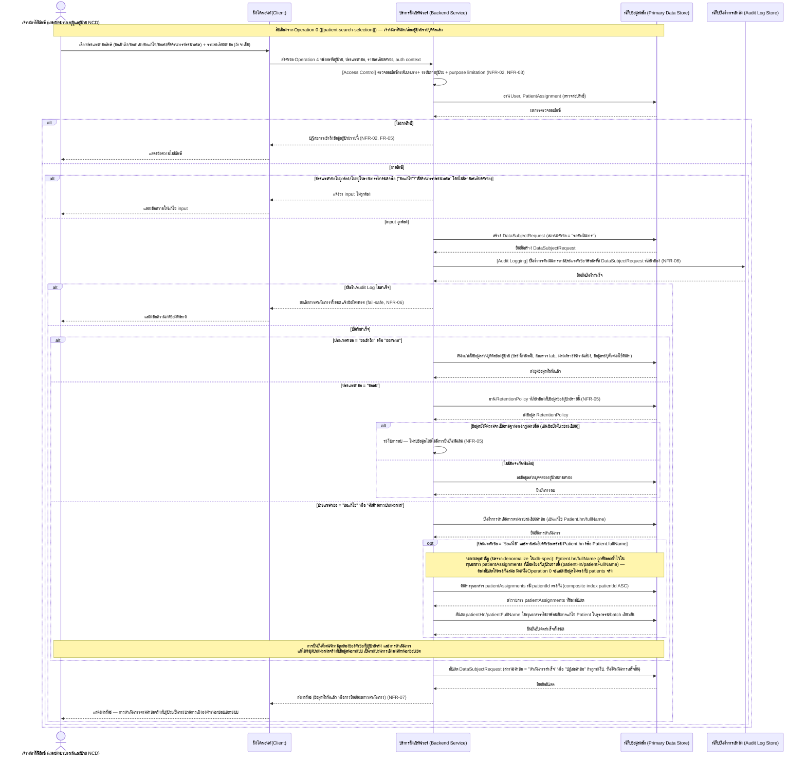
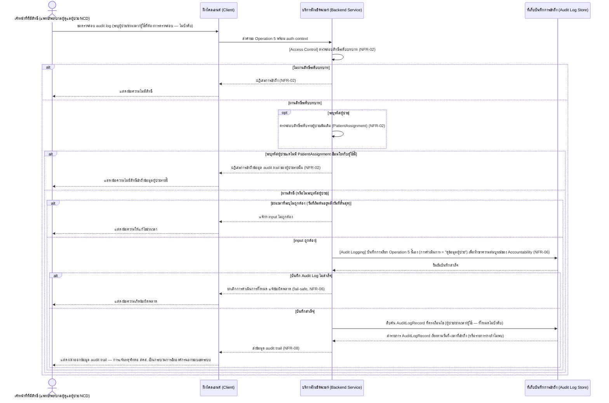
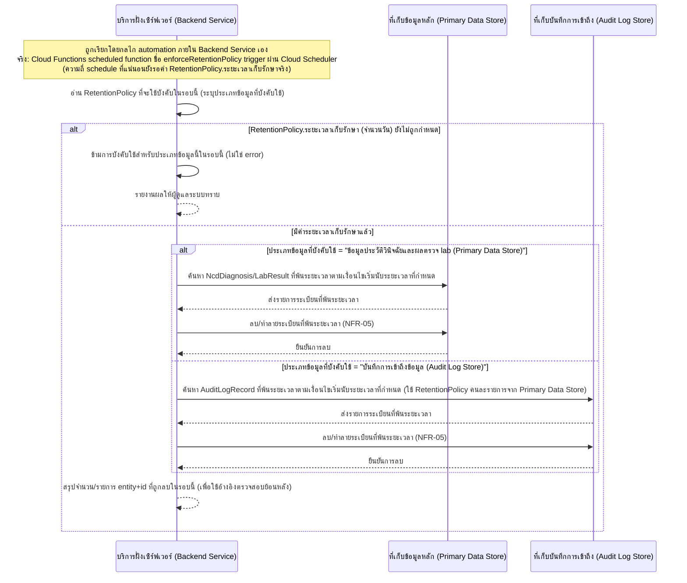
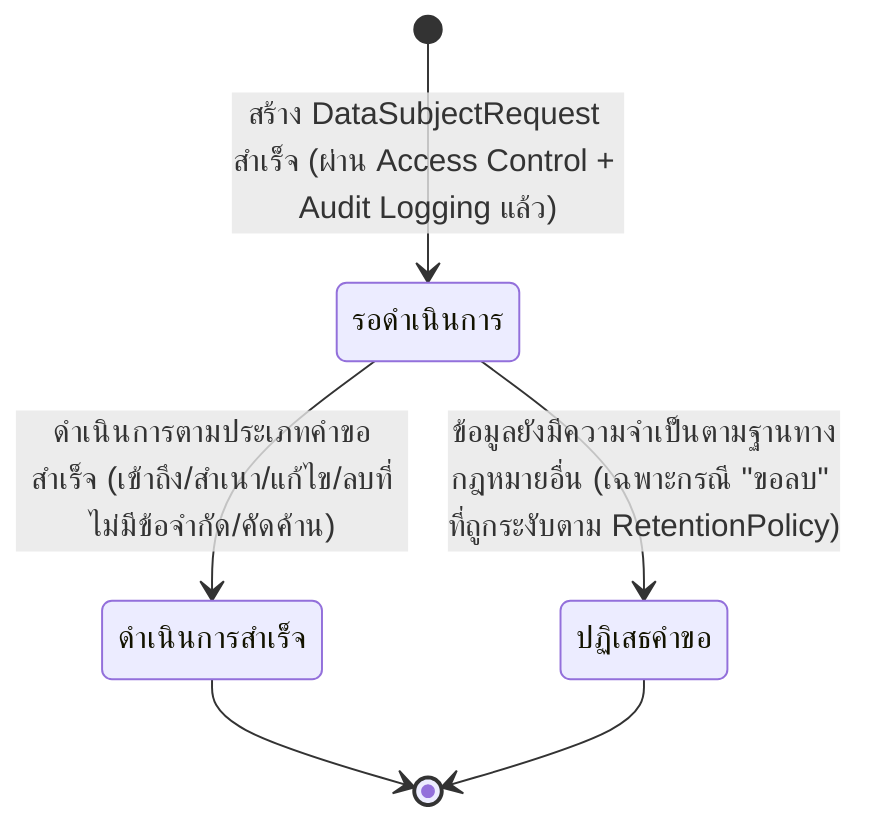

# Detailed Design — คุ้มครองข้อมูลส่วนบุคคลของผู้ป่วยตาม PDPA

เอกสารนี้อธิบายการออกแบบระดับ component (sequence flow, state transition, edge case) ของฟีเจอร์
[[feature-list#4. คุ้มครองข้อมูลส่วนบุคคลของผู้ป่วยตาม PDPA|4. คุ้มครองข้อมูลส่วนบุคคลของผู้ป่วยตาม PDPA]]
(NFR-03–NFR-08) ตาม journey ใน
[[user-journey#Journey เจ้าหน้าที่ดำเนินการตามคำขอใช้สิทธิของเจ้าของข้อมูล และสนับสนุนการสืบสวนกรณีข้อมูลส่วนบุคคลรั่วไหล (PDPA)|Journey เจ้าหน้าที่ดำเนินการตามคำขอใช้สิทธิของเจ้าของข้อมูล และสนับสนุนการสืบสวนกรณีข้อมูลส่วนบุคคลรั่วไหล]]
อ้างอิงสัญญาการทำงานจาก
[[api-spec#Operation 4 — ยื่นและดำเนินการคำขอใช้สิทธิของเจ้าของข้อมูล (Data Subject Rights Request)|Operation 4]],
[[api-spec#Operation 5 — สืบค้นบันทึกการเข้าถึงข้อมูล (Audit Trail Retrieval)|Operation 5]],
[[api-spec#Operation 6 — บังคับใช้นโยบายเก็บรักษาและลบข้อมูลที่พ้นระยะเวลา (Retention Enforcement)|Operation 6]]
และ [[api-spec#Operation ร่วม — บันทึกร่องรอยการเข้าถึงข้อมูลผู้ป่วย (Audit Logging)|Operation ร่วม — Audit Logging]]
และโมเดลข้อมูลจาก [[db-spec#บันทึกการเข้าถึงข้อมูล (AuditLogRecord)|AuditLogRecord]],
[[db-spec#คำขอใช้สิทธิของเจ้าของข้อมูล (DataSubjectRequest)|DataSubjectRequest]] และ
[[db-spec#นโยบายเก็บรักษาและลบข้อมูล (RetentionPolicy)|RetentionPolicy]] ใน [[db-spec]]

**ขอบเขตของเอกสารนี้:** ฟีเจอร์ที่ 4 เป็น cross-cutting concern ตาม
[[architecture#Cross-cutting: การคุ้มครองข้อมูลส่วนบุคคล (PDPA)|architecture]] — ส่วนที่เป็นการบังคับใช้
Audit Logging ระหว่างการเข้าถึงข้อมูลตามปกติของฟีเจอร์ที่ 1–3 (NFR-06) ถูกอธิบายไว้แล้วในสัญญา sequence
diagram ของแต่ละฟีเจอร์นั้นโดยตรง ([[patient-search-selection]], [[patient-ncd-diagnosis-lab-history]],
[[complication-risk-analysis-alert]]) เอกสารนี้จึงเน้นเฉพาะความสามารถที่ยังไม่ถูกอธิบายที่อื่น ได้แก่
Operation 4 (คำขอใช้สิทธิของเจ้าของข้อมูล), Operation 5 (สืบค้น audit trail) และ Operation 6 (บังคับใช้
retention) รวมถึงรายละเอียดของ Operation ร่วม — Audit Logging เอง (NFR-04 การเข้ารหัสข้อมูลเป็น
คุณสมบัติร่วมของทุกช่องทาง/ที่เก็บข้อมูล ไม่ใช่ operation แยก ตาม
[[db-spec#คุณสมบัติร่วม (Cross-cutting Property) — การเข้ารหัสข้อมูล (NFR-04)|db-spec]] จึงไม่มี sequence
diagram แยกสำหรับ NFR-04 ในเอกสารนี้เช่นกัน)

**อัปเดต 2026-09-22 — เสริมรายละเอียดการ implement จริง:** `[[technology-stack]]` มีเนื้อหาแล้ว —
Operation 4, 5 และ Audit Logging ผ่าน Cloud Functions จริงเสมอ (ไม่มีเส้นทาง Client อ่าน Firestore
ตรงแบบ Operation 0) ส่วน Operation 6 ผ่าน **scheduled function** (ไม่ใช่ operation ที่ Client เรียก)
ตาม [[technology-stack#3. สถาปัตยกรรม Backend Service — Firebase-native (ไม่มี Backend Service แยกแบบดั้งเดิม)|decision area 3 ใน technology-stack]]
— ดูหัวข้อ "หมายเหตุการ Implement (จาก technology-stack)" ท้ายเอกสารสำหรับรายละเอียดกลไกจริงทั้งหมด
กลไก trigger จริงของ Operation 6 ยืนยันแล้วว่าใช้ **Cloud Scheduler** แต่ค่าตัวเลขระยะเวลาเก็บรักษาจริง
ของ RetentionPolicy ยังไม่ถูกกำหนด (ดู [[api-spec#ประเด็นรอตัดสินใจ|ประเด็นรอตัดสินใจใน api-spec]] และ
[[db-spec#ประเด็นรอตัดสินใจ|ประเด็นรอตัดสินใจใน db-spec]])

**อัปเดต 2026-09-22 (รอบสอง) — ตรวจสอบความสอดคล้องกับฟีเจอร์ที่ 5 (NFR-09–NFR-16):** ดูหัวข้อใหม่
[[#Cross-cutting: คุณภาพเชิงปฏิบัติการของระบบ (NFR-09–NFR-16)|Cross-cutting: คุณภาพเชิงปฏิบัติการของระบบ]]
ก่อนหัวข้อ Edge Case ด้านล่าง สำหรับผลกระทบของ
[[feature-list#5. รับประกันคุณภาพเชิงปฏิบัติการของระบบ (Performance, Availability, Clinical Safety, Session Security, Accessibility, Compatibility, Interoperability)|ฟีเจอร์ที่ 5]]
ต่อฟีเจอร์นี้ (Operation 4, 5, 6 ไม่มี operation/entity ใหม่จากฟีเจอร์ที่ 5 เช่นเดียวกับฟีเจอร์อื่น)

## Sequence Diagram 1 — คำขอใช้สิทธิของเจ้าของข้อมูล (Operation 4)

สืบเนื่องจาก Operation 0 ([[patient-search-selection]]) ที่เจ้าหน้าที่ค้นหา/เลือกผู้ป่วยรายบุคคลแล้ว
ตามที่ [[api-spec#Operation 4 — ยื่นและดำเนินการคำขอใช้สิทธิของเจ้าของข้อมูล (Data Subject Rights Request)|Operation 4 ใน api-spec]]
กำหนด:

## Sequence Diagram 2 — สืบค้น Audit Trail เพื่อสนับสนุนการสืบสวน/แจ้งเหตุละเมิด (Operation 5)

ตามที่ [[api-spec#Operation 5 — สืบค้นบันทึกการเข้าถึงข้อมูล (Audit Trail Retrieval)|Operation 5 ใน api-spec]]
กำหนด — operation นี้ไม่บังคับต้องระบุรหัสผู้ป่วย จึงมีเส้นทางที่ตรวจสอบเฉพาะระดับบทบาท และเส้นทางที่
ตรวจสอบระดับรายผู้ป่วยเพิ่มเติมเมื่อระบุรหัสผู้ป่วย:

## Sequence Diagram 3 — บังคับใช้นโยบายเก็บรักษาและลบข้อมูลที่พ้นระยะเวลา (Operation 6)

Operation 6 เป็น internal operation ที่ไม่มีผู้ใช้เป็นผู้เรียกโดยตรง (เรียกโดยกลไก automation ของ
Backend Service เอง ตาม
[[api-spec#Operation 6 — บังคับใช้นโยบายเก็บรักษาและลบข้อมูลที่พ้นระยะเวลา (Retention Enforcement)|Operation 6 ใน api-spec]])
กลไก trigger จริงตัดสินใจแล้วว่าเป็น **Cloud Functions scheduled function ผ่าน Cloud Scheduler** ตาม
[[technology-stack#6. Hosting/Deployment Environment|decision area 6 ใน technology-stack]] (ค่าความถี่
schedule ที่แน่นอนยังรอค่า RetentionPolicy จริง — ดู "ประเด็นรอตัดสินใจ") จึงไม่วาด actor ผู้ใช้/
component ตัวกระตุ้นใหม่ที่ไม่มีอยู่ใน [[architecture]]:

หมายเหตุ: การลบตาม Operation 6 (ตามรอบเวลาอัตโนมัติ) แตกต่างจากการลบตามคำขอสิทธิของเจ้าของข้อมูลใน
Sequence Diagram 1 (Operation 4 กรณี "ขอลบ" — การลบตามคำขอเฉพาะราย) ทั้งสอง operation เป็นเส้นทางการ
ลบข้อมูลที่แยกจากกันตาม [[api-spec#Operation 6 — บังคับใช้นโยบายเก็บรักษาและลบข้อมูลที่พ้นระยะเวลา (Retention Enforcement)|Operation 6 ใน api-spec]]

## ตาราง Operation ↔ Entity ที่กระทบ

| ลำดับ | Operation | Entity ที่กระทบ | การกระทำ | หมายเหตุ |
| --- | --- | --- | --- | --- |
| 1 | [[api-spec#Operation ร่วม — ตรวจสอบสิทธิ์การเข้าถึงข้อมูลผู้ป่วย (Access Control)\|Operation ร่วม (role-level + patient-level + purpose limitation)]] | [[db-spec#ผู้ใช้ (User)\|User]], [[db-spec#การมอบหมายผู้ป่วยในความดูแล (PatientAssignment)\|PatientAssignment]] | อ่าน | precondition ของ Operation 4 เสมอ (NFR-02, NFR-03) |
| 2 | [[api-spec#Operation 4 — ยื่นและดำเนินการคำขอใช้สิทธิของเจ้าของข้อมูล (Data Subject Rights Request)\|Operation 4]] | [[db-spec#คำขอใช้สิทธิของเจ้าของข้อมูล (DataSubjectRequest)\|DataSubjectRequest]] | สร้าง | สถานะเริ่มต้น = "รอดำเนินการ" — ต้องสร้างก่อนเรียก Audit Logging เสมอ เพราะ AuditLogRecord ต้องการรหัสคำขอนี้เพื่ออ้างอิง |
| 3 | [[api-spec#Operation ร่วม — บันทึกร่องรอยการเข้าถึงข้อมูลผู้ป่วย (Audit Logging)\|Operation ร่วม — Audit Logging]] | [[db-spec#บันทึกการเข้าถึงข้อมูล (AuditLogRecord)\|AuditLogRecord]] | สร้าง | ระบุ DataSubjectRequest.id ที่เกี่ยวข้อง; ต้องสำเร็จก่อนค้นหา/สกัด/แก้ไข/ลบข้อมูลจริงเสมอ (fail-safe, NFR-06) |
| 4 | [[api-spec#Operation 4 — ยื่นและดำเนินการคำขอใช้สิทธิของเจ้าของข้อมูล (Data Subject Rights Request)\|Operation 4]] (กรณี "ขอเข้าถึง"/"ขอสำเนา") | [[db-spec#ผู้ป่วย (Patient)\|Patient]], [[db-spec#ประวัติการวินิจฉัยโรค NCD (NcdDiagnosis)\|NcdDiagnosis]], [[db-spec#ผลตรวจ lab (LabResult)\|LabResult]], [[db-spec#ผลการประเมินความเสี่ยงโรคแทรกซ้อน (ComplicationRiskAssessment)\|ComplicationRiskAssessment]] (+[[db-spec#รายละเอียดผลการประเมินต่อโรคแทรกซ้อน (RiskFinding)\|RiskFinding]]) | อ่าน | สกัดข้อมูลส่วนบุคคลตามขอบเขตของ [[20260921-01-pdpa-data-protection-compliance#ขอบเขต\|spec PDPA]] |
| 5 | [[api-spec#Operation 4 — ยื่นและดำเนินการคำขอใช้สิทธิของเจ้าของข้อมูล (Data Subject Rights Request)\|Operation 4]] (กรณี "ขอลบ") | [[db-spec#นโยบายเก็บรักษาและลบข้อมูล (RetentionPolicy)\|RetentionPolicy]] | อ่าน | ตรวจสอบว่าข้อมูลยังมีความจำเป็นตามฐานทางกฎหมายอื่นหรือไม่ ก่อนตัดสินใจลบจริง (NFR-05) |
| 6 | [[api-spec#Operation 4 — ยื่นและดำเนินการคำขอใช้สิทธิของเจ้าของข้อมูล (Data Subject Rights Request)\|Operation 4]] (กรณี "ขอลบ" ที่ไม่มีข้อจำกัดเพิ่มเติม) | [[db-spec#ประวัติการวินิจฉัยโรค NCD (NcdDiagnosis)\|NcdDiagnosis]], [[db-spec#ผลตรวจ lab (LabResult)\|LabResult]] (หรือ entity อื่นตามขอบเขตคำขอ) | ลบ | เฉพาะเมื่อไม่มีข้อจำกัดตาม RetentionPolicy/ฐานกฎหมายอื่น (ลำดับ 5) |
| 7 | [[api-spec#Operation 4 — ยื่นและดำเนินการคำขอใช้สิทธิของเจ้าของข้อมูล (Data Subject Rights Request)\|Operation 4]] | [[db-spec#คำขอใช้สิทธิของเจ้าของข้อมูล (DataSubjectRequest)\|DataSubjectRequest]] | แก้ไข | อัปเดตสถานะคำขอ ("ดำเนินการสำเร็จ"/"ปฏิเสธคำขอ") + วันที่ดำเนินการเสร็จสิ้น เมื่อดำเนินการเสร็จสิ้น |
| 7b | [[api-spec#Operation 4 — ยื่นและดำเนินการคำขอใช้สิทธิของเจ้าของข้อมูล (Data Subject Rights Request)\|Operation 4]] (กรณี "ขอแก้ไข" ที่กระทบ Patient.hn/fullName เท่านั้น) | [[db-spec#การมอบหมายผู้ป่วยในความดูแล (PatientAssignment)\|PatientAssignment]] | แก้ไข | **ผลจาก denormalize `patientHn`/`patientFullName` ใน db-spec** — ต้องอัปเดตทุกระเบียนที่มี `patientId` ตรงกันภายใน transaction/batch เดียวกับการแก้ไข Patient เสมอ มิฉะนั้น Operation 0 จะแสดงข้อมูลไม่ตรงกัน (ดู [[db-spec#การมอบหมายผู้ป่วยในความดูแล (PatientAssignment)\|Firestore Technical Binding ของ PatientAssignment ใน db-spec]]) |
| 8 | [[api-spec#Operation ร่วม — ตรวจสอบสิทธิ์การเข้าถึงข้อมูลผู้ป่วย (Access Control)\|Operation ร่วม (role-level)]] | [[db-spec#ผู้ใช้ (User)\|User]] | อ่าน | precondition ของ Operation 5 เสมอ |
| 9 | [[api-spec#Operation ร่วม — ตรวจสอบสิทธิ์การเข้าถึงข้อมูลผู้ป่วย (Access Control)\|Operation ร่วม (patient-level, ถ้าระบุรหัสผู้ป่วย)]] | [[db-spec#การมอบหมายผู้ป่วยในความดูแล (PatientAssignment)\|PatientAssignment]] | อ่าน | ตรวจสอบเพิ่มเติมเฉพาะเมื่อ Operation 5 ระบุรหัสผู้ป่วย |
| 10 | [[api-spec#Operation ร่วม — บันทึกร่องรอยการเข้าถึงข้อมูลผู้ป่วย (Audit Logging)\|Operation ร่วม — Audit Logging]] | [[db-spec#บันทึกการเข้าถึงข้อมูล (AuditLogRecord)\|AuditLogRecord]] | สร้าง | บันทึกการเรียก Operation 5 เอง (การดำเนินการ = "ดูข้อมูลผู้ป่วย") เพื่อรักษา Accountability (NFR-06) |
| 11 | [[api-spec#Operation 5 — สืบค้นบันทึกการเข้าถึงข้อมูล (Audit Trail Retrieval)\|Operation 5]] | [[db-spec#บันทึกการเข้าถึงข้อมูล (AuditLogRecord)\|AuditLogRecord]] | อ่าน | สืบค้นตามเงื่อนไข (ผู้ป่วย/ช่วงเวลา/ผู้ใช้ — ทั้งหมดไม่บังคับ) เรียงตามวันที่-เวลาที่เข้าถึง |
| 12 | [[api-spec#Operation 6 — บังคับใช้นโยบายเก็บรักษาและลบข้อมูลที่พ้นระยะเวลา (Retention Enforcement)\|Operation 6]] | [[db-spec#นโยบายเก็บรักษาและลบข้อมูล (RetentionPolicy)\|RetentionPolicy]] | อ่าน | อ่านนโยบายที่จะบังคับใช้ในรอบนี้ก่อนเสมอ |
| 13 | [[api-spec#Operation 6 — บังคับใช้นโยบายเก็บรักษาและลบข้อมูลที่พ้นระยะเวลา (Retention Enforcement)\|Operation 6]] | [[db-spec#ประวัติการวินิจฉัยโรค NCD (NcdDiagnosis)\|NcdDiagnosis]], [[db-spec#ผลตรวจ lab (LabResult)\|LabResult]] | ลบ | เมื่อประเภทข้อมูลที่บังคับใช้ = Primary Data Store และระเบียนพ้นระยะเวลาที่ RetentionPolicy กำหนด |
| 14 | [[api-spec#Operation 6 — บังคับใช้นโยบายเก็บรักษาและลบข้อมูลที่พ้นระยะเวลา (Retention Enforcement)\|Operation 6]] | [[db-spec#บันทึกการเข้าถึงข้อมูล (AuditLogRecord)\|AuditLogRecord]] | ลบ | เมื่อประเภทข้อมูลที่บังคับใช้ = Audit Log Store และระเบียนพ้นระยะเวลาที่ RetentionPolicy กำหนด (นโยบายคนละรายการจาก Primary Data Store) |

## ข้อกำหนด: การจำกัด/ล้างข้อมูลผู้ป่วยที่ละเอียดอ่อนฝั่ง Client (NFR-02)

ตามหลักการที่กำหนดไว้ใน
[[patient-search-selection#ข้อกำหนด: การจำกัด/ล้างข้อมูลผู้ป่วยที่ละเอียดอ่อนฝั่ง Client (NFR-02)|patient-search-selection]],
[[patient-ncd-diagnosis-lab-history#ข้อกำหนด: การจำกัด/ล้างข้อมูลผู้ป่วยที่ละเอียดอ่อนฝั่ง Client (NFR-02)|patient-ncd-diagnosis-lab-history]],
[[complication-risk-analysis-alert#ข้อกำหนด: การจำกัด/ล้างข้อมูลผู้ป่วยที่ละเอียดอ่อนฝั่ง Client (NFR-02)|complication-risk-analysis-alert]]
และ [[architecture#ตาราง Mapping NFR ไปยัง Component|architecture — ตาราง Mapping NFR (แถว NFR-02)]] —
ผลลัพธ์ที่ Sequence Diagram 1 (Operation 4 กรณี "ขอเข้าถึง"/"ขอสำเนา") ส่งให้ Client แสดงแก่เจ้าหน้าที่
(ขั้นตอน `Backend-->>Client: ส่งผลลัพธ์ (ข้อมูลที่สกัดแล้ว หรือการยืนยันผลการดำเนินการ)`) เป็นชุดข้อมูล
ส่วนบุคคลของผู้ป่วยที่ละเอียดอ่อนเช่นเดียวกับที่ฟีเจอร์ที่ 1–3 แสดง (ประวัติวินิจฉัย, ผลตรวจ lab, ผล
วิเคราะห์ความเสี่ยง, ข้อมูลระบุตัวตนที่ใช้ค้นหา) จึงต้องยึดหลักการเดียวกันนี้แม้เป็นการกระทำครั้งเดียว
ตามคำขอสิทธิที่มี Audit Log กำกับไว้แล้วทุกครั้ง (ต่างจาก flow การแสดงผลต่อเนื่องข้ามหน้าจอของฟีเจอร์ที่
1–3 ซึ่งมีความเสี่ยงคงค้างสูงกว่า):

- Client แสดงชุดข้อมูลที่สกัดแล้วนี้เฉพาะเท่าที่จำเป็นต่อการให้เจ้าหน้าที่ตรวจสอบผลลัพธ์ของคำขอสิทธิ
  ครั้งนั้นในหน้าจอปัจจุบันเท่านั้น ไม่เก็บ/cache ไว้ข้ามหน้าจออื่นที่ไม่เกี่ยวข้อง
- เมื่อเจ้าหน้าที่ออกจากหน้าจอแสดงผลลัพธ์นี้ไปยังหน้าจออื่นโดยยังไม่ปิดงาน, ยื่นคำขอสิทธิใหม่ (เรียก
  Operation 4 ครั้งใหม่) แทนที่ผลลัพธ์เดิม, หรือออกจากระบบ (logout) — Client ต้องล้างชุดข้อมูลส่วนบุคคล
  ที่สกัดแล้วนี้ทันที ไม่คงค้างในสถานะที่ยังเข้าถึงได้ต่อเนื่องเกินความจำเป็น
- รายละเอียดกลไกจริงที่ใช้จำกัด/ล้างข้อมูล ยังไม่ถูกกำหนดในระดับนี้ เพราะ `[[technology-stack]]` ไม่ได้
  ระบุกลไก state management เฉพาะเจาะจงสำหรับความสามารถนี้ (เช่นเดียวกับที่ระบุไว้ใน
  [[patient-search-selection#หมายเหตุการ Implement (จาก technology-stack)|patient-search-selection]])
  — เอกสารนี้กำหนดเฉพาะหลักการเชิงพฤติกรรมที่การออกแบบ/พัฒนาต่อไปด้วย React + TypeScript ต้องรองรับ
  เท่านั้น

## State Diagram — สถานะคำขอใช้สิทธิของเจ้าของข้อมูล (DataSubjectRequest)

ตาม [[db-spec#คำขอใช้สิทธิของเจ้าของข้อมูล (DataSubjectRequest)|DataSubjectRequest ใน db-spec]]
attribute "สถานะคำขอ" มีค่าที่กำหนดไว้ล่วงหน้า 3 ค่า ("รอดำเนินการ", "ดำเนินการสำเร็จ", "ปฏิเสธคำขอ")
ไม่มี state ย่อยเพิ่มเติมที่ db-spec รองรับ (เช่น ไม่มีสถานะ "กำลังดำเนินการ" แยกต่างหาก เพราะ
Operation 4 ประมวลผลคำขอแบบ synchronous ในคำขอเดียวตามที่ออกแบบไว้ในเอกสารนี้):

หมายเหตุ: เอกสารนี้ไม่ออกแบบ state เพิ่มเติมสำหรับการอุทธรณ์/แก้ไขคำขอที่ถูกปฏิเสธ เพราะ db-spec ไม่มี
attribute ใดรองรับ (ไม่ใช่ gap ของ db-spec — spec ต้นทางไม่ได้ระบุกระบวนการนี้) ถ้าต้องการรองรับ
ต้องเพิ่ม operation/attribute ใหม่ใน api-spec/db-spec ก่อน (แนะนำให้รัน `sync-api-db` ถ้าต้องการ)

**หมายเหตุเทคโนโลยีจริง (Firestore field mapping):** state diagram นี้สะท้อนค่า Firestore field
`status` (string) บนเอกสาร `dataSubjectRequests/{requestId}` ตรงตัว 1:1 — ทั้งสามค่า `"รอดำเนินการ"`,
`"ดำเนินการสำเร็จ"`, `"ปฏิเสธคำขอ"` เป็นค่าตัวอักษรจริงที่เก็บใน field นี้ (ไม่มีการแปลงค่า/mapping
เพิ่มเติม) ตาม [[db-spec#คำขอใช้สิทธิของเจ้าของข้อมูล (DataSubjectRequest)|Firestore Technical Binding
ของ DataSubjectRequest ใน db-spec]]

## Cross-cutting: คุณภาพเชิงปฏิบัติการของระบบ (NFR-09–NFR-16)

เช่นเดียวกับที่ [[patient-search-selection#Cross-cutting: คุณภาพเชิงปฏิบัติการของระบบ (NFR-09–NFR-16)|patient-search-selection]]
อธิบายไว้ [[feature-list#5. รับประกันคุณภาพเชิงปฏิบัติการของระบบ (Performance, Availability, Clinical Safety, Session Security, Accessibility, Compatibility, Interoperability)|ฟีเจอร์ที่ 5]]
ไม่ต้องการ operation/component ใหม่ ฟีเจอร์นี้จึงไม่มี sequence/state diagram แยกสำหรับฟีเจอร์ที่ 5 —
บันทึกเฉพาะผลกระทบต่อ sequence/state diagram ที่มีอยู่แล้วด้านบน:

- **Session Timeout (NFR-12):** การตรวจสอบสิทธิ์ระดับบทบาท + ระดับรายผู้ป่วย (ลำดับ 1 และ 8-9 ในตาราง
  ด้านบน) เป็นจุดเดียวกันที่ปฏิเสธคำขอ Operation 4/5 ได้ทันทีหากผู้ใช้ถูก auto-logout ไปแล้วจากการ
  idle เกิน 30 นาที เช่นเดียวกับที่ [[patient-search-selection]] อธิบายไว้ — journey ที่สองของ
  เอกสารนี้ (คำขอสิทธิ/สืบสวนข้อมูลรั่วไหล) ถูก trigger จากเหตุการณ์ภายนอกไม่ต่อเนื่องกับ journey หลัก
  จึงมีโอกาสเจอ session timeout สูงกว่าปกติ (ผู้ใช้เปิดหน้าจอทิ้งไว้รอเหตุการณ์)
- **Performance < 2 วินาที (NFR-09):** Operation 4 และ Operation 5 ต้องตอบสนองภายในเวลานี้เช่นกัน
  (Operation 6 เป็น scheduled function ไม่มีผู้ใช้รอผลจึงไม่อยู่ในขอบเขต NFR-09) — composite index
  `(patientId ASC, requestedAt DESC)` (Operation 4) และ 4 composite index ของ `auditLogRecords`
  (Operation 5 — ดู [[db-spec#บันทึกการเข้าถึงข้อมูล (AuditLogRecord)|db-spec]]) คือกลไกหลักที่รองรับ
  ข้อกำหนดนี้
- **Security Rules Verification (NFR-14):** Firestore Security Rules ของ `dataSubjectRequests` และ
  `retentionPolicies` (`allow read, write: if false;` สำหรับ Client ทั้งหมด) รวมถึง `auditLogRecords`
  (immutable — ดู Sequence Diagram 1-3 ด้านบน) ต้องอยู่ในชุด automated test ผ่าน Firebase Emulator
  Suite เช่นกัน (ดู [[db-spec#คุณสมบัติร่วม (Cross-cutting Property) — Security Rules Verification (NFR-14)|db-spec]])
- **Browser/Device Compatibility (NFR-15):** หน้าจอยื่นคำขอสิทธิ/แสดงผลลัพธ์/สืบค้น audit trail ต้อง
  แสดงผลถูกต้องบน browser หลักเวอร์ชันล่าสุด (Chrome/Edge/Firefox) บน desktop/tablet เช่นเดียวกับทุก
  หน้าจอในระบบ
- **Availability (NFR-10), Clinical Safety Validation (NFR-11), Accessibility (NFR-13),
  Interoperability (NFR-16):** ไม่กระทบฟีเจอร์นี้โดยตรง — NFR-11/NFR-13 กระทบเฉพาะ Operation 3 (ดู
  [[complication-risk-analysis-alert]]), NFR-10/NFR-16 เป็นคุณสมบัติระดับ infrastructure/อนาคตที่ไม่
  ผูกกับ operation ใด

## Edge Case และวิธีจัดการ

| Edge Case | วิธีจัดการ | อ้างอิง |
| --- | --- | --- |
| ไม่มีสิทธิ์เข้าถึง (Operation 4 — บทบาทไม่ถูกต้อง หรือผู้ป่วยรายนี้ไม่ได้อยู่ในความดูแลของผู้ใช้ตาม PatientAssignment) | ปฏิเสธการเข้าถึงข้อมูลผู้ป่วยรายนี้ ก่อนสร้าง DataSubjectRequest ใดๆ | [[backlog#Non-Functional Requirements\|NFR-02]], [[backlog#สูง (MVP)\|FR-05]] |
| ผู้ใช้ถูก auto-logout เนื่องจากไม่มีการใช้งาน (inactivity) เกิน 30 นาที (NFR-12) แล้วส่งคำขอ Operation 4/5 โดยไม่มี auth context ที่ถูกต้องแนบมา | ปฏิเสธการเข้าถึงที่ step ตรวจสอบสิทธิ์เช่นเดียวกับกรณีไม่มีสิทธิ์เข้าถึงข้างต้น — Client นำผู้ใช้กลับไปหน้าจอเข้าสู่ระบบใหม่ | [[backlog#Non-Functional Requirements\|NFR-12]] |
| ไม่พบผู้ป่วยตามรหัสที่ระบุ (Operation 4) | แจ้งว่าไม่พบผู้ป่วย หยุดก่อนสร้าง DataSubjectRequest | [[db-spec#ผู้ป่วย (Patient)\|Patient]] |
| ประเภทคำขอไม่ถูกต้อง/ไม่อยู่ในรายการที่กำหนด หรือระบุ "ขอแก้ไข"/"คัดค้านการประมวลผล" โดยไม่มีรายละเอียดคำขอ (Operation 4) | แจ้งว่า input ไม่ถูกต้อง ไม่สร้าง DataSubjectRequest | [[api-spec#Operation 4 — ยื่นและดำเนินการคำขอใช้สิทธิของเจ้าของข้อมูล (Data Subject Rights Request)\|Operation 4]] |
| บันทึก Audit Log ไม่สำเร็จ (Operation 4 หรือ Operation 5) | ยกเลิกการดำเนินการทั้งหมดที่เรียกใช้ ไม่ค้นหา/สกัด/แก้ไข/ลบข้อมูลจริง แจ้งข้อผิดพลาดแก่ผู้ใช้ (fail-safe) | [[backlog#Non-Functional Requirements\|NFR-06]], [[api-spec#Operation ร่วม — บันทึกร่องรอยการเข้าถึงข้อมูลผู้ป่วย (Audit Logging)\|Operation ร่วม — Audit Logging]] |
| คำขอ "ขอลบ" แต่ข้อมูลยังมีความจำเป็นตามฐานทางกฎหมายอื่น (เช่น ข้อบังคับเวชระเบียน) | ไม่ลบข้อมูลโดยไม่มีการยืนยันเพิ่มเติม, อัปเดต DataSubjectRequest.สถานะคำขอ = "ปฏิเสธคำขอ" | [[backlog#Non-Functional Requirements\|NFR-05]], [[db-spec#นโยบายเก็บรักษาและลบข้อมูล (RetentionPolicy)\|RetentionPolicy]] |
| ระบุรหัสผู้ป่วยที่ไม่มี PatientAssignment เชื่อมโยงกับผู้ใช้นี้ (Operation 5) | ปฏิเสธการเข้าถึงข้อมูล audit trail ของผู้ป่วยรายนั้น (ไม่กระทบการสืบค้นแบบไม่ระบุผู้ป่วย) | [[backlog#Non-Functional Requirements\|NFR-02]] |
| ช่วงเวลาที่ระบุไม่ถูกต้อง (วันที่เริ่มต้นอยู่หลังวันที่สิ้นสุด) (Operation 5) | แจ้งว่า input ไม่ถูกต้อง — ไม่เรียก Audit Log Store จนกว่าจะแก้ไขช่วงเวลา | [[api-spec#Operation 5 — สืบค้นบันทึกการเข้าถึงข้อมูล (Audit Trail Retrieval)\|Operation 5]] |
| ไม่พบบันทึกที่ตรงเงื่อนไขการสืบค้น (Operation 5) | คืนรายการว่าง ไม่ถือเป็น error | [[api-spec#Operation 5 — สืบค้นบันทึกการเข้าถึงข้อมูล (Audit Trail Retrieval)\|Operation 5]] |
| RetentionPolicy ที่ระบุไม่มีค่าระยะเวลาเก็บรักษา (ยังไม่ถูกกำหนด) (Operation 6) | ข้ามการบังคับใช้สำหรับประเภทข้อมูลนั้นในรอบนี้ (ไม่ใช่ error) รายงานให้ผู้ดูแลระบบทราบ | [[backlog#Non-Functional Requirements\|NFR-05]], [[db-spec#นโยบายเก็บรักษาและลบข้อมูล (RetentionPolicy)\|RetentionPolicy]] |
| เจ้าหน้าที่ออกจากหน้าจอแสดงผลลัพธ์คำขอ "ขอเข้าถึง"/"ขอสำเนา" (Operation 4) ไปยังหน้าจออื่น, ยื่นคำขอสิทธิใหม่แทนที่ผลลัพธ์เดิม, หรือออกจากระบบ (logout) | Client ล้างชุดข้อมูลส่วนบุคคลที่สกัดแล้วที่เคยแสดงไว้ทันที ไม่เก็บ/cache ไว้เกินความจำเป็น (NFR-02) | [[architecture#ตาราง Mapping NFR ไปยัง Component\|architecture — ตาราง Mapping NFR แถว NFR-02]] |

## หมายเหตุการ Implement (จาก technology-stack)

- **Operation 4:** Cloud Functions (2nd gen, Node.js + TypeScript) — **HTTPS Callable Function ชื่อ
  `submitDataSubjectRequest`** — เขียน/อัปเดต `dataSubjectRequests/{requestId}` ผ่าน Admin SDK ตาม
  [[api-spec#Operation 4 — ยื่นและดำเนินการคำขอใช้สิทธิของเจ้าของข้อมูล (Data Subject Rights Request)|Technical Binding ของ Operation 4 ใน api-spec]]
  — **ข้อกำหนดเพิ่มเติมสำคัญ:** กรณี "ขอแก้ไข" ที่กระทบ `Patient.hn`/`Patient.fullName` ฟังก์ชันนี้
  **ต้อง**ค้นหา `patientAssignments` ทุกรายการที่มี `patientId` ตรงกัน (composite index `(patientId
  ASC)`) แล้วอัปเดต `patientHn`/`patientFullName` ให้ตรงกันภายใน transaction/batch เดียวกับการแก้ไข
  `patients/{patientId}` เสมอ (ดูลำดับ 7b ในตารางด้านบนและ sequence diagram 1)
- **Operation 5:** HTTPS Callable Function ชื่อ **`getAuditTrail`** — สืบค้น `auditLogRecords` ผ่าน
  Admin SDK ด้วย composite index ที่ตรงกับเงื่อนไขที่ระบุ (ผู้ป่วย/ผู้ใช้/ช่วงเวลา — ผสมกันได้ 4 แบบ)
  ตาม [[db-spec#บันทึกการเข้าถึงข้อมูล (AuditLogRecord)|Firestore Technical Binding ของ
  AuditLogRecord ใน db-spec]] สำหรับรายการ composite index ทั้งหมด
- **Operation 6:** ไม่ใช่ HTTPS Callable Function — เป็น **scheduled function ชื่อ
  `enforceRetentionPolicy` trigger ผ่าน Cloud Scheduler** อ่าน `retentionPolicies` แล้วลบระเบียนที่
  พ้นระยะเวลาใน `ncdDiagnoses`/`labResults`/`auditLogRecords` ผ่าน Admin SDK ตาม
  [[api-spec#Operation 6 — บังคับใช้นโยบายเก็บรักษาและลบข้อมูลที่พ้นระยะเวลา (Retention Enforcement)|Technical Binding ของ Operation 6 ใน api-spec]]
  — ไม่มี caller แบบ synchronous จึงไม่มี `HttpsError` ในเส้นทางนี้ (บันทึก log ภายในแทน)
- **Audit Logging ที่ใช้ร่วมกันทุก operation ในเอกสารนี้:** เขียนผ่าน **Firebase Admin SDK เท่านั้น**
  (bypass Security Rules) ลง `auditLogRecords` — Security Rules: `allow read, write: if false;`
  สำหรับ Client ทั้งหมด ตาม
  [[technology-stack#5. Audit Log Store — Cloud Firestore collection แยก เขียนผ่าน Cloud Functions เท่านั้น|decision area 5 ใน technology-stack]]
- **Error code จริงต่อ operation:**
  - Operation 4: ปฏิเสธการเข้าถึง → `permission-denied`; ไม่พบผู้ป่วย → `not-found`; ประเภทคำขอไม่
    ถูกต้อง/ขาดรายละเอียดที่จำเป็น → `invalid-argument`; บันทึก Audit Log ไม่สำเร็จ → `internal`
  - Operation 5: ปฏิเสธการเข้าถึงระดับบทบาท/ระดับรายผู้ป่วย → `permission-denied`; ช่วงเวลาไม่ถูกต้อง
    → `invalid-argument`
  - Operation 6: RetentionPolicy ไม่มีค่าระยะเวลา → ข้ามการบังคับใช้ + บันทึก log ภายใน (ไม่ใช่
    HttpsError)
- **NFR-04 (การเข้ารหัส):** Google-managed encryption keys (ค่าเริ่มต้นของ Firestore) สำหรับ at rest
  ทุก collection ในเอกสารนี้ + HTTPS/TLS บังคับโดย Firebase Hosting/Cloud Functions สำหรับ in transit
  ตาม [[technology-stack#8. กลไกเข้ารหัสข้อมูล (NFR-04) และการบริหารกุญแจเข้ารหัส|decision area 8 ใน technology-stack]]
  — ยังไม่มี CMEK/field-level encryption เพิ่มเติม (ดู "ประเด็นรอตัดสินใจ" ของ technology-stack)

## ความสัมพันธ์กับฟีเจอร์อื่น (Cross-cutting integration)

- [[patient-search-selection]] (Operation 0) — เป็น precondition ของ Operation 4 เช่นเดียวกับฟีเจอร์ที่
  1 และ 2 (ใช้ความสามารถค้นหา/เลือกผู้ป่วยเดียวกัน ตาม NFR-07)
- [[patient-ncd-diagnosis-lab-history]] และ [[complication-risk-analysis-alert]] — ทั้งสองไฟล์ถูก
  ปรับปรุงให้เรียก [[api-spec#Operation ร่วม — บันทึกร่องรอยการเข้าถึงข้อมูลผู้ป่วย (Audit Logging)|Operation ร่วม — Audit Logging]]
  ก่อนอ่านข้อมูลผู้ป่วยจริงเสมอ (NFR-06) — ดูรายละเอียดขั้นตอนที่ไฟล์เหล่านั้นโดยตรง เอกสารนี้ไม่ซ้ำ
  sequence diagram ของทั้งสองไฟล์
- การเข้ารหัสข้อมูล (NFR-04) เป็นคุณสมบัติร่วมที่บังคับใช้กับทุก entity ที่มีข้อมูลส่วนบุคคล/สุขภาพ
  ของผู้ป่วยในทุกฟีเจอร์ (1–4) ตาม [[db-spec#คุณสมบัติร่วม (Cross-cutting Property) — การเข้ารหัสข้อมูล (NFR-04)|db-spec]]
  ไม่มี sequence step แยกในเอกสารใดของ detailed-design/ เพราะไม่ใช่ operation ที่ประมวลผลได้ด้วยตัวเอง

## ประเด็นรอตัดสินใจ (สืบทอดจาก api-spec/db-spec — ไม่ใช่การตัดสินใจใหม่ของเอกสารนี้)

- กระบวนการยืนยันตัวตน/ความถูกต้องของคำขอจากผู้ป่วยก่อนที่เจ้าหน้าที่จะยื่น Operation 4 ในระบบ ยังไม่ถูก
  ยืนยันจากผู้ใช้ (ดู [[api-spec#ประเด็นรอตัดสินใจ|ประเด็นรอตัดสินใจใน api-spec]])
- บทบาทที่ควรเรียก Operation 5 ได้ — ปัจจุบันใช้บทบาทเดียวกับที่เข้าถึงข้อมูลผู้ป่วยได้ (แพทย์/พยาบาล)
  ควรให้ผู้ใช้ยืนยันว่าจำเป็นต้องจำกัดเพิ่มเติม (เช่น ผู้ดูแลระบบ/DPO) หรือไม่ (ดู
  [[db-spec#ประเด็นรอตัดสินใจ|ประเด็นรอตัดสินใจใน db-spec]])
- ค่าระยะเวลาเก็บรักษาจริง (จำนวนวัน) ของ RetentionPolicy ยังไม่ถูกกำหนด (ดู
  [[api-spec#ประเด็นรอตัดสินใจ|ประเด็นรอตัดสินใจใน api-spec]]) — กลไก trigger จริงของ Operation 6
  ตัดสินใจแล้ว (Cloud Functions scheduled function ผ่าน Cloud Scheduler) แต่ความถี่ schedule จริงยัง
  รอค่าระยะเวลานี้ก่อน
- ฐานทางกฎหมาย (lawful basis) ที่ชัดเจนของ purpose limitation (NFR-03) ยังไม่ถูกยืนยันจากฝ่ายกฎหมาย/DPO
  (ดู [[architecture#ประเด็นรอตัดสินใจอื่น (ไม่เกี่ยวกับ technology stack)|ประเด็นรอตัดสินใจอื่นใน architecture]])
- นิยาม "เซสชันเดียวกัน" ที่ใช้ตัดสินว่า Audit Log หนึ่งรายการครอบคลุมการเข้าถึงหลาย operation ต่อเนื่องกัน
  (ตามที่ [[patient-ncd-diagnosis-lab-history]] และ [[complication-risk-analysis-alert]] อ้างอิง) ยังไม่
  ถูกกำหนดในระดับ logical แม้ `[[technology-stack]]` จะมีเนื้อหาแล้ว เพราะไม่ได้ระบุนิยาม "เซสชัน" ไว้
  โดยตรง (ไม่มีการจัดการ server-side session state แบบดั้งเดิมใน Firebase-native architecture — แต่ละ
  callable function call เป็น stateless) จุดนี้จึงยังต้องให้ผู้ใช้/การออกแบบระดับ implementation จริง
  ยืนยันเพิ่มเติมว่าจะระบุขอบเขต "ครั้งเดียวกัน" นี้ด้วยกลไกใด (เช่น client-side request grouping)

## เอกสารที่เกี่ยวข้อง

- [[api-spec]]
- [[db-spec]]
- [[architecture]]
- [[technology-stack]]
- [[feature-list]]
- [[user-journey]]
- [[backlog]]
- [[20260921-01-pdpa-data-protection-compliance]]
- [[20260922-01-operational-quality-nfr]]
- [[patient-search-selection]]
- [[patient-ncd-diagnosis-lab-history]]
- [[complication-risk-analysis-alert]]
