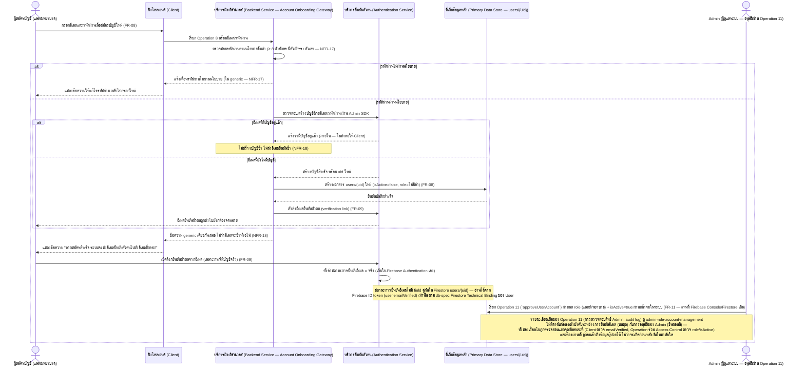
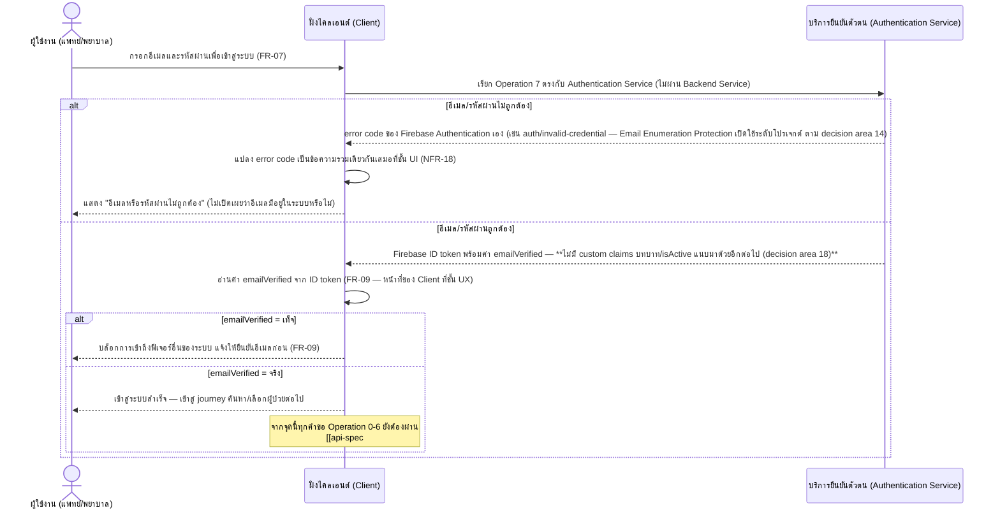
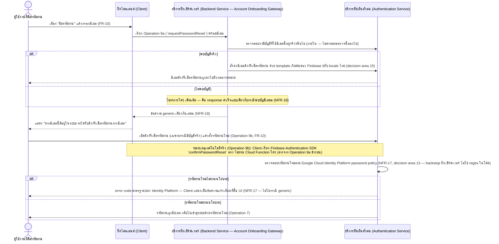
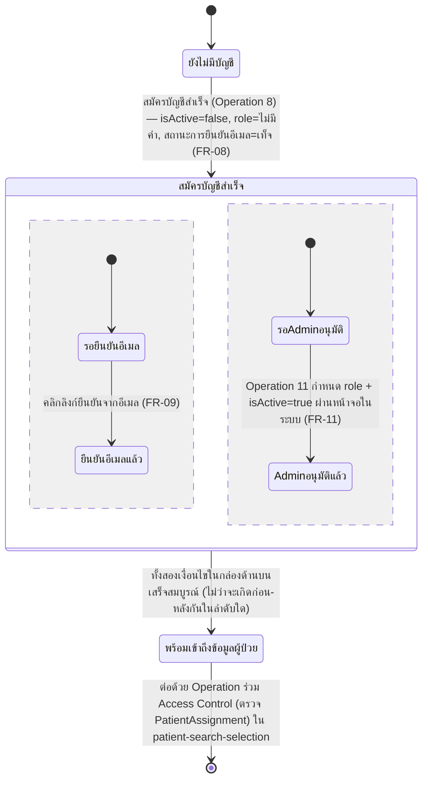

# Detailed Design — สมัครบัญชี เข้าสู่ระบบ และจัดการรหัสผ่านด้วยอีเมล (Authentication)

เอกสารนี้อธิบายการออกแบบระดับ component (sequence flow, state transition, edge case) ของฟีเจอร์
[[feature-list#6. สมัครบัญชี เข้าสู่ระบบ และจัดการรหัสผ่านด้วยอีเมล (Authentication)|6. สมัครบัญชี เข้าสู่ระบบ และจัดการรหัสผ่านด้วยอีเมล (Authentication)]]
(FR-07–FR-10, NFR-17, NFR-18) ตาม journey ใน
[[user-journey#Journey: ผู้ใช้งานสมัครบัญชี เข้าสู่ระบบ และจัดการรหัสผ่านด้วยอีเมล (Authentication)|Journey: ผู้ใช้งานสมัครบัญชี เข้าสู่ระบบ และจัดการรหัสผ่านด้วยอีเมล]]
อ้างอิงสัญญาการทำงานจาก
[[api-spec#Operation 7 — เข้าสู่ระบบด้วยอีเมลและรหัสผ่าน|Operation 7]],
[[api-spec#Operation 8 — สมัครบัญชีผู้ใช้งานด้วยตนเอง (Self Sign-up)|Operation 8]],
[[api-spec#Operation 9 — ขอรีเซ็ตรหัสผ่านทางอีเมล (Forgot Password)|Operation 9]] และหัวข้อ
[[api-spec#Cross-cutting: Authentication ที่ครอบคลุมทุก Operation หลัง Login (FR-07–FR-10, NFR-17, NFR-18)|Cross-cutting: Authentication]]
รวมถึงโมเดลข้อมูลจาก [[db-spec#ผู้ใช้ (User)|User]] ใน [[db-spec]] (โดยเฉพาะ attribute `อีเมล`,
`รหัสผ่านที่จัดเก็บ`, `สถานะการยืนยันอีเมล`, `บทบาท` แบบไม่บังคับ, `สถานะการใช้งานบัญชี`)

**ขอบเขตของเอกสารนี้:** ฟีเจอร์ที่ 6 เป็น **precondition ก่อนฟีเจอร์ที่ 1-5 ทั้งหมด** (ไม่ใช่ cross-cutting
ที่แทรกอยู่ใน sequence diagram ของฟีเจอร์อื่นเหมือนฟีเจอร์ที่ 4/5 — ดู
[[api-spec#Cross-cutting: Authentication ที่ครอบคลุมทุก Operation หลัง Login (FR-07–FR-10, NFR-17, NFR-18)|Cross-cutting Authentication ใน api-spec]])
เอกสารนี้จึงอธิบายลำดับขั้นตอนตั้งแต่ยังไม่มีบัญชีจนถึงจุดที่ได้ auth context ที่ถูกต้องพร้อมเข้าสู่
[[patient-search-selection#State Diagram — สถานะการตรวจสอบสิทธิ์และการเลือกผู้ป่วย|State Diagram ตรวจสอบสิทธิ์ของ patient-search-selection]]
ต่อไป (การตรวจสอบ role/isActive/PatientAssignment หลังจากจุดนั้นไม่ได้ถูกอธิบายซ้ำในเอกสารนี้)

**แก้ไข 2026-09-24 (รอบ sync ที่หก) — การอนุมัติบัญชีเปลี่ยนจาก Firebase Console เป็น Operation 11:**
เดิมหัวข้อนี้เคยระบุว่า "ผู้ดูแลระบบ (system administrator) ดำเนินการอนุมัติบัญชีผ่าน Firebase
Console/Firestore โดยตรง ไม่ใช่ operation ในเอกสารนี้" — ข้อความนี้**ถูกแทนที่แล้ว**โดย
[[20260924-01-admin-role-account-management]] (FR-11): การอนุมัติบัญชี (กำหนด role + `isActive=true`)
ดำเนินการโดยบทบาท **Admin** ผ่านหน้าจอในระบบ เรียก
[[api-spec#Operation 11 — อนุมัติบัญชีผู้ใช้งานใหม่ผ่านหน้าจอในระบบ|Operation 11]] แทนแล้ว — ดู sequence
diagram ฉบับเต็มฝั่ง Admin ที่
[[admin-role-account-management#Sequence Diagram 1 — Admin ดูรายชื่อและอนุมัติบัญชีที่รอการอนุมัติ (Operation 10 + Operation 11)|admin-role-account-management]]
sequence diagram ด้านล่างของเอกสารนี้ยังคงแสดง actor "ผู้ดูแลระบบ" ไว้เพื่อความสมบูรณ์ของลำดับเหตุการณ์
จากมุมมองผู้สมัครบัญชีเท่านั้น (ไม่ซ้ำรายละเอียด Operation 11 ที่นี่) — **เฉพาะบัญชี Admin คนแรก/bootstrap
เท่านั้น**ที่ยังคงตั้งผ่าน Firebase Console/Firestore โดยตรง อยู่นอกขอบเขตของทั้งสองเอกสารนี้

## Sequence Diagram — สมัครบัญชี ยืนยันอีเมล และรออนุมัติ (Operation 8, FR-08/FR-09)

## Sequence Diagram — เข้าสู่ระบบ (Operation 7, FR-07) และผลต่อการเข้าถึงข้อมูลผู้ป่วยต่อไป

## Sequence Diagram — ขอรีเซ็ตรหัสผ่านทางอีเมล (Operation 9a/9b, FR-10)

**แยกเป็นสอง sub-operation ที่มี Technical Binding ต่างกันจริง (ตัดสินใจแล้วในรอบ 2026-09-24 ตาม
[[technology-stack#13. กลไก Validate Password Policy ฝั่งเซิร์ฟเวอร์ (NFR-17, ฟีเจอร์ที่ 6) — Regex ใน Cloud Function + Identity Platform เป็น Backstop|decision area 13]]):**
**Operation 9a (ขอลิงก์รีเซ็ต)** ผ่าน Cloud Function `requestPasswordReset` เช่นเดียวกับ Operation 8
ส่วน **Operation 9b (ตั้งรหัสผ่านใหม่จริงหลังคลิกลิงก์)** **ไม่มี Cloud Function คั่นกลาง** — Client
เรียก Firebase Authentication SDK ตรง (`confirmPasswordReset`) จึงบังคับ password policy (NFR-17) ที่
จุดนี้ผ่าน **Google Cloud Identity Platform password policy** (backstop ฝั่งเซิร์ฟเวอร์) แทน regex
ในโค้ด:

## ตาราง Operation ↔ Entity ที่กระทบ

| ลำดับ | Operation | Entity ที่กระทบ | การกระทำ | หมายเหตุ |
| --- | --- | --- | --- | --- |
| 1 | [[api-spec#Operation 8 — สมัครบัญชีผู้ใช้งานด้วยตนเอง (Self Sign-up)\|Operation 8]] | [[db-spec#ผู้ใช้ (User)\|User]] — ส่วน `อีเมล`/`รหัสผ่านที่จัดเก็บ` | สร้าง (ใน Firebase Authentication เอง ไม่ใช่ Firestore) | เกิดก่อนเสมอ ก่อนสร้างเอกสาร `users/{uid}` ในลำดับถัดไป — ข้ามขั้นตอนนี้ถ้าอีเมลซ้ำ (NFR-18) |
| 2 | [[api-spec#Operation 8 — สมัครบัญชีผู้ใช้งานด้วยตนเอง (Self Sign-up)\|Operation 8]] | [[db-spec#ผู้ใช้ (User)\|User]] — ส่วน `บทบาท`/`สถานะการใช้งานบัญชี` ใน Firestore `users/{uid}` | สร้าง | ต้องสร้างในขั้นตอนเดียวกับลำดับ 1 (transaction เดียวกัน ตามที่ยืนยันแล้ว) ด้วย `isActive=false`, `role`=ไม่มีค่า เสมอ — ไม่ขึ้นกับผลการตรวจสอบอีเมลซ้ำ (ข้ามทั้งคู่ถ้าอีเมลซ้ำ) |
| 3 | [[api-spec#Operation 8 — สมัครบัญชีผู้ใช้งานด้วยตนเอง (Self Sign-up)\|Operation 8]] | [[db-spec#ผู้ใช้ (User)\|User]] — ส่วน `สถานะการยืนยันอีเมล` | เขียน (ตั้งค่าเริ่มต้นเป็นเท็จ, จัดการโดย Firebase Authentication เอง) | ค่าเริ่มต้นเท็จทันทีที่สมัคร — เปลี่ยนเป็นจริงในลำดับ 5 |
| 4 | [[api-spec#Operation 7 — เข้าสู่ระบบด้วยอีเมลและรหัสผ่าน\|Operation 7]] | [[db-spec#ผู้ใช้ (User)\|User]] — ส่วน `อีเมล`/`รหัสผ่านที่จัดเก็บ` | อ่าน (เปรียบเทียบ ภายใน Authentication Service) | ไม่อ่าน/เขียน Firestore `users/{uid}` เลยใน operation นี้เอง (บทบาท/isActive ถูกตรวจแยกที่ Operation ร่วม Access Control ในภายหลัง) |
| 5 | ยืนยันอีเมลผ่านลิงก์ (FR-09 — ไม่ใช่ operation แยกใน [[api-spec]] เพราะเป็นกลไกของ Authentication Service เอง) | [[db-spec#ผู้ใช้ (User)\|User]] — ส่วน `สถานะการยืนยันอีเมล` | แก้ไข (เท็จ → จริง, ภายใน Firebase Authentication) | ไม่มี field คู่กันใน Firestore `users/{uid}` — อ่านผ่าน Firebase ID token เท่านั้น |
| 6 | [[api-spec#Operation 11 — อนุมัติบัญชีผู้ใช้งานใหม่ผ่านหน้าจอในระบบ\|Operation 11]] (Admin — ดูรายละเอียดเต็มที่ [[admin-role-account-management]]) | [[db-spec#ผู้ใช้ (User)\|User]] — ส่วน `บทบาท`/`สถานะการใช้งานบัญชี` ใน Firestore `users/{uid}` | แก้ไข | ผ่านหน้าจอในระบบของ Admin (แทนที่ Firebase Console/Firestore เดิม — FR-11) ไม่มีลำดับก่อน-หลังบังคับกับลำดับ 5 |
| 7 | [[api-spec#Operation 9 — ขอรีเซ็ตรหัสผ่านทางอีเมล (Forgot Password)\|Operation 9a — `requestPasswordReset`]] | [[db-spec#ผู้ใช้ (User)\|User]] — ส่วน `อีเมล` | อ่าน (ตรวจสอบว่ามีบัญชีอยู่จริง ภายใน) | ผลการตรวจสอบไม่ถูกส่งต่อให้ Client (NFR-18) — ผ่าน Cloud Function เหมือน Operation 8 |
| 8 | [[api-spec#Operation 9 — ขอรีเซ็ตรหัสผ่านทางอีเมล (Forgot Password)\|Operation 9b — `confirmPasswordReset`]] | [[db-spec#ผู้ใช้ (User)\|User]] — ส่วน `รหัสผ่านที่จัดเก็บ` | แก้ไข (ภายใน Firebase Authentication เอง หลังคลิกลิงก์ — ไม่ผ่าน Cloud Function) | ต้องผ่านนโยบายรหัสผ่านขั้นต่ำ (NFR-17) แต่บังคับด้วย **Google Cloud Identity Platform password policy** (backstop) แทน regex ในโค้ด เพราะไม่มี Cloud Function คั่นกลางในลำดับนี้ (decision area 13) |

## State Diagram — สถานะบัญชีผู้ใช้ (User) จนถึงเข้าถึงข้อมูลผู้ป่วยได้

แสดงว่าเงื่อนไข "ยืนยันอีเมลแล้ว" (Client ตรวจสอบ) และ "ผู้ดูแลระบบอนุมัติแล้ว" (Operation ร่วม Access
Control ตรวจสอบ) เป็น**สองมิติอิสระจากกัน** ไม่มีลำดับก่อน-หลังบังคับ (ตาม db-spec และ user-journey ที่
ยืนยันว่าทั้งสองเงื่อนไขถูกตรวจสอบแยกจุดกันคนละที่) ต้องผ่าน**ทั้งคู่**ก่อนจึงจะเข้าถึงข้อมูลผู้ป่วยได้:

หมายเหตุ: "พร้อมเข้าถึงข้อมูลผู้ป่วย" ในที่นี้หมายถึง **ผ่านระดับบทบาท+บัญชี+อีเมลยืนยันแล้วเท่านั้น** ยัง
ไม่รวมการตรวจสอบระดับรายผู้ป่วย (PatientAssignment) ซึ่งเป็นอีกขั้นตอนหนึ่งที่อธิบายไว้ที่
[[patient-search-selection#State Diagram — สถานะการตรวจสอบสิทธิ์และการเลือกผู้ป่วย|State Diagram ของ patient-search-selection]]
สถานะ `สถานะการใช้งานบัญชี` ยังสามารถถูก Admin ตั้งกลับเป็นเท็จได้ภายหลัง (ระงับบัญชี) ผ่าน
[[api-spec#Operation 13 — ระงับ/เปิดใช้งานบัญชีผู้ใช้งาน|Operation 13]] (FR-13 — เพิ่มใหม่ 2026-09-24
ตามฟีเจอร์ที่ 7) — ดูรายละเอียด transition นี้ที่
[[admin-role-account-management#State Diagram — สถานะบัญชีผู้ใช้ (User) ตลอดวงจร Admin จัดการ (FR-11–FR-13)|admin-role-account-management]]
แทนการวาดซ้ำที่นี่ (ผลกระทบของบัญชีถูกระงับต่อ Access Control ถูกอธิบายไว้แล้วที่
[[patient-search-selection]])

## Cross-cutting: คุณภาพเชิงปฏิบัติการของระบบ (NFR-09–NFR-16)

เช่นเดียวกับที่ [[api-spec#Cross-cutting: ข้อกำหนดคุณภาพเชิงปฏิบัติการที่ครอบคลุมทุก Operation (NFR-09–NFR-16)|api-spec]]
ระบุไว้ ฟีเจอร์ที่ 6 (Operation 7-9) ไม่ได้ถูกกล่าวถึงโดยตรงในฟีเจอร์ที่ 5 (NFR-09–NFR-16 ถูกกำหนดขึ้น
ก่อนฟีเจอร์ที่ 6 จะถูกเพิ่มเข้ามา) จึงไม่มี operation/component ใหม่จากฟีเจอร์ที่ 5 ในเอกสารนี้ อย่างไรก็
ตาม บันทึกผลกระทบที่เกี่ยวข้องไว้ดังนี้:

- **Security Rules Verification (NFR-14):** Operation 7 ไม่ผ่าน Firestore Security Rules เลย (เรียก
  Firebase Authentication SDK ตรง) จึงไม่อยู่ในขอบเขตของชุด automated test นี้โดยตรง — แต่ Security
  Rules ของ collection `users` (`allow read` เฉพาะเอกสารของตนเอง) ที่ Operation ร่วม Access Control
  พึ่งพาต่อจาก Operation 7 ต้องมี test case เพิ่มเติมสำหรับบัญชีที่เพิ่งสมัคร (ไม่มี `role`,
  `isActive=false`) ตามที่ [[db-spec#คุณสมบัติร่วม (Cross-cutting Property) — Security Rules Verification (NFR-14)|db-spec]]
  ระบุไว้แล้ว
- **Session Timeout (NFR-12):** ไม่กระทบฟีเจอร์นี้โดยตรง — NFR-12 ควบคุมช่วงเวลาหลังเข้าสู่ระบบสำเร็จ
  แล้วเท่านั้น (ดู [[20260923-01-user-authentication-email-password#บทนำ|หัวข้อบทนำของ spec Authentication]]
  ที่ยืนยันว่าเป็นคนละมิติ)
- **Performance (NFR-09), Availability (NFR-10), Clinical Safety (NFR-11), Accessibility (NFR-13),
  Browser Compatibility (NFR-15), Interoperability (NFR-16):** ไม่มีข้อกำหนดพิเศษเพิ่มเติมสำหรับ
  ฟีเจอร์นี้นอกเหนือจากที่ครอบคลุมทั้งระบบอยู่แล้ว

## Edge Case และวิธีจัดการ

| Edge Case | วิธีจัดการ | อ้างอิง |
| --- | --- | --- |
| อีเมล/รหัสผ่านไม่ถูกต้องตอนเข้าสู่ระบบ (ไม่ว่าจะเพราะไม่มีบัญชีอีเมลนี้ หรือรหัสผ่านผิด) | แจ้งข้อความรวมเดียวกันเสมอ "อีเมลหรือรหัสผ่านไม่ถูกต้อง" ไม่แยกแยะสาเหตุ (NFR-18) | [[api-spec#Operation 7 — เข้าสู่ระบบด้วยอีเมลและรหัสผ่าน\|Operation 7]] |
| รหัสผ่านที่กรอกตอนสมัคร/รีเซ็ตไม่ผ่านนโยบายขั้นต่ำ (≥ 8 ตัวอักษร มีตัวอักษร+ตัวเลข) | ปฏิเสธและแจ้งเตือนทันที — **ไม่ใช่กรณีที่ต้อง generic** เพราะไม่เกี่ยวกับการเปิดเผยว่าอีเมลมีบัญชีอยู่หรือไม่ | [[backlog#Non-Functional Requirements\|NFR-17]] |
| สมัครบัญชีด้วยอีเมลที่มีบัญชีอยู่แล้ว | ไม่สร้างบัญชีซ้ำ ไม่ส่งอีเมลยืนยันซ้ำ แต่คืนข้อความ generic เดียวกับกรณีสมัครสำเร็จทุกประการ (NFR-18) | [[api-spec#Operation 8 — สมัครบัญชีผู้ใช้งานด้วยตนเอง (Self Sign-up)\|Operation 8]] |
| ขอรีเซ็ตรหัสผ่านด้วยอีเมลที่ไม่มีในระบบ (Operation 9a) | ไม่ทำการใดๆ เพิ่มเติม แต่คืนข้อความ generic เดียวกับกรณีพบบัญชี (NFR-18) | [[api-spec#Operation 9 — ขอรีเซ็ตรหัสผ่านทางอีเมล (Forgot Password)\|Operation 9a]] |
| ตั้งรหัสผ่านใหม่ผ่านลิงก์รีเซ็ต (Operation 9b) ไม่ผ่าน Identity Platform password policy | Firebase Authentication คืน error code มาตรฐานของ Identity Platform — Client แปลงเป็นข้อความแจ้งเตือนที่ชั้น UI (NFR-17 — ไม่ใช่กรณี generic เพราะไม่เกี่ยวกับ NFR-18) | [[api-spec#Operation 9 — ขอรีเซ็ตรหัสผ่านทางอีเมล (Forgot Password)\|Operation 9b]], [[technology-stack#13. กลไก Validate Password Policy ฝั่งเซิร์ฟเวอร์ (NFR-17, ฟีเจอร์ที่ 6) — Regex ใน Cloud Function + Identity Platform เป็น Backstop\|decision area 13]] |
| เข้าสู่ระบบสำเร็จ แต่ยังไม่ยืนยันอีเมล (`emailVerified=false`) | Client บล็อกการเข้าถึงฟีเจอร์อื่นทั้งหมด แจ้งให้ยืนยันอีเมลก่อน — เป็นหน้าที่ของ Client เท่านั้น | [[backlog#สูง (MVP)\|FR-09]] |
| เข้าสู่ระบบสำเร็จ ยืนยันอีเมลแล้ว แต่บัญชียังไม่ผ่านการอนุมัติ (`role`=ไม่มีค่า, `isActive=false`) | ผ่าน Operation 7 ได้ปกติ แต่ถูกปฏิเสธที่ Operation ร่วม Access Control ทันทีเมื่อเรียก Operation 0-6 ใดๆ (ตรวจสอบระดับบทบาทไม่ผ่านโดยอัตโนมัติ — ไม่ต้องเพิ่มเงื่อนไขใหม่) — ต้องรอ Admin อนุมัติผ่าน Operation 11 ก่อน (FR-11) | [[api-spec#Operation ร่วม — ตรวจสอบสิทธิ์การเข้าถึงข้อมูลผู้ป่วย (Access Control)\|Operation ร่วม Access Control]], [[patient-search-selection]], [[admin-role-account-management]] |
| Admin พยายามอนุมัติบัญชีที่เคยถูกอนุมัติแล้ว (มี `role` อยู่ก่อน) ผ่าน Operation 11 | ปฏิเสธด้วย input ไม่ถูกต้อง — ให้ใช้ Operation 12 (เปลี่ยน role) หรือ Operation 13 (ระงับ/เปิดใช้งาน) แทน | [[backlog#สูง (MVP)\|FR-11]], [[admin-role-account-management]] |
| **Client ที่ถูกดัดแปลง/บั๊ก ข้าม logic ตรวจสอบ `emailVerified` แล้วเรียก Operation 0-6 ตรง (ทั้งที่ role/isActive/PatientAssignment ผ่านครบ)** | **ปิดช่องว่างแล้วตั้งแต่ 2026-09-24** — Operation ร่วม Access Control ตรวจสอบ `email_verified` ซ้ำที่ฝั่งเซิร์ฟเวอร์ด้วยแล้ว (Security Rules ของ Operation 0 + shared helper module ของ Cloud Functions Operation 1-6) — ไม่ใช่ช่องว่างที่ยังไม่ถูกยืนยันอีกต่อไป | [[technology-stack#19. การตรวจสอบ `emailVerified` ซ้ำฝั่ง Backend (FR-09, ฟีเจอร์ที่ 6) — ตรวจทั้ง Cloud Functions และ Security Rules\|decision area 19 ใน technology-stack]] |
| ผู้ดูแลระบบแก้ไข `role`/`isActive` ผ่าน Firestore โดยตรง | **ไม่มีปัญหา custom claims ค้างเก่าอีกต่อไป** — ตัดสินใจแล้วว่า**ไม่ sync `role`/`isActive` ไปยัง Custom Claims เลย** (decision area 18) ทุก operation อ่าน Firestore `users/{uid}` เป็น source of truth เดียวโดยตรงทุกครั้ง จึงเห็นผลการแก้ไขทันทีในคำขอถัดไป ไม่มี token/claims เก่าให้ค้าง | [[technology-stack#18. การ Sync role/isActive ระหว่าง Firestore กับ Custom Claims (ฟีเจอร์ที่ 6) — ไม่ Sync, Firestore เป็น Source of Truth เดียว\|decision area 18 ใน technology-stack]] |

## หมายเหตุการ Implement (จาก technology-stack)

`[[technology-stack]]` มีเนื้อหาแล้วและตัดสินใจกลไกพื้นฐานของ Authentication ไว้ที่
[[technology-stack#7. Authentication/Authorization — Firebase Authentication (ไม่ใช้ Custom Claims เก็บบทบาท — แก้ไขในรอบสาม 2026-09-24)|decision area 7]]
รวมถึง decision area 13-19 ที่เพิ่มเข้ามาในรอบ 2026-09-24 — รายละเอียดที่**ตัดสินใจแล้ว**และนำมาระบุใน
เอกสารนี้ได้มีดังนี้ (ตรงกับ Technical Binding ที่ [[api-spec]] ระบุไว้แล้วในแต่ละ operation):

- **Operation 7 (เข้าสู่ระบบ):** Client เรียก **Firebase Authentication SDK ตรง**
  (`signInWithEmailAndPassword`) — ไม่มี Cloud Function เป็นตัวกลาง — token ที่ได้รับกลับมา**ไม่มี
  custom claims บทบาท/isActive** (decision area 18) — ปิดช่องว่าง Account Enumeration (NFR-18) ด้วย
  **Firebase "Email Enumeration Protection"** ระดับโปรเจกต์ (decision area 14) ไม่ใช่โค้ดที่เขียนเอง
- **Operation 8 (สมัครบัญชี):** Cloud Functions (2nd gen, Node.js + TypeScript) — HTTPS Callable
  Function ชื่อ `signUpUser` — ตรวจสอบ password policy ด้วย **regex ในโค้ดเดียวกัน** (decision area
  13), เรียก Firebase Admin SDK สร้างบัญชี Authentication แล้วเขียน `users/{uid}` ผ่าน Admin SDK ใน
  ขั้นตอนเดียวกัน (decision area 17) — **rollback ด้วย Admin SDK `deleteUser` ถ้าเขียน Firestore
  ล้มเหลว** (ป้องกัน orphaned account, decision area 17) — สั่งส่งอีเมลยืนยันตัวตนด้วย **template
  เริ่มต้นของ Firebase ปรับ locale ไทย + ชื่อผู้ส่งผ่าน Console** (decision area 15, ไม่ใช้ custom
  domain ผู้ส่ง)
- **Operation 9a (ขอลิงก์รีเซ็ต):** Cloud Functions — HTTPS Callable Function ชื่อ
  `requestPasswordReset` — เรียก Firebase Admin SDK ตรวจสอบบัญชีและสั่งส่งอีเมลลิงก์รีเซ็ตด้วย template
  เดียวกับ Operation 8 (decision area 15)
- **Operation 9b (ตั้งรหัสผ่านใหม่จริงหลังคลิกลิงก์):** **ไม่ใช่ Cloud Function** — Client เรียก
  **Firebase Authentication SDK ตรง** (`confirmPasswordReset`) — บังคับ password policy (NFR-17) ผ่าน
  **Google Cloud Identity Platform password policy** ที่เปิดใช้เป็น backstop ฝั่งเซิร์ฟเวอร์แทน regex
  ในโค้ด เพราะไม่มี Cloud Function คั่นกลางในลำดับนี้ (decision area 13) — การเปิด Identity Platform
  เป็นการอัปเกรดโปรเจกต์ Firebase ที่ทีม IT ต้องรับทราบ (ดู decision area 13 ใน technology-stack สำหรับ
  รายละเอียด billing/quota)
- **ไม่ sync `role`/`isActive` ไปยัง Custom Claims เลย (decision area 18):** Firestore `users/{uid}`
  เป็น source of truth เดียวที่ทั้ง Firestore Security Rules (Operation 0) และ shared helper module
  ของ Cloud Functions (Operation 1-6) อ่านตรงทุกครั้ง ตาม
  [[db-spec#ผู้ใช้ (User)|Firestore Technical Binding ของ User ใน db-spec]] — ไม่มี Cloud Function
  trigger sync claims ใดๆ เพราะไม่เคยมี operation ใดอ่าน custom claims จริงในทางปฏิบัติ
- **ไม่ใช้ Auth Blocking Functions (decision area 16):** `beforeSignIn`/`beforeUserCreated` ไม่ถูกใช้
  ในรอบนี้ — Operation 7 จึงยังไม่มีจุดตรวจ `emailVerified`/`isActive` ที่ระดับการออก token (ความเสี่ยง
  ที่ยอมรับแล้ว ดู Edge Case ด้านบน)
- **ตรวจสอบ `email_verified` ซ้ำฝั่ง Backend (decision area 19 — ปิดช่องว่างที่เคยระบุไว้ในฉบับก่อนหน้า
  ของเอกสารนี้แล้ว):** Operation ร่วม Access Control ใน [[api-spec]] เพิ่มการตรวจสอบ
  `decodedToken.email_verified` (Cloud Functions, Operation 1-6) และ
  `request.auth.token.email_verified == true` (Security Rules, Operation 0) — อ่านจาก Firebase ID
  token ที่ verify อยู่แล้วทุกครั้ง ไม่ต้องเพิ่ม Firestore read
- **การอนุมัติบัญชี (FR-11 — เปลี่ยนจาก Firebase Console เป็น Operation 11 ในรอบ sync ที่หก):** Cloud
  Functions (2nd gen, Node.js + TypeScript) — HTTPS Callable Function ชื่อ **`approveUserAccount`**
  เขียน `users/{uid}` (`role`, `isActive = true`) ผ่าน Firebase Admin SDK เท่านั้น เรียกได้เฉพาะ Admin
  — ดูรายละเอียดเต็มที่
  [[admin-role-account-management#หมายเหตุการ Implement (จาก technology-stack)|admin-role-account-management]]
  (ไม่ซ้ำรายละเอียดที่นี่)

**รายการที่ยังไม่ถูกตัดสินใจใน `[[technology-stack]]` (ห้ามเดา — คงไว้เป็นประเด็นรอตัดสินใจ — เหลือ
เฉพาะประเด็นที่ตัดสินใจแล้วว่า "ยังไม่ทำในรอบนี้โดยเจตนา" ไม่ใช่ประเด็นที่ยังไม่ได้พิจารณา):**

- **กลไก suppress timing side-channel ของ Account Enumeration (NFR-18):** decision area 14 ตัดสินใจ
  แล้วว่า**ยังไม่เพิ่ม fixed minimum delay** เพื่อ normalize เวลาตอบสนองระหว่างกรณี "อีเมลมีบัญชีอยู่
  จริง" กับ "อีเมลไม่มีในระบบ" ในรอบ MVP นี้โดยเจตนา (ผู้ใช้รับทราบความเสี่ยงแล้ว) — ควรทบทวนอีกครั้งก่อน
  ใช้งานจริงกับข้อมูลผู้ป่วยจริง (ดู [[api-spec#ประเด็นรอตัดสินใจ|ประเด็นรอตัดสินใจใน api-spec]])
- **Server-side token revocation สำหรับ Session Timeout (NFR-12)** — ไม่เกี่ยวกับฟีเจอร์ที่ 6 โดยตรง
  แต่เชื่อมโยงกับความเสี่ยงเดียวกัน (token ที่ `emailVerified=false`/`isActive=false` ยังใช้เรียก
  Operation 7 ได้จนหมดอายุตามธรรมชาติ) — ยังไม่ถูกตัดสินใจ ดู [[patient-search-selection]]

## เอกสารที่เกี่ยวข้อง

- [[api-spec]]
- [[db-spec]]
- [[architecture]]
- [[technology-stack]]
- [[feature-list]]
- [[user-journey]]
- [[patient-search-selection]]
- [[patient-ncd-diagnosis-lab-history]]
- [[complication-risk-analysis-alert]]
- [[pdpa-data-protection-compliance]]
- [[20260923-01-user-authentication-email-password]]
- [[admin-role-account-management]]
- [[20260924-01-admin-role-account-management]]
