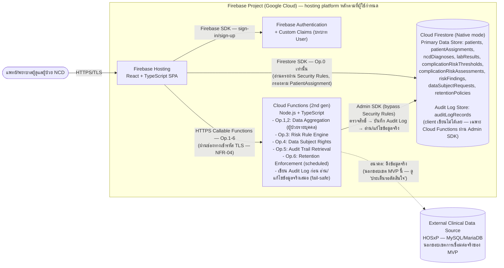

# Technology Stack

เอกสารนี้เป็น**จุดเดียวในโปรเจกต์ที่ระบุชื่อเทคโนโลยีจริง** (framework, ภาษาโปรแกรม, database engine,
hosting/deployment, กลไก auth, กลไกเข้ารหัส ฯลฯ) ต่อยอดจาก component เชิง logical ใน [[architecture]],
operation เชิง logical ใน [[api-spec]], entity เชิง logical ใน [[db-spec]] และสถานะการรองรับ NFR ใน
[[nfr-review]] ทุกการตัดสินใจอ้างอิงเหตุผลจาก NFR/component ที่ออกแบบไว้แล้ว และจากบริบททีม/องค์กรที่
เก็บจากผู้ใช้โดยตรงผ่านกระบวนการ intake (สรุปไว้ด้านล่าง) — **ไม่มีการเลือกเพราะความนิยม/ความชอบส่วนตัว
โดยไม่มีเหตุผลรองรับ**

อัปเดตล่าสุด: 2026-09-22 (ปรับปรุงรอบสอง — เพิ่มกลไกจริงสำหรับ NFR-09 (Performance), NFR-12 (Session
Timeout), NFR-13 (Accessibility), NFR-15 (Browser/Device Compatibility) ที่ [[architecture]] ระบุไว้ว่า
ยังไม่มีการตัดสินใจ — ดู decision area 9-12 ด้านล่าง)

## ภาพรวมบริบทที่ได้จาก Intake

เก็บบริบทจากผู้ใช้ผ่านคำถามหลายรอบ (รอบแรก: intake 6 ข้อ + decision area 7 ข้อ + คำถามชี้แจงเพิ่มเติม
1 ข้อ; รอบสอง 2026-09-22: decision area เพิ่มเติมอีก 4 ข้อสำหรับ NFR-09/NFR-12/NFR-13/NFR-15 — ไม่มี
คำถาม intake ใหม่เพราะบริบททีม/องค์กร/hosting ที่เก็บไว้ในรอบแรกยังคงใช้ได้และครอบคลุมเพียงพอ)
สรุปสาระสำคัญที่ใช้เป็นฐานการตัดสินใจทุกข้อด้านล่าง:

| หัวข้อ | คำตอบของผู้ใช้ | ผลต่อการตัดสินใจ |
| --- | --- | --- |
| ทีมพัฒนา/ทักษะ | ยังไม่มีทีมที่แน่นอน/ยังไม่ทราบ | เลือกเทคโนโลยีที่นิยม/มีเอกสารเยอะ ไม่ผูกความถนัดเฉพาะทีมใดทีมหนึ่ง |
| Hosting/Infrastructure | **ต้องการใช้ Firebase (Google) เป็น hosting platform หลัก** โดยเฉพาะเจาะจง | เป็นข้อจำกัดหลักที่มีน้ำหนักสูงสุด กำหนดทิศทาง decision area ส่วนใหญ่ |
| ข้อมูลผู้ป่วยในระบบ | เป็นข้อมูลจำลอง/สมมุติเท่านั้นในตอนนี้ (mockup) | สอดคล้องกับ NFR-01 อยู่แล้ว — บาง decision area (เช่น key management) เลือกระดับพื้นฐานที่เหมาะกับ MVP/mockup ก่อน แล้วบันทึกไว้เป็นประเด็นรอทบทวนเมื่อเปลี่ยนเป็นข้อมูลจริง |
| งบประมาณ/License | ต้องการ **open-source ทั้งหมด** | **ขัดแย้งบางส่วนกับ Firebase** (เป็น proprietary managed service ของ Google) — ดูหัวข้อ "ความขัดแย้งเชิงนโยบาย" ด้านล่าง ใช้ open-source เป็นเกณฑ์รองสำหรับ decision area ที่ไม่ขัดกับ Firebase (เช่น framework ฝั่ง client/ภาษาฝั่ง backend logic) |
| ความรู้เกี่ยวกับ HOSxP | ทราบว่า HOSxP ใช้ **MySQL/MariaDB** เป็นฐานข้อมูลหลัก | ใช้เป็นข้อมูลประกอบการพิจารณา risk ของการเลือก Firestore (NoSQL) เป็น Primary Data Store — บันทึกไว้ในประเด็นรอตัดสินใจเรื่องการเชื่อมต่อจริงในอนาคต |
| ขนาดผู้ใช้งาน | รพ.สต./ขนาดเล็ก (ผู้ใช้พร้อมกันไม่เกิน ~20 คน) | ไม่ต้องเผื่อสถาปัตยกรรมสำหรับ high-concurrency เลือก serverless ที่ scale-to-zero ได้ |
| แผนดูแลระยะยาว | ทีม IT โรงพยาบาลรับช่วงดูแลต่อหลัง MVP | เลือกเทคโนโลยีที่นิยม เอกสารเยอะ ดูแลง่าย ไม่ใช้เทคโนโลยีเฉพาะทาง |

### ความขัดแย้งเชิงนโยบาย — Open-source vs Firebase

ผู้ใช้ระบุทั้งสองความต้องการที่ขัดแย้งกันบางส่วน: (1) ต้องการ open-source ทั้งหมด และ (2) ต้องการใช้
Firebase (Google Cloud) เป็น hosting platform หลักโดยเฉพาะเจาะจง — **Firebase/Firestore/Cloud
Functions/Firebase Authentication เป็น proprietary managed service ของ Google ไม่ใช่ open-source**
แม้จะมี free tier (Spark plan) ให้ใช้งานได้โดยไม่มีค่าใช้จ่ายในระดับ MVP นี้ก็ตาม

ผู้ใช้ยืนยันให้ใช้ Firebase เป็นข้อจำกัดหลัก (น้ำหนักมากกว่า) ในทุก decision area ที่เกี่ยวข้องกับ
hosting/data store/auth ส่วนเกณฑ์ open-source ถูกนำไปใช้เป็นเกณฑ์รองสำหรับ decision area ที่ยังเลือก
ได้อิสระภายใต้ Firebase ecosystem (เช่น React/Vue/Angular ที่ client และ Node.js ที่ backend logic
ล้วนเป็น open-source license ทั้งหมด แม้ platform ที่รันจะเป็น proprietary) **ทีมงาน/ผู้มีอำนาจตัดสินใจ
ควรรับทราบความขัดแย้งนี้อย่างชัดเจน** และพิจารณาอีกครั้งหากนโยบาย open-source ของหน่วยงานเป็นข้อบังคับ
เข้มงวด (ไม่ใช่แค่ความต้องการ) — อาจต้องทบทวนใหม่เป็น self-hosted stack (เช่น PostgreSQL/MySQL แบบ
self-hosted) แทน Firebase ทั้งระบบ

## ตารางสรุป Component → เทคโนโลยีที่เลือก

| Component (จาก [[architecture]]) | เทคโนโลยีที่เลือก | เหตุผลอ้างอิง NFR/บริบท |
| --- | --- | --- |
| Client | **React + TypeScript**, deploy บน **Firebase Hosting** | ตอบโจทย์ hosting = Firebase ที่ผู้ใช้ระบุ, React เชื่อมต่อ Firebase SDK/เอกสารได้ดีที่สุดในสามตัวเลือก (React/Vue/Angular ฟรีเท่ากันทั้งหมดเพราะเป็น open-source — ความหมาย "ฟรี" ของผู้ใช้จึงอยู่ที่ Firebase Hosting free tier ไม่ใช่ตัว framework), นิยม/เอกสารเยอะเหมาะกับทีม IT ที่ดูแลต่อ (Q6) |
| Backend Service — Access Control | **Firestore Security Rules** (สำหรับ Operation 0) + **Cloud Functions authorization check ในโค้ด** (สำหรับ Operation 1–6) | สถาปัตยกรรม Firebase-native ตามที่ผู้ใช้เลือก (ไม่มี Backend Service แยกแบบดั้งเดิม) — ดูหัวข้อ "ความเสี่ยงที่ต้องพิจารณาเพิ่มเติม" สำหรับข้อจำกัดของแนวทางนี้ต่อ NFR-02/NFR-03 |
| Backend Service — Data Aggregation | Operation 0: **Client อ่าน Firestore ตรงผ่าน Firebase SDK** (กรองด้วย Security Rules); Operation 1, 2: **Cloud Functions (callable)** | Operation 0 ไม่มีข้อมูลผู้ป่วยรายบุคคลละเอียดอ่อนและไม่ trigger audit log จึงอ่านตรงได้ปลอดภัย; Operation 1/2 ต้องผ่านการบันทึก audit log แบบ fail-safe ก่อนเสมอ (NFR-06) จึงต้องมี Cloud Functions เป็นตัวกลาง |
| Backend Service — Risk Rule Engine | **Cloud Functions (2nd gen)**, Node.js + TypeScript | รองรับ FR-03/FR-04 แบบ rule-based, เขียน logic เปรียบเทียบ threshold ในโค้ดได้ชัดเจนกว่า Security Rules มาก |
| Backend Service — Audit Logging & Accountability | **Cloud Functions** เขียนลง **Firestore collection `auditLogRecords`** ผ่าน Admin SDK เท่านั้น (Security Rules ปฏิเสธ client เขียน/แก้ไข/ลบโดยตรง) | รองรับ NFR-06 (fail-safe, immutable) — เหตุผลเชิงเทคนิคเพิ่มเติมว่าทำไมต้องผ่าน Cloud Functions ดูหัวข้อ "รายละเอียด Audit Log Store" ด้านล่าง |
| Backend Service — Data Subject Rights & Retention Management | **Cloud Functions** (Operation 4 = callable, Operation 6 = scheduled function ผ่าน Cloud Scheduler) | รองรับ NFR-05/NFR-07 ต้องมี logic ตรวจสอบ/บังคับใช้นโยบายที่ซับซ้อนเกินกว่า Security Rules จะทำได้ |
| Primary Data Store | **Cloud Firestore (Native mode)** | ผู้ใช้ตัดสินใจเลือกเองโดยให้น้ำหนักกับ Firebase ecosystem + free tier แม้ ER model ใน [[db-spec]] จะเป็น relational ชัดเจน — ดูคำเตือน/แนวทาง denormalization ในหัวข้อ "รายละเอียด Primary Data Store" ด้านล่าง |
| Audit Log Store | **Cloud Firestore** collection แยก (`auditLogRecords`) เขียนผ่าน Cloud Functions เท่านั้น | ใช้ engine เดียวกับ Primary Data Store ตามที่ผู้ใช้เลือก ลดความซับซ้อนด้าน operations ให้ทีม IT ดูแลง่ายขึ้น (Q6) |
| Authentication/Authorization | **Firebase Authentication + Custom Claims** (เก็บ "บทบาท" ของ User ใน custom claims) | native กับ Firebase 100% เหมาะกับ MVP ขนาดเล็ก (~20 concurrent users) ไม่มีค่าใช้จ่ายเพิ่มในระดับ Spark plan |
| Encryption (at rest/in transit) + Key Management | **Google-managed encryption keys** (ค่าเริ่มต้นของ Firestore/Firebase Hosting/Cloud Functions ทั้งหมด) + HTTPS/TLS บังคับใช้โดย Firebase Hosting/Cloud Functions | รองรับ NFR-04 ขั้นพื้นฐานโดยไม่ต้องตั้งค่าเพิ่มเติม เหมาะกับ MVP ที่ยังใช้ข้อมูลจำลอง — ควรทบทวนใหม่เป็น CMEK เมื่อเปลี่ยนไปใช้ข้อมูลผู้ป่วยจริง (ดู "ประเด็นรอตัดสินใจ") |
| External Clinical Data Source (HOSxP) | ไม่ได้พัฒนาในโปรเจกต์นี้ — ทราบว่าใช้ MySQL/MariaDB | อยู่นอกขอบเขต MVP ตาม spec ต้นทาง — บันทึกไว้เป็นประเด็นรอตัดสินใจพร้อมข้อมูลที่ทราบแล้ว |
| Client/Backend Service/Primary Data Store — Performance (NFR-09) | **Firestore composite index เท่านั้น** ไม่มี caching layer เพิ่มเติม | ผู้ใช้เลือกความง่ายสูงสุดสำหรับ MVP ~20 concurrent users (ดู decision area 9) — trade-off: ทุก request อ่าน Firestore ทุกครั้งแม้ข้อมูลอ้างอิงคงที่ (เช่น threshold) |
| Client — Session Timeout (NFR-12) | **Client custom inactivity timer** (setTimeout + event listener) เรียก Firebase Auth `signOut()` เมื่อ idle เกิน 30 นาที — **ไม่มี server-side token revocation** | ผู้ใช้เลือกความง่ายสูงสุด (ดู decision area 10) — **มีความเสี่ยงด้านความปลอดภัยที่ต้องรับทราบ** (token ยังใช้ได้จนหมดอายุตามธรรมชาติ ~1 ชม.) ดูหัวข้อ "ความเสี่ยงที่ต้องพิจารณาเพิ่มเติม" |
| Client — Accessibility (NFR-13) | **WCAG 2.1 Level AA** + **Heroicons** (open-source) + **Lighthouse Accessibility Audit** | รองรับ NFR-13 (ห้ามใช้สีเป็นสัญญาณเดียว) ต่อยอดจาก [[DESIGN]] (ดู decision area 11) |
| Client — Browser Compatibility (NFR-15) | browserslist: `">0.5%, last 2 versions, Firefox ESR, not dead"` | รองรับ NFR-15 (Chrome/Edge/Firefox เวอร์ชันล่าสุดบน desktop/tablet) (ดู decision area 12) |

## รายละเอียดต่อ Decision Area

### 1. ภาษา/Framework ฝั่ง Client — React + TypeScript

**เลือก:** React (+ TypeScript), build เป็น static SPA, deploy บน Firebase Hosting

**เหตุผล:** ผู้ใช้ระบุเงื่อนไข "เชื่อมกับ Firebase แล้วฟรี" — React, Vue และ Angular ทั้งสามเป็น
open-source ใช้งานฟรีเท่ากันหมด (ไม่มีค่า license ของตัว framework เอง) ความหมาย "ฟรี" ที่ผู้ใช้ต้องการ
จึงอยู่ที่ **Firebase Hosting free tier (Spark plan)** ซึ่งรองรับ static SPA จากทั้งสาม framework ได้
เท่ากัน — ปัจจัยตัดสินใจจริงจึงอยู่ที่ความเข้ากันได้กับ Firebase SDK/เอกสาร และความนิยม/เอกสารสำหรับทีม
IT ที่จะรับช่วงดูแลต่อ (Q6)

**ทางเลือกอื่นที่พิจารณาแล้วไม่เลือก:**
- Vue.js — เรียนรู้ง่ายกว่า แต่ community/ตลาดแรงงานเล็กกว่า React ทำให้ทีม IT หาคนดูแลต่อยากกว่า
- Angular — โครงสร้างเข้มงวด เหมาะกับ enterprise แต่ setup หนักเกินความจำเป็นสำหรับ MVP ขนาดเล็ก
  (~20 concurrent users)

### 2. ภาษา/Framework ฝั่ง Backend Logic — Node.js + TypeScript บน Cloud Functions

**เลือก:** Node.js + TypeScript สำหรับทุก Cloud Function

**เหตุผล:** เช่นเดียวกับ Client — "ฟรี" หมายถึง Firebase/Google Cloud free tier (Cloud Functions
มี free tier ที่เพียงพอสำหรับ ~20 concurrent users) ไม่ใช่ตัวภาษาเอง เลือก Node.js เพราะ integrate
กับ Firebase Admin SDK/Firestore ได้ native ที่สุด เอกสาร Firebase ส่วนใหญ่อ้างอิง Node.js เป็นหลัก
ลดความซับซ้อนของทีมที่ต้องดูแลทั้ง client (React/TS) และ backend logic (Node.js/TS) ด้วยภาษาเดียวกัน

**ทางเลือกอื่นที่พิจารณาแล้วไม่เลือก:**
- Python (FastAPI-style Cloud Functions) — เหมาะกับ Risk Rule Engine เชิง logic แต่เอกสาร/ตัวอย่าง
  การใช้ร่วมกับ Firebase มีน้อยกว่า Node.js
- Go — performance สูงแต่ทีมทั่วไปหายากกว่า ขัดกับเป้าหมาย "ดูแลง่าย" ของทีม IT โรงพยาบาล (Q6)

### 3. สถาปัตยกรรม Backend Service — Firebase-native (ไม่มี Backend Service แยกแบบดั้งเดิม)

**เลือก:** ไม่มี persistent backend server แยกต่างหาก — แบ่งเป็น 2 เส้นทาง:
- **เส้นทาง Client → Firestore ตรง** (ผ่าน Firebase SDK + Security Rules): ใช้เฉพาะ **Operation 0**
  (ค้นหา/แสดงรายชื่อผู้ป่วยในความดูแล) เพราะยังไม่มีการระบุผู้ป่วยรายบุคคล ไม่ trigger audit log ตาม
  เจตนาของ [[architecture]] อยู่แล้ว และ Security Rules สามารถกรองผลลัพธ์ตาม PatientAssignment ได้
  ค่อนข้างตรงไปตรงมา (query แบบ exact-match บน field เดียว)
- **เส้นทาง Client → Cloud Functions (callable)**: ใช้กับ **Operation 1, 2, 3, 4, 5, 6** ทั้งหมด — คือ
  ทุก operation ที่เข้าถึงข้อมูลผู้ป่วยรายบุคคล/ข้อมูล audit trail/คำขอสิทธิ

**เหตุผลของการแบ่งเส้นทางนี้ (ส่วนขยายทางเทคนิคจากตัวเลือกที่ผู้ใช้อนุมัติ):** ผู้ใช้อนุมัติแนวทาง
"Cloud Functions เฉพาะจุดที่ต้องมี server-side logic เช่น Risk Rule Engine, Audit Logging, Retention
Enforcement" — เมื่อพิจารณาเชิงเทคนิคเพิ่มเติมพบว่า **ข้อกำหนด fail-safe ของ NFR-06** ("ต้องบันทึก
audit log ก่อนอ่าน/แก้ไขข้อมูลจริงเสมอ และถ้าบันทึกไม่สำเร็จต้องยกเลิกการดำเนินการทั้งหมด" ตาม
[[api-spec#Operation ร่วม — บันทึกร่องรอยการเข้าถึงข้อมูลผู้ป่วย (Audit Logging)|Operation ร่วม Audit
Logging ใน api-spec]]) **ไม่สามารถบังคับใช้ได้อย่างน่าเชื่อถือถ้า Client อ่านข้อมูลผู้ป่วยรายบุคคลตรง
จาก Firestore เอง** เพราะไม่มีกลไกใดบังคับให้ Client ต้องเรียกสร้าง audit log ก่อนอ่านข้อมูลจริงเสมอ
(Client ฝั่งที่ถูกดัดแปลง/บั๊ก อาจข้ามขั้นตอนสร้าง audit log แล้วอ่านข้อมูลตรงได้ถ้า Security Rules
อนุญาต) จึงตัดสินใจขยายให้ Operation 1–6 ทั้งหมด (ไม่ใช่แค่ 3 operation ที่ผู้ใช้ระบุตัวอย่างไว้) ต้อง
ผ่าน Cloud Functions เป็นตัวกลางเสมอ เพื่อให้ Cloud Function เป็นจุดเดียวที่บังคับลำดับ "ตรวจสิทธิ์ →
บันทึก audit log → อ่าน/แก้ไขข้อมูลจริง" ได้จริงตามที่ api-spec.md กำหนด — เป็นการตีความที่ยังคงหลักการ
"Firebase-native ไม่มี persistent server" ของผู้ใช้ไว้ (Cloud Functions เป็น serverless เช่นกัน) เพียง
แต่ขยายขอบเขตของ Cloud Functions ให้ครอบคลุมมากกว่าที่ยกตัวอย่างไว้เดิม

### 4. Database Engine ของ Primary Data Store — Cloud Firestore (Native mode)

**เลือก:** Cloud Firestore (Native mode) — **ตัดสินใจโดยผู้ใช้โดยตรง ขัดกับคำแนะนำเดิมของ agent นี้**
(เดิมแนะนำ Cloud SQL/MySQL เพราะ ER model ใน [[db-spec]] เป็น relational ชัดเจน) ผู้ใช้ให้เหตุผลว่า
ต้องการอยู่ใน Firebase ecosystem เต็มรูปแบบและใช้ free tier

**คำเตือน/ความเสี่ยงที่ต้องพิจารณาเมื่อ implement จริง (ส่งต่อให้ `sync-api-db`/`sync-detailed-design`):**

[[db-spec]] ออกแบบ ER model เป็น relational เต็มรูปแบบ มี foreign key และความสัมพันธ์ N:M ผ่าน
PatientAssignment รวมถึง RiskFinding ที่อ้างอิง 3 entity พร้อมกัน (ComplicationRiskAssessment,
ComplicationRiskThreshold, LabResult) — Firestore เป็น NoSQL document store ไม่มี join/foreign key
constraint แบบ native จึงต้อง **denormalize** ข้อมูลเมื่อ implement จริง แนวทางเบื้องต้นที่แนะนำ
(รายละเอียดสุดท้ายควรกำหนดใน `sync-api-db`):

- **PatientAssignment (N:M ระหว่าง User และ Patient):** แทนที่จะเป็น collection กลางแบบ relational
  table ให้พิจารณาเก็บเป็น subcollection `patients/{patientId}/assignments/{userId}` (หรือ document
  ID แบบ composite `{userId}_{patientId}` ใน top-level collection `patientAssignments`) เพื่อให้
  Security Rules ใช้ `exists()` ตรวจสอบสิทธิ์ได้ง่ายโดยไม่ต้อง query แบบ collection group เสมอไป
- **RiskFinding (อ้างอิง 3 entity):** เก็บเป็น subcollection ของ ComplicationRiskAssessment
  (`complicationRiskAssessments/{id}/riskFindings/{id}`) และ **copy ค่า threshold/comparator แบบ
  snapshot ลงไปในเอกสารโดยตรง** (ตามที่ [[db-spec#รายละเอียดผลการประเมินต่อโรคแทรกซ้อน (RiskFinding)|
  db-spec ระบุไว้แล้วว่าต้อง snapshot อยู่แล้ว]] — สอดคล้องกับข้อจำกัดของ Firestore โดยบังเอิญ)
- **AuditLogRecord ที่ต้องสืบค้นตามผู้ป่วย/ผู้ใช้/ช่วงเวลาพร้อมกัน (Operation 5):** Firestore composite
  index จำเป็นสำหรับ query แบบหลายเงื่อนไข ต้องออกแบบ index ล่วงหน้าใน `firestore.indexes.json`
- โดยรวม การ query ที่ซับซ้อนกว่า exact-match เดียว (เช่น "ผู้ป่วยที่มี HN ตรงกัน **และ** อยู่ใน
  PatientAssignment ของผู้ใช้") ต้องพึ่งพา Cloud Functions ประมวลผลแทนการ query ตรงจาก client ในหลาย
  กรณี ซึ่งสอดคล้องกับการตัดสินใจใน decision area 3 ที่ให้ Cloud Functions มาเป็นตัวกลางของ
  Operation 1–6 อยู่แล้ว

**ทางเลือกอื่นที่พิจารณาแล้ว (ไม่ถูกเลือก แม้จะเคยแนะนำ):**
- Cloud SQL (MySQL) — ตรงกับ ER model โดยตรง และเป็น engine ตระกูลเดียวกับ HOSxP (MySQL/MariaDB)
  ช่วยลดความเสี่ยงตอนเชื่อมต่อจริงในอนาคต แต่ผู้ใช้เลือกไม่ใช้เพราะให้น้ำหนักกับ Firebase ecosystem
  มากกว่า
- Cloud SQL (PostgreSQL) — ความสามารถเชิง relational แข็งแรง แต่ engine คนละตระกูลกับ HOSxP อยู่ดี
  และผู้ใช้ไม่เลือกเช่นกัน

### 5. Audit Log Store — Cloud Firestore collection แยก เขียนผ่าน Cloud Functions เท่านั้น

**เลือก:** collection `auditLogRecords` ใน Firestore engine เดียวกับ Primary Data Store

**เหตุผลเชิงเทคนิคเพิ่มเติม (สำคัญ):** คำตอบเดิมของผู้ใช้ระบุ "Firestore แยก collection + Security
Rules ปฏิเสธ update/delete" ซึ่งถูกต้องสำหรับการป้องกัน**การแก้ไข/ลบ** ระเบียนที่มีอยู่แล้ว (คุณสมบัติ
append-only/immutable ตาม NFR-06) แต่ **ไม่ครอบคลุมการบังคับลำดับ "ต้องสร้าง audit log ก่อนอ่านข้อมูล
จริงเสมอ" (fail-safe)** ถ้า Client เป็นผู้สร้างระเบียน audit log เอง (`allow create` ใน Security
Rules) จึงตัดสินใจให้ **เฉพาะ Cloud Functions (ผ่าน Firebase Admin SDK ซึ่ง bypass Security Rules)
เท่านั้นที่เขียนระเบียนลง `auditLogRecords` ได้** — Client ไม่มีสิทธิ์ create/update/delete ใน
collection นี้โดยตรงเลย (Security Rules: `allow read, write: if false;` สำหรับ client ทั้งหมด) เพื่อ
บังคับให้ทุกการเข้าถึงข้อมูลผู้ป่วยรายบุคคลต้องผ่าน Cloud Functions (ซึ่งบันทึก audit log ภายในฟังก์ชัน
เดียวกันก่อน return ข้อมูล) ตามที่ตัดสินใจไว้ใน decision area 3

### 6. Hosting/Deployment Environment

| Component | Hosting/Deployment |
| --- | --- |
| Client (React SPA) | Firebase Hosting (static hosting, CDN ของ Google, HTTPS บังคับอัตโนมัติ) |
| Cloud Functions (ทุกกลุ่มงาน backend logic) | Cloud Functions (2nd gen) ใน Firebase project เดียวกัน — callable functions สำหรับ Op.1-5, scheduled function (ผ่าน Cloud Scheduler) สำหรับ Op.6 |
| Primary Data Store + Audit Log Store | Cloud Firestore (Native mode) ใน Firebase project เดียวกัน (region เดียวกับ Cloud Functions เพื่อลด latency) |
| Authentication | Firebase Authentication (บริการเดียวกัน ไม่มี infrastructure แยก) |

ทุก component อยู่ภายใต้ Firebase project เดียวกัน (single Google Cloud project) ตามข้อจำกัด hosting
ที่ผู้ใช้ระบุไว้อย่างชัดเจน ไม่มีการแยก on-premise/hybrid เนื่องจากข้อมูลในระบบปัจจุบันเป็นข้อมูลจำลอง
ยังไม่ใช่ข้อมูลผู้ป่วยจริง (ควรทบทวนอีกครั้งเมื่อเข้าสู่ช่วง production จริงกับข้อมูลผู้ป่วยจริง — ดู
"ประเด็นรอตัดสินใจ")

### 7. Authentication/Authorization — Firebase Authentication + Custom Claims

**เลือก:** Firebase Authentication เก็บ "บทบาท" (แพทย์/พยาบาล) ของ [[db-spec#ผู้ใช้ (User)|User]] ไว้
ใน custom claims ของ Firebase Auth token, ตรวจสอบ custom claims ทั้งใน Firestore Security Rules
(สำหรับ Operation 0) และใน Cloud Functions (สำหรับ Operation 1–6) ส่วนการตรวจสอบระดับรายผู้ป่วย
(PatientAssignment) ตรวจสอบแยกจาก custom claims เสมอ (query/exists check กับ Firestore เพราะเป็น
ข้อมูลที่เปลี่ยนแปลงได้บ่อยกว่า ไม่เหมาะเก็บใน token claims ที่ refresh ไม่บ่อย)

**เหตุผล:** native กับ Firebase 100% ตั้งค่าเร็ว รองรับ MVP ขนาดเล็กได้ดี ไม่มีค่าใช้จ่ายเพิ่มในระดับ
Spark/Blaze plan พื้นฐาน

**ทางเลือกอื่นที่พิจารณาแล้วไม่เลือก:**
- สร้างระบบ authentication เอง (custom JWT) — เพิ่มความเสี่ยงด้านความปลอดภัยจากการสร้างเอง ขัดกับ
  เป้าหมาย "ดูแลง่าย" ของทีม IT และไม่ได้ใช้ประโยชน์จาก Firebase ที่เลือกไว้แล้ว
- Firebase Authentication + Google Cloud Identity Platform (รองรับ SSO/SAML) — เกินความจำเป็นสำหรับ
  MVP ที่ยังใช้ข้อมูลจำลอง บันทึกไว้เป็นทางเลือกสำหรับอนาคตเมื่อต้องเชื่อมต่อระบบยืนยันตัวตนของ
  โรงพยาบาลจริง (ดู "ประเด็นรอตัดสินใจ")

### 8. กลไกเข้ารหัสข้อมูล (NFR-04) และการบริหารกุญแจเข้ารหัส

**เลือก:** ใช้ **Google-managed encryption keys ตามค่าเริ่มต้าน** ของ Firestore (encryption at rest
อัตโนมัติ) และ HTTPS/TLS บังคับใช้โดย Firebase Hosting และ Cloud Functions (encryption in transit
อัตโนมัติ) — ไม่มีการตั้งค่า Customer-Managed Encryption Keys (CMEK) หรือ field-level encryption
เพิ่มเติมในขั้นนี้

**เหตุผล:** ครอบคลุม NFR-04 ในระดับพื้นฐานโดยไม่ต้องตั้งค่าเพิ่มเติม เหมาะกับ MVP ขนาดเล็กที่ยังใช้
ข้อมูลจำลอง (ไม่ใช่ข้อมูลผู้ป่วยจริง) ทีม IT ดูแลง่ายที่สุดตามเป้าหมายที่ผู้ใช้ระบุ (Q6)

**ทางเลือกอื่นที่พิจารณาแล้วไม่เลือกตอนนี้ (บันทึกไว้สำหรับทบทวนในอนาคต):**
- Customer-Managed Encryption Keys (CMEK) ผ่าน Cloud KMS — ให้องค์กรควบคุม key lifecycle เอง
  เหมาะเมื่อเปลี่ยนไปใช้ข้อมูลผู้ป่วยจริง
- Field-level encryption เพิ่มเติมในชั้น Cloud Functions (เช่น เข้ารหัส HN ด้วย envelope encryption
  ก่อนบันทึก) — ป้องกันอีกชั้นแต่กระทบการค้นหา HN แบบ exact match (ต้องใช้ deterministic encryption)
  และซับซ้อนเกินความจำเป็นของ MVP ปัจจุบัน

### 9. กลไกรองรับ Performance < 2 วินาที (NFR-09) — Firestore Composite Index เท่านั้น (ไม่มี caching layer เพิ่มเติม)

**เลือก:** ใช้ **Firestore composite index** ออกแบบตาม query pattern จริงของแต่ละ operation (โดยเฉพาะ
Operation 5 — สืบค้น audit trail แบบหลายเงื่อนไขพร้อมกัน ตามที่ decision area 4 ระบุไว้แล้วว่าต้องมี
composite index) เป็นกลไกเดียวที่ใช้รองรับ NFR-09 ในรอบนี้ — **ไม่เพิ่ม caching layer ใดๆ** (ไม่มี
in-memory caching ใน Cloud Functions, ไม่มี Redis/Memorystore)

**เหตุผล:** ผู้ใช้เลือกแนวทางที่ง่ายที่สุดโดยตรง (ไม่ใช่คำแนะนำเดิมของ agent นี้ที่เสนอ in-memory
caching เพิ่มเติมสำหรับข้อมูลอ้างอิงคงที่) ให้เหตุผลว่าต้องการลดความซับซ้อนของระบบให้น้อยที่สุดสำหรับ
MVP ขนาด ~20 concurrent users สอดคล้องกับเป้าหมาย "ดูแลง่าย" ของทีม IT โรงพยาบาลที่จะรับช่วงดูแลต่อ (Q6
ของ intake)

**Trade-off ที่ต้องบันทึกไว้อย่างชัดเจน (ตามที่ผู้ใช้ร้องขอโดยตรง):** ด้วยแนวทางนี้ **ทุก request จะยัง
อ่าน Cloud Firestore ทุกครั้งแม้เป็นข้อมูลอ้างอิงที่แทบไม่เปลี่ยนแปลง** เช่น `ComplicationRiskThreshold`
ที่ Risk Rule Engine (Operation 3) ต้องอ่านทุกครั้งที่ประมวลผลความเสี่ยง แทนที่จะ cache ไว้ในหน่วยความจำ
ของ Cloud Function instance — สำหรับสเกล ~20 concurrent users ปัจจุบัน คาดว่ายังทำเวลาตอบสนอง < 2
วินาทีได้ (Firestore single-document read มี latency ต่ำในระดับ milliseconds เมื่อมี index ที่เหมาะสม)
แต่ **ถ้าในอนาคตพบจากการทดสอบ performance จริง (ดู [[test-plan]]) ว่าไม่สามารถทำ < 2 วินาทีได้อย่าง
สม่ำเสมอด้วยวิธีนี้ ขั้นตอนถัดไปที่ควรพิจารณาคือ in-memory caching ใน Cloud Functions สำหรับข้อมูลอ้างอิง
คงที่** (แนวทางที่ agent นี้เคยเสนอไว้แต่ผู้ใช้เลือกไม่ใช้ในรอบนี้) ก่อนที่จะพิจารณา managed caching
layer แยกต่างหาก (Memorystore/Redis) ซึ่งมีค่าใช้จ่าย/ความซับซ้อนสูงกว่ามาก

**ทางเลือกอื่นที่พิจารณาแล้วไม่เลือก (บันทึกไว้สำหรับทบทวนในอนาคตตามลำดับ):**
- In-memory caching ใน Cloud Functions สำหรับข้อมูลอ้างอิงคงที่ (เช่น threshold) — ลด Firestore read
  ได้จริงโดยไม่เพิ่ม infrastructure แต่ไม่ทำงานตอน cold start และเพิ่มความซับซ้อนของโค้ดเล็กน้อย ผู้ใช้
  เลือกไม่ใช้ในรอบนี้เพื่อความง่ายสูงสุด — ควรพิจารณาเป็นลำดับถัดไปถ้าพบปัญหาตามที่ระบุไว้ข้างต้น
- Managed caching layer แยก (Google Cloud Memorystore/Redis) — ประสิทธิภาพสูงสุดแต่มีค่าใช้จ่ายเพิ่ม
  นอกเหนือ Firebase free tier และซับซ้อนเกินความจำเป็นสำหรับสเกลปัจจุบัน ขัดกับเป้าหมาย "ดูแลง่าย" (Q6)

### 10. กลไก Session Timeout (NFR-12) — Client Custom Inactivity Timer เท่านั้น (ไม่มี Server-side Token Revocation)

**เลือก:** เขียน inactivity timer เองฝั่ง Client (custom implementation ด้วย `setTimeout` + event
listener บน mouse/keyboard/touch event มาตรฐานของ browser) นับเวลาไม่มีการโต้ตอบต่อเนื่อง เมื่อครบ 30
นาทีเรียก Firebase Authentication `signOut()` ทันที กลับไปหน้าจอยืนยันตัวตนใหม่ — **ไม่มีกลไกฝั่ง
เซิร์ฟเวอร์เพื่อเพิกถอน (revoke) token ซ้ำ**

**เหตุผล:** ผู้ใช้เลือกแนวทางที่ง่ายที่สุดโดยตรง (ไม่ใช่คำแนะนำเดิมของ agent นี้ที่เสนอ `react-idle-timer`
+ Cloud Function เพิกถอน token) ไม่ต้องพึ่งพา library ภายนอกเพิ่มเติม ลดจำนวน dependency ที่ทีม IT ต้อง
ดูแลต่อ (Q6)

**คำเตือนด้านความปลอดภัยที่สำคัญ (ผู้ใช้รับทราบและยืนยันให้ดำเนินการต่อแล้ว — ดูรายละเอียดเต็มในหัวข้อ
[[technology-stack#ความเสี่ยงที่ต้องพิจารณาเพิ่มเติม (สำคัญ — ผู้ใช้รับทราบและยืนยันให้ดำเนินการต่อแล้ว)|
"ความเสี่ยงที่ต้องพิจารณาเพิ่มเติม" ด้านล่าง]]):** กลไกนี้เป็น **best-effort ฝั่ง Client เท่านั้น** —
ถ้า Firebase ID token ของผู้ใช้ถูกขโมย/ดักจับไว้ก่อนที่ client-side timer จะทำงาน (เช่น อุปกรณ์ถูกขโมย
พร้อม token ที่ intercept ไว้ล่วงหน้า หรือ client ถูกดัดแปลง/บั๊กจนไม่เรียก `signOut()`) **token นั้นยัง
คงใช้งานได้ต่อจนกว่าจะหมดอายุตามธรรมชาติของ Firebase ID token (สูงสุดประมาณ 1 ชั่วโมง)** ซึ่ง**นานกว่า
30 นาทีที่ NFR-12 กำหนดไว้จริง** — เกิดช่องว่างระหว่างสิ่งที่ NFR-12 ต้องการ (บังคับใช้จริงหลัง 30 นาที)
กับสิ่งที่กลไกนี้ทำได้จริง (แจ้ง/ล็อกเอาต์ฝั่ง UI เท่านั้น ไม่ได้ทำให้ token เป็นโมฆะจริงฝั่งเซิร์ฟเวอร์)

**ทางเลือกอื่นที่พิจารณาแล้วไม่เลือก:**
- `react-idle-timer` (open-source, MIT) + Cloud Function เพิกถอน token ผ่าน Admin SDK
  `revokeRefreshTokens()` — ปิดช่องว่างนี้ได้จริง เป็นการป้องกันซ้ำอีกชั้น แต่เพิ่ม dependency และความ
  ซับซ้อนของการเรียก Cloud Function สำเร็จตอน idle จริง ผู้ใช้เลือกไม่ใช้ในรอบนี้
- ตรวจสอบ `lastActivityAt` ทุก Cloud Function call (เก็บใน Firestore) — บังคับใช้ได้เข้มงวดที่สุดฝั่ง
  เซิร์ฟเวอร์ แต่เพิ่ม Firestore read ทุก request กระทบ NFR-09 และซับซ้อนที่สุดในการ implement/ทดสอบ

### 11. Design Token/Icon Library สำหรับ Accessibility (NFR-13) — WCAG 2.1 Level AA + Heroicons + Lighthouse

**เลือก:** กำหนดมาตรฐาน **WCAG 2.1 Level AA** (contrast ratio ≥ 4.5:1 สำหรับข้อความปกติ, ≥ 3:1 สำหรับ
ข้อความขนาดใหญ่/UI component) เป็นเป้าหมายของทุก design token สีใน [[DESIGN]], ใช้ **Heroicons**
(open-source, MIT license, พัฒนาโดยทีม Tailwind CSS) เป็นชุดไอคอนมาตรฐานสำหรับกำกับคู่กับสีทุกจุดที่สื่อ
ความหมาย (โดยเฉพาะ flag ความเสี่ยงจาก FR-04) และใช้ **Lighthouse Accessibility Audit** (built-in Chrome
DevTools ไม่มีค่าใช้จ่าย/ไม่ต้องติดตั้งเพิ่ม) เป็นเครื่องมือตรวจสอบก่อน deploy ทุกครั้ง

**เหตุผล:** ตามคำแนะนำของ agent นี้ที่ผู้ใช้ยืนยัน — WCAG 2.1 AA เป็นมาตรฐานสากลที่นิยม/มีเอกสารเยอะ
ที่สุดด้าน accessibility เหมาะกับเป้าหมาย "ดูแลง่าย" ของทีม IT (Q6), Heroicons เบา/integrate กับ React
ได้ง่าย ไม่เพิ่ม dependency หนัก ต่อยอดจาก [[DESIGN]] ที่มีอยู่แล้วได้ทันทีโดยไม่ต้องเปลี่ยน component
library, Lighthouse ไม่มีต้นทุนเพิ่มเพราะมากับ Chrome DevTools อยู่แล้ว

**ทางเลือกอื่นที่พิจารณาแล้วไม่เลือก:**
- Material Symbols (Google, open-source) + axe DevTools (open-source browser extension) — ทดสอบ
  ละเอียด/ครอบคลุมกว่า Lighthouse แต่ต้องติดตั้ง extension เพิ่มเป็นส่วนหนึ่งของ QA workflow
- Accessible component library เต็มรูปแบบ (เช่น Radix UI primitives, open-source) — ให้ ARIA มาพร้อม
  component ตั้งแต่ต้น ลดภาระตรวจสอบ a11y เอง แต่ต้อง refactor component ที่มีอยู่ใน [[DESIGN]] เพิ่มงาน
  integration ตั้งแต่ต้นสำหรับทีมขนาดเล็กที่ยังไม่มีทีมแน่นอน

**หมายเหตุ:** รายละเอียด mapping ของ design token/ไอคอนเฉพาะจุด (เช่น สีของแต่ละระดับความเสี่ยง + ไอคอน
ที่ใช้คู่กัน) เป็นหน้าที่ของ [[DESIGN]] และ `detailed-design/` ที่ควรปรับปรุงต่อในรอบ `sync-detailed-
design`/การแก้ไข DESIGN.md ในอนาคต ไม่ใช่ขอบเขตของเอกสารนี้

### 12. Browserslist/Matrix การทดสอบสำหรับ Browser Compatibility (NFR-15)

**เลือก:** กำหนด browserslist config เป็น **`">0.5%, last 2 versions, Firefox ESR, not dead"`** ในไฟล์
build config ของ React SPA (`package.json` หรือ `.browserslistrc`) และทดสอบแบบ manual บน Chrome/Edge/
Firefox desktop เวอร์ชันล่าสุดจริง + จำลอง tablet ผ่าน Chrome DevTools device emulation (ไม่ใช้บริการ
cross-browser testing เสียเงิน เนื่องจากสเกลเล็ก ~20 concurrent users)

**เหตุผล:** ตามคำแนะนำของ agent นี้ที่ผู้ใช้ยืนยัน — เป็น preset ที่นิยมใช้กันแพร่หลายกับ React build
tooling (Vite/Create React App รองรับ native) ครอบคลุม Chrome/Edge/Firefox ตามที่ NFR-15 ระบุ บวก
Firefox ESR เผื่อกรณีหน่วยงานราชการ/โรงพยาบาลที่มักปิน browser เวอร์ชันไม่อัปเดตทันที ซึ่งสอดคล้องกับ
บริบทของ รพ.สต. ที่ IT อาจอัปเดตเครื่องไม่บ่อย (Q5 ของ intake)

**ทางเลือกอื่นที่พิจารณาแล้วไม่เลือก:**
- `"last 1 Chrome version, last 1 Edge version, last 1 Firefox version"` — ตรงตามตัวอักษรของ NFR-15
  ที่สุด, bundle เล็กสุด แต่เสี่ยงหลุด support ทันทีถ้าผู้ใช้ไม่อัปเดต browser ทันเวลา
- `"defaults"` (ค่าเริ่มต้นของ build tool) — ครอบคลุมกว้างเกินขอบเขตที่ NFR-15 ระบุ (รวม Safari ที่ไม่ได้
  อยู่ในข้อกำหนด) เพิ่มภาระ maintain/ทดสอบโดยไม่จำเป็น

## ความเสี่ยงที่ต้องพิจารณาเพิ่มเติม (สำคัญ — ผู้ใช้รับทราบและยืนยันให้ดำเนินการต่อแล้ว)

สถาปัตยกรรม Firebase-native ที่เลือก (decision area 3) — โดยเฉพาะการใช้ **Firestore Security Rules**
เป็นกลไกหลักในการบังคับสิทธิ์การเข้าถึงสำหรับ Operation 0 — มีความเสี่ยงเชิงเทคนิคที่ต้องบันทึกไว้
อย่างเด่นชัด เนื่องจากกระทบ NFR-02 (Access Control) และ NFR-03 (Purpose Limitation) โดยตรง:

1. **Security Rules เขียน logic การตรวจสอบสิทธิ์ 2 ระดับ (role-level + patient-level) ได้ยากกว่าการ
   เขียนเป็นโค้ด backend ปกติมาก** — ภาษา Security Rules มีข้อจำกัดด้าน expressiveness (ไม่ใช่ general
   purpose programming language เต็มรูปแบบ) การตรวจสอบที่ซับซ้อน เช่น "อนุญาตเฉพาะบทบาทแพทย์/พยาบาล
   ที่บัญชียังใช้งานได้ **และ** มี PatientAssignment เชื่อมโยงกับผู้ป่วยรายนี้จริง" ต้องเขียนเป็นชุด
   `exists()`/`get()` call ที่ซ้อนกัน ซึ่ง**เสี่ยงต่อการตั้งค่าผิดพลาดจนข้อมูลผู้ป่วยรั่วไหล**ได้ง่ายกว่า
   การตรวจสอบในโค้ด backend ที่ unit test ได้ตรงไปตรงมากว่า
2. **ผลกระทบจำกัดเฉพาะ Operation 0 เท่านั้น** เนื่องจาก decision area 3 ได้ลดขอบเขตของ Security Rules
   ให้ครอบคลุมเฉพาะ Operation 0 (ค้นหา/แสดงรายชื่อ — ไม่มีข้อมูลผู้ป่วยรายบุคคลละเอียดอ่อน) ส่วน
   Operation 1–6 ทั้งหมดผ่าน Cloud Functions ที่ตรวจสอบในโค้ดแทน จึงลดพื้นที่เสี่ยงของ Security Rules
   ลงมากแล้ว แต่ยังไม่ใช่ศูนย์ (Operation 0 ยังคง expose รายชื่อ+HN ของผู้ป่วยในความดูแลอยู่)

**คำแนะนำเชิงป้องกัน (mitigation) ที่ควรปฏิบัติก่อนใช้งานจริงกับข้อมูลผู้ป่วยจริง:**

- ต้องมี **code review เข้มงวดสำหรับ Firestore Security Rules ทุกครั้งก่อน deploy จริง** โดยเฉพาะ
  rule ที่เกี่ยวกับ collection `patients` และ `patientAssignments`
- ต้องเขียน **automated test สำหรับ Security Rules ด้วย Firebase Emulator Suite** (`@firebase/rules-
  unit-testing`) ให้ครอบคลุมทุกกรณีสิทธิ์ก่อนใช้งานจริง — อย่างน้อยต้องทดสอบ: (ก) ผู้ใช้ที่ไม่มี
  PatientAssignment กับผู้ป่วยรายใดเลย, (ข) ผู้ใช้ที่มี PatientAssignment กับผู้ป่วยบางรายเท่านั้น
  ต้องไม่เห็นผู้ป่วยรายอื่น, (ค) ผู้ใช้ที่บัญชีถูกระงับ (สถานะการใช้งานบัญชี = เท็จ), (ง) ผู้ใช้ที่ไม่มี
  custom claims บทบาทที่ถูกต้อง
- ควรพิจารณารัน automated test ชุดนี้เป็นส่วนหนึ่งของ CI/CD pipeline ก่อน deploy ทุกครั้ง ไม่ใช่ทดสอบ
  ครั้งเดียวตอนเริ่มโครงการ
- **สิ่งนี้ควรถูกยกระดับความสำคัญเป็นพิเศษก่อนเปลี่ยนจากข้อมูลจำลองเป็นข้อมูลผู้ป่วยจริง** เนื่องจาก
  ความเสี่ยงข้อมูลรั่วไหลจาก Security Rules ที่ตั้งค่าผิดพลาดจะกระทบข้อมูลสุขภาพจริงของผู้ป่วยโดยตรง

### ความเสี่ยงเพิ่มเติม: NFR-12 Session Timeout เป็น Best-effort ฝั่ง Client เท่านั้น (ไม่มี Server-side Token Revocation)

decision area 10 ด้านบนตัดสินใจใช้ **client custom inactivity timer เพียงอย่างเดียว** (ไม่มีกลไกฝั่ง
เซิร์ฟเวอร์เพื่อเพิกถอน token ซ้ำ) ตามที่ผู้ใช้เลือกโดยตรงเพื่อความง่ายสูงสุด — ต้องบันทึกความเสี่ยงนี้
ไว้อย่างเด่นชัดเช่นเดียวกับความเสี่ยงของ Firestore Security Rules ข้างต้น เนื่องจากกระทบ **NFR-12** และ
เชื่อมโยงกับ **NFR-02 (Access Control)** โดยตรง:

1. **NFR-12 กำหนดให้ระบบต้อง auto-logout เมื่อไม่มีการใช้งานเกิน 30 นาที** แต่กลไกที่เลือก (client-side
   timer เรียก `signOut()`) เป็นเพียงการล็อกเอาต์ระดับ UI/session ฝั่ง client เท่านั้น **ไม่ได้ทำให้
   Firebase ID token เป็นโมฆะจริงฝั่งเซิร์ฟเวอร์** — ถ้า token ถูกขโมย/ดักจับไว้ก่อนหน้า (เช่น อุปกรณ์
   สูญหายพร้อม token ที่ intercept ไว้แล้ว หรือ client ถูกดัดแปลง/บั๊กจนไม่เรียก `signOut()` เมื่อ idle
   จริง) **token นั้นยังสามารถใช้เรียก Cloud Functions/Firestore ได้ต่อจนกว่าจะหมดอายุตามธรรมชาติของ
   Firebase ID token (สูงสุดประมาณ 1 ชั่วโมง)** ซึ่งนานกว่า 30 นาทีที่ NFR-12 กำหนดไว้เกือบ 2 เท่า
2. **ช่องว่างนี้ไม่ถูกปิดโดยกลไกอื่นที่มีอยู่แล้ว** — การตรวจสอบสิทธิ์ระดับบทบาท/รายผู้ป่วยที่เกิดขึ้นทุก
   request (NFR-02, decision area 7) ตรวจสอบเพียงว่า token ที่แนบมา**ถูกต้องและยังไม่หมดอายุ**เท่านั้น
   ไม่ได้ตรวจสอบว่า "ผู้ใช้ idle เกิน 30 นาทีหรือไม่" เพราะ Backend Service ไม่มีข้อมูล inactivity ของ
   client (เป็นข้อมูลที่ Client เท่านั้นที่สังเกตเห็นได้ ตามที่ [[architecture#ความสัมพันธ์กับ NFR-12 (Session Timeout)|
   architecture ระบุไว้แล้ว]]) — จึงไม่มีจุดใดฝั่งเซิร์ฟเวอร์ที่ปฏิเสธ token ที่ "ยังไม่หมดอายุแต่ควรถูก
   เพิกถอนแล้วเพราะ idle เกิน 30 นาที" ได้จริง

**คำแนะนำเชิงป้องกัน (mitigation) ที่ควรปฏิบัติก่อนใช้งานจริงกับข้อมูลผู้ป่วยจริง:**

- ควรพิจารณาลด TTL เริ่มต้นของ Firebase ID token ให้สั้นลงเท่าที่ Firebase อนุญาต (ลด "หน้าต่างความเสี่ยง"
  สูงสุดจาก 1 ชั่วโมงลงมา) เป็นมาตรการชั่วคราวที่ไม่ต้องเพิ่ม dependency ใหม่
- ควรทดสอบ (manual/automated) ว่ากรณี browser tab ถูกปิด/อุปกรณ์ถูกปิดกะทันหันระหว่าง session ไม่ทำให้
  timer ไม่ทำงานจนเกิดช่องว่างเพิ่มเติมนอกเหนือจากที่ระบุไว้ข้างต้น
- **ควรยกระดับเป็น mitigation ที่ต้องทำจริง (ไม่ใช่แค่พิจารณา) ก่อนเปลี่ยนจากข้อมูลจำลองเป็นข้อมูลผู้ป่วย
  จริง** คือเพิ่ม server-side token revocation (ทางเลือก `react-idle-timer` + Cloud Function
  `revokeRefreshTokens()` ที่บันทึกไว้ใน decision area 10 ว่า "พิจารณาแล้วไม่เลือกในรอบนี้") เนื่องจาก
  ความเสี่ยงจากช่องโหว่นี้จะกระทบข้อมูลสุขภาพจริงของผู้ป่วยโดยตรงเช่นเดียวกับความเสี่ยงของ Firestore
  Security Rules ข้างต้น — ผู้ใช้รับทราบและยืนยันให้ดำเนินการต่อด้วย client-only ในรอบ MVP นี้แล้ว

## Deployment Diagram

**หมายเหตุเทคโนโลยีจริงเพิ่มเติม (NFR-09, NFR-12, NFR-13, NFR-15 — ไม่มี node ใหม่ในไดอะแกรม เพราะไม่มี
infrastructure ใหม่เพิ่มเข้ามา):**

- **Performance (NFR-09):** Firestore ("Firestore" node ด้านบน) ใช้ composite index เท่านั้น ไม่มี
  caching layer/node แยก (ดู decision area 9)
- **Session Timeout (NFR-12):** ทำงานภายใน "Hosting" node เท่านั้น (client custom timer) — ไม่มี
  Cloud Function/node แยกสำหรับ token revocation (ดู decision area 10 และคำเตือนความเสี่ยง)
- **Accessibility (NFR-13) / Browser Compatibility (NFR-15):** เป็นคุณสมบัติของโค้ด/build config ใน
  "Hosting" node เท่านั้น (Heroicons, WCAG token, browserslist) ไม่มี infrastructure เพิ่มเติม (ดู
  decision area 11-12)

## ประเด็นรอตัดสินใจ

รายการต่อไปนี้ตั้งใจยังไม่ตัดสินใจในรอบนี้ — บันทึกไว้เพื่อทบทวนต่อในอนาคต:

- **การเชื่อมต่อ HOSxP จริง (protocol, field mapping, ความถี่ในการซิงค์)** — อยู่นอกขอบเขต MVP ตาม
  [[20260917-01-patient-ncd-history-lab-complication-risk#ขอบเขต|หัวข้อขอบเขตของ spec]] ข้อมูลที่ทราบ
  แล้ว: HOSxP ใช้ MySQL/MariaDB ซึ่งเป็น relational engine ต่างจาก Firestore (NoSQL) ที่เลือกไว้สำหรับ
  Primary Data Store — เมื่อถึงเวลาต้องเชื่อมต่อจริง อาจต้องมี ETL/sync job (เช่น Cloud Function
  scheduled หรือ Cloud Run job) แปลงข้อมูลจาก MySQL/MariaDB มาเป็นรูปแบบ document ของ Firestore
  ตาม canonical data model ที่ [[architecture]] ออกแบบไว้ (NFR-01) ควรประเมินความซับซ้อนของ ETL
  นี้เพิ่มเติมเมื่อใกล้ถึงช่วงเชื่อมต่อจริง
- **Customer-Managed Encryption Keys (CMEK)** — ควรทบทวนเปลี่ยนจาก Google-managed keys เป็น CMEK
  เมื่อระบบเปลี่ยนจากข้อมูลจำลองเป็นข้อมูลผู้ป่วยจริง (ดู decision area 8)
- **SSO/การเชื่อมต่อระบบยืนยันตัวตนของโรงพยาบาล** — ปัจจุบันใช้ Firebase Authentication พื้นฐาน
  อาจต้องอัปเกรดเป็น Google Cloud Identity Platform (รองรับ SAML/OIDC) ในอนาคตหากต้องเชื่อมกับระบบ
  ยืนยันตัวตนของโรงพยาบาล (ดู decision area 7)
- **รายละเอียด Firestore data model/denormalization** — แนวทางเบื้องต้นระบุไว้ใน decision area 4
  แล้ว แต่รายละเอียดสุดท้าย (schema เอกสาร, composite index ที่ต้องสร้าง) ควรกำหนดในรอบ `sync-api-db`
  ถัดไป
- **ค่าระยะเวลาเก็บรักษาจริง (RetentionPolicy) ของ NFR-05** — ยังรอการยืนยันจากหน่วยงาน/ฝ่ายกฎหมาย
  ตามที่ [[architecture#ประเด็นรอตัดสินใจ|architecture]] และ [[db-spec#ประเด็นรอตัดสินใจ|db-spec]]
  ระบุไว้แล้ว — ไม่เกี่ยวกับ technology stack โดยตรง แต่กระทบการตั้งค่า Cloud Functions scheduled
  job ของ Operation 6
- **ความขัดแย้งเชิงนโยบาย open-source vs Firebase** — ตามที่ระบุไว้ในหัวข้อ "ความขัดแย้งเชิงนโยบาย"
  ด้านบน ควรให้ผู้มีอำนาจตัดสินใจ/ฝ่ายนโยบายของหน่วยงานรับทราบและยืนยันอีกครั้งว่ายอมรับข้อยกเว้นนี้ได้
  หรือไม่ก่อนเข้าสู่ช่วง production จริง
- **In-memory caching สำหรับ Performance (NFR-09)** — กลไกพื้นฐาน (Firestore composite index เท่านั้น)
  ถูกตัดสินใจแล้วสำหรับ MVP นี้ (ดู decision area 9) แต่ถ้าผลทดสอบ performance จริงพบว่าไม่สามารถทำ
  < 2 วินาทีได้อย่างสม่ำเสมอ ควรกลับมาพิจารณา in-memory caching ใน Cloud Functions สำหรับข้อมูลอ้างอิง
  คงที่ (เช่น threshold) เป็นขั้นตอนถัดไปก่อนพิจารณา managed caching layer แยก
- **Server-side token revocation สำหรับ Session Timeout (NFR-12)** — กลไกพื้นฐาน (client custom
  inactivity timer เท่านั้น) ถูกตัดสินใจแล้วสำหรับ MVP นี้ (ดู decision area 10) แต่มีความเสี่ยงด้าน
  ความปลอดภัยที่บันทึกไว้อย่างเด่นชัดแล้ว (ดู
  [[technology-stack#ความเสี่ยงเพิ่มเติม: NFR-12 Session Timeout เป็น Best-effort ฝั่ง Client เท่านั้น (ไม่มี Server-side Token Revocation)|
  หัวข้อความเสี่ยงเพิ่มเติม]]) — **ควรยกระดับเป็นมาตรการที่ต้องทำจริง** (เพิ่ม Cloud Function
  `revokeRefreshTokens()`) ก่อนเปลี่ยนจากข้อมูลจำลองเป็นข้อมูลผู้ป่วยจริง

## เอกสารที่เกี่ยวข้อง

- [[architecture]]
- [[api-spec]]
- [[db-spec]]
- [[nfr-review]]
- [[feature-list]]
- [[backlog]]
- [[20260917-01-patient-ncd-history-lab-complication-risk]]
- [[20260921-01-pdpa-data-protection-compliance]]
- [[20260922-01-operational-quality-nfr]]
- [[DESIGN]]
- [[test-plan]]
