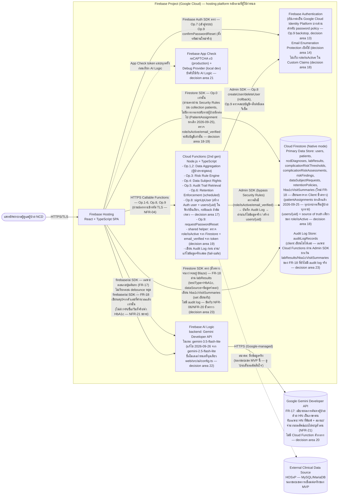

# Technology Stack

เอกสารนี้เป็น**จุดเดียวในโปรเจกต์ที่ระบุชื่อเทคโนโลยีจริง** (framework, ภาษาโปรแกรม, database engine,
hosting/deployment, กลไก auth, กลไกเข้ารหัส ฯลฯ) ต่อยอดจาก component เชิง logical ใน [[architecture]],
operation เชิง logical ใน [[api-spec]], entity เชิง logical ใน [[db-spec]] และสถานะการรองรับ NFR ใน
[[nfr-review]] ทุกการตัดสินใจอ้างอิงเหตุผลจาก NFR/component ที่ออกแบบไว้แล้ว และจากบริบททีม/องค์กรที่
เก็บจากผู้ใช้โดยตรงผ่านกระบวนการ intake (สรุปไว้ด้านล่าง) — **ไม่มีการเลือกเพราะความนิยม/ความชอบส่วนตัว
โดยไม่มีเหตุผลรองรับ**

อัปเดตล่าสุด: 2026-09-27 (**ปรับปรุงรอบห้า — เพิ่มเติมเฉพาะ decision area ใหม่ (decision area 23)**
สำหรับ FR-18 (ปุ่มสรุปจำนวนครั้งตรวจ HbA1c/ระยะห่างระหว่างการตรวจในปีงบประมาณต่อผู้ป่วยรายบุคคล บน
การ์ดผู้ป่วยในหน้ารายชื่อ, ระดับกลาง) และ NFR-21 ที่ขยายเพิ่ม (จำกัดข้อมูลที่ส่งให้ AI เฉพาะตัวเลขสรุป
ที่คำนวณแล้ว) ที่เพิ่งบันทึกใน [[20260917-01-patient-ncd-history-lab-complication-risk]]/
[[20260921-01-pdpa-data-protection-compliance]] เมื่อ 2026-09-27 — reuse stack เดิมของ FR-17 ทั้งหมด
(decision area 20-22) ไม่แตะ/ไม่ทบทวน decision area 1-22 เดิม ตามที่ผู้ใช้ยืนยันโหมด "เพิ่มเติมเฉพาะ
decision area ใหม่" — รอบก่อนหน้าในวันเดียวกัน (ก่อนรอบนี้) เป็น **Sync แก้ไขข้อความให้ตรงกับการยกเลิก
PatientAssignment** ผู้ใช้ยกเลิกกลไก PatientAssignment ทั้งหมดไปแล้วตั้งแต่ 2026-09-25 (ดู
[[ACL]]/[[api-spec]]/[[db-spec]] เป็นแหล่งความจริงหลัก) แต่ `technology-stack.md` ยังมีข้อความหลายจุดที่
อธิบาย PatientAssignment/`patientAssignments` เป็นสถาปัตยกรรมที่ยังใช้งานอยู่จริง (ตรวจพบโดย
`nfr-reviewer`) — แก้ไขเฉพาะจุดที่ได้รับผลกระทบ (decision area 3, 4, 7, 19, หัวข้อความเสี่ยง Security
Rules, Deployment Diagram) ให้ตรงกับสถานะปัจจุบันคือ **ทุกบทบาท (แพทย์/พยาบาล/admin) เห็นผู้ป่วยทุกราย
ในระบบเหมือนกัน หลังผ่านเงื่อนไข role/isActive/email_verified ระดับบัญชีเท่านั้น ไม่มีการกรองระดับ
รายผู้ป่วยอีกต่อไป** — ข้อความเดิมที่อธิบาย PatientAssignment คงไว้แบบ ~~ขีดฆ่า~~ พร้อมหมายเหตุแก้ไข
กำกับเพื่อ traceability ไม่ได้ลบทิ้งทั้งหมด — รอบ 2026-09-26 เพิ่ม decision area 20-22 สำหรับ FR-17/
NFR-21 (AI) และแก้ไขชื่อโมเดลเป็น `gemini-3.5-flash-lite`, รอบ 2026-09-24 เพิ่มกลไกสำหรับฟีเจอร์ที่ 6
(Authentication) ไว้ที่ decision area 13-19, รอบ 2026-09-22 เพิ่มกลไกสำหรับ NFR-09/NFR-12/NFR-13/
NFR-15 ไว้ที่ decision area 9-12)

## ภาพรวมบริบทที่ได้จาก Intake

เก็บบริบทจากผู้ใช้ผ่านคำถามหลายรอบ (รอบแรก: intake 6 ข้อ + decision area 7 ข้อ + คำถามชี้แจงเพิ่มเติม
1 ข้อ; รอบสอง 2026-09-22: decision area เพิ่มเติมอีก 4 ข้อสำหรับ NFR-09/NFR-12/NFR-13/NFR-15; รอบสาม
2026-09-24: decision area เพิ่มเติมอีก 7 ข้อสำหรับฟีเจอร์ที่ 6 — Authentication (NFR-17 Password
Policy, NFR-18 Account Enumeration Prevention, เทมเพลตอีเมล, Auth Blocking Functions, กลไกสร้าง
`users/{uid}`, การ sync role/isActive กับ custom claims, การตรวจ `emailVerified` ซ้ำฝั่งเซิร์ฟเวอร์ —
ดู decision area 13-19; รอบสี่ 2026-09-26: decision area เพิ่มเติมอีก 3 ข้อสำหรับ FR-17/NFR-21 — AI
ช่วยอธิบายผลการค้นหาผู้ป่วยด้วย HN และการจำกัดข้อมูลที่ส่งให้บริการ AI ภายนอก (App Check provider,
กลไกเรียก AI ตอนกดค้นหา, จุดกำหนดชื่อโมเดล AI — ดู decision area 20-22; รอบห้า 2026-09-27: decision area
เพิ่มเติมอีก 1 ข้อ (decision area 23) สำหรับ FR-18 — ปุ่มสรุปจำนวนครั้งตรวจ HbA1c/ระยะห่างระหว่างการตรวจ
ในปีงบประมาณต่อผู้ป่วย ไม่มีการตัดสินใจ AI provider/โมเดลใหม่ เพราะ reuse stack เดิมของ FR-17 ทั้งหมด
(decision area 20-22) มีเพียงประเด็นใหม่คือกลไกอ่าน `labResults`/เขียน collection ใหม่
`hba1cVisitSummaries` ที่ต้องทำผ่าน Client โดยตรงชั่วคราว — ดูรายละเอียดที่ decision area 23) — ทุกรอบ
ไม่มีคำถาม intake ใหม่เพราะบริบททีม/องค์กร/hosting ที่เก็บไว้ในรอบแรกยังคงใช้ได้และครอบคลุมเพียงพอ)

**สรุปการตัดสินใจย่อยของรอบสี่ (2026-09-26 — ยืนยันแล้วผ่าน `NEEDS_USER_INPUT`/`AskUserQuestion` โดย
orchestrator):** (1) ใช้ **Firebase AI Logic (Gemini Developer API backend)** เรียกจาก Client ตรงผ่าน
`firebase/ai` SDK แทน OpenRouter ผ่าน Cloud Function เพราะโปรเจกต์ยังไม่อยู่แพ็กเกจ Blaze, (2) โมเดล
**`gemini-3.5-flash-lite`** (แก้ไขในวันเดียวกัน 2026-09-26 จาก `gemini-2.5-flash-lite` เดิม — ยืนยันจาก
การเรียกจริงจากเว็บแอปที่ Firebase AI Logic ตอบ HTTP 404 "model models/gemini-2.5-flash-lite is no
longer available to new users" ก่อนถึงกำหนดการปิดให้บริการที่เคยประเมินไว้ที่ 2026-10-16 เสียอีก — ดู
decision area 22 สำหรับรายละเอียดเต็ม) กำหนดชื่อโมเดลไว้จุดเดียวในโค้ด, (3) เปิด **App Check** บังคับด้วย
**reCAPTCHA v3 + debug provider สำหรับ local dev**, (4) เรียก AI **เฉพาะตอนกดค้นหาเท่านั้น** (ไม่เรียก
ตอน debounce หยุดพิมพ์ — ตอนตัดสินใจครั้งแรกขัดกับข้อความ FR-17 ในตอนนั้น แต่ **ผู้ใช้แก้ไข FR-17 ผ่าน
`/capture-requirement` ให้ตรงกับกลไกนี้แล้วในภายหลัง** ความเสี่ยงนี้จึงคลี่คลายแล้ว — ดู decision area
20), (5) ใช้บนเว็บจริง (production), (6) หน้าทดสอบ `/dev/ai-test` ที่เรียก OpenRouter ตรงเป็น dev-only
ไม่ใช่ส่วนหนึ่งของ stack จริง
สรุปสาระสำคัญที่ใช้เป็นฐานการตัดสินใจทุกข้อด้านล่าง:

| หัวข้อ | คำตอบของผู้ใช้ | ผลต่อการตัดสินใจ |
| --- | --- | --- |
| ทีมพัฒนา/ทักษะ | ยังไม่มีทีมที่แน่นอน/ยังไม่ทราบ | เลือกเทคโนโลยีที่นิยม/มีเอกสารเยอะ ไม่ผูกความถนัดเฉพาะทีมใดทีมหนึ่ง |
| Hosting/Infrastructure | **ต้องการใช้ Firebase (Google) เป็น hosting platform หลัก** โดยเฉพาะเจาะจง | เป็นข้อจำกัดหลักที่มีน้ำหนักสูงสุด กำหนดทิศทาง decision area ส่วนใหญ่ |
| ข้อมูลผู้ป่วยในระบบ | เป็นข้อมูลจำลอง/สมมุติเท่านั้นในตอนนี้ (mockup) | สอดคล้องกับ NFR-01 อยู่แล้ว — บาง decision area (เช่น key management) เลือกระดับพื้นฐานที่เหมาะกับ MVP/mockup ก่อน แล้วบันทึกไว้เป็นประเด็นรอทบทวนเมื่อเปลี่ยนเป็นข้อมูลจริง |
| งบประมาณ/License | ต้องการ **open-source ทั้งหมด** | **ขัดแย้งบางส่วนกับ Firebase** (เป็น proprietary managed service ของ Google) — ดูหัวข้อ "ความขัดแย้งเชิงนโยบาย" ด้านล่าง ใช้ open-source เป็นเกณฑ์รองสำหรับ decision area ที่ไม่ขัดกับ Firebase (เช่น framework ฝั่ง client/ภาษาฝั่ง backend logic) |
| ความรู้เกี่ยวกับ HOSxP | ทราบว่า HOSxP ใช้ **MySQL/MariaDB** เป็นฐานข้อมูลหลัก | ใช้เป็นข้อมูลประกอบการพิจารณา risk ของการเลือก Firestore (NoSQL) เป็น Primary Data Store — บันทึกไว้ในประเด็นรอตัดสินใจเรื่องการเชื่อมต่อจริงในอนาคต |
| ขนาดผู้ใช้งาน | รพ.สต./ขนาดเล็ก (ผู้ใช้พร้อมกันไม่เกิน ~20 คน) | ไม่ต้องเผื่อสถาปัตยกรรมสำหรับ high-concurrency เลือก serverless ที่ scale-to-zero ได้ |
| แผนดูแลระยะยาว | ทีม IT โรงพยาบาลรับช่วงดูแลต่อหลัง MVP | เลือกเทคโนโลยีที่นิยม เอกสารเยอะ ดูแลง่าย ไม่ใช้เทคโนโลยีเฉพาะทาง |

### ความขัดแย้งเชิงนโยบาย — Open-source vs Firebase

ผู้ใช้ระบุทั้งสองความต้องการที่ขัดแย้งกันบางส่วน: (1) ต้องการ open-source ทั้งหมด และ (2) ต้องการใช้
Firebase (Google Cloud) เป็น hosting platform หลักโดยเฉพาะเจาะจง — **Firebase/Firestore/Cloud
Functions/Firebase Authentication เป็น proprietary managed service ของ Google ไม่ใช่ open-source**
แม้จะมี free tier (Spark plan) ให้ใช้งานได้โดยไม่มีค่าใช้จ่ายในระดับ MVP นี้ก็ตาม

ผู้ใช้ยืนยันให้ใช้ Firebase เป็นข้อจำกัดหลัก (น้ำหนักมากกว่า) ในทุก decision area ที่เกี่ยวข้องกับ
hosting/data store/auth ส่วนเกณฑ์ open-source ถูกนำไปใช้เป็นเกณฑ์รองสำหรับ decision area ที่ยังเลือก
ได้อิสระภายใต้ Firebase ecosystem (เช่น React/Vue/Angular ที่ client และ Node.js ที่ backend logic
ล้วนเป็น open-source license ทั้งหมด แม้ platform ที่รันจะเป็น proprietary) **ทีมงาน/ผู้มีอำนาจตัดสินใจ
ควรรับทราบความขัดแย้งนี้อย่างชัดเจน** และพิจารณาอีกครั้งหากนโยบาย open-source ของหน่วยงานเป็นข้อบังคับ
เข้มงวด (ไม่ใช่แค่ความต้องการ) — อาจต้องทบทวนใหม่เป็น self-hosted stack (เช่น PostgreSQL/MySQL แบบ
self-hosted) แทน Firebase ทั้งระบบ

## ตารางสรุป Component → เทคโนโลยีที่เลือก

| Component (จาก [[architecture]]) | เทคโนโลยีที่เลือก | เหตุผลอ้างอิง NFR/บริบท |
| --- | --- | --- |
| Client | **React + TypeScript**, deploy บน **Firebase Hosting** | ตอบโจทย์ hosting = Firebase ที่ผู้ใช้ระบุ, React เชื่อมต่อ Firebase SDK/เอกสารได้ดีที่สุดในสามตัวเลือก (React/Vue/Angular ฟรีเท่ากันทั้งหมดเพราะเป็น open-source — ความหมาย "ฟรี" ของผู้ใช้จึงอยู่ที่ Firebase Hosting free tier ไม่ใช่ตัว framework), นิยม/เอกสารเยอะเหมาะกับทีม IT ที่ดูแลต่อ (Q6) |
| Backend Service — Access Control | **Firestore Security Rules** (สำหรับ Operation 0) + **Cloud Functions authorization check ในโค้ด** (สำหรับ Operation 1–6) | สถาปัตยกรรม Firebase-native ตามที่ผู้ใช้เลือก (ไม่มี Backend Service แยกแบบดั้งเดิม) — ดูหัวข้อ "ความเสี่ยงที่ต้องพิจารณาเพิ่มเติม" สำหรับข้อจำกัดของแนวทางนี้ต่อ NFR-02/NFR-03 |
| Backend Service — Data Aggregation | Operation 0: **Client อ่าน Firestore ตรงผ่าน Firebase SDK** (กรองด้วย Security Rules); Operation 1, 2: **Cloud Functions (callable)** | Operation 0 ไม่มีข้อมูลผู้ป่วยรายบุคคลละเอียดอ่อนและไม่ trigger audit log จึงอ่านตรงได้ปลอดภัย; Operation 1/2 ต้องผ่านการบันทึก audit log แบบ fail-safe ก่อนเสมอ (NFR-06) จึงต้องมี Cloud Functions เป็นตัวกลาง |
| Backend Service — Risk Rule Engine | **Cloud Functions (2nd gen)**, Node.js + TypeScript | รองรับ FR-03/FR-04 แบบ rule-based, เขียน logic เปรียบเทียบ threshold ในโค้ดได้ชัดเจนกว่า Security Rules มาก |
| Backend Service — Audit Logging & Accountability | **Cloud Functions** เขียนลง **Firestore collection `auditLogRecords`** ผ่าน Admin SDK เท่านั้น (Security Rules ปฏิเสธ client เขียน/แก้ไข/ลบโดยตรง) | รองรับ NFR-06 (fail-safe, immutable) — เหตุผลเชิงเทคนิคเพิ่มเติมว่าทำไมต้องผ่าน Cloud Functions ดูหัวข้อ "รายละเอียด Audit Log Store" ด้านล่าง |
| Backend Service — Data Subject Rights & Retention Management | **Cloud Functions** (Operation 4 = callable, Operation 6 = scheduled function ผ่าน Cloud Scheduler) | รองรับ NFR-05/NFR-07 ต้องมี logic ตรวจสอบ/บังคับใช้นโยบายที่ซับซ้อนเกินกว่า Security Rules จะทำได้ |
| Primary Data Store | **Cloud Firestore (Native mode)** | ผู้ใช้ตัดสินใจเลือกเองโดยให้น้ำหนักกับ Firebase ecosystem + free tier แม้ ER model ใน [[db-spec]] จะเป็น relational ชัดเจน — ดูคำเตือน/แนวทาง denormalization ในหัวข้อ "รายละเอียด Primary Data Store" ด้านล่าง |
| Audit Log Store | **Cloud Firestore** collection แยก (`auditLogRecords`) เขียนผ่าน Cloud Functions เท่านั้น | ใช้ engine เดียวกับ Primary Data Store ตามที่ผู้ใช้เลือก ลดความซับซ้อนด้าน operations ให้ทีม IT ดูแลง่ายขึ้น (Q6) |
| Authentication/Authorization | **Firebase Authentication** (สร้าง/ยืนยันตัวตนบัญชี) — **ไม่ใช้ Custom Claims เก็บ "บทบาท"/สถานะบัญชีอีกต่อไป** (แก้ไขจากที่เคยระบุไว้เดิม — ดูเหตุผลที่ decision area 18) ใช้ **Firestore `users/{uid}` เป็น source of truth เดียว** สำหรับ role/isActive | native กับ Firebase 100% เหมาะกับ MVP ขนาดเล็ก (~20 concurrent users) ไม่มีค่าใช้จ่ายเพิ่มในระดับ Spark plan; แก้ปัญหาข้อมูลไม่ sync ระหว่าง Firestore กับ token claims (decision area 18) |
| Authentication — Password Policy Enforcement (NFR-17, ฟีเจอร์ที่ 6) | **Regex ในโค้ด Cloud Function `signUpUser`** (Operation 8) + **Google Cloud Identity Platform password policy** เป็น backstop ฝั่งเซิร์ฟเวอร์สำหรับ Operation 9 (ตั้งรหัสผ่านใหม่ผ่าน `confirmPasswordReset` ที่ไม่ผ่าน Cloud Function) | Operation 9 เกิดขึ้นในบริการยืนยันตัวตนเองโดยตรง ไม่มี Cloud Function คั่นกลาง — Regex ในโค้ดอย่างเดียวปิดช่องว่างนี้ไม่ได้ (ดู decision area 13) |
| Authentication — Account Enumeration Prevention (NFR-18, ฟีเจอร์ที่ 6) | **Firebase "Email Enumeration Protection"** (การตั้งค่าระดับโปรเจกต์) | ปิด error code ที่แยกแยะได้ของ Operation 7 (client เรียก Firebase Auth ตรง) โดยไม่ต้องเขียนโค้ดเพิ่ม — **ผู้ใช้ยืนยันไม่เพิ่มมาตรการ timing-based เพิ่มเติม รับทราบความเสี่ยง timing side-channel ที่ยังไม่ปิด** (ดู decision area 14) |
| Authentication — Email Templates (FR-09/FR-10, ฟีเจอร์ที่ 6) | **Template เริ่มต้นของ Firebase Authentication** ปรับ locale เป็นไทย + ชื่อผู้ส่งผ่าน Firebase Console เท่านั้น (ไม่ custom domain) | ไม่มีต้นทุนเพิ่ม เหมาะกับ MVP/ข้อมูลจำลอง — ควรทบทวนเป็น custom email service เมื่อเข้า production จริง (ดู decision area 15) |
| Authentication — Auth Blocking Functions (ฟีเจอร์ที่ 6) | **ไม่ใช้** (`beforeUserCreated`/`beforeUserSignedIn`) | หลีกเลี่ยงการอัปเกรดเป็น Identity Platform เพิ่มเติมสำหรับจุดนี้ (แม้ Identity Platform จะถูกเปิดใช้อยู่แล้วเพื่อ password policy ใน decision area 13) ลดความซับซ้อนของ deployment — ยอมรับว่า Operation 7 ยังไม่มีจุดตรวจ `emailVerified`/`isActive` ซ้ำระดับ token issuance (ดู decision area 16) |
| Backend Service — Account Onboarding Gateway (Operation 8, ฟีเจอร์ที่ 6) | **Cloud Function `signUpUser`** สร้าง Auth user (Admin SDK) และเขียน `users/{uid}` ในโค้ดเดียวกัน พร้อม rollback ลบ Auth user เองถ้าเขียน Firestore ล้มเหลว | ควบคุม error handling/compensating logic ได้ในจุดเดียว ไม่ต้องเพิ่ม trigger แยก (ดู decision area 17) |
| Encryption (at rest/in transit) + Key Management | **Google-managed encryption keys** (ค่าเริ่มต้นของ Firestore/Firebase Hosting/Cloud Functions ทั้งหมด) + HTTPS/TLS บังคับใช้โดย Firebase Hosting/Cloud Functions | รองรับ NFR-04 ขั้นพื้นฐานโดยไม่ต้องตั้งค่าเพิ่มเติม เหมาะกับ MVP ที่ยังใช้ข้อมูลจำลอง — ควรทบทวนใหม่เป็น CMEK เมื่อเปลี่ยนไปใช้ข้อมูลผู้ป่วยจริง (ดู "ประเด็นรอตัดสินใจ") |
| External Clinical Data Source (HOSxP) | ไม่ได้พัฒนาในโปรเจกต์นี้ — ทราบว่าใช้ MySQL/MariaDB | อยู่นอกขอบเขต MVP ตาม spec ต้นทาง — บันทึกไว้เป็นประเด็นรอตัดสินใจพร้อมข้อมูลที่ทราบแล้ว |
| Client/Backend Service/Primary Data Store — Performance (NFR-09) | **Firestore composite index เท่านั้น** ไม่มี caching layer เพิ่มเติม | ผู้ใช้เลือกความง่ายสูงสุดสำหรับ MVP ~20 concurrent users (ดู decision area 9) — trade-off: ทุก request อ่าน Firestore ทุกครั้งแม้ข้อมูลอ้างอิงคงที่ (เช่น threshold) |
| Client — Session Timeout (NFR-12) | **Client custom inactivity timer** (setTimeout + event listener) เรียก Firebase Auth `signOut()` เมื่อ idle เกิน 30 นาที — **ไม่มี server-side token revocation** | ผู้ใช้เลือกความง่ายสูงสุด (ดู decision area 10) — **มีความเสี่ยงด้านความปลอดภัยที่ต้องรับทราบ** (token ยังใช้ได้จนหมดอายุตามธรรมชาติ ~1 ชม.) ดูหัวข้อ "ความเสี่ยงที่ต้องพิจารณาเพิ่มเติม" |
| Client — Accessibility (NFR-13) | **WCAG 2.1 Level AA** + **Heroicons** (open-source) + **Lighthouse Accessibility Audit** | รองรับ NFR-13 (ห้ามใช้สีเป็นสัญญาณเดียว) ต่อยอดจาก [[DESIGN]] (ดู decision area 11) |
| Client — Browser Compatibility (NFR-15) | browserslist: `">0.5%, last 2 versions, Firefox ESR, not dead"` | รองรับ NFR-15 (Chrome/Edge/Firefox เวอร์ชันล่าสุดบน desktop/tablet) (ดู decision area 12) |
| Backend Service — Access Control (ตรวจ `emailVerified` ซ้ำ, ฟีเจอร์ที่ 6) | เพิ่มการตรวจ **`decodedToken.email_verified`** ใน shared helper module ของ Cloud Functions (Op.1-6) และ **`request.auth.token.email_verified`** ใน Firestore Security Rules (Op.0) | ปิดช่องว่างที่ [[user-authentication-email-password#Edge Case และวิธีจัดการ|detailed-design ระบุไว้ว่าเป็นความเสี่ยงจริง]] (client ที่ถูกดัดแปลง/บั๊กข้าม logic ตรวจ emailVerified) โดยไม่ต้องเพิ่ม Firestore read เพิ่ม (ค่ามาจาก token ที่ verify อยู่แล้วทุกครั้ง) (ดู decision area 19) |
| Client — AI-Powered Search Result Explanation (FR-17) | **Firebase AI Logic (Gemini Developer API backend)** เรียกตรงจาก Client ผ่าน `firebase/ai` SDK (`getAI`, `getGenerativeModel`, `GoogleAIBackend`) — โมเดล **`gemini-3.5-flash-lite`** (แก้ไข 2026-09-26 จาก `gemini-2.5-flash-lite` — ยืนยันจากการเรียกจริง Firebase AI Logic ตอบ 404 ว่ารุ่นเดิมไม่รองรับผู้ใช้ใหม่แล้ว) | รองรับ FR-17 โดยไม่ต้องอัปเกรดเป็นแพ็กเกจ Blaze (Gemini Developer API backend ใช้บนแพ็กเกจ Spark ได้) — ไม่มี Cloud Function ตัวกลางในรอบนี้จึงบังคับ NFR-21 ได้เฉพาะฝั่ง Client (ดู decision area 20) |
| Client — App Check สำหรับ AI Logic | **reCAPTCHA v3** (production) + **Debug Provider** (local dev) | Firebase บังคับเปิด App Check ให้ AI Logic อัตโนมัติตั้งแต่ ก.ค. 2026 — reCAPTCHA v3 ใช้งานได้บนแพ็กเกจ Spark โดยไม่ต้องเปิด billing ของ Google Cloud (ต่าง reCAPTCHA Enterprise) — ทดสอบสำเร็จจริงกับ Debug Provider ในการเรียก AI Logic (ดู decision area 21) |
| Client — จุดกำหนดชื่อโมเดล AI | Constant เดียวใน `web/src/ai/config.ts` (`GEMINI_MODEL_NAME = "gemini-3.5-flash-lite"`) | เปลี่ยนชื่อโมเดลได้ที่จุดเดียวในโค้ดตามที่ผู้ใช้ระบุ — พิสูจน์คุณค่าของแนวทางนี้แล้วจริงเมื่อ Google ปิดให้บริการ `gemini-2.5-flash-lite` เร็วกว่าที่ประเมินไว้ (แก้ไขค่าที่จุดเดียวสำเร็จ ไม่ต้องไล่หาทั่วโค้ด) (ดู decision area 22) |
| External AI Service | **Google Gemini Developer API** (ผ่าน Firebase AI Logic, ไม่ใช้ OpenRouter) | ผู้ใช้เลือกเพราะไม่ต้องมี API key ของผู้ให้บริการ AI ฝังใน bundle และใช้ได้บนแพ็กเกจ Spark — ข้อจำกัดของ NFR-21 (ห้ามส่งข้อมูลระบุตัวตน) บังคับใช้ที่ชั้น prompt construction ฝั่ง Client เท่านั้น (ดู decision area 20) |
| Client — FR-18 คำนวณ visit/ระยะห่างวัน HbA1c ต่อปีงบประมาณ | **คำนวณในโค้ด Client (TypeScript)** ทั้งหมด — ไม่ใช้ AI สำหรับขั้นตอนนี้ | รองรับ FR-18 ข้อ 4 (ยืนยันแล้ว): เฉพาะการเขียนสรุปภาษาไทยเท่านั้นที่ใช้ AI ตรรกะคำนวณวันที่/นับจำนวน/ระยะห่างเป็น deterministic logic ที่ unit test ได้ตรงไปตรงมา (ดู decision area 23) |
| Client — FR-18 อ่าน `labResults` + เขียน `hba1cVisitSummaries` | **Client อ่าน/เขียน Firestore ตรงผ่าน Firebase SDK** — **ชั่วคราวจนกว่าจะอยู่ Blaze** (เหมือน `clientAuthFlows.ts`/`accountApproval.ts`) | ไม่มี Cloud Function ให้ deploy ได้ในสถานะปัจจุบันของโปรเจกต์ — **ขัดกับสถาปัตยกรรมที่ออกแบบไว้ตาม NFR-06/decision area 3/5 โดยตรง** (ไม่มี audit log, Security Rules `labResults` ที่ตั้งใจไว้ต้อง `if false` แต่ถูกเลี่ยงด้วยกฎเปิดกว้างที่ root ปัจจุบัน) — ดู target design ใน decision area 23 สำหรับตอนอยู่ Blaze |
| Firestore collection ใหม่ — `hba1cVisitSummaries/{patientId}_{fiscalYear}` | เก็บตัวเลขที่คำนวณแล้ว + ข้อความสรุปจาก AI + ชื่อโมเดล + เวลาที่สร้าง — เขียนทับด้วย `set()` เมื่อกดซ้ำ ไม่มี version history | รองรับ FR-18 ข้อ 8 (ยืนยันแล้ว) — เป็น**ข้อยกเว้นเดียว**ในกลุ่ม decision area 20-23 ที่บันทึกผลลัพธ์ AI ลง Firestore จริง (FR-17 ไม่บันทึก) — ดู decision area 20 หัวข้อ "ข้อยกเว้นที่ต้องบันทึกไว้" |

## รายละเอียดต่อ Decision Area

### 1. ภาษา/Framework ฝั่ง Client — React + TypeScript

**เลือก:** React (+ TypeScript), build เป็น static SPA, deploy บน Firebase Hosting

**เหตุผล:** ผู้ใช้ระบุเงื่อนไข "เชื่อมกับ Firebase แล้วฟรี" — React, Vue และ Angular ทั้งสามเป็น
open-source ใช้งานฟรีเท่ากันหมด (ไม่มีค่า license ของตัว framework เอง) ความหมาย "ฟรี" ที่ผู้ใช้ต้องการ
จึงอยู่ที่ **Firebase Hosting free tier (Spark plan)** ซึ่งรองรับ static SPA จากทั้งสาม framework ได้
เท่ากัน — ปัจจัยตัดสินใจจริงจึงอยู่ที่ความเข้ากันได้กับ Firebase SDK/เอกสาร และความนิยม/เอกสารสำหรับทีม
IT ที่จะรับช่วงดูแลต่อ (Q6)

**ทางเลือกอื่นที่พิจารณาแล้วไม่เลือก:**
- Vue.js — เรียนรู้ง่ายกว่า แต่ community/ตลาดแรงงานเล็กกว่า React ทำให้ทีม IT หาคนดูแลต่อยากกว่า
- Angular — โครงสร้างเข้มงวด เหมาะกับ enterprise แต่ setup หนักเกินความจำเป็นสำหรับ MVP ขนาดเล็ก
  (~20 concurrent users)

### 2. ภาษา/Framework ฝั่ง Backend Logic — Node.js + TypeScript บน Cloud Functions

**เลือก:** Node.js + TypeScript สำหรับทุก Cloud Function

**เหตุผล:** เช่นเดียวกับ Client — "ฟรี" หมายถึง Firebase/Google Cloud free tier (Cloud Functions
มี free tier ที่เพียงพอสำหรับ ~20 concurrent users) ไม่ใช่ตัวภาษาเอง เลือก Node.js เพราะ integrate
กับ Firebase Admin SDK/Firestore ได้ native ที่สุด เอกสาร Firebase ส่วนใหญ่อ้างอิง Node.js เป็นหลัก
ลดความซับซ้อนของทีมที่ต้องดูแลทั้ง client (React/TS) และ backend logic (Node.js/TS) ด้วยภาษาเดียวกัน

**ทางเลือกอื่นที่พิจารณาแล้วไม่เลือก:**
- Python (FastAPI-style Cloud Functions) — เหมาะกับ Risk Rule Engine เชิง logic แต่เอกสาร/ตัวอย่าง
  การใช้ร่วมกับ Firebase มีน้อยกว่า Node.js
- Go — performance สูงแต่ทีมทั่วไปหายากกว่า ขัดกับเป้าหมาย "ดูแลง่าย" ของทีม IT โรงพยาบาล (Q6)

### 3. สถาปัตยกรรม Backend Service — Firebase-native (ไม่มี Backend Service แยกแบบดั้งเดิม)

**เลือก:** ไม่มี persistent backend server แยกต่างหาก — แบ่งเป็น 2 เส้นทาง:
- **เส้นทาง Client → Firestore ตรง** (ผ่าน Firebase SDK + Security Rules): ใช้เฉพาะ **Operation 0**
  (ค้นหา/แสดงรายชื่อผู้ป่วยทุกรายในระบบ — **แก้ไข 2026-09-27 เพื่อสอดคล้องกับการยกเลิก PatientAssignment
  เมื่อ 2026-09-25** เดิมข้อความนี้เขียนว่า "แสดงรายชื่อผู้ป่วยในความดูแล" และ "กรองผลลัพธ์ตาม
  PatientAssignment" ซึ่งไม่ตรงกับสถาปัตยกรรมปัจจุบันอีกต่อไป — ดู [[ACL]]/[[api-spec#Operation 0 — ค้นหา/แสดงรายชื่อผู้ป่วยทั้งหมดในระบบ (ค้นหาเฉพาะรายด้วยเลข HN)|api-spec Operation 0]] เป็นแหล่งความจริง)
  เพราะยังไม่มีการระบุผู้ป่วยรายบุคคล ไม่ trigger audit log ตามเจตนาของ [[architecture]] อยู่แล้ว และ
  Security Rules ตรวจสอบเพียง **role/isActive/email_verified ระดับบัญชีเท่านั้น** (ไม่มีการกรองระดับ
  รายผู้ป่วยอีกต่อไป — ทุกบทบาทที่ผ่านเงื่อนไขพื้นฐานเห็นผู้ป่วยทุกรายเหมือนกัน) ด้วย query แบบ
  exact-match บน field `hn` เดียว (หรืออ่านทั้ง collection เมื่อไม่ระบุ HN)
- **เส้นทาง Client → Cloud Functions (callable)**: ใช้กับ **Operation 1, 2, 3, 4, 5, 6** ทั้งหมด — คือ
  ทุก operation ที่เข้าถึงข้อมูลผู้ป่วยรายบุคคล/ข้อมูล audit trail/คำขอสิทธิ

**เหตุผลของการแบ่งเส้นทางนี้ (ส่วนขยายทางเทคนิคจากตัวเลือกที่ผู้ใช้อนุมัติ):** ผู้ใช้อนุมัติแนวทาง
"Cloud Functions เฉพาะจุดที่ต้องมี server-side logic เช่น Risk Rule Engine, Audit Logging, Retention
Enforcement" — เมื่อพิจารณาเชิงเทคนิคเพิ่มเติมพบว่า **ข้อกำหนด fail-safe ของ NFR-06** ("ต้องบันทึก
audit log ก่อนอ่าน/แก้ไขข้อมูลจริงเสมอ และถ้าบันทึกไม่สำเร็จต้องยกเลิกการดำเนินการทั้งหมด" ตาม
[[api-spec#Operation ร่วม — บันทึกร่องรอยการเข้าถึงข้อมูลผู้ป่วย (Audit Logging)|Operation ร่วม Audit
Logging ใน api-spec]]) **ไม่สามารถบังคับใช้ได้อย่างน่าเชื่อถือถ้า Client อ่านข้อมูลผู้ป่วยรายบุคคลตรง
จาก Firestore เอง** เพราะไม่มีกลไกใดบังคับให้ Client ต้องเรียกสร้าง audit log ก่อนอ่านข้อมูลจริงเสมอ
(Client ฝั่งที่ถูกดัดแปลง/บั๊ก อาจข้ามขั้นตอนสร้าง audit log แล้วอ่านข้อมูลตรงได้ถ้า Security Rules
อนุญาต) จึงตัดสินใจขยายให้ Operation 1–6 ทั้งหมด (ไม่ใช่แค่ 3 operation ที่ผู้ใช้ระบุตัวอย่างไว้) ต้อง
ผ่าน Cloud Functions เป็นตัวกลางเสมอ เพื่อให้ Cloud Function เป็นจุดเดียวที่บังคับลำดับ "ตรวจสิทธิ์ →
บันทึก audit log → อ่าน/แก้ไขข้อมูลจริง" ได้จริงตามที่ api-spec.md กำหนด — เป็นการตีความที่ยังคงหลักการ
"Firebase-native ไม่มี persistent server" ของผู้ใช้ไว้ (Cloud Functions เป็น serverless เช่นกัน) เพียง
แต่ขยายขอบเขตของ Cloud Functions ให้ครอบคลุมมากกว่าที่ยกตัวอย่างไว้เดิม

### 4. Database Engine ของ Primary Data Store — Cloud Firestore (Native mode)

**เลือก:** Cloud Firestore (Native mode) — **ตัดสินใจโดยผู้ใช้โดยตรง ขัดกับคำแนะนำเดิมของ agent นี้**
(เดิมแนะนำ Cloud SQL/MySQL เพราะ ER model ใน [[db-spec]] เป็น relational ชัดเจน) ผู้ใช้ให้เหตุผลว่า
ต้องการอยู่ใน Firebase ecosystem เต็มรูปแบบและใช้ free tier

**คำเตือน/ความเสี่ยงที่ต้องพิจารณาเมื่อ implement จริง (ส่งต่อให้ `sync-api-db`/`sync-detailed-design`):**

**หมายเหตุแก้ไข 2026-09-27 (sync กับการยกเลิก PatientAssignment เมื่อ 2026-09-25):** ย่อหน้าและรายการ
ด้านล่างในหัวข้อนี้เดิมอธิบายความสัมพันธ์ N:M ระหว่าง User และ Patient ผ่าน entity "PatientAssignment"
และแนวทาง denormalize เป็น collection `patientAssignments` — **entity/collection นี้ถูกยกเลิกไปแล้ว
ทั้งหมดตั้งแต่ 2026-09-25** ตามที่ผู้ใช้ยืนยัน (ดู [[ACL]] เป็นแหล่งความจริงหลักของสิทธิ์, [[api-spec#Operation 14, 15 — ยกเลิกแล้ว (2026-09-25)|api-spec หัวข้อ "Operation 14, 15 — ยกเลิกแล้ว"]],
และ [[db-spec]] ที่ลบ collection นี้ออกแล้ว) **แพทย์/พยาบาล/admin ทุกคนเห็นผู้ป่วยทุกรายในระบบเหมือนกัน
หลังผ่านเงื่อนไข role/isActive/email_verified ระดับบัญชีเท่านั้น ไม่มีการกรองระดับรายผู้ป่วยอีกต่อไป**
— คงข้อความเดิมด้านล่างไว้แบบขีดฆ่าเพื่อ traceability ประวัติการตัดสินใจ ไม่ใช่สถาปัตยกรรมปัจจุบัน:

~~[[db-spec]] ออกแบบ ER model เป็น relational เต็มรูปแบบ มี foreign key และความสัมพันธ์ N:M ผ่าน
PatientAssignment รวมถึง RiskFinding ที่อ้างอิง 3 entity พร้อมกัน (ComplicationRiskAssessment,
ComplicationRiskThreshold, LabResult)~~ — Firestore เป็น NoSQL document store ไม่มี join/foreign key
constraint แบบ native จึงยังต้อง **denormalize** ข้อมูลบางส่วนเมื่อ implement จริง (ส่วนที่ยังใช้งานอยู่
จริง แนวทางเบื้องต้นที่แนะนำ รายละเอียดสุดท้ายควรกำหนดใน `sync-api-db`):

- ~~**PatientAssignment (N:M ระหว่าง User และ Patient):** แทนที่จะเป็น collection กลางแบบ relational
  table ให้พิจารณาเก็บเป็น subcollection `patients/{patientId}/assignments/{userId}` (หรือ document
  ID แบบ composite `{userId}_{patientId}` ใน top-level collection `patientAssignments`) เพื่อให้
  Security Rules ใช้ `exists()` ตรวจสอบสิทธิ์ได้ง่ายโดยไม่ต้อง query แบบ collection group เสมอไป~~
  **(ยกเลิกแล้ว 2026-09-25 — ไม่มี collection นี้อีกต่อไป Operation 0 อ่าน collection `patients`
  โดยตรงด้วย equality query บน `hn` เมื่อผู้ใช้ค้นหา หรืออ่านทั้ง collection เมื่อแสดงรายชื่อทั้งหมด
  ไม่ต้องมี composite index — ตรงกับข้อมูลอ้างอิงจากโค้ดจริงของ `web/`)**
- **RiskFinding (อ้างอิง 3 entity):** เก็บเป็น subcollection ของ ComplicationRiskAssessment
  (`complicationRiskAssessments/{id}/riskFindings/{id}`) และ **copy ค่า threshold/comparator แบบ
  snapshot ลงไปในเอกสารโดยตรง** (ตามที่ [[db-spec#รายละเอียดผลการประเมินต่อโรคแทรกซ้อน (RiskFinding)|
  db-spec ระบุไว้แล้วว่าต้อง snapshot อยู่แล้ว]] — สอดคล้องกับข้อจำกัดของ Firestore โดยบังเอิญ) — ไม่ได้
  รับผลกระทบจากการยกเลิก PatientAssignment
- **AuditLogRecord ที่ต้องสืบค้นตามผู้ป่วย/ผู้ใช้/ช่วงเวลาพร้อมกัน (Operation 5):** Firestore composite
  index จำเป็นสำหรับ query แบบหลายเงื่อนไข ต้องออกแบบ index ล่วงหน้าใน `firestore.indexes.json`
- ~~โดยรวม การ query ที่ซับซ้อนกว่า exact-match เดียว (เช่น "ผู้ป่วยที่มี HN ตรงกัน **และ** อยู่ใน
  PatientAssignment ของผู้ใช้") ต้องพึ่งพา Cloud Functions ประมวลผลแทนการ query ตรงจาก client ในหลาย
  กรณี~~ **(ไม่มีเงื่อนไข PatientAssignment ให้ตรวจสอบร่วมอีกต่อไปตั้งแต่ 2026-09-25 — Operation 0 จึง
  เป็น equality query เดี่ยวที่ไม่ต้องพึ่ง Cloud Functions จริง)** ซึ่งยังคงสอดคล้องกับการตัดสินใจใน
  decision area 3 ที่ให้ Cloud Functions มาเป็นตัวกลางของ Operation 1–6 อยู่แล้ว (ด้วยเหตุผลเรื่อง
  audit log fail-safe ตาม NFR-06 ไม่ใช่เพราะ query ซับซ้อนอีกต่อไป)

**ทางเลือกอื่นที่พิจารณาแล้ว (ไม่ถูกเลือก แม้จะเคยแนะนำ):**
- Cloud SQL (MySQL) — ตรงกับ ER model โดยตรง และเป็น engine ตระกูลเดียวกับ HOSxP (MySQL/MariaDB)
  ช่วยลดความเสี่ยงตอนเชื่อมต่อจริงในอนาคต แต่ผู้ใช้เลือกไม่ใช้เพราะให้น้ำหนักกับ Firebase ecosystem
  มากกว่า
- Cloud SQL (PostgreSQL) — ความสามารถเชิง relational แข็งแรง แต่ engine คนละตระกูลกับ HOSxP อยู่ดี
  และผู้ใช้ไม่เลือกเช่นกัน

### 5. Audit Log Store — Cloud Firestore collection แยก เขียนผ่าน Cloud Functions เท่านั้น

**เลือก:** collection `auditLogRecords` ใน Firestore engine เดียวกับ Primary Data Store

**เหตุผลเชิงเทคนิคเพิ่มเติม (สำคัญ):** คำตอบเดิมของผู้ใช้ระบุ "Firestore แยก collection + Security
Rules ปฏิเสธ update/delete" ซึ่งถูกต้องสำหรับการป้องกัน**การแก้ไข/ลบ** ระเบียนที่มีอยู่แล้ว (คุณสมบัติ
append-only/immutable ตาม NFR-06) แต่ **ไม่ครอบคลุมการบังคับลำดับ "ต้องสร้าง audit log ก่อนอ่านข้อมูล
จริงเสมอ" (fail-safe)** ถ้า Client เป็นผู้สร้างระเบียน audit log เอง (`allow create` ใน Security
Rules) จึงตัดสินใจให้ **เฉพาะ Cloud Functions (ผ่าน Firebase Admin SDK ซึ่ง bypass Security Rules)
เท่านั้นที่เขียนระเบียนลง `auditLogRecords` ได้** — Client ไม่มีสิทธิ์ create/update/delete ใน
collection นี้โดยตรงเลย (Security Rules: `allow read, write: if false;` สำหรับ client ทั้งหมด) เพื่อ
บังคับให้ทุกการเข้าถึงข้อมูลผู้ป่วยรายบุคคลต้องผ่าน Cloud Functions (ซึ่งบันทึก audit log ภายในฟังก์ชัน
เดียวกันก่อน return ข้อมูล) ตามที่ตัดสินใจไว้ใน decision area 3

### 6. Hosting/Deployment Environment

| Component | Hosting/Deployment |
| --- | --- |
| Client (React SPA) | Firebase Hosting (static hosting, CDN ของ Google, HTTPS บังคับอัตโนมัติ) |
| Cloud Functions (ทุกกลุ่มงาน backend logic) | Cloud Functions (2nd gen) ใน Firebase project เดียวกัน — callable functions สำหรับ Op.1-5, scheduled function (ผ่าน Cloud Scheduler) สำหรับ Op.6 |
| Primary Data Store + Audit Log Store | Cloud Firestore (Native mode) ใน Firebase project เดียวกัน (region เดียวกับ Cloud Functions เพื่อลด latency) |
| Authentication | Firebase Authentication (บริการเดียวกัน ไม่มี infrastructure แยก) |

ทุก component อยู่ภายใต้ Firebase project เดียวกัน (single Google Cloud project) ตามข้อจำกัด hosting
ที่ผู้ใช้ระบุไว้อย่างชัดเจน ไม่มีการแยก on-premise/hybrid เนื่องจากข้อมูลในระบบปัจจุบันเป็นข้อมูลจำลอง
ยังไม่ใช่ข้อมูลผู้ป่วยจริง (ควรทบทวนอีกครั้งเมื่อเข้าสู่ช่วง production จริงกับข้อมูลผู้ป่วยจริง — ดู
"ประเด็นรอตัดสินใจ")

### 7. Authentication/Authorization — Firebase Authentication (ไม่ใช้ Custom Claims เก็บบทบาท — แก้ไขในรอบสาม 2026-09-24)

**เลือก (ปรับปรุงในรอบสาม 2026-09-24 — ดู decision area 18):** Firebase Authentication ทำหน้าที่
สร้าง/ยืนยันตัวตนบัญชีเท่านั้น **ไม่เก็บ "บทบาท" (แพทย์/พยาบาล) หรือ `isActive` ของ
[[db-spec#ผู้ใช้ (User)|User]] ไว้ใน custom claims อีกต่อไป** — ทั้ง Firestore Security Rules (สำหรับ
Operation 0) และ Cloud Functions (สำหรับ Operation 1–6) **อ่าน `role`/`isActive` จากเอกสาร Firestore
`users/{uid}` โดยตรงทุกครั้ง** เป็น source of truth เดียว (ตรงกับ Technical Binding ที่ [[api-spec]]
ระบุไว้แล้วในทางปฏิบัติ — ดูเหตุผลเต็มที่ decision area 18) ~~ส่วนการตรวจสอบระดับรายผู้ป่วย
(PatientAssignment) ยังคง query/exists check กับ Firestore เช่นเดิม~~ **(แก้ไข 2026-09-27 — ไม่มีการ
ตรวจสอบระดับรายผู้ป่วยอีกต่อไปตั้งแต่ 2026-09-25 หลังยกเลิก PatientAssignment ทั้งหมด ทุกบทบาทที่ผ่าน
role/isActive/email_verified เห็นผู้ป่วยทุกรายเหมือนกัน ดู [[ACL]])**

**เหตุผลของการแก้ไขจากที่เคยระบุไว้เดิม (ใน rounds ก่อนหน้าเคยเลือกเก็บบทบาทใน custom claims):**
เมื่อผู้ใช้ตัดสินใจใน decision area 18 (การ sync role/isActive กับ custom claims เมื่อผู้ดูแลอนุมัติผ่าน
Console) ว่า**ไม่ต้อง sync ไปยัง custom claims เลย** เพื่อไม่ให้เกิดข้อมูลไม่ตรงกันระหว่าง Firestore กับ
token claims ที่ refresh ไม่บ่อย การเก็บ "บทบาท" ซ้ำใน custom claims จึงไม่มีประโยชน์อีกต่อไป (เป็น
ข้อมูลซ้ำที่ไม่เคยถูกอ่านจริงในทางปฏิบัติ เพราะ Technical Binding ของทุก operation อ่านจาก Firestore
โดยตรงอยู่แล้ว) — การแก้ไขนี้ทำให้เอกสารสอดคล้องกับสิ่งที่ implement จริง ลดความสับสน

**เหตุผลพื้นฐานของการเลือก Firebase Authentication (ยังคงเดิม):** native กับ Firebase 100% ตั้งค่าเร็ว
รองรับ MVP ขนาดเล็กได้ดี ไม่มีค่าใช้จ่ายเพิ่มในระดับ Spark/Blaze plan พื้นฐาน

**ทางเลือกอื่นที่พิจารณาแล้วไม่เลือก:**
- สร้างระบบ authentication เอง (custom JWT) — เพิ่มความเสี่ยงด้านความปลอดภัยจากการสร้างเอง ขัดกับ
  เป้าหมาย "ดูแลง่าย" ของทีม IT และไม่ได้ใช้ประโยชน์จาก Firebase ที่เลือกไว้แล้ว
- เก็บบทบาท/isActive ใน custom claims ต่อไปพร้อม sync mechanism (decision area 18 ตัวเลือก A) — ปิด
  ช่องว่างได้เช่นกัน แต่เพิ่ม Cloud Function trigger ที่ต้อง maintain โดยไม่มีประโยชน์เพิ่มเพราะทุก
  operation อ่าน Firestore โดยตรงอยู่แล้ว
- Firebase Authentication + Google Cloud Identity Platform เต็มรูปแบบพร้อม SSO/SAML — เกินความจำเป็น
  สำหรับ MVP ที่ยังใช้ข้อมูลจำลอง บันทึกไว้เป็นทางเลือกสำหรับอนาคตเมื่อต้องเชื่อมต่อระบบยืนยันตัวตนของ
  โรงพยาบาลจริง (ดู "ประเด็นรอตัดสินใจ") — **หมายเหตุ: โปรเจกต์นี้ถูกอัปเกรดเป็น Identity Platform แล้ว
  บางส่วนตาม decision area 13 (สำหรับ password policy เท่านั้น) ไม่ใช่การอัปเกรดเต็มรูปแบบเพื่อ SSO/SAML**

### 8. กลไกเข้ารหัสข้อมูล (NFR-04) และการบริหารกุญแจเข้ารหัส

**เลือก:** ใช้ **Google-managed encryption keys ตามค่าเริ่มต้าน** ของ Firestore (encryption at rest
อัตโนมัติ) และ HTTPS/TLS บังคับใช้โดย Firebase Hosting และ Cloud Functions (encryption in transit
อัตโนมัติ) — ไม่มีการตั้งค่า Customer-Managed Encryption Keys (CMEK) หรือ field-level encryption
เพิ่มเติมในขั้นนี้

**เหตุผล:** ครอบคลุม NFR-04 ในระดับพื้นฐานโดยไม่ต้องตั้งค่าเพิ่มเติม เหมาะกับ MVP ขนาดเล็กที่ยังใช้
ข้อมูลจำลอง (ไม่ใช่ข้อมูลผู้ป่วยจริง) ทีม IT ดูแลง่ายที่สุดตามเป้าหมายที่ผู้ใช้ระบุ (Q6)

**ทางเลือกอื่นที่พิจารณาแล้วไม่เลือกตอนนี้ (บันทึกไว้สำหรับทบทวนในอนาคต):**
- Customer-Managed Encryption Keys (CMEK) ผ่าน Cloud KMS — ให้องค์กรควบคุม key lifecycle เอง
  เหมาะเมื่อเปลี่ยนไปใช้ข้อมูลผู้ป่วยจริง
- Field-level encryption เพิ่มเติมในชั้น Cloud Functions (เช่น เข้ารหัส HN ด้วย envelope encryption
  ก่อนบันทึก) — ป้องกันอีกชั้นแต่กระทบการค้นหา HN แบบ exact match (ต้องใช้ deterministic encryption)
  และซับซ้อนเกินความจำเป็นของ MVP ปัจจุบัน

### 9. กลไกรองรับ Performance < 2 วินาที (NFR-09) — Firestore Composite Index เท่านั้น (ไม่มี caching layer เพิ่มเติม)

**เลือก:** ใช้ **Firestore composite index** ออกแบบตาม query pattern จริงของแต่ละ operation (โดยเฉพาะ
Operation 5 — สืบค้น audit trail แบบหลายเงื่อนไขพร้อมกัน ตามที่ decision area 4 ระบุไว้แล้วว่าต้องมี
composite index) เป็นกลไกเดียวที่ใช้รองรับ NFR-09 ในรอบนี้ — **ไม่เพิ่ม caching layer ใดๆ** (ไม่มี
in-memory caching ใน Cloud Functions, ไม่มี Redis/Memorystore)

**เหตุผล:** ผู้ใช้เลือกแนวทางที่ง่ายที่สุดโดยตรง (ไม่ใช่คำแนะนำเดิมของ agent นี้ที่เสนอ in-memory
caching เพิ่มเติมสำหรับข้อมูลอ้างอิงคงที่) ให้เหตุผลว่าต้องการลดความซับซ้อนของระบบให้น้อยที่สุดสำหรับ
MVP ขนาด ~20 concurrent users สอดคล้องกับเป้าหมาย "ดูแลง่าย" ของทีม IT โรงพยาบาลที่จะรับช่วงดูแลต่อ (Q6
ของ intake)

**Trade-off ที่ต้องบันทึกไว้อย่างชัดเจน (ตามที่ผู้ใช้ร้องขอโดยตรง):** ด้วยแนวทางนี้ **ทุก request จะยัง
อ่าน Cloud Firestore ทุกครั้งแม้เป็นข้อมูลอ้างอิงที่แทบไม่เปลี่ยนแปลง** เช่น `ComplicationRiskThreshold`
ที่ Risk Rule Engine (Operation 3) ต้องอ่านทุกครั้งที่ประมวลผลความเสี่ยง แทนที่จะ cache ไว้ในหน่วยความจำ
ของ Cloud Function instance — สำหรับสเกล ~20 concurrent users ปัจจุบัน คาดว่ายังทำเวลาตอบสนอง < 2
วินาทีได้ (Firestore single-document read มี latency ต่ำในระดับ milliseconds เมื่อมี index ที่เหมาะสม)
แต่ **ถ้าในอนาคตพบจากการทดสอบ performance จริง (ดู [[test-plan]]) ว่าไม่สามารถทำ < 2 วินาทีได้อย่าง
สม่ำเสมอด้วยวิธีนี้ ขั้นตอนถัดไปที่ควรพิจารณาคือ in-memory caching ใน Cloud Functions สำหรับข้อมูลอ้างอิง
คงที่** (แนวทางที่ agent นี้เคยเสนอไว้แต่ผู้ใช้เลือกไม่ใช้ในรอบนี้) ก่อนที่จะพิจารณา managed caching
layer แยกต่างหาก (Memorystore/Redis) ซึ่งมีค่าใช้จ่าย/ความซับซ้อนสูงกว่ามาก

**ทางเลือกอื่นที่พิจารณาแล้วไม่เลือก (บันทึกไว้สำหรับทบทวนในอนาคตตามลำดับ):**
- In-memory caching ใน Cloud Functions สำหรับข้อมูลอ้างอิงคงที่ (เช่น threshold) — ลด Firestore read
  ได้จริงโดยไม่เพิ่ม infrastructure แต่ไม่ทำงานตอน cold start และเพิ่มความซับซ้อนของโค้ดเล็กน้อย ผู้ใช้
  เลือกไม่ใช้ในรอบนี้เพื่อความง่ายสูงสุด — ควรพิจารณาเป็นลำดับถัดไปถ้าพบปัญหาตามที่ระบุไว้ข้างต้น
- Managed caching layer แยก (Google Cloud Memorystore/Redis) — ประสิทธิภาพสูงสุดแต่มีค่าใช้จ่ายเพิ่ม
  นอกเหนือ Firebase free tier และซับซ้อนเกินความจำเป็นสำหรับสเกลปัจจุบัน ขัดกับเป้าหมาย "ดูแลง่าย" (Q6)

### 10. กลไก Session Timeout (NFR-12) — Client Custom Inactivity Timer เท่านั้น (ไม่มี Server-side Token Revocation)

**เลือก:** เขียน inactivity timer เองฝั่ง Client (custom implementation ด้วย `setTimeout` + event
listener บน mouse/keyboard/touch event มาตรฐานของ browser) นับเวลาไม่มีการโต้ตอบต่อเนื่อง เมื่อครบ 30
นาทีเรียก Firebase Authentication `signOut()` ทันที กลับไปหน้าจอยืนยันตัวตนใหม่ — **ไม่มีกลไกฝั่ง
เซิร์ฟเวอร์เพื่อเพิกถอน (revoke) token ซ้ำ**

**เหตุผล:** ผู้ใช้เลือกแนวทางที่ง่ายที่สุดโดยตรง (ไม่ใช่คำแนะนำเดิมของ agent นี้ที่เสนอ `react-idle-timer`
+ Cloud Function เพิกถอน token) ไม่ต้องพึ่งพา library ภายนอกเพิ่มเติม ลดจำนวน dependency ที่ทีม IT ต้อง
ดูแลต่อ (Q6)

**คำเตือนด้านความปลอดภัยที่สำคัญ (ผู้ใช้รับทราบและยืนยันให้ดำเนินการต่อแล้ว — ดูรายละเอียดเต็มในหัวข้อ
[[technology-stack#ความเสี่ยงที่ต้องพิจารณาเพิ่มเติม (สำคัญ — ผู้ใช้รับทราบและยืนยันให้ดำเนินการต่อแล้ว)|
"ความเสี่ยงที่ต้องพิจารณาเพิ่มเติม" ด้านล่าง]]):** กลไกนี้เป็น **best-effort ฝั่ง Client เท่านั้น** —
ถ้า Firebase ID token ของผู้ใช้ถูกขโมย/ดักจับไว้ก่อนที่ client-side timer จะทำงาน (เช่น อุปกรณ์ถูกขโมย
พร้อม token ที่ intercept ไว้ล่วงหน้า หรือ client ถูกดัดแปลง/บั๊กจนไม่เรียก `signOut()`) **token นั้นยัง
คงใช้งานได้ต่อจนกว่าจะหมดอายุตามธรรมชาติของ Firebase ID token (สูงสุดประมาณ 1 ชั่วโมง)** ซึ่ง**นานกว่า
30 นาทีที่ NFR-12 กำหนดไว้จริง** — เกิดช่องว่างระหว่างสิ่งที่ NFR-12 ต้องการ (บังคับใช้จริงหลัง 30 นาที)
กับสิ่งที่กลไกนี้ทำได้จริง (แจ้ง/ล็อกเอาต์ฝั่ง UI เท่านั้น ไม่ได้ทำให้ token เป็นโมฆะจริงฝั่งเซิร์ฟเวอร์)

**ทางเลือกอื่นที่พิจารณาแล้วไม่เลือก:**
- `react-idle-timer` (open-source, MIT) + Cloud Function เพิกถอน token ผ่าน Admin SDK
  `revokeRefreshTokens()` — ปิดช่องว่างนี้ได้จริง เป็นการป้องกันซ้ำอีกชั้น แต่เพิ่ม dependency และความ
  ซับซ้อนของการเรียก Cloud Function สำเร็จตอน idle จริง ผู้ใช้เลือกไม่ใช้ในรอบนี้
- ตรวจสอบ `lastActivityAt` ทุก Cloud Function call (เก็บใน Firestore) — บังคับใช้ได้เข้มงวดที่สุดฝั่ง
  เซิร์ฟเวอร์ แต่เพิ่ม Firestore read ทุก request กระทบ NFR-09 และซับซ้อนที่สุดในการ implement/ทดสอบ

### 11. Design Token/Icon Library สำหรับ Accessibility (NFR-13) — WCAG 2.1 Level AA + Heroicons + Lighthouse

**เลือก:** กำหนดมาตรฐาน **WCAG 2.1 Level AA** (contrast ratio ≥ 4.5:1 สำหรับข้อความปกติ, ≥ 3:1 สำหรับ
ข้อความขนาดใหญ่/UI component) เป็นเป้าหมายของทุก design token สีใน [[DESIGN]], ใช้ **Heroicons**
(open-source, MIT license, พัฒนาโดยทีม Tailwind CSS) เป็นชุดไอคอนมาตรฐานสำหรับกำกับคู่กับสีทุกจุดที่สื่อ
ความหมาย (โดยเฉพาะ flag ความเสี่ยงจาก FR-04) และใช้ **Lighthouse Accessibility Audit** (built-in Chrome
DevTools ไม่มีค่าใช้จ่าย/ไม่ต้องติดตั้งเพิ่ม) เป็นเครื่องมือตรวจสอบก่อน deploy ทุกครั้ง

**เหตุผล:** ตามคำแนะนำของ agent นี้ที่ผู้ใช้ยืนยัน — WCAG 2.1 AA เป็นมาตรฐานสากลที่นิยม/มีเอกสารเยอะ
ที่สุดด้าน accessibility เหมาะกับเป้าหมาย "ดูแลง่าย" ของทีม IT (Q6), Heroicons เบา/integrate กับ React
ได้ง่าย ไม่เพิ่ม dependency หนัก ต่อยอดจาก [[DESIGN]] ที่มีอยู่แล้วได้ทันทีโดยไม่ต้องเปลี่ยน component
library, Lighthouse ไม่มีต้นทุนเพิ่มเพราะมากับ Chrome DevTools อยู่แล้ว

**ทางเลือกอื่นที่พิจารณาแล้วไม่เลือก:**
- Material Symbols (Google, open-source) + axe DevTools (open-source browser extension) — ทดสอบ
  ละเอียด/ครอบคลุมกว่า Lighthouse แต่ต้องติดตั้ง extension เพิ่มเป็นส่วนหนึ่งของ QA workflow
- Accessible component library เต็มรูปแบบ (เช่น Radix UI primitives, open-source) — ให้ ARIA มาพร้อม
  component ตั้งแต่ต้น ลดภาระตรวจสอบ a11y เอง แต่ต้อง refactor component ที่มีอยู่ใน [[DESIGN]] เพิ่มงาน
  integration ตั้งแต่ต้นสำหรับทีมขนาดเล็กที่ยังไม่มีทีมแน่นอน

**หมายเหตุ:** รายละเอียด mapping ของ design token/ไอคอนเฉพาะจุด (เช่น สีของแต่ละระดับความเสี่ยง + ไอคอน
ที่ใช้คู่กัน) เป็นหน้าที่ของ [[DESIGN]] และ `detailed-design/` ที่ควรปรับปรุงต่อในรอบ `sync-detailed-
design`/การแก้ไข DESIGN.md ในอนาคต ไม่ใช่ขอบเขตของเอกสารนี้

### 12. Browserslist/Matrix การทดสอบสำหรับ Browser Compatibility (NFR-15)

**เลือก:** กำหนด browserslist config เป็น **`">0.5%, last 2 versions, Firefox ESR, not dead"`** ในไฟล์
build config ของ React SPA (`package.json` หรือ `.browserslistrc`) และทดสอบแบบ manual บน Chrome/Edge/
Firefox desktop เวอร์ชันล่าสุดจริง + จำลอง tablet ผ่าน Chrome DevTools device emulation (ไม่ใช้บริการ
cross-browser testing เสียเงิน เนื่องจากสเกลเล็ก ~20 concurrent users)

**เหตุผล:** ตามคำแนะนำของ agent นี้ที่ผู้ใช้ยืนยัน — เป็น preset ที่นิยมใช้กันแพร่หลายกับ React build
tooling (Vite/Create React App รองรับ native) ครอบคลุม Chrome/Edge/Firefox ตามที่ NFR-15 ระบุ บวก
Firefox ESR เผื่อกรณีหน่วยงานราชการ/โรงพยาบาลที่มักปิน browser เวอร์ชันไม่อัปเดตทันที ซึ่งสอดคล้องกับ
บริบทของ รพ.สต. ที่ IT อาจอัปเดตเครื่องไม่บ่อย (Q5 ของ intake)

**ทางเลือกอื่นที่พิจารณาแล้วไม่เลือก:**
- `"last 1 Chrome version, last 1 Edge version, last 1 Firefox version"` — ตรงตามตัวอักษรของ NFR-15
  ที่สุด, bundle เล็กสุด แต่เสี่ยงหลุด support ทันทีถ้าผู้ใช้ไม่อัปเดต browser ทันเวลา
- `"defaults"` (ค่าเริ่มต้นของ build tool) — ครอบคลุมกว้างเกินขอบเขตที่ NFR-15 ระบุ (รวม Safari ที่ไม่ได้
  อยู่ในข้อกำหนด) เพิ่มภาระ maintain/ทดสอบโดยไม่จำเป็น

### 13. กลไก Validate Password Policy ฝั่งเซิร์ฟเวอร์ (NFR-17, ฟีเจอร์ที่ 6) — Regex ใน Cloud Function + Identity Platform เป็น Backstop

**เลือก:** ใช้ **regex ในโค้ด Cloud Function `signUpUser`** (ความยาว ≥ 8 ตัวอักษร มีตัวอักษรและตัวเลข
อย่างน้อยอย่างละ 1 ตัว) เป็นกลไกหลักสำหรับ **Operation 8** (สมัครบัญชี) และเปิดใช้ **Google Cloud
Identity Platform password policy** (ตั้งค่าเงื่อนไขเดียวกันที่ระดับโปรเจกต์) เป็น**กลไกสำรอง (backstop)
ฝั่งเซิร์ฟเวอร์**สำหรับ **Operation 9** (ตั้งรหัสผ่านใหม่หลังคลิกลิงก์รีเซ็ต ซึ่งเรียก
`confirmPasswordReset` ตรงกับ Firebase Authentication โดยไม่ผ่าน Cloud Function ตามที่ sequence
diagram ใน [[user-authentication-email-password#Sequence Diagram — ขอรีเซ็ตรหัสผ่านทางอีเมล (Operation 9, FR-10)|
detailed-design ระบุไว้แล้ว]])

**เหตุผล (เหตุผลเชิงเทคนิคที่ทำให้เลือกใช้ 2 กลไก ไม่ใช่กลไกเดียว):** Operation 8 มี Cloud Function
คั่นกลางอยู่แล้ว (ตาม decision area 3) จึงเขียน regex ในโค้ดได้ตรงไปตรงมา ควบคุมข้อความ error ภาษาไทยได้
เต็มที่ตามที่ [[api-spec#Operation 8 — สมัครบัญชีผู้ใช้งานด้วยตนเอง (Self Sign-up)|api-spec ระบุไว้]]
แต่ Operation 9 ไม่มี Cloud Function คั่นกลางในขั้นตอนตั้งรหัสผ่านจริง (Client เรียก Firebase
Authentication ตรง) — ถ้าใช้ regex ในโค้ดอย่างเดียวจะ**ไม่มีการบังคับใช้ฝั่งเซิร์ฟเวอร์จริงสำหรับ
Operation 9 เลย** (มีแต่ client-side check ซึ่งไม่นับเป็น "ฝั่งเซิร์ฟเวอร์" ตามที่ NFR-17 ต้องการ) จึง
ต้องเปิด Identity Platform password policy เพื่อให้ Firebase Authentication เองบังคับใช้ policy ที่จุด
`confirmPasswordReset` โดยตรง

**ผลกระทบต่อ project setup/ค่าใช้จ่ายที่ต้องบันทึกไว้ชัดเจน:** การเปิด Identity Platform เป็นการ
**อัปเกรดโปรเจกต์ Firebase** (Identity Platform เป็นผลิตภัณฑ์ Google Cloud แยกจาก Firebase Authentication
เปล่า แม้ยังอยู่ใน free tier ได้สำหรับปริมาณผู้ใช้ระดับ MVP ~20 concurrent users) ทีม IT ที่รับช่วงดูแล
ต่อ (Q6 ของ intake) ต้องรับทราบว่าโปรเจกต์นี้ใช้ Identity Platform แล้ว (ไม่ใช่ Firebase Authentication
เปล่าอีกต่อไป) — **ควรติดตาม billing/quota ของ Identity Platform แยกจาก Firebase Authentication เปล่า
เมื่อจำนวนผู้ใช้เพิ่มขึ้นในอนาคต** (ดู "ประเด็นรอตัดสินใจ")

**ทางเลือกอื่นที่พิจารณาแล้วไม่เลือก:**
- Regex ในโค้ด Cloud Function เท่านั้น (ไม่เปิด Identity Platform) — ง่ายที่สุด ไม่ต้องอัปเกรดโปรเจกต์
  แต่เหลือช่องว่างจริงที่ Operation 9 ไม่มีการบังคับใช้ policy ฝั่งเซิร์ฟเวอร์เลย ผู้ใช้ไม่เลือกเพราะ
  ปิดช่องว่างไม่ครบ
- Identity Platform password policy เพียงอย่างเดียว (ไม่มี regex ในโค้ด Cloud Function) — ปิดช่องว่าง
  ทั้งสอง operation ได้เช่นกันด้วยกลไกเดียว แต่ข้อความ error ที่ Operation 8 ได้รับจะมาจาก Firebase
  โดยตรง ปรับแต่งเป็นภาษาไทยละเอียดได้จำกัดกว่า regex ในโค้ดเอง — ผู้ใช้เลือก hybrid เพื่อคงข้อความไทย
  เต็มรูปแบบที่ Operation 8

### 14. กลไกป้องกัน Account Enumeration (NFR-18, ฟีเจอร์ที่ 6) — Firebase Email Enumeration Protection

**เลือก:** เปิดการตั้งค่า **"Email Enumeration Protection"** ระดับโปรเจกต์ของ Firebase Authentication
(ปิด error code ที่แยกแยะได้ เช่น `auth/user-not-found` vs `auth/wrong-password` — คืน
`auth/invalid-credential` แบบเดียวกันเสมอ) เป็นกลไกเดียวสำหรับ NFR-18 ในรอบนี้ **ไม่เพิ่ม fixed minimum
delay หรือ normalize เวลาตอบสนองเพิ่มเติมในโค้ด Cloud Function**

**เหตุผล:** ผู้ใช้เลือกความง่ายสูงสุดโดยตรง — เป็น setting ที่ Google ออกแบบมาสำหรับ NFR ลักษณะนี้โดยตรง
เปิดใช้ครั้งเดียวที่ Firebase Console ไม่ต้องเขียน/ทดสอบโค้ดเพิ่มเติม ปิดช่องว่างของ **Operation 7**
(ที่ Client เรียก Firebase Auth ตรง ไม่ผ่าน Cloud Function ตาม decision area 3) ได้ทันที ซึ่งเป็นจุดที่
สำคัญที่สุดเพราะเป็น operation เดียวที่ไม่มี Cloud Function คอยแปลง error code ให้อยู่แล้ว (Operation
8/9 ผ่าน Cloud Function ที่คืนข้อความ generic ตามที่ [[api-spec]] ระบุไว้แล้วโดยไม่ต้องพึ่ง setting นี้)

**Trade-off ที่ต้องบันทึกไว้อย่างชัดเจน (ผู้ใช้รับทราบและยืนยันให้ดำเนินการต่อแล้ว):** การตั้งค่านี้ปิด
เฉพาะช่องว่างด้าน**ข้อความ/error code ที่แยกแยะได้** เท่านั้น **ไม่ได้ปรับเวลาตอบสนอง (timing) ให้เท่ากัน
ระหว่างกรณี "อีเมลมีบัญชีอยู่จริง" กับ "อีเมลไม่มีในระบบ"** — ยังมีความเสี่ยง**timing side-channel**
หลงเหลืออยู่ (ผู้โจมตีอาจวัดเวลาตอบสนองที่แตกต่างกันเล็กน้อยเพื่อเดาว่าอีเมลมีอยู่ในระบบหรือไม่) สำหรับ
สเกล MVP ~20 concurrent users ที่ยังใช้ข้อมูลจำลอง ความเสี่ยงนี้มีผลกระทบจำกัด — **ควรทบทวนเพิ่ม fixed
minimum delay ก่อนเข้าสู่ production จริงกับข้อมูลผู้ป่วยจริง** (ดู "ประเด็นรอตัดสินใจ")

**ทางเลือกอื่นที่พิจารณาแล้วไม่เลือก:**
- Normalize error/response เองในโค้ดทั้งหมด (ไม่เปิด setting ของ Firebase) — ควบคุมได้เต็มที่ แต่ต้อง
  maintain รายการ error code เองตลอดไป เสี่ยงตกหล่นถ้า Firebase เพิ่ม error code ใหม่ในอนาคต
- เปิด Email Enumeration Protection + เพิ่ม fixed minimum delay ใน Cloud Function ก่อน return (เช่น
  เติมเวลาให้เท่ากันขั้นต่ำ ~300ms) — ปิดทั้ง response message และ timing side-channel ได้ครบ แต่ผู้ใช้
  เลือกไม่เพิ่มความซับซ้อนนี้ในรอบนี้เพื่อความง่ายสูงสุด

### 15. เทมเพลตอีเมลยืนยันตัวตน/รีเซ็ตรหัสผ่าน (FR-09/FR-10, ฟีเจอร์ที่ 6) — Template เริ่มต้นของ Firebase + ปรับภาษาไทยผ่าน Console

**เลือก:** ใช้ **template เริ่มต้นของ Firebase Authentication** สำหรับอีเมลยืนยันตัวตน (Operation 8) และ
อีเมลลิงก์รีเซ็ตรหัสผ่าน (Operation 9) โดยปรับ **locale เป็นภาษาไทย** และ **ชื่อผู้ส่ง (sender name)**
ผ่าน Firebase Console เท่านั้น — **ไม่ใช้ custom domain สำหรับผู้ส่ง** (ยังคงเป็น
`noreply@<project>.firebaseapp.com`)

**เหตุผล:** ไม่มีต้นทุน/ไม่ต้องเขียนโค้ดหรือติดตั้งบริการอีเมลภายนอกเพิ่มเติม ตั้งค่าได้ทันทีผ่าน
Firebase Console เหมาะกับ MVP ที่ยังใช้ข้อมูลจำลอง สอดคล้องกับเป้าหมาย "ดูแลง่าย" ของทีม IT (Q6 ของ
intake)

**ทางเลือกอื่นที่พิจารณาแล้วไม่เลือกตอนนี้ (บันทึกไว้สำหรับทบทวนในอนาคต):**
- Custom email template + ส่งเองผ่านบริการอีเมลภายนอก (เช่น SendGrid) — ควบคุม branding/เนื้อหาไทยได้
  เต็มที่ ใช้โดเมนหน่วยงานเป็นผู้ส่งได้ (ดูน่าเชื่อถือกว่า) แต่เพิ่ม dependency ภายนอกและมีค่าใช้จ่ายเมื่อ
  เกิน free tier — ควรพิจารณาอีกครั้งเมื่อเข้าสู่ production จริงกับข้อมูลผู้ป่วยจริง (ผู้ใช้ต้องการความ
  น่าเชื่อถือของอีเมลที่ส่งจากโดเมนหน่วยงานมากขึ้น)
- ใช้ template เริ่มต้นแบบไม่ปรับ locale เลย (ภาษาอังกฤษล้วน) — ง่ายที่สุดแต่ไม่เหมาะกับผู้ใช้งานที่เป็น
  แพทย์/พยาบาลไทยที่คาดหวังอีเมลภาษาไทย

### 16. Auth Blocking Functions (ฟีเจอร์ที่ 6) — ไม่ใช้

**เลือก:** **ไม่ใช้** Auth Blocking Functions (`beforeUserCreated`/`beforeUserSignedIn`) ในรอบนี้ —
คงสถาปัตยกรรมปัจจุบันที่ Cloud Function `signUpUser` (decision area 17) คุมขั้นตอนสมัครบัญชีทั้งหมดใน
ฟังก์ชันเดียว และ Operation 7 (เข้าสู่ระบบ) ยังคงเรียก Firebase Authentication SDK ตรงจาก Client ตามที่
[[technology-stack#3. สถาปัตยกรรม Backend Service — Firebase-native (ไม่มี Backend Service แยกแบบดั้งเดิม)|decision area 3]]
กำหนดไว้แล้ว

**เหตุผล:** ผู้ใช้เลือกความง่ายสูงสุดโดยตรง — หลีกเลี่ยงการเพิ่มความซับซ้อนของ deployment แม้โปรเจกต์นี้
ถูกอัปเกรดเป็น Identity Platform แล้วบางส่วนตาม decision area 13 (สำหรับ password policy เท่านั้น) การ
เปิดใช้ Blocking Functions เพิ่มเติมยังคงเป็นงานเพิ่มที่ทีม IT ต้องดูแลต่อ (Q6 ของ intake)

**ความเสี่ยงที่ยังคงเหลืออยู่และผู้ใช้รับทราบแล้ว:** **Operation 7 ยังไม่มีจุดตรวจ `emailVerified`/
`isActive` ซ้ำระดับ token issuance ฝั่งเซิร์ฟเวอร์** — เชื่อมโยงกับช่องว่างที่ decision area 19 ปิดไป
บางส่วนแล้ว (ตรวจซ้ำที่ Cloud Functions/Security Rules ก่อนเข้าถึงข้อมูลผู้ป่วยจริง) แต่ตัว token เอง
ยังคงถูกออกให้แม้ `emailVerified=false`/`isActive=false` (เป็นพฤติกรรมที่ตั้งใจตาม
[[api-spec#Operation 7 — เข้าสู่ระบบด้วยอีเมลและรหัสผ่าน|Operation 7]] อยู่แล้ว)

**ทางเลือกอื่นที่พิจารณาแล้วไม่เลือก:**
- `beforeSignIn` blocking function ตรวจ `emailVerified`/`isActive` ซ้ำก่อนออก token — บังคับใช้แข็งแรง
  ที่สุด (ระดับ token issuance) ปิดช่องว่างได้สมบูรณ์กว่า decision area 19 แต่เพิ่มความซับซ้อนของ
  deployment ที่ทีม IT ต้องดูแลเพิ่มเติม
- `beforeUserCreated` เท่านั้น (เช่น กันรูปแบบอีเมลแปลกปลอมตอนสมัคร) — ผลกระทบแคบกว่า ไม่ช่วยปิด
  ช่องว่าง emailVerified/isActive ที่เป็นประเด็นหลัก จึงไม่ตอบโจทย์เท่า `beforeSignIn`

### 17. กลไกสร้าง `users/{uid}` อัตโนมัติ (FR-08, ฟีเจอร์ที่ 6) — ภายใน Cloud Function `signUpUser` เดียวกัน

**เลือก:** สร้างเอกสาร `users/{uid}` (`isActive=false`, `role`=ไม่มีค่า) **ภายใน Cloud Function
`signUpUser` เดียวกัน** กับที่สร้างบัญชี Firebase Authentication (Admin SDK `createUser` แล้วเขียน
Firestore ต่อในโค้ดเดียวกันแบบ sequential) — ถ้าเขียน Firestore ล้มเหลว ให้ **rollback โดยลบ Auth user
ที่เพิ่งสร้างเองในโค้ดเดียวกัน** (Admin SDK `deleteUser`) เพื่อไม่ให้เกิดบัญชี Authentication ที่ไม่มี
เอกสาร Firestore คู่กัน (orphaned account)

**เหตุผล:** ตรงกับที่ [[user-authentication-email-password#Sequence Diagram — สมัครบัญชี ยืนยันอีเมล และรออนุมัติ (Operation 8, FR-08/FR-09)|
sequence diagram ของ detailed-design ออกแบบไว้แล้ว]] (สร้างในลำดับเดียวกัน/transaction เดียวกัน) ควบคุม
error handling ได้เต็มที่ในจุดเดียว ไม่ต้องเพิ่ม Cloud Function แยกที่ต้อง maintain เพิ่ม สอดคล้องกับ
เป้าหมาย "ดูแลง่าย" ของทีม IT (Q6)

**ทางเลือกอื่นที่พิจารณาแล้วไม่เลือก:**
- Auth trigger แยก (`functions.auth.user().onCreate()`) สร้าง `users/{uid}` อัตโนมัติทุกครั้งที่มีบัญชี
  Auth ใหม่ ไม่ว่าจะสร้างผ่านทางใด — decouple/defense-in-depth ดี แต่ trigger เป็น asynchronous มี
  delay สั้นๆ ก่อนเอกสารถูกสร้างจริง เสี่ยง race condition ถ้า operation ถัดไปอ้างอิงทันที
- Hybrid (สร้างใน `signUpUser` เป็นหลัก + Auth trigger เป็น safety net) — ปิดความเสี่ยงทั้งสองด้าน แต่
  ซับซ้อนที่สุด ต้อง handle กรณีสร้างซ้ำ (idempotency) ผู้ใช้เลือกไม่ใช้ในรอบนี้เพื่อความง่าย

### 18. การ Sync role/isActive ระหว่าง Firestore กับ Custom Claims (ฟีเจอร์ที่ 6) — ไม่ Sync, Firestore เป็น Source of Truth เดียว

**เลือก:** **ไม่ sync `role`/`isActive` ไปยัง Custom Claims เลย** — ยกเลิกการพึ่งพา custom claims สำหรับ
ตรวจสิทธิ์ role/isActive โดยสิ้นเชิง (แก้ไข decision area 7 ให้ตรงกับการตัดสินใจนี้แล้ว) ใช้ **Firestore
`users/{uid}` เป็น source of truth เดียว** ที่ทุก operation อ่านตรงทุกครั้งที่ตรวจสิทธิ์ (ทั้ง Security
Rules ของ Operation 0 และ shared helper module ของ Cloud Functions สำหรับ Operation 1-6)

**เหตุผล:** สอดคล้องกับ Technical Binding ที่มีอยู่แล้วจริงในทางปฏิบัติ — ทั้ง Security Rules (Operation
0) และ Cloud Functions (Operation 1-6) ถูกออกแบบให้อ่าน `users/{uid}` จาก Firestore โดยตรงอยู่แล้ว
(ไม่เคยอ่านจาก custom claims จริง) การเก็บ role ซ้ำใน custom claims จึงเป็นข้อมูลซ้ำที่ไม่มีประโยชน์และ
มีความเสี่ยงข้อมูลไม่ตรงกัน (ตามที่
[[user-authentication-email-password#Edge Case และวิธีจัดการ|detailed-design ระบุไว้ว่าเป็นช่องว่างจริง]]
เมื่อผู้ดูแลระบบแก้ไขผ่าน Console แต่ผู้ใช้ยังถือ token เดิม) การเลือกไม่ sync เลยจึงตัดปัญหานี้ที่ต้นตอ
แทนที่จะแก้ปัญหาด้วยการเพิ่ม Cloud Function trigger ใหม่

**ทางเลือกอื่นที่พิจารณาแล้วไม่เลือก:**
- Firestore trigger (`onDocumentUpdated` บน `users/{uid}`) เรียก Admin SDK `setCustomUserClaims`
  อัตโนมัติทุกครั้งที่ผู้ดูแลระบบแก้ไข — sync claims ให้ตรงกันอัตโนมัติ แต่เพิ่ม Cloud Function ต้อง
  maintain อีกตัวโดยไม่มีประโยชน์เพิ่มเพราะทุก operation อ่าน Firestore โดยตรงอยู่แล้ว (claims ที่ sync
  แล้วก็ไม่เคยถูกใช้ตรวจสิทธิ์จริง) และผู้ใช้ที่ login ค้างอยู่ยัง refresh token เองไม่ทันทีอยู่ดี
- ให้ผู้ดูแลระบบเรียก sync ผ่าน Cloud Function callable แยกต่างหากด้วยตนเองหลังแก้ Firestore — ควบคุม
  ชัดเจนว่าเกิดขึ้นเมื่อไหร่ แต่พึ่งพาให้ผู้ดูแลระบบจำขั้นตอนเพิ่ม เสี่ยงลืม และยังคงมีปัญหาข้อมูลซ้ำ
  ไม่มีประโยชน์เช่นเดียวกับตัวเลือกแรก

### 19. การตรวจสอบ `emailVerified` ซ้ำฝั่ง Backend (FR-09, ฟีเจอร์ที่ 6) — ตรวจทั้ง Cloud Functions และ Security Rules

**เลือก:** เพิ่มการตรวจสอบ **`decodedToken.email_verified`** ใน shared helper module ของ Cloud
Functions ที่ใช้ร่วมกันทุก callable function (Operation 1-6 ตาม decision area 3) และเพิ่มเงื่อนไข
**`request.auth.token.email_verified == true`** ใน Firestore Security Rules ของ collection ที่
Operation 0 อ่าน (`patients` — **แก้ไข 2026-09-27**: เดิมระบุ `patientAssignments` ซึ่งถูกยกเลิกไปแล้ว
ตั้งแต่ 2026-09-25 Operation 0 อ่าน collection `patients` โดยตรง) — ทั้งสองจุดอ่านค่าจาก **Firebase ID
token ที่ verify อยู่แล้วทุกครั้ง** ไม่ต้องเพิ่ม field ใหม่ใน Firestore และไม่ต้องเพิ่ม Firestore read
เพิ่มเติม

**เหตุผล:** ปิดช่องว่างที่
[[user-authentication-email-password#Edge Case และวิธีจัดการ|detailed-design ระบุไว้ชัดเจนว่าเป็น
ความเสี่ยงจริง]] ("Client ที่ถูกดัดแปลง/บั๊ก ข้าม logic ตรวจสอบ `emailVerified` แล้วเรียก Operation 0-6
ตรง") — เดิมพึ่งพา Client เพียงอย่างเดียวตามที่
[[api-spec#Cross-cutting: Authentication ที่ครอบคลุมทุก Operation หลัง Login (FR-07–FR-10, NFR-17, NFR-18)|
Cross-cutting Authentication ใน api-spec]] ระบุไว้ ผู้ใช้เลือกปิดช่องว่างนี้แบบครบทั้งสอง operation
path (ไม่ใช่แค่ Cloud Functions) เพื่อให้สอดคล้องกับหลักการ "ตรวจสิทธิ์ทุกจุดที่เข้าถึงข้อมูลผู้ป่วย"
ของ NFR-02/NFR-06 ที่ระบบยึดถืออยู่แล้ว

**ผลกระทบที่ต้องส่งต่อให้ `sync-api-db`/`sync-detailed-design`:** ต้องเพิ่ม test case ใหม่ในชุด
Security Rules Verification (NFR-14) สำหรับกรณี ~~"ผู้ใช้ที่ role/isActive/PatientAssignment ผ่านครบแต่
`emailVerified=false`"~~ **(แก้ไข 2026-09-27 — ไม่มีเงื่อนไข PatientAssignment ให้ตรวจสอบอีกต่อไปตั้งแต่
2026-09-25 ข้อความที่ถูกต้องคือ "ผู้ใช้ที่ role/isActive ผ่านครบแต่ `emailVerified=false`")** และปรับ
Technical Binding ของ Operation ร่วม Access Control ใน [[api-spec]] ให้ระบุเงื่อนไขนี้เพิ่ม (เอกสารนี้
เพียงตัดสินใจกลไกทางเทคโนโลยี ไม่ได้แก้ไข [[api-spec]]/[[db-spec]] เอง)

**ทางเลือกอื่นที่พิจารณาแล้วไม่เลือก:**
- ไม่ตรวจซ้ำฝั่งเซิร์ฟเวอร์เลย (คงแบบเดิม) — ไม่เพิ่มความซับซ้อน แต่เหลือช่องว่างจริงตามที่ detailed-design
  ระบุไว้ ผู้ใช้เลือกปิดช่องว่างนี้แทน
- ตรวจเฉพาะใน Cloud Functions (Operation 1-6) โดยไม่แก้ Security Rules ของ Operation 0 — ปิดช่องว่าง
  บางส่วน แต่ Operation 0 (แสดงรายชื่อผู้ป่วย~~ในความดูแล~~**ทุกรายในระบบ — แก้ไข 2026-09-27**) ยังคง
  expose ข้อมูลได้แม้ยังไม่ยืนยันอีเมล ผู้ใช้เลือกปิดให้ครบทั้งสอง path แทน

### 20. AI ช่วยอธิบายผลการค้นหาผู้ป่วยด้วย HN (FR-17, NFR-21) — Firebase AI Logic (Gemini Developer API) เรียกตรงจาก Client

**เลือก:** ใช้ **Firebase AI Logic** เป็นชั้นเชื่อมต่อ ตั้งค่า backend เป็น **Gemini Developer API**
(`GoogleAIBackend`) และเรียกจาก **Client โดยตรง** ผ่าน `firebase` JS SDK
(`import { getAI, getGenerativeModel, GoogleAIBackend } from "firebase/ai"`) — **ไม่มี Cloud Function
ตัวกลาง** สำหรับ path นี้ (ต่างจาก Operation 1-6 ที่ decision area 3 กำหนดให้ต้องผ่าน Cloud Functions
เสมอ) โมเดลที่ใช้คือ **`gemini-3.5-flash-lite`** (แก้ไข 2026-09-26 จาก `gemini-2.5-flash-lite` เดิม —
ดู decision area 22 สำหรับรายละเอียดเต็มและกลไกกำหนดชื่อโมเดล)

**อัปเดตสถานะ FR-17 (2026-09-26 — ความเสี่ยงที่เคยบันทึกไว้คลี่คลายแล้ว):** เดิม decision area นี้
ตัดสินใจให้เรียก AI **เฉพาะตอนกดปุ่มค้นหาเท่านั้น** ซึ่งขัดกับข้อความ FR-17 ในตอนนั้นที่ยืนยันให้ทำงาน
ทั้งตอนหยุดพิมพ์และกดค้นหา — **ผู้ใช้ได้สั่งแก้ไข FR-17 ผ่าน `/capture-requirement` ให้ตรงกับกลไกจริงนี้
แล้ว** (เปลี่ยนเป็น "AI ทำงานเฉพาะตอนกดค้นหา") ดังนั้น**ไม่มีความขัดแย้งระหว่าง spec กับ technology-stack
อีกต่อไป** — หัวข้อความเสี่ยง "กลไก AI เรียกเฉพาะตอนกดค้นหา ขัดกับข้อความปัจจุบันของ FR-17" ด้านล่างจึง
ถือว่า**แก้ไขเสร็จสมบูรณ์แล้ว** (คงข้อความเดิมไว้เพื่อ traceability พร้อมหมายเหตุสถานะล่าสุด)

**ข้อยกเว้นที่ต้องบันทึกไว้ (เพิ่ม 2026-09-27 — FR-18):** โดยหลักการทั่วไปของ decision area นี้
(รวมถึง FR-17) **ผลลัพธ์ที่ AI สร้างไม่ถูกบันทึกลง Firestore เลย** (แสดงผลชั่วคราวที่หน้าจอเท่านั้น
ไม่มี state ฝั่งเซิร์ฟเวอร์) — **FR-18 เป็นข้อยกเว้นของหลักการนี้โดยเจตนา**: ผู้ใช้ยืนยันให้บันทึกทั้ง
ตัวเลขสรุปที่คำนวณแล้วและข้อความที่ AI เขียนลง Firestore collection ใหม่ `hba1cVisitSummaries` (ดู
decision area 23) เพราะ FR-18 ต้องการเก็บผลสรุปไว้เป็นหลักฐาน/อ้างอิงย้อนหลังต่อผู้ป่วยต่อปีงบประมาณ
ไม่ใช่แค่แสดงผลชั่วคราวแบบ FR-17

**เหตุผล:** ผู้ใช้พิจารณาทางเลือก "OpenRouter ผ่าน Cloud Function" (สถาปัตยกรรมที่สอดคล้องกับหลักการเดิม
ของ decision area 3 มากกว่า เพราะมี Cloud Function คั่นกลางให้ตรวจสิทธิ์/บันทึก audit log ได้เหมือน
Operation อื่น) แล้ว**ไม่เลือก** เพราะ**โปรเจกต์นี้ยังไม่อยู่แพ็กเกจ Blaze** — Cloud Functions ที่เรียก
ออกไปยัง OpenRouter (บริการภายนอกที่ไม่ใช่ Google) ต้องใช้ egress network ซึ่งต้องอยู่แพ็กเกจ Blaze จึงจะ
ใช้ได้ ในขณะที่ **Gemini Developer API ผ่าน Firebase AI Logic ใช้งานได้บนแพ็กเกจ Spark (ฟรี)** และไม่มี
API key ของผู้ให้บริการ AI ฝังอยู่ใน client bundle เลย (Firebase AI Logic จัดการ credential ผ่าน Firebase
project เอง) — สอดคล้องกับสถานะจริงของโปรเจกต์ที่ระบุไว้ใน `CLAUDE.md` ว่า "ยัง deploy Cloud Functions
ไม่ได้เพราะโปรเจกต์ยังไม่อยู่แพ็กเกจ Blaze"

**ข้อจำกัดสำคัญที่ต้องบันทึกไว้อย่างเด่นชัด (ผลกระทบต่อ NFR-06/NFR-21):**

1. **ไม่มี Cloud Function ตัวกลาง จึงบังคับ NFR-21 ได้แค่ฝั่ง Client เท่านั้น** — โค้ด Client ต้องสร้าง
   prompt จาก**ข้อมูลไม่ระบุตัวตนเท่านั้น**: เลข HN ที่ผู้ใช้พิมพ์ + สถานะ/จำนวนผลลัพธ์ที่พบ (พบ/ไม่พบ/
   HN ไม่ครบ 7 หลัก) — **ห้ามส่งชื่อผู้ป่วยหรือ field ระบุตัวตนอื่นใดเข้าไปใน prompt เด็ดขาด** ไม่มีชั้น
   ตรวจสอบฝั่งเซิร์ฟเวอร์คอยกรองซ้ำ (ต่างจาก Operation 1-6 ที่ Cloud Functions เป็นจุดเดียวที่บังคับ
   fail-safe audit logging ได้) — เป็น**ความเสี่ยงเชิงสถาปัตยกรรมที่ยอมรับแล้วสำหรับรอบนี้** เพราะ
   ถ้า Client ถูกดัดแปลง/บั๊ก อาจส่งข้อมูลเกินขอบเขตที่กำหนดได้โดยไม่มีอะไรสกัดกั้น
2. **บันทึก audit log ของการเรียก AI ฝั่งเซิร์ฟเวอร์ไม่ได้จนกว่าจะอยู่ Blaze** — ต่างจาก Operation 1-6
   ที่มี audit log แบบ fail-safe ตาม NFR-06 การเรียก AI ของ FR-17 **ไม่มี audit trail ฝั่งเซิร์ฟเวอร์เลย
   ในรอบนี้** (ไม่ใช่ข้อมูลผู้ป่วยรายบุคคลโดยตรงตามที่ NFR-21 บังคับให้จำกัดไว้แล้ว จึงยังไม่ถือเป็นการ
   เข้าถึงข้อมูลผู้ป่วยที่ NFR-06 ครอบคลุมโดยตรง แต่ควรทบทวนเมื่ออยู่ Blaze)
3. **ถ้า AI ล้มเหลว การค้นหาปกติ (FR-05/FR-06) ต้องยังทำงานได้** — เรียก AI แบบ non-blocking/fire-and-
   forget ต่อจากผลค้นหาที่แสดงอยู่แล้ว (ผลค้นหาจริงมาจาก Firestore/Cloud Functions ตามที่ decision area
   3 กำหนดไว้เดิม ไม่เกี่ยวกับเส้นทาง AI นี้) ต้อง handle exception/timeout ของการเรียก AI แยกจาก error
   handling ของการค้นหาโดยสิ้นเชิง

**ทางเลือกอื่นที่พิจารณาแล้วไม่เลือก:**
- **OpenRouter ผ่าน Cloud Function** — ให้ Cloud Function เป็นตัวกลางเหมือน Operation อื่น (ตรวจสิทธิ์/
  บันทึก audit log ได้ในจุดเดียว, เลือกโมเดล AI ได้หลากหลายผู้ให้บริการผ่าน API เดียว) แต่ต้องใช้แพ็กเกจ
  Blaze สำหรับ Cloud Functions egress ซึ่งโปรเจกต์นี้ยังไม่มี — ผู้ใช้ไม่เลือกเพราะข้อจำกัดนี้โดยตรง
- **Vertex AI Gemini API backend** (อีกทางเลือกของ Firebase AI Logic) — เหมาะกับ workload ระดับ
  enterprise/ต้องการ SLA สูงกว่า แต่ต้องใช้แพ็กเกจ Blaze เช่นกัน (ผูกกับ Google Cloud billing โดยตรง)
  จึงไม่เลือกด้วยเหตุผลเดียวกับ OpenRouter

### 21. App Check สำหรับ Firebase AI Logic — reCAPTCHA v3 (production) + Debug Provider (local dev)

**เลือก:** เปิดใช้ **Firebase App Check** (บังคับโดย Firebase สำหรับ AI Logic ตั้งแต่ ก.ค. 2026 เมื่อ
ตั้งค่าผ่าน Console > AI Services > AI Logic) โดยใช้ **reCAPTCHA v3** เป็น provider สำหรับเว็บจริง
(production) และ **Debug Provider** (debug token) สำหรับ local dev/`npm run dev`

**เหตุผล:** ผู้ใช้ยืนยันเลือก reCAPTCHA v3 — เป็น provider เริ่มต้นที่ Firebase แนะนำสำหรับเว็บ ทำงานแบบ
invisible (ไม่ต้องให้ผู้ใช้ทำ challenge เอง) และ**ใช้งานได้บนแพ็กเกจ Spark โดยไม่ต้องเปิด billing ของ
Google Cloud project** สอดคล้องกับข้อจำกัด "ยังไม่อยู่ Blaze" ที่เป็นเหตุผลหลักของการเลือก Gemini
Developer API ทั้งระบบใน decision area 20 อยู่แล้ว — reCAPTCHA Enterprise แม้แม่นยำกว่าแต่โดยทั่วไปต้อง
เปิด billing ของ Google Cloud project (มี free quota รายเดือนแต่ยังผูกกับการเปิด billing) จึงขัดกับ
เจตนาเดียวกัน

**ทางเลือกอื่นที่พิจารณาแล้วไม่เลือก:**
- **reCAPTCHA Enterprise** — แยกแยะ bot/traffic ผิดปกติแม่นยำกว่า มี dashboard วิเคราะห์ละเอียดกว่า แต่
  ต้องเปิด billing ของ Google Cloud project ขัดกับเจตนา "ยังไม่อยู่ Blaze" และเพิ่มความซับซ้อนของ setup
  ที่ทีม IT ต้องดูแลต่อ (Q6 ของ intake รอบแรก)
- **Custom App Check provider** (self-managed token/proof-of-work) — ควบคุมเต็มที่ไม่พึ่ง reCAPTCHA เลย
  แต่ต้องเขียน/ดูแล verification logic เอง ซับซ้อนเกินความจำเป็นสำหรับ MVP ขนาดเล็ก ขัดเป้าหมาย "ดูแล
  ง่าย" ของทีม IT

### 22. จุดกำหนดชื่อโมเดล AI — Constant เดียวใน `web/src/ai/config.ts`

**เลือก:** กำหนดชื่อโมเดล AI ไว้เป็น **constant เดียวใน shared module** ของฝั่ง Client เช่น
`web/src/ai/config.ts` (`export const GEMINI_MODEL_NAME = "gemini-3.5-flash-lite";` — แก้ไขค่าแล้วเมื่อ
2026-09-26 จาก `"gemini-2.5-flash-lite"` เดิม) ให้โค้ดทุกจุดที่เรียก `getGenerativeModel()` import ค่านี้
จากที่เดียว — **ไม่ใช้ environment variable หรือ Firebase Remote Config** ในรอบนี้

**เหตุผล:** ผู้ใช้ยืนยันเลือกทางที่ง่ายที่สุด — เป็นจุดเดียวจริงในซอร์สโค้ดตามที่ต้องการ (ไม่ต้องตั้งค่า
เพิ่มใน `.env`/Firebase Console) ตรงไปตรงมาที่สุดสำหรับทีม IT ที่จะรับช่วงดูแลต่อ (Q6 ของ intake รอบแรก)

**เหตุการณ์ที่ทำให้ต้องแก้ไขค่าคอนสแตนต์ (2026-09-26 — ยืนยันโดยผู้ใช้จากการทดสอบจริง):** ตอนตัดสินใจ
ครั้งแรกใช้ `gemini-2.5-flash-lite` และประเมินความเสี่ยงไว้ว่าเอกสาร Firebase
(`firebase.google.com/docs/ai-logic/models`) ระบุว่า Gemini 2.5 จะปิดให้บริการเร็วสุด 2026-10-16 — แต่
เมื่อเรียกจริงจากเว็บแอป (`web/`) **Firebase AI Logic ตอบกลับ HTTP 404** พร้อมข้อความ `"This model
models/gemini-2.5-flash-lite is no longer available to new users. Please update your code to use
models/gemini-3.5-flash-lite"` — แสดงว่ารุ่นนี้หยุดรองรับผู้ใช้ใหม่**เร็วกว่าที่ประเมินไว้จริง** (ก่อน
2026-10-16) จึงต้องแก้ไขทันที ผู้ใช้ยืนยันเปลี่ยนเป็น **`gemini-3.5-flash-lite`** ตามที่ error message
แนะนำ และทดสอบเรียกจริงสำเร็จแล้วบน Gemini Developer API (ไม่ต้องอัปเกรดเป็น Blaze) พร้อม App Check
Debug Provider — โค้ดถูกแก้ไขแล้วที่ `web/src/ai/config.ts` (`GEMINI_MODEL_NAME = "gemini-3.5-flash-lite"`)

**คุณค่าของการเลือก constant เดียวที่พิสูจน์แล้วจริงจากเหตุการณ์นี้:** เพราะกำหนดชื่อโมเดลไว้จุดเดียวใน
โค้ดตั้งแต่ต้น การแก้ไขครั้งนี้จึงทำได้ง่าย (แก้ค่าเดียว ไม่ต้องไล่หาทุกจุดที่เรียก
`getGenerativeModel()`) — ยืนยันเหตุผลเดิมของ decision area นี้ว่าถูกต้อง แม้จะยังต้อง **build + deploy
ใหม่ทุกครั้งที่เปลี่ยนโมเดล** (ไม่สามารถเปลี่ยนแบบ runtime ได้ทันที) **ความเสี่ยงเรื่องกำหนดการปิด
บริการ 2026-10-16 ของ `gemini-2.5-flash-lite` ไม่มีผลอีกต่อไปแล้ว** เพราะเปลี่ยนไปใช้
`gemini-3.5-flash-lite` แล้วจริง — ยังคงมีความเสี่ยงทั่วไปเดิมอยู่ว่า **โมเดลรุ่นถัดไปอาจถูกปิดให้บริการ
แบบไม่มีสัญญาณเตือนล่วงหน้าที่แน่นอนอีกในอนาคต** (บทเรียนจากเหตุการณ์นี้คือกำหนดการที่ Google ประกาศไว้
อาจไม่ตรงกับพฤติกรรมจริง) ควรติดตาม error monitoring ของหน้าค้นหา (FR-17) เพื่อจับ HTTP 404/model
deprecation ในอนาคตแทนการอิงกำหนดการที่ประกาศไว้อย่างเดียว

**ทางเลือกอื่นที่พิจารณาแล้วไม่เลือก:**
- **Environment variable ผ่าน Vite** (`import.meta.env.VITE_GEMINI_MODEL_NAME` พร้อมค่า default ในโค้ด)
  — เปลี่ยนค่าได้ต่อ environment (dev/emulator/prod) โดยไม่ต้องแก้โค้ด แต่ยังต้อง rebuild เมื่อเปลี่ยนค่า
  ใน production เพราะ env ของ Vite ถูกฝังตอน build ไม่ใช่ runtime จริง — ไม่ได้ประโยชน์เพิ่มมากพอเมื่อ
  เทียบกับความซับซ้อนที่เพิ่มขึ้น (ต้องจัดการ `.env.local`/`.env.production` แยกกัน)
- **Firebase Remote Config parameter** — เปลี่ยนชื่อโมเดลได้แบบ runtime จริงโดยไม่ต้อง rebuild/redeploy
  (มีประโยชน์มากเมื่อ Google ปิดให้บริการกะทันหัน — ตามที่เหตุการณ์ 2026-09-26 พิสูจน์แล้วว่าเกิดขึ้นได้
  จริงเร็วกว่าที่ประกาศไว้) แต่เพิ่ม Firebase product ใหม่ที่ต้องตั้งค่า/ดูแลเพิ่ม (Remote Config console,
  SDK, fetch/activate logic, cache TTL) เกินความจำเป็นสำหรับ MVP ขนาดเล็ก ผู้ใช้ยังคงเลือกไม่ใช้ในรอบนี้
  เพื่อความง่ายสูงสุด แม้จะเพิ่งประสบเหตุการณ์โมเดลถูกปิดกะทันหันมาแล้วครั้งหนึ่ง — **ควรพิจารณาใหม่จริงจัง
  ขึ้นถ้าเหตุการณ์ลักษณะนี้เกิดซ้ำอีก** (ดู "ประเด็นรอตัดสินใจ")

### 23. FR-18 — สรุปจำนวนครั้งตรวจ HbA1c/ระยะห่างระหว่างการตรวจในปีงบประมาณ + บันทึกผลลง Firestore (Client-side compute + Firebase AI Logic เขียนสรุป + เขียน Firestore ตรงจาก Client — ชั่วคราวจนกว่าจะอยู่ Blaze)

**เพิ่ม 2026-09-27** รองรับ [[backlog#กลาง|FR-18]] และส่วนขยายของ [[backlog#Non-Functional Requirements|NFR-21]]
(ขยายเพิ่ม 2026-09-27) — reuse stack เดิมของ FR-17 ทั้งหมด (Firebase AI Logic/Gemini Developer API
จาก decision area 20, App Check reCAPTCHA v3 จาก decision area 21, model name constant
`GEMINI_MODEL_NAME` จาก decision area 22) ไม่มีการตัดสินใจ AI provider/โมเดลใหม่สำหรับ FR-18

**เลือก:**

1. **ขั้นที่ 1-2 (หาวันที่ตรวจ HbA1c ในปีงบประมาณ, นับจำนวน visit, คำนวณระยะห่างเป็นวันระหว่างการตรวจ
   แต่ละคู่) คำนวณในโค้ด Client (TypeScript) ทั้งหมด ไม่ใช่ AI** ตามที่ผู้ใช้ยืนยัน — ปีงบประมาณไทยคำนวณ
   จากช่วง 1 ตุลาคม–30 กันยายน (เช่น ปีงบประมาณ 2569 = 1 ต.ค. 2568–30 ก.ย. 2569) เป็น pure function ที่
   unit test ได้ตรงไปตรงมา ไม่พึ่งพา AI สำหรับตรรกะที่ตรวจสอบความถูกต้องได้ (deterministic)
2. **อ่าน `labResults` โดยตรงจาก Client ผ่าน Firebase SDK** ด้วย query
   `where('patientId','==',patientId)`, `where('testType','==','HbA1c')`,
   `where('dataSource','==','ข้อมูลจำลอง')` (ชื่อ field ตาม [[db-spec#ผลตรวจ lab (LabResult)|db-spec
   LabResult]]) แล้วกรอง/เรียงตาม `testedAt` ในโค้ด Client — **ไม่ผ่าน Cloud Function**
3. **ขั้นที่ 3 (เขียนสรุปเป็นภาษาไทยจากตัวเลขที่คำนวณแล้ว) เรียก Firebase AI Logic จาก Client โดยตรง**
   (stack เดียวกับ decision area 20) — **ข้อมูลที่ส่งให้ AI จำกัดเฉพาะตัวเลขสรุปเท่านั้น**: จำนวน visit,
   ระยะห่างเป็นวันของแต่ละคู่ (หรือค่า min/avg/max ที่คำนวณแล้ว) **ห้ามส่ง HN, ชื่อผู้ป่วย, วันที่ตรวจจริง
   หรือค่าผล HbA1c ใดๆ เด็ดขาด** ตามที่ NFR-21 (ขยายเพิ่ม 2026-09-27) กำหนด — บังคับใช้ได้เฉพาะที่ชั้น
   prompt construction ฝั่ง Client เท่านั้น (ข้อจำกัดเดียวกับ decision area 20 ข้อ 1)
4. **เขียนผลลง Firestore collection ใหม่ `hba1cVisitSummaries/{patientId}_{fiscalYear}`** (composite
   document ID ตามที่ผู้ใช้อนุมัติ) **โดยตรงจาก Client** (ไม่มี Cloud Function/Admin SDK คั่นกลาง) —
   โครงสร้างเอกสารประกอบด้วย: ตัวเลขที่คำนวณแล้ว (`visitCount`, `intervalsDays: number[]`,
   `intervalMinDays`, `intervalAvgDays`, `intervalMaxDays` — ค่า nullable เมื่อ `visitCount <= 1`),
   ข้อความสรุปจาก AI (`summaryText`, nullable ถ้า AI ล้มเหลว), ชื่อ/รุ่นโมเดล AI ที่ใช้ ณ ขณะนั้น
   (`aiModel` — อ่านค่าจาก `GEMINI_MODEL_NAME` constant เดียวกับ decision area 22 ไม่ hardcode ซ้ำ),
   และเวลาที่สร้างผลสรุป (`createdAt`) — **กดปุ่มซ้ำ = เขียนทับเอกสารเดิมทั้งฉบับด้วย `set()` (ไม่ใช่
   `update()` บางส่วน) ไม่มี version history** ตามที่ผู้ใช้ยืนยัน
5. **กรณีไม่มีผลตรวจ HbA1c ในปีงบประมาณ:** ยังคงเขียนเอกสาร (`visitCount: 0`, `intervalsDays: []`,
   `summaryText` จาก AI ที่บอกว่าไม่มีข้อมูล) ไม่ปิด/ซ่อนปุ่ม **กรณีตรวจครั้งเดียว:** `visitCount: 1`,
   `intervalsDays: []`/`intervalMinDays`-`intervalMaxDays` เป็น `null` ทั้งหมด ส่งเฉพาะ `visitCount: 1`
   ให้ AI เพื่อให้เขียนสรุปว่ายังไม่มีข้อมูลเพียงพอประเมินความสม่ำเสมอ ตามที่ผู้ใช้ยืนยัน
6. **สิทธิ์กดปุ่ม:** แพทย์/พยาบาล/admin **ทุกคน** (ต่างจาก FR-16 ที่จำกัดเฉพาะแพทย์/พยาบาล) เพราะผู้ใช้
   ยืนยันว่าเป็นการคำนวณสถิติ ไม่ใช่การวินิจฉัย/ตัดสินใจทางคลินิก — ไม่ต้องเพิ่ม role check ใหม่ในโค้ด
   นอกเหนือจากเงื่อนไข role/isActive/email_verified มาตรฐานที่ Operation 0 ใช้อยู่แล้ว
7. **ถ้า AI ล้มเหลว/timeout:** ยังคงบันทึกตัวเลขจากขั้นที่ 1-2 ลง `hba1cVisitSummaries` ได้ตามปกติ
   (`summaryText: null` หรือค่าที่สื่อว่า "ไม่มีคำอธิบายเพิ่มเติม") ไม่บล็อกการบันทึกตัวเลข — รูปแบบ
   เดียวกับที่ FR-17 ทำกับผลการค้นหาปกติ (decision area 20 ข้อ 3)

**ข้อจำกัดสำคัญที่ต้องบันทึกไว้อย่างเด่นชัด (ผลกระทบต่อ NFR-06/NFR-20 — รุนแรงกว่า FR-17):**

1. **ไม่มี Cloud Function ตัวกลาง จึงอ่าน `labResults` (ข้อมูลผลตรวจ lab รายบุคคลของผู้ป่วย) ตรงจาก
   Client** — **ขัดกับสถาปัตยกรรมที่ออกแบบไว้โดยตรง** ตาม decision area 3 (Operation 1-6 ทั้งหมดต้องผ่าน
   Cloud Functions เพื่อบังคับลำดับ "ตรวจสิทธิ์ → บันทึก audit log → อ่าน/แก้ไขข้อมูลจริง") และขัดกับ
   เจตนาของ Security Rules ที่ [[db-spec]] ออกแบบไว้ว่า `labResults` ต้องเป็น `allow read, write: if
   false` สำหรับ client ทั้งหมด (อ่านได้เฉพาะผ่าน Cloud Functions/Admin SDK) — **เกิดจากข้อจำกัดเดียวกับ
   ที่ระบุใน `CLAUDE.md`: โปรเจกต์ยังไม่อยู่แพ็กเกจ Blaze จึง deploy Cloud Functions ไม่ได้** เป็น
   temporary stand-in แบบเดียวกับ `web/src/auth/clientAuthFlows.ts`/`web/src/admin/accountApproval.ts`
   ที่มีอยู่แล้วในโค้ดฐาน (เรียก Firebase/Firestore ตรงจาก Client ชั่วคราวระหว่างที่ยัง deploy Cloud
   Functions ไม่ได้) — ปัจจุบัน `firestore.rules` ที่ root เป็นกฎแบบเปิดกว้าง (เข้าสู่ระบบแล้วอ่าน/เขียน
   ได้ทุก document) ตามที่ผู้ใช้สั่งไว้ตั้งแต่ 2026-09-25 ทำให้การอ่าน/เขียนนี้ทำงานได้จริงในทางเทคนิค
   แต่**ไม่ใช่กฎ production ที่ตั้งใจไว้**
2. **ไม่มี audit log สำหรับการเข้าถึง `labResults` ผ่านเส้นทางนี้เลยในรอบนี้** — ขัดกับ NFR-06 (fail-safe
   audit logging) และ NFR-20 (audit log แบบ fail-safe เพิ่มเติมสำหรับ admin) ที่ FR-18 ข้อ 11 ในหมายเหตุ
   ของ spec ยืนยันไว้ชัดเจนว่า "การกดปุ่มนี้ถือเป็นการเข้าถึงข้อมูลผลตรวจ lab รายบุคคลของผู้ป่วย ต้อง
   บันทึก audit log" — **ช่องว่างนี้รุนแรงกว่า FR-17** เพราะ FR-17 ไม่แตะข้อมูลผู้ป่วยรายบุคคลโดยตรง
   (แค่ HN ที่พิมพ์ + สถานะพบ/ไม่พบ) ในขณะที่ FR-18 อ่านค่าผลตรวจ lab จริงของผู้ป่วยรายบุคคล (แม้จะไม่ส่ง
   ค่าที่อ่านได้ไปให้ AI ก็ตาม) — **ต้องยกระดับเป็น mitigation ที่ต้องทำจริงก่อนใช้งานกับข้อมูลผู้ป่วยจริง**
   (ดู "ประเด็นรอตัดสินใจ")
3. **เขียน `hba1cVisitSummaries` ตรงจาก Client เช่นเดียวกัน** — ไม่มีการตรวจสอบ/กรองฝั่งเซิร์ฟเวอร์ว่า
   ตัวเลขที่ Client คำนวณมาถูกต้องก่อนบันทึก (ต่างจาก Operation อื่นที่ Cloud Functions เป็นจุดเดียวที่
   บังคับ validation ได้) — ยอมรับความเสี่ยงนี้ชั่วคราวเช่นเดียวกับข้อ 1-2

**Target design เมื่อโปรเจกต์อัปเกรดเป็นแพ็กเกจ Blaze (บันทึกไว้เพื่อ implement ภายหลัง):** ย้ายขั้นที่
1-4 ทั้งหมดไปเป็น **Cloud Function callable ใหม่** (เช่น `computeHba1cVisitSummary`) ที่ตรวจสิทธิ์
(role/isActive/email_verified ตามรูปแบบ Operation 1-6 เดิม) → **บันทึก audit log แบบ fail-safe ก่อนเสมอ
ตาม NFR-06/NFR-20** → อ่าน `labResults` ผ่าน Admin SDK (bypass Security Rules) → เรียก Firebase AI Logic
(หรือย้ายไป OpenRouter/Vertex AI ถ้าเปลี่ยนตอนนั้น) → เขียนผลลง `hba1cVisitSummaries` ผ่าน Admin SDK
เท่านั้น (ปรับ Security Rules ให้ `allow read, write: if false` สำหรับ client เหมือน collection ข้อมูล
ผู้ป่วยอื่นๆ)

**ทางเลือกอื่นที่พิจารณาแล้วไม่เลือก:**
- **รอจนกว่าโปรเจกต์จะอัปเกรดเป็น Blaze ก่อนจึงพัฒนา FR-18** (ไม่พัฒนาแบบ client-side ชั่วคราวเลย) —
  ปิดช่องว่าง NFR-06/NFR-20 ได้สมบูรณ์ตั้งแต่ต้น แต่ผู้ใช้เลือกพัฒนาตอนนี้แบบเดียวกับ FR-17/
  `clientAuthFlows.ts`/`accountApproval.ts` เพื่อให้ได้ใช้งานฟีเจอร์นี้จริงก่อน ยอมรับความเสี่ยงชั่วคราว
  ที่บันทึกไว้ข้างต้นแทน
- **สร้าง audit log แบบ client-write เอง** (Client เขียนเอกสารลง `auditLogRecords` ตรงๆ ก่อนอ่าน
  `labResults`) — ดูเหมือนปิดช่องว่างได้บางส่วน แต่**ขัดกับหลักการ fail-safe ของ decision area 5 โดยตรง**
  (Client ที่ถูกดัดแปลง/บั๊กสามารถข้ามการเขียน audit log แล้วอ่านข้อมูลจริงได้เหมือนเดิม ไม่ต่างจากปัญหา
  เดิมที่ decision area 3/5 อธิบายไว้แล้วว่าทำไมต้องผ่าน Cloud Functions) จึงไม่เลือกทางนี้ ยอมรับว่า
  ไม่มี audit log เลยดีกว่ามี audit log ที่หลอกตัวเองว่าปลอดภัย

## ความเสี่ยงที่ต้องพิจารณาเพิ่มเติม (สำคัญ — ผู้ใช้รับทราบและยืนยันให้ดำเนินการต่อแล้ว)

**หมายเหตุแก้ไข 2026-09-27 (sync กับการยกเลิก PatientAssignment เมื่อ 2026-09-25):** หัวข้อความเสี่ยงนี้
เดิมเขียนขึ้นตอนที่ Operation 0 ยังต้องตรวจสอบสิทธิ์ 2 ระดับ (role-level + patient-level ผ่าน
PatientAssignment) — **ตั้งแต่ 2026-09-25 ผู้ใช้ยกเลิก PatientAssignment ทั้งหมด** ทุกบทบาท
(แพทย์/พยาบาล/admin) ที่ผ่านเงื่อนไข role/isActive/email_verified เห็นผู้ป่วยทุกรายเหมือนกัน จึง**ไม่มี
การตรวจสอบระดับรายผู้ป่วยด้วย `exists()`/`get()` ที่ซ้อนกันอีกต่อไป** — **ความเสี่ยงข้อ 1 ด้านล่างจึง
ไม่มีผลอีกต่อไป** (Security Rules ของ Operation 0 ปัจจุบันตรวจสอบแค่ role/isActive/email_verified ระดับ
บัญชีเท่านั้น ซึ่งเป็น logic ที่ตรงไปตรงมากว่าเดิมมาก ไม่มีความซับซ้อนของการ nested `exists()` ตาม
เงื่อนไข patient-level อีกต่อไป) คงข้อความเดิมด้านล่างไว้แบบ ~~ขีดฆ่า~~ เพื่อ traceability ประวัติการ
ตัดสินใจ:

~~สถาปัตยกรรม Firebase-native ที่เลือก (decision area 3) — โดยเฉพาะการใช้ **Firestore Security Rules**
เป็นกลไกหลักในการบังคับสิทธิ์การเข้าถึงสำหรับ Operation 0 — มีความเสี่ยงเชิงเทคนิคที่ต้องบันทึกไว้
อย่างเด่นชัด เนื่องจากกระทบ NFR-02 (Access Control) และ NFR-03 (Purpose Limitation) โดยตรง:

1. **Security Rules เขียน logic การตรวจสอบสิทธิ์ 2 ระดับ (role-level + patient-level) ได้ยากกว่าการ
   เขียนเป็นโค้ด backend ปกติมาก** — ภาษา Security Rules มีข้อจำกัดด้าน expressiveness (ไม่ใช่ general
   purpose programming language เต็มรูปแบบ) การตรวจสอบที่ซับซ้อน เช่น "อนุญาตเฉพาะบทบาทแพทย์/พยาบาล
   ที่บัญชียังใช้งานได้ **และ** มี PatientAssignment เชื่อมโยงกับผู้ป่วยรายนี้จริง" ต้องเขียนเป็นชุด
   `exists()`/`get()` call ที่ซ้อนกัน ซึ่ง**เสี่ยงต่อการตั้งค่าผิดพลาดจนข้อมูลผู้ป่วยรั่วไหล**ได้ง่ายกว่า
   การตรวจสอบในโค้ด backend ที่ unit test ได้ตรงไปตรงมากว่า~~
2. **ผลกระทบจำกัดเฉพาะ Operation 0 เท่านั้น** เนื่องจาก decision area 3 ได้ลดขอบเขตของ Security Rules
   ให้ครอบคลุมเฉพาะ Operation 0 (ค้นหา/แสดงรายชื่อ — ไม่มีข้อมูลผู้ป่วยรายบุคคลละเอียดอ่อน) ส่วน
   Operation 1–6 ทั้งหมดผ่าน Cloud Functions ที่ตรวจสอบในโค้ดแทน จึงลดพื้นที่เสี่ยงของ Security Rules
   ลงมากแล้ว **(ยังคงเป็นจริงในปัจจุบัน)** แต่ยังไม่ใช่ศูนย์ (Operation 0 ยังคง expose รายชื่อ+HN ของ
   ผู้ป่วย~~ในความดูแล~~**ทุกรายในระบบ (แก้ไข 2026-09-27 — ไม่ใช่แค่ "ในความดูแล" อีกต่อไป)**อยู่)

**คำแนะนำเชิงป้องกัน (mitigation) ที่ควรปฏิบัติก่อนใช้งานจริงกับข้อมูลผู้ป่วยจริง (ปรับปรุงให้ตรงกับ
สถาปัตยกรรมปัจจุบัน 2026-09-27):**

- ต้องมี **code review เข้มงวดสำหรับ Firestore Security Rules ทุกครั้งก่อน deploy จริง** โดยเฉพาะ
  rule ที่เกี่ยวกับ collection `patients` ~~และ `patientAssignments`~~ **(collection `patientAssignments`
  ถูกยกเลิกแล้ว ไม่มี rule สำหรับ collection นี้อีกต่อไป)**
- ต้องเขียน **automated test สำหรับ Security Rules ด้วย Firebase Emulator Suite** (`@firebase/rules-
  unit-testing`) ให้ครอบคลุมทุกกรณีสิทธิ์ก่อนใช้งานจริง — อย่างน้อยต้องทดสอบ: (ก) ผู้ใช้ที่บทบาทไม่ผ่าน
  เงื่อนไข (ไม่ใช่แพทย์/พยาบาล/admin), (ข) ผู้ใช้ที่บัญชีถูกระงับ (`isActive=false`), (ค) ผู้ใช้ที่ยังไม่
  ยืนยันอีเมล (`email_verified=false`) — ~~(ก) ผู้ใช้ที่ไม่มี PatientAssignment กับผู้ป่วยรายใดเลย,
  (ข) ผู้ใช้ที่มี PatientAssignment กับผู้ป่วยบางรายเท่านั้น ต้องไม่เห็นผู้ป่วยรายอื่น~~ **(เคสเหล่านี้
  ไม่มีผลอีกต่อไปตั้งแต่ 2026-09-25 เพราะไม่มีการกรองระดับรายผู้ป่วยแล้ว — ทุกผู้ใช้ที่ผ่านเงื่อนไข
  role/isActive/email_verified เห็นผู้ป่วยทุกรายเหมือนกัน)**, ~~(ง) ผู้ใช้ที่ไม่มี custom claims บทบาท
  ที่ถูกต้อง~~ **(ไม่เกี่ยวข้องอีกต่อไปตั้งแต่ decision area 18 — ไม่ใช้ custom claims แล้ว ตรวจ
  `role`/`isActive` จาก Firestore `users/{uid}` โดยตรงแทน)**
- ควรพิจารณารัน automated test ชุดนี้เป็นส่วนหนึ่งของ CI/CD pipeline ก่อน deploy ทุกครั้ง ไม่ใช่ทดสอบ
  ครั้งเดียวตอนเริ่มโครงการ
- **สิ่งนี้ควรถูกยกระดับความสำคัญเป็นพิเศษก่อนเปลี่ยนจากข้อมูลจำลองเป็นข้อมูลผู้ป่วยจริง** เนื่องจาก
  ความเสี่ยงข้อมูลรั่วไหลจาก Security Rules ที่ตั้งค่าผิดพลาดจะกระทบข้อมูลสุขภาพจริงของผู้ป่วยโดยตรง —
  แม้ logic จะเรียบง่ายขึ้นมากหลังยกเลิก PatientAssignment แล้ว แต่ Operation 0 ยัง expose รายชื่อ+HN
  ของผู้ป่วยทุกรายในระบบ จึงยังต้องระวังเรื่อง role/isActive/email_verified ให้ถูกต้องเสมอ

### ความเสี่ยงเพิ่มเติม: NFR-12 Session Timeout เป็น Best-effort ฝั่ง Client เท่านั้น (ไม่มี Server-side Token Revocation)

decision area 10 ด้านบนตัดสินใจใช้ **client custom inactivity timer เพียงอย่างเดียว** (ไม่มีกลไกฝั่ง
เซิร์ฟเวอร์เพื่อเพิกถอน token ซ้ำ) ตามที่ผู้ใช้เลือกโดยตรงเพื่อความง่ายสูงสุด — ต้องบันทึกความเสี่ยงนี้
ไว้อย่างเด่นชัดเช่นเดียวกับความเสี่ยงของ Firestore Security Rules ข้างต้น เนื่องจากกระทบ **NFR-12** และ
เชื่อมโยงกับ **NFR-02 (Access Control)** โดยตรง:

1. **NFR-12 กำหนดให้ระบบต้อง auto-logout เมื่อไม่มีการใช้งานเกิน 30 นาที** แต่กลไกที่เลือก (client-side
   timer เรียก `signOut()`) เป็นเพียงการล็อกเอาต์ระดับ UI/session ฝั่ง client เท่านั้น **ไม่ได้ทำให้
   Firebase ID token เป็นโมฆะจริงฝั่งเซิร์ฟเวอร์** — ถ้า token ถูกขโมย/ดักจับไว้ก่อนหน้า (เช่น อุปกรณ์
   สูญหายพร้อม token ที่ intercept ไว้แล้ว หรือ client ถูกดัดแปลง/บั๊กจนไม่เรียก `signOut()` เมื่อ idle
   จริง) **token นั้นยังสามารถใช้เรียก Cloud Functions/Firestore ได้ต่อจนกว่าจะหมดอายุตามธรรมชาติของ
   Firebase ID token (สูงสุดประมาณ 1 ชั่วโมง)** ซึ่งนานกว่า 30 นาทีที่ NFR-12 กำหนดไว้เกือบ 2 เท่า
2. **ช่องว่างนี้ไม่ถูกปิดโดยกลไกอื่นที่มีอยู่แล้ว** — การตรวจสอบสิทธิ์ระดับบทบาท/รายผู้ป่วยที่เกิดขึ้นทุก
   request (NFR-02, decision area 7) ตรวจสอบเพียงว่า token ที่แนบมา**ถูกต้องและยังไม่หมดอายุ**เท่านั้น
   ไม่ได้ตรวจสอบว่า "ผู้ใช้ idle เกิน 30 นาทีหรือไม่" เพราะ Backend Service ไม่มีข้อมูล inactivity ของ
   client (เป็นข้อมูลที่ Client เท่านั้นที่สังเกตเห็นได้ ตามที่ [[architecture#ความสัมพันธ์กับ NFR-12 (Session Timeout)|
   architecture ระบุไว้แล้ว]]) — จึงไม่มีจุดใดฝั่งเซิร์ฟเวอร์ที่ปฏิเสธ token ที่ "ยังไม่หมดอายุแต่ควรถูก
   เพิกถอนแล้วเพราะ idle เกิน 30 นาที" ได้จริง

**คำแนะนำเชิงป้องกัน (mitigation) ที่ควรปฏิบัติก่อนใช้งานจริงกับข้อมูลผู้ป่วยจริง:**

- ควรพิจารณาลด TTL เริ่มต้นของ Firebase ID token ให้สั้นลงเท่าที่ Firebase อนุญาต (ลด "หน้าต่างความเสี่ยง"
  สูงสุดจาก 1 ชั่วโมงลงมา) เป็นมาตรการชั่วคราวที่ไม่ต้องเพิ่ม dependency ใหม่
- ควรทดสอบ (manual/automated) ว่ากรณี browser tab ถูกปิด/อุปกรณ์ถูกปิดกะทันหันระหว่าง session ไม่ทำให้
  timer ไม่ทำงานจนเกิดช่องว่างเพิ่มเติมนอกเหนือจากที่ระบุไว้ข้างต้น
- **ควรยกระดับเป็น mitigation ที่ต้องทำจริง (ไม่ใช่แค่พิจารณา) ก่อนเปลี่ยนจากข้อมูลจำลองเป็นข้อมูลผู้ป่วย
  จริง** คือเพิ่ม server-side token revocation (ทางเลือก `react-idle-timer` + Cloud Function
  `revokeRefreshTokens()` ที่บันทึกไว้ใน decision area 10 ว่า "พิจารณาแล้วไม่เลือกในรอบนี้") เนื่องจาก
  ความเสี่ยงจากช่องโหว่นี้จะกระทบข้อมูลสุขภาพจริงของผู้ป่วยโดยตรงเช่นเดียวกับความเสี่ยงของ Firestore
  Security Rules ข้างต้น — ผู้ใช้รับทราบและยืนยันให้ดำเนินการต่อด้วย client-only ในรอบ MVP นี้แล้ว

### ความเสี่ยงเพิ่มเติม: NFR-18 Account Enumeration — Timing Side-channel ยังไม่ปิด (ผู้ใช้รับทราบและยืนยันให้ดำเนินการต่อแล้ว)

decision area 14 ด้านบนเลือกเปิด **Firebase "Email Enumeration Protection" เพียงอย่างเดียว** โดยผู้ใช้
ยืนยันไม่เพิ่ม fixed minimum delay หรือ normalize เวลาตอบสนองเพิ่มเติมในโค้ด — ต้องบันทึกความเสี่ยงนี้
ไว้อย่างเด่นชัดเช่นเดียวกับความเสี่ยงอื่นในหัวข้อนี้ เนื่องจากกระทบ **NFR-18** โดยตรง:

1. **การตั้งค่า Email Enumeration Protection ปิดเฉพาะความแตกต่างของ error code/ข้อความที่สังเกตได้จาก
   ภายนอกเท่านั้น** ไม่ได้ทำให้เวลาตอบสนอง (response time) ของ Operation 7/8/9 เท่ากันเสมอระหว่างกรณี
   "อีเมลมีบัญชีอยู่จริง" กับ "อีเมลไม่มีในระบบ" — เพราะเส้นทาง code ภายใน (เช่น ต้องเรียก Firestore
   เขียน `users/{uid}` เพิ่มในกรณีอีเมลใหม่ แต่ไม่ต้องเรียกในกรณีอีเมลซ้ำ) ยังคงมีความต่างของเวลาประมวลผล
   จริงอยู่
2. **ผู้โจมตีที่วัดเวลาตอบสนองอย่างละเอียด (timing attack) อาจยังคงแยกแยะได้ว่าอีเมลใดมีบัญชีอยู่ในระบบ
   หรือไม่** แม้ข้อความ/error code ที่เห็นจะเหมือนกันทุกประการ — ความเสี่ยงนี้มีนัยสำคัญมากขึ้นถ้าระบบ
   ถูกใช้กับข้อมูลผู้ป่วยจริงในอนาคต (บัญชีผู้ใช้งานคือแพทย์/พยาบาลจริง การรู้ว่าอีเมลใดมีบัญชีอยู่อาจ
   ถูกใช้ต่อยอดโจมตีแบบอื่น เช่น credential stuffing แบบเจาะจงเป้าหมาย)

**คำแนะนำเชิงป้องกัน (mitigation) ที่ควรปฏิบัติก่อนใช้งานจริงกับข้อมูลผู้ป่วยจริง:**

- ควรเพิ่ม fixed minimum delay ใน Cloud Function `signUpUser`/`requestPasswordReset` ก่อน return เสมอ
  (เช่น เติมเวลาให้เท่ากันขั้นต่ำ ~300ms ทั้งสองกรณี) เป็นมาตรการที่ไม่ต้องเปลี่ยนสถาปัตยกรรมเดิม
- ควรทดสอบ (manual/automated) วัดเวลาตอบสนองจริงของทั้งสองกรณีก่อน deploy จริงกับข้อมูลผู้ป่วยจริง เพื่อ
  ยืนยันว่าความต่างอยู่ในระดับที่ไม่มีนัยสำคัญทางสถิติ
- **ควรยกระดับเป็น mitigation ที่ต้องทำจริง (ไม่ใช่แค่พิจารณา) ก่อนเปลี่ยนจากข้อมูลจำลองเป็นข้อมูลผู้ป่วย
  จริง** เช่นเดียวกับความเสี่ยงอื่นในหัวข้อนี้ — ผู้ใช้รับทราบและยืนยันให้ดำเนินการต่อด้วย Email
  Enumeration Protection เพียงอย่างเดียวในรอบ MVP นี้แล้ว

### ความเสี่ยงเพิ่มเติม: กลไก AI เรียกเฉพาะตอนกดค้นหา ขัดกับข้อความปัจจุบันของ FR-17 (**แก้ไขแล้ว 2026-09-26 — FR-17 ถูกแก้ผ่าน `/capture-requirement` ให้ตรงกับกลไกนี้แล้ว**)

decision area 20 ด้านบนตัดสินใจให้เรียก AI **เฉพาะตอนผู้ใช้กดปุ่มค้นหาเท่านั้น** (ไม่เรียกตอนหยุดพิมพ์/
debounce) — แต่ [[20260917-01-patient-ncd-history-lab-complication-risk#ความต้องการเชิงฟังก์ชัน (Functional Requirements)|
FR-17 ตามที่ระบุไว้ในปัจจุบัน]] ยืนยันชัดเจนว่า "AI ทำงานทั้งตอนหยุดพิมพ์และตอนกดค้นหา" ตามที่แก้ไข
FR-06 ไว้เพื่อรองรับ FR-17 โดยเฉพาะ — การตัดสินใจทางเทคโนโลยีในรอบนี้จึง**ขัดกับข้อความ spec ปัจจุบัน
โดยตรง**

**เหตุผลที่ผู้ใช้เลือกทางนี้:** ลดจำนวนครั้งที่เรียก Gemini Developer API ต่อ session ของผู้ใช้แต่ละคน
(ประหยัด free tier quota ของ Firebase AI Logic) และลดความซับซ้อนของโค้ด (ไม่ต้องมี timer แยกสำหรับ AI
นอกเหนือจาก debounce ปกติของ FR-06 ที่ใช้ตรวจสอบรูปแบบ HN)

**สถานะการติดตาม (อัปเดต 2026-09-26):** ผู้ใช้ได้สั่งแก้ไข **FR-17** ผ่าน `/capture-requirement` ให้ตรง
กับกลไกจริงนี้แล้ว (เปลี่ยนข้อความจาก "ทำงานทั้งตอนหยุดพิมพ์และกดค้นหา" เป็น "ทำงานเฉพาะตอนกดค้นหา") —
**spec และ technology-stack.md สอดคล้องกันแล้ว ไม่มีความขัดแย้งค้างอยู่อีกต่อไป** ส่วน FR-06 (debounce
สำหรับตรวจสอบรูปแบบ HN/ค้นหาปกติ) ไม่ได้รับผลกระทบตั้งแต่แรก ยังคงทำงานทั้ง 2 จังหวะ (หยุดพิมพ์/กดค้นหา)
ตามเดิม — รายการนี้ถูกนำออกจาก "ประเด็นรอตัดสินใจ" แล้วเพราะแก้ไขเสร็จสมบูรณ์

## Deployment Diagram

```mermaid
flowchart LR
    User(["แพทย์/พยาบาลผู้ดูแลผู้ป่วย NCD"])

    subgraph Firebase["Firebase Project (Google Cloud) — hosting platform หลักตามที่ผู้ใช้กำหนด"]
        Hosting["Firebase Hosting\nReact + TypeScript SPA"]
        Auth["Firebase Authentication\n(อัปเกรดเป็น Google Cloud Identity Platform บางส่วน\nสำหรับ password policy — Op.9 backstop, decision area 13)\nEmail Enumeration Protection เปิดใช้ (decision area 14)\nไม่เก็บ role/isActive ใน Custom Claims (decision area 18)"]
        Functions["Cloud Functions (2nd gen)\nNode.js + TypeScript\n- Op.1,2: Data Aggregation (ผู้ป่วยรายบุคคล)\n- Op.3: Risk Rule Engine\n- Op.4: Data Subject Rights\n- Op.5: Audit Trail Retrieval\n- Op.6: Retention Enforcement (scheduled)\n- Op.8: signUpUser (สร้าง Auth user + users/{uid} ในฟังก์ชันเดียว, rollback ถ้าล้มเหลว — decision area 17)\n- Op.9: requestPasswordReset\n- shared helper: ตรวจ role/isActive จาก Firestore + email_verified จาก token (decision area 19)\n- เขียน Audit Log ก่อน อ่าน/แก้ไขข้อมูลจริงเสมอ (fail-safe)"]
        Firestore[("Cloud Firestore (Native mode)\nPrimary Data Store: users, patients,\nncdDiagnoses, labResults, complicationRiskThresholds,\ncomplicationRiskAssessments, riskFindings,\ndataSubjectRequests, retentionPolicies,\nhba1cVisitSummaries (ใหม่ FR-18 — เขียนตรงจาก Client ชั่วคราว)\n(patientAssignments ยกเลิกแล้ว 2026-09-25 — ทุกบทบาทเห็นผู้ป่วยทุกราย)\n(users/{uid} = source of truth เดียวของ role/isActive — decision area 18)\n\nAudit Log Store: auditLogRecords\n(client เขียนไม่ได้เลย — เฉพาะ Cloud Functions ผ่าน Admin SDK\nยกเว้น labResults/hba1cVisitSummaries ของ FR-18 ที่ยังไม่มี audit log จริง — decision area 23)")]
        AppCheck["Firebase App Check\nreCAPTCHA v3 (production) +\nDebug Provider (local dev)\nบังคับใช้กับ AI Logic — decision area 21"]
        AILogic["Firebase AI Logic\nbackend: Gemini Developer API\nโมเดล: gemini-3.5-flash-lite\n(แก้ไข 2026-09-26 จาก gemini-2.5-flash-lite\nชื่อโมเดลกำหนดที่จุดเดียว\nweb/src/ai/config.ts — decision area 22)"]
    end

    GeminiAPI[("Google Gemini Developer API\nFR-17: อธิบายผลการค้นหาผู้ป่วยด้วย HN เป็นภาษาคน\nรับเฉพาะ HN ที่พิมพ์ + สถานะ/จำนวนผลลัพธ์แบบไม่ระบุตัวตน (NFR-21)\nไม่มี Cloud Function ตัวกลาง — decision area 20")]

    ExternalSrc[("External Clinical Data Source\nHOSxP — MySQL/MariaDB\nนอกขอบเขตการเชื่อมต่อจริงของ MVP")]

    User -->|HTTPS/TLS| Hosting
    Hosting -->|"Firebase Auth SDK ตรง — Op.7 (เข้าสู่ระบบ)\nOp.9 confirmPasswordReset (ตั้งรหัสผ่านใหม่จริง)"| Auth
    Hosting -->|"Firestore SDK — Op.0 เท่านั้น\n(อ่านตรงผ่าน Security Rules บน collection patients,\nไม่มีการกรองระดับรายผู้ป่วยอีกต่อไป (PatientAssignment ยกเลิก 2026-09-25),\nตรวจ role/isActive/email_verified ระดับบัญชีเท่านั้น — decision area 18-19)"| Firestore
    Hosting -->|"HTTPS Callable Functions — Op.1-6, Op.8, Op.9\n(ผ่านช่องทางเข้ารหัส TLS — NFR-04)"| Functions
    Functions -->|"Admin SDK (bypass Security Rules)\nตรวจสิทธิ์ (role/isActive/email_verified) → บันทึก Audit Log →\nอ่าน/แก้ไขข้อมูลจริง / สร้าง users/{uid}"| Firestore
    Functions -->|"Admin SDK — Op.8 createUser/deleteUser (rollback),\nOp.9 ตรวจสอบบัญชี+สั่งส่งอีเมลรีเซ็ต"| Auth
    Functions -.->|"อนาคต: ดึงข้อมูลจริง\n(นอกขอบเขต MVP นี้ — ดู 'ประเด็นรอตัดสินใจ')"| ExternalSrc
    Hosting -->|"firebase/ai SDK — เฉพาะตอนกดปุ่มค้นหา (FR-17)\nไม่เรียกตอน debounce หยุดพิมพ์ — ดูความเสี่ยงด้านล่าง"| AILogic
    Hosting -.->|"App Check token แนบทุกครั้งก่อนเรียก AI Logic"| AppCheck
    AILogic -->|"HTTPS (Google-managed)"| GeminiAPI
    Hosting -->|"Firestore SDK ตรง (ชั่วคราวจนกว่าจะอยู่ Blaze) — FR-18\nอ่าน labResults (testType=HbA1c, dataSource=ข้อมูลจำลอง)\nเขียน hba1cVisitSummaries (set เขียนทับ)\nไม่มี audit log — ขัดกับ NFR-06/NFR-20 ชั่วคราว (decision area 23)"| Firestore
    Hosting -->|"firebase/ai SDK — FR-18 เขียนสรุปจากตัวเลขที่คำนวณแล้วเท่านั้น\n(ไม่ส่ง HN/ชื่อ/วันที่จริง/ค่า HbA1c — NFR-21 ขยาย)"| AILogic
```

**หมายเหตุเทคโนโลยีจริงเพิ่มเติม (NFR-09, NFR-12, NFR-13, NFR-15 — ไม่มี node ใหม่ในไดอะแกรม เพราะไม่มี
infrastructure ใหม่เพิ่มเข้ามา):**

- **Performance (NFR-09):** Firestore ("Firestore" node ด้านบน) ใช้ composite index เท่านั้น ไม่มี
  caching layer/node แยก (ดู decision area 9)
- **Session Timeout (NFR-12):** ทำงานภายใน "Hosting" node เท่านั้น (client custom timer) — ไม่มี
  Cloud Function/node แยกสำหรับ token revocation (ดู decision area 10 และคำเตือนความเสี่ยง)
- **Accessibility (NFR-13) / Browser Compatibility (NFR-15):** เป็นคุณสมบัติของโค้ด/build config ใน
  "Hosting" node เท่านั้น (Heroicons, WCAG token, browserslist) ไม่มี infrastructure เพิ่มเติม (ดู
  decision area 11-12)
- **FR-17/NFR-21 (AI):** เพิ่ม node ใหม่ 2 จุด — "AppCheck" (reCAPTCHA v3 + Debug Provider, decision
  area 21) และ "AILogic" (Firebase AI Logic ต่อ Gemini Developer API ภายนอก, decision area 20) — ไม่มี
  Cloud Function ตัวกลาง (ต่างจาก Op.1-6 ทั้งหมด) จึงไม่มี audit log ฝั่งเซิร์ฟเวอร์สำหรับ path นี้
- **FR-18/NFR-21 ขยาย (เพิ่ม 2026-09-27):** reuse node "AILogic"/"AppCheck" เดิม ไม่มี node ใหม่สำหรับ
  ชั้น AI แต่เพิ่ม edge ใหม่ 2 เส้นจาก "Hosting" ไปยัง "Firestore" (อ่าน `labResults`/เขียน
  `hba1cVisitSummaries` ตรงจาก Client — ชั่วคราวจนกว่าจะอยู่ Blaze) และไปยัง "AILogic" (ส่งเฉพาะตัวเลข
  สรุปที่คำนวณแล้ว) — collection `hba1cVisitSummaries` เป็น**ข้อยกเว้นเดียว**ที่บันทึกผลลัพธ์ AI ลง
  Firestore จริง (ดู decision area 20 หัวข้อ "ข้อยกเว้นที่ต้องบันทึกไว้" และ decision area 23)

## ประเด็นรอตัดสินใจ

รายการต่อไปนี้ตั้งใจยังไม่ตัดสินใจในรอบนี้ — บันทึกไว้เพื่อทบทวนต่อในอนาคต:

- **การเชื่อมต่อ HOSxP จริง (protocol, field mapping, ความถี่ในการซิงค์)** — อยู่นอกขอบเขต MVP ตาม
  [[20260917-01-patient-ncd-history-lab-complication-risk#ขอบเขต|หัวข้อขอบเขตของ spec]] ข้อมูลที่ทราบ
  แล้ว: HOSxP ใช้ MySQL/MariaDB ซึ่งเป็น relational engine ต่างจาก Firestore (NoSQL) ที่เลือกไว้สำหรับ
  Primary Data Store — เมื่อถึงเวลาต้องเชื่อมต่อจริง อาจต้องมี ETL/sync job (เช่น Cloud Function
  scheduled หรือ Cloud Run job) แปลงข้อมูลจาก MySQL/MariaDB มาเป็นรูปแบบ document ของ Firestore
  ตาม canonical data model ที่ [[architecture]] ออกแบบไว้ (NFR-01) ควรประเมินความซับซ้อนของ ETL
  นี้เพิ่มเติมเมื่อใกล้ถึงช่วงเชื่อมต่อจริง
- **Customer-Managed Encryption Keys (CMEK)** — ควรทบทวนเปลี่ยนจาก Google-managed keys เป็น CMEK
  เมื่อระบบเปลี่ยนจากข้อมูลจำลองเป็นข้อมูลผู้ป่วยจริง (ดู decision area 8)
- **SSO/การเชื่อมต่อระบบยืนยันตัวตนของโรงพยาบาล** — ปัจจุบันใช้ Firebase Authentication พื้นฐาน
  อาจต้องอัปเกรดเป็น Google Cloud Identity Platform (รองรับ SAML/OIDC) ในอนาคตหากต้องเชื่อมกับระบบ
  ยืนยันตัวตนของโรงพยาบาล (ดู decision area 7)
- **รายละเอียด Firestore data model/denormalization** — แนวทางเบื้องต้นระบุไว้ใน decision area 4
  แล้ว แต่รายละเอียดสุดท้าย (schema เอกสาร, composite index ที่ต้องสร้าง) ควรกำหนดในรอบ `sync-api-db`
  ถัดไป
- **ค่าระยะเวลาเก็บรักษาจริง (RetentionPolicy) ของ NFR-05** — ยังรอการยืนยันจากหน่วยงาน/ฝ่ายกฎหมาย
  ตามที่ [[architecture#ประเด็นรอตัดสินใจ|architecture]] และ [[db-spec#ประเด็นรอตัดสินใจ|db-spec]]
  ระบุไว้แล้ว — ไม่เกี่ยวกับ technology stack โดยตรง แต่กระทบการตั้งค่า Cloud Functions scheduled
  job ของ Operation 6
- **ความขัดแย้งเชิงนโยบาย open-source vs Firebase** — ตามที่ระบุไว้ในหัวข้อ "ความขัดแย้งเชิงนโยบาย"
  ด้านบน ควรให้ผู้มีอำนาจตัดสินใจ/ฝ่ายนโยบายของหน่วยงานรับทราบและยืนยันอีกครั้งว่ายอมรับข้อยกเว้นนี้ได้
  หรือไม่ก่อนเข้าสู่ช่วง production จริง
- **In-memory caching สำหรับ Performance (NFR-09)** — กลไกพื้นฐาน (Firestore composite index เท่านั้น)
  ถูกตัดสินใจแล้วสำหรับ MVP นี้ (ดู decision area 9) แต่ถ้าผลทดสอบ performance จริงพบว่าไม่สามารถทำ
  < 2 วินาทีได้อย่างสม่ำเสมอ ควรกลับมาพิจารณา in-memory caching ใน Cloud Functions สำหรับข้อมูลอ้างอิง
  คงที่ (เช่น threshold) เป็นขั้นตอนถัดไปก่อนพิจารณา managed caching layer แยก
- **Server-side token revocation สำหรับ Session Timeout (NFR-12)** — กลไกพื้นฐาน (client custom
  inactivity timer เท่านั้น) ถูกตัดสินใจแล้วสำหรับ MVP นี้ (ดู decision area 10) แต่มีความเสี่ยงด้าน
  ความปลอดภัยที่บันทึกไว้อย่างเด่นชัดแล้ว (ดู
  [[technology-stack#ความเสี่ยงเพิ่มเติม: NFR-12 Session Timeout เป็น Best-effort ฝั่ง Client เท่านั้น (ไม่มี Server-side Token Revocation)|
  หัวข้อความเสี่ยงเพิ่มเติม]]) — **ควรยกระดับเป็นมาตรการที่ต้องทำจริง** (เพิ่ม Cloud Function
  `revokeRefreshTokens()`) ก่อนเปลี่ยนจากข้อมูลจำลองเป็นข้อมูลผู้ป่วยจริง
- **การติดตาม billing/quota ของ Google Cloud Identity Platform (ใหม่จากฟีเจอร์ที่ 6)** — decision
  area 13 ตัดสินใจอัปเกรดโปรเจกต์เป็น Identity Platform บางส่วนเพื่อบังคับ password policy ที่
  Operation 9 — ยังอยู่ใน free tier สำหรับสเกล MVP ปัจจุบัน (~20 concurrent users) แต่ทีม IT ที่รับช่วง
  ดูแลต่อ (Q6) ควรติดตาม pricing tier ของ Identity Platform แยกต่างหากจาก Firebase Authentication เปล่า
  เมื่อจำนวนผู้ใช้เพิ่มขึ้นในอนาคต
- **Fixed minimum delay สำหรับปิด timing side-channel ของ NFR-18 (ใหม่จากฟีเจอร์ที่ 6)** — decision
  area 14 ตัดสินใจเปิดเฉพาะ Firebase "Email Enumeration Protection" สำหรับ MVP นี้โดยเจตนา (ไม่เพิ่ม
  fixed delay) มีความเสี่ยงที่บันทึกไว้แล้ว (ดู
  [[technology-stack#ความเสี่ยงเพิ่มเติม: NFR-18 Account Enumeration — Timing Side-channel ยังไม่ปิด (ผู้ใช้รับทราบและยืนยันให้ดำเนินการต่อแล้ว)|
  หัวข้อความเสี่ยงเพิ่มเติม]]) — **ควรยกระดับเป็นมาตรการที่ต้องทำจริง** ก่อนเปลี่ยนจากข้อมูลจำลองเป็น
  ข้อมูลผู้ป่วยจริง
- **`beforeSignIn` Auth Blocking Function สำหรับ Operation 7 (ใหม่จากฟีเจอร์ที่ 6)** — decision area 16
  ตัดสินใจไม่ใช้ในรอบนี้เพื่อความง่าย ยอมรับว่า Operation 7 ยังไม่มีจุดตรวจ `emailVerified`/`isActive`
  ซ้ำระดับ token issuance (แม้ decision area 19 จะปิดช่องว่างระดับการเข้าถึงข้อมูลผู้ป่วยแล้วก็ตาม) —
  ควรพิจารณาเปิดใช้เมื่อเข้าสู่ production จริงกับข้อมูลผู้ป่วยจริง โดยเฉพาะถ้าพบว่าโปรเจกต์ใช้ Identity
  Platform เต็มรูปแบบอยู่แล้ว (ต้นทุนส่วนเพิ่มจากการเปิด Blocking Functions จะต่ำลงเพราะอัปเกรดไปแล้ว
  บางส่วนตาม decision area 13)
- **Custom email service (แทน template เริ่มต้นของ Firebase) สำหรับอีเมลยืนยัน/รีเซ็ตรหัสผ่าน (ใหม่จาก
  ฟีเจอร์ที่ 6)** — decision area 15 เลือก template เริ่มต้นของ Firebase สำหรับ MVP ควรทบทวนเปลี่ยนเป็น
  custom domain/บริการอีเมลภายนอกเมื่อเข้าสู่ production จริง เพื่อความน่าเชื่อถือของอีเมลที่ส่งถึง
  แพทย์/พยาบาล
- ~~แก้ไข FR-17 ให้ตรงกับกลไกจริงที่เลือก~~ — **แก้ไขเสร็จแล้ว 2026-09-26** ผู้ใช้สั่งแก้ไข FR-17 ผ่าน
  `/capture-requirement` ให้ตรงกับกลไก "เรียก AI เฉพาะตอนกดค้นหา" แล้ว ไม่มีความขัดแย้งกับ
  technology-stack.md อีกต่อไป (คงรายการนี้ไว้เพื่อ traceability เท่านั้น)
- **Cloud Function ตัวกลางสำหรับ FR-17 เมื่อโปรเจกต์อยู่แพ็กเกจ Blaze (ใหม่จาก FR-17/NFR-21)** —
  decision area 20 เลือกเรียก Gemini Developer API ตรงจาก Client เพราะยังไม่อยู่ Blaze ทำให้บังคับ
  NFR-21 ได้แค่ฝั่ง Client และไม่มี audit log ฝั่งเซิร์ฟเวอร์สำหรับการเรียก AI — ควรทบทวนย้ายมาผ่าน Cloud
  Function ตัวกลาง (ตรวจ/กรอง prompt + บันทึก audit log) เมื่อโปรเจกต์อัปเกรดเป็น Blaze แล้ว
- **Firebase Remote Config สำหรับชื่อโมเดล AI (ใหม่จาก FR-17, อัปเดตความสำคัญ 2026-09-26)** — decision
  area 22 เลือก constant เดียวในโค้ดสำหรับ MVP นี้ และเพิ่งพิสูจน์แล้วว่าใช้งานได้จริงเมื่อ Google ปิดให้
  บริการ `gemini-2.5-flash-lite` กะทันหันเร็วกว่ากำหนดการที่ประกาศไว้ (2026-09-26) — ควรพิจารณาย้ายไปใช้
  Remote Config อย่างจริงจังมากขึ้นถ้าเหตุการณ์โมเดลถูกปิดกะทันหันแบบนี้เกิดซ้ำอีก เพื่อให้เปลี่ยนโมเดล
  ได้แบบ runtime โดยไม่ต้องรอ build/deploy ใหม่ทุกครั้ง
- **reCAPTCHA Enterprise สำหรับ App Check (ใหม่จาก FR-17)** — decision area 21 เลือก reCAPTCHA v3
  สำหรับ MVP นี้เพราะไม่ต้องเปิด billing ของ Google Cloud ควรพิจารณา reCAPTCHA Enterprise เมื่อโปรเจกต์
  อัปเกรดเป็น Blaze แล้วและต้องการความแม่นยำในการป้องกัน bot/abuse สูงขึ้น
- **ย้าย FR-18 ไปเป็น Cloud Function callable เมื่อโปรเจกต์อยู่แพ็กเกจ Blaze (ใหม่จาก FR-18, 2026-09-27
  — สำคัญกว่ารายการเดียวกันของ FR-17 เพราะแตะข้อมูล `labResults` รายบุคคลโดยตรง)** — decision area 23
  เลือกให้ Client อ่าน `labResults`/เขียน `hba1cVisitSummaries` ตรงเพราะยังไม่อยู่ Blaze ทำให้**ไม่มี
  audit log สำหรับการเข้าถึงผลตรวจ lab รายบุคคลของผู้ป่วยเลยในรอบนี้** ขัดกับ NFR-06/NFR-20 ที่ spec
  ยืนยันไว้ชัดเจนว่าต้องบันทึก — **ควรยกระดับเป็น mitigation ที่ต้องทำจริงก่อนใช้งานกับข้อมูลผู้ป่วยจริง**
  (ย้ายเป็น Cloud Function `computeHba1cVisitSummary` ตาม target design ที่ decision area 23 ระบุไว้)
  เร่งด่วนกว่าการย้าย FR-17 เพราะ FR-17 ไม่แตะข้อมูลผู้ป่วยรายบุคคลโดยตรง
- **Composite index สำหรับ query `labResults` ของ FR-18 (ใหม่จาก FR-18)** — query ที่ใช้ (equality บน
  `patientId`, `testType`, `dataSource` พร้อมเรียง/กรองตาม `testedAt`) มีเงื่อนไข equality มากกว่า
  composite index ที่ [[db-spec#ผลตรวจ lab (LabResult)|db-spec ระบุไว้เดิม]] 2 รายการ
  (`(patientId, testedAt)`, `(patientId, testType, testedAt)`) รองรับอยู่แล้ว — ควรตรวจสอบและเพิ่ม
  composite index ใหม่ (เช่น `(patientId ASC, testType ASC, dataSource ASC, testedAt ASC)`) ใน
  `firestore.indexes.json` ในรอบ `sync-api-db`/`sync-detailed-design` ถัดไป ไม่ใช่ขอบเขตของเอกสารนี้
- **Validation ตัวเลขที่ Client คำนวณก่อนเขียนลง `hba1cVisitSummaries` (ใหม่จาก FR-18)** — decision
  area 23 ยอมรับว่าไม่มีการตรวจสอบฝั่งเซิร์ฟเวอร์ว่าตัวเลขที่ Client คำนวณถูกต้องก่อนบันทึกในรอบนี้
  (เพราะเขียนตรงจาก Client) ควรเพิ่มการตรวจสอบใน Cloud Function เมื่อย้ายไปตาม target design ข้างต้น

## เอกสารที่เกี่ยวข้อง

- [[architecture]]
- [[api-spec]]
- [[db-spec]]
- [[nfr-review]]
- [[feature-list]]
- [[backlog]]
- [[20260917-01-patient-ncd-history-lab-complication-risk]]
- [[20260921-01-pdpa-data-protection-compliance]]
- [[20260922-01-operational-quality-nfr]]
- [[20260923-01-user-authentication-email-password]]
- [[user-authentication-email-password]]
- [[DESIGN]]
- [[test-plan]]
