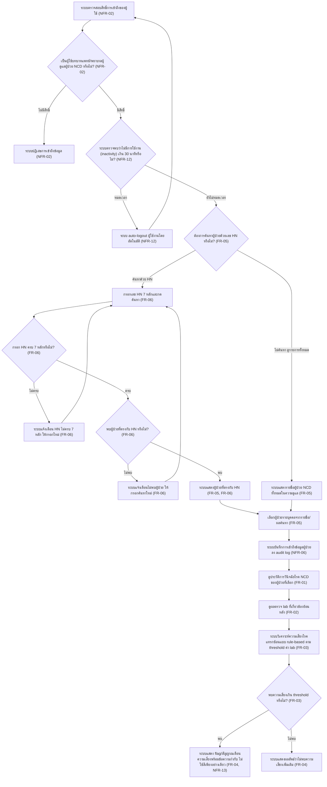
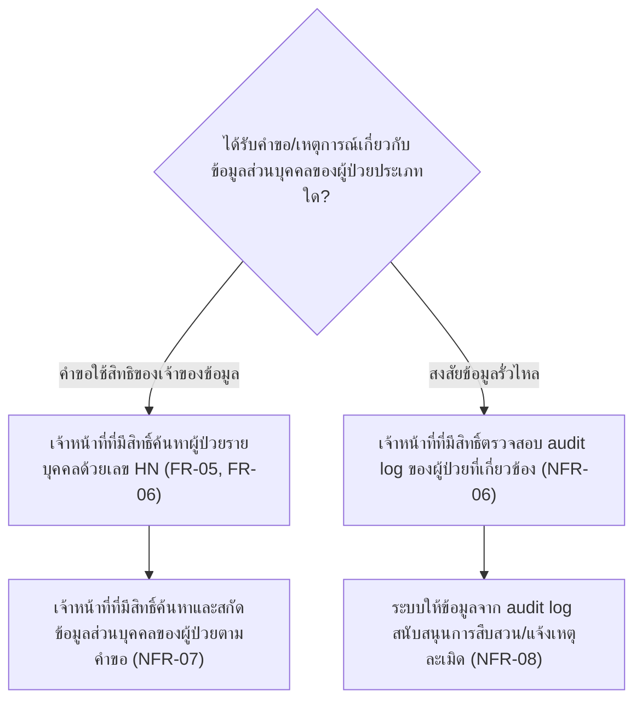

# User Journey

เอกสารนี้แมปฟีเจอร์ใน [[feature-list]] เป็น flow การใช้งานจริงตามบทบาทผู้ใช้ อ้างอิงรายละเอียด FR/NFR
จาก [[backlog]], [[20260917-01-patient-ncd-history-lab-complication-risk]],
[[20260921-01-pdpa-data-protection-compliance]] และ [[20260922-01-operational-quality-nfr]]
(NFR-09–NFR-16 ด้านคุณภาพเชิงปฏิบัติการ — cross-cutting ครอบคลุมทุกฟีเจอร์เช่นเดียวกับ PDPA)

บทบาทในขอบเขตของโปรเจกต์นี้มีเพียงบทบาทเดียวคือ **แพทย์/พยาบาลผู้ดูแลผู้ป่วย NCD** (ตามที่ระบุไว้
ในหัวข้อ "บทบาทผู้ใช้ในขอบเขตนี้" ของ spec ต้นทาง — เอกสาร PDPA ไม่ได้เพิ่มบทบาทใหม่) เอกสารนี้จึงมี
2 journey: journey หลักที่ครอบคลุมฟีเจอร์ที่ 1-3 ต่อเนื่องกัน (ค้นหา/เลือกผู้ป่วย แล้วดูประวัติ/ผล lab
แล้วต่อด้วยผลวิเคราะห์ความเสี่ยง พร้อมการบันทึก audit log ตามฟีเจอร์ที่ 4) และ journey ที่สองซึ่งครอบคลุม
ส่วนที่เหลือของฟีเจอร์ที่ 4 (คำขอใช้สิทธิของเจ้าของข้อมูล และการสนับสนุนการสืบสวนกรณีข้อมูลรั่วไหล)
ที่ถูก trigger จากเหตุการณ์ภายนอก ไม่ใช่ routine การดูแลผู้ป่วยแบบ journey แรก

## Journey: แพทย์/พยาบาลผู้ดูแลผู้ป่วย NCD ค้นหาผู้ป่วย ดูประวัติ และรับการแจ้งเตือนความเสี่ยงโรคแทรกซ้อน

บทบาท: แพทย์/พยาบาลผู้ดูแลผู้ป่วย NCD

หมายเหตุ: ข้อมูลประวัติการวินิจฉัยและผลตรวจ lab ที่ใช้ในทุกขั้นตอนของ journey นี้ อ้างอิงจาก
แหล่งข้อมูล HOSxP (หรือข้อมูล mockup ระหว่างช่วงพัฒนา/ทดสอบ) ตาม
[[20260917-01-patient-ncd-history-lab-complication-risk#ความต้องการที่ไม่ใช่เชิงฟังก์ชัน (Non-Functional Requirements)|NFR-01]]

หมายเหตุ (PDPA): ข้อมูลส่วนบุคคล/ข้อมูลสุขภาพที่ใช้ตลอด journey นี้ต้องประมวลผลเฉพาะเท่าที่จำเป็นตาม
วัตถุประสงค์การดูแลรักษาผู้ป่วยเท่านั้น
([[20260921-01-pdpa-data-protection-compliance#ความต้องการที่ไม่ใช่เชิงฟังก์ชัน (Non-Functional Requirements)|NFR-03]])
ต้องถูกเข้ารหัสทั้งขณะจัดเก็บและขณะส่งผ่านเครือข่ายตลอดเวลา
([[20260921-01-pdpa-data-protection-compliance#ความต้องการที่ไม่ใช่เชิงฟังก์ชัน (Non-Functional Requirements)|NFR-04]])
และอยู่ภายใต้นโยบายจำกัดระยะเวลาเก็บรักษา/การลบข้อมูลเช่นกัน
([[20260921-01-pdpa-data-protection-compliance#ความต้องการที่ไม่ใช่เชิงฟังก์ชัน (Non-Functional Requirements)|NFR-05]])

หมายเหตุ (คุณภาพเชิงปฏิบัติการ): หน้าจอทุกขั้นตอนของ journey นี้ (ค้นหา/แสดงรายชื่อผู้ป่วย, ประวัติ
วินิจฉัย, ผลตรวจ lab, ผลวิเคราะห์ความเสี่ยง — ขั้นตอนที่ 4-14 ด้านล่าง) ต้องตอบสนองภายในน้อยกว่า
2 วินาที
([[20260922-01-operational-quality-nfr#ความต้องการที่ไม่ใช่เชิงฟังก์ชัน (Non-Functional Requirements)|NFR-09]])
โดยระบบอ้างอิง SLA มาตรฐานของ Firebase/Google Cloud เป็นเป้าหมาย uptime
([[20260922-01-operational-quality-nfr#ความต้องการที่ไม่ใช่เชิงฟังก์ชัน (Non-Functional Requirements)|NFR-10]])
กลไกควบคุมสิทธิ์ที่ตรวจสอบในขั้นตอนที่ 1-2 ต้องมี automated test ผ่าน Firebase Emulator Suite
ครอบคลุมทุกกรณีสิทธิ์ก่อนใช้งานจริงเสมอ
([[20260922-01-operational-quality-nfr#ความต้องการที่ไม่ใช่เชิงฟังก์ชัน (Non-Functional Requirements)|NFR-14]])
และระบบต้องรองรับ browser หลักเวอร์ชันล่าสุด (Chrome/Edge/Firefox) บนอุปกรณ์ desktop/tablet ตลอด
journey นี้
([[20260922-01-operational-quality-nfr#ความต้องการที่ไม่ใช่เชิงฟังก์ชัน (Non-Functional Requirements)|NFR-15]])
นอกจากนี้ Risk Rule Engine ที่ใช้ในขั้นตอนที่ 13 (การจับคู่โรคหลัก→โรคแทรกซ้อนและ threshold ค่า lab)
ทุกครั้งที่มีการเพิ่ม/แก้ไข rule ต้องผ่านการยืนยันจากแพทย์ผู้เชี่ยวชาญก่อน deploy ใช้งานจริงเสมอ เป็น
ข้อกำหนดถาวร — กระบวนการยืนยันจริงเป็นกระบวนการเชิงองค์กรที่อยู่นอกขอบเขตของ journey นี้
([[20260922-01-operational-quality-nfr#ความต้องการที่ไม่ใช่เชิงฟังก์ชัน (Non-Functional Requirements)|NFR-11]])
ในอนาคตหากมีการเชื่อมต่อกับ HOSxP จริง ให้พิจารณามาตรฐาน HL7/FHIR ประกอบการออกแบบ — บันทึกไว้เป็น
ประเด็นรอตัดสินใจ ยังไม่ใช่ข้อกำหนดบังคับของ journey นี้ในขณะนี้
([[20260922-01-operational-quality-nfr#ความต้องการที่ไม่ใช่เชิงฟังก์ชัน (Non-Functional Requirements)|NFR-16]])

ขั้นตอน:

1. ระบบตรวจสอบสิทธิ์การเข้าถึงของผู้ใช้
   ([[20260917-01-patient-ncd-history-lab-complication-risk#ความต้องการที่ไม่ใช่เชิงฟังก์ชัน (Non-Functional Requirements)|NFR-02]])
2. ตรวจสอบว่าเป็นผู้ใช้บทบาทแพทย์/พยาบาลผู้ดูแลผู้ป่วย NCD หรือไม่
   ([[20260917-01-patient-ncd-history-lab-complication-risk#ความต้องการที่ไม่ใช่เชิงฟังก์ชัน (Non-Functional Requirements)|NFR-02]])
   - ถ้าไม่มีสิทธิ์: ระบบปฏิเสธการเข้าถึงข้อมูล จบ flow
     ([[20260917-01-patient-ncd-history-lab-complication-risk#ความต้องการที่ไม่ใช่เชิงฟังก์ชัน (Non-Functional Requirements)|NFR-02]])
   - ถ้ามีสิทธิ์: ไปขั้นตอนที่ 3 ต่อ
3. ระบบตรวจสอบว่าไม่มีการใช้งาน (inactivity) เกิน 30 นาทีหรือไม่ — การตรวจสอบนี้เกิดขึ้นต่อเนื่องตลอด
   session ไม่ใช่ครั้งเดียวตอนเข้าสู่ระบบ (เชื่อมโยงกับขั้นตอนที่ 1-2 แต่เป็นคนละมิติ — ขั้นตอนที่ 1-2
   ควบคุม "ใครเข้าถึงได้" ส่วนขั้นตอนนี้ควบคุม "เข้าถึงได้ในช่วงเวลาใด")
   ([[20260922-01-operational-quality-nfr#ความต้องการที่ไม่ใช่เชิงฟังก์ชัน (Non-Functional Requirements)|NFR-12]])
   - ถ้าหมดเวลา (idle เกิน 30 นาที): ระบบ auto-logout ผู้ใช้งานโดยอัตโนมัติ กลับไปขั้นตอนที่ 1
     ([[20260922-01-operational-quality-nfr#ความต้องการที่ไม่ใช่เชิงฟังก์ชัน (Non-Functional Requirements)|NFR-12]])
   - ถ้ายังไม่หมดเวลา: ไปขั้นตอนที่ 4
4. ตรวจสอบว่าผู้ใช้ต้องการค้นหาผู้ป่วยด้วยเลขประจำตัวผู้ป่วย (HN) หรือไม่ — ไม่บังคับต้องค้นหาก่อนเสมอ
   ([[20260917-01-patient-ncd-history-lab-complication-risk#ความต้องการเชิงฟังก์ชัน (Functional Requirements)|FR-05]])
   - ถ้าต้องการค้นหาด้วย HN: ไปขั้นตอนที่ 5
   - ถ้าไม่ค้นหา ดูรายการทั้งหมด: ไปขั้นตอนที่ 8
5. กรอกเลข HN (รูปแบบตัวเลขล้วน 7 หลักตามที่ระบบกำหนดไว้ตายตัว — เป็นช่องทางค้นหาเดียวที่ใช้งานได้
   ไม่รองรับการค้นหาด้วยชื่ออีกต่อไป) แล้วกดค้นหา
   ([[20260917-01-patient-ncd-history-lab-complication-risk#ความต้องการเชิงฟังก์ชัน (Functional Requirements)|FR-06]])
6. ระบบตรวจสอบว่ากรอก HN ครบ 7 หลักหรือไม่ — การตรวจสอบนี้เกิดขึ้น**หลังผู้ใช้กดค้นหาแล้วเท่านั้น**
   (ไม่ใช่แบบ real-time ระหว่างพิมพ์)
   ([[20260917-01-patient-ncd-history-lab-complication-risk#ความต้องการเชิงฟังก์ชัน (Functional Requirements)|FR-06]])
   - ถ้าไม่ครบ 7 หลัก: ระบบแจ้งผู้ใช้งานและให้กรอกค้นหาใหม่ได้ทันที กลับไปขั้นตอนที่ 5
     ([[20260917-01-patient-ncd-history-lab-complication-risk#ความต้องการเชิงฟังก์ชัน (Functional Requirements)|FR-06]])
   - ถ้าครบ 7 หลัก: ไปขั้นตอนที่ 7
7. ระบบค้นหาผู้ป่วยที่ตรงกับเลข HN ที่กรอก และตรวจสอบว่าพบผู้ป่วยที่ตรงกันหรือไม่
   ([[20260917-01-patient-ncd-history-lab-complication-risk#ความต้องการเชิงฟังก์ชัน (Functional Requirements)|FR-06]])
   - ถ้าไม่พบ: ระบบแจ้งผู้ใช้งานว่าไม่พบผู้ป่วยที่ตรงกัน และให้กรอกค้นหาใหม่ได้ทันที กลับไปขั้นตอนที่ 5
     ([[20260917-01-patient-ncd-history-lab-complication-risk#ความต้องการเชิงฟังก์ชัน (Functional Requirements)|FR-06]])
   - ถ้าพบ: ระบบแสดงผู้ป่วยที่ตรงกับ HN ไปขั้นตอนที่ 9
     ([[20260917-01-patient-ncd-history-lab-complication-risk#ความต้องการเชิงฟังก์ชัน (Functional Requirements)|FR-05]],
     [[20260917-01-patient-ncd-history-lab-complication-risk#ความต้องการเชิงฟังก์ชัน (Functional Requirements)|FR-06]])
8. ถ้าไม่ค้นหา: ระบบแสดงรายชื่อผู้ป่วย NCD ทั้งหมดที่อยู่ในความดูแล
   ([[20260917-01-patient-ncd-history-lab-complication-risk#ความต้องการเชิงฟังก์ชัน (Functional Requirements)|FR-05]])
9. เลือกผู้ป่วยรายบุคคลจากรายชื่อ/ผลค้นหา (เฉพาะผู้ป่วยที่อยู่ในความดูแลของผู้ใช้งานคนนั้นเท่านั้น)
   ([[20260917-01-patient-ncd-history-lab-complication-risk#ความต้องการเชิงฟังก์ชัน (Functional Requirements)|FR-05]])
10. ระบบบันทึกการเข้าถึงข้อมูลผู้ป่วยรายที่เลือกลง audit log (บันทึกว่าผู้ใช้งานคนใดเข้าถึงข้อมูลของ
    ผู้ป่วยรายใด เมื่อใด) เพื่อรองรับการตรวจสอบย้อนหลังตามหลักความรับผิดชอบ (Accountability)
    ([[20260921-01-pdpa-data-protection-compliance#ความต้องการที่ไม่ใช่เชิงฟังก์ชัน (Non-Functional Requirements)|NFR-06]])
11. ดูประวัติการวินิจฉัยโรค NCD ของผู้ป่วยที่เลือก (เบาหวาน, ความดันโลหิตสูง, ถุงลมโป่งพอง)
    เรียงตามช่วงเวลา
    ([[20260917-01-patient-ncd-history-lab-complication-risk#ความต้องการเชิงฟังก์ชัน (Functional Requirements)|FR-01]])
12. ดูผลตรวจ lab มาตรฐานที่เกี่ยวข้องย้อนหลัง (เช่น HbA1c, eGFR, LDL, ค่าความดันโลหิต) เพื่อติดตาม
    แนวโน้ม
    ([[20260917-01-patient-ncd-history-lab-complication-risk#ความต้องการเชิงฟังก์ชัน (Functional Requirements)|FR-02]])
13. ระบบประมวลผลค่า lab เทียบ threshold มาตรฐาน วิเคราะห์ความเสี่ยงโรคแทรกซ้อน (ไตวายเรื้อรัง,
    โรคหัวใจ, โรคหลอดเลือดสมอง) แบบ rule-based
    ([[20260917-01-patient-ncd-history-lab-complication-risk#ความต้องการเชิงฟังก์ชัน (Functional Requirements)|FR-03]])
14. ตรวจสอบว่าพบความเสี่ยงเกิน threshold หรือไม่
   ([[20260917-01-patient-ncd-history-lab-complication-risk#ความต้องการเชิงฟังก์ชัน (Functional Requirements)|FR-03]])
   - ถ้าพบ: ระบบแสดง flag/สัญญาณเตือนความเสี่ยงที่มองเห็นได้ชัดเจนบนหน้าจอ พร้อมข้อความระบุระดับความเสี่ยง
     กำกับคู่กับสีเสมอ (ห้ามใช้สีเป็นสัญญาณเดียว)
     ([[20260917-01-patient-ncd-history-lab-complication-risk#ความต้องการเชิงฟังก์ชัน (Functional Requirements)|FR-04]],
     [[20260922-01-operational-quality-nfr#ความต้องการที่ไม่ใช่เชิงฟังก์ชัน (Non-Functional Requirements)|NFR-13]])
   - ถ้าไม่พบ: ระบบแสดงผลลัพธ์ว่าไม่พบความเสี่ยงเพิ่มเติม ไม่มีการแจ้งเตือน
     ([[20260917-01-patient-ncd-history-lab-complication-risk#ความต้องการเชิงฟังก์ชัน (Functional Requirements)|FR-04]])

## Journey: เจ้าหน้าที่ดำเนินการตามคำขอใช้สิทธิของเจ้าของข้อมูล และสนับสนุนการสืบสวนกรณีข้อมูลส่วนบุคคลรั่วไหล (PDPA)

บทบาท: แพทย์/พยาบาลผู้ดูแลผู้ป่วย NCD (ในฐานะเจ้าหน้าที่ที่มีสิทธิ์เข้าถึงข้อมูล ตามคำที่ใช้ใน NFR-07
ของ [[20260921-01-pdpa-data-protection-compliance]] — เอกสาร PDPA ไม่ได้เพิ่มบทบาทใหม่)

หมายเหตุ: journey นี้ถูก trigger จากเหตุการณ์ภายนอกระบบ (คำขอใช้สิทธิของผู้ป่วย หรือข้อสงสัยว่ามีเหตุ
ข้อมูลรั่วไหล) ไม่ใช่ routine การดูแลผู้ป่วยแบบ journey แรก และยังอยู่ภายใต้เงื่อนไข lawful basis/
purpose limitation
([[20260921-01-pdpa-data-protection-compliance#ความต้องการที่ไม่ใช่เชิงฟังก์ชัน (Non-Functional Requirements)|NFR-03]]),
การเข้ารหัสข้อมูล
([[20260921-01-pdpa-data-protection-compliance#ความต้องการที่ไม่ใช่เชิงฟังก์ชัน (Non-Functional Requirements)|NFR-04]])
และนโยบายจำกัดระยะเวลาเก็บรักษา/การลบข้อมูล
([[20260921-01-pdpa-data-protection-compliance#ความต้องการที่ไม่ใช่เชิงฟังก์ชัน (Non-Functional Requirements)|NFR-05]])
เช่นเดียวกับ journey แรกตลอดเวลา ขั้นตอนหลังจากที่ระบบให้ข้อมูล/สนับสนุนแล้ว (การดำเนินการตามคำขอจริง
หรือการแจ้งเหตุต่อสำนักงานคณะกรรมการคุ้มครองข้อมูลส่วนบุคคล) เป็นกระบวนการเชิงองค์กรที่อยู่นอกขอบเขต
ของระบบ จึงไม่รวมอยู่ใน flow ด้านล่าง

ขั้นตอน:

1. หน่วยงานได้รับคำขอ/เหตุการณ์ที่เกี่ยวข้องกับข้อมูลส่วนบุคคลของผู้ป่วย ซึ่งแยกเป็น 2 กรณีตามสถานการณ์
   - กรณีได้รับคำขอใช้สิทธิของเจ้าของข้อมูล (ผู้ป่วย): ไปขั้นตอนที่ 2
   - กรณีสงสัยว่ามีเหตุข้อมูลรั่วไหล: ไปขั้นตอนที่ 4
2. เจ้าหน้าที่ที่มีสิทธิ์ค้นหาผู้ป่วยรายบุคคลด้วยเลขประจำตัวผู้ป่วย (HN) 7 หลัก (ใช้ฟีเจอร์ค้นหา/เลือก
   ผู้ป่วยเดียวกับ journey แรก)
   ([[20260917-01-patient-ncd-history-lab-complication-risk#ความต้องการเชิงฟังก์ชัน (Functional Requirements)|FR-05]],
   [[20260917-01-patient-ncd-history-lab-complication-risk#ความต้องการเชิงฟังก์ชัน (Functional Requirements)|FR-06]])
3. เจ้าหน้าที่ที่มีสิทธิ์ค้นหาและสกัดข้อมูลส่วนบุคคลของผู้ป่วยตามคำขอ เช่น สิทธิขอเข้าถึง/ขอสำเนา/
   ขอแก้ไข/ขอลบ/คัดค้านการประมวลผลข้อมูล — เป็นจุดสิ้นสุดของ journey ในขอบเขตของระบบ กระบวนการ
   ดำเนินการตามคำขอจริงเป็นกระบวนการเชิงองค์กรที่อยู่นอกขอบเขต
   ([[20260921-01-pdpa-data-protection-compliance#ความต้องการที่ไม่ใช่เชิงฟังก์ชัน (Non-Functional Requirements)|NFR-07]])
4. เจ้าหน้าที่ที่มีสิทธิ์ตรวจสอบ audit log เพื่อดูร่องรอยการเข้าถึง/ดู/แก้ไขข้อมูลของผู้ป่วยที่เกี่ยวข้อง
   ([[20260921-01-pdpa-data-protection-compliance#ความต้องการที่ไม่ใช่เชิงฟังก์ชัน (Non-Functional Requirements)|NFR-06]])
5. ระบบให้ข้อมูลจาก audit log เพียงพอต่อการสืบสวนและสนับสนุนกระบวนการแจ้งเหตุละเมิดข้อมูลส่วนบุคคลต่อ
   สำนักงานคณะกรรมการคุ้มครองข้อมูลส่วนบุคคลและเจ้าของข้อมูลภายในกรอบเวลาที่กฎหมายกำหนด — เป็นจุด
   สิ้นสุดของ journey ในขอบเขตของระบบ กระบวนการแจ้งเหตุจริงเป็นกระบวนการเชิงองค์กรที่อยู่นอกขอบเขต
   ([[20260921-01-pdpa-data-protection-compliance#ความต้องการที่ไม่ใช่เชิงฟังก์ชัน (Non-Functional Requirements)|NFR-08]])
