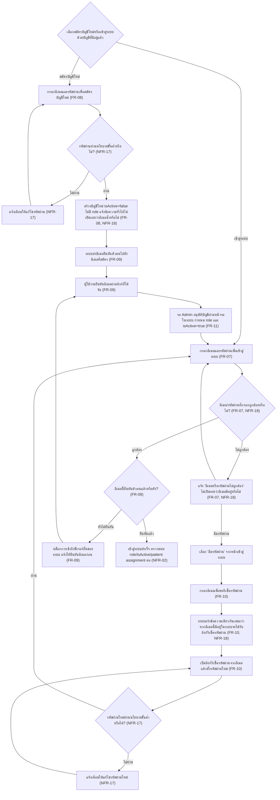
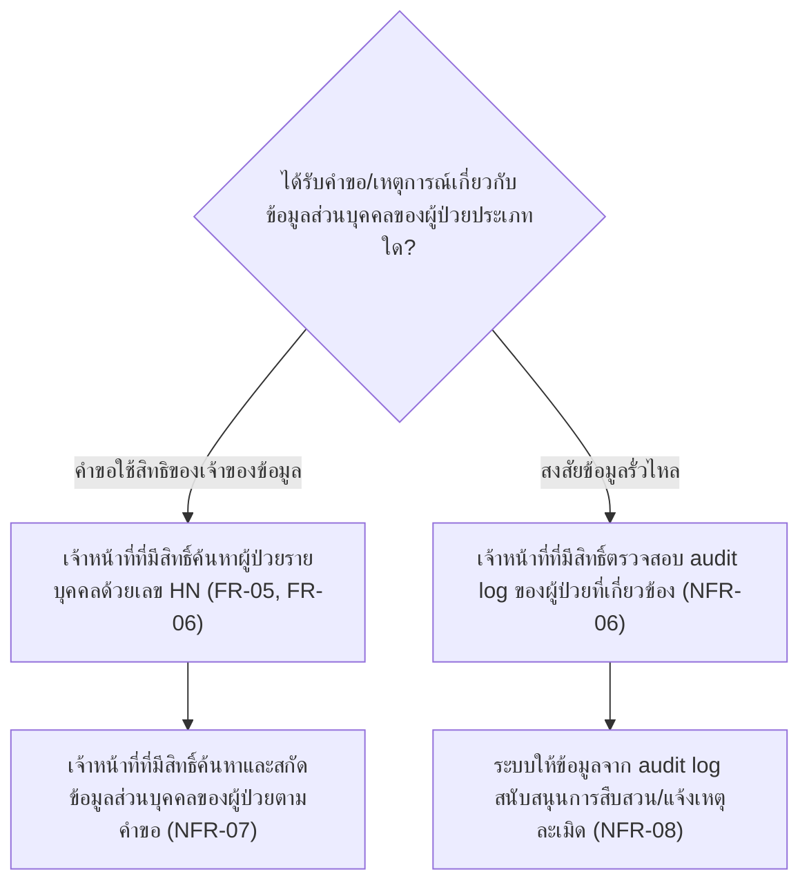
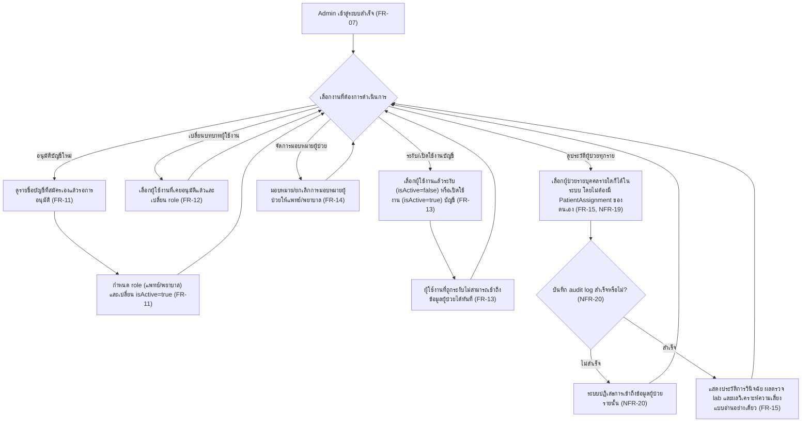

# User Journey

เอกสารนี้แมปฟีเจอร์ใน [[feature-list]] เป็น flow การใช้งานจริงตามบทบาทผู้ใช้ อ้างอิงรายละเอียด FR/NFR
จาก [[backlog]], [[20260917-01-patient-ncd-history-lab-complication-risk]],
[[20260921-01-pdpa-data-protection-compliance]], [[20260922-01-operational-quality-nfr]]
(NFR-09–NFR-16 ด้านคุณภาพเชิงปฏิบัติการ — cross-cutting ครอบคลุมทุกฟีเจอร์เช่นเดียวกับ PDPA),
[[20260923-01-user-authentication-email-password]] (FR-07–FR-10, NFR-17–NFR-18 ด้านการยืนยันตัวตน
ก่อนเข้าสู่ระบบ) และ [[20260924-01-admin-role-account-management]] (FR-11–FR-15, NFR-19–NFR-20
ด้านบทบาท Admin และ FR-16 ในเอกสาร spec ฉบับแรกด้านการยืนยัน/แก้ไขผลประเมินความเสี่ยง)

โปรเจกต์นี้มี **2 บทบาทผู้ใช้** คือ **แพทย์/พยาบาลผู้ดูแลผู้ป่วย NCD** (ตามที่ระบุไว้ในหัวข้อ "บทบาท
ผู้ใช้ในขอบเขตนี้" ของ spec ต้นทาง) และ **Admin (ผู้ดูแลระบบ)** ซึ่งเป็นบทบาทใหม่ตาม
[[20260924-01-admin-role-account-management]] (เอกสาร PDPA ไม่ได้เพิ่มบทบาทใหม่) เอกสารนี้จึงมี
4 journey: journey แรกครอบคลุมฟีเจอร์ที่ 6 (สมัครบัญชี เข้าสู่ระบบ และจัดการรหัสผ่านด้วยอีเมล) ซึ่งเป็น
precondition ก่อน journey อื่นทั้งหมด (การอนุมัติบัญชีในขั้นตอนนี้ทำโดย Admin ผ่านหน้าจอในระบบตาม
journey ที่สี่แทนที่กลไก Firebase Console/Firestore เดิม), journey ที่สองครอบคลุมฟีเจอร์ที่ 1-3
ต่อเนื่องกัน (ค้นหา/เลือกผู้ป่วย แล้วดูประวัติ/ผล lab แล้วต่อด้วยผลวิเคราะห์ความเสี่ยงและการยืนยัน/แก้ไข
ผล พร้อมการบันทึก audit log ตามฟีเจอร์ที่ 4), journey ที่สามครอบคลุมส่วนที่เหลือของฟีเจอร์ที่ 4 (คำขอ
ใช้สิทธิของเจ้าของข้อมูล และการสนับสนุนการสืบสวนกรณีข้อมูลรั่วไหล) ที่ถูก trigger จากเหตุการณ์ภายนอก
ไม่ใช่ routine การดูแลผู้ป่วยแบบ journey ที่สอง และ journey ที่สี่ (ใหม่) ครอบคลุมฟีเจอร์ที่ 7 — Admin
อนุมัติบัญชี จัดการสิทธิ์/การมอบหมายผู้ป่วย และดูประวัติผู้ป่วยทุกรายแบบอ่านอย่างเดียว

## Journey: ผู้ใช้งานสมัครบัญชี เข้าสู่ระบบ และจัดการรหัสผ่านด้วยอีเมล (Authentication)

บทบาท: แพทย์/พยาบาลผู้สมัครบัญชี/เข้าสู่ระบบ (Admin เข้ามาเกี่ยวข้องเฉพาะขั้นตอนอนุมัติบัญชีผ่าน
หน้าจอในระบบ — ดู [[#Journey: Admin อนุมัติบัญชีผู้ใช้งาน จัดการสิทธิ์ และดูประวัติผู้ป่วยทุกรายแบบอ่านอย่างเดียว]])

หมายเหตุ: journey นี้ครอบคลุมฟีเจอร์ที่ 6 ([[feature-list#6. สมัครบัญชี เข้าสู่ระบบ และจัดการรหัสผ่านด้วยอีเมล (Authentication)]])
และเป็น precondition ก่อนเข้าสู่ journey อื่นทั้งหมดของระบบ (ต้องเข้าสู่ระบบและยืนยันอีเมลสำเร็จก่อน
จึงจะเริ่ม journey "ค้นหาผู้ป่วย ดูประวัติ และรับการแจ้งเตือนความเสี่ยงโรคแทรกซ้อน" ด้านล่างได้)
เงื่อนไข role/isActive/patient assignment ตาม
[[20260917-01-patient-ncd-history-lab-complication-risk#ความต้องการที่ไม่ใช่เชิงฟังก์ชัน (Non-Functional Requirements)|NFR-02]]
ยังคงถูกตรวจสอบแยกต่างหากหลังเข้าสู่ระบบสำเร็จแล้ว ไม่ทับซ้อนกับ journey นี้



ขั้นตอน:

1. ผู้ใช้งานเลือกว่าจะสมัครบัญชีใหม่หรือเข้าสู่ระบบด้วยบัญชีที่มีอยู่แล้ว
   - เลือกสมัครบัญชีใหม่: ไปขั้นตอนที่ 2
   - เลือกเข้าสู่ระบบด้วยบัญชีที่มีอยู่แล้ว: ไปขั้นตอนที่ 8
2. กรอกอีเมลและรหัสผ่านเพื่อสมัครบัญชีใหม่
   ([[20260923-01-user-authentication-email-password#ความต้องการเชิงฟังก์ชัน (Functional Requirements)|FR-08]])
3. ระบบตรวจสอบว่ารหัสผ่านที่กรอกเป็นไปตามนโยบายรหัสผ่านขั้นต่ำหรือไม่ (ความยาวขั้นต่ำ 8 ตัวอักษร
   มีทั้งตัวอักษรและตัวเลขอย่างน้อยอย่างละ 1 ตัว)
   ([[20260923-01-user-authentication-email-password#ความต้องการที่ไม่ใช่เชิงฟังก์ชัน (Non-Functional Requirements)|NFR-17]])
   - ถ้าไม่ผ่าน: ระบบแจ้งเตือนให้แก้ไขรหัสผ่าน กลับไปขั้นตอนที่ 2
   - ถ้าผ่าน: ไปขั้นตอนที่ 4
4. ระบบสร้างบัญชีใหม่ด้วย `isActive = false` และยังไม่มี role กำหนด แล้วแจ้งข้อความทั่วไปที่ไม่ยืนยัน/
   ไม่ปฏิเสธว่าอีเมลนี้มีบัญชีอยู่แล้วหรือไม่ (ไม่ว่าอีเมลจะซ้ำกับบัญชีเดิมหรือไม่ก็ตาม เพื่อป้องกัน
   account enumeration)
   ([[20260923-01-user-authentication-email-password#ความต้องการเชิงฟังก์ชัน (Functional Requirements)|FR-08]],
   [[20260923-01-user-authentication-email-password#ความต้องการที่ไม่ใช่เชิงฟังก์ชัน (Non-Functional Requirements)|NFR-18]])
5. ระบบส่งอีเมลยืนยันตัวตน (verification link) ไปยังอีเมลที่ใช้สมัคร
   ([[20260923-01-user-authentication-email-password#ความต้องการเชิงฟังก์ชัน (Functional Requirements)|FR-09]])
6. ผู้ใช้งานยืนยันความเป็นเจ้าของอีเมลผ่านลิงก์ที่ได้รับ
   ([[20260923-01-user-authentication-email-password#ความต้องการเชิงฟังก์ชัน (Functional Requirements)|FR-09]])
7. บัญชีรอ **Admin** อนุมัติผ่านหน้าจอในระบบ (กำหนด role แพทย์/พยาบาล และเปลี่ยน `isActive = true`)
   แทนที่กลไกเดิมที่เคยดำเนินการผ่าน Firebase Console/Firestore โดยตรง — ดูรายละเอียดขั้นตอนของ Admin
   ที่ [[#Journey: Admin อนุมัติบัญชีผู้ใช้งาน จัดการสิทธิ์ และดูประวัติผู้ป่วยทุกรายแบบอ่านอย่างเดียว]]
   ก่อนจะเข้าถึงข้อมูลผู้ป่วยได้ตาม NFR-02 — ไปขั้นตอนที่ 8 เพื่อเข้าสู่ระบบ
   ([[20260924-01-admin-role-account-management#ความต้องการเชิงฟังก์ชัน (Functional Requirements)|FR-11]])
8. กรอกอีเมลและรหัสผ่านเพื่อเข้าสู่ระบบ
   ([[20260923-01-user-authentication-email-password#ความต้องการเชิงฟังก์ชัน (Functional Requirements)|FR-07]])
9. ระบบตรวจสอบว่าอีเมล/รหัสผ่านที่กรอกถูกต้องหรือไม่
   ([[20260923-01-user-authentication-email-password#ความต้องการเชิงฟังก์ชัน (Functional Requirements)|FR-07]])
   - ถ้าไม่ถูกต้อง: ระบบแจ้งข้อความรวมว่า "อีเมลหรือรหัสผ่านไม่ถูกต้อง" โดยไม่เปิดเผยว่าอีเมลมีอยู่ใน
     ระบบหรือไม่ กลับไปขั้นตอนที่ 8 (หรือเลือกไปขั้นตอนที่ 12 หากลืมรหัสผ่าน)
     ([[20260923-01-user-authentication-email-password#ความต้องการที่ไม่ใช่เชิงฟังก์ชัน (Non-Functional Requirements)|NFR-18]])
   - ถ้าถูกต้อง: ไปขั้นตอนที่ 10
10. ระบบตรวจสอบว่าอีเมลนี้ยืนยันตัวตนแล้วหรือยัง
    ([[20260923-01-user-authentication-email-password#ความต้องการเชิงฟังก์ชัน (Functional Requirements)|FR-09]])
    - ถ้ายังไม่ยืนยัน: ระบบบล็อกการเข้าถึงฟีเจอร์อื่นของระบบ และแจ้งให้ยืนยันอีเมลก่อน กลับไปขั้นตอนที่ 6
    - ถ้ายืนยันแล้ว: ไปขั้นตอนที่ 11
11. เข้าสู่ระบบสำเร็จ ระบบตรวจสอบเงื่อนไข role/isActive/patient assignment ต่อ — เป็นจุดสิ้นสุดของ
    journey นี้ และเชื่อมต่อกับ journey ถัดไป ("ค้นหาผู้ป่วย ดูประวัติ และรับการแจ้งเตือนความเสี่ยง
    โรคแทรกซ้อน" ด้านล่าง)
    ([[20260917-01-patient-ncd-history-lab-complication-risk#ความต้องการที่ไม่ใช่เชิงฟังก์ชัน (Non-Functional Requirements)|NFR-02]])
12. (ทางเลือกจากขั้นตอนที่ 8/9) ผู้ใช้งานเลือก "ลืมรหัสผ่าน" จากหน้าเข้าสู่ระบบแทนการเข้าสู่ระบบตามปกติ
    ([[20260923-01-user-authentication-email-password#ความต้องการเชิงฟังก์ชัน (Functional Requirements)|FR-10]])
13. กรอกอีเมลเพื่อขอรับลิงก์รีเซ็ตรหัสผ่าน
    ([[20260923-01-user-authentication-email-password#ความต้องการเชิงฟังก์ชัน (Functional Requirements)|FR-10]])
14. ระบบแจ้งข้อความเดียวกันเสมอว่า "หากอีเมลนี้มีอยู่ในระบบ จะได้รับลิงก์รีเซ็ตรหัสผ่านทางอีเมล" ไม่ว่า
    อีเมลที่กรอกจะมีบัญชีอยู่ในระบบจริงหรือไม่
    ([[20260923-01-user-authentication-email-password#ความต้องการเชิงฟังก์ชัน (Functional Requirements)|FR-10]],
    [[20260923-01-user-authentication-email-password#ความต้องการที่ไม่ใช่เชิงฟังก์ชัน (Non-Functional Requirements)|NFR-18]])
15. ผู้ใช้งานเปิดลิงก์รีเซ็ตรหัสผ่านจากอีเมล (เฉพาะกรณีมีบัญชีอยู่จริง) แล้วตั้งรหัสผ่านใหม่
    ([[20260923-01-user-authentication-email-password#ความต้องการเชิงฟังก์ชัน (Functional Requirements)|FR-10]])
16. ระบบตรวจสอบว่ารหัสผ่านใหม่เป็นไปตามนโยบายรหัสผ่านขั้นต่ำหรือไม่ เช่นเดียวกับขั้นตอนที่ 3
    ([[20260923-01-user-authentication-email-password#ความต้องการที่ไม่ใช่เชิงฟังก์ชัน (Non-Functional Requirements)|NFR-17]])
    - ถ้าไม่ผ่าน: ระบบแจ้งเตือนให้แก้ไข กลับไปขั้นตอนที่ 15
    - ถ้าผ่าน: รหัสผ่านถูกอัปเดต กลับไปขั้นตอนที่ 8 เพื่อเข้าสู่ระบบด้วยรหัสผ่านใหม่

## Journey: แพทย์/พยาบาลผู้ดูแลผู้ป่วย NCD ค้นหาผู้ป่วย ดูประวัติ และรับการแจ้งเตือนความเสี่ยงโรคแทรกซ้อน

บทบาท: แพทย์/พยาบาลผู้ดูแลผู้ป่วย NCD

หมายเหตุ: ข้อมูลประวัติการวินิจฉัยและผลตรวจ lab ที่ใช้ในทุกขั้นตอนของ journey นี้ อ้างอิงจาก
แหล่งข้อมูล HOSxP (หรือข้อมูล mockup ระหว่างช่วงพัฒนา/ทดสอบ) ตาม
[[20260917-01-patient-ncd-history-lab-complication-risk#ความต้องการที่ไม่ใช่เชิงฟังก์ชัน (Non-Functional Requirements)|NFR-01]]

หมายเหตุ (PDPA): ข้อมูลส่วนบุคคล/ข้อมูลสุขภาพที่ใช้ตลอด journey นี้ต้องประมวลผลเฉพาะเท่าที่จำเป็นตาม
วัตถุประสงค์การดูแลรักษาผู้ป่วยเท่านั้น
([[20260921-01-pdpa-data-protection-compliance#ความต้องการที่ไม่ใช่เชิงฟังก์ชัน (Non-Functional Requirements)|NFR-03]])
ต้องถูกเข้ารหัสทั้งขณะจัดเก็บและขณะส่งผ่านเครือข่ายตลอดเวลา
([[20260921-01-pdpa-data-protection-compliance#ความต้องการที่ไม่ใช่เชิงฟังก์ชัน (Non-Functional Requirements)|NFR-04]])
และอยู่ภายใต้นโยบายจำกัดระยะเวลาเก็บรักษา/การลบข้อมูลเช่นกัน
([[20260921-01-pdpa-data-protection-compliance#ความต้องการที่ไม่ใช่เชิงฟังก์ชัน (Non-Functional Requirements)|NFR-05]])

หมายเหตุ (คุณภาพเชิงปฏิบัติการ): หน้าจอทุกขั้นตอนของ journey นี้ (ค้นหา/แสดงรายชื่อผู้ป่วย, ประวัติ
วินิจฉัย, ผลตรวจ lab, ผลวิเคราะห์ความเสี่ยง — ขั้นตอนที่ 4-14 ด้านล่าง) ต้องตอบสนองภายในน้อยกว่า
2 วินาที
([[20260922-01-operational-quality-nfr#ความต้องการที่ไม่ใช่เชิงฟังก์ชัน (Non-Functional Requirements)|NFR-09]])
โดยระบบอ้างอิง SLA มาตรฐานของ Firebase/Google Cloud เป็นเป้าหมาย uptime
([[20260922-01-operational-quality-nfr#ความต้องการที่ไม่ใช่เชิงฟังก์ชัน (Non-Functional Requirements)|NFR-10]])
กลไกควบคุมสิทธิ์ที่ตรวจสอบในขั้นตอนที่ 1-2 ต้องมี automated test ผ่าน Firebase Emulator Suite
ครอบคลุมทุกกรณีสิทธิ์ก่อนใช้งานจริงเสมอ
([[20260922-01-operational-quality-nfr#ความต้องการที่ไม่ใช่เชิงฟังก์ชัน (Non-Functional Requirements)|NFR-14]])
และระบบต้องรองรับ browser หลักเวอร์ชันล่าสุด (Chrome/Edge/Firefox) บนอุปกรณ์ desktop/tablet ตลอด
journey นี้
([[20260922-01-operational-quality-nfr#ความต้องการที่ไม่ใช่เชิงฟังก์ชัน (Non-Functional Requirements)|NFR-15]])
นอกจากนี้ Risk Rule Engine ที่ใช้ในขั้นตอนที่ 13 (การจับคู่โรคหลัก→โรคแทรกซ้อนและ threshold ค่า lab)
ทุกครั้งที่มีการเพิ่ม/แก้ไข rule ต้องผ่านการยืนยันจากแพทย์ผู้เชี่ยวชาญก่อน deploy ใช้งานจริงเสมอ เป็น
ข้อกำหนดถาวร — กระบวนการยืนยันจริงเป็นกระบวนการเชิงองค์กรที่อยู่นอกขอบเขตของ journey นี้
([[20260922-01-operational-quality-nfr#ความต้องการที่ไม่ใช่เชิงฟังก์ชัน (Non-Functional Requirements)|NFR-11]])
ในอนาคตหากมีการเชื่อมต่อกับ HOSxP จริง ให้พิจารณามาตรฐาน HL7/FHIR ประกอบการออกแบบ — บันทึกไว้เป็น
ประเด็นรอตัดสินใจ ยังไม่ใช่ข้อกำหนดบังคับของ journey นี้ในขณะนี้
([[20260922-01-operational-quality-nfr#ความต้องการที่ไม่ใช่เชิงฟังก์ชัน (Non-Functional Requirements)|NFR-16]])

```mermaid
flowchart TD
    A["ระบบตรวจสอบสิทธิ์การเข้าถึงของผู้ใช้ (NFR-02)"] --> B{"เป็นผู้ใช้บทบาทแพทย์/พยาบาลผู้ดูแลผู้ป่วย NCD หรือไม่? (NFR-02)"}
    B -->|ไม่มีสิทธิ์| Z["ระบบปฏิเสธการเข้าถึงข้อมูล (NFR-02)"]
    B -->|มีสิทธิ์| B2{"ระบบตรวจพบว่าไม่มีการใช้งาน (inactivity) เกิน 30 นาทีหรือไม่? (NFR-12)"}
    B2 -->|หมดเวลา| B3["ระบบ auto-logout ผู้ใช้งานโดยอัตโนมัติ (NFR-12)"]
    B3 --> A
    B2 -->|ยังไม่หมดเวลา| C{"ต้องการค้นหาผู้ป่วยด้วยเลข HN หรือไม่? (FR-05)"}
    C -->|ค้นหาด้วย HN| D1["กรอกเลข HN 7 หลักและกดค้นหา (FR-06)"]
    D1 --> D2{"กรอก HN ครบ 7 หลักหรือไม่? (FR-06)"}
    D2 -->|ไม่ครบ| D3["ระบบแจ้งเตือน HN ไม่ครบ 7 หลัก ให้กรอกใหม่ (FR-06)"]
    D3 --> D1
    D2 -->|ครบ| D4{"พบผู้ป่วยที่ตรงกับ HN หรือไม่? (FR-06)"}
    D4 -->|ไม่พบ| D5["ระบบแจ้งเตือนไม่พบผู้ป่วย ให้กรอกค้นหาใหม่ (FR-06)"]
    D5 --> D1
    D4 -->|พบ| D["ระบบแสดงผู้ป่วยที่ตรงกับ HN (FR-05, FR-06)"]
    C -->|ไม่ค้นหา ดูรายการทั้งหมด| E["ระบบแสดงรายชื่อผู้ป่วย NCD ทั้งหมดในความดูแล (FR-05)"]
    D --> F["เลือกผู้ป่วยรายบุคคลจากรายชื่อ/ผลค้นหา (FR-05)"]
    E --> F
    F --> F2["ระบบบันทึกการเข้าถึงข้อมูลผู้ป่วยลง audit log (NFR-06)"]
    F2 --> G["ดูประวัติการวินิจฉัยโรค NCD ของผู้ป่วยที่เลือก (FR-01)"]
    G --> H["ดูผลตรวจ lab ที่เกี่ยวข้องย้อนหลัง (FR-02)"]
    H --> I["ระบบวิเคราะห์ความเสี่ยงโรคแทรกซ้อนแบบ rule-based ตาม threshold ค่า lab (FR-03)"]
    I --> J{"พบความเสี่ยงเกิน threshold หรือไม่? (FR-03)"}
    J -->|พบ| K["ระบบแสดง flag/สัญญาณเตือนความเสี่ยงพร้อมข้อความกำกับ ไม่ใช้สีเพียงอย่างเดียว (FR-04, NFR-13)"]
    J -->|ไม่พบ| L["ระบบแสดงผลลัพธ์ว่าไม่พบความเสี่ยงเพิ่มเติม (FR-04)"]
    K --> M{"ต้องการยืนยัน/แก้ไขผลการประเมินความเสี่ยงหรือไม่? (FR-16)"}
    L --> M
    M -->|ยืนยันผลเดิม| N1["บันทึกการยืนยันผลลัพธ์เดิมพร้อม audit log (FR-16, NFR-06)"]
    M -->|แก้ไข (override)| N2["แก้ไขผลการประเมินความเสี่ยงและบันทึกเหตุผลพร้อม audit log (FR-16, NFR-06)"]
```

ขั้นตอน:

1. ระบบตรวจสอบสิทธิ์การเข้าถึงของผู้ใช้
   ([[20260917-01-patient-ncd-history-lab-complication-risk#ความต้องการที่ไม่ใช่เชิงฟังก์ชัน (Non-Functional Requirements)|NFR-02]])
2. ตรวจสอบว่าเป็นผู้ใช้บทบาทแพทย์/พยาบาลผู้ดูแลผู้ป่วย NCD หรือไม่
   ([[20260917-01-patient-ncd-history-lab-complication-risk#ความต้องการที่ไม่ใช่เชิงฟังก์ชัน (Non-Functional Requirements)|NFR-02]])
   - ถ้าไม่มีสิทธิ์: ระบบปฏิเสธการเข้าถึงข้อมูล จบ flow
     ([[20260917-01-patient-ncd-history-lab-complication-risk#ความต้องการที่ไม่ใช่เชิงฟังก์ชัน (Non-Functional Requirements)|NFR-02]])
   - ถ้ามีสิทธิ์: ไปขั้นตอนที่ 3 ต่อ
3. ระบบตรวจสอบว่าไม่มีการใช้งาน (inactivity) เกิน 30 นาทีหรือไม่ — การตรวจสอบนี้เกิดขึ้นต่อเนื่องตลอด
   session ไม่ใช่ครั้งเดียวตอนเข้าสู่ระบบ (เชื่อมโยงกับขั้นตอนที่ 1-2 แต่เป็นคนละมิติ — ขั้นตอนที่ 1-2
   ควบคุม "ใครเข้าถึงได้" ส่วนขั้นตอนนี้ควบคุม "เข้าถึงได้ในช่วงเวลาใด")
   ([[20260922-01-operational-quality-nfr#ความต้องการที่ไม่ใช่เชิงฟังก์ชัน (Non-Functional Requirements)|NFR-12]])
   - ถ้าหมดเวลา (idle เกิน 30 นาที): ระบบ auto-logout ผู้ใช้งานโดยอัตโนมัติ กลับไปขั้นตอนที่ 1
     ([[20260922-01-operational-quality-nfr#ความต้องการที่ไม่ใช่เชิงฟังก์ชัน (Non-Functional Requirements)|NFR-12]])
   - ถ้ายังไม่หมดเวลา: ไปขั้นตอนที่ 4
4. ตรวจสอบว่าผู้ใช้ต้องการค้นหาผู้ป่วยด้วยเลขประจำตัวผู้ป่วย (HN) หรือไม่ — ไม่บังคับต้องค้นหาก่อนเสมอ
   ([[20260917-01-patient-ncd-history-lab-complication-risk#ความต้องการเชิงฟังก์ชัน (Functional Requirements)|FR-05]])
   - ถ้าต้องการค้นหาด้วย HN: ไปขั้นตอนที่ 5
   - ถ้าไม่ค้นหา ดูรายการทั้งหมด: ไปขั้นตอนที่ 8
5. กรอกเลข HN (รูปแบบตัวเลขล้วน 7 หลักตามที่ระบบกำหนดไว้ตายตัว — เป็นช่องทางค้นหาเดียวที่ใช้งานได้
   ไม่รองรับการค้นหาด้วยชื่ออีกต่อไป) แล้วกดค้นหา
   ([[20260917-01-patient-ncd-history-lab-complication-risk#ความต้องการเชิงฟังก์ชัน (Functional Requirements)|FR-06]])
6. ระบบตรวจสอบว่ากรอก HN ครบ 7 หลักหรือไม่ — การตรวจสอบนี้เกิดขึ้น**หลังผู้ใช้กดค้นหาแล้วเท่านั้น**
   (ไม่ใช่แบบ real-time ระหว่างพิมพ์)
   ([[20260917-01-patient-ncd-history-lab-complication-risk#ความต้องการเชิงฟังก์ชัน (Functional Requirements)|FR-06]])
   - ถ้าไม่ครบ 7 หลัก: ระบบแจ้งผู้ใช้งานและให้กรอกค้นหาใหม่ได้ทันที กลับไปขั้นตอนที่ 5
     ([[20260917-01-patient-ncd-history-lab-complication-risk#ความต้องการเชิงฟังก์ชัน (Functional Requirements)|FR-06]])
   - ถ้าครบ 7 หลัก: ไปขั้นตอนที่ 7
7. ระบบค้นหาผู้ป่วยที่ตรงกับเลข HN ที่กรอก และตรวจสอบว่าพบผู้ป่วยที่ตรงกันหรือไม่
   ([[20260917-01-patient-ncd-history-lab-complication-risk#ความต้องการเชิงฟังก์ชัน (Functional Requirements)|FR-06]])
   - ถ้าไม่พบ: ระบบแจ้งผู้ใช้งานว่าไม่พบผู้ป่วยที่ตรงกัน และให้กรอกค้นหาใหม่ได้ทันที กลับไปขั้นตอนที่ 5
     ([[20260917-01-patient-ncd-history-lab-complication-risk#ความต้องการเชิงฟังก์ชัน (Functional Requirements)|FR-06]])
   - ถ้าพบ: ระบบแสดงผู้ป่วยที่ตรงกับ HN ไปขั้นตอนที่ 9
     ([[20260917-01-patient-ncd-history-lab-complication-risk#ความต้องการเชิงฟังก์ชัน (Functional Requirements)|FR-05]],
     [[20260917-01-patient-ncd-history-lab-complication-risk#ความต้องการเชิงฟังก์ชัน (Functional Requirements)|FR-06]])
8. ถ้าไม่ค้นหา: ระบบแสดงรายชื่อผู้ป่วย NCD ทั้งหมดที่อยู่ในความดูแล
   ([[20260917-01-patient-ncd-history-lab-complication-risk#ความต้องการเชิงฟังก์ชัน (Functional Requirements)|FR-05]])
9. เลือกผู้ป่วยรายบุคคลจากรายชื่อ/ผลค้นหา (เฉพาะผู้ป่วยที่อยู่ในความดูแลของผู้ใช้งานคนนั้นเท่านั้น)
   ([[20260917-01-patient-ncd-history-lab-complication-risk#ความต้องการเชิงฟังก์ชัน (Functional Requirements)|FR-05]])
10. ระบบบันทึกการเข้าถึงข้อมูลผู้ป่วยรายที่เลือกลง audit log (บันทึกว่าผู้ใช้งานคนใดเข้าถึงข้อมูลของ
    ผู้ป่วยรายใด เมื่อใด) เพื่อรองรับการตรวจสอบย้อนหลังตามหลักความรับผิดชอบ (Accountability)
    ([[20260921-01-pdpa-data-protection-compliance#ความต้องการที่ไม่ใช่เชิงฟังก์ชัน (Non-Functional Requirements)|NFR-06]])
11. ดูประวัติการวินิจฉัยโรค NCD ของผู้ป่วยที่เลือก (เบาหวาน, ความดันโลหิตสูง, ถุงลมโป่งพอง)
    เรียงตามช่วงเวลา
    ([[20260917-01-patient-ncd-history-lab-complication-risk#ความต้องการเชิงฟังก์ชัน (Functional Requirements)|FR-01]])
12. ดูผลตรวจ lab มาตรฐานที่เกี่ยวข้องย้อนหลัง (เช่น HbA1c, eGFR, LDL, ค่าความดันโลหิต) เพื่อติดตาม
    แนวโน้ม
    ([[20260917-01-patient-ncd-history-lab-complication-risk#ความต้องการเชิงฟังก์ชัน (Functional Requirements)|FR-02]])
13. ระบบประมวลผลค่า lab เทียบ threshold มาตรฐาน วิเคราะห์ความเสี่ยงโรคแทรกซ้อน (ไตวายเรื้อรัง,
    โรคหัวใจ, โรคหลอดเลือดสมอง) แบบ rule-based
    ([[20260917-01-patient-ncd-history-lab-complication-risk#ความต้องการเชิงฟังก์ชัน (Functional Requirements)|FR-03]])
14. ตรวจสอบว่าพบความเสี่ยงเกิน threshold หรือไม่
   ([[20260917-01-patient-ncd-history-lab-complication-risk#ความต้องการเชิงฟังก์ชัน (Functional Requirements)|FR-03]])
   - ถ้าพบ: ระบบแสดง flag/สัญญาณเตือนความเสี่ยงที่มองเห็นได้ชัดเจนบนหน้าจอ พร้อมข้อความระบุระดับความเสี่ยง
     กำกับคู่กับสีเสมอ (ห้ามใช้สีเป็นสัญญาณเดียว)
     ([[20260917-01-patient-ncd-history-lab-complication-risk#ความต้องการเชิงฟังก์ชัน (Functional Requirements)|FR-04]],
     [[20260922-01-operational-quality-nfr#ความต้องการที่ไม่ใช่เชิงฟังก์ชัน (Non-Functional Requirements)|NFR-13]])
   - ถ้าไม่พบ: ระบบแสดงผลลัพธ์ว่าไม่พบความเสี่ยงเพิ่มเติม ไม่มีการแจ้งเตือน
     ([[20260917-01-patient-ncd-history-lab-complication-risk#ความต้องการเชิงฟังก์ชัน (Functional Requirements)|FR-04]])
15. ไม่ว่าผลลัพธ์จากขั้นตอนที่ 14 จะพบความเสี่ยงหรือไม่ก็ตาม แพทย์/พยาบาลผู้ดูแลผู้ป่วยรายนั้น (เฉพาะ
    ผู้ป่วยที่อยู่ในความดูแลของตนตาม NFR-02) พิจารณาว่าต้องการยืนยันผลเดิมหรือแก้ไข (override) ผลการ
    ประเมินความเสี่ยงที่ระบบประมวลผลอัตโนมัติหรือไม่ (เช่น กรณีเห็นว่าผล flag อัตโนมัติไม่สอดคล้องกับ
    การประเมินทางคลินิกจริง) — ไม่ครอบคลุมการแก้ไขประวัติวินิจฉัย (FR-01) หรือผลตรวจ lab (FR-02)
    ([[20260917-01-patient-ncd-history-lab-complication-risk#ความต้องการเชิงฟังก์ชัน (Functional Requirements)|FR-16]])
    - ถ้ายืนยันผลเดิม: ระบบบันทึกการยืนยันพร้อม audit log — เป็นจุดสิ้นสุดของ journey นี้
      ([[20260917-01-patient-ncd-history-lab-complication-risk#ความต้องการเชิงฟังก์ชัน (Functional Requirements)|FR-16]],
      [[20260921-01-pdpa-data-protection-compliance#ความต้องการที่ไม่ใช่เชิงฟังก์ชัน (Non-Functional Requirements)|NFR-06]])
    - ถ้าแก้ไข (override): แพทย์/พยาบาลแก้ไขผลการประเมินความเสี่ยงพร้อมระบุเหตุผล ระบบบันทึกการแก้ไข
      พร้อม audit log — เป็นจุดสิ้นสุดของ journey นี้
      ([[20260917-01-patient-ncd-history-lab-complication-risk#ความต้องการเชิงฟังก์ชัน (Functional Requirements)|FR-16]],
      [[20260921-01-pdpa-data-protection-compliance#ความต้องการที่ไม่ใช่เชิงฟังก์ชัน (Non-Functional Requirements)|NFR-06]])

## Journey: เจ้าหน้าที่ดำเนินการตามคำขอใช้สิทธิของเจ้าของข้อมูล และสนับสนุนการสืบสวนกรณีข้อมูลส่วนบุคคลรั่วไหล (PDPA)

บทบาท: แพทย์/พยาบาลผู้ดูแลผู้ป่วย NCD (ในฐานะเจ้าหน้าที่ที่มีสิทธิ์เข้าถึงข้อมูล ตามคำที่ใช้ใน NFR-07
ของ [[20260921-01-pdpa-data-protection-compliance]] — เอกสาร PDPA ไม่ได้เพิ่มบทบาทใหม่)

หมายเหตุ: journey นี้ถูก trigger จากเหตุการณ์ภายนอกระบบ (คำขอใช้สิทธิของผู้ป่วย หรือข้อสงสัยว่ามีเหตุ
ข้อมูลรั่วไหล) ไม่ใช่ routine การดูแลผู้ป่วยแบบ journey แรก และยังอยู่ภายใต้เงื่อนไข lawful basis/
purpose limitation
([[20260921-01-pdpa-data-protection-compliance#ความต้องการที่ไม่ใช่เชิงฟังก์ชัน (Non-Functional Requirements)|NFR-03]]),
การเข้ารหัสข้อมูล
([[20260921-01-pdpa-data-protection-compliance#ความต้องการที่ไม่ใช่เชิงฟังก์ชัน (Non-Functional Requirements)|NFR-04]])
และนโยบายจำกัดระยะเวลาเก็บรักษา/การลบข้อมูล
([[20260921-01-pdpa-data-protection-compliance#ความต้องการที่ไม่ใช่เชิงฟังก์ชัน (Non-Functional Requirements)|NFR-05]])
เช่นเดียวกับ journey แรกตลอดเวลา ขั้นตอนหลังจากที่ระบบให้ข้อมูล/สนับสนุนแล้ว (การดำเนินการตามคำขอจริง
หรือการแจ้งเหตุต่อสำนักงานคณะกรรมการคุ้มครองข้อมูลส่วนบุคคล) เป็นกระบวนการเชิงองค์กรที่อยู่นอกขอบเขต
ของระบบ จึงไม่รวมอยู่ใน flow ด้านล่าง



ขั้นตอน:

1. หน่วยงานได้รับคำขอ/เหตุการณ์ที่เกี่ยวข้องกับข้อมูลส่วนบุคคลของผู้ป่วย ซึ่งแยกเป็น 2 กรณีตามสถานการณ์
   - กรณีได้รับคำขอใช้สิทธิของเจ้าของข้อมูล (ผู้ป่วย): ไปขั้นตอนที่ 2
   - กรณีสงสัยว่ามีเหตุข้อมูลรั่วไหล: ไปขั้นตอนที่ 4
2. เจ้าหน้าที่ที่มีสิทธิ์ค้นหาผู้ป่วยรายบุคคลด้วยเลขประจำตัวผู้ป่วย (HN) 7 หลัก (ใช้ฟีเจอร์ค้นหา/เลือก
   ผู้ป่วยเดียวกับ journey แรก)
   ([[20260917-01-patient-ncd-history-lab-complication-risk#ความต้องการเชิงฟังก์ชัน (Functional Requirements)|FR-05]],
   [[20260917-01-patient-ncd-history-lab-complication-risk#ความต้องการเชิงฟังก์ชัน (Functional Requirements)|FR-06]])
3. เจ้าหน้าที่ที่มีสิทธิ์ค้นหาและสกัดข้อมูลส่วนบุคคลของผู้ป่วยตามคำขอ เช่น สิทธิขอเข้าถึง/ขอสำเนา/
   ขอแก้ไข/ขอลบ/คัดค้านการประมวลผลข้อมูล — เป็นจุดสิ้นสุดของ journey ในขอบเขตของระบบ กระบวนการ
   ดำเนินการตามคำขอจริงเป็นกระบวนการเชิงองค์กรที่อยู่นอกขอบเขต
   ([[20260921-01-pdpa-data-protection-compliance#ความต้องการที่ไม่ใช่เชิงฟังก์ชัน (Non-Functional Requirements)|NFR-07]])
4. เจ้าหน้าที่ที่มีสิทธิ์ตรวจสอบ audit log เพื่อดูร่องรอยการเข้าถึง/ดู/แก้ไขข้อมูลของผู้ป่วยที่เกี่ยวข้อง
   ([[20260921-01-pdpa-data-protection-compliance#ความต้องการที่ไม่ใช่เชิงฟังก์ชัน (Non-Functional Requirements)|NFR-06]])
5. ระบบให้ข้อมูลจาก audit log เพียงพอต่อการสืบสวนและสนับสนุนกระบวนการแจ้งเหตุละเมิดข้อมูลส่วนบุคคลต่อ
   สำนักงานคณะกรรมการคุ้มครองข้อมูลส่วนบุคคลและเจ้าของข้อมูลภายในกรอบเวลาที่กฎหมายกำหนด — เป็นจุด
   สิ้นสุดของ journey ในขอบเขตของระบบ กระบวนการแจ้งเหตุจริงเป็นกระบวนการเชิงองค์กรที่อยู่นอกขอบเขต
   ([[20260921-01-pdpa-data-protection-compliance#ความต้องการที่ไม่ใช่เชิงฟังก์ชัน (Non-Functional Requirements)|NFR-08]])

## Journey: Admin อนุมัติบัญชีผู้ใช้งาน จัดการสิทธิ์ และดูประวัติผู้ป่วยทุกรายแบบอ่านอย่างเดียว

บทบาท: Admin (ผู้ดูแลระบบ) — บทบาทใหม่ในระบบตาม [[20260924-01-admin-role-account-management]]
เข้าสู่ระบบด้วยกลไกเดียวกับแพทย์/พยาบาลตามฟีเจอร์ที่ 6 (FR-07) แต่มีสิทธิ์ที่ต่างออกไปตาม journey นี้
ครอบคลุมฟีเจอร์ที่ 7 ([[feature-list#7. จัดการบัญชีผู้ใช้งาน สิทธิ์ และการมอบหมายผู้ป่วย (Admin)]])

หมายเหตุ: journey นี้เป็นชุดงานบริหารจัดการ (routine administrative tasks) ที่ Admin เลือกทำอย่างใด
อย่างหนึ่งแล้ววนกลับมาเลือกงานอื่นต่อได้ ไม่ใช่ flow เชิงเส้นแบบ journey อื่น การอนุมัติบัญชีในขั้นตอน
นี้ (FR-11) แทนที่กลไกเดิมที่เคยดำเนินการผ่าน Firebase Console/Firestore โดยตรงตามที่เคยระบุไว้ใน
[[20260923-01-user-authentication-email-password]] — เชื่อมต่อกับ journey แรก
([[#Journey: ผู้ใช้งานสมัครบัญชี เข้าสู่ระบบ และจัดการรหัสผ่านด้วยอีเมล (Authentication)]]) ที่ขั้นตอน
ที่ 7 ส่วนการสร้างบัญชี Admin คนแรก (bootstrap) ยังคงดำเนินการผ่าน Firebase Console/Firestore โดยตรง
อยู่นอกขอบเขตของ journey นี้ Admin ไม่มีสิทธิ์แก้ไขข้อมูลทางคลินิกใดๆ (ประวัติวินิจฉัย, ผล lab,
ผลวิเคราะห์ความเสี่ยง) สิทธิ์แก้ไข/ยืนยันผลวิเคราะห์ความเสี่ยงยังคงเป็นของแพทย์/พยาบาลตาม
[[#Journey: แพทย์/พยาบาลผู้ดูแลผู้ป่วย NCD ค้นหาผู้ป่วย ดูประวัติ และรับการแจ้งเตือนความเสี่ยงโรคแทรกซ้อน]]
(FR-16) เท่านั้น



ขั้นตอน:

1. Admin เข้าสู่ระบบสำเร็จด้วยอีเมล/รหัสผ่าน (กลไกเดียวกับแพทย์/พยาบาล)
   ([[20260923-01-user-authentication-email-password#ความต้องการเชิงฟังก์ชัน (Functional Requirements)|FR-07]])
2. Admin เลือกงานที่ต้องการดำเนินการจาก 5 ทางเลือก (ทำทีละงานแล้ววนกลับมาเลือกงานอื่นต่อได้)
   - อนุมัติบัญชีใหม่: ไปขั้นตอนที่ 3
   - เปลี่ยนบทบาทผู้ใช้งาน: ไปขั้นตอนที่ 5
   - ระงับ/เปิดใช้งานบัญชี: ไปขั้นตอนที่ 6
   - จัดการมอบหมายผู้ป่วย: ไปขั้นตอนที่ 8
   - ดูประวัติผู้ป่วยทุกราย: ไปขั้นตอนที่ 9
3. Admin ดูรายชื่อบัญชีที่สมัครเองแล้วรอการอนุมัติ (`isActive = false`, ยังไม่มี role)
   ([[20260924-01-admin-role-account-management#ความต้องการเชิงฟังก์ชัน (Functional Requirements)|FR-11]])
4. Admin กำหนด role (แพทย์/พยาบาล) ให้บัญชีที่เลือก และเปลี่ยน `isActive = true` — กลับไปขั้นตอนที่ 2
   ([[20260924-01-admin-role-account-management#ความต้องการเชิงฟังก์ชัน (Functional Requirements)|FR-11]])
5. Admin เลือกผู้ใช้งานที่เคยอนุมัติแล้ว และเปลี่ยน role (เช่น จากพยาบาลเป็นแพทย์) — กลับไปขั้นตอนที่ 2
   ([[20260924-01-admin-role-account-management#ความต้องการเชิงฟังก์ชัน (Functional Requirements)|FR-12]])
6. Admin เลือกผู้ใช้งานแล้วระงับ (`isActive = false`) หรือเปิดใช้งานกลับ (`isActive = true`) บัญชี
   ([[20260924-01-admin-role-account-management#ความต้องการเชิงฟังก์ชัน (Functional Requirements)|FR-13]])
7. ผู้ใช้งานที่ถูกระงับต้องไม่สามารถเข้าถึงข้อมูลผู้ป่วยใดๆ ได้ทันที — กลับไปขั้นตอนที่ 2
   ([[20260924-01-admin-role-account-management#ความต้องการเชิงฟังก์ชัน (Functional Requirements)|FR-13]])
8. Admin มอบหมาย/ยกเลิกการมอบหมายผู้ป่วยรายบุคคลให้แพทย์/พยาบาล (จัดการ `patientAssignments`) —
   กลับไปขั้นตอนที่ 2
   ([[20260924-01-admin-role-account-management#ความต้องการเชิงฟังก์ชัน (Functional Requirements)|FR-14]])
9. Admin เลือกผู้ป่วยรายบุคคลรายใดก็ได้ในระบบ โดยไม่ต้องมี PatientAssignment เป็นของตนเอง (ต่างจาก
   แพทย์/พยาบาลที่จำกัดเฉพาะผู้ป่วยที่ได้รับมอบหมายตาม NFR-02)
   ([[20260924-01-admin-role-account-management#ความต้องการเชิงฟังก์ชัน (Functional Requirements)|FR-15]],
   [[20260924-01-admin-role-account-management#ความต้องการที่ไม่ใช่เชิงฟังก์ชัน (Non-Functional Requirements)|NFR-19]])
10. ระบบบันทึก audit log แบบ fail-safe ก่อนคืนข้อมูล (บันทึกผู้เข้าถึง, ผู้ป่วยรายใด, เวลาที่เข้าถึง)
    ตรวจสอบว่าบันทึกสำเร็จหรือไม่
    ([[20260924-01-admin-role-account-management#ความต้องการที่ไม่ใช่เชิงฟังก์ชัน (Non-Functional Requirements)|NFR-20]])
    - ถ้าบันทึกไม่สำเร็จ: ระบบปฏิเสธการเข้าถึงข้อมูลผู้ป่วยรายนั้นทันที — กลับไปขั้นตอนที่ 2
      ([[20260924-01-admin-role-account-management#ความต้องการที่ไม่ใช่เชิงฟังก์ชัน (Non-Functional Requirements)|NFR-20]])
    - ถ้าบันทึกสำเร็จ: ไปขั้นตอนที่ 11
11. ระบบแสดงประวัติการวินิจฉัยโรค NCD, ผลตรวจ lab และผลวิเคราะห์ความเสี่ยงโรคแทรกซ้อนของผู้ป่วยรายที่
    เลือกแบบอ่านอย่างเดียว (read-only) — Admin ไม่มีสิทธิ์แก้ไขข้อมูลเหล่านี้ — กลับไปขั้นตอนที่ 2
    ([[20260924-01-admin-role-account-management#ความต้องการเชิงฟังก์ชัน (Functional Requirements)|FR-15]])
